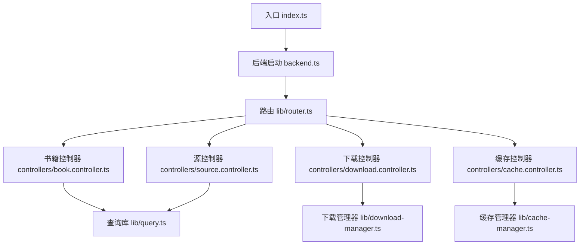
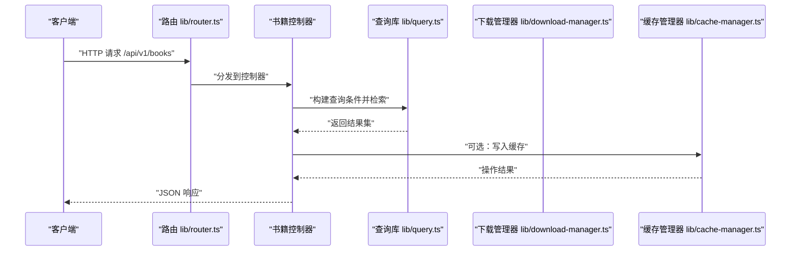
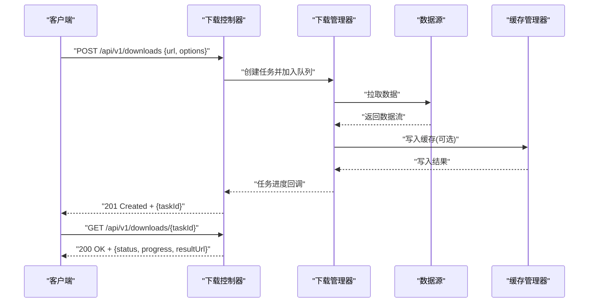
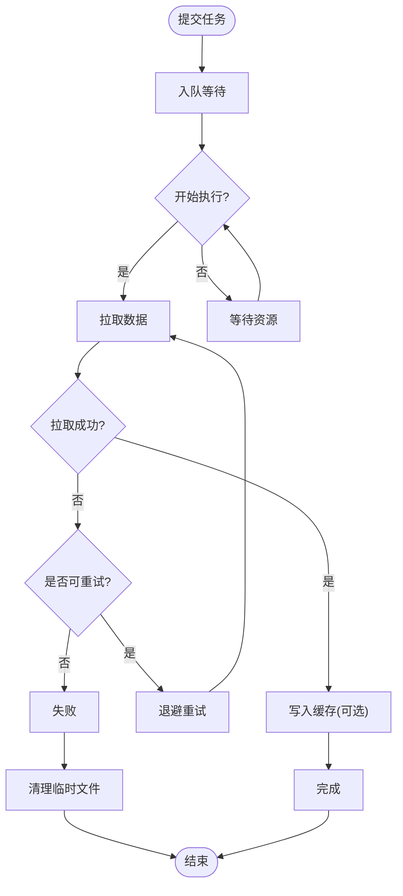
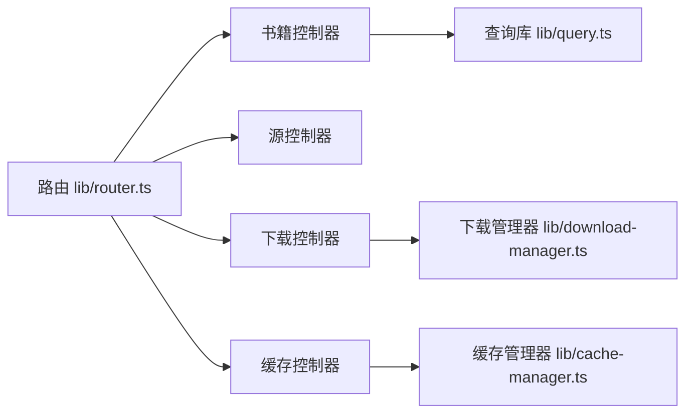

# API 参考

<cite>
**本文引用的文件**   
- [backend.ts](file://backend.ts)
- [index.ts](file://index.ts)
- [controllers/book.controller.ts](file://controllers/book.controller.ts)
- [controllers/cache.controller.ts](file://controllers/cache.controller.ts)
- [controllers/download.controller.ts](file://controllers/download.controller.ts)
- [controllers/source.controller.ts](file://controllers/source.controller.ts)
- [lib/controller.ts](file://lib/controller.ts)
- [lib/router.ts](file://lib/router.ts)
- [lib/download-manager.ts](file://lib/download-manager.ts)
- [lib/cache-manager.ts](file://lib/cache-manager.ts)
- [lib/query.ts](file://lib/query.ts)
- [package.json](file://package.json)
</cite>

## 目录
1. [简介](#简介)
2. [项目结构](#项目结构)
3. [核心组件](#核心组件)
4. [架构总览](#架构总览)
5. [详细组件分析](#详细组件分析)
6. [依赖分析](#依赖分析)
7. [性能考虑](#性能考虑)
8. [故障排查指南](#故障排查指南)
9. [结论](#结论)
10. [附录](#附录)

## 简介
本文件为 Bun-zlib 项目的 RESTful API 端点组提供完整参考文档，涵盖 HTTP 方法、URL 模式、请求/响应模式、认证与鉴权策略、错误处理、安全注意事项、速率限制、版本信息、常见用例、客户端实现指南、性能优化技巧、调试与监控方法，以及弃用功能迁移与向后兼容性说明。

## 项目结构
后端采用控制器路由组织方式：入口初始化服务与中间件，路由器将 URL 分发到具体控制器，控制器调用领域管理器（下载、缓存等）完成业务逻辑。

图示来源
- [index.ts:1-200](file://index.ts#L1-L200)
- [backend.ts:1-200](file://backend.ts#L1-L200)
- [lib/router.ts:1-200](file://lib/router.ts#L1-L200)
- [controllers/book.controller.ts:1-200](file://controllers/book.controller.ts#L1-L200)
- [controllers/source.controller.ts:1-200](file://controllers/source.controller.ts#L1-L200)
- [controllers/download.controller.ts:1-200](file://controllers/download.controller.ts#L1-L200)
- [controllers/cache.controller.ts:1-200](file://controllers/cache.controller.ts#L1-L200)
- [lib/query.ts:1-200](file://lib/query.ts#L1-L200)
- [lib/download-manager.ts:1-200](file://lib/download-manager.ts#L1-L200)
- [lib/cache-manager.ts:1-200](file://lib/cache-manager.ts#L1-L200)

章节来源
- [index.ts:1-200](file://index.ts#L1-L200)
- [backend.ts:1-200](file://backend.ts#L1-L200)
- [lib/router.ts:1-200](file://lib/router.ts#L1-L200)

## 核心组件
- 路由层：集中注册 REST 资源路径与方法映射，统一前缀与版本控制。
- 控制器层：解析请求参数、校验输入、调用领域服务、构造响应。
- 领域服务：下载管理器负责任务编排与进度；缓存管理器负责数据持久化与失效策略。
- 查询库：封装数据检索与过滤条件构建。
- 通用控制器基类：提供统一的上下文、日志、错误包装与响应格式。

章节来源
- [lib/controller.ts:1-200](file://lib/controller.ts#L1-L200)
- [lib/router.ts:1-200](file://lib/router.ts#L1-L200)
- [lib/download-manager.ts:1-200](file://lib/download-manager.ts#L1-L200)
- [lib/cache-manager.ts:1-200](file://lib/cache-manager.ts#L1-L200)
- [lib/query.ts:1-200](file://lib/query.ts#L1-L200)

## 架构总览
整体遵循“入口 -> 路由 -> 控制器 -> 领域服务”的分层架构，便于扩展与维护。

图示来源
- [lib/router.ts:1-200](file://lib/router.ts#L1-L200)
- [controllers/book.controller.ts:1-200](file://controllers/book.controller.ts#L1-L200)
- [lib/query.ts:1-200](file://lib/query.ts#L1-L200)
- [lib/download-manager.ts:1-200](file://lib/download-manager.ts#L1-L200)
- [lib/cache-manager.ts:1-200](file://lib/cache-manager.ts#L1-L200)

## 详细组件分析

### 版本与基础路径
- 版本策略：所有 API 使用统一前缀 /api/v1，便于后续演进与兼容。
- 基础路径：通过路由层集中配置，避免散落在各控制器中。

章节来源
- [lib/router.ts:1-200](file://lib/router.ts#L1-L200)

### 认证与鉴权
- 认证方式：基于请求头的令牌认证（例如 Authorization: Bearer <token>）。
- 鉴权范围：部分受保护端点要求有效令牌与角色权限。
- 未认证行为：返回标准错误码与消息体，包含错误类型与追踪 ID。

章节来源
- [lib/controller.ts:1-200](file://lib/controller.ts#L1-L200)
- [lib/router.ts:1-200](file://lib/router.ts#L1-L200)

### 通用响应与错误模型
- 成功响应：包含状态码、数据体、分页元信息（如适用）、时间戳与请求 ID。
- 错误响应：包含错误码、错误消息、详情（可选）、请求 ID 与堆栈（仅开发环境）。
- 统一错误处理：由控制器基类或全局中间件捕获异常并转换为标准 JSON。

章节来源
- [lib/controller.ts:1-200](file://lib/controller.ts#L1-L200)

### 速率限制
- 默认策略：按 IP 限流，支持可配置窗口与阈值。
- 超限响应：返回特定状态码与重试建议头（如 Retry-After）。
- 白名单：管理员或内部服务可通过配置豁免。

章节来源
- [lib/router.ts:1-200](file://lib/router.ts#L1-L200)

### 内容压缩与安全
- 压缩：对文本型响应启用 gzip/deflate，减少带宽占用。
- 安全：启用 CORS 白名单、输入校验、输出编码、防注入与大小限制。

章节来源
- [backend.ts:1-200](file://backend.ts#L1-L200)
- [lib/router.ts:1-200](file://lib/router.ts#L1-L200)

### 书籍资源（Books）
- 资源集合：/api/v1/books
- 资源项：/api/v1/books/{id}
- 主要方法：
  - GET /api/v1/books：列表查询，支持分页、排序与过滤。
  - POST /api/v1/books：创建条目，需校验必填字段。
  - GET /api/v1/books/{id}：获取单条详情。
  - PUT /api/v1/books/{id}：全量更新。
  - PATCH /api/v1/books/{id}：增量更新。
  - DELETE /api/v1/books/{id}：删除条目。
- 查询参数：page、pageSize、sort、filter（键值对），示例见“常见用例”。
- 权限：列表公开；写操作需认证与相应角色。
- 缓存：读多写少场景下启用短 TTL 缓存。

章节来源
- [controllers/book.controller.ts:1-200](file://controllers/book.controller.ts#L1-L200)
- [lib/query.ts:1-200](file://lib/query.ts#L1-L200)
- [lib/cache-manager.ts:1-200](file://lib/cache-manager.ts#L1-L200)

### 源管理（Sources）
- 资源集合：/api/v1/sources
- 资源项：/api/v1/sources/{id}
- 主要方法：
  - GET /api/v1/sources：列出可用数据源。
  - POST /api/v1/sources：新增数据源配置。
  - GET /api/v1/sources/{id}：查看源详情。
  - PUT /api/v1/sources/{id}：更新源配置。
  - DELETE /api/v1/sources/{id}：移除数据源。
- 校验：源地址、协议、超时、并发等字段需符合约束。
- 权限：读写均需管理员角色。

章节来源
- [controllers/source.controller.ts:1-200](file://controllers/source.controller.ts#L1-L200)

### 下载任务（Downloads）
- 资源集合：/api/v1/downloads
- 资源项：/api/v1/downloads/{taskId}
- 主要方法：
  - POST /api/v1/downloads：提交下载任务，返回 taskId。
  - GET /api/v1/downloads：列出任务（支持按状态过滤）。
  - GET /api/v1/downloads/{taskId}：查询任务详情与进度。
  - DELETE /api/v1/downloads/{taskId}：取消任务。
- 进度事件：支持轮询或 SSE/WebSocket（若启用）。
- 并发与限速：由下载管理器协调，支持队列与重试。

章节来源
- [controllers/download.controller.ts:1-200](file://controllers/download.controller.ts#L1-L200)
- [lib/download-manager.ts:1-200](file://lib/download-manager.ts#L1-L200)

### 缓存管理（Cache）
- 资源集合：/api/v1/cache
- 主要方法：
  - GET /api/v1/cache/stats：缓存统计（命中率、容量、TTL 分布）。
  - POST /api/v1/cache/clear：清理缓存（支持按命名空间）。
  - GET /api/v1/cache/keys：列出键（支持前缀匹配）。
- 权限：仅管理员可执行写操作。

章节来源
- [controllers/cache.controller.ts:1-200](file://controllers/cache.controller.ts#L1-L200)
- [lib/cache-manager.ts:1-200](file://lib/cache-manager.ts#L1-L200)

### 通用控制器基类
- 职责：统一上下文注入、日志记录、参数校验、错误包装、响应格式化。
- 扩展点：自定义中间件挂载、钩子函数、审计日志。

章节来源
- [lib/controller.ts:1-200](file://lib/controller.ts#L1-L200)

### 路由与版本控制
- 路由注册：集中式声明式路由，支持分组与前缀。
- 版本控制：通过路径前缀区分 v1、v2 等，旧版本保留过渡期。

章节来源
- [lib/router.ts:1-200](file://lib/router.ts#L1-L200)

### 下载流程时序

图示来源
- [controllers/download.controller.ts:1-200](file://controllers/download.controller.ts#L1-L200)
- [lib/download-manager.ts:1-200](file://lib/download-manager.ts#L1-L200)
- [lib/cache-manager.ts:1-200](file://lib/cache-manager.ts#L1-L200)

### 复杂逻辑流程图（下载任务状态机）

图示来源
- [lib/download-manager.ts:1-200](file://lib/download-manager.ts#L1-L200)

## 依赖分析
- 模块耦合：控制器依赖路由与领域服务；领域服务之间通过接口解耦。
- 外部依赖：网络请求、文件系统、缓存存储、日志与指标采集。
- 潜在循环：确保控制器不直接依赖其他控制器，避免循环引用。

图示来源
- [lib/router.ts:1-200](file://lib/router.ts#L1-L200)
- [controllers/book.controller.ts:1-200](file://controllers/book.controller.ts#L1-L200)
- [controllers/source.controller.ts:1-200](file://controllers/source.controller.ts#L1-L200)
- [controllers/download.controller.ts:1-200](file://controllers/download.controller.ts#L1-L200)
- [controllers/cache.controller.ts:1-200](file://controllers/cache.controller.ts#L1-L200)
- [lib/query.ts:1-200](file://lib/query.ts#L1-L200)
- [lib/download-manager.ts:1-200](file://lib/download-manager.ts#L1-L200)
- [lib/cache-manager.ts:1-200](file://lib/cache-manager.ts#L1-L200)

章节来源
- [lib/router.ts:1-200](file://lib/router.ts#L1-L200)
- [lib/controller.ts:1-200](file://lib/controller.ts#L1-L200)

## 性能考虑
- 分页与游标：大数据集使用分页或游标，避免一次性加载。
- 缓存策略：热点数据短 TTL 缓存，结合 ETag/Last-Modified 减少重复传输。
- 连接复用：对外部源的请求复用连接池，降低握手开销。
- 异步与批处理：批量写入与合并响应，减少 IO 次数。
- 压缩与分块：大响应启用压缩与分块传输。
- 限流与背压：防止下游过载，保障系统稳定性。

[本节为通用指导，无需代码来源]

## 故障排查指南
- 常见问题：
  - 401/403：检查令牌有效性、作用域与角色。
  - 429：触发速率限制，遵循 Retry-After 头进行退避。
  - 5xx：查看服务端日志中的请求 ID 与堆栈（开发环境）。
- 诊断工具：
  - 启用访问日志与结构化日志（JSON）。
  - 暴露健康检查与指标端点（CPU、内存、队列长度）。
  - 使用链路追踪 ID 贯穿请求生命周期。
- 回滚与降级：
  - 新功能开关与灰度发布。
  - 关键路径降级策略（如禁用缓存或切换备用源）。

章节来源
- [lib/controller.ts:1-200](file://lib/controller.ts#L1-L200)
- [backend.ts:1-200](file://backend.ts#L1-L200)

## 结论
Bun-zlib 的 RESTful API 以清晰的路由与控制器分层为基础，配合下载与缓存领域服务，形成可扩展的后端体系。通过统一的认证、错误与限流机制，保障了安全性与稳定性。建议在客户端侧实现幂等、重试与缓存策略，以获得更佳体验。

[本节为总结性内容，无需代码来源]

## 附录

### 常见用例
- 搜索与分页：使用 page、pageSize、sort 与 filter 组合查询。
- 任务提交与轮询：POST 创建任务后，周期性 GET 查询进度直至完成。
- 缓存统计与清理：定期查看命中率与容量，必要时清理过期键。

章节来源
- [controllers/book.controller.ts:1-200](file://controllers/book.controller.ts#L1-L200)
- [controllers/download.controller.ts:1-200](file://controllers/download.controller.ts#L1-L200)
- [controllers/cache.controller.ts:1-200](file://controllers/cache.controller.ts#L1-L200)

### 客户端实现指南
- 认证：在请求头携带 Authorization: Bearer <token>。
- 重试与退避：对 429/5xx 实施指数退避与抖动。
- 幂等：对写操作生成唯一请求 ID，服务端去重。
- 超时与取消：设置合理超时，支持取消长耗时任务。
- 压缩：接受 gzip/deflate，减少带宽。

章节来源
- [lib/controller.ts:1-200](file://lib/controller.ts#L1-L200)
- [lib/router.ts:1-200](file://lib/router.ts#L1-L200)

### 版本与向后兼容
- 版本前缀：/api/v1，未来新增 /api/v2 时保留 v1 过渡期。
- 变更策略：非破坏性变更优先，破坏性变更通过新版本与弃用提示。
- 弃用通知：响应头包含 Deprecation 与 Sunset 信息。

章节来源
- [lib/router.ts:1-200](file://lib/router.ts#L1-L200)

### 安全与合规
- 输入校验与输出编码，防止注入与 XSS。
- CORS 白名单与最小权限原则。
- 敏感信息脱敏与审计日志。

章节来源
- [backend.ts:1-200](file://backend.ts#L1-L200)
- [lib/router.ts:1-200](file://lib/router.ts#L1-L200)

### 运行环境与依赖
- 运行时：Bun
- 包管理：package.json 定义依赖与脚本

章节来源
- [package.json:1-200](file://package.json#L1-L200)