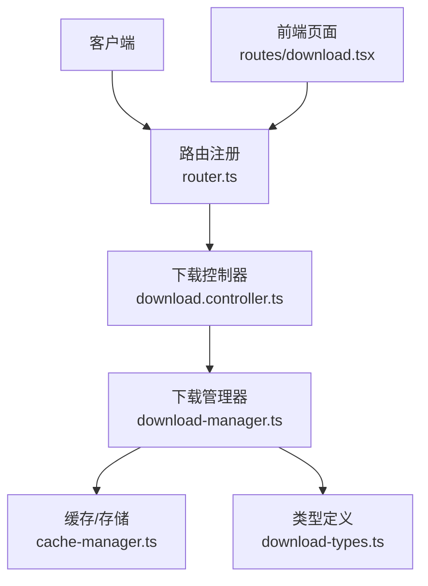
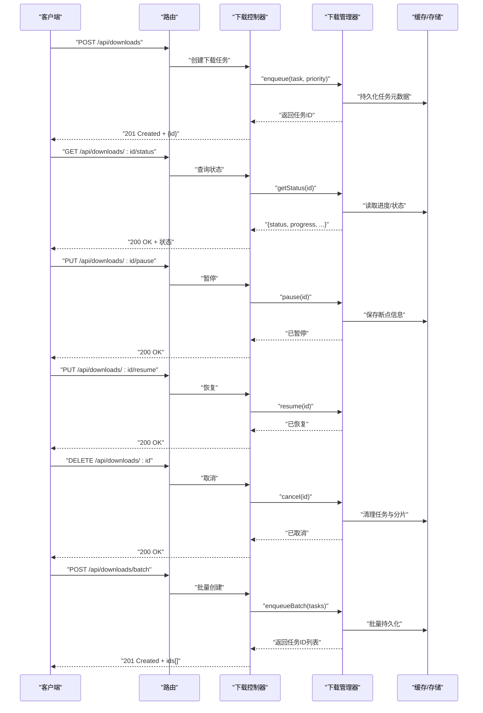
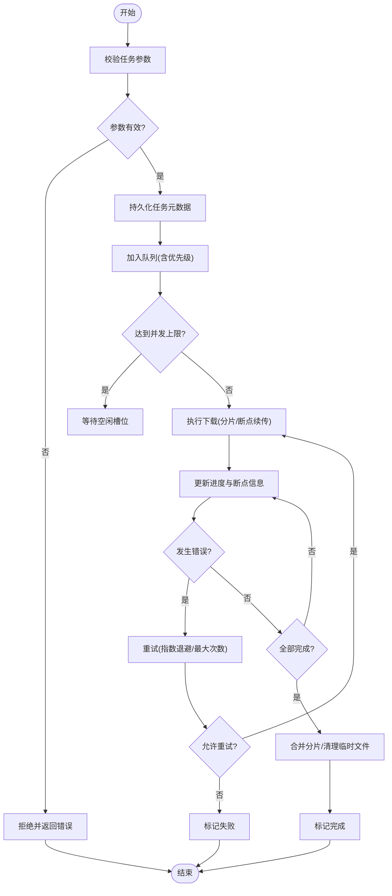
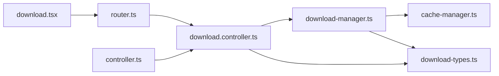

# 下载管理 API

<cite>
**本文引用的文件**   
- [download.controller.ts](file://controllers/download.controller.ts)
- [download-manager.ts](file://lib/download-manager.ts)
- [download-types.ts](file://lib/download-types.ts)
- [cache-manager.ts](file://lib/cache-manager.ts)
- [router.ts](file://lib/router.ts)
- [controller.ts](file://lib/controller.ts)
- [download.tsx](file://routes/download.tsx)
</cite>

## 目录
1. [简介](#简介)
2. [项目结构](#项目结构)
3. [核心组件](#核心组件)
4. [架构总览](#架构总览)
5. [详细组件分析](#详细组件分析)
6. [依赖关系分析](#依赖关系分析)
7. [性能考虑](#性能考虑)
8. [故障排查指南](#故障排查指南)
9. [结论](#结论)
10. [附录](#附录)

## 简介
本文件为“下载管理控制器”的 API 文档，覆盖所有与下载相关的 HTTP 端点与行为，包括创建下载任务、查询状态、暂停/恢复、取消、批量下载等。同时说明任务的优先级设置、并发控制、进度跟踪机制，以及队列管理、错误重试策略和断点续传能力。文末提供性能优化建议、常见问题解决方案以及与下载管理器的集成模式。

## 项目结构
与下载功能直接相关的代码主要分布在以下位置：
- 控制器层：处理 HTTP 请求与响应
- 业务逻辑层：下载管理器负责任务编排、并发控制、队列与持久化
- 类型定义：统一的数据模型与状态枚举
- 路由注册：将控制器方法挂载到具体路径
- 前端页面：展示下载列表与交互入口

图表来源
- [router.ts](file://lib/router.ts)
- [download.controller.ts](file://controllers/download.controller.ts)
- [download-manager.ts](file://lib/download-manager.ts)
- [cache-manager.ts](file://lib/cache-manager.ts)
- [download-types.ts](file://lib/download-types.ts)
- [download.tsx](file://routes/download.tsx)

章节来源
- [download.controller.ts](file://controllers/download.controller.ts)
- [download-manager.ts](file://lib/download-manager.ts)
- [download-types.ts](file://lib/download-types.ts)
- [cache-manager.ts](file://lib/cache-manager.ts)
- [router.ts](file://lib/router.ts)
- [download.tsx](file://routes/download.tsx)

## 核心组件
- 下载控制器：暴露 RESTful 接口，接收并校验参数，调用下载管理器执行操作，返回统一响应格式。
- 下载管理器：维护下载队列、并发限制、任务生命周期（新建、排队、运行、暂停、恢复、完成、失败）、进度计算、重试与断点续传。
- 类型定义：任务状态、优先级、进度、错误码等结构化数据。
- 缓存/存储：持久化任务元数据、分片信息与进度，支持断点续传。
- 路由注册：将控制器方法映射到 HTTP 路径。

章节来源
- [download.controller.ts](file://controllers/download.controller.ts)
- [download-manager.ts](file://lib/download-manager.ts)
- [download-types.ts](file://lib/download-types.ts)
- [cache-manager.ts](file://lib/cache-manager.ts)
- [router.ts](file://lib/router.ts)

## 架构总览
下载流程从客户端发起请求开始，经路由分发至控制器，再由控制器委托给下载管理器进行任务调度与执行。下载管理器通过缓存/存储模块实现任务持久化与断点续传，并通过类型定义保证数据结构一致性。

图表来源
- [download.controller.ts](file://controllers/download.controller.ts)
- [download-manager.ts](file://lib/download-manager.ts)
- [cache-manager.ts](file://lib/cache-manager.ts)

## 详细组件分析

### 下载控制器 API
- 创建下载任务
  - 方法：POST
  - 路径：/api/downloads
  - 请求体字段：源地址、目标路径、优先级、是否启用断点续传、并发子任务数等
  - 响应：任务ID、初始状态
- 查询下载状态
  - 方法：GET
  - 路径：/api/downloads/:id/status
  - 响应：任务状态、进度百分比、已完成字节数、剩余时间估算、错误信息（如有）
- 暂停下载
  - 方法：PUT
  - 路径：/api/downloads/:id/pause
  - 响应：确认已暂停
- 恢复下载
  - 方法：PUT
  - 路径：/api/downloads/:id/resume
  - 响应：确认已恢复
- 取消下载
  - 方法：DELETE
  - 路径：/api/downloads/:id
  - 响应：确认已取消
- 批量下载
  - 方法：POST
  - 路径：/api/downloads/batch
  - 请求体：任务数组（每项包含源地址、目标路径、优先级等）
  - 响应：任务ID列表

注意：
- 优先级取值范围与语义以类型定义为准，通常高优先级先入队或优先调度。
- 并发控制由下载管理器内部实现，可通过请求参数影响单个任务的子并发度。
- 进度跟踪基于已下载字节数与总大小计算，支持断点续传时按分片累计。

章节来源
- [download.controller.ts](file://controllers/download.controller.ts)
- [download-types.ts](file://lib/download-types.ts)

### 下载管理器
职责：
- 任务队列：维护待执行、运行中、暂停、完成、失败的任务集合。
- 并发控制：全局并发上限与单任务子并发度。
- 优先级调度：根据优先级决定入队顺序与抢占策略。
- 进度跟踪：实时计算与持久化进度，支持断点续传。
- 错误重试：指数退避、最大重试次数、可配置的重试条件。
- 断点续传：记录分片偏移量，支持网络中断后继续。

关键流程：
- 入队：校验任务参数，写入持久化，分配优先级权重。
- 调度：按优先级与并发限制选择下一个任务执行。
- 执行：建立连接，按需分片下载，更新进度与断点信息。
- 异常处理：捕获网络/IO错误，触发重试或标记失败。
- 完成：合并分片，清理临时文件，更新最终状态。

图表来源
- [download-manager.ts](file://lib/download-manager.ts)
- [cache-manager.ts](file://lib/cache-manager.ts)
- [download-types.ts](file://lib/download-types.ts)

章节来源
- [download-manager.ts](file://lib/download-manager.ts)
- [cache-manager.ts](file://lib/cache-manager.ts)
- [download-types.ts](file://lib/download-types.ts)

### 类型定义
- 任务状态：新建、排队、运行、暂停、恢复、完成、失败、取消。
- 优先级：低、普通、高；数值越大优先级越高（或相反，以实现为准）。
- 进度对象：已下载字节、总字节、百分比、当前分片索引、最后更新时间。
- 错误码：网络超时、权限不足、磁盘空间不足、分片损坏等。

章节来源
- [download-types.ts](file://lib/download-types.ts)

### 缓存/存储
- 任务元数据：任务ID、源地址、目标路径、优先级、状态、创建/更新时间。
- 进度与断点：分片大小、每个分片的偏移量、校验和（可选）。
- 重试记录：上次失败原因、重试次数、下次重试时间。
- 持久化策略：内存+磁盘双写，确保重启后可恢复。

章节来源
- [cache-manager.ts](file://lib/cache-manager.ts)

### 路由注册
- 将控制器方法映射到具体路径，如 /api/downloads、/api/downloads/:id/status、/api/downloads/batch 等。
- 统一中间件：鉴权、限流、日志记录。

章节来源
- [router.ts](file://lib/router.ts)
- [controller.ts](file://lib/controller.ts)

### 前端集成
- 页面提供下载列表、进度条、操作按钮（暂停/恢复/取消）。
- 轮询或事件推送获取任务状态与进度。
- 批量创建任务时显示结果与错误汇总。

章节来源
- [download.tsx](file://routes/download.tsx)

## 依赖关系分析
- 控制器依赖下载管理器与类型定义。
- 下载管理器依赖缓存/存储与类型定义。
- 路由注册依赖控制器与通用控制器基类。
- 前端页面依赖路由与控制器暴露的接口。

图表来源
- [download.controller.ts](file://controllers/download.controller.ts)
- [download-manager.ts](file://lib/download-manager.ts)
- [download-types.ts](file://lib/download-types.ts)
- [cache-manager.ts](file://lib/cache-manager.ts)
- [router.ts](file://lib/router.ts)
- [controller.ts](file://lib/controller.ts)
- [download.tsx](file://routes/download.tsx)

章节来源
- [download.controller.ts](file://controllers/download.controller.ts)
- [download-manager.ts](file://lib/download-manager.ts)
- [download-types.ts](file://lib/download-types.ts)
- [cache-manager.ts](file://lib/cache-manager.ts)
- [router.ts](file://lib/router.ts)
- [controller.ts](file://lib/controller.ts)
- [download.tsx](file://routes/download.tsx)

## 性能考虑
- 并发控制
  - 全局并发上限：避免过多任务同时占用带宽与I/O。
  - 单任务子并发：大文件分片并行下载，提高吞吐。
- 优先级调度
  - 高优先级任务优先入队与调度，必要时可抢占低优先级任务。
- 断点续传
  - 合理分片大小：平衡重传开销与传输效率。
  - 增量更新：仅更新变化分片，减少重复传输。
- 重试策略
  - 指数退避：避免雪崩效应。
  - 最大重试次数：防止无限重试导致资源耗尽。
- 存储优化
  - 预分配文件：减少碎片与扩容开销。
  - 异步落盘：降低主线程阻塞。
- 监控与指标
  - 记录吞吐、延迟、错误率、重试次数，用于调优。

[本节为通用指导，不直接分析具体文件]

## 故障排查指南
- 常见错误
  - 网络超时：检查网络连通性与代理设置，调整超时阈值。
  - 磁盘空间不足：清理目标目录或扩大存储空间。
  - 权限问题：确认读写权限与路径合法性。
  - 分片损坏：校验和失败时重新下载对应分片。
- 定位步骤
  - 查看任务状态与错误码。
  - 检查重试记录与下次重试时间。
  - 验证断点信息是否完整。
- 恢复措施
  - 暂停后恢复：确保断点信息存在且未过期。
  - 取消后重建：删除旧任务与临时文件，重新创建任务。
  - 批量失败：逐个重试并记录失败原因。

章节来源
- [download-manager.ts](file://lib/download-manager.ts)
- [cache-manager.ts](file://lib/cache-manager.ts)
- [download-types.ts](file://lib/download-types.ts)

## 结论
下载管理 API 提供了完整的下载生命周期管理能力，涵盖任务创建、状态查询、暂停/恢复、取消与批量操作。通过优先级调度、并发控制、进度跟踪、错误重试与断点续传，系统在高负载与不稳定网络环境下仍能保持稳健与高效。结合性能优化建议与故障排查指南，可有效提升用户体验与系统可靠性。

[本节为总结性内容，不直接分析具体文件]

## 附录
- 术语
  - 任务：一次下载操作的抽象，包含源地址、目标路径、优先级等。
  - 分片：将大文件切分为多个片段，便于并行与断点续传。
  - 断点续传：在网络中断后从上次位置继续下载。
- 最佳实践
  - 合理设置全局并发与单任务子并发。
  - 使用高优先级处理紧急任务，避免饥饿。
  - 定期清理失败与取消任务，释放资源。
  - 对关键任务开启校验和与重试保护。

[本节为补充信息，不直接分析具体文件]