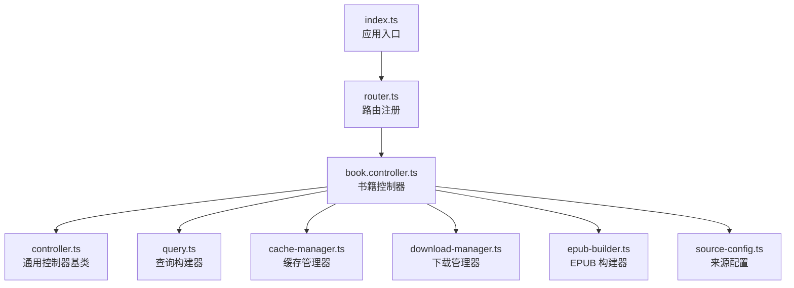
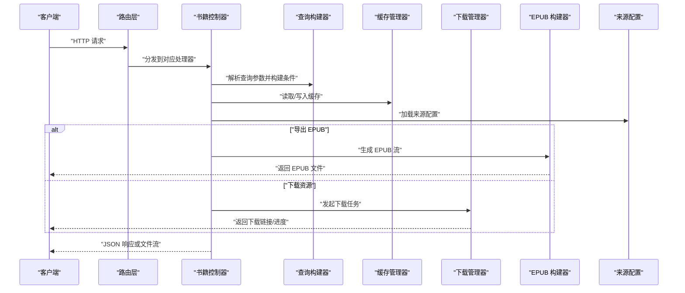
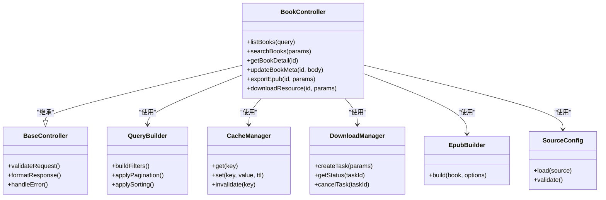

# 书籍管理 API

<cite>
**本文引用的文件**   
- [book.controller.ts](file://controllers/book.controller.ts)
- [controller.ts](file://lib/controller.ts)
- [router.ts](file://lib/router.ts)
- [query.ts](file://lib/query.ts)
- [cache-manager.ts](file://lib/cache-manager.ts)
- [download-manager.ts](file://lib/download-manager.ts)
- [epub-builder.ts](file://lib/epub-builder.ts)
- [source-config.ts](file://lib/source-config.ts)
- [index.ts](file://index.ts)
</cite>

## 目录
1. [简介](#简介)
2. [项目结构](#项目结构)
3. [核心组件](#核心组件)
4. [架构总览](#架构总览)
5. [详细组件分析](#详细组件分析)
6. [依赖关系分析](#依赖关系分析)
7. [性能考虑](#性能考虑)
8. [故障排查指南](#故障排查指南)
9. [结论](#结论)
10. [附录](#附录)

## 简介
本文件为“书籍管理”相关 HTTP 端点的权威文档，覆盖以下能力：
- 获取书籍列表（支持分页、排序与过滤）
- 搜索书籍（关键词、标签、来源等维度）
- 获取书籍详情（元数据、章节信息、封面等）
- 更新书籍元数据（标题、作者、描述、标签等）
- 导出书籍为 EPUB（可选）
- 下载书籍资源（按章节或整包）

文档包含每个端点的请求方法、URL 路径、查询参数、请求体、响应格式、错误码说明，并提供常见使用场景示例与最佳实践。

## 项目结构
本项目采用控制器路由模式组织后端接口，书籍相关的核心逻辑集中在控制器层，并通过通用控制器基类与路由器进行注册与分发。

图表来源
- [index.ts](file://index.ts)
- [router.ts](file://lib/router.ts)
- [book.controller.ts](file://controllers/book.controller.ts)
- [controller.ts](file://lib/controller.ts)
- [query.ts](file://lib/query.ts)
- [cache-manager.ts](file://lib/cache-manager.ts)
- [download-manager.ts](file://lib/download-manager.ts)
- [epub-builder.ts](file://lib/epub-builder.ts)
- [source-config.ts](file://lib/source-config.ts)

章节来源
- [index.ts](file://index.ts)
- [router.ts](file://lib/router.ts)
- [book.controller.ts](file://controllers/book.controller.ts)

## 核心组件
- 书籍控制器：实现所有书籍相关的 HTTP 处理逻辑，包括列表、搜索、详情、更新、导出与下载。
- 通用控制器基类：提供统一的上下文、校验、错误封装与响应格式化能力。
- 查询构建器：用于构造复杂查询条件（分页、排序、过滤）。
- 缓存管理器：对热点数据进行缓存，降低重复计算与外部调用开销。
- 下载管理器：负责分片/整包下载、断点续传与进度回调。
- EPUB 构建器：将书籍内容打包为 EPUB 标准格式。
- 来源配置：集中管理不同来源的访问策略与认证信息。

章节来源
- [book.controller.ts](file://controllers/book.controller.ts)
- [controller.ts](file://lib/controller.ts)
- [query.ts](file://lib/query.ts)
- [cache-manager.ts](file://lib/cache-manager.ts)
- [download-manager.ts](file://lib/download-manager.ts)
- [epub-builder.ts](file://lib/epub-builder.ts)
- [source-config.ts](file://lib/source-config.ts)

## 架构总览
下图展示了客户端到服务器端的请求处理流程，以及控制器与各子系统的交互关系。

图表来源
- [router.ts](file://lib/router.ts)
- [book.controller.ts](file://controllers/book.controller.ts)
- [query.ts](file://lib/query.ts)
- [cache-manager.ts](file://lib/cache-manager.ts)
- [download-manager.ts](file://lib/download-manager.ts)
- [epub-builder.ts](file://lib/epub-builder.ts)
- [source-config.ts](file://lib/source-config.ts)

## 详细组件分析

### 书籍控制器 API 定义
以下为书籍管理相关的所有 HTTP 端点规范。

#### 1) 获取书籍列表
- 方法：GET
- 路径：/api/books
- 查询参数：
  - page: 页码，默认 1
  - size: 每页数量，默认 20，最大 100
  - sort: 排序字段，如 created_at、updated_at、title
  - order: asc 或 desc
  - q: 全文检索关键词（可选）
  - tag: 标签过滤，可多次出现
  - source: 来源标识过滤（可选）
  - status: 状态过滤（可选）
- 成功响应：
  - 200 OK
  - 响应体：
    - data: 数组，元素为书籍对象
    - total: 总数
    - page: 当前页
    - size: 每页大小
- 错误响应：
  - 400 Bad Request：参数校验失败
  - 500 Internal Server Error：服务器内部错误

示例请求
- GET /api/books?page=1&size=20&sort=created_at&order=desc&q=科幻&tag=小说&source=web

示例响应
- {
  "data": [/* 书籍对象数组 */],
  "total": 120,
  "page": 1,
  "size": 20
}

章节来源
- [book.controller.ts](file://controllers/book.controller.ts)
- [query.ts](file://lib/query.ts)

#### 2) 搜索书籍
- 方法：GET
- 路径：/api/books/search
- 查询参数：
  - q: 必填，搜索关键词
  - fields: 指定搜索字段，如 title、author、description、tags
  - fuzzy: 是否模糊匹配，布尔值
  - limit: 结果上限，默认 50
- 成功响应：
  - 200 OK
  - 响应体：
    - results: 搜索结果数组
    - query: 原始查询字符串
    - took_ms: 耗时毫秒数
- 错误响应：
  - 400 Bad Request：缺少必要参数或参数非法
  - 500 Internal Server Error：服务器内部错误

示例请求
- GET /api/books/search?q=三体&fields=title,author&fuzzy=true&limit=10

示例响应
- {
  "results": [/* 书籍对象数组 */],
  "query": "三体",
  "took_ms": 12
}

章节来源
- [book.controller.ts](file://controllers/book.controller.ts)

#### 3) 获取书籍详情
- 方法：GET
- 路径：/api/books/:id
- 路径参数：
  - id: 书籍唯一标识
- 成功响应：
  - 200 OK
  - 响应体：书籍对象，包含元数据、章节列表、封面 URL、来源信息等
- 错误响应：
  - 404 Not Found：未找到该书籍
  - 500 Internal Server Error：服务器内部错误

示例请求
- GET /api/books/abc123

示例响应
- {
  "id": "abc123",
  "title": "示例书名",
  "author": "作者名",
  "description": "书籍描述",
  "tags": ["小说", "科幻"],
  "cover_url": "https://example.com/cover.jpg",
  "chapters": [/* 章节对象数组 */],
  "source": "web",
  "status": "available"
}

章节来源
- [book.controller.ts](file://controllers/book.controller.ts)

#### 4) 更新书籍元数据
- 方法：PUT
- 路径：/api/books/:id
- 路径参数：
  - id: 书籍唯一标识
- 请求体：
  - title: 标题（可选）
  - author: 作者（可选）
  - description: 描述（可选）
  - tags: 标签数组（可选）
  - cover_url: 封面 URL（可选）
  - status: 状态（可选）
- 成功响应：
  - 200 OK
  - 响应体：更新后的书籍对象
- 错误响应：
  - 400 Bad Request：请求体验证失败
  - 404 Not Found：未找到该书籍
  - 500 Internal Server Error：服务器内部错误

示例请求
- PUT /api/books/abc123
- 请求体：
  - {
    "title": "新标题",
    "tags": ["小说", "科幻", "经典"]
  }

示例响应
- {
  "id": "abc123",
  "title": "新标题",
  "author": "作者名",
  "description": "书籍描述",
  "tags": ["小说", "科幻", "经典"],
  "cover_url": "https://example.com/cover.jpg",
  "chapters": [/* 章节对象数组 */],
  "source": "web",
  "status": "available"
}

章节来源
- [book.controller.ts](file://controllers/book.controller.ts)

#### 5) 导出书籍为 EPUB
- 方法：POST
- 路径：/api/books/:id/export/epub
- 路径参数：
  - id: 书籍唯一标识
- 查询参数：
  - chapters: 章节 ID 列表，逗号分隔（可选，不传则导出全部）
  - quality: 图片质量，数值范围（可选）
- 成功响应：
  - 200 OK
  - 响应体：二进制 EPUB 文件流
  - 响应头：Content-Type 为 application/epub+zip；Content-Disposition 建议包含文件名
- 错误响应：
  - 404 Not Found：未找到该书籍
  - 400 Bad Request：参数校验失败
  - 500 Internal Server Error：服务器内部错误

示例请求
- POST /api/books/abc123/export/epub?chapters=ch1,ch2&quality=80

示例响应
- 二进制流（浏览器可直接保存为 .epub 文件）

章节来源
- [book.controller.ts](file://controllers/book.controller.ts)
- [epub-builder.ts](file://lib/epub-builder.ts)

#### 6) 下载书籍资源
- 方法：POST
- 路径：/api/books/:id/download
- 路径参数：
  - id: 书籍唯一标识
- 查询参数：
  - mode: all 或 chapter（可选，默认 all）
  - chapters: 章节 ID 列表，逗号分隔（mode=chapter 时有效）
- 成功响应：
  - 200 OK
  - 响应体：下载任务对象
    - task_id: 任务标识
    - status: pending、processing、completed、failed
    - progress: 进度百分比
    - download_url: 完成后可下载的 URL（当 completed 时）
- 错误响应：
  - 404 Not Found：未找到该书籍
  - 400 Bad Request：参数校验失败
  - 500 Internal Server Error：服务器内部错误

示例请求
- POST /api/books/abc123/download?mode=all

示例响应
- {
  "task_id": "dl_98765",
  "status": "pending",
  "progress": 0,
  "download_url": null
}

章节来源
- [book.controller.ts](file://controllers/book.controller.ts)
- [download-manager.ts](file://lib/download-manager.ts)

### 书籍模型数据结构
- id: 字符串，唯一标识
- title: 字符串，标题
- author: 字符串，作者
- description: 文本，描述
- tags: 字符串数组，标签集合
- cover_url: 字符串，封面图片 URL
- chapters: 章节对象数组
  - id: 字符串，章节唯一标识
  - title: 字符串，章节标题
  - content_url: 字符串，内容地址
  - order: 数字，顺序号
- source: 字符串，来源标识
- status: 枚举，状态（如 available、archived、deleted）

章节来源
- [book.controller.ts](file://controllers/book.controller.ts)

### 与其他组件的集成方式
- 查询构建器：在列表与搜索接口中统一解析查询参数，生成高效查询条件。
- 缓存管理器：对热门书籍详情与搜索结果进行缓存，减少数据库压力。
- 下载管理器：异步处理大体积资源下载，提供任务状态查询与断点续传。
- EPUB 构建器：将书籍内容与元数据打包为标准 EPUB 格式，便于阅读与归档。
- 来源配置：集中管理各来源的访问策略、认证信息与限流规则。

章节来源
- [query.ts](file://lib/query.ts)
- [cache-manager.ts](file://lib/cache-manager.ts)
- [download-manager.ts](file://lib/download-manager.ts)
- [epub-builder.ts](file://lib/epub-builder.ts)
- [source-config.ts](file://lib/source-config.ts)

## 依赖关系分析
书籍控制器依赖多个子系统以完成业务功能，整体耦合度适中，职责清晰。

图表来源
- [book.controller.ts](file://controllers/book.controller.ts)
- [controller.ts](file://lib/controller.ts)
- [query.ts](file://lib/query.ts)
- [cache-manager.ts](file://lib/cache-manager.ts)
- [download-manager.ts](file://lib/download-manager.ts)
- [epub-builder.ts](file://lib/epub-builder.ts)
- [source-config.ts](file://lib/source-config.ts)

章节来源
- [book.controller.ts](file://controllers/book.controller.ts)
- [controller.ts](file://lib/controller.ts)
- [query.ts](file://lib/query.ts)
- [cache-manager.ts](file://lib/cache-manager.ts)
- [download-manager.ts](file://lib/download-manager.ts)
- [epub-builder.ts](file://lib/epub-builder.ts)
- [source-config.ts](file://lib/source-config.ts)

## 性能考虑
- 分页与排序：合理设置 page 与 size，避免一次性拉取大量数据；优先使用索引字段排序。
- 缓存策略：对高频访问的书籍详情与搜索结果启用短期缓存，注意失效时机。
- 搜索优化：限制 fields 与 limit，避免全表扫描；必要时引入专用搜索引擎。
- 下载任务：采用异步任务队列，支持进度查询与取消；对大文件进行分块传输。
- EPUB 构建：按需导出章节，控制图片质量以减少体积与构建时间。

[本节为通用指导，无需特定文件引用]

## 故障排查指南
- 参数校验失败（400）：检查查询参数类型与取值范围，确保必填字段存在。
- 资源不存在（404）：确认书籍 ID 是否正确，来源配置是否可用。
- 服务器内部错误（500）：查看日志定位具体异常，关注缓存、下载与构建模块的错误堆栈。
- 下载任务长时间 pending：检查任务队列健康状态与存储介质可用性。
- EPUB 导出失败：验证章节内容与图片资源完整性，调整质量参数重试。

章节来源
- [book.controller.ts](file://controllers/book.controller.ts)
- [controller.ts](file://lib/controller.ts)
- [download-manager.ts](file://lib/download-manager.ts)
- [epub-builder.ts](file://lib/epub-builder.ts)

## 结论
本书籍管理 API 提供了完整的书籍生命周期管理能力，涵盖查询、检索、详情、更新、导出与下载。通过清晰的控制器分层与模块化设计，系统具备良好的可扩展性与可维护性。建议在生产环境结合缓存与异步任务提升性能，并完善监控与告警机制。

[本节为总结性内容，无需特定文件引用]

## 附录

### 常见使用场景与最佳实践
- 批量导入与同步：定期从来源配置拉取新书，合并本地元数据，避免重复条目。
- 用户检索体验：前端组合多条件查询，展示分页与排序控件，提供搜索建议与高亮。
- 离线阅读：优先导出 EPUB，配合阅读器进行离线阅读；对大书库采用增量导出。
- 下载稳定性：实现重试与断点续传，记录任务历史以便回溯。
- 安全与权限：对敏感操作（更新、删除）增加鉴权与审计日志。

[本节为概念性内容，无需特定文件引用]