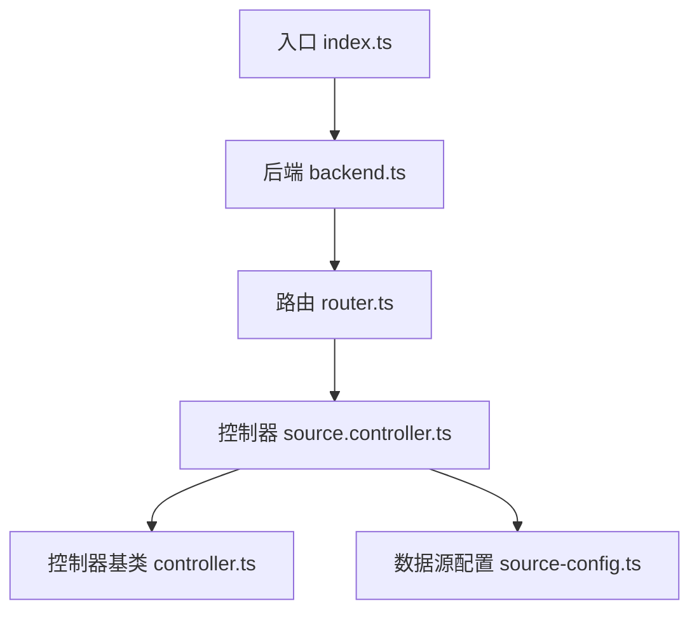
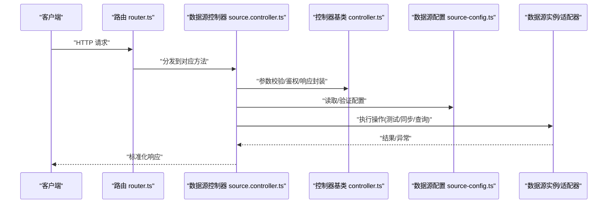
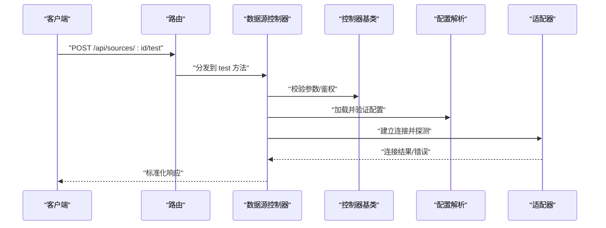
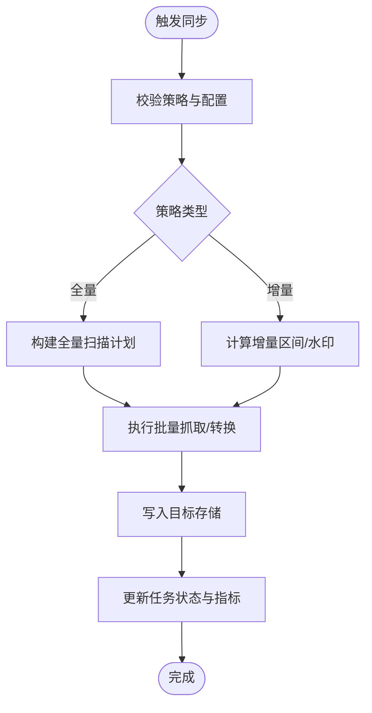
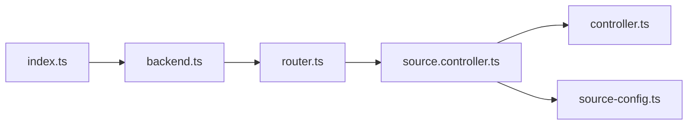

# 数据源管理 API

<cite>
**本文引用的文件**   
- [source.controller.ts](file://controllers/source.controller.ts)
- [source-config.ts](file://lib/source-config.ts)
- [controller.ts](file://lib/controller.ts)
- [router.ts](file://lib/router.ts)
- [backend.ts](file://backend.ts)
- [index.ts](file://index.ts)
</cite>

## 目录
1. [简介](#简介)
2. [项目结构](#项目结构)
3. [核心组件](#核心组件)
4. [架构总览](#架构总览)
5. [详细组件分析](#详细组件分析)
6. [依赖关系分析](#依赖关系分析)
7. [性能考虑](#性能考虑)
8. [故障诊断指南](#故障诊断指南)
9. [结论](#结论)
10. [附录](#附录)

## 简介
本文件为“数据源管理控制器”的 API 文档，聚焦于数据源的配置、同步、连接测试与信息获取等能力。文档同时覆盖数据源插件开发指南、自定义数据源实现方法、性能调优建议与故障诊断工具使用方法，以及与源配置系统的集成方式。读者无需深入源码即可理解并正确使用相关接口。

## 项目结构
本项目采用分层组织：控制器负责 HTTP 路由与请求处理，库层提供通用控制器基类、路由注册以及数据源配置解析等能力；入口文件负责启动服务与挂载路由。

图表来源
- [index.ts:1-200](file://index.ts#L1-L200)
- [backend.ts:1-200](file://backend.ts#L1-L200)
- [router.ts:1-200](file://router.ts#L1-L200)
- [source.controller.ts:1-200](file://controllers/source.controller.ts#L1-L200)
- [controller.ts:1-200](file://lib/controller.ts#L1-L200)
- [source-config.ts:1-200](file://lib/source-config.ts#L1-L200)

章节来源
- [index.ts:1-200](file://index.ts#L1-L200)
- [backend.ts:1-200](file://backend.ts#L1-L200)
- [router.ts:1-200](file://router.ts#L1-L200)
- [source.controller.ts:1-200](file://controllers/source.controller.ts#L1-L200)
- [controller.ts:1-200](file://lib/controller.ts#L1-L200)
- [source-config.ts:1-200](file://lib/source-config.ts#L1-L200)

## 核心组件
- 数据源控制器：暴露数据源相关的 HTTP 端点，包括创建/更新/删除/查询数据源、测试连接、触发同步、获取状态与日志等。
- 控制器基类：统一响应封装、错误处理、参数校验与鉴权扩展点。
- 路由注册：将控制器方法与路径绑定，形成对外 API。
- 数据源配置：定义数据源配置的字段、校验规则与默认值，支撑配置解析与持久化。

章节来源
- [source.controller.ts:1-200](file://controllers/source.controller.ts#L1-L200)
- [controller.ts:1-200](file://lib/controller.ts#L1-L200)
- [router.ts:1-200](file://router.ts#L1-L200)
- [source-config.ts:1-200](file://lib/source-config.ts#L1-L200)

## 架构总览
下图展示了从客户端到数据源控制器的调用链路，以及控制器对配置系统与底层数据源的交互。

图表来源
- [router.ts:1-200](file://router.ts#L1-L200)
- [source.controller.ts:1-200](file://controllers/source.controller.ts#L1-L200)
- [controller.ts:1-200](file://lib/controller.ts#L1-L200)
- [source-config.ts:1-200](file://lib/source-config.ts#L1-L200)

## 详细组件分析

### 数据源管理 API 端点
以下端点由数据源控制器提供，用于管理数据源生命周期与运行态信息。所有端点均通过路由注册暴露。

- 列表与详情
  - GET /api/sources
    - 功能：分页或过滤列出数据源
    - 查询参数：page、pageSize、keyword、type、status
    - 成功响应：包含数据源列表与分页元信息
    - 错误码：400（参数非法）、500（内部错误）
  - GET /api/sources/:id
    - 功能：获取指定数据源详情
    - 路径参数：id
    - 成功响应：数据源完整配置与运行状态
    - 错误码：404（不存在）、500（内部错误）

- 创建与更新
  - POST /api/sources
    - 功能：新增数据源
    - 请求体：遵循数据源配置格式（见下节）
    - 成功响应：返回新建的数据源 ID 与基础信息
    - 错误码：400（校验失败）、409（重复）、500（内部错误）
  - PUT /api/sources/:id
    - 功能：更新数据源配置
    - 路径参数：id
    - 请求体：需更新的字段
    - 成功响应：返回更新后的数据源信息
    - 错误码：400（校验失败）、404（不存在）、500（内部错误）
  - DELETE /api/sources/:id
    - 功能：删除数据源
    - 路径参数：id
    - 成功响应：空体或确认信息
    - 错误码：404（不存在）、500（内部错误）

- 连接测试
  - POST /api/sources/:id/test
    - 功能：使用当前配置尝试建立连接并返回测试结果
    - 路径参数：id
    - 成功响应：连接状态、延迟、错误摘要
    - 错误码：400（配置缺失）、404（不存在）、500（内部错误）

- 同步任务
  - POST /api/sources/:id/sync
    - 功能：触发一次增量或全量同步
    - 路径参数：id
    - 请求体：可选策略（如 full/incremental、时间范围、并发度）
    - 成功响应：任务 ID 与预计耗时
    - 错误码：400（策略非法）、404（不存在）、500（内部错误）
  - GET /api/sources/:id/sync/status
    - 功能：查询最近一次同步任务状态
    - 路径参数：id
    - 成功响应：任务进度、开始/结束时间、错误堆栈摘要
    - 错误码：404（不存在）、500（内部错误）
  - GET /api/sources/:id/sync/logs
    - 功能：拉取最近同步日志片段
    - 路径参数：id
    - 查询参数：tail、level
    - 成功响应：日志条目数组
    - 错误码：404（不存在）、500（内部错误）

- 元信息与统计
  - GET /api/sources/:id/metadata
    - 功能：获取数据源元信息（类型、版本、可用能力）
    - 路径参数：id
    - 成功响应：元信息对象
    - 错误码：404（不存在）、500（内部错误）
  - GET /api/sources/stats
    - 功能：聚合统计（总数、按类型分布、健康度）
    - 查询参数：timeRange
    - 成功响应：统计指标
    - 错误码：400（参数非法）、500（内部错误）

说明
- 所有端点均通过路由注册进行映射，具体路径以实际注册为准。
- 请求体与响应体结构遵循统一的 JSON 规范，错误响应包含 code、message、details。

章节来源
- [source.controller.ts:1-200](file://controllers/source.controller.ts#L1-L200)
- [router.ts:1-200](file://router.ts#L1-L200)

### 数据源配置格式
数据源配置用于描述如何连接与访问外部数据源，通常包含以下维度：

- 基本信息
  - id：唯一标识
  - name：显示名称
  - type：数据源类型（如 http、database、object-store 等）
  - description：描述
  - enabled：是否启用
  - tags：标签集合

- 连接与认证
  - endpoint：目标地址
  - auth：认证配置（如 token、basic、oauth2、自定义）
  - tls：TLS 设置（证书、跳过校验等）
  - proxy：代理配置（可选）

- 连接池与超时
  - pool：连接池大小、最大空闲数、最小空闲数
  - timeout：连接/读写超时
  - retry：重试策略（次数、退避算法）

- 同步策略
  - strategy：full/incremental
  - schedule：调度表达式（可选）
  - concurrency：并发度
  - batch：批大小
  - watermark：增量水印字段（可选）

- 高级选项
  - features：能力开关（如只读、压缩、分片）
  - options：键值对扩展项

注意
- 具体字段名、必填性与默认值以数据源配置模块的定义为准。
- 不同数据源类型可能拥有专属字段，应在类型枚举中扩展。

章节来源
- [source-config.ts:1-200](file://lib/source-config.ts#L1-L200)

### 控制器基类与响应封装
控制器基类提供统一的：
- 请求参数校验与规范化
- 鉴权与权限检查扩展点
- 错误捕获与标准化响应
- 日志记录与追踪上下文注入

数据源控制器继承该基类，复用上述能力，确保一致的行为与可观测性。

章节来源
- [controller.ts:1-200](file://lib/controller.ts#L1-L200)
- [source.controller.ts:1-200](file://controllers/source.controller.ts#L1-L200)

### 路由注册与入口
- 路由注册：将控制器方法与路径绑定，支持前缀、中间件与分组。
- 入口：应用启动时加载路由与控制器，初始化配置与资源。

章节来源
- [router.ts:1-200](file://lib/router.ts#L1-L200)
- [backend.ts:1-200](file://backend.ts#L1-L200)
- [index.ts:1-200](file://index.ts#L1-L200)

### 数据源插件开发与自定义实现
为实现自定义数据源，建议遵循以下步骤：

- 定义数据源类型与配置
  - 在配置系统中声明新类型与字段，完成校验规则与默认值。
- 实现适配器接口
  - 实现连接、认证、查询、分页、增量同步等必要方法。
  - 实现能力探测与元信息上报。
- 注册适配器
  - 在适配器注册表中登记类型与工厂函数。
- 编写单元测试
  - 覆盖正常路径、边界条件与错误场景。
- 集成端到端测试
  - 使用真实或模拟的外部系统验证连通性与性能。

提示
- 保持适配器无状态，连接与资源通过配置与上下文管理。
- 合理设置超时与重试，避免雪崩效应。
- 输出结构化日志与指标，便于排障与监控。

章节来源
- [source-config.ts:1-200](file://lib/source-config.ts#L1-L200)
- [source.controller.ts:1-200](file://controllers/source.controller.ts#L1-L200)

### 关键流程时序图

#### 测试连接流程

图表来源
- [source.controller.ts:1-200](file://controllers/source.controller.ts#L1-L200)
- [controller.ts:1-200](file://lib/controller.ts#L1-L200)
- [source-config.ts:1-200](file://lib/source-config.ts#L1-L200)

#### 同步任务流程

图表来源
- [source.controller.ts:1-200](file://controllers/source.controller.ts#L1-L200)
- [source-config.ts:1-200](file://lib/source-config.ts#L1-L200)

## 依赖关系分析
- 控制器依赖基类提供的通用能力。
- 控制器依赖配置模块进行解析与校验。
- 路由模块将控制器方法映射到 HTTP 路径。
- 入口文件负责装配与启动。

图表来源
- [index.ts:1-200](file://index.ts#L1-L200)
- [backend.ts:1-200](file://backend.ts#L1-L200)
- [router.ts:1-200](file://router.ts#L1-L200)
- [source.controller.ts:1-200](file://controllers/source.controller.ts#L1-L200)
- [controller.ts:1-200](file://lib/controller.ts#L1-L200)
- [source-config.ts:1-200](file://lib/source-config.ts#L1-L200)

章节来源
- [router.ts:1-200](file://router.ts#L1-L200)
- [source.controller.ts:1-200](file://controllers/source.controller.ts#L1-L200)
- [controller.ts:1-200](file://lib/controller.ts#L1-L200)
- [source-config.ts:1-200](file://lib/source-config.ts#L1-L200)
- [backend.ts:1-200](file://backend.ts#L1-L200)
- [index.ts:1-200](file://index.ts#L1-L200)

## 性能考虑
- 连接池
  - 根据并发与远端容量调整池大小与空闲阈值，避免过多连接导致远端限流或本地资源耗尽。
- 超时与重试
  - 合理设置连接与读写超时，配合指数退避重试，降低瞬时抖动影响。
- 同步策略
  - 优先使用增量同步；合理设置批大小与并发度，平衡吞吐与内存占用。
- 缓存与去重
  - 对热点元数据与索引进行缓存；在写入侧引入幂等与去重机制。
- 背压与限流
  - 在消费端实施背压，防止上游突发流量打满队列。
- 监控与告警
  - 采集关键指标（QPS、延迟、错误率、队列长度），设置阈值告警。

[本节为通用指导，不直接分析具体文件]

## 故障诊断指南
- 快速定位
  - 查看最近同步任务的错误摘要与日志片段，关注首次失败位置。
  - 使用连接测试端点验证网络可达性与认证有效性。
- 常见错误
  - 配置缺失或非法：检查必填字段与类型约束。
  - 认证失败：核对凭据有效期与作用域。
  - 连接超时：检查防火墙、代理与远端限流。
  - 资源不足：调整连接池与并发度，扩容下游资源。
- 诊断工具
  - 日志拉取：通过日志端点获取最近 N 条记录，结合级别过滤。
  - 状态查询：通过状态端点获取任务进度与耗时分布。
  - 元信息查询：确认数据源能力与版本兼容性。

章节来源
- [source.controller.ts:1-200](file://controllers/source.controller.ts#L1-L200)

## 结论
数据源管理 API 提供了完整的生命周期管理能力，涵盖配置、测试、同步与元信息。通过统一的控制器基类与配置解析模块，系统具备良好的可扩展性与一致性。建议在生产环境完善监控与告警，并结合业务负载调优连接池与同步策略，以获得稳定高效的运行表现。

[本节为总结性内容，不直接分析具体文件]

## 附录

### 与源配置系统的集成方式
- 配置加载
  - 启动时加载全局配置，合并运行时覆盖项。
- 配置校验
  - 基于 schema 进行强校验，拒绝非法配置。
- 配置热更新
  - 支持在不重启的情况下刷新部分非敏感配置。
- 配置审计
  - 记录变更历史与责任人，便于追溯。

章节来源
- [source-config.ts:1-200](file://lib/source-config.ts#L1-L200)