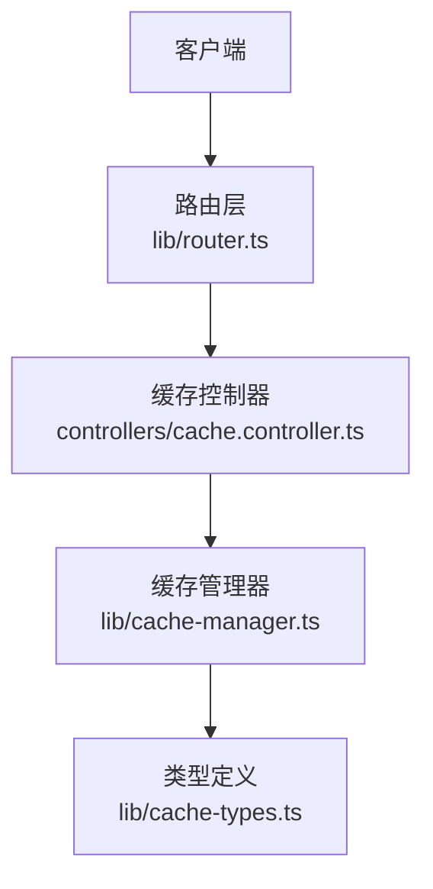
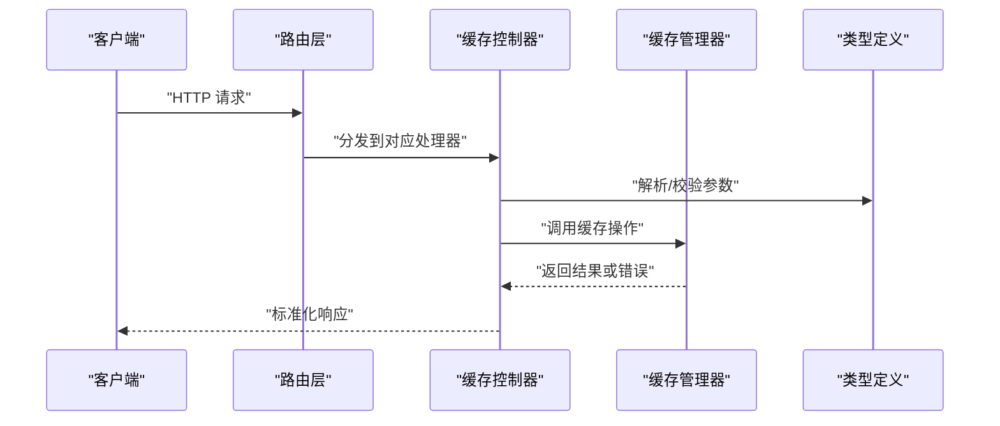
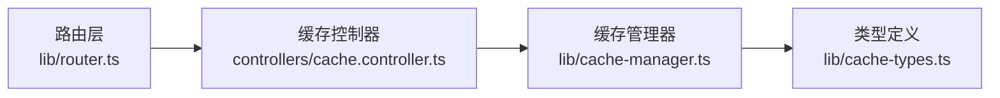

# 缓存管理 API

<cite>
**本文引用的文件**   
- [cache.controller.ts](file://controllers/cache.controller.ts)
- [cache-manager.ts](file://lib/cache-manager.ts)
- [cache-types.ts](file://lib/cache-types.ts)
- [router.ts](file://lib/router.ts)
</cite>

## 目录
1. [简介](#简介)
2. [项目结构](#项目结构)
3. [核心组件](#核心组件)
4. [架构总览](#架构总览)
5. [详细组件分析](#详细组件分析)
6. [依赖分析](#依赖分析)
7. [性能考虑](#性能考虑)
8. [故障排除指南](#故障排除指南)
9. [结论](#结论)
10. [附录](#附录)

## 简介
本文件为“缓存管理控制器”的 API 文档，覆盖所有与缓存相关的 HTTP 端点，包括缓存设置、获取、删除、清理等基础操作；同时记录缓存策略配置、键命名规范、过期时间设置、监控与统计接口，并提供优化建议与故障排除指南。文档还说明与缓存管理器的集成方式以及自定义缓存策略的实现方法，帮助开发者快速上手并高效使用缓存能力。

## 项目结构
与缓存管理相关的关键文件如下：
- controllers/cache.controller.ts：定义缓存管理的 HTTP 控制器（路由处理）
- lib/cache-manager.ts：实现缓存管理器（存储、策略、统计、清理等）
- lib/cache-types.ts：定义缓存类型与配置的结构体
- lib/router.ts：注册路由与控制器绑定

图表来源
- [router.ts](file://lib/router.ts)
- [cache.controller.ts](file://controllers/cache.controller.ts)
- [cache-manager.ts](file://lib/cache-manager.ts)
- [cache-types.ts](file://lib/cache-types.ts)

章节来源
- [cache.controller.ts](file://controllers/cache.controller.ts)
- [cache-manager.ts](file://lib/cache-manager.ts)
- [cache-types.ts](file://lib/cache-types.ts)
- [router.ts](file://lib/router.ts)

## 核心组件
- 缓存控制器（HTTP 层）
  - 职责：接收请求、校验参数、调用缓存管理器、返回统一响应格式。
  - 典型能力：设置/获取/删除/批量删除/清理、查询统计、查看/更新策略配置。
- 缓存管理器（业务层）
  - 职责：维护缓存实例、执行读写删、计算过期时间、触发清理、收集统计指标。
  - 关键抽象：支持可插拔的缓存策略（如内存、磁盘、混合），通过类型与配置驱动行为。
- 类型与配置
  - 职责：定义缓存项、策略配置、统计信息、错误码等数据结构，保证前后端一致。

章节来源
- [cache.controller.ts](file://controllers/cache.controller.ts)
- [cache-manager.ts](file://lib/cache-manager.ts)
- [cache-types.ts](file://lib/cache-types.ts)

## 架构总览
整体采用“控制器-管理器-类型”的分层设计：
- 控制器负责协议适配与参数校验
- 管理器封装缓存逻辑与策略
- 类型定义确保数据契约稳定

图表来源
- [router.ts](file://lib/router.ts)
- [cache.controller.ts](file://controllers/cache.controller.ts)
- [cache-manager.ts](file://lib/cache-manager.ts)
- [cache-types.ts](file://lib/cache-types.ts)

## 详细组件分析

### 缓存控制器（HTTP 端点）
以下列出常见缓存相关端点及其语义。具体路径前缀与方法以实际路由注册为准。

- 设置缓存
  - 方法：POST
  - 路径示例：/api/cache/set
  - 请求体字段：key、value、ttl（可选）、strategy（可选）
  - 成功响应：包含写入状态与元信息
  - 失败场景：参数缺失、键非法、策略不存在、写入失败
- 获取缓存
  - 方法：GET
  - 路径示例：/api/cache/get?key=...
  - 成功响应：返回 value 与命中标记
  - 失败场景：键不存在、读取异常
- 删除缓存
  - 方法：DELETE
  - 路径示例：/api/cache/delete?key=...
  - 成功响应：返回删除状态
  - 失败场景：键不存在、删除异常
- 批量删除
  - 方法：POST
  - 路径示例：/api/cache/batch-delete
  - 请求体字段：keys[]
  - 成功响应：返回成功/失败计数
- 清理缓存
  - 方法：POST
  - 路径示例：/api/cache/clean
  - 请求体字段：scope（可选，如 all/prefix/strategy）
  - 成功响应：返回清理数量
- 查询统计
  - 方法：GET
  - 路径示例：/api/cache/stats
  - 成功响应：命中率、条目数、内存占用、最近清理时间等
- 查看/更新策略配置
  - 方法：GET /api/cache/strategy
  - 方法：PUT /api/cache/strategy
  - 请求体字段：strategyName、默认 TTL、最大容量、淘汰策略等

注意事项
- 键命名规范：建议使用“模块:资源:标识”三段式，避免特殊字符，长度限制由策略决定。
- 过期时间：若未提供 ttl，则使用策略默认值；单位通常为秒。
- 幂等性：set 与 delete 应满足幂等；clean 可能非幂等，需记录审计日志。
- 限流与鉴权：生产环境建议对写操作与清理接口启用鉴权与限流。

章节来源
- [cache.controller.ts](file://controllers/cache.controller.ts)
- [cache-types.ts](file://lib/cache-types.ts)

### 缓存管理器（核心逻辑）
- 功能要点
  - 读写删：基于 key 进行原子操作，支持并发安全。
  - 过期控制：按 TTL 自动失效，支持惰性删除与定期扫描。
  - 策略切换：根据 strategy 选择不同后端（内存/磁盘/混合）。
  - 统计收集：命中/未命中、延迟分布、容量使用率、清理次数。
  - 清理任务：支持按 scope 清理，支持定时任务与手动触发。
- 关键数据结构
  - 缓存项：包含 key、value、ttl、createdAt、expiresAt、hits、lastAccessed 等。
  - 策略配置：包含 backend、maxSize、defaultTtl、evictionPolicy、prefix 等。
  - 统计信息：包含 hits、misses、size、memoryUsage、lastCleanAt 等。
- 复杂度与性能
  - 单条操作：O(1) 平均（哈希表）
  - 批量删除：O(n)
  - 清理：取决于 scope 与索引结构，通常 O(k) 其中 k 为匹配条目数
- 错误处理
  - 区分业务错误（键不存在、策略无效）与系统错误（IO 异常、序列化失败）
  - 统一错误码与消息，便于前端展示与监控告警

章节来源
- [cache-manager.ts](file://lib/cache-manager.ts)
- [cache-types.ts](file://lib/cache-types.ts)

### 类型与配置（契约）
- 缓存项
  - 字段：key、value、ttl、createdAt、expiresAt、hits、lastAccessed
- 策略配置
  - 字段：name、backend、maxSize、defaultTtl、evictionPolicy、prefix
- 统计信息
  - 字段：hits、misses、size、memoryUsage、lastCleanAt、avgLatencyMs
- 错误码
  - 字段：code、message、details（可选）

章节来源
- [cache-types.ts](file://lib/cache-types.ts)

### 路由注册
- 将控制器方法与 HTTP 方法映射到具体路径
- 支持中间件挂载（鉴权、限流、日志）
- 统一错误处理与响应包装

章节来源
- [router.ts](file://lib/router.ts)

## 依赖分析
- 控制器依赖管理器与类型定义
- 管理器依赖类型定义与具体策略实现
- 路由层仅依赖控制器与中间件

图表来源
- [router.ts](file://lib/router.ts)
- [cache.controller.ts](file://controllers/cache.controller.ts)
- [cache-manager.ts](file://lib/cache-manager.ts)
- [cache-types.ts](file://lib/cache-types.ts)

章节来源
- [router.ts](file://lib/router.ts)
- [cache.controller.ts](file://controllers/cache.controller.ts)
- [cache-manager.ts](file://lib/cache-manager.ts)
- [cache-types.ts](file://lib/cache-types.ts)

## 性能考虑
- 键设计
  - 保持短小且具可读性，避免过长导致序列化与传输开销
  - 使用前缀隔离不同业务域，便于按前缀清理
- TTL 策略
  - 热点数据设置较长 TTL，冷数据缩短 TTL
  - 合理设置惰性删除与定期扫描频率，平衡一致性与 CPU 消耗
- 容量与淘汰
  - 根据内存/磁盘上限设置 maxSize，配合 LRU/LFU 等淘汰策略
- 批量操作
  - 优先使用批量删除减少往返与锁竞争
- 监控与告警
  - 关注命中率、P95/P99 延迟、内存使用率、清理耗时
  - 当命中率低于阈值或延迟突增时触发告警

[本节为通用指导，不直接分析具体文件]

## 故障排除指南
- 常见问题
  - 键不存在：检查键命名是否一致，确认是否被清理或过期
  - 写入失败：检查策略配置、后端可用性与配额
  - 清理无效果：确认 scope 与前缀是否正确，检查清理任务是否运行
  - 命中率低：评估 TTL 与数据访问模式，调整策略或预热数据
- 定位步骤
  - 查看统计接口输出，对比 hits/misses 与 size/memoryUsage
  - 开启调试日志，追踪请求链路（路由→控制器→管理器）
  - 复现最小用例，逐步缩小范围至具体键或策略
- 恢复措施
  - 重置策略配置并重启服务（谨慎操作）
  - 针对异常键执行精准删除后重试
  - 扩容或调整淘汰策略以缓解容量压力

章节来源
- [cache-manager.ts](file://lib/cache-manager.ts)
- [cache.controller.ts](file://controllers/cache.controller.ts)

## 结论
本 API 围绕“控制器-管理器-类型”分层构建，提供完整的缓存生命周期管理能力。通过清晰的键命名规范、灵活的策略配置与完善的监控统计，可在多场景下获得稳定高效的缓存体验。建议在生产环境结合鉴权、限流与告警机制，持续优化命中率与延迟指标。

[本节为总结性内容，不直接分析具体文件]

## 附录

### 缓存策略配置参考
- 策略名称：用于标识不同后端或规则集
- 后端类型：内存/磁盘/混合
- 默认 TTL：秒为单位
- 最大容量：条目数或字节数
- 淘汰策略：LRU/LFU/TTL 优先等
- 键前缀：用于隔离业务域

章节来源
- [cache-types.ts](file://lib/cache-types.ts)

### 自定义缓存策略实现方法
- 步骤概览
  - 在类型定义中扩展策略配置
  - 在管理器中注册新策略工厂
  - 实现读写删、过期、统计与清理钩子
  - 在控制器中暴露策略切换端点（可选）
- 注意事项
  - 保证并发安全与幂等性
  - 正确上报统计指标
  - 遵循统一的错误码与响应格式

章节来源
- [cache-manager.ts](file://lib/cache-manager.ts)
- [cache-types.ts](file://lib/cache-types.ts)