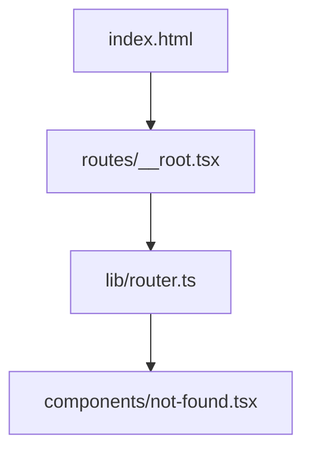
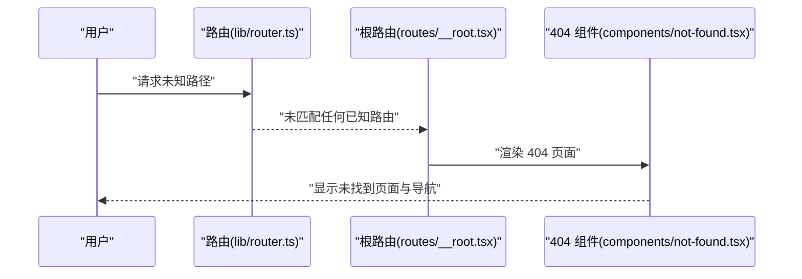
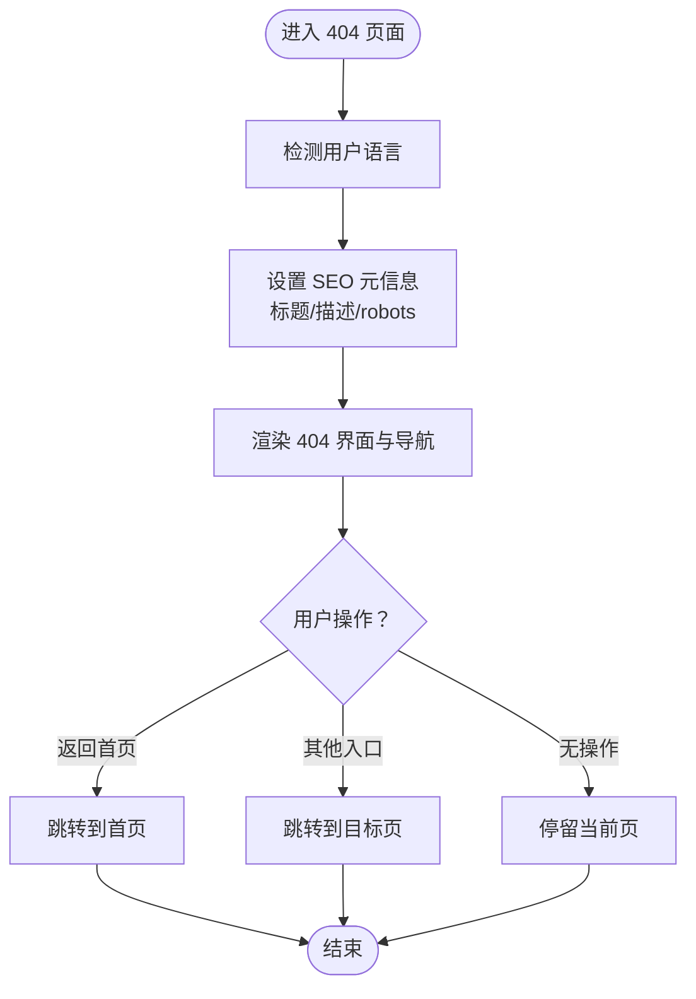
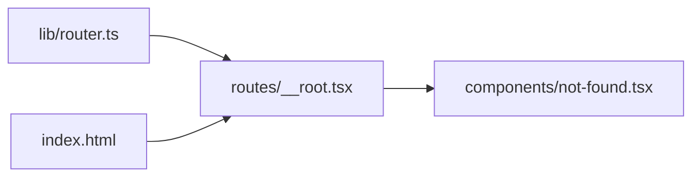

# 404 组件

<cite>
**本文引用的文件**   
- [components/not-found.tsx](file://components/not-found.tsx)
- [routes/__root.tsx](file://routes/__root.tsx)
- [lib/router.ts](file://lib/router.ts)
- [index.html](file://index.html)
</cite>

## 目录
1. [简介](#简介)
2. [项目结构](#项目结构)
3. [核心组件](#核心组件)
4. [架构总览](#架构总览)
5. [详细组件分析](#详细组件分析)
6. [依赖分析](#依赖分析)
7. [性能考虑](#性能考虑)
8. [故障排查指南](#故障排查指南)
9. [结论](#结论)
10. [附录](#附录)

## 简介
本章节面向 Bun-zlib 项目的 404 未找到页面组件，目标是：
- 描述未找到页面的设计布局与用户体验优化点
- 记录重定向逻辑、错误信息展示与返回导航
- 说明自定义错误页面配置与多语言支持策略
- 提供 SEO 友好的实现建议与搜索引擎索引控制

## 项目结构
本项目采用“路由 + 组件”的前端组织方式。404 相关能力主要分布在以下位置：
- components/not-found.tsx：404 页面组件的实现
- routes/__root.tsx：根路由与全局布局/兜底逻辑（可能包含 404 的挂载或默认渲染）
- lib/router.ts：前端路由定义与匹配规则（用于触发 404）
- index.html：应用入口 HTML（可配置基础 SEO 元信息与 robots 指令）

图表来源
- [index.html:1-200](file://index.html#L1-L200)
- [routes/__root.tsx:1-200](file://routes/__root.tsx#L1-L200)
- [lib/router.ts:1-200](file://lib/router.ts#L1-L200)
- [components/not-found.tsx:1-200](file://components/not-found.tsx#L1-L200)

章节来源
- [components/not-found.tsx:1-200](file://components/not-found.tsx#L1-L200)
- [routes/__root.tsx:1-200](file://routes/__root.tsx#L1-L200)
- [lib/router.ts:1-200](file://lib/router.ts#L1-L200)
- [index.html:1-200](file://index.html#L1-L200)

## 核心组件
- 404 页面组件职责
  - 渲染“未找到”状态下的友好界面
  - 提供返回首页、搜索、常见路径等导航入口
  - 输出必要的 SEO 元数据（标题、描述、robots 等）
  - 可选：根据用户语言切换文案（多语言）
- 关键交互
  - 返回导航：一键回到首页或上一级
  - 快速跳转：常用功能入口（如漫画、小说、下载等）
  - 反馈与统计：埋点上报（可选）

章节来源
- [components/not-found.tsx:1-200](file://components/not-found.tsx#L1-L200)

## 架构总览
下图展示了从浏览器访问到 404 页面渲染的关键流程：

图表来源
- [lib/router.ts:1-200](file://lib/router.ts#L1-L200)
- [routes/__root.tsx:1-200](file://routes/__root.tsx#L1-L200)
- [components/not-found.tsx:1-200](file://components/not-found.tsx#L1-L200)

## 详细组件分析

### 404 页面组件（components/not-found.tsx）
- 布局与视觉
  - 大字号 404 标识
  - 简短友好的提示文案
  - 清晰的导航按钮（返回首页、热门入口）
  - 响应式适配（移动端/桌面端）
- 交互行为
  - 点击导航执行路由跳转
  - 可选：自动聚焦首个可操作元素以提升无障碍体验
- SEO 与索引控制
  - 设置页面标题与描述
  - 通过 meta robots 控制是否允许抓取
  - 结构化数据（可选）
- 多语言支持
  - 基于当前语言环境选择文案
  - 若未检测到语言，回退到默认语言
- 错误信息展示
  - 统一错误码与提示语
  - 提供“重试/返回”等恢复动作

图表来源
- [components/not-found.tsx:1-200](file://components/not-found.tsx#L1-L200)

章节来源
- [components/not-found.tsx:1-200](file://components/not-found.tsx#L1-L200)

### 根路由与兜底（routes/__root.tsx）
- 作用
  - 作为应用根布局容器
  - 在子路由缺失时，决定是否渲染 404 组件
- 与 404 的关系
  - 当路由层无法匹配到具体页面时，由根路由负责挂载 404 组件
  - 可在此处注入全局 SEO 元信息或权限校验后的降级逻辑

章节来源
- [routes/__root.tsx:1-200](file://routes/__root.tsx#L1-L200)

### 路由匹配与触发（lib/router.ts）
- 作用
  - 维护所有已注册路由表
  - 对当前 URL 进行匹配，找不到则返回“未匹配”信号
- 与 404 的关系
  - 未匹配时向上抛出或未处理，交由根路由渲染 404
  - 可在此处加入日志上报或埋点

章节来源
- [lib/router.ts:1-200](file://lib/router.ts#L1-L200)

### 入口 HTML 与 SEO 基础（index.html）
- 作用
  - 提供应用初始 HTML 骨架
  - 可配置全局 robots 指令、站点图标、主题色等
- 与 404 的关系
  - 可在 HTML 中设置默认 robots 指令；404 页面也可覆盖为更严格的禁止抓取策略

章节来源
- [index.html:1-200](file://index.html#L1-L200)

## 依赖分析
- 组件耦合关系
  - 404 组件依赖路由跳转能力（通常来自框架路由或自定义 router）
  - 根路由依赖路由器的“未匹配”结果以决定渲染 404
  - 入口 HTML 提供全局 SEO 基线，404 页面可覆盖

图表来源
- [lib/router.ts:1-200](file://lib/router.ts#L1-L200)
- [routes/__root.tsx:1-200](file://routes/__root.tsx#L1-L200)
- [components/not-found.tsx:1-200](file://components/not-found.tsx#L1-L200)
- [index.html:1-200](file://index.html#L1-L200)

章节来源
- [lib/router.ts:1-200](file://lib/router.ts#L1-L200)
- [routes/__root.tsx:1-200](file://routes/__root.tsx#L1-L200)
- [components/not-found.tsx:1-200](file://components/not-found.tsx#L1-L200)
- [index.html:1-200](file://index.html#L1-L200)

## 性能考虑
- 首屏渲染
  - 404 页面应保持轻量，避免加载重型资源
  - 使用静态文案与内联样式，减少网络请求
- 缓存策略
  - 404 页面可开启强缓存，降低重复访问开销
- 可访问性
  - 确保键盘可达、屏幕阅读器可读
  - 为图片提供 alt 文本，按钮具备明确语义

## 故障排查指南
- 症状：访问任意无效路径仍显示正常页面
  - 检查路由表是否遗漏了“未匹配”分支
  - 确认根路由是否正确捕获并渲染 404
- 症状：SEO 元信息未生效
  - 检查 404 组件是否在正确时机写入 title/description/robots
  - 对比 index.html 的全局设置是否被覆盖
- 症状：多语言文案不生效
  - 检查语言检测逻辑与默认回退
  - 确认文案资源是否按语言键值正确映射
- 症状：导航跳转失败
  - 检查路由跳转 API 调用与参数
  - 确认目标路由是否存在且可访问

章节来源
- [lib/router.ts:1-200](file://lib/router.ts#L1-L200)
- [routes/__root.tsx:1-200](file://routes/__root.tsx#L1-L200)
- [components/not-found.tsx:1-200](file://components/not-found.tsx#L1-L200)
- [index.html:1-200](file://index.html#L1-L200)

## 结论
404 组件是提升用户体验与品牌一致性的关键环节。通过合理的布局、清晰的导航、完善的 SEO 与多语言支持，可以在“未找到”场景下依然为用户提供顺畅的继续探索路径。同时，结合路由层的兜底与入口 HTML 的全局 SEO 配置，可实现稳定、可控的错误页面体验。

## 附录

### 自定义错误页面配置清单
- 路由层
  - 未匹配时的兜底渲染
  - 可选：将特定错误码映射到不同错误页
- 根路由
  - 全局 SEO 注入
  - 权限/鉴权失败时的降级策略
- 404 组件
  - 文案与导航项
  - 多语言键值与回退
  - robots 指令与结构化数据
- 入口 HTML
  - 全局 robots 指令
  - 站点图标与主题色

### 多语言支持要点
- 语言检测顺序：URL 参数 > Cookie > 浏览器语言 > 默认语言
- 文案管理：集中化键值，避免硬编码
- 回退策略：缺失键值时使用默认语言文案

### SEO 友好与索引控制
- 页面标题与描述：简洁明确，包含“未找到”语义
- robots 指令：404 页面建议禁止抓取与索引
- 结构化数据：按需添加（例如 WebPage），但注意不要误导爬虫