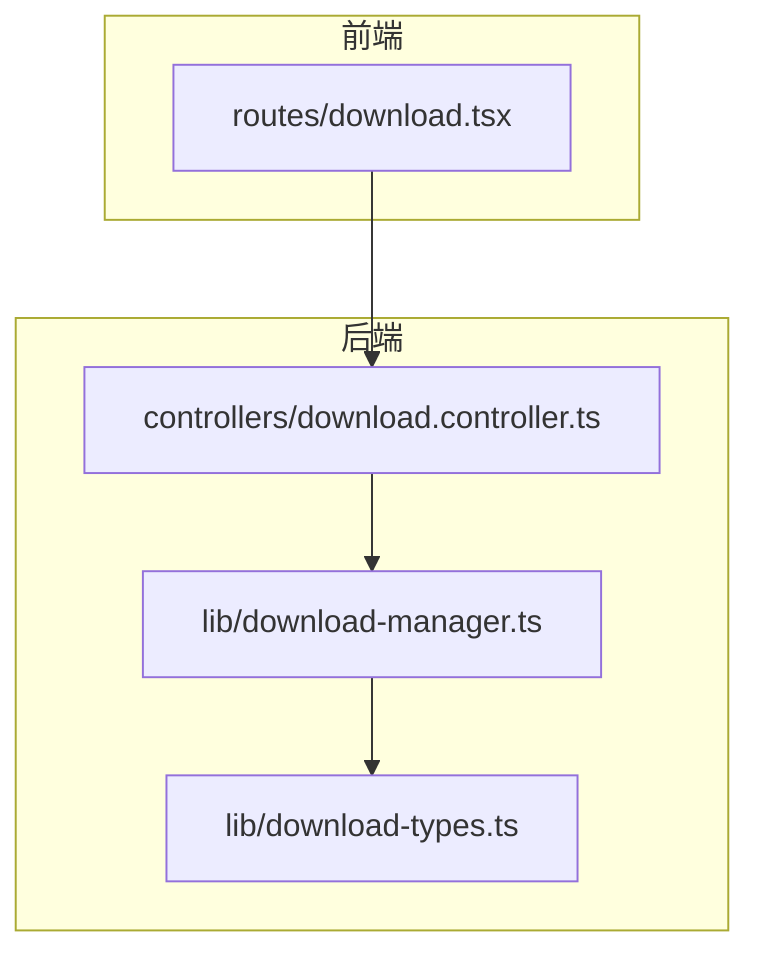
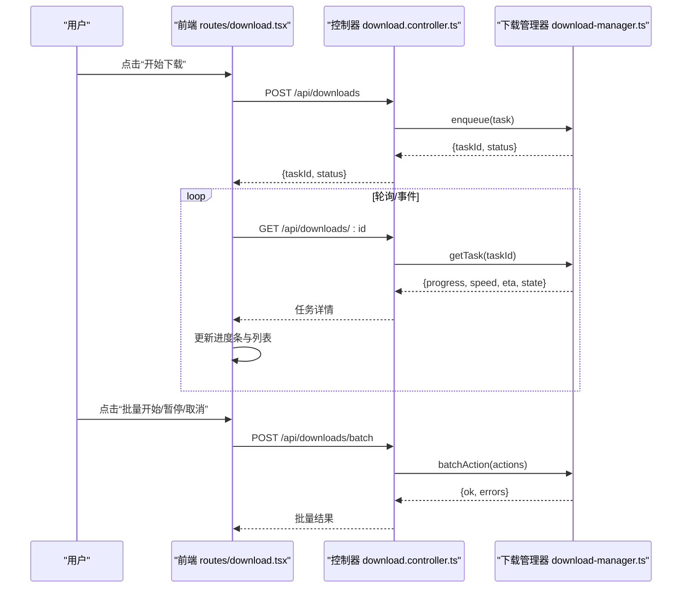
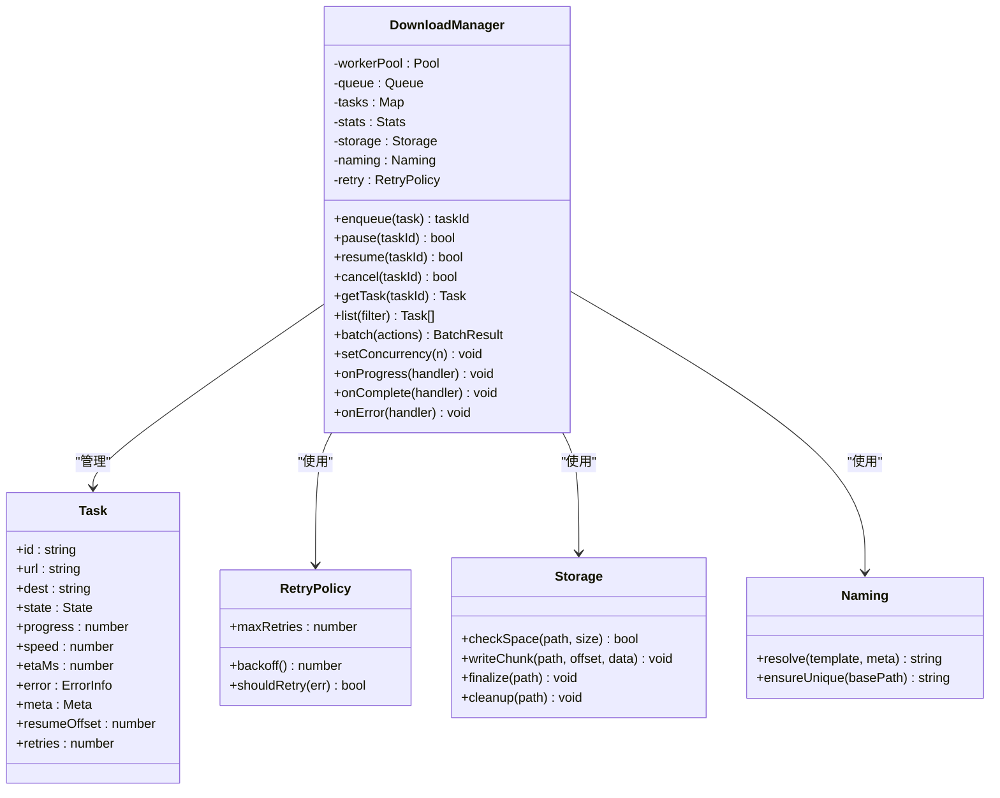
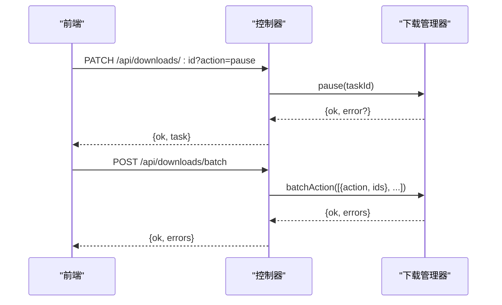
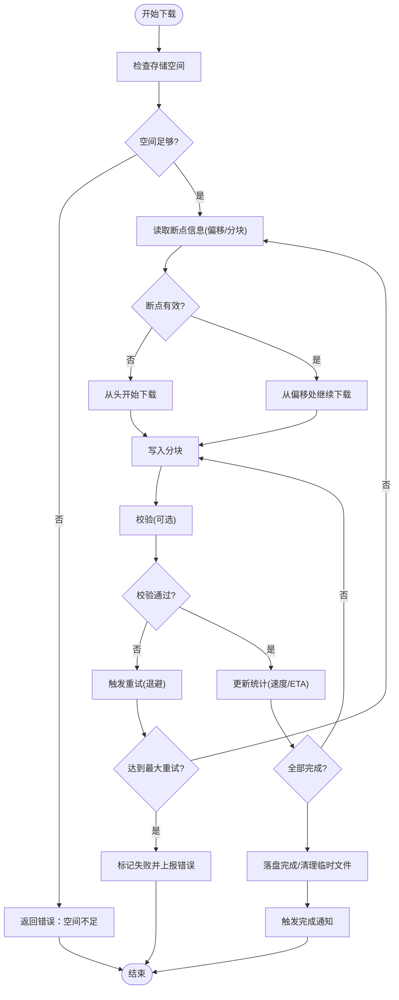
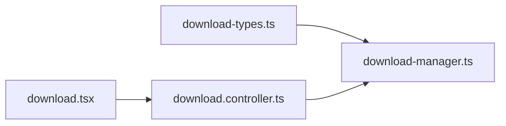

# 下载管理器

<cite>
**本文引用的文件**   
- [download-manager.ts](file://lib/download-manager.ts)
- [download-types.ts](file://lib/download-types.ts)
- [download.controller.ts](file://controllers/download.controller.ts)
- [download.tsx](file://routes/download.tsx)
</cite>

## 目录
1. [简介](#简介)
2. [项目结构](#项目结构)
3. [核心组件](#核心组件)
4. [架构总览](#架构总览)
5. [详细组件分析](#详细组件分析)
6. [依赖分析](#依赖分析)
7. [性能考虑](#性能考虑)
8. [故障排查指南](#故障排查指南)
9. [结论](#结论)
10. [附录](#附录)

## 简介
本文件面向 Bun-zlib 的下载管理器组件，系统化说明下载任务列表、进度条显示与批量操作能力；记录下载队列管理、并发控制与断点续传策略；涵盖下载速度监控、剩余时间估算与错误重试机制；提供任务暂停、恢复与取消操作；并记录存储空间检查、文件命名规则以及下载完成通知。文档同时给出架构图、类图、时序图与流程图，帮助读者快速理解实现与扩展方式。

## 项目结构
围绕下载功能的关键代码分布在以下位置：
- 类型定义与数据结构：lib/download-types.ts
- 下载管理与队列逻辑：lib/download-manager.ts
- HTTP 控制器（API 层）：controllers/download.controller.ts
- 前端路由与页面：routes/download.tsx

图表来源
- [download.tsx](file://routes/download.tsx)
- [download.controller.ts](file://controllers/download.controller.ts)
- [download-manager.ts](file://lib/download-manager.ts)
- [download-types.ts](file://lib/download-types.ts)

章节来源
- [download-manager.ts](file://lib/download-manager.ts)
- [download-types.ts](file://lib/download-types.ts)
- [download.controller.ts](file://controllers/download.controller.ts)
- [download.tsx](file://routes/download.tsx)

## 核心组件
- 下载任务模型与状态：集中定义在类型文件中，包含任务标识、源地址、目标路径、进度、状态枚举、错误信息、元数据等字段，用于前后端一致的数据契约。
- 下载管理器：负责任务生命周期管理（创建、入队、出队、执行、暂停、恢复、取消）、并发控制、断点续传、速度统计、剩余时间估算、错误重试、存储检查与完成通知。
- 控制器：暴露 REST/HTTP API，将前端请求映射到下载管理器的方法，返回统一响应格式。
- 前端路由：渲染下载列表、进度条、批量操作按钮，订阅任务状态变更并驱动 UI 更新。

章节来源
- [download-types.ts](file://lib/download-types.ts)
- [download-manager.ts](file://lib/download-manager.ts)
- [download.controller.ts](file://controllers/download.controller.ts)
- [download.tsx](file://routes/download.tsx)

## 架构总览
整体采用“前端路由 -> 控制器 -> 下载管理器”的分层架构。前端通过控制器提供的接口发起下载、查询进度、批量操作等请求；控制器调用下载管理器执行业务逻辑；下载管理器维护任务队列、并发池、断点信息与统计指标，并在完成后触发通知。

图表来源
- [download.tsx](file://routes/download.tsx)
- [download.controller.ts](file://controllers/download.controller.ts)
- [download-manager.ts](file://lib/download-manager.ts)

## 详细组件分析

### 类型与数据模型
- 任务状态：包括待处理、排队中、进行中、已暂停、已完成、失败、已取消等。
- 进度与统计：累计字节数、总大小、瞬时速度、平均速度、剩余时间估算、开始/结束时间戳。
- 错误与重试：错误码、错误消息、重试次数、最大重试次数、下次重试时间。
- 断点信息：上次偏移量、分块范围、校验和（可选）。
- 文件命名：支持基于标题、作者、序号、哈希等规则生成唯一文件名，避免覆盖与冲突。
- 通知：完成回调、错误回调、进度回调的事件载荷结构。

章节来源
- [download-types.ts](file://lib/download-types.ts)

### 下载管理器（队列、并发、断点续传、统计、重试、存储、通知）
- 任务列表与索引：以任务 ID 为键维护任务集合，提供按状态过滤、分页与排序能力。
- 队列与调度：
  - 优先级队列或 FIFO 队列，支持动态调整优先级。
  - 工作池限制并发数，防止资源耗尽。
  - 任务入队/出队、抢占式暂停与恢复。
- 并发控制：
  - 全局并发上限与每任务内部的分片并发（如多段下载）。
  - 背压与节流：当磁盘 I/O 或网络拥塞时自动降速。
- 断点续传：
  - 记录上次写入偏移与已下载分块。
  - 支持 Range 请求与部分重传。
  - 校验完整性（可选 MD5/SHA），失败则回滚并重试。
- 速度监控与 ETA：
  - 滑动窗口统计最近 N 秒的吞吐。
  - 基于当前速度与剩余字节计算剩余时间。
- 错误与重试：
  - 可配置退避策略（固定间隔、指数退避、抖动）。
  - 区分可重试与不可重试错误（网络超时、权限不足等）。
- 存储检查：
  - 下载前检查目标目录可用空间是否满足需求。
  - 临时文件与最终落盘策略，异常时清理残留。
- 文件命名：
  - 规则引擎：模板 + 变量替换（标题、序号、哈希等）。
  - 冲突检测与自动后缀追加。
- 完成通知：
  - 事件总线或回调注册，推送完成、失败、进度事件。
  - 支持持久化通知（系统通知或日志）。

图表来源
- [download-manager.ts](file://lib/download-manager.ts)
- [download-types.ts](file://lib/download-types.ts)

章节来源
- [download-manager.ts](file://lib/download-manager.ts)
- [download-types.ts](file://lib/download-types.ts)

### 控制器（API 层）
- 任务管理接口：
  - 创建/加入队列：POST /api/downloads
  - 查询任务详情：GET /api/downloads/:id
  - 列出任务：GET /api/downloads?status=&page=&size=
  - 暂停/恢复/取消：PATCH /api/downloads/:id?action=pause|resume|cancel
- 批量操作接口：
  - POST /api/downloads/batch，传入动作数组（开始、暂停、取消、删除等）
- 进度与统计：
  - 实时返回进度、速度、ETA、错误信息
- 错误处理：
  - 统一错误码与消息，便于前端提示与重试

图表来源
- [download.controller.ts](file://controllers/download.controller.ts)
- [download-manager.ts](file://lib/download-manager.ts)

章节来源
- [download.controller.ts](file://controllers/download.controller.ts)

### 前端路由（任务列表、进度条、批量操作）
- 任务列表：展示任务 ID、名称、状态、进度百分比、速度、ETA、错误提示。
- 进度条：实时更新，支持颜色区分状态（成功/失败/进行中/暂停）。
- 批量操作：全选/反选，批量开始、暂停、取消、删除。
- 交互反馈：加载态、错误弹窗、成功提示、通知中心。
- 性能优化：虚拟滚动长列表、增量更新、防抖轮询。

章节来源
- [download.tsx](file://routes/download.tsx)

### 算法流程：断点续传与重试

图表来源
- [download-manager.ts](file://lib/download-manager.ts)
- [download-types.ts](file://lib/download-types.ts)

## 依赖分析
- 模块内聚与耦合：
  - 下载管理器对类型定义强依赖，对外仅暴露稳定接口，降低耦合。
  - 控制器仅做参数校验与转发，业务逻辑集中在管理器。
- 外部依赖：
  - 文件系统访问（读写、空间检查、原子替换）。
  - 网络客户端（支持 Range、重试、超时、代理）。
  - 事件/回调机制（进度、完成、错误）。
- 潜在循环依赖：
  - 确保控制器不反向依赖管理器内部实现细节，仅通过公共接口交互。

图表来源
- [download-types.ts](file://lib/download-types.ts)
- [download-manager.ts](file://lib/download-manager.ts)
- [download.controller.ts](file://controllers/download.controller.ts)
- [download.tsx](file://routes/download.tsx)

章节来源
- [download-types.ts](file://lib/download-types.ts)
- [download-manager.ts](file://lib/download-manager.ts)
- [download.controller.ts](file://controllers/download.controller.ts)
- [download.tsx](file://routes/download.tsx)

## 性能考虑
- 并发控制：合理设置全局并发与工作线程数，避免 CPU/IO 争用。
- 分块大小：根据文件大小与网络状况动态调整分块大小，平衡内存占用与传输效率。
- 滑动窗口统计：使用固定长度窗口计算速度，减少波动影响。
- 批量操作：合并小任务、批量化写盘，减少系统调用开销。
- 缓存与去重：相同 URL 的任务去重，避免重复下载。
- 资源回收：及时释放句柄、清理临时文件，防止磁盘膨胀。

[本节为通用指导，无需具体文件引用]

## 故障排查指南
- 常见问题定位：
  - 空间不足：检查目标目录可用空间与配额。
  - 权限问题：确认运行用户对目标路径有读写权限。
  - 网络异常：查看错误码与重试次数，必要时切换代理或网络。
  - 校验失败：启用更严格校验或重新下载。
- 日志与诊断：
  - 输出关键事件（入队、出队、重试、完成、失败）。
  - 记录速度、ETA、分块偏移与校验结果。
- 恢复策略：
  - 优先尝试断点续传；若多次失败，清空断点从头下载。
  - 对不可重试错误直接终止并提示用户。

章节来源
- [download-manager.ts](file://lib/download-manager.ts)
- [download.controller.ts](file://controllers/download.controller.ts)

## 结论
下载管理器通过清晰的类型契约、分层架构与完善的队列/并发/断点/重试/统计/通知机制，提供了稳定高效的下载体验。前端以任务列表与进度条为核心，结合批量操作提升效率。建议在生产环境开启严格的校验与日志，并根据实际负载调优并发与分块策略。

[本节为总结性内容，无需具体文件引用]

## 附录
- 术语表：
  - ETA：预计剩余时间
  - 断点续传：从上次中断位置继续下载
  - 分块：将大文件切分为多个片段并行下载
- 最佳实践：
  - 为每个任务分配唯一 ID，避免并发冲突。
  - 使用幂等接口设计，保证重试安全。
  - 对敏感路径进行白名单校验，防止路径穿越。

[本节为补充信息，无需具体文件引用]