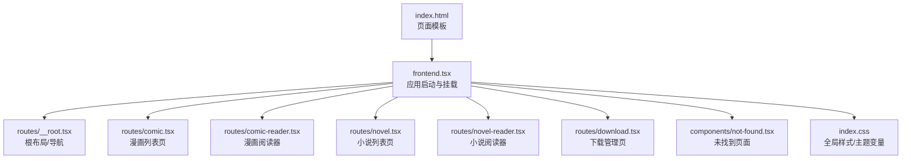
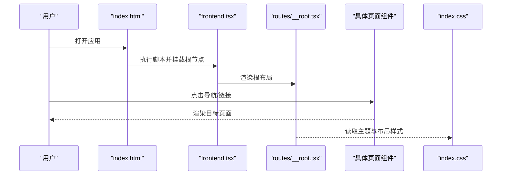
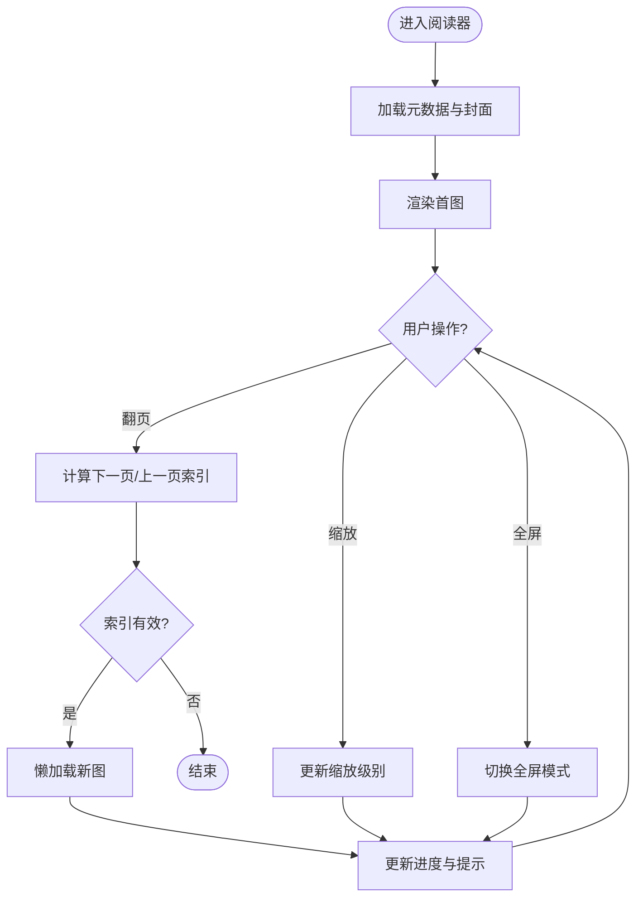
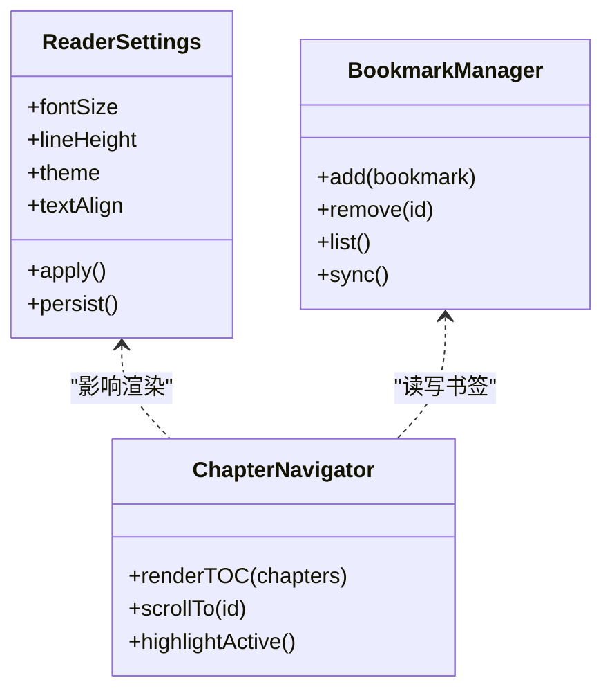
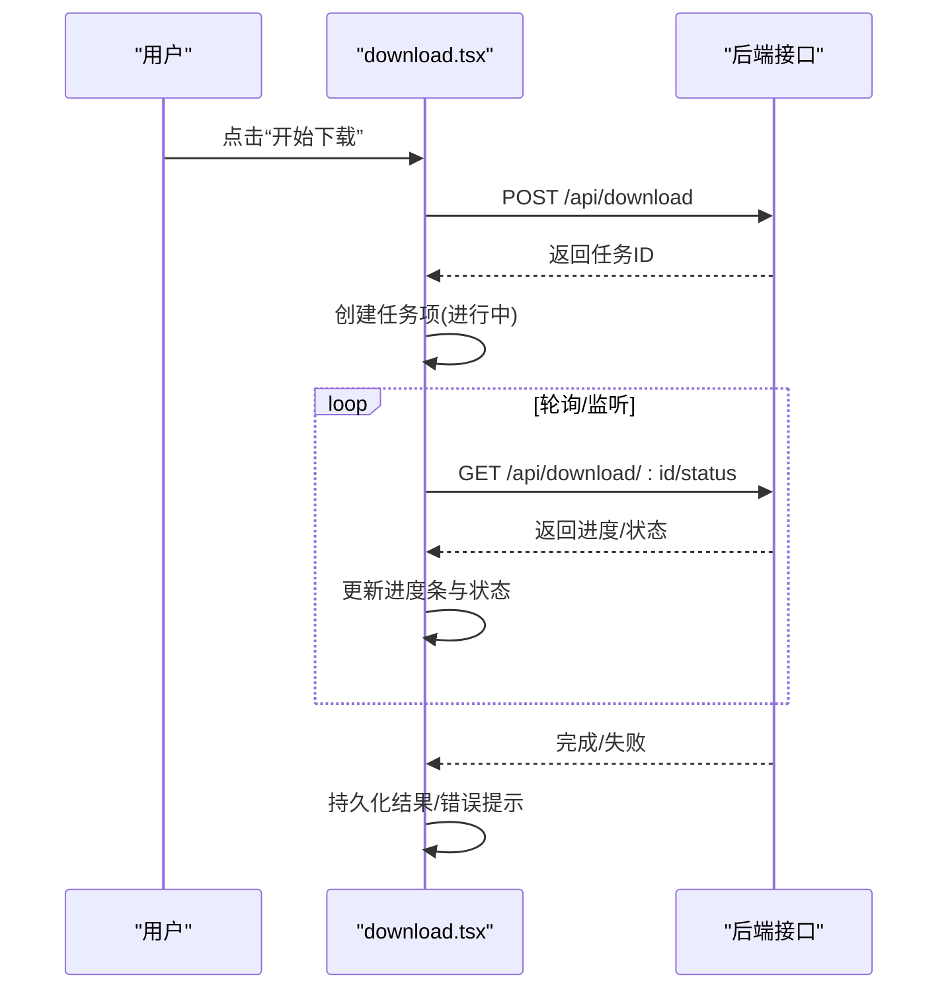
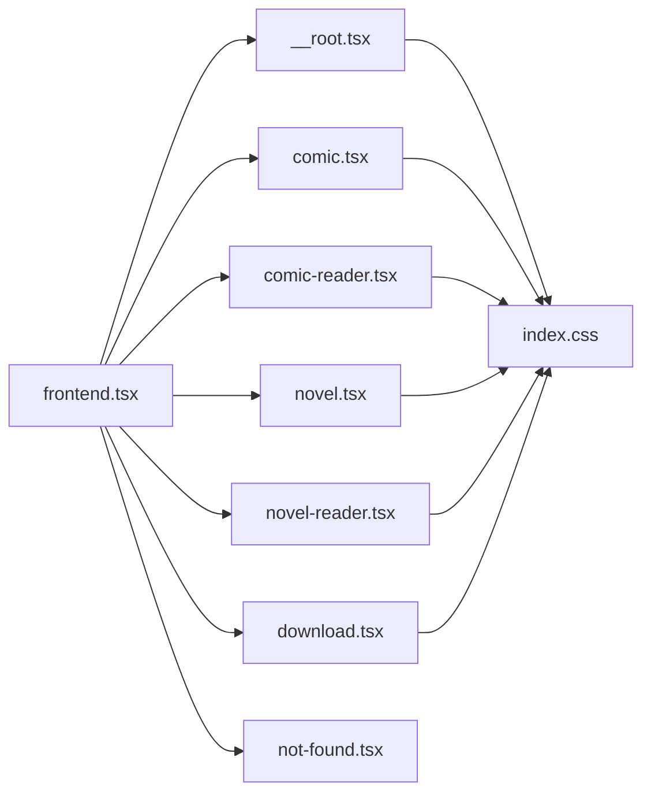

# 前端组件

<cite>
**本文引用的文件**   
- [frontend.tsx](file://frontend.tsx)
- [index.html](file://index.html)
- [index.css](file://index.css)
- [routes/__root.tsx](file://routes/__root.tsx)
- [routes/comic-reader.tsx](file://routes/comic-reader.tsx)
- [routes/comic.tsx](file://routes/comic.tsx)
- [routes/novel-reader.tsx](file://routes/novel-reader.tsx)
- [routes/novel.tsx](file://routes/novel.tsx)
- [routes/download.tsx](file://routes/download.tsx)
- [components/not-found.tsx](file://components/not-found.tsx)
</cite>

## 目录
1. [简介](#简介)
2. [项目结构](#项目结构)
3. [核心组件](#核心组件)
4. [架构总览](#架构总览)
5. [详细组件分析](#详细组件分析)
6. [依赖分析](#依赖分析)
7. [性能考虑](#性能考虑)
8. [故障排查指南](#故障排查指南)
9. [结论](#结论)
10. [附录](#附录)

## 简介
本文件面向 Bun-zlib 的前端组件，聚焦于视觉外观、交互行为与用户流程，系统化记录路由级页面组件的职责、组合方式与样式主题策略。文档同时提供响应式设计与无障碍（a11y）实践建议、状态与动画/过渡的说明、跨浏览器兼容性与性能优化要点，以及与其他 UI 元素的集成模式。为避免泄露实现细节，本文不直接粘贴代码片段，而是以“源码路径”形式标注关键位置，便于读者快速定位。

## 项目结构
前端采用基于路由的页面组织方式：根入口挂载应用壳，各业务页面通过路由文件拆分，公共错误页位于 components 目录。样式集中在 index.css，HTML 模板在 index.html。

图表来源
- [frontend.tsx](file://frontend.tsx)
- [index.html](file://index.html)
- [routes/__root.tsx](file://routes/__root.tsx)
- [routes/comic.tsx](file://routes/comic.tsx)
- [routes/comic-reader.tsx](file://routes/comic-reader.tsx)
- [routes/novel.tsx](file://routes/novel.tsx)
- [routes/novel-reader.tsx](file://routes/novel-reader.tsx)
- [routes/download.tsx](file://routes/download.tsx)
- [components/not-found.tsx](file://components/not-found.tsx)
- [index.css](file://index.css)

章节来源
- [frontend.tsx](file://frontend.tsx)
- [index.html](file://index.html)
- [routes/__root.tsx](file://routes/__root.tsx)
- [routes/comic.tsx](file://routes/comic.tsx)
- [routes/comic-reader.tsx](file://routes/comic-reader.tsx)
- [routes/novel.tsx](file://routes/novel.tsx)
- [routes/novel-reader.tsx](file://routes/novel-reader.tsx)
- [routes/download.tsx](file://routes/download.tsx)
- [components/not-found.tsx](file://components/not-found.tsx)
- [index.css](file://index.css)

## 核心组件
本节概述各路由页面的职责与交互要点，并给出可复用的设计约定。

- 根布局（__root.tsx）
  - 作用：承载全局导航、面包屑或侧边栏等框架元素；统一处理加载态与错误边界。
  - 交互：切换路由时保持导航高亮；支持键盘导航与焦点管理。
  - 主题：通过 CSS 变量控制主色、背景、字体大小等。

- 漫画列表页（comic.tsx）
  - 作用：展示漫画条目网格/列表，支持搜索、筛选与分页。
  - 交互：点击条目进入阅读器；支持快捷键翻页与收藏标记。
  - 响应式：小屏单列，中屏双列，大屏三列及以上。

- 漫画阅读器（comic-reader.tsx）
  - 作用：沉浸式阅读体验，支持缩放、滚动/翻页、进度保存。
  - 交互：双击放大、拖拽平移、手势滑动（移动端）。
  - 无障碍：图片具备描述性 alt；阅读器区域提供 aria-live 提示当前页码。

- 小说列表页（novel.tsx）
  - 作用：展示小说条目，支持标签筛选、排序与搜索。
  - 交互：卡片点击跳转详情页或阅读器；支持批量操作。
  - 性能：虚拟列表或懒加载以提升长列表性能。

- 小说阅读器（novel-reader.tsx）
  - 作用：文本渲染、段落跳转、目录导航、阅读设置（字号、行距、主题）。
  - 交互：点击目录锚点平滑滚动；支持夜间/浅色主题切换。
  - 无障碍：标题层级语义化；阅读器容器具备 role="document" 与 tabindex。

- 下载管理页（download.tsx）
  - 作用：任务队列、进度条、失败重试、断点续传（若后端支持）。
  - 交互：暂停/继续、删除任务、清空已完成。
  - 反馈：使用 toast 或内联消息提示任务状态变化。

- 未找到页面（not-found.tsx）
  - 作用：404 兜底，提供返回首页链接。
  - 交互：一键返回最近访问页或首页。

章节来源
- [routes/__root.tsx](file://routes/__root.tsx)
- [routes/comic.tsx](file://routes/comic.tsx)
- [routes/comic-reader.tsx](file://routes/comic-reader.tsx)
- [routes/novel.tsx](file://routes/novel.tsx)
- [routes/novel-reader.tsx](file://routes/novel-reader.tsx)
- [routes/download.tsx](file://routes/download.tsx)
- [components/not-found.tsx](file://components/not-found.tsx)

## 架构总览
前端以路由为边界划分页面组件，根入口负责初始化与挂载，CSS 集中管理主题与响应式断点。

图表来源
- [index.html](file://index.html)
- [frontend.tsx](file://frontend.tsx)
- [routes/__root.tsx](file://routes/__root.tsx)
- [index.css](file://index.css)

## 详细组件分析

### 漫画阅读器（comic-reader.tsx）
- 视觉与布局
  - 全屏容器，顶部工具栏（上一页/下一页、缩放、设置），底部进度条。
  - 图片自适应容器，居中显示，保留宽高比。
- 行为与交互
  - 鼠标滚轮/触摸滑动翻页；双击放大；拖拽平移。
  - 键盘支持：左右箭头翻页，Esc 退出全屏，+/- 缩放。
  - 自动保存阅读进度到本地存储。
- 状态与数据流
  - 当前索引、总页数、缩放级别、是否全屏、加载状态。
  - 图片资源按需加载，预取下一页以降低等待时间。
- 无障碍
  - 图片提供 alt；阅读器区域 focus trap；aria-live 播报页码变更。
- 动画与过渡
  - 页面切换淡入淡出；缩放使用 transform 提升性能。
- 样式与主题
  - 通过 CSS 变量定义背景、前景、控件颜色；支持明暗主题切换。
- 示例与演示
  - 参见源码路径：[routes/comic-reader.tsx](file://routes/comic-reader.tsx)

图表来源
- [routes/comic-reader.tsx](file://routes/comic-reader.tsx)

章节来源
- [routes/comic-reader.tsx](file://routes/comic-reader.tsx)

### 小说阅读器（novel-reader.tsx）
- 视觉与布局
  - 左侧目录面板（可折叠），右侧正文区域，顶部阅读设置浮层。
- 行为与交互
  - 目录锚点平滑滚动；点击段落高亮；支持书签与笔记。
  - 设置项：字号、行距、字重、主题、对齐方式。
- 状态与数据流
  - 当前章节、段落偏移、阅读设置、书签集合。
  - 大段文本分块渲染，避免主线程阻塞。
- 无障碍
  - 标题层级正确；阅读器区域 role="document"；键盘可达。
- 动画与过渡
  - 目录展开/收起过渡；主题切换平滑渐变。
- 示例与演示
  - 参见源码路径：[routes/novel-reader.tsx](file://routes/novel-reader.tsx)

图表来源
- [routes/novel-reader.tsx](file://routes/novel-reader.tsx)

章节来源
- [routes/novel-reader.tsx](file://routes/novel-reader.tsx)

### 下载管理页（download.tsx）
- 视觉与布局
  - 任务列表，每项包含名称、进度条、状态标签、操作按钮。
- 行为与交互
  - 新增任务、暂停/继续、重试、删除、清空已完成。
  - 批量选择与全选。
- 状态与数据流
  - 任务队列、进度百分比、错误信息、重试次数。
  - 与后端接口同步状态，必要时轮询或事件驱动更新。
- 无障碍
  - 进度条使用 progressbar 角色与 aria-valuenow；按钮具备明确 label。
- 示例与演示
  - 参见源码路径：[routes/download.tsx](file://routes/download.tsx)

图表来源
- [routes/download.tsx](file://routes/download.tsx)

章节来源
- [routes/download.tsx](file://routes/download.tsx)

### 列表页组件（comic.tsx、novel.tsx）
- 视觉与布局
  - 网格/列表视图切换；搜索框与筛选器；分页或无限滚动。
- 行为与交互
  - 输入防抖搜索；多选与批量操作；排序与标签过滤。
- 性能
  - 虚拟列表/窗口化；图片懒加载与占位骨架屏。
- 示例与演示
  - 参见源码路径：[routes/comic.tsx](file://routes/comic.tsx)、[routes/novel.tsx](file://routes/novel.tsx)

章节来源
- [routes/comic.tsx](file://routes/comic.tsx)
- [routes/novel.tsx](file://routes/novel.tsx)

### 根布局与未找到页（__root.tsx、not-found.tsx）
- 根布局
  - 统一导航、面包屑、全局通知；错误边界捕获渲染异常。
- 未找到页
  - 友好文案与快捷返回；SEO 友好的 404 状态。
- 示例与演示
  - 参见源码路径：[routes/__root.tsx](file://routes/__root.tsx)、[components/not-found.tsx](file://components/not-found.tsx)

章节来源
- [routes/__root.tsx](file://routes/__root.tsx)
- [components/not-found.tsx](file://components/not-found.tsx)

## 依赖分析
- 模块耦合
  - 页面组件仅依赖路由与样式，尽量保持无状态或最小状态，逻辑下沉至 hooks/服务层（如存在）。
- 外部依赖
  - 路由库、状态管理（如有）、网络请求封装、图片懒加载库等。
- 潜在循环依赖
  - 页面之间通过路由跳转而非直接引用，降低耦合风险。

图表来源
- [frontend.tsx](file://frontend.tsx)
- [routes/__root.tsx](file://routes/__root.tsx)
- [routes/comic.tsx](file://routes/comic.tsx)
- [routes/comic-reader.tsx](file://routes/comic-reader.tsx)
- [routes/novel.tsx](file://routes/novel.tsx)
- [routes/novel-reader.tsx](file://routes/novel-reader.tsx)
- [routes/download.tsx](file://routes/download.tsx)
- [components/not-found.tsx](file://components/not-found.tsx)
- [index.css](file://index.css)

章节来源
- [frontend.tsx](file://frontend.tsx)
- [routes/__root.tsx](file://routes/__root.tsx)
- [routes/comic.tsx](file://routes/comic.tsx)
- [routes/comic-reader.tsx](file://routes/comic-reader.tsx)
- [routes/novel.tsx](file://routes/novel.tsx)
- [routes/novel-reader.tsx](file://routes/novel-reader.tsx)
- [routes/download.tsx](file://routes/download.tsx)
- [components/not-found.tsx](file://components/not-found.tsx)
- [index.css](file://index.css)

## 性能考虑
- 渲染优化
  - 列表使用虚拟滚动；阅读器图片懒加载与预取；文本分块渲染。
- 内存与网络
  - 及时释放大图对象；限制并发请求；缓存静态资源与常用配置。
- 动画与过渡
  - 优先使用 transform 与 opacity；避免强制回流；减少重绘。
- 可观测性
  - 关键路径埋点（首帧、交互延迟）；错误上报与降级策略。

## 故障排查指南
- 常见问题
  - 图片无法加载：检查资源路径与跨域策略；确认懒加载触发条件。
  - 阅读器卡顿：关闭不必要的动画；启用图片压缩与 WebP；检查内存泄漏。
  - 下载任务失败：查看网络状态与后端返回码；实现重试与退避。
- 调试技巧
  - 使用浏览器开发者工具的性能面板定位瓶颈；开启 React/Vue 开发扩展（如适用）。
  - 对关键函数添加日志与断点，验证状态流转。

## 结论
Bun-zlib 的前端以路由为边界组织页面组件，强调可读性与可维护性。通过统一的根布局与集中样式管理，配合响应式与无障碍最佳实践，可在多设备与多浏览器上提供一致的用户体验。建议在后续迭代中引入更细粒度的状态管理与错误边界，进一步提升健壮性与可观测性。

## 附录

### 响应式设计指导原则
- 断点策略：手机（≤480px）、平板（481–768px）、桌面（≥769px）。
- 栅格与间距：使用相对单位（rem/vw）与弹性布局；保证触控目标尺寸 ≥44×44px。
- 图片与媒体：srcset/sizes 适配不同分辨率；视频/音频提供字幕与替代内容。

### 无障碍（a11y）合规要点
- 语义化标签与 ARIA：正确使用 heading、nav、main、article、figure 等；为动态区域提供 aria-live。
- 键盘可达：所有交互可通过 Tab/Enter/Space 完成；自定义控件需实现键盘事件映射。
- 对比度与色彩：确保文本与背景对比度至少 4.5:1；不单独用颜色传达信息。
- 屏幕阅读器：为图标与按钮提供 accessible name；阅读器区域提供当前状态播报。

### 样式自定义与主题支持
- 主题变量：在 index.css 中定义 CSS 变量（颜色、字号、圆角、阴影等），通过 data-theme 切换明暗主题。
- 组件级覆盖：通过 BEM 或 CSS Modules 限定样式作用域，避免全局污染。
- 字体与排版：提供系统字体栈与可选自定义字体；行高与字重可配置。

### 跨浏览器兼容性
- 目标环境：现代浏览器（Chrome/Firefox/Safari/Edge 最新两个版本）。
- 特性检测：对较新 API（如 IntersectionObserver、ResizeObserver）进行降级处理。
- Polyfill 策略：按需引入，避免全量 polyfill 增加体积。

### 组件组合与集成模式
- 组合原则：页面组件组合基础 UI 原子（按钮、卡片、列表、弹窗）；复杂逻辑下沉至 hooks/services。
- 事件总线/状态共享：跨页面通信建议使用路由参数或轻量状态库；避免全局强耦合。
- 第三方集成：图表、富文本编辑器等插件应惰性加载并提供 fallback。