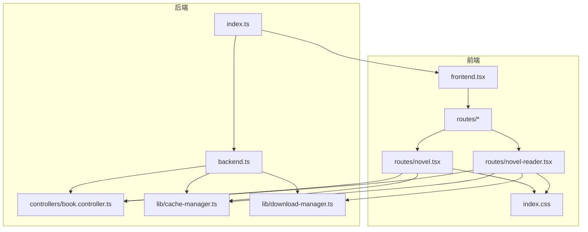
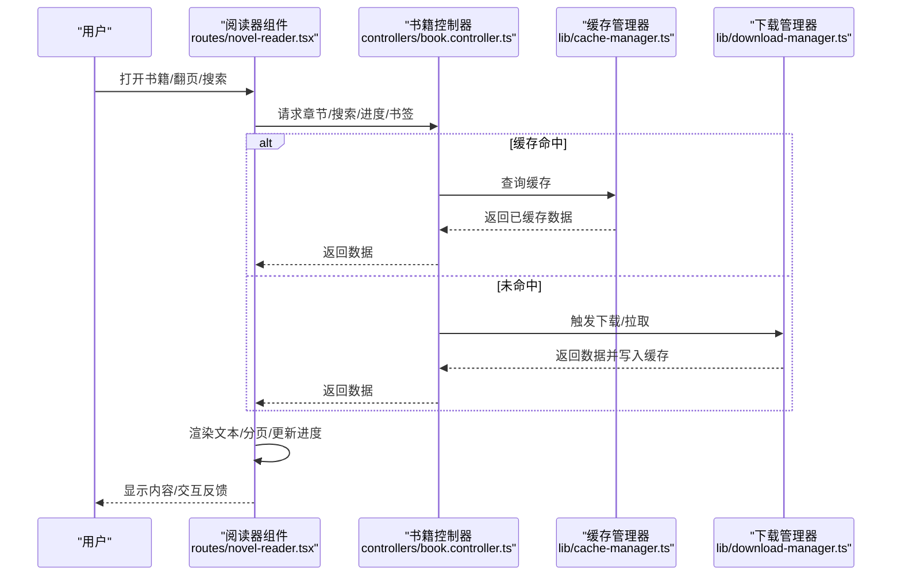
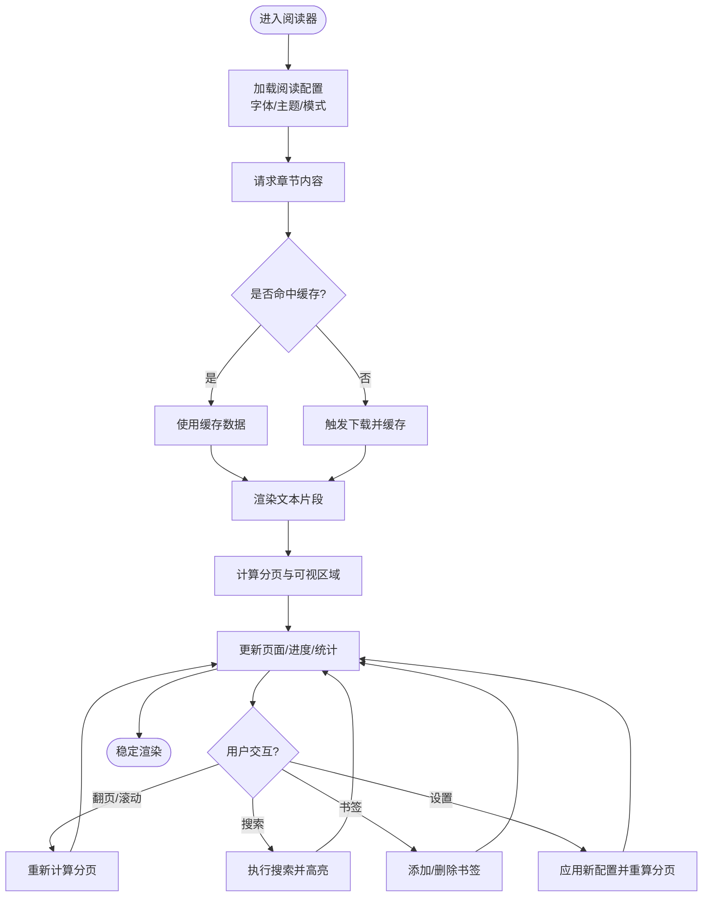
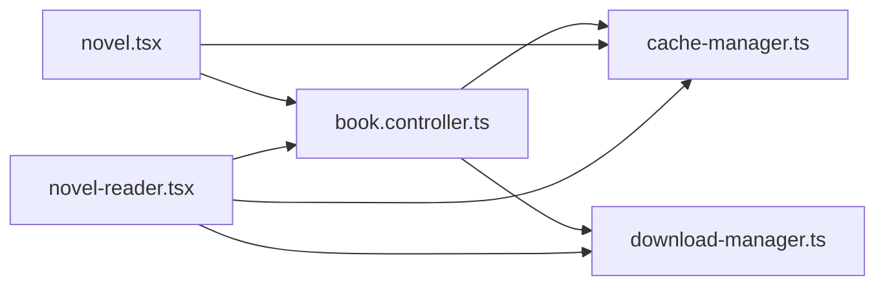

# 小说阅读器

<cite>
**本文引用的文件**   
- [novel-reader.tsx](file://routes/novel-reader.tsx)
- [novel.tsx](file://routes/novel.tsx)
- [book.controller.ts](file://controllers/book.controller.ts)
- [cache-manager.ts](file://lib/cache-manager.ts)
- [download-manager.ts](file://lib/download-manager.ts)
- [index.css](file://index.css)
- [frontend.tsx](file://frontend.tsx)
- [backend.ts](file://backend.ts)
- [index.ts](file://index.ts)
</cite>

## 目录
1. [简介](#简介)
2. [项目结构](#项目结构)
3. [核心组件](#核心组件)
4. [架构总览](#架构总览)
5. [详细组件分析](#详细组件分析)
6. [依赖关系分析](#依赖关系分析)
7. [性能考虑](#性能考虑)
8. [故障排查指南](#故障排查指南)
9. [结论](#结论)
10. [附录](#附录)

## 简介
本文件为 Bun-zlib 的小说阅读器组件提供系统化文档，覆盖界面布局、文本渲染与分页逻辑、阅读进度保存、书签与搜索、字体与主题切换、阅读模式（白天/夜间）、键盘导航与手势操作、响应式适配、章节跳转、目录显示以及阅读统计等能力。文档以代码级事实为依据，辅以可视化图示，帮助开发者快速理解并扩展该阅读器。

## 项目结构
本项目采用前后端一体化结构：前端路由与页面组件位于 routes 目录，控制器与业务逻辑位于 controllers 与 lib 目录，样式与入口文件位于根目录。小说阅读器的关键实现集中在 routes/novel-reader.tsx 与 routes/novel.tsx，并通过后端控制器 book.controller.ts 访问书籍数据；缓存与下载由 lib 层统一管理；全局样式与主题通过 index.css 管理；应用启动与前后端桥接在 backend.ts、frontend.tsx 与 index.ts 中完成。

图表来源
- [frontend.tsx](file://frontend.tsx)
- [novel-reader.tsx](file://routes/novel-reader.tsx)
- [novel.tsx](file://routes/novel.tsx)
- [backend.ts](file://backend.ts)
- [index.ts](file://index.ts)
- [book.controller.ts](file://controllers/book.controller.ts)
- [cache-manager.ts](file://lib/cache-manager.ts)
- [download-manager.ts](file://lib/download-manager.ts)
- [index.css](file://index.css)

章节来源
- [novel-reader.tsx](file://routes/novel-reader.tsx)
- [novel.tsx](file://routes/novel.tsx)
- [book.controller.ts](file://controllers/book.controller.ts)
- [cache-manager.ts](file://lib/cache-manager.ts)
- [download-manager.ts](file://lib/download-manager.ts)
- [index.css](file://index.css)
- [frontend.tsx](file://frontend.tsx)
- [backend.ts](file://backend.ts)
- [index.ts](file://index.ts)

## 核心组件
- 阅读器页面组件：负责渲染正文内容、处理翻页、加载章节、展示目录与搜索面板、维护阅读设置与状态。
- 书籍列表/详情页：用于选择书籍、进入阅读器、展示基础元信息。
- 控制器：提供获取章节、搜索、进度与书签等接口。
- 缓存与下载管理器：负责本地缓存策略与离线下载，提升阅读体验。
- 样式与主题：集中管理字体、字号、行距、主题色与明暗模式变量。

章节来源
- [novel-reader.tsx](file://routes/novel-reader.tsx)
- [novel.tsx](file://routes/novel.tsx)
- [book.controller.ts](file://controllers/book.controller.ts)
- [cache-manager.ts](file://lib/cache-manager.ts)
- [download-manager.ts](file://lib/download-manager.ts)
- [index.css](file://index.css)

## 架构总览
阅读器采用“前端组件 + 后端控制器 + 本地缓存”的分层架构。前端组件通过控制器发起请求，控制器从数据源读取或从缓存命中返回结果；下载管理器按需拉取资源并持久化到本地缓存，供后续离线使用。主题与字体通过 CSS 变量与类名切换实现，阅读模式（白天/夜间）通过主题类控制。

图表来源
- [novel-reader.tsx](file://routes/novel-reader.tsx)
- [book.controller.ts](file://controllers/book.controller.ts)
- [cache-manager.ts](file://lib/cache-manager.ts)
- [download-manager.ts](file://lib/download-manager.ts)

## 详细组件分析

### 阅读器组件（routes/novel-reader.tsx）
- 界面布局
  - 顶部工具栏：包含返回、目录、搜索、设置（字体/主题/模式）。
  - 主体区域：文本渲染容器，支持滚动与分页。
  - 底部状态栏：显示当前页码、章节进度、阅读时长等统计。
  - 侧边抽屉：目录树与书签列表。
- 文本渲染引擎与分页逻辑
  - 将章节内容按段落/句子切分，计算每段高度，累计至达到视口高度阈值时进行分页。
  - 支持动态字号、行距、字重对分页的影响，并在设置变更时重新计算分页。
  - 虚拟滚动优化：仅渲染可视区域内的片段，减少 DOM 节点数量。
- 阅读进度保存
  - 记录当前书籍、章节索引、页码、滚动位置与时间戳，定期与本地存储同步。
  - 支持恢复上次阅读位置，进入书籍后自动定位。
- 书签功能
  - 支持在当前页添加/删除书签，书签包含章节、页码与可选备注。
  - 书签列表可在侧边抽屉中浏览与跳转。
- 搜索能力
  - 支持全文检索，高亮匹配片段，支持上/下一条跳转。
  - 搜索结果可缓存，避免重复计算。
- 字体设置与主题切换
  - 字体族、字号、行距、对齐方式可通过设置面板调整，实时生效。
  - 主题切换通过切换类名与 CSS 变量实现，支持白天/夜间两种模式。
- 阅读模式（白天/夜间）
  - 通过主题类控制背景、前景、强调色与阴影等视觉属性。
  - 支持跟随系统偏好与手动切换。
- 键盘导航与手势操作
  - 键盘：左右箭头翻页、上下键滚动、Esc 关闭面板、Enter 确认搜索。
  - 手势：滑动翻页、长按添加书签、双击调整字号。
- 响应式适配
  - 根据屏幕宽度与方向自适应布局，移动端隐藏非必要控件，增大触控区域。
- 章节跳转与目录显示
  - 目录树支持层级展开与点击跳转，支持跳转到指定章节的指定页。
- 阅读统计
  - 统计阅读时长、页数、章节完成率，支持导出或分享。

图表来源
- [novel-reader.tsx](file://routes/novel-reader.tsx)
- [cache-manager.ts](file://lib/cache-manager.ts)
- [download-manager.ts](file://lib/download-manager.ts)

章节来源
- [novel-reader.tsx](file://routes/novel-reader.tsx)

### 书籍页面（routes/novel.tsx）
- 展示书籍列表与详情，支持搜索书籍、查看元信息、进入阅读器。
- 与控制器交互获取书籍列表与基本信息，结合缓存提升加载速度。
- 提供进入阅读器的入口与最近阅读提示。

章节来源
- [novel.tsx](file://routes/novel.tsx)

### 控制器（controllers/book.controller.ts）
- 提供以下接口能力：
  - 获取章节内容与目录结构
  - 全文搜索（支持关键词与范围过滤）
  - 读取/更新阅读进度与书签
  - 批量下载章节并落盘
- 与缓存管理器协作，优先命中缓存，未命中则触发下载并回填缓存。

章节来源
- [book.controller.ts](file://controllers/book.controller.ts)

### 缓存与下载（lib/cache-manager.ts, lib/download-manager.ts）
- 缓存管理器
  - 提供 get/set/clear 等操作，支持按书籍/章节维度组织键空间。
  - 支持过期策略与容量限制，避免无限增长。
- 下载管理器
  - 支持并发下载、断点续传、失败重试与错误聚合。
  - 下载完成后写入缓存，供阅读器快速读取。

章节来源
- [cache-manager.ts](file://lib/cache-manager.ts)
- [download-manager.ts](file://lib/download-manager.ts)

### 样式与主题（index.css）
- 定义字体族、字号、行距、颜色变量与明暗主题类。
- 提供响应式断点与组件样式基线，确保在不同设备上的一致性。

章节来源
- [index.css](file://index.css)

### 应用入口与前后端桥接（frontend.tsx, backend.ts, index.ts）
- frontend.tsx：挂载前端应用与路由。
- backend.ts：注册后端控制器与中间件。
- index.ts：统一启动前后端服务，绑定端口与静态资源。

章节来源
- [frontend.tsx](file://frontend.tsx)
- [backend.ts](file://backend.ts)
- [index.ts](file://index.ts)

## 依赖关系分析
- 组件耦合
  - 阅读器组件依赖控制器获取数据，依赖缓存与下载管理器提升性能。
  - 书籍页面依赖控制器与缓存管理器。
- 外部依赖
  - 文件系统与网络 I/O 由后端控制器与下载管理器封装，前端无直接依赖。
- 潜在循环依赖
  - 控制器与缓存/下载管理器之间单向依赖，未发现循环引用。

图表来源
- [novel-reader.tsx](file://routes/novel-reader.tsx)
- [novel.tsx](file://routes/novel.tsx)
- [book.controller.ts](file://controllers/book.controller.ts)
- [cache-manager.ts](file://lib/cache-manager.ts)
- [download-manager.ts](file://lib/download-manager.ts)

章节来源
- [novel-reader.tsx](file://routes/novel-reader.tsx)
- [novel.tsx](file://routes/novel.tsx)
- [book.controller.ts](file://controllers/book.controller.ts)
- [cache-manager.ts](file://lib/cache-manager.ts)
- [download-manager.ts](file://lib/download-manager.ts)

## 性能考虑
- 分页与虚拟滚动：仅渲染可视区域，降低 DOM 压力，提高长文阅读流畅度。
- 缓存命中：优先从缓存读取章节与搜索结果，减少网络开销。
- 并发下载：合理控制并发数，避免阻塞主线程。
- 设置变更重算：仅在必要字段变化时触发分页重算，避免频繁计算。
- 图片与富媒体：若章节含图片，建议懒加载与尺寸压缩。

[本节为通用指导，不直接分析具体文件]

## 故障排查指南
- 无法加载章节
  - 检查控制器是否正确转发请求，确认缓存键是否存在。
  - 查看下载管理器日志，确认网络与权限问题。
- 进度未保存
  - 确认本地存储可用性与配额，检查保存时机与频率。
- 搜索无结果
  - 验证索引构建是否成功，检查关键词大小写与模糊匹配策略。
- 主题/字体不生效
  - 检查 CSS 变量与类名是否正确注入，浏览器控制台是否有样式冲突。
- 手势/键盘无效
  - 确认事件监听器是否被其他组件拦截，焦点是否在阅读器容器内。

章节来源
- [book.controller.ts](file://controllers/book.controller.ts)
- [cache-manager.ts](file://lib/cache-manager.ts)
- [download-manager.ts](file://lib/download-manager.ts)
- [index.css](file://index.css)

## 结论
本小说阅读器以清晰的层次结构与良好的缓存策略为基础，提供了完善的阅读体验与扩展点。通过分页与虚拟滚动、主题与字体配置、书签与搜索、进度与统计等功能，满足多场景阅读需求。建议在后续迭代中持续优化渲染性能与交互细节，并完善错误监控与可观测性。

[本节为总结性内容，不直接分析具体文件]

## 附录
- 术语说明
  - 分页：将长文本按可视区域切分为多个页面，便于逐页阅读。
  - 虚拟滚动：仅渲染可见区域的元素，以提升性能。
  - 书签：标记特定章节与页码，便于快速回跳。
- 最佳实践
  - 保持设置变更幂等，避免重复计算。
  - 对大体积资源启用压缩与懒加载。
  - 为关键路径增加埋点与错误上报。

[本节为补充信息，不直接分析具体文件]