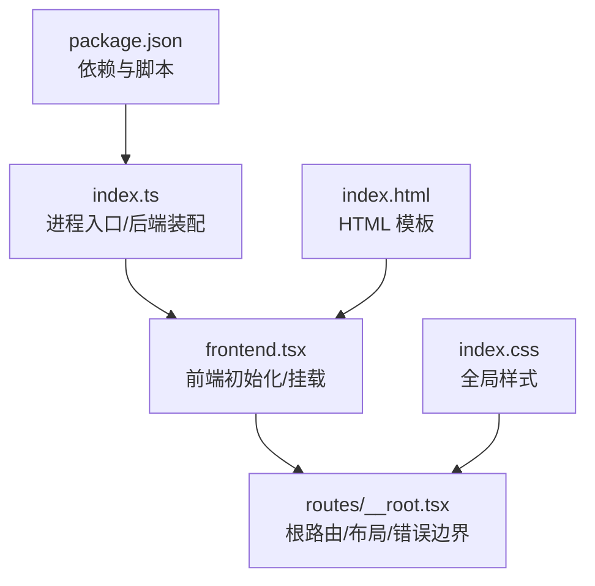
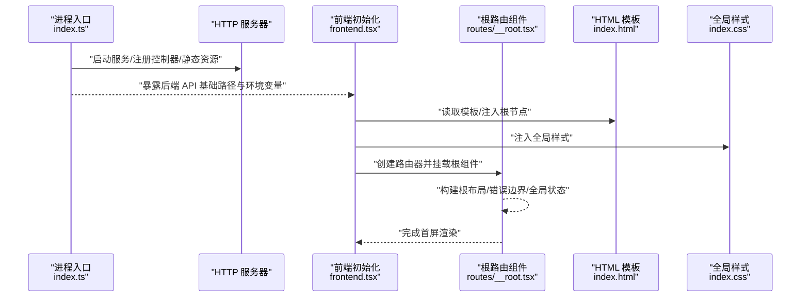
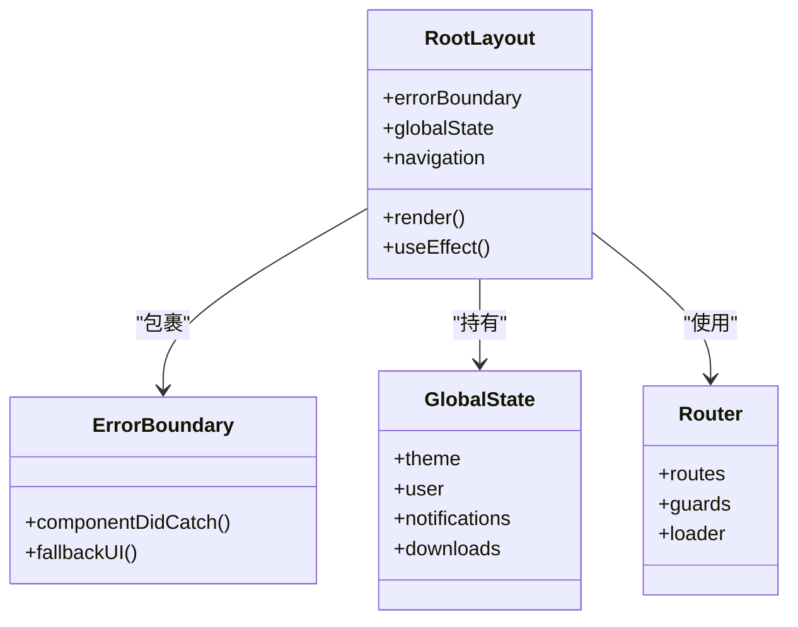
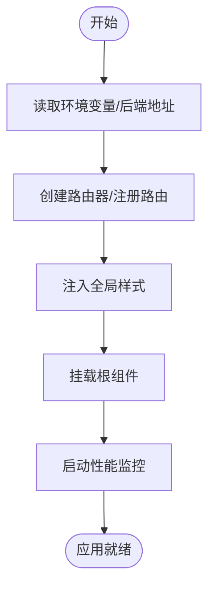
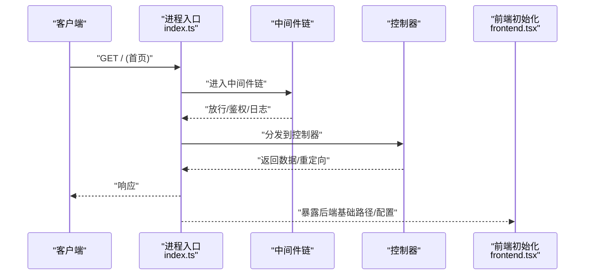
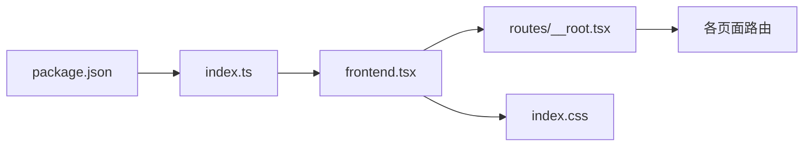

# 根组件

<cite>
**本文引用的文件**   
- [index.ts](file://index.ts)
- [frontend.tsx](file://frontend.tsx)
- [routes/__root.tsx](file://routes/__root.tsx)
- [index.html](file://index.html)
- [index.css](file://index.css)
- [package.json](file://package.json)
</cite>

## 目录
1. [简介](#简介)
2. [项目结构](#项目结构)
3. [核心组件](#核心组件)
4. [架构总览](#架构总览)
5. [详细组件分析](#详细组件分析)
6. [依赖关系分析](#依赖关系分析)
7. [性能考虑](#性能考虑)
8. [故障排查指南](#故障排查指南)
9. [结论](#结论)
10. [附录](#附录)

## 简介
本文件聚焦于 Bun-zlib 应用的“根组件”与启动链路，系统性说明以下方面：
- 根组件的初始化流程、全局状态管理与应用生命周期
- 路由配置、中间件集成与错误边界处理
- 应用启动配置、全局样式注入与性能监控设置
- 组件树结构与依赖关系
- 全局事件处理与状态同步机制

目标是帮助读者快速理解从进程入口到前端根组件挂载的全链路，并掌握关键扩展点。

## 项目结构
Bun-zlib 采用前后端同仓组织，根级入口负责后端服务与前端渲染的装配；前端以 React Router v7 为路由内核，根路由位于 routes/__root.tsx，全局样式由 index.css 提供，HTML 模板在 index.html。



图表来源
- [index.ts:1-200](file://index.ts#L1-L200)
- [frontend.tsx:1-200](file://frontend.tsx#L1-L200)
- [routes/__root.tsx:1-200](file://routes/__root.tsx#L1-L200)
- [index.html:1-200](file://index.html#L1-L200)
- [index.css:1-200](file://index.css#L1-L200)
- [package.json:1-200](file://package.json#L1-L200)

章节来源
- [index.ts:1-200](file://index.ts#L1-L200)
- [frontend.tsx:1-200](file://frontend.tsx#L1-L200)
- [routes/__root.tsx:1-200](file://routes/__root.tsx#L1-L200)
- [index.html:1-200](file://index.html#L1-L200)
- [index.css:1-200](file://index.css#L1-L200)
- [package.json:1-200](file://package.json#L1-L200)

## 核心组件
- 根路由组件（routes/__root.tsx）
  - 职责：定义根布局、加载器/动作、错误边界、全局 UI Shell、导航与页面容器等。
  - 关键点：作为所有页面的父节点，集中管理全局状态、主题、通知、进度条等横切关注点。
- 前端初始化（frontend.tsx）
  - 职责：创建路由器实例、注册路由、挂载根组件、注入全局样式、启动性能监控。
  - 关键点：将后端提供的 API 基础路径、跨域策略、缓存策略等配置传入前端上下文。
- 进程入口（index.ts）
  - 职责：启动 HTTP 服务器、注册控制器、静态资源托管、服务端渲染桥接。
  - 关键点：暴露后端能力给前端，确保 SSR/CSR 一致性与资源路径统一。

章节来源
- [routes/__root.tsx:1-200](file://routes/__root.tsx#L1-L200)
- [frontend.tsx:1-200](file://frontend.tsx#L1-L200)
- [index.ts:1-200](file://index.ts#L1-L200)

## 架构总览
下图展示从进程启动到根组件渲染的关键路径，以及前后端交互面。



图表来源
- [index.ts:1-200](file://index.ts#L1-L200)
- [frontend.tsx:1-200](file://frontend.tsx#L1-L200)
- [routes/__root.tsx:1-200](file://routes/__root.tsx#L1-L200)
- [index.html:1-200](file://index.html#L1-L200)
- [index.css:1-200](file://index.css#L1-L200)

## 详细组件分析

### 根路由组件（routes/__root.tsx）
- 初始化流程
  - 作为应用根节点，负责组合全局布局、错误边界、加载指示器与页面出口。
  - 通过路由加载器/动作进行数据预取与副作用处理，保证首屏数据就绪。
- 全局状态管理
  - 在根层级维护主题、用户会话、下载任务列表、通知中心等共享状态。
  - 使用 React Context 或轻量状态库进行跨组件同步，避免深层 props 透传。
- 应用生命周期
  - 挂载阶段：初始化全局监听（如网络状态、窗口尺寸）、恢复持久化状态。
  - 更新阶段：根据路由变化刷新全局面包屑、标题、统计埋点。
  - 卸载阶段：清理定时器、取消未完成的请求、释放订阅。
- 错误边界处理
  - 在根层包裹错误边界，捕获子树渲染异常，显示降级 UI 并上报错误。
  - 区分可恢复错误与致命错误，提供重试与回退策略。
- 路由与中间件
  - 根路由集中声明嵌套路由与守卫逻辑，实现鉴权、权限校验与访问日志。
  - 中间件式钩子用于请求拦截、响应标准化与错误归一化。
- 全局样式注入
  - 引入全局样式表，必要时按路由懒加载局部样式，减少首屏体积。
- 性能监控
  - 在根组件中接入性能采集（如首次绘制、长任务、内存峰值），上报至后端或第三方平台。



图表来源
- [routes/__root.tsx:1-200](file://routes/__root.tsx#L1-L200)

章节来源
- [routes/__root.tsx:1-200](file://routes/__root.tsx#L1-L200)

### 前端初始化（frontend.tsx）
- 初始化流程
  - 解析环境变量与后端基础路径，创建路由器实例，注册路由表。
  - 选择渲染目标 DOM 节点，挂载根组件，完成首屏渲染。
- 全局样式注入
  - 动态注入全局样式表，支持按需加载与版本化缓存。
- 性能监控设置
  - 开启浏览器性能指标采集，记录关键时间戳与错误堆栈。
- 中间件集成
  - 注册请求/响应拦截器，统一处理鉴权、重试、错误提示与埋点。
- 错误边界与兜底
  - 在根组件外层设置全局错误边界，捕获未知异常并展示友好提示。



图表来源
- [frontend.tsx:1-200](file://frontend.tsx#L1-L200)
- [index.css:1-200](file://index.css#L1-L200)

章节来源
- [frontend.tsx:1-200](file://frontend.tsx#L1-L200)
- [index.css:1-200](file://index.css#L1-L200)

### 进程入口（index.ts）
- 启动配置
  - 初始化 HTTP 服务器，绑定端口，启用压缩与静态资源服务。
  - 注册控制器与路由，提供后端 API 与文件下载能力。
- 中间件集成
  - 集成 CORS、日志、请求体解析、速率限制与安全头中间件。
- 错误处理
  - 全局错误处理器统一返回标准错误格式，记录堆栈与上下文。
- 与前端协作
  - 暴露后端基础路径与运行时配置，供前端初始化时读取。
  - 提供 SSR 兼容接口，确保前后端一致性。



图表来源
- [index.ts:1-200](file://index.ts#L1-L200)
- [frontend.tsx:1-200](file://frontend.tsx#L1-L200)

章节来源
- [index.ts:1-200](file://index.ts#L1-L200)

### 全局事件处理与状态同步机制
- 事件总线
  - 在根组件内建立轻量事件总线，用于跨模块通信（如下载完成、通知弹出）。
- 状态同步
  - 基于 URL 的状态与本地持久化状态双向同步，刷新页面后恢复体验。
  - 对高频状态变更进行节流/防抖，降低渲染压力。
- 错误上报
  - 捕获未处理异常与 Promise 拒绝，聚合上报并附带上下文信息。

```mermaid
flowchart TD
A["全局事件源"] --> B["事件总线"]
B --> C["订阅者A<br/>下载管理器"]
B --> D["订阅者B<br/>通知中心"]
E["URL 状态"] < --> F["本地持久化"]
G["错误上报"] --> H["后端/监控平台"]
```

[此图为概念性流程图，不直接映射具体源码文件]

## 依赖关系分析
- 外部依赖
  - 前端框架与路由：React、React Router v7
  - 构建与运行：Bun
  - 样式：CSS 模块化或全局样式
- 内部依赖
  - 根组件依赖前端初始化模块与全局样式
  - 前端初始化依赖进程入口暴露的后端配置
  - 控制器与路由解耦，便于扩展与维护



图表来源
- [package.json:1-200](file://package.json#L1-L200)
- [index.ts:1-200](file://index.ts#L1-L200)
- [frontend.tsx:1-200](file://frontend.tsx#L1-L200)
- [routes/__root.tsx:1-200](file://routes/__root.tsx#L1-L200)
- [index.css:1-200](file://index.css#L1-L200)

章节来源
- [package.json:1-200](file://package.json#L1-L200)
- [index.ts:1-200](file://index.ts#L1-L200)
- [frontend.tsx:1-200](file://frontend.tsx#L1-L200)
- [routes/__root.tsx:1-200](file://routes/__root.tsx#L1-L200)
- [index.css:1-200](file://index.css#L1-L200)

## 性能考虑
- 首屏优化
  - 根组件仅保留必要的全局 UI 与最小状态，页面级代码按需加载。
  - 全局样式拆分与懒加载，避免一次性注入过大 CSS。
- 渲染优化
  - 对大列表与复杂视图使用虚拟滚动与增量更新。
  - 避免在根组件中执行昂贵计算，必要时使用 Web Worker。
- 网络优化
  - 请求合并、去重与缓存策略，结合后端控制 Cache-Control。
  - 失败重试与指数退避，提升弱网稳定性。
- 监控与观测
  - 采集关键指标（FCP、LCP、CLS、长任务、内存），定位瓶颈。
  - 错误分级上报，区分业务错误与系统错误。

[本节为通用指导，无需源码引用]

## 故障排查指南
- 常见问题
  - 根组件未渲染：检查前端初始化是否成功挂载、DOM 节点是否存在、路由是否正确注册。
  - 全局样式未生效：确认样式注入顺序与路径正确，浏览器缓存是否过期。
  - 错误边界未捕获：确认错误边界包裹范围与异常类型匹配。
  - 后端不可用：检查进程入口是否启动、端口占用、CORS 与基础路径配置。
- 诊断步骤
  - 查看控制台错误与网络面板，定位失败请求与异常堆栈。
  - 临时关闭中间件或路由守卫，缩小问题范围。
  - 使用性能面板对比优化前后的指标变化。

章节来源
- [routes/__root.tsx:1-200](file://routes/__root.tsx#L1-L200)
- [frontend.tsx:1-200](file://frontend.tsx#L1-L200)
- [index.ts:1-200](file://index.ts#L1-L200)

## 结论
根组件是 Bun-zlib 应用的前端中枢，承担全局布局、状态、错误边界与性能监控的职责。配合进程入口与前端初始化模块，形成清晰的启动链路和可扩展的架构。遵循本文的规范与最佳实践，可在保持高内聚低耦合的同时，持续提升用户体验与可维护性。

[本节为总结性内容，无需源码引用]

## 附录
- 术语
  - 根组件：应用最顶层的路由/布局组件，承载全局 UI 与状态。
  - 中间件：在请求/响应处理链中执行的横切逻辑。
  - 错误边界：捕获子树渲染错误的 React 组件。
- 参考文件
  - 进程入口与后端装配：[index.ts](file://index.ts)
  - 前端初始化与挂载：[frontend.tsx](file://frontend.tsx)
  - 根路由与布局：[routes/__root.tsx](file://routes/__root.tsx)
  - HTML 模板：[index.html](file://index.html)
  - 全局样式：[index.css](file://index.css)
  - 依赖与脚本：[package.json](file://package.json)