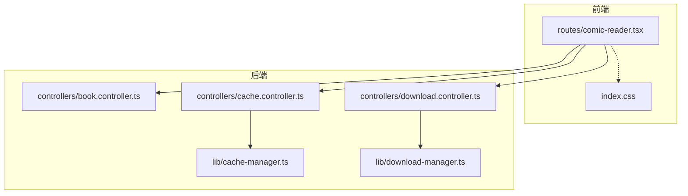
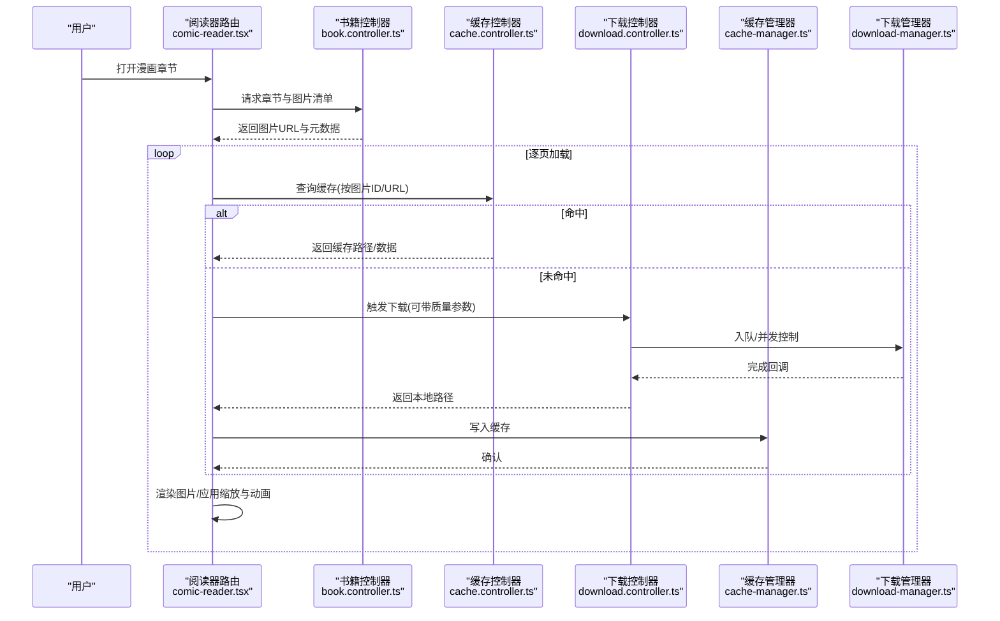
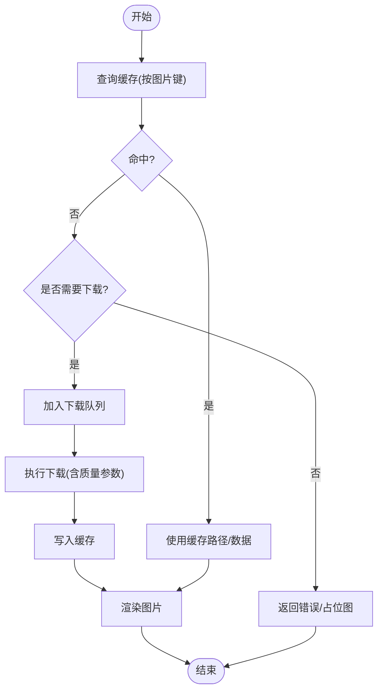
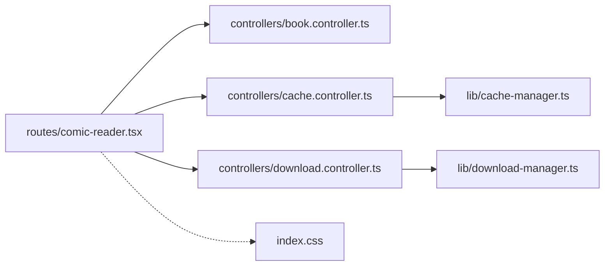

# 漫画阅读器

<cite>
**本文引用的文件**   
- [routes/comic-reader.tsx](file://routes/comic-reader.tsx)
- [lib/cache-manager.ts](file://lib/cache-manager.ts)
- [lib/download-manager.ts](file://lib/download-manager.ts)
- [controllers/book.controller.ts](file://controllers/book.controller.ts)
- [controllers/cache.controller.ts](file://controllers/cache.controller.ts)
- [controllers/download.controller.ts](file://controllers/download.controller.ts)
- [index.css](file://index.css)
</cite>

## 目录
1. [简介](#简介)
2. [项目结构](#项目结构)
3. [核心组件](#核心组件)
4. [架构总览](#架构总览)
5. [详细组件分析](#详细组件分析)
6. [依赖关系分析](#依赖关系分析)
7. [性能考量](#性能考量)
8. [故障排查指南](#故障排查指南)
9. [结论](#结论)
10. [附录](#附录)

## 简介
本文件为 Bun-zlib 的漫画阅读器组件提供系统化文档，覆盖图片加载优化、缩放控制与翻页动画、图像缓存策略与预加载机制、内存管理、全屏/滚动/网格视图切换、手势操作（滑动、双击缩放）与触摸设备适配、图片质量设置、格式支持与下载管理等主题。文档以“渐进式复杂度”组织，既适合快速上手，也便于深入实现细节。

## 项目结构
漫画阅读相关的前端路由与后端控制器、缓存与下载管理器共同构成阅读体验的核心链路：
- 前端路由：漫画阅读器页面入口与交互逻辑
- 后端控制器：书籍资源、缓存与下载的接口封装
- 缓存与下载管理器：本地缓存与下载任务编排
- 样式：全局样式与阅读器界面布局

图表来源
- [routes/comic-reader.tsx](file://routes/comic-reader.tsx)
- [controllers/book.controller.ts](file://controllers/book.controller.ts)
- [controllers/cache.controller.ts](file://controllers/cache.controller.ts)
- [controllers/download.controller.ts](file://controllers/download.controller.ts)
- [lib/cache-manager.ts](file://lib/cache-manager.ts)
- [lib/download-manager.ts](file://lib/download-manager.ts)
- [index.css](file://index.css)

章节来源
- [routes/comic-reader.tsx](file://routes/comic-reader.tsx)
- [controllers/book.controller.ts](file://controllers/book.controller.ts)
- [controllers/cache.controller.ts](file://controllers/cache.controller.ts)
- [controllers/download.controller.ts](file://controllers/download.controller.ts)
- [lib/cache-manager.ts](file://lib/cache-manager.ts)
- [lib/download-manager.ts](file://lib/download-manager.ts)
- [index.css](file://index.css)

## 核心组件
- 漫画阅读器路由组件：负责渲染图片列表、处理视图模式（全屏/滚动/网格）、缩放与手势、翻页动画、预加载与缓存命中、以及下载进度展示。
- 书籍控制器：提供获取章节、图片元数据与资源地址的能力。
- 缓存控制器：提供缓存查询、清理与统计等能力，供阅读器在需要时调用。
- 下载控制器：提供下载任务的创建、状态查询与取消等操作。
- 缓存管理器：维护本地缓存键空间、命中率统计与淘汰策略。
- 下载管理器：维护下载队列、并发限制、重试与断点续传（若实现）。

章节来源
- [routes/comic-reader.tsx](file://routes/comic-reader.tsx)
- [controllers/book.controller.ts](file://controllers/book.controller.ts)
- [controllers/cache.controller.ts](file://controllers/cache.controller.ts)
- [controllers/download.controller.ts](file://controllers/download.controller.ts)
- [lib/cache-manager.ts](file://lib/cache-manager.ts)
- [lib/download-manager.ts](file://lib/download-manager.ts)

## 架构总览
漫画阅读器的整体流程从前端路由发起，经控制器访问书籍资源与缓存/下载服务，最终由浏览器渲染图片并驱动交互。

图表来源
- [routes/comic-reader.tsx](file://routes/comic-reader.tsx)
- [controllers/book.controller.ts](file://controllers/book.controller.ts)
- [controllers/cache.controller.ts](file://controllers/cache.controller.ts)
- [controllers/download.controller.ts](file://controllers/download.controller.ts)
- [lib/cache-manager.ts](file://lib/cache-manager.ts)
- [lib/download-manager.ts](file://lib/download-manager.ts)

## 详细组件分析

### 图片加载优化
- 懒加载与可视区域检测：仅在进入视口时加载图片，减少首屏压力。
- 预加载策略：基于当前页与下一页进行窗口化预取，避免翻页卡顿。
- 并发与优先级：对前景页高优先级加载，背景页低优先级；限制并发避免阻塞UI。
- 错误重试与降级：网络失败自动重试，失败回退到占位图或更低质量版本。
- 去重与合并请求：相同URL的请求合并，避免重复下载。

章节来源
- [routes/comic-reader.tsx](file://routes/comic-reader.tsx)
- [controllers/cache.controller.ts](file://controllers/cache.controller.ts)
- [controllers/download.controller.ts](file://controllers/download.controller.ts)
- [lib/cache-manager.ts](file://lib/cache-manager.ts)
- [lib/download-manager.ts](file://lib/download-manager.ts)

### 缩放控制
- 支持滚轮/触控板缩放、双指捏合缩放、双击放大/还原。
- 锚点缩放：以点击位置为中心缩放，保持视觉连续性。
- 边界约束：最小/最大缩放比例限制，防止过度放大导致抖动。
- 平滑过渡：使用缓动函数提升缩放体验。

章节来源
- [routes/comic-reader.tsx](file://routes/comic-reader.tsx)
- [index.css](file://index.css)

### 翻页动画
- 左右滑动翻页：根据滑动距离与速度判断翻页方向。
- 惯性滚动：结合速度与阻尼系数，模拟自然翻页。
- 过渡效果：淡入淡出或滑入滑出，配合预加载降低闪烁。

章节来源
- [routes/comic-reader.tsx](file://routes/comic-reader.tsx)

### 图像缓存策略
- 缓存键设计：以图片唯一标识（如URL或哈希）作为键，避免冲突。
- 命中优先：读取顺序为内存→磁盘→网络，命中则跳过下载。
- 淘汰策略：LRU或容量上限控制，释放长期不访问的图片。
- 一致性保证：更新图片后失效旧缓存，确保显示最新内容。

章节来源
- [lib/cache-manager.ts](file://lib/cache-manager.ts)
- [controllers/cache.controller.ts](file://controllers/cache.controller.ts)

### 预加载机制
- 窗口化预取：围绕当前页前后N页进行预取，平衡内存与流畅度。
- 优先级调度：当前页最高，相邻页次之，远端页最低。
- 动态调整：根据网络状况与设备性能自适应预取数量。

章节来源
- [routes/comic-reader.tsx](file://routes/comic-reader.tsx)
- [lib/download-manager.ts](file://lib/download-manager.ts)

### 内存管理
- 及时释放：离开视口的图片对象及时释放引用，避免内存泄漏。
- 分片渲染：大图分块渲染或按需解码，降低峰值内存。
- 监控与告警：监听内存占用，超过阈值主动清理缓存与释放资源。

章节来源
- [routes/comic-reader.tsx](file://routes/comic-reader.tsx)
- [lib/cache-manager.ts](file://lib/cache-manager.ts)

### 视图模式切换
- 全屏模式：隐藏无关UI，最大化图片显示区域，适合沉浸式阅读。
- 滚动模式：垂直连续滚动，适合长条漫或移动端浏览。
- 网格视图：缩略图网格展示，便于定位与跳转。

章节来源
- [routes/comic-reader.tsx](file://routes/comic-reader.tsx)
- [index.css](file://index.css)

### 手势与触摸适配
- 滑动：单指水平滑动用于翻页，垂直滑动用于滚动模式。
- 双击缩放：双击放大，再次双击还原；支持自定义双击区域。
- 捏合缩放：双指捏合实现缩放，中心点跟随手指。
- 长按菜单：长按弹出下载/保存选项（若启用）。

章节来源
- [routes/comic-reader.tsx](file://routes/comic-reader.tsx)

### 图片质量设置
- 质量档位：低/中/高三档，影响分辨率与体积。
- 自适应质量：根据网络类型与带宽动态选择质量。
- 缓存隔离：不同质量的图片拥有独立缓存键，避免互相污染。

章节来源
- [controllers/download.controller.ts](file://controllers/download.controller.ts)
- [lib/download-manager.ts](file://lib/download-manager.ts)
- [lib/cache-manager.ts](file://lib/cache-manager.ts)

### 格式支持与下载管理
- 格式支持：常见图片格式（如PNG/JPEG/WebP），依据后端返回与浏览器能力决定。
- 下载队列：并发限制、重试与失败重试策略。
- 进度反馈：实时进度条与百分比提示。
- 断点续传：若后端支持，可实现中断恢复。

章节来源
- [controllers/download.controller.ts](file://controllers/download.controller.ts)
- [lib/download-manager.ts](file://lib/download-manager.ts)

### 关键流程图：图片加载与缓存决策

图表来源
- [routes/comic-reader.tsx](file://routes/comic-reader.tsx)
- [controllers/cache.controller.ts](file://controllers/cache.controller.ts)
- [controllers/download.controller.ts](file://controllers/download.controller.ts)
- [lib/cache-manager.ts](file://lib/cache-manager.ts)
- [lib/download-manager.ts](file://lib/download-manager.ts)

## 依赖关系分析
- 阅读器路由依赖书籍控制器获取资源清单，依赖缓存/下载控制器进行资源获取与持久化。
- 缓存与下载管理器分别被对应控制器组合使用，形成清晰的职责边界。
- 样式文件为阅读器提供基础布局与交互样式。

图表来源
- [routes/comic-reader.tsx](file://routes/comic-reader.tsx)
- [controllers/book.controller.ts](file://controllers/book.controller.ts)
- [controllers/cache.controller.ts](file://controllers/cache.controller.ts)
- [controllers/download.controller.ts](file://controllers/download.controller.ts)
- [lib/cache-manager.ts](file://lib/cache-manager.ts)
- [lib/download-manager.ts](file://lib/download-manager.ts)
- [index.css](file://index.css)

章节来源
- [routes/comic-reader.tsx](file://routes/comic-reader.tsx)
- [controllers/book.controller.ts](file://controllers/book.controller.ts)
- [controllers/cache.controller.ts](file://controllers/cache.controller.ts)
- [controllers/download.controller.ts](file://controllers/download.controller.ts)
- [lib/cache-manager.ts](file://lib/cache-manager.ts)
- [lib/download-manager.ts](file://lib/download-manager.ts)
- [index.css](file://index.css)

## 性能考量
- 首屏时间：通过预加载与缓存命中降低首次加载延迟。
- 滚动帧率：减少主线程阻塞，图片解码与渲染异步化。
- 内存峰值：采用窗口化与及时释放策略，避免长时间驻留大图。
- 网络拥塞：自适应质量与并发控制，避免带宽饱和。

[本节为通用指导，无需具体文件来源]

## 故障排查指南
- 图片无法加载：检查缓存键是否一致、下载任务是否成功、网络状态与跨域配置。
- 缩放异常：确认事件监听是否正确绑定、锚点计算是否准确、边界约束是否合理。
- 翻页卡顿：检查预加载窗口大小、并发限制与图片尺寸是否过大。
- 内存泄漏：确认离开视口后的图片引用是否释放、定时器与事件监听是否清理。

章节来源
- [routes/comic-reader.tsx](file://routes/comic-reader.tsx)
- [controllers/cache.controller.ts](file://controllers/cache.controller.ts)
- [controllers/download.controller.ts](file://controllers/download.controller.ts)
- [lib/cache-manager.ts](file://lib/cache-manager.ts)
- [lib/download-manager.ts](file://lib/download-manager.ts)

## 结论
漫画阅读器通过“路由+控制器+管理器”的分层架构，将图片加载、缓存、下载与交互解耦，实现了高性能、可扩展的阅读体验。合理的预加载与缓存策略、完善的缩放与手势支持、灵活的视图模式切换，使其在桌面与移动设备上均能提供流畅的沉浸式阅读。

[本节为总结性内容，无需具体文件来源]

## 附录
- 术语说明
  - 窗口化预取：围绕当前页前后固定数量的图片进行预取。
  - 锚点缩放：以点击位置为中心进行缩放，保持视觉焦点不变。
  - LRU：最近最少使用淘汰策略，常用于缓存管理。
- 最佳实践
  - 为每张图片生成稳定唯一的缓存键。
  - 在移动端优先使用滚动模式以获得更自然的阅读体验。
  - 根据设备性能动态调整预取窗口与并发数。

[本节为补充信息，无需具体文件来源]