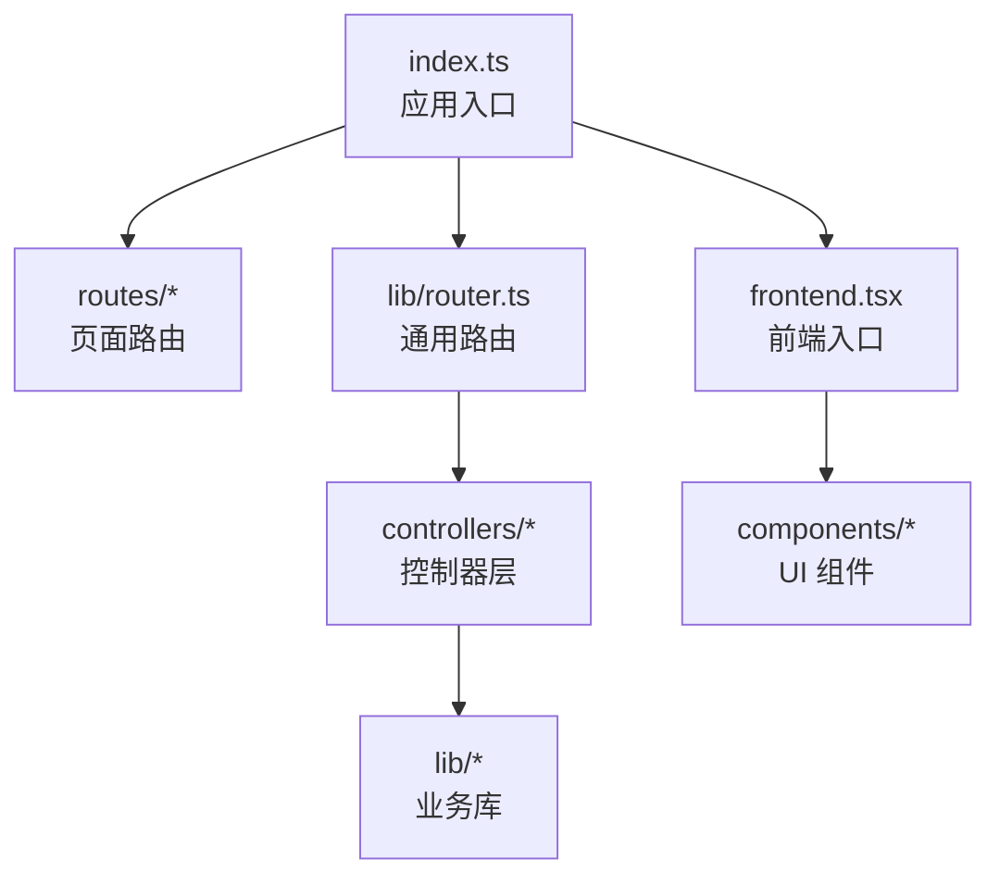
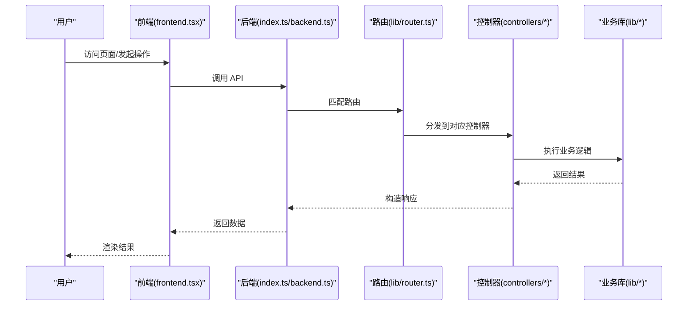
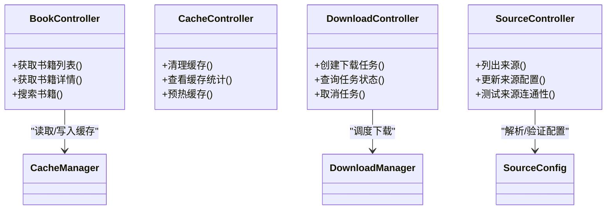
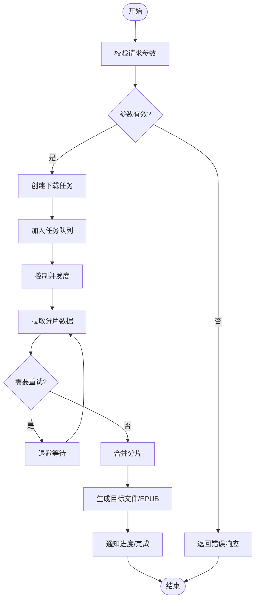
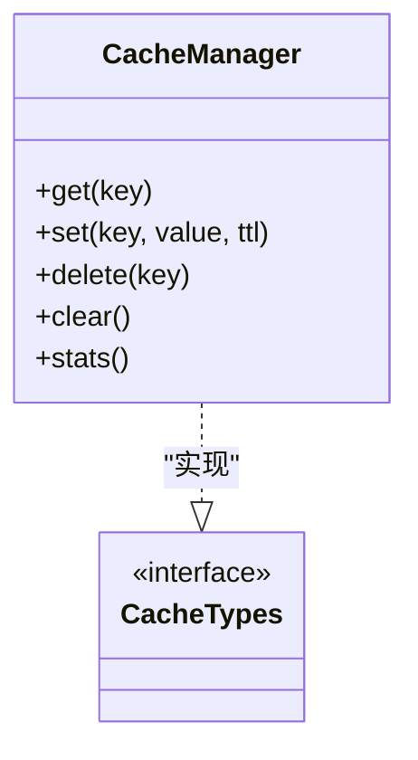
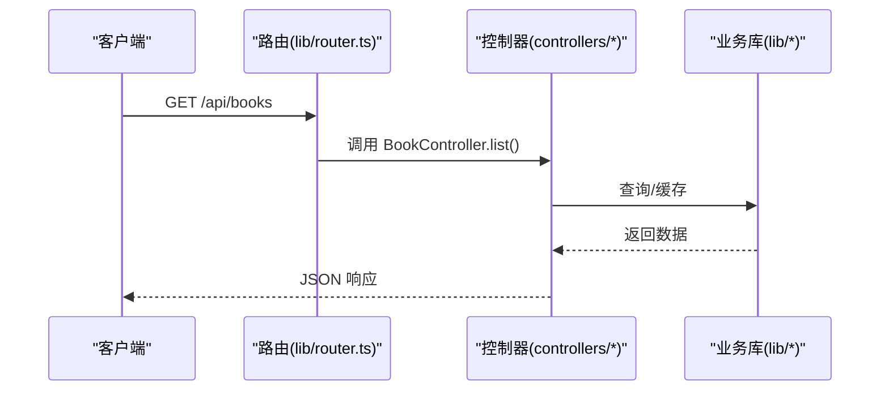
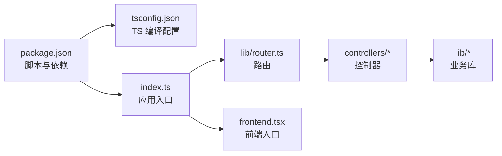

# 开发指南

<cite>
**本文引用的文件**   
- [package.json](file://package.json)
- [tsconfig.json](file://tsconfig.json)
- [index.ts](file://index.ts)
- [backend.ts](file://backend.ts)
- [frontend.tsx](file://frontend.tsx)
- [routes/__root.tsx](file://routes/__root.tsx)
- [lib/router.ts](file://lib/router.ts)
- [lib/controller.ts](file://lib/controller.ts)
- [controllers/book.controller.ts](file://controllers/book.controller.ts)
- [controllers/cache.controller.ts](file://controllers/cache.controller.ts)
- [controllers/download.controller.ts](file://controllers/download.controller.ts)
- [controllers/source.controller.ts](file://controllers/source.controller.ts)
- [lib/cache-manager.ts](file://lib/cache-manager.ts)
- [lib/download-manager.ts](file://lib/download-manager.ts)
- [lib/epub-builder.ts](file://lib/epub-builder.ts)
- [lib/query.ts](file://lib/query.ts)
- [lib/source-config.ts](file://lib/source-config.ts)
- [CLAUDE.md](file://CLAUDE.md)
- [README.md](file://README.md)
</cite>

## 目录
1. [简介](#简介)
2. [项目结构](#项目结构)
3. [核心组件](#核心组件)
4. [架构总览](#架构总览)
5. [详细组件分析](#详细组件分析)
6. [依赖关系分析](#依赖关系分析)
7. [性能与内存优化](#性能与内存优化)
8. [故障排除指南](#故障排除指南)
9. [结论](#结论)
10. [附录](#附录)

## 简介
本指南面向贡献者与开发者，覆盖代码贡献规范、开发环境设置、调试技巧与故障排除、TypeScript 配置与构建流程、Git 工作流、代码审查与发布流程、性能分析与内存泄漏检测、单元测试编写与覆盖率要求等。目标是帮助你在 Bun-zlib 项目中高效协作与交付高质量代码。

## 项目结构
本项目采用前后端同仓的轻量架构：
- 入口与路由：index.ts 作为应用启动入口；routes 下为页面级路由；lib/router.ts 提供通用路由能力。
- 控制器层：controllers 下按领域划分控制器（书籍、缓存、下载、来源）。
- 业务库：lib 下包含缓存管理、下载管理、EPUB 构建、查询、来源配置等可复用模块。
- 前端资源：frontend.tsx 提供前端渲染入口；components 与 index.html/index.css 提供基础 UI 资源。
- 配置与脚本：package.json 定义依赖与脚本；tsconfig.json 定义 TypeScript 编译选项；CLAUDE.md 与 README.md 提供项目说明。

图表来源
- [index.ts:1-200](file://index.ts#L1-L200)
- [lib/router.ts:1-200](file://lib/router.ts#L1-L200)
- [controllers/book.controller.ts:1-200](file://controllers/book.controller.ts#L1-L200)
- [controllers/cache.controller.ts:1-200](file://controllers/cache.controller.ts#L1-L200)
- [controllers/download.controller.ts:1-200](file://controllers/download.controller.ts#L1-L200)
- [controllers/source.controller.ts:1-200](file://controllers/source.controller.ts#L1-L200)
- [lib/cache-manager.ts:1-200](file://lib/cache-manager.ts#L1-L200)
- [lib/download-manager.ts:1-200](file://lib/download-manager.ts#L1-L200)
- [lib/epub-builder.ts:1-200](file://lib/epub-builder.ts#L1-L200)
- [lib/query.ts:1-200](file://lib/query.ts#L1-L200)
- [lib/source-config.ts:1-200](file://lib/source-config.ts#L1-L200)
- [frontend.tsx:1-200](file://frontend.tsx#L1-L200)

章节来源
- [package.json:1-200](file://package.json#L1-L200)
- [tsconfig.json:1-200](file://tsconfig.json#L1-L200)
- [index.ts:1-200](file://index.ts#L1-L200)
- [lib/router.ts:1-200](file://lib/router.ts#L1-L200)
- [controllers/book.controller.ts:1-200](file://controllers/book.controller.ts#L1-L200)
- [controllers/cache.controller.ts:1-200](file://controllers/cache.controller.ts#L1-L200)
- [controllers/download.controller.ts:1-200](file://controllers/download.controller.ts#L1-L200)
- [controllers/source.controller.ts:1-200](file://controllers/source.controller.ts#L1-L200)
- [lib/cache-manager.ts:1-200](file://lib/cache-manager.ts#L1-L200)
- [lib/download-manager.ts:1-200](file://lib/download-manager.ts#L1-L200)
- [lib/epub-builder.ts:1-200](file://lib/epub-builder.ts#L1-L200)
- [lib/query.ts:1-200](file://lib/query.ts#L1-L200)
- [lib/source-config.ts:1-200](file://lib/source-config.ts#L1-L200)
- [frontend.tsx:1-200](file://frontend.tsx#L1-L200)
- [CLAUDE.md:1-200](file://CLAUDE.md#L1-L200)
- [README.md:1-200](file://README.md#L1-L200)

## 核心组件
- 应用入口与启动
  - index.ts 负责初始化服务、挂载路由、加载前端资源与中间件。
  - backend.ts 提供后端相关能力（如静态资源、API 路由聚合等）。
- 路由与控制器
  - lib/router.ts 提供统一的路由注册与分发机制。
  - controllers/* 按领域组织控制器，处理请求参数校验、调用业务库并返回响应。
- 业务库
  - lib/cache-manager.ts：缓存策略与生命周期管理。
  - lib/download-manager.ts：并发下载、断点续传、任务队列。
  - lib/epub-builder.ts：将内容打包为 EPUB 格式。
  - lib/query.ts：数据查询封装。
  - lib/source-config.ts：来源配置解析与合并。
- 前端
  - frontend.tsx 提供前端渲染入口，与后端 API 交互。

章节来源
- [index.ts:1-200](file://index.ts#L1-L200)
- [backend.ts:1-200](file://backend.ts#L1-L200)
- [lib/router.ts:1-200](file://lib/router.ts#L1-L200)
- [controllers/book.controller.ts:1-200](file://controllers/book.controller.ts#L1-L200)
- [controllers/cache.controller.ts:1-200](file://controllers/cache.controller.ts#L1-L200)
- [controllers/download.controller.ts:1-200](file://controllers/download.controller.ts#L1-L200)
- [controllers/source.controller.ts:1-200](file://controllers/source.controller.ts#L1-L200)
- [lib/cache-manager.ts:1-200](file://lib/cache-manager.ts#L1-L200)
- [lib/download-manager.ts:1-200](file://lib/download-manager.ts#L1-L200)
- [lib/epub-builder.ts:1-200](file://lib/epub-builder.ts#L1-L200)
- [lib/query.ts:1-200](file://lib/query.ts#L1-L200)
- [lib/source-config.ts:1-200](file://lib/source-config.ts#L1-L200)
- [frontend.tsx:1-200](file://frontend.tsx#L1-L200)

## 架构总览
整体采用“入口 -> 路由 -> 控制器 -> 业务库”的分层结构，前端通过 API 与后端交互。

图表来源
- [index.ts:1-200](file://index.ts#L1-L200)
- [backend.ts:1-200](file://backend.ts#L1-L200)
- [lib/router.ts:1-200](file://lib/router.ts#L1-L200)
- [controllers/book.controller.ts:1-200](file://controllers/book.controller.ts#L1-L200)
- [controllers/cache.controller.ts:1-200](file://controllers/cache.controller.ts#L1-L200)
- [controllers/download.controller.ts:1-200](file://controllers/download.controller.ts#L1-L200)
- [controllers/source.controller.ts:1-200](file://controllers/source.controller.ts#L1-L200)
- [lib/cache-manager.ts:1-200](file://lib/cache-manager.ts#L1-L200)
- [lib/download-manager.ts:1-200](file://lib/download-manager.ts#L1-L200)
- [lib/epub-builder.ts:1-200](file://lib/epub-builder.ts#L1-L200)
- [lib/query.ts:1-200](file://lib/query.ts#L1-L200)
- [lib/source-config.ts:1-200](file://lib/source-config.ts#L1-L200)
- [frontend.tsx:1-200](file://frontend.tsx#L1-L200)

## 详细组件分析

### 控制器层分析
控制器负责接收请求、参数校验、调用业务库并返回响应。建议遵循以下模式：
- 输入校验：对路径参数、查询参数、请求体进行严格校验。
- 错误处理：使用统一的错误类型与状态码映射。
- 日志记录：关键路径打点，便于追踪问题。
- 幂等性：对写操作确保幂等或提供去重键。

图表来源
- [controllers/book.controller.ts:1-200](file://controllers/book.controller.ts#L1-L200)
- [controllers/cache.controller.ts:1-200](file://controllers/cache.controller.ts#L1-L200)
- [controllers/download.controller.ts:1-200](file://controllers/download.controller.ts#L1-L200)
- [controllers/source.controller.ts:1-200](file://controllers/source.controller.ts#L1-L200)
- [lib/cache-manager.ts:1-200](file://lib/cache-manager.ts#L1-L200)
- [lib/download-manager.ts:1-200](file://lib/download-manager.ts#L1-L200)
- [lib/source-config.ts:1-200](file://lib/source-config.ts#L1-L200)

章节来源
- [controllers/book.controller.ts:1-200](file://controllers/book.controller.ts#L1-L200)
- [controllers/cache.controller.ts:1-200](file://controllers/cache.controller.ts#L1-L200)
- [controllers/download.controller.ts:1-200](file://controllers/download.controller.ts#L1-L200)
- [controllers/source.controller.ts:1-200](file://controllers/source.controller.ts#L1-L200)

### 下载流程分析
下载控制器协调下载管理器完成分片下载、重试与进度上报。

图表来源
- [controllers/download.controller.ts:1-200](file://controllers/download.controller.ts#L1-L200)
- [lib/download-manager.ts:1-200](file://lib/download-manager.ts#L1-L200)
- [lib/epub-builder.ts:1-200](file://lib/epub-builder.ts#L1-L200)

章节来源
- [controllers/download.controller.ts:1-200](file://controllers/download.controller.ts#L1-L200)
- [lib/download-manager.ts:1-200](file://lib/download-manager.ts#L1-L200)
- [lib/epub-builder.ts:1-200](file://lib/epub-builder.ts#L1-L200)

### 缓存管理分析
缓存管理器提供读写、过期、淘汰策略与统计信息。

图表来源
- [lib/cache-manager.ts:1-200](file://lib/cache-manager.ts#L1-L200)
- [lib/cache-types.ts:1-200](file://lib/cache-types.ts#L1-L200)

章节来源
- [lib/cache-manager.ts:1-200](file://lib/cache-manager.ts#L1-L200)
- [lib/cache-types.ts:1-200](file://lib/cache-types.ts#L1-L200)

### 路由与控制器集成
路由将 URL 映射到控制器方法，控制器再委托给业务库。

图表来源
- [lib/router.ts:1-200](file://lib/router.ts#L1-L200)
- [controllers/book.controller.ts:1-200](file://controllers/book.controller.ts#L1-L200)
- [lib/query.ts:1-200](file://lib/query.ts#L1-L200)
- [lib/cache-manager.ts:1-200](file://lib/cache-manager.ts#L1-L200)

章节来源
- [lib/router.ts:1-200](file://lib/router.ts#L1-L200)
- [controllers/book.controller.ts:1-200](file://controllers/book.controller.ts#L1-L200)
- [lib/query.ts:1-200](file://lib/query.ts#L1-L200)
- [lib/cache-manager.ts:1-200](file://lib/cache-manager.ts#L1-L200)

## 依赖关系分析
- 包管理与脚本
  - package.json 定义了运行、构建、测试等脚本以及依赖项。
- TypeScript 配置
  - tsconfig.json 指定了编译目标、模块系统、输出目录与严格检查选项。
- 运行时依赖
  - 后端基于 Bun 运行时，前端通过 frontend.tsx 渲染。

图表来源
- [package.json:1-200](file://package.json#L1-L200)
- [tsconfig.json:1-200](file://tsconfig.json#L1-L200)
- [index.ts:1-200](file://index.ts#L1-L200)
- [lib/router.ts:1-200](file://lib/router.ts#L1-L200)
- [controllers/book.controller.ts:1-200](file://controllers/book.controller.ts#L1-L200)
- [controllers/cache.controller.ts:1-200](file://controllers/cache.controller.ts#L1-L200)
- [controllers/download.controller.ts:1-200](file://controllers/download.controller.ts#L1-L200)
- [controllers/source.controller.ts:1-200](file://controllers/source.controller.ts#L1-L200)
- [lib/cache-manager.ts:1-200](file://lib/cache-manager.ts#L1-L200)
- [lib/download-manager.ts:1-200](file://lib/download-manager.ts#L1-L200)
- [lib/epub-builder.ts:1-200](file://lib/epub-builder.ts#L1-L200)
- [lib/query.ts:1-200](file://lib/query.ts#L1-L200)
- [lib/source-config.ts:1-200](file://lib/source-config.ts#L1-L200)
- [frontend.tsx:1-200](file://frontend.tsx#L1-L200)

章节来源
- [package.json:1-200](file://package.json#L1-L200)
- [tsconfig.json:1-200](file://tsconfig.json#L1-L200)

## 性能与内存优化
- 性能分析工具
  - 使用 Bun 内置的性能分析器进行 CPU 与 I/O 热点定位。
  - 在关键路径添加计时与指标上报，结合浏览器 DevTools 观察网络与渲染耗时。
- 内存泄漏检测
  - 使用堆快照对比与对象分配跟踪，关注长生命周期对象与闭包引用。
  - 对下载任务、缓存条目、事件监听器进行显式释放与清理。
- 并发与背压
  - 合理设置下载并发度，避免阻塞主线程。
  - 对大文件处理采用流式读写，减少峰值内存占用。
- 缓存策略
  - 为热点数据设置合适的 TTL 与最大容量，避免无限增长。
  - 使用二级缓存（内存+磁盘）提升稳定性。

[本节为通用指导，不直接分析具体文件]

## 故障排除指南
- 常见问题
  - 端口冲突：修改默认端口或释放占用进程。
  - 依赖缺失：执行依赖安装命令后重试。
  - 路由未命中：检查路由注册顺序与路径前缀。
  - 下载失败：检查网络可达性与重试退避策略。
- 日志与诊断
  - 开启详细日志级别，记录请求 ID、参数摘要与异常栈。
  - 对关键步骤埋点，便于快速定位瓶颈。
- 回滚与恢复
  - 保持版本标签与构建产物，出现问题时快速回滚。
  - 对持久化数据定期备份，防止丢失。

章节来源
- [index.ts:1-200](file://index.ts#L1-L200)
- [backend.ts:1-200](file://backend.ts#L1-L200)
- [lib/router.ts:1-200](file://lib/router.ts#L1-L200)
- [controllers/download.controller.ts:1-200](file://controllers/download.controller.ts#L1-L200)
- [lib/download-manager.ts:1-200](file://lib/download-manager.ts#L1-L200)

## 结论
通过分层架构与清晰的职责划分，Bun-zlib 具备良好的可扩展性与可维护性。遵循本指南中的贡献规范、构建与测试流程、性能与内存优化实践，可有效提升团队协作效率与产品质量。

[本节为总结性内容，不直接分析具体文件]

## 附录

### 开发环境设置
- 前置条件
  - 安装 Bun 运行时与 Node.js 兼容工具链。
  - 建议使用 VS Code 与 ESLint/Prettier 插件。
- 安装依赖
  - 在项目根目录执行依赖安装命令。
- 本地运行
  - 使用开发脚本启动服务，启用热重载与详细日志。
- 环境变量
  - 根据 .env 模板配置数据库、缓存与外部服务连接信息。

章节来源
- [package.json:1-200](file://package.json#L1-L200)
- [README.md:1-200](file://README.md#L1-L200)

### TypeScript 配置与编译流程
- 编译目标与模块
  - 指定目标环境与模块系统，确保与 Bun 运行时一致。
- 严格模式
  - 启用严格类型检查与空值检查，提升代码健壮性。
- 输出目录
  - 将编译产物输出至 dist 目录，便于部署。
- 增量构建
  - 利用增量编译加速开发体验。

章节来源
- [tsconfig.json:1-200](file://tsconfig.json#L1-L200)

### 构建脚本与发布流程
- 构建脚本
  - 使用 package.json 中定义的脚本进行构建与打包。
- 发布流程
  - 版本号管理、变更日志生成、制品归档与部署。
- 质量门禁
  - 构建前执行类型检查、代码风格检查与单元测试。

章节来源
- [package.json:1-200](file://package.json#L1-L200)

### Git 工作流与代码审查
- 分支策略
  - 主干保护，功能分支命名规范，提交信息约定。
- 代码审查
  - 提交 PR 前自检，至少一名 reviewer 批准后方可合并。
- 自动化
  - CI 流水线执行 lint、test、build 与基本安全扫描。

章节来源
- [CLAUDE.md:1-200](file://CLAUDE.md#L1-L200)

### 单元测试编写与覆盖率要求
- 测试框架
  - 选择与 Bun 兼容的测试框架，编写单元与集成测试。
- 测试范围
  - 控制器输入校验、业务库核心逻辑、错误路径与边界条件。
- 覆盖率要求
  - 行覆盖率不低于阈值，关键路径需达到更高标准。
- 持续集成
  - 每次提交自动运行测试，失败阻断合并。

章节来源
- [package.json:1-200](file://package.json#L1-L200)
- [controllers/book.controller.ts:1-200](file://controllers/book.controller.ts#L1-L200)
- [controllers/cache.controller.ts:1-200](file://controllers/cache.controller.ts#L1-L200)
- [controllers/download.controller.ts:1-200](file://controllers/download.controller.ts#L1-L200)
- [controllers/source.controller.ts:1-200](file://controllers/source.controller.ts#L1-L200)
- [lib/cache-manager.ts:1-200](file://lib/cache-manager.ts#L1-L200)
- [lib/download-manager.ts:1-200](file://lib/download-manager.ts#L1-L200)
- [lib/epub-builder.ts:1-200](file://lib/epub-builder.ts#L1-L200)
- [lib/query.ts:1-200](file://lib/query.ts#L1-L200)
- [lib/source-config.ts:1-200](file://lib/source-config.ts#L1-L200)