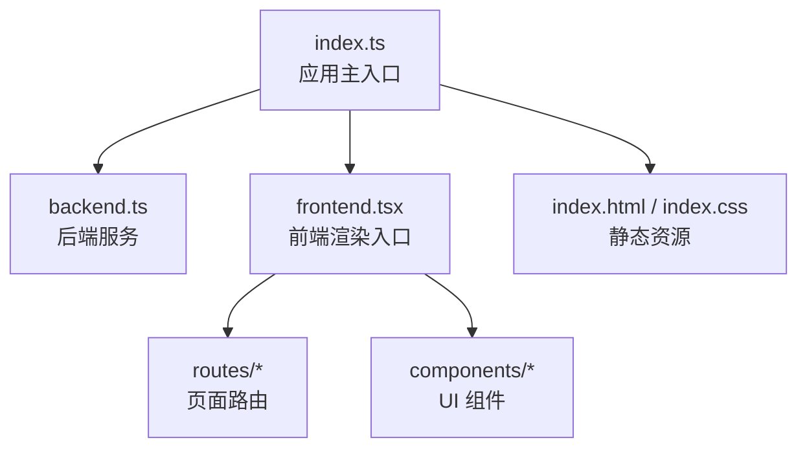
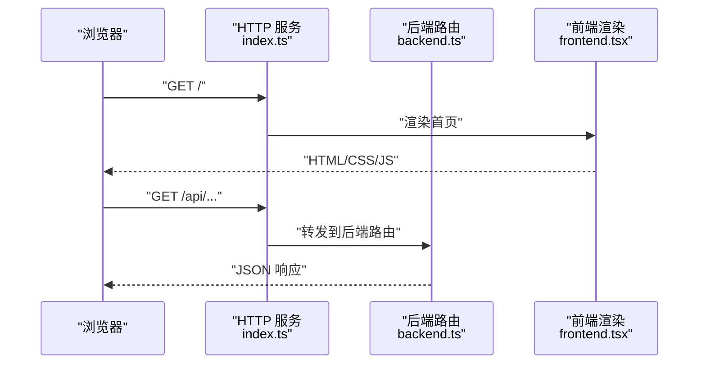
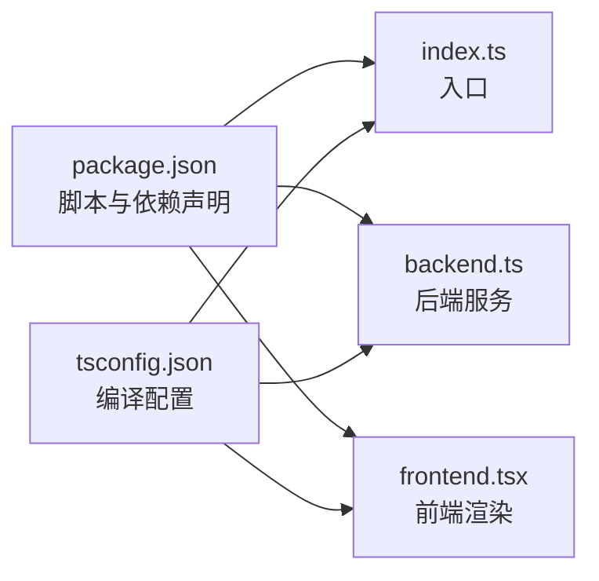

# 快速开始

<cite>
**本文引用的文件**   
- [README.md](file://README.md)
- [package.json](file://package.json)
- [index.ts](file://index.ts)
- [backend.ts](file://backend.ts)
- [frontend.tsx](file://frontend.tsx)
- [tsconfig.json](file://tsconfig.json)
</cite>

## 目录
1. [简介](#简介)
2. [项目结构](#项目结构)
3. [核心组件](#核心组件)
4. [架构总览](#架构总览)
5. [详细组件分析](#详细组件分析)
6. [依赖分析](#依赖分析)
7. [性能考虑](#性能考虑)
8. [故障排除指南](#故障排除指南)
9. [结论](#结论)
10. [附录](#附录)

## 简介
本快速开始指南面向初学者与有经验的开发者，帮助你在本地或生产环境快速运行 Bun-zlib 项目。你将了解：
- 环境与版本要求（Node.js/Bun）
- 安装与初始化步骤
- 基本配置项与启动命令
- 开发与生产环境的部署方式
- 常见问题与排错建议

## 项目结构
仓库采用前后端同构的轻量架构：前端页面与路由位于 routes 与 components，后端服务入口在 backend.ts，应用主入口为 index.ts，资源与样式由 index.html、index.css 提供。

图表来源
- [index.ts:1-200](file://index.ts#L1-L200)
- [backend.ts:1-200](file://backend.ts#L1-L200)
- [frontend.tsx:1-200](file://frontend.tsx#L1-L200)

章节来源
- [README.md:1-200](file://README.md#L1-L200)
- [package.json:1-200](file://package.json#L1-L200)
- [index.ts:1-200](file://index.ts#L1-L200)
- [backend.ts:1-200](file://backend.ts#L1-L200)
- [frontend.tsx:1-200](file://frontend.tsx#L1-L200)

## 核心组件
- 应用主入口 index.ts：负责加载后端服务与前端渲染，统一端口监听与中间件挂载。
- 后端服务 backend.ts：定义 API 路由、请求处理与响应格式。
- 前端渲染 frontend.tsx：负责页面渲染、路由分发与静态资源注入。
- 静态资源 index.html/index.css：提供基础页面结构与样式。

章节来源
- [index.ts:1-200](file://index.ts#L1-L200)
- [backend.ts:1-200](file://backend.ts#L1-L200)
- [frontend.tsx:1-200](file://frontend.tsx#L1-L200)
- [index.html:1-200](file://index.html#L1-L200)
- [index.css:1-200](file://index.css#L1-L200)

## 架构总览
整体采用“单进程 + 前后端同构”的轻量模式：一个入口同时启动 HTTP 服务并渲染前端页面，适合快速原型与中小型应用。

图表来源
- [index.ts:1-200](file://index.ts#L1-L200)
- [backend.ts:1-200](file://backend.ts#L1-L200)
- [frontend.tsx:1-200](file://frontend.tsx#L1-L200)

## 详细组件分析

### 环境要求
- 运行时
  - 推荐：Bun（最新稳定版）
  - 兼容：Node.js（需使用 bun 命令或等效工具链）
- 操作系统
  - Windows、macOS、Linux 均可
- 其他依赖
  - 无需额外系统级依赖；构建与运行通过包管理器完成

章节来源
- [README.md:1-200](file://README.md#L1-L200)
- [package.json:1-200](file://package.json#L1-L200)

### 安装与初始化
- 克隆仓库后进入项目根目录
- 安装依赖
  - 使用 Bun：bun install
  - 使用 npm：npm install
- 初始化缓存与数据目录（如需要）
  - 参考后端初始化逻辑，确保缓存目录存在且可写
- 验证安装
  - 执行开发服务器命令，访问 http://localhost:端口

章节来源
- [package.json:1-200](file://package.json#L1-L200)
- [backend.ts:1-200](file://backend.ts#L1-L200)

### 基本配置选项
- 端口与环境变量
  - 可通过环境变量设置服务端口与日志级别
- 缓存路径
  - 支持自定义缓存目录，便于持久化与迁移
- 跨域与安全
  - 可在后端服务中启用 CORS 与基础鉴权中间件

章节来源
- [backend.ts:1-200](file://backend.ts#L1-L200)
- [index.ts:1-200](file://index.ts#L1-L200)

### 启动命令
- 开发模式
  - 使用 Bun 运行：bun run dev
  - 或使用 Node 兼容脚本：npm run dev
- 生产模式
  - 构建并运行：bun run build && bun run start
  - 或使用 npm：npm run build && npm run start

章节来源
- [package.json:1-200](file://package.json#L1-L200)

### 完整示例：从初始化到运行
- 初始化
  - 安装依赖、创建必要目录、设置环境变量
- 启动开发服务器
  - 访问首页与 API 接口进行验证
- 构建与部署
  - 构建产物输出至 dist 或指定目录
  - 将构建产物与服务进程托管至容器或平台

章节来源
- [index.ts:1-200](file://index.ts#L1-L200)
- [backend.ts:1-200](file://backend.ts#L1-L200)
- [frontend.tsx:1-200](file://frontend.tsx#L1-L200)

### 开发环境与生产环境部署
- 开发环境
  - 开启热重载与详细日志
  - 使用本地缓存目录，便于调试
- 生产环境
  - 关闭调试日志，启用最小化构建
  - 使用反向代理（Nginx/Traefik）与 HTTPS
  - 多进程/多实例部署（结合进程管理器）

章节来源
- [package.json:1-200](file://package.json#L1-L200)
- [backend.ts:1-200](file://backend.ts#L1-L200)

## 依赖分析
- 运行时依赖
  - 主要依赖集中在后端服务与前端渲染模块
- 构建与脚本
  - package.json 中的 scripts 定义了 dev/build/start 等常用命令
- 类型与编译
  - tsconfig.json 控制 TypeScript 编译目标与模块解析

图表来源
- [package.json:1-200](file://package.json#L1-L200)
- [index.ts:1-200](file://index.ts#L1-L200)
- [backend.ts:1-200](file://backend.ts#L1-L200)
- [frontend.tsx:1-200](file://frontend.tsx#L1-L200)
- [tsconfig.json:1-200](file://tsconfig.json#L1-L200)

章节来源
- [package.json:1-200](file://package.json#L1-L200)
- [tsconfig.json:1-200](file://tsconfig.json#L1-L200)

## 性能考虑
- 缓存策略
  - 合理设置缓存过期与清理策略，避免磁盘占用过高
- 并发与连接
  - 在高并发场景下，调整连接池与线程数
- 构建优化
  - 生产构建启用代码分割与压缩，减少首屏体积
- 监控与日志
  - 接入结构化日志与指标采集，便于定位瓶颈

[本节为通用指导，不直接分析具体文件]

## 故障排除指南
- 端口冲突
  - 现象：启动时报端口被占用
  - 解决：更换端口或释放占用进程
- 权限问题
  - 现象：写入缓存目录失败
  - 解决：赋予当前用户读写权限或切换目录
- 依赖缺失
  - 现象：启动报模块未找到
  - 解决：重新执行依赖安装，检查网络与镜像源
- 构建失败
  - 现象：TypeScript 报错或打包异常
  - 解决：检查 tsconfig 配置与依赖版本兼容性

章节来源
- [backend.ts:1-200](file://backend.ts#L1-L200)
- [index.ts:1-200](file://index.ts#L1-L200)
- [package.json:1-200](file://package.json#L1-L200)

## 结论
通过本指南，你已掌握 Bun-zlib 的环境准备、安装与启动流程，以及开发与生产的部署要点。建议在正式部署前完善监控与日志，并根据业务规模调整缓存与并发参数。

[本节为总结性内容，不直接分析具体文件]

## 附录
- 相关文档
  - README：项目说明与使用说明
  - package.json：脚本与依赖清单
  - tsconfig.json：TypeScript 编译配置

章节来源
- [README.md:1-200](file://README.md#L1-L200)
- [package.json:1-200](file://package.json#L1-L200)
- [tsconfig.json:1-200](file://tsconfig.json#L1-L200)