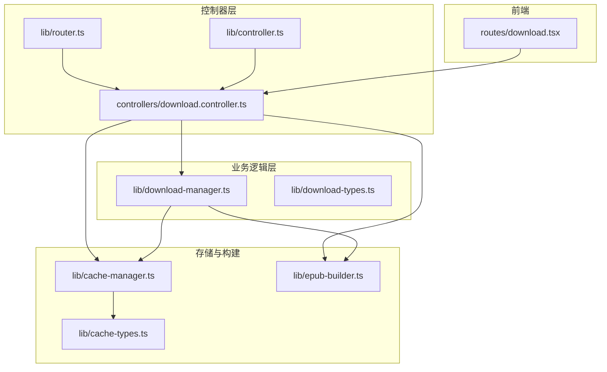
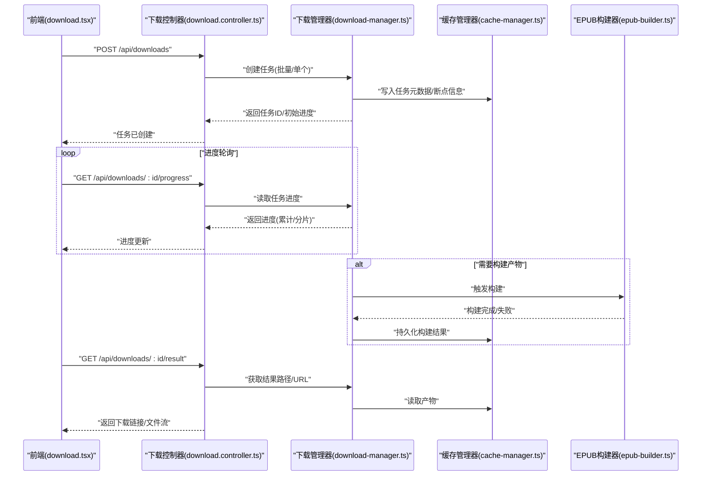
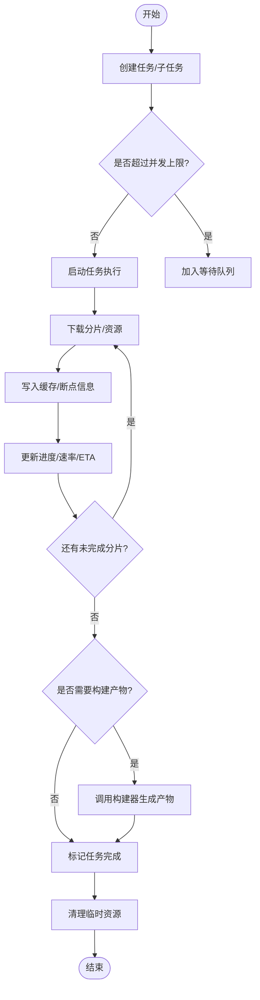
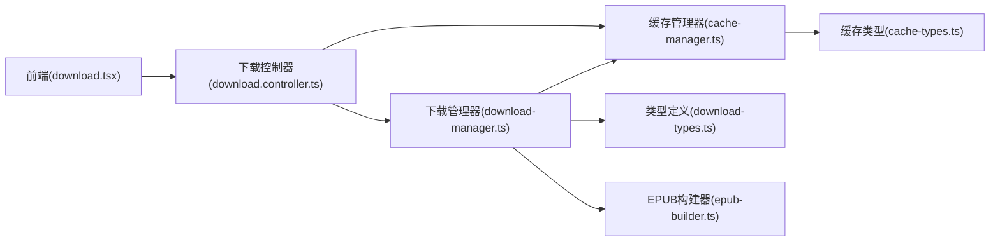

# 下载控制器

<cite>
**本文引用的文件**   
- [download.controller.ts](file://controllers/download.controller.ts)
- [download-manager.ts](file://lib/download-manager.ts)
- [download-types.ts](file://lib/download-types.ts)
- [cache-manager.ts](file://lib/cache-manager.ts)
- [cache-types.ts](file://lib/cache-types.ts)
- [epub-builder.ts](file://lib/epub-builder.ts)
- [router.ts](file://lib/router.ts)
- [controller.ts](file://lib/controller.ts)
- [download.tsx](file://routes/download.tsx)
</cite>

## 目录
1. [简介](#简介)
2. [项目结构](#项目结构)
3. [核心组件](#核心组件)
4. [架构总览](#架构总览)
5. [详细组件分析](#详细组件分析)
6. [依赖关系分析](#依赖关系分析)
7. [性能考虑](#性能考虑)
8. [故障排查指南](#故障排查指南)
9. [结论](#结论)
10. [附录](#附录)

## 简介
本文件围绕“下载控制器”展开，系统性梳理与下载任务管理相关的 API 端点、任务状态机、进度回调机制、并发控制与错误恢复策略。文档同时覆盖批量下载流程、队列调度与资源管理、断点续传与性能优化方案，并提供面向前端的路由集成说明与使用示例路径，帮助读者快速上手并稳定落地生产环境。

## 项目结构
与下载功能直接相关的代码主要分布在以下位置：
- 控制器层：HTTP 接口定义与请求路由处理
- 业务逻辑层：下载任务编排、并发控制、进度与状态管理
- 类型定义：任务、进度、缓存等数据结构
- 构建与缓存：EPUB 打包与缓存读写
- 路由注册：将控制器挂载到应用路由表
- 前端路由：提供下载页面入口与交互

图表来源
- [download.controller.ts:1-200](file://controllers/download.controller.ts#L1-L200)
- [download-manager.ts:1-200](file://lib/download-manager.ts#L1-L200)
- [download-types.ts:1-200](file://lib/download-types.ts#L1-L200)
- [cache-manager.ts:1-200](file://lib/cache-manager.ts#L1-L200)
- [cache-types.ts:1-200](file://lib/cache-types.ts#L1-L200)
- [epub-builder.ts:1-200](file://lib/epub-builder.ts#L1-L200)
- [router.ts:1-200](file://lib/router.ts#L1-L200)
- [controller.ts:1-200](file://lib/controller.ts#L1-L200)
- [download.tsx:1-200](file://routes/download.tsx#L1-L200)

章节来源
- [download.controller.ts:1-200](file://controllers/download.controller.ts#L1-L200)
- [download-manager.ts:1-200](file://lib/download-manager.ts#L1-L200)
- [download-types.ts:1-200](file://lib/download-types.ts#L1-L200)
- [cache-manager.ts:1-200](file://lib/cache-manager.ts#L1-L200)
- [cache-types.ts:1-200](file://lib/cache-types.ts#L1-L200)
- [epub-builder.ts:1-200](file://lib/epub-builder.ts#L1-L200)
- [router.ts:1-200](file://lib/router.ts#L1-L200)
- [controller.ts:1-200](file://lib/controller.ts#L1-L200)
- [download.tsx:1-200](file://routes/download.tsx#L1-L200)

## 核心组件
- 下载控制器（HTTP 接口）
  - 负责接收创建任务、查询进度、取消任务、批量下载、获取结果等请求，调用下载管理器执行具体逻辑，并将结果返回给客户端。
- 下载管理器（任务编排）
  - 维护任务集合、状态机、进度聚合、并发限制、重试与失败恢复、队列调度、资源清理。
- 类型定义（数据结构）
  - 统一描述任务、进度、错误、配置等数据模型，确保前后端一致。
- 缓存管理器（持久化与中间产物）
  - 提供分片/片段缓存、元数据持久化、断点信息保存与恢复。
- EPUB 构建器（产物生成）
  - 将下载的章节/图片等资源组装为最终电子书格式。
- 路由与控制器基类
  - 将控制器挂载到 HTTP 路由，提供通用能力如参数校验、响应封装等。
- 前端下载路由
  - 提供下载页面入口，发起批量下载、轮询进度、展示结果与异常。

章节来源
- [download.controller.ts:1-200](file://controllers/download.controller.ts#L1-L200)
- [download-manager.ts:1-200](file://lib/download-manager.ts#L1-L200)
- [download-types.ts:1-200](file://lib/download-types.ts#L1-L200)
- [cache-manager.ts:1-200](file://lib/cache-manager.ts#L1-L200)
- [epub-builder.ts:1-200](file://lib/epub-builder.ts#L1-L200)
- [router.ts:1-200](file://lib/router.ts#L1-L200)
- [controller.ts:1-200](file://lib/controller.ts#L1-L200)
- [download.tsx:1-200](file://routes/download.tsx#L1-L200)

## 架构总览
下图展示了从前端到后端控制器、下载管理器、缓存与构建器的完整调用链，以及关键的数据流向。

图表来源
- [download.controller.ts:1-200](file://controllers/download.controller.ts#L1-L200)
- [download-manager.ts:1-200](file://lib/download-manager.ts#L1-L200)
- [cache-manager.ts:1-200](file://lib/cache-manager.ts#L1-L200)
- [epub-builder.ts:1-200](file://lib/epub-builder.ts#L1-L200)
- [download.tsx:1-200](file://routes/download.tsx#L1-L200)

## 详细组件分析

### 下载控制器（HTTP 接口）
- 职责
  - 暴露下载相关 REST 接口：创建任务、查询进度、取消任务、批量下载、获取结果、删除任务等。
  - 对请求进行基础校验与参数解析，调用下载管理器执行业务逻辑。
  - 统一响应格式与错误码，便于前端处理。
- 典型端点
  - 创建任务：支持单任务与批量任务，返回任务 ID 与初始进度。
  - 查询进度：按任务 ID 返回总体进度与分片进度。
  - 取消任务：终止正在运行的任务并释放资源。
  - 获取结果：在任务完成后返回产物路径或流式下载。
  - 批量操作：一次性提交多个子任务，内部由下载管理器进行队列调度。
- 错误处理
  - 参数缺失/非法：返回明确的错误码与提示。
  - 任务不存在/已取消：返回相应状态。
  - 系统异常：记录日志并返回通用错误。

章节来源
- [download.controller.ts:1-200](file://controllers/download.controller.ts#L1-L200)
- [controller.ts:1-200](file://lib/controller.ts#L1-L200)
- [router.ts:1-200](file://lib/router.ts#L1-L200)

### 下载管理器（任务编排与并发控制）
- 职责
  - 维护任务集合与生命周期：新建、运行中、暂停、完成、失败、已取消。
  - 进度聚合：汇总各子任务的进度，计算总体百分比与剩余时间估算。
  - 并发控制：基于令牌桶或信号量限制同时运行的任务数，避免资源耗尽。
  - 重试与恢复：对失败的任务进行指数退避重试；支持断点续传。
  - 队列调度：FIFO/优先级队列，结合资源可用性动态调度。
  - 资源清理：任务结束后清理临时文件、释放句柄、回收内存。
- 关键数据结构
  - 任务对象：包含任务 ID、状态、进度、子任务列表、错误信息、创建/更新时间等。
  - 进度对象：总体进度、已完成字节数、总字节数、当前速率、预计剩余时间。
  - 分片信息：每个子任务的开始/结束偏移、已下载长度、是否完成。
- 并发与队列
  - 通过全局并发上限控制同时运行的任务数量。
  - 当任务达到上限时进入等待队列，资源空闲时自动出队执行。
- 错误恢复
  - 网络错误、超时、IO 错误等可重试异常采用指数退避重试。
  - 不可重试异常（如权限不足、目标不可达）标记任务失败并记录原因。
  - 断点续传：根据分片信息与本地缓存恢复未完成的下载。

图表来源
- [download-manager.ts:1-200](file://lib/download-manager.ts#L1-L200)
- [cache-manager.ts:1-200](file://lib/cache-manager.ts#L1-L200)
- [epub-builder.ts:1-200](file://lib/epub-builder.ts#L1-L200)

章节来源
- [download-manager.ts:1-200](file://lib/download-manager.ts#L1-L200)
- [download-types.ts:1-200](file://lib/download-types.ts#L1-L200)
- [cache-manager.ts:1-200](file://lib/cache-manager.ts#L1-L200)
- [epub-builder.ts:1-200](file://lib/epub-builder.ts#L1-L200)

### 类型定义（数据结构）
- 任务模型
  - 字段包括：任务 ID、名称、状态、进度、子任务列表、错误信息、创建/更新时间、结果路径等。
- 进度模型
  - 字段包括：总体进度百分比、已完成字节数、总字节数、当前速率、预计剩余时间、最近更新时间。
- 分片模型
  - 字段包括：分片索引、起始偏移、结束偏移、已下载长度、状态、错误信息。
- 错误模型
  - 字段包括：错误码、错误消息、可重试标志、上下文信息。
- 配置模型
  - 字段包括：并发上限、重试次数、超时时间、缓存目录、构建选项等。

章节来源
- [download-types.ts:1-200](file://lib/download-types.ts#L1-L200)
- [cache-types.ts:1-200](file://lib/cache-types.ts#L1-L200)

### 缓存管理器（断点续传与中间产物）
- 职责
  - 提供分片文件的读写、合并与校验。
  - 持久化任务元数据与断点信息，支持进程重启后恢复。
  - 管理缓存目录结构与命名规则，避免冲突与重复。
- 断点续传
  - 每次下载前检查本地是否存在部分文件，若存在则从上次偏移继续。
  - 下载完成后校验完整性（如哈希），失败则重新下载该分片。
- 资源清理
  - 任务完成后清理临时分片，保留最终产物。
  - 定期扫描过期缓存，释放磁盘空间。

章节来源
- [cache-manager.ts:1-200](file://lib/cache-manager.ts#L1-L200)
- [cache-types.ts:1-200](file://lib/cache-types.ts#L1-L200)

### EPUB 构建器（产物生成）
- 职责
  - 将下载的资源（章节、图片、元数据）组装为 EPUB 格式。
  - 支持增量构建：仅重建变更部分以提升效率。
  - 输出产物路径供下载控制器返回给前端。
- 构建流程
  - 读取任务元数据与缓存中的资源。
  - 生成目录结构与内容文件。
  - 压缩打包并输出最终文件。

章节来源
- [epub-builder.ts:1-200](file://lib/epub-builder.ts#L1-L200)

### 前端下载路由（交互入口）
- 职责
  - 提供下载页面，用户选择资源并提交批量下载。
  - 轮询任务进度，实时更新 UI。
  - 显示错误信息，支持重试与取消。
  - 在任务完成后提供下载链接或直接预览。
- 交互流程
  - 发起批量下载：提交任务列表，获取任务 ID。
  - 定时拉取进度：根据任务 ID 获取最新进度。
  - 处理异常：网络错误、服务端错误、任务失败等。
  - 获取结果：任务完成后拉取产物链接或流式下载。

章节来源
- [download.tsx:1-200](file://routes/download.tsx#L1-L200)

## 依赖关系分析
- 控制器依赖下载管理器与缓存管理器，间接依赖构建器。
- 下载管理器依赖类型定义与缓存管理器，必要时调用构建器。
- 前端通过路由访问控制器，形成端到端调用链。

图表来源
- [download.controller.ts:1-200](file://controllers/download.controller.ts#L1-L200)
- [download-manager.ts:1-200](file://lib/download-manager.ts#L1-L200)
- [download-types.ts:1-200](file://lib/download-types.ts#L1-L200)
- [cache-manager.ts:1-200](file://lib/cache-manager.ts#L1-L200)
- [cache-types.ts:1-200](file://lib/cache-types.ts#L1-L200)
- [epub-builder.ts:1-200](file://lib/epub-builder.ts#L1-L200)
- [download.tsx:1-200](file://routes/download.tsx#L1-L200)

章节来源
- [download.controller.ts:1-200](file://controllers/download.controller.ts#L1-L200)
- [download-manager.ts:1-200](file://lib/download-manager.ts#L1-L200)
- [download-types.ts:1-200](file://lib/download-types.ts#L1-L200)
- [cache-manager.ts:1-200](file://lib/cache-manager.ts#L1-L200)
- [cache-types.ts:1-200](file://lib/cache-types.ts#L1-L200)
- [epub-builder.ts:1-200](file://lib/epub-builder.ts#L1-L200)
- [download.tsx:1-200](file://routes/download.tsx#L1-L200)

## 性能考虑
- 并发控制
  - 设置合理的最大并发任务数，避免 CPU/IO 饱和。
  - 针对大文件下载，建议降低并发以减小带宽竞争。
- 分片与断点续传
  - 合理划分分片大小，平衡重传成本与恢复粒度。
  - 使用校验和确保分片完整性，减少无效传输。
- 缓存与 I/O
  - 使用顺序写与缓冲提升写入性能。
  - 定期清理过期缓存，防止磁盘膨胀。
- 构建优化
  - 增量构建仅处理变更资源，缩短构建时间。
  - 并行构建不同章节，但需控制构建线程数。
- 网络优化
  - 启用连接复用与 Keep-Alive。
  - 对慢源启用指数退避重试，避免雪崩。

[本节为通用指导，不直接分析具体文件]

## 故障排查指南
- 常见问题
  - 任务卡住：检查并发上限与队列状态，确认是否有死锁或资源未释放。
  - 进度不更新：确认进度回调是否被正确触发，检查缓存写入是否成功。
  - 构建失败：查看构建器日志，确认输入资源是否完整。
  - 断点续传失效：检查分片元数据与本地文件一致性，必要时重置断点。
- 定位步骤
  - 查看任务状态与错误信息，确认失败阶段。
  - 检查缓存目录是否存在分片与元数据。
  - 验证网络连接与目标源可达性。
  - 调整并发与重试参数后复现问题。

章节来源
- [download-manager.ts:1-200](file://lib/download-manager.ts#L1-L200)
- [cache-manager.ts:1-200](file://lib/cache-manager.ts#L1-L200)
- [epub-builder.ts:1-200](file://lib/epub-builder.ts#L1-L200)

## 结论
下载控制器通过清晰的职责分层与模块化设计，实现了稳定的任务管理、进度跟踪、并发控制与错误恢复。配合断点续传与构建优化，能够在复杂网络与大规模资源场景下保持良好性能与可靠性。建议在生产环境中结合监控指标（CPU、内存、磁盘、网络）持续调优并发与队列策略，确保系统在高负载下的稳定性。

[本节为总结性内容，不直接分析具体文件]

## 附录

### API 端点参考
- 创建任务
  - 方法：POST
  - 路径：/api/downloads
  - 请求体：任务列表（支持批量）
  - 响应：任务 ID、初始进度
- 查询进度
  - 方法：GET
  - 路径：/api/downloads/:id/progress
  - 响应：总体进度、分片进度、速率、ETA
- 取消任务
  - 方法：DELETE
  - 路径：/api/downloads/:id
  - 响应：取消结果
- 获取结果
  - 方法：GET
  - 路径：/api/downloads/:id/result
  - 响应：产物路径或流式下载

章节来源
- [download.controller.ts:1-200](file://controllers/download.controller.ts#L1-L200)
- [download.tsx:1-200](file://routes/download.tsx#L1-L200)

### 使用示例路径
- 发起批量下载
  - 参考：[download.tsx:1-200](file://routes/download.tsx#L1-L200)
- 监控下载进度
  - 参考：[download.tsx:1-200](file://routes/download.tsx#L1-L200)
- 处理下载异常
  - 参考：[download.tsx:1-200](file://routes/download.tsx#L1-L200)
- 任务状态管理与进度回调
  - 参考：[download-manager.ts:1-200](file://lib/download-manager.ts#L1-L200)
  - 参考：[download-types.ts:1-200](file://lib/download-types.ts#L1-L200)
- 断点续传实现
  - 参考：[cache-manager.ts:1-200](file://lib/cache-manager.ts#L1-L200)
  - 参考：[cache-types.ts:1-200](file://lib/cache-types.ts#L1-L200)
- 构建产物生成
  - 参考：[epub-builder.ts:1-200](file://lib/epub-builder.ts#L1-L200)