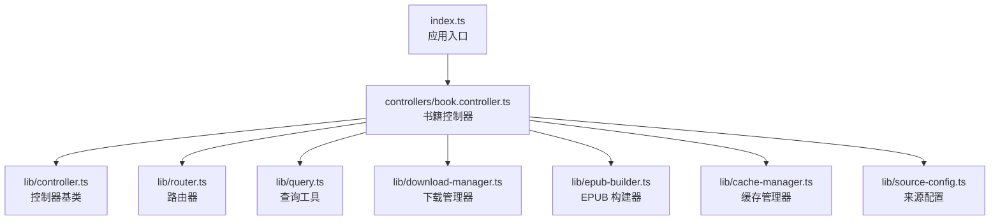
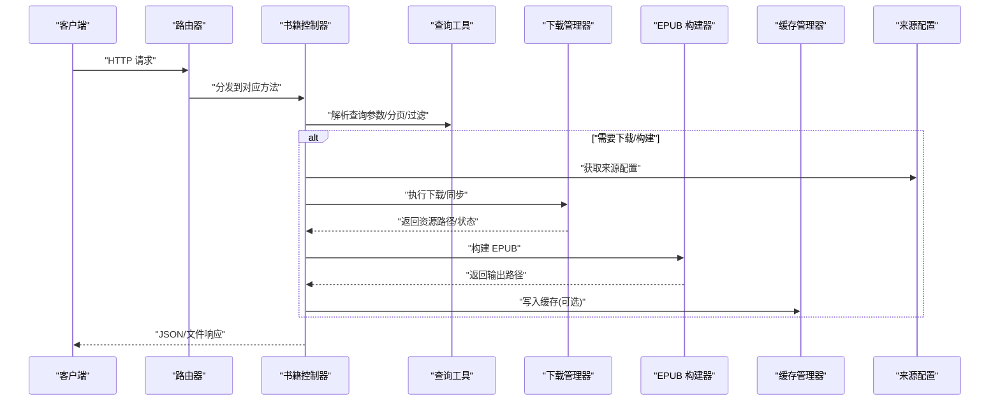
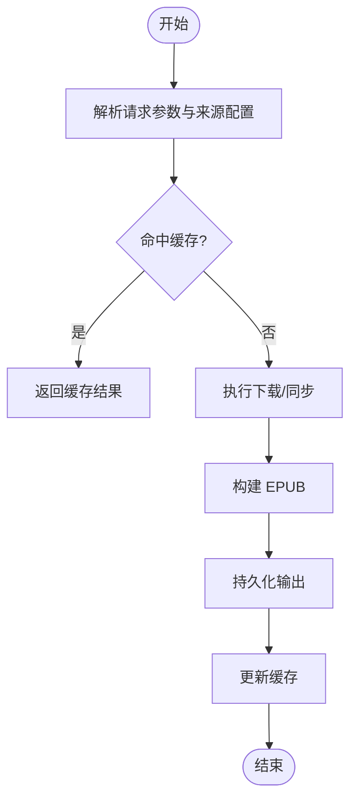
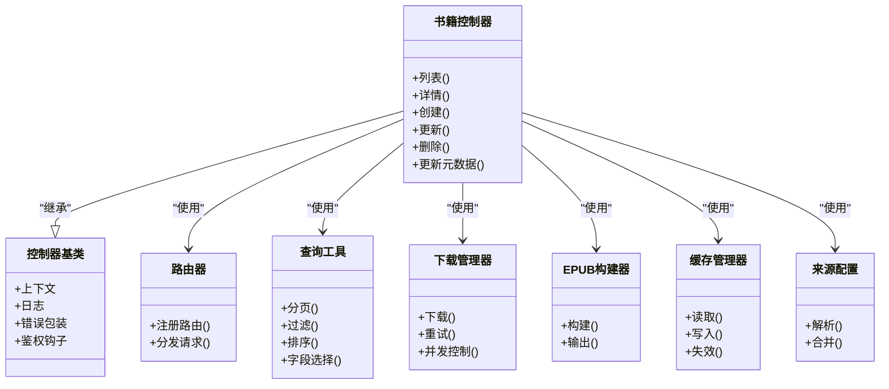

# 书籍控制器

<cite>
**本文引用的文件**   
- [book.controller.ts](file://controllers/book.controller.ts)
- [controller.ts](file://lib/controller.ts)
- [router.ts](file://lib/router.ts)
- [query.ts](file://lib/query.ts)
- [download-manager.ts](file://lib/download-manager.ts)
- [download-types.ts](file://lib/download-types.ts)
- [epub-builder.ts](file://lib/epub-builder.ts)
- [cache-manager.ts](file://lib/cache-manager.ts)
- [source-config.ts](file://lib/source-config.ts)
- [index.ts](file://index.ts)
</cite>

## 目录
1. [简介](#简介)
2. [项目结构](#项目结构)
3. [核心组件](#核心组件)
4. [架构总览](#架构总览)
5. [详细组件分析](#详细组件分析)
6. [依赖分析](#依赖分析)
7. [性能考虑](#性能考虑)
8. [故障排查指南](#故障排查指南)
9. [结论](#结论)
10. [附录](#附录)

## 简介
本文件为“书籍控制器”提供系统化、可操作的技术文档，聚焦于书籍相关的 API 端点实现与数据流。内容覆盖：
- CRUD 操作（创建、读取、更新、删除）
- 元数据处理（标题、作者、描述、标签等）
- 文件管理逻辑（上传、下载、构建 EPUB）
- HTTP 方法、URL 模式、请求/响应格式与错误处理
- 与 lib 层数据源管理的集成方式
- 常见使用场景与最佳实践

## 项目结构
本项目采用分层组织：
- controllers：HTTP 控制器，负责路由绑定、参数校验、调用服务/库、返回响应
- lib：通用能力与数据源抽象，包括控制器基类、路由器、查询工具、下载管理器、EPUB 构建器、缓存、来源配置等
- routes：前端路由页面（与本控制器文档关系较小）
- index.ts：应用入口，注册控制器与中间件

图表来源
- [index.ts](file://index.ts)
- [book.controller.ts](file://controllers/book.controller.ts)
- [controller.ts](file://lib/controller.ts)
- [router.ts](file://lib/router.ts)
- [query.ts](file://lib/query.ts)
- [download-manager.ts](file://lib/download-manager.ts)
- [epub-builder.ts](file://lib/epub-builder.ts)
- [cache-manager.ts](file://lib/cache-manager.ts)
- [source-config.ts](file://lib/source-config.ts)

章节来源
- [index.ts](file://index.ts)
- [book.controller.ts](file://controllers/book.controller.ts)
- [controller.ts](file://lib/controller.ts)
- [router.ts](file://lib/router.ts)

## 核心组件
- 书籍控制器：封装所有与书籍相关的 HTTP 接口，统一继承自控制器基类，复用鉴权、日志、错误包装等能力。
- 路由器：集中定义 URL 模式与方法映射，便于维护与扩展。
- 查询工具：提供分页、过滤、排序、字段选择等通用查询能力。
- 下载管理器：负责从来源拉取资源、本地缓存、断点续传、并发控制等。
- EPUB 构建器：将书籍内容与元数据打包为 EPUB 文件。
- 缓存管理器：对热点数据或构建产物进行缓存，降低重复计算与 IO。
- 来源配置：声明式配置数据来源（如远程站点、本地目录），支持多来源聚合。

章节来源
- [book.controller.ts](file://controllers/book.controller.ts)
- [controller.ts](file://lib/controller.ts)
- [router.ts](file://lib/router.ts)
- [query.ts](file://lib/query.ts)
- [download-manager.ts](file://lib/download-manager.ts)
- [epub-builder.ts](file://lib/epub-builder.ts)
- [cache-manager.ts](file://lib/cache-manager.ts)
- [source-config.ts](file://lib/source-config.ts)

## 架构总览
书籍控制器通过路由器暴露 RESTful 风格接口，内部委托给 lib 层的各类管理器完成具体业务。整体流程如下：

图表来源
- [router.ts](file://lib/router.ts)
- [book.controller.ts](file://controllers/book.controller.ts)
- [query.ts](file://lib/query.ts)
- [download-manager.ts](file://lib/download-manager.ts)
- [epub-builder.ts](file://lib/epub-builder.ts)
- [cache-manager.ts](file://lib/cache-manager.ts)
- [source-config.ts](file://lib/source-config.ts)

## 详细组件分析

### 书籍控制器（CRUD 与元数据）
职责边界
- 接收并校验请求参数
- 调用查询工具进行检索与分页
- 协调下载管理器与 EPUB 构建器完成文件生成
- 与缓存管理器交互以提升性能
- 返回统一的 JSON 或文件流响应

典型端点与行为
- 列表/搜索：GET /books
  - 查询参数：关键字、分类、标签、作者、时间范围、分页（页码、每页大小）、排序、字段选择
  - 响应：分页结果对象（包含条目数组、总数、页码信息）
- 详情：GET /books/:id
  - 响应：书籍完整元数据与关联资源信息
- 创建：POST /books
  - 请求体：元数据（标题、作者、描述、标签等）与可选的初始资源引用
  - 响应：新建书籍实体
- 更新：PUT /books/:id
  - 请求体：部分或全量元数据更新
  - 响应：更新后的书籍实体
- 删除：DELETE /books/:id
  - 响应：删除确认或空体
- 元数据批量操作：PATCH /books/:id/metadata
  - 请求体：增量元数据变更
  - 响应：更新后的元数据片段

错误处理
- 参数校验失败：返回 400 及错误详情
- 资源不存在：返回 404
- 权限不足：返回 403
- 服务器错误：返回 500 与标准化错误对象

章节来源
- [book.controller.ts](file://controllers/book.controller.ts)
- [controller.ts](file://lib/controller.ts)
- [router.ts](file://lib/router.ts)
- [query.ts](file://lib/query.ts)

### 下载与文件管理（下载管理器 + EPUB 构建器）
职责边界
- 下载管理器：根据来源配置拉取资源，管理任务队列、重试、并发、进度回调与本地落盘
- EPUB 构建器：将书籍内容与元数据组装为符合规范的 EPUB 包，支持封面、目录、样式等

关键流程

图表来源
- [download-manager.ts](file://lib/download-manager.ts)
- [epub-builder.ts](file://lib/epub-builder.ts)
- [cache-manager.ts](file://lib/cache-manager.ts)
- [source-config.ts](file://lib/source-config.ts)

章节来源
- [download-manager.ts](file://lib/download-manager.ts)
- [download-types.ts](file://lib/download-types.ts)
- [epub-builder.ts](file://lib/epub-builder.ts)
- [cache-manager.ts](file://lib/cache-manager.ts)
- [source-config.ts](file://lib/source-config.ts)

### 与 lib 层数据源的集成
- 来源配置：以声明式方式定义多个来源（远程站点、本地目录、数据库等），支持优先级与回退策略
- 查询工具：在控制器中统一注入，提供一致的查询 DSL，屏蔽底层数据源差异
- 缓存管理器：对高频查询与构建产物进行缓存，减少重复 IO 与 CPU 开销
- 控制器基类：提供统一的上下文、日志、错误包装、鉴权钩子等横切能力

章节来源
- [source-config.ts](file://lib/source-config.ts)
- [query.ts](file://lib/query.ts)
- [cache-manager.ts](file://lib/cache-manager.ts)
- [controller.ts](file://lib/controller.ts)

## 依赖分析
控制器与其依赖的关系如下：

图表来源
- [book.controller.ts](file://controllers/book.controller.ts)
- [controller.ts](file://lib/controller.ts)
- [router.ts](file://lib/router.ts)
- [query.ts](file://lib/query.ts)
- [download-manager.ts](file://lib/download-manager.ts)
- [epub-builder.ts](file://lib/epub-builder.ts)
- [cache-manager.ts](file://lib/cache-manager.ts)
- [source-config.ts](file://lib/source-config.ts)

章节来源
- [book.controller.ts](file://controllers/book.controller.ts)
- [controller.ts](file://lib/controller.ts)
- [router.ts](file://lib/router.ts)
- [query.ts](file://lib/query.ts)
- [download-manager.ts](file://lib/download-manager.ts)
- [epub-builder.ts](file://lib/epub-builder.ts)
- [cache-manager.ts](file://lib/cache-manager.ts)
- [source-config.ts](file://lib/source-config.ts)

## 性能考虑
- 查询优化：合理使用分页、字段选择与索引字段过滤，避免全表扫描
- 缓存策略：对热门书籍详情与构建产物设置合理 TTL，结合版本号或哈希键避免脏读
- 并发控制：下载任务限制并发度，避免压垮磁盘与网络；对大文件启用分块与断点续传
- 构建优化：EPUB 构建时按需压缩图片与文本，延迟加载非关键资源
- 连接池与超时：为外部来源配置合理的连接池与超时，防止雪崩

[本节为通用指导，不直接分析具体文件]

## 故障排查指南
常见问题与定位要点
- 400 参数错误：检查查询参数类型、必填项与取值范围
- 404 资源不存在：确认 ID 是否存在，是否已被删除
- 403 权限不足：核对当前用户角色与资源访问策略
- 500 服务器错误：查看控制器日志与异常堆栈，关注下载/构建阶段
- 下载失败：检查来源可达性、代理与证书、磁盘空间与权限
- 构建失败：检查输入内容完整性、EPUB 规范兼容性、模板与样式

建议的调试步骤
- 开启详细日志，记录请求 ID、关键参数与耗时
- 对下载与构建过程增加进度与错误码，便于快速定位
- 使用缓存命中统计评估缓存效果
- 对慢查询进行采样与分析，必要时引入索引或预计算

章节来源
- [book.controller.ts](file://controllers/book.controller.ts)
- [controller.ts](file://lib/controller.ts)
- [download-manager.ts](file://lib/download-manager.ts)
- [epub-builder.ts](file://lib/epub-builder.ts)

## 结论
书籍控制器围绕 RESTful 接口提供了完整的书籍管理能力，并通过 lib 层的能力抽象实现了高内聚、低耦合的系统设计。借助查询工具、下载管理器、EPUB 构建器与缓存管理器，系统在保证功能完备的同时具备良好的可扩展性与性能表现。遵循本文的最佳实践与排障建议，可有效提升稳定性与用户体验。

[本节为总结性内容，不直接分析具体文件]

## 附录

### 常用 API 参考（示例）
以下为常见操作的请求/响应约定示例（仅展示结构与语义，不包含具体代码）：

- 列表/搜索
  - 方法：GET
  - 路径：/books
  - 查询参数：q、category、tags、author、dateFrom、dateTo、page、pageSize、sort、fields
  - 响应体：{ items, total, page, pageSize }
- 详情
  - 方法：GET
  - 路径：/books/:id
  - 响应体：书籍完整元数据与关联资源
- 创建
  - 方法：POST
  - 路径：/books
  - 请求体：{ title, author, description, tags, ... }
  - 响应体：新建书籍实体
- 更新
  - 方法：PUT
  - 路径：/books/:id
  - 请求体：待更新的字段
  - 响应体：更新后的书籍实体
- 删除
  - 方法：DELETE
  - 路径：/books/:id
  - 响应体：空体或确认消息
- 元数据批量更新
  - 方法：PATCH
  - 路径：/books/:id/metadata
  - 请求体：增量元数据
  - 响应体：更新后的元数据片段

章节来源
- [book.controller.ts](file://controllers/book.controller.ts)
- [router.ts](file://lib/router.ts)