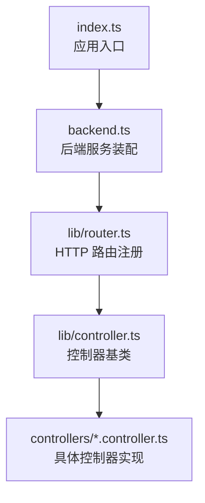
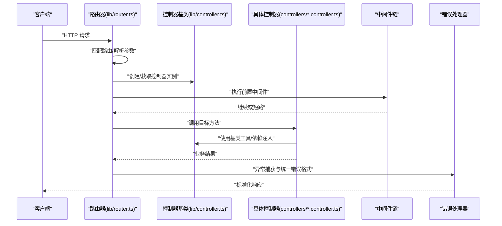
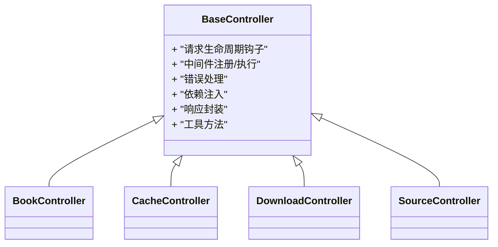
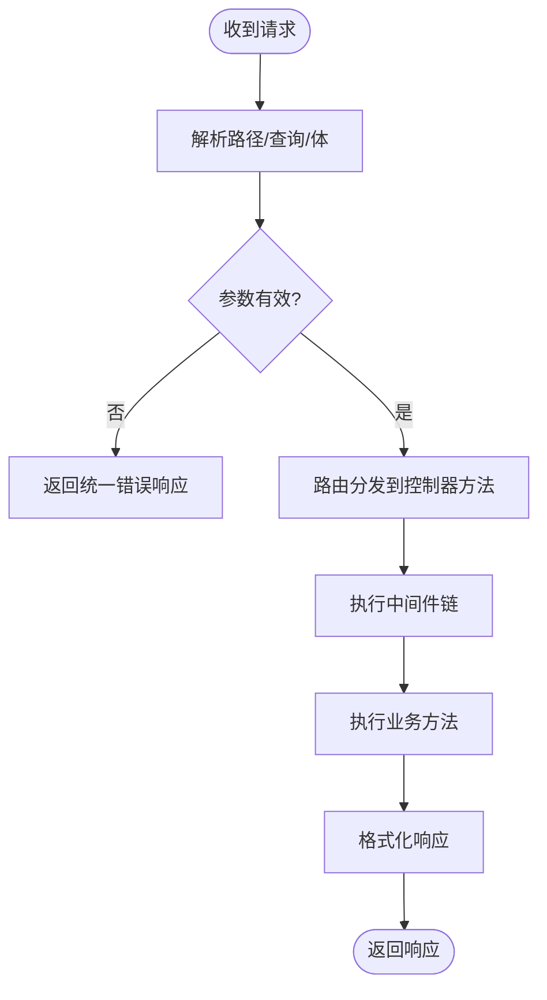
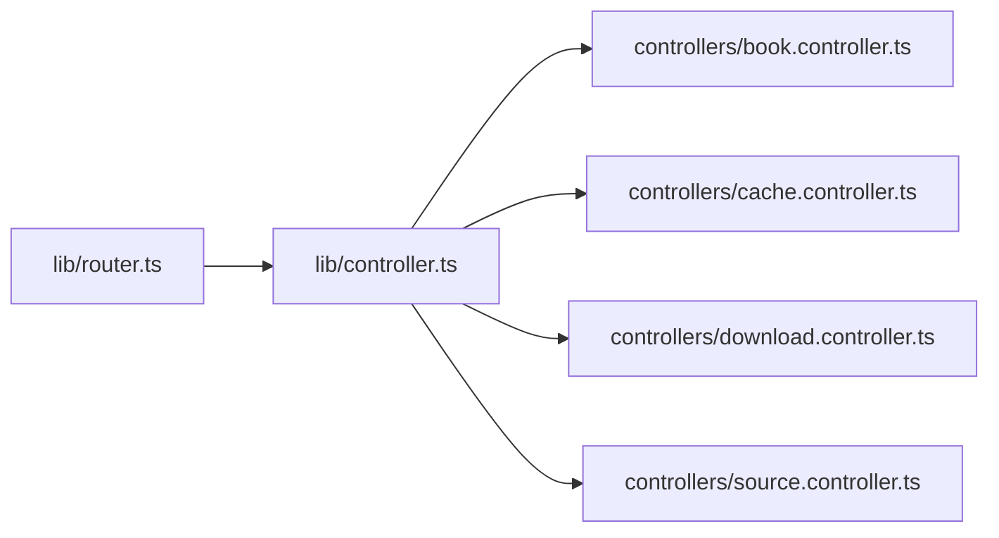

# 控制器基类

<cite>
**本文引用的文件**   
- [lib/controller.ts](file://lib/controller.ts)
- [lib/router.ts](file://lib/router.ts)
- [controllers/book.controller.ts](file://controllers/book.controller.ts)
- [controllers/cache.controller.ts](file://controllers/cache.controller.ts)
- [controllers/download.controller.ts](file://controllers/download.controller.ts)
- [controllers/source.controller.ts](file://controllers/source.controller.ts)
- [backend.ts](file://backend.ts)
- [index.ts](file://index.ts)
</cite>

## 目录
1. [简介](#简介)
2. [项目结构](#项目结构)
3. [核心组件](#核心组件)
4. [架构总览](#架构总览)
5. [详细组件分析](#详细组件分析)
6. [依赖关系分析](#依赖关系分析)
7. [性能考量](#性能考量)
8. [故障排查指南](#故障排查指南)
9. [结论](#结论)
10. [附录](#附录)

## 简介
本文件围绕“控制器基类”展开，系统性梳理控制器框架的基础架构与通用能力，包括请求处理流程、中间件机制、错误处理、依赖注入、路由映射、参数验证与响应格式化。文档同时提供基于现有代码的继承示例路径与最佳实践建议，帮助开发者快速上手并构建可维护的控制器。

## 项目结构
本项目采用分层组织方式：
- lib：核心库与基础设施（控制器基类、路由器、缓存、下载等）
- controllers：业务控制器实现（继承自控制器基类）
- routes：前端路由页面（与本控制器后端无关）
- 根目录：应用入口与后端服务启动逻辑

图表来源
- [index.ts:1-200](file://index.ts#L1-L200)
- [backend.ts:1-200](file://backend.ts#L1-L200)
- [lib/router.ts:1-200](file://lib/router.ts#L1-L200)
- [lib/controller.ts:1-200](file://lib/controller.ts#L1-L200)

章节来源
- [index.ts:1-200](file://index.ts#L1-L200)
- [backend.ts:1-200](file://backend.ts#L1-L200)

## 核心组件
- 控制器基类：定义统一的请求生命周期、中间件执行链、错误捕获、依赖注入、响应封装与工具方法。
- 路由器：将 HTTP 方法与路径映射到控制器实例的方法，负责解析参数、调用控制器并返回响应。
- 具体控制器：继承基类，实现业务逻辑，复用基类的通用能力。

章节来源
- [lib/controller.ts:1-200](file://lib/controller.ts#L1-L200)
- [lib/router.ts:1-200](file://lib/router.ts#L1-L200)
- [controllers/book.controller.ts:1-200](file://controllers/book.controller.ts#L1-L200)
- [controllers/cache.controller.ts:1-200](file://controllers/cache.controller.ts#L1-L200)
- [controllers/download.controller.ts:1-200](file://controllers/download.controller.ts#L1-L200)
- [controllers/source.controller.ts:1-200](file://controllers/source.controller.ts#L1-L200)

## 架构总览
下图展示了从请求进入、路由分发、控制器执行到响应返回的整体流程，以及中间件与错误处理的介入点。

图表来源
- [lib/router.ts:1-200](file://lib/router.ts#L1-L200)
- [lib/controller.ts:1-200](file://lib/controller.ts#L1-L200)
- [controllers/book.controller.ts:1-200](file://controllers/book.controller.ts#L1-L200)

## 详细组件分析

### 控制器基类设计
- 职责边界
  - 统一请求生命周期：入参解析、中间件执行、业务调用、响应封装、异常兜底。
  - 中间件机制：支持在控制器方法前后插入横切逻辑（鉴权、日志、限流等）。
  - 错误处理：集中捕获未处理异常，输出统一错误结构。
  - 依赖注入：通过构造器或属性注入外部服务，避免硬耦合。
  - 工具函数：参数校验、响应包装、上下文访问等常用能力。
- 关键抽象
  - 控制器基类暴露受保护的生命周期钩子与方法，供子类覆盖或扩展。
  - 提供中间件注册与执行器，保证顺序性与短路语义。
  - 提供响应格式化器，确保 API 一致性。
- 典型用法
  - 自定义控制器继承基类，仅关注业务实现；其余由基类接管。

章节来源
- [lib/controller.ts:1-200](file://lib/controller.ts#L1-L200)

#### 类图（控制器基类与具体控制器）

图表来源
- [lib/controller.ts:1-200](file://lib/controller.ts#L1-L200)
- [controllers/book.controller.ts:1-200](file://controllers/book.controller.ts#L1-L200)
- [controllers/cache.controller.ts:1-200](file://controllers/cache.controller.ts#L1-L200)
- [controllers/download.controller.ts:1-200](file://controllers/download.controller.ts#L1-L200)
- [controllers/source.controller.ts:1-200](file://controllers/source.controller.ts#L1-L200)

### 路由映射与参数解析
- 路由注册
  - 路由器根据 HTTP 方法与路径，定位到控制器实例与方法。
  - 支持路径参数、查询参数与请求体的解析与注入。
- 参数校验
  - 可在中间件或控制器内对入参进行校验，失败时返回统一错误结构。
- 响应格式化
  - 成功响应包含数据与元信息；错误响应包含错误码与消息。

图表来源
- [lib/router.ts:1-200](file://lib/router.ts#L1-L200)
- [lib/controller.ts:1-200](file://lib/controller.ts#L1-L200)

章节来源
- [lib/router.ts:1-200](file://lib/router.ts#L1-L200)

### 中间件机制
- 执行顺序
  - 按注册顺序依次执行，支持短路返回以提前结束请求。
- 常见用途
  - 鉴权、日志、速率限制、跨域、请求追踪等。
- 组合策略
  - 全局中间件与控制器级中间件可叠加，形成灵活的处理管道。

章节来源
- [lib/controller.ts:1-200](file://lib/controller.ts#L1-L200)

### 错误处理
- 统一捕获
  - 控制器层集中捕获未处理异常，转换为标准错误响应。
- 错误分类
  - 区分业务错误与系统错误，便于前端差异化处理。
- 调试信息
  - 开发环境可附加堆栈与上下文，生产环境隐藏敏感信息。

章节来源
- [lib/controller.ts:1-200](file://lib/controller.ts#L1-L200)

### 依赖注入
- 注入方式
  - 通过构造器注入服务实例，或由基类容器自动装配。
- 解耦优势
  - 控制器不直接创建依赖，便于测试替换与配置管理。
- 生命周期
  - 明确单例与作用域，避免共享状态引发并发问题。

章节来源
- [lib/controller.ts:1-200](file://lib/controller.ts#L1-L200)

### 具体控制器示例（继承基类）
以下示例展示如何继承基类创建控制器，并复用基类的中间件、错误处理与响应封装能力。请根据实际接口需求调整路径与参数。

- 图书控制器
  - 参考路径：[controllers/book.controller.ts](file://controllers/book.controller.ts)
- 缓存控制器
  - 参考路径：[controllers/cache.controller.ts](file://controllers/cache.controller.ts)
- 下载控制器
  - 参考路径：[controllers/download.controller.ts](file://controllers/download.controller.ts)
- 源控制器
  - 参考路径：[controllers/source.controller.ts](file://controllers/source.controller.ts)

章节来源
- [controllers/book.controller.ts:1-200](file://controllers/book.controller.ts#L1-L200)
- [controllers/cache.controller.ts:1-200](file://controllers/cache.controller.ts#L1-L200)
- [controllers/download.controller.ts:1-200](file://controllers/download.controller.ts#L1-L200)
- [controllers/source.controller.ts:1-200](file://controllers/source.controller.ts#L1-L200)

## 依赖关系分析
- 模块耦合
  - 路由器依赖控制器基类以统一处理请求。
  - 具体控制器依赖基类提供的工具与中间件能力。
- 外部集成
  - 控制器可通过依赖注入接入缓存、下载、数据源等子系统。

图表来源
- [lib/router.ts:1-200](file://lib/router.ts#L1-L200)
- [lib/controller.ts:1-200](file://lib/controller.ts#L1-L200)
- [controllers/book.controller.ts:1-200](file://controllers/book.controller.ts#L1-L200)
- [controllers/cache.controller.ts:1-200](file://controllers/cache.controller.ts#L1-L200)
- [controllers/download.controller.ts:1-200](file://controllers/download.controller.ts#L1-L200)
- [controllers/source.controller.ts:1-200](file://controllers/source.controller.ts#L1-L200)

章节来源
- [lib/router.ts:1-200](file://lib/router.ts#L1-L200)
- [lib/controller.ts:1-200](file://lib/controller.ts#L1-L200)

## 性能考量
- 中间件开销
  - 尽量减少不必要的 I/O 与序列化操作；必要时引入缓存。
- 对象复用
  - 合理复用响应结构与中间件实例，降低 GC 压力。
- 异步与并发
  - 控制器方法应尽可能无副作用且可并行执行；避免阻塞型操作。
- 资源释放
  - 对文件流、连接等资源及时关闭，防止泄漏。

## 故障排查指南
- 常见问题
  - 路由未命中：检查路径与方法是否一致，确认路由注册顺序。
  - 参数缺失：确认解析逻辑与校验规则，查看错误响应中的字段。
  - 中间件短路：检查中间件返回值，确认是否提前终止了请求。
  - 依赖注入失败：核对构造器参数与服务注册。
- 定位手段
  - 开启调试日志，记录请求 ID、入参与耗时。
  - 在生产环境保留最小化错误信息，结合链路追踪定位。

章节来源
- [lib/controller.ts:1-200](file://lib/controller.ts#L1-L200)
- [lib/router.ts:1-200](file://lib/router.ts#L1-L200)

## 结论
控制器基类为后端提供了统一的请求处理范式与横切能力，配合路由器可实现清晰的分层与高内聚低耦合的业务控制器。遵循本文的最佳实践，可显著提升可维护性、可测试性与可扩展性。

## 附录

### 最佳实践与设计模式
- 单一职责
  - 控制器只编排业务，不做底层实现；复杂逻辑下沉至服务层。
- 中间件优先
  - 将鉴权、日志、限流等横切逻辑抽离为中间件，保持控制器简洁。
- 防御式编程
  - 对所有入参进行校验，失败即早返回；对外部依赖调用增加超时与重试。
- 可观测性
  - 为每个请求生成唯一标识，贯穿日志与追踪。
- 版本兼容
  - 通过路由前缀或请求头控制 API 版本，平滑演进。

### 快速上手清单
- 新建控制器
  - 继承控制器基类，实现必要方法。
  - 在路由器中注册路径与方法映射。
- 添加中间件
  - 在全局或控制器级别注册中间件，注意执行顺序。
- 错误与响应
  - 使用基类提供的响应封装方法，保持结构一致。
- 依赖注入
  - 通过构造器注入服务，避免在方法内创建依赖。