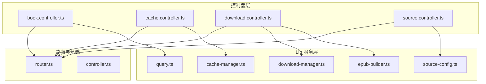
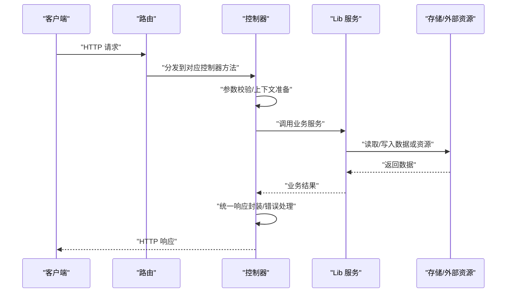
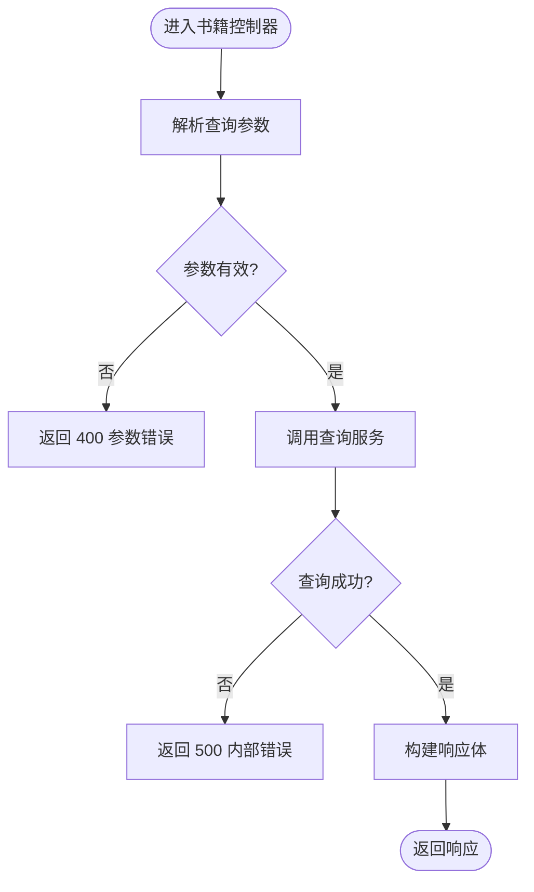
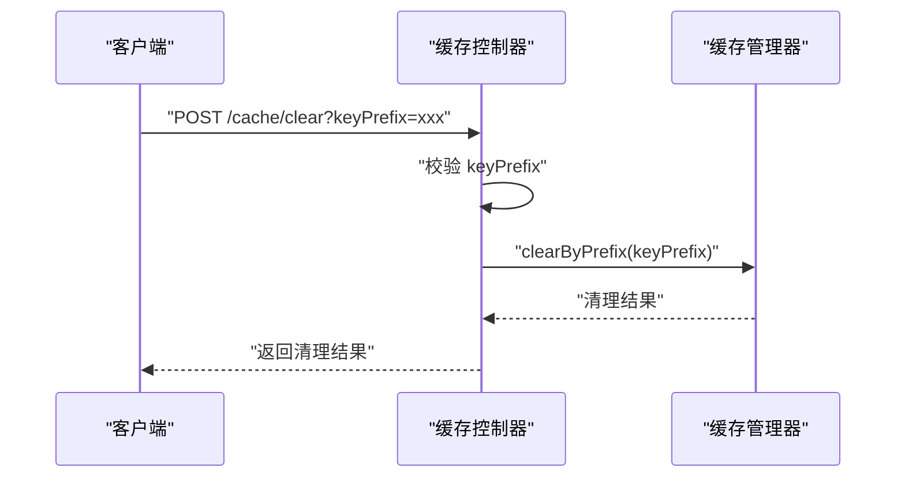
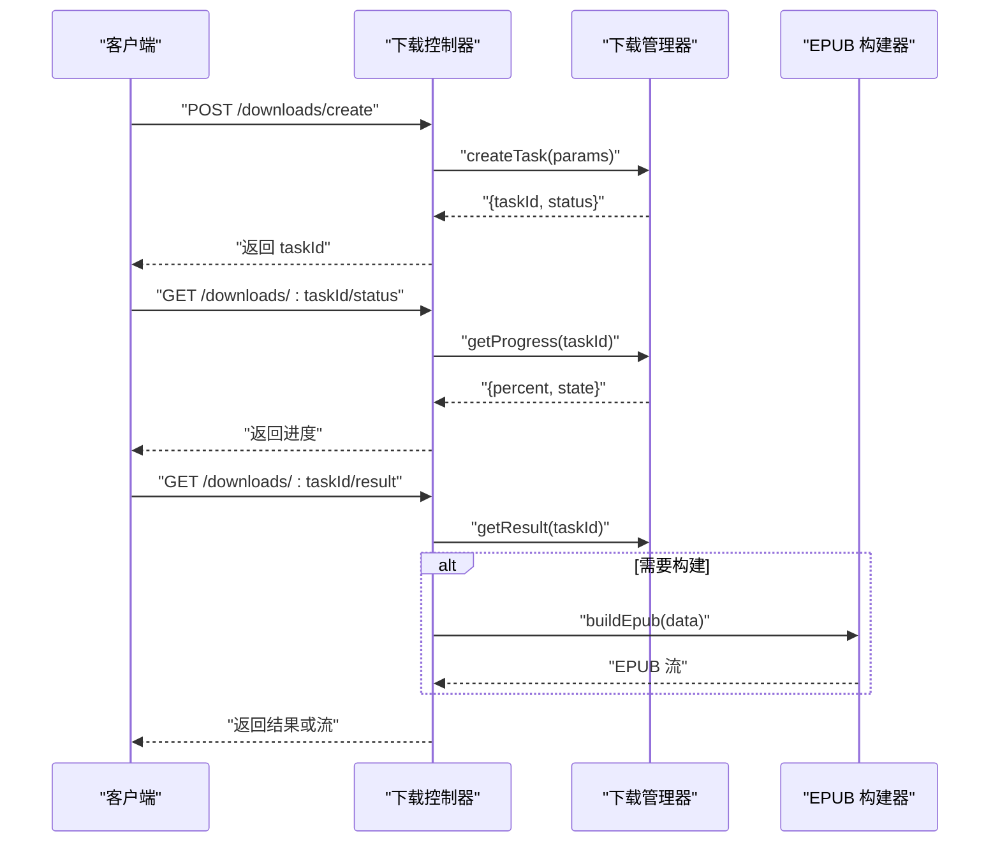
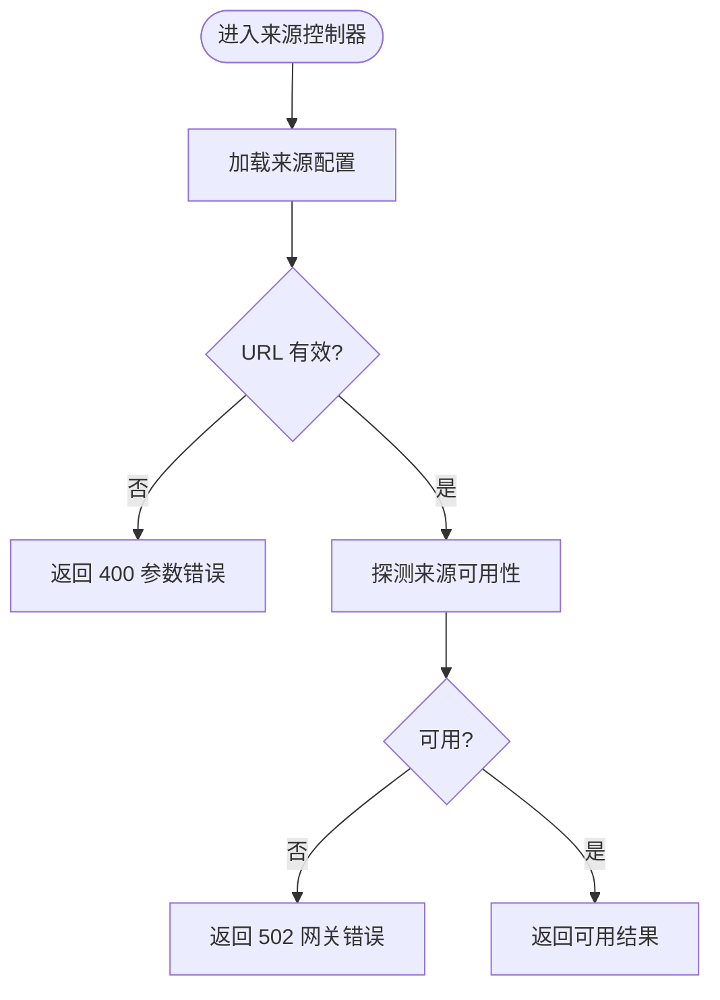
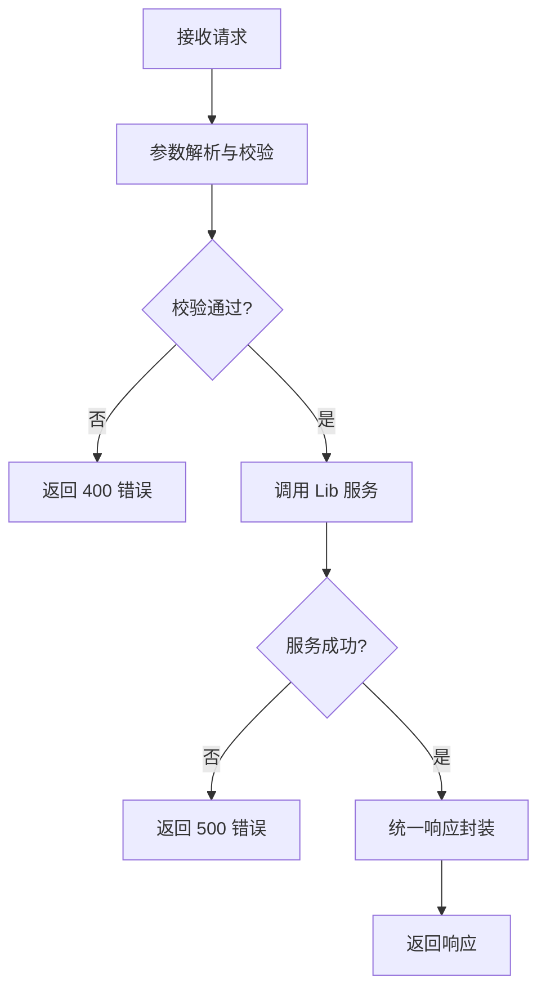
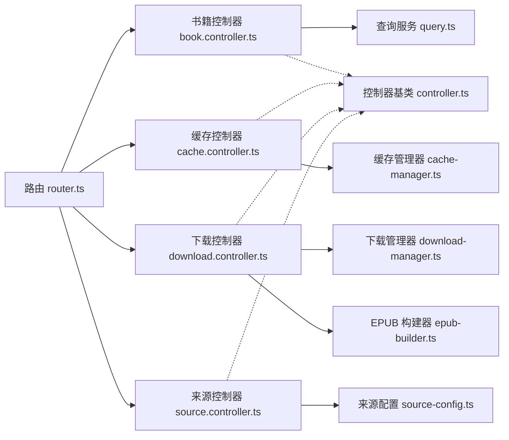

# 控制器层

<cite>
**本文引用的文件**   
- [book.controller.ts](file://controllers/book.controller.ts)
- [cache.controller.ts](file://controllers/cache.controller.ts)
- [download.controller.ts](file://controllers/download.controller.ts)
- [source.controller.ts](file://controllers/source.controller.ts)
- [controller.ts](file://lib/controller.ts)
- [router.ts](file://lib/router.ts)
- [cache-manager.ts](file://lib/cache-manager.ts)
- [download-manager.ts](file://lib/download-manager.ts)
- [epub-builder.ts](file://lib/epub-builder.ts)
- [query.ts](file://lib/query.ts)
- [source-config.ts](file://lib/source-config.ts)
</cite>

## 目录
1. [简介](#简介)
2. [项目结构](#项目结构)
3. [核心组件](#核心组件)
4. [架构总览](#架构总览)
5. [详细组件分析](#详细组件分析)
6. [依赖关系分析](#依赖关系分析)
7. [性能考虑](#性能考虑)
8. [故障排查指南](#故障排查指南)
9. [结论](#结论)
10. [附录](#附录)

## 简介
本章节聚焦于 Bun-zlib 的控制器层，系统梳理各控制器的职责、API 端点映射、业务处理流程以及与 lib 层服务的协作方式。文档旨在帮助初学者快速上手，同时为有经验的开发者提供深入的技术细节与最佳实践建议。

## 项目结构
控制器层位于 controllers 目录，每个控制器负责一个领域（如书籍、缓存、下载、来源）。控制器通过路由注册到应用，并调用 lib 层的相应服务完成具体业务逻辑。

图表来源
- [book.controller.ts](file://controllers/book.controller.ts)
- [cache.controller.ts](file://controllers/cache.controller.ts)
- [download.controller.ts](file://controllers/download.controller.ts)
- [source.controller.ts](file://controllers/source.controller.ts)
- [router.ts](file://lib/router.ts)
- [controller.ts](file://lib/controller.ts)
- [cache-manager.ts](file://lib/cache-manager.ts)
- [download-manager.ts](file://lib/download-manager.ts)
- [epub-builder.ts](file://lib/epub-builder.ts)
- [query.ts](file://lib/query.ts)
- [source-config.ts](file://lib/source-config.ts)

章节来源
- [book.controller.ts](file://controllers/book.controller.ts)
- [cache.controller.ts](file://controllers/cache.controller.ts)
- [download.controller.ts](file://controllers/download.controller.ts)
- [source.controller.ts](file://controllers/source.controller.ts)
- [router.ts](file://lib/router.ts)
- [controller.ts](file://lib/controller.ts)
- [cache-manager.ts](file://lib/cache-manager.ts)
- [download-manager.ts](file://lib/download-manager.ts)
- [epub-builder.ts](file://lib/epub-builder.ts)
- [query.ts](file://lib/query.ts)
- [source-config.ts](file://lib/source-config.ts)

## 核心组件
- 控制器基类：提供统一的请求解析、响应封装、错误处理等能力，降低重复代码。
- 路由注册：集中定义 API 路径与方法映射，便于维护与扩展。
- 领域控制器：
  - 书籍控制器：负责书籍查询、列表、详情等接口。
  - 缓存控制器：负责缓存清理、状态查看等接口。
  - 下载控制器：负责任务创建、进度查询、结果获取等接口。
  - 来源控制器：负责来源配置、可用性检查等接口。

章节来源
- [controller.ts](file://lib/controller.ts)
- [router.ts](file://lib/router.ts)
- [book.controller.ts](file://controllers/book.controller.ts)
- [cache.controller.ts](file://controllers/cache.controller.ts)
- [download.controller.ts](file://controllers/download.controller.ts)
- [source.controller.ts](file://controllers/source.controller.ts)

## 架构总览
控制器层作为 HTTP 入口，将请求参数标准化后委派给 lib 层服务执行，再将结果统一封装返回。整体遵循“薄控制器、厚服务”的分层原则。

图表来源
- [router.ts](file://lib/router.ts)
- [controller.ts](file://lib/controller.ts)
- [cache-manager.ts](file://lib/cache-manager.ts)
- [download-manager.ts](file://lib/download-manager.ts)
- [epub-builder.ts](file://lib/epub-builder.ts)
- [query.ts](file://lib/query.ts)
- [source-config.ts](file://lib/source-config.ts)

## 详细组件分析

### 书籍控制器（Book）
- 职责
  - 提供书籍搜索、分页、详情、元数据获取等接口。
  - 与查询服务协作，完成检索与过滤。
- 典型 API 端点
  - GET /books/search?q=关键词&page=页码&size=每页数量
  - GET /books/:id
  - GET /books/metadata?ids=id1,id2,...
- 输入参数
  - 查询字符串：关键词、分页参数、排序字段等。
  - 路径参数：书籍 ID。
- 返回值
  - 成功：包含书籍列表或详情的结构化对象。
  - 失败：标准错误对象，包含错误码与消息。
- 与 Lib 层的关系
  - 使用查询服务进行数据检索与聚合。
- 错误处理
  - 参数缺失或格式错误时返回 400。
  - 资源不存在时返回 404。
  - 内部异常捕获并返回 500。

图表来源
- [book.controller.ts](file://controllers/book.controller.ts)
- [query.ts](file://lib/query.ts)

章节来源
- [book.controller.ts](file://controllers/book.controller.ts)
- [query.ts](file://lib/query.ts)

### 缓存控制器（Cache）
- 职责
  - 提供缓存清理、统计信息、失效策略管理等接口。
- 典型 API 端点
  - POST /cache/clear?keyPrefix=前缀
  - GET /cache/stats
- 输入参数
  - 清理前缀用于选择性清空。
- 返回值
  - 成功：操作结果与受影响条目数。
  - 失败：标准错误对象。
- 与 Lib 层的关系
  - 使用缓存管理器执行清理与统计。
- 错误处理
  - 非法前缀或权限不足返回 400/403。
  - 底层存储异常返回 500。

图表来源
- [cache.controller.ts](file://controllers/cache.controller.ts)
- [cache-manager.ts](file://lib/cache-manager.ts)

章节来源
- [cache.controller.ts](file://controllers/cache.controller.ts)
- [cache-manager.ts](file://lib/cache-manager.ts)

### 下载控制器（Download）
- 职责
  - 管理下载任务的创建、进度查询、结果获取与清理。
  - 协调下载管理器与 EPUB 构建器生成最终产物。
- 典型 API 端点
  - POST /downloads/create?source=来源&target=目标
  - GET /downloads/:taskId/status
  - GET /downloads/:taskId/result
  - DELETE /downloads/:taskId
- 输入参数
  - 任务创建参数：来源标识、目标格式、输出路径等。
  - 任务 ID：用于查询状态与结果。
- 返回值
  - 成功：任务 ID、进度百分比、结果 URL 或二进制流。
  - 失败：错误码与消息。
- 与 Lib 层的关系
  - 使用下载管理器调度任务与跟踪进度。
  - 使用 EPUB 构建器生成电子书内容。
- 错误处理
  - 任务不存在返回 404。
  - 构建失败返回 500 并附带原因。
  - 并发冲突或资源占用返回 409。

图表来源
- [download.controller.ts](file://controllers/download.controller.ts)
- [download-manager.ts](file://lib/download-manager.ts)
- [epub-builder.ts](file://lib/epub-builder.ts)

章节来源
- [download.controller.ts](file://controllers/download.controller.ts)
- [download-manager.ts](file://lib/download-manager.ts)
- [epub-builder.ts](file://lib/epub-builder.ts)

### 来源控制器（Source）
- 职责
  - 管理来源配置、可用性检测与动态加载。
- 典型 API 端点
  - GET /sources/list
  - POST /sources/check?url=地址
  - PUT /sources/config?name=名称
- 输入参数
  - 来源名称、URL、配置项。
- 返回值
  - 成功：来源列表、检测结果或配置更新确认。
  - 失败：标准错误对象。
- 与 Lib 层的关系
  - 使用来源配置服务读取与更新配置。
- 错误处理
  - 无效来源或配置不合法返回 400。
  - 网络不可达或超时返回 502/504。

图表来源
- [source.controller.ts](file://controllers/source.controller.ts)
- [source-config.ts](file://lib/source-config.ts)

章节来源
- [source.controller.ts](file://controllers/source.controller.ts)
- [source-config.ts](file://lib/source-config.ts)

### 概念性概览
以下流程图展示通用的控制器处理模式，适用于所有控制器：

[此图为概念性流程，无需图表来源]

## 依赖关系分析
控制器与路由、基础控制器以及 Lib 服务之间的依赖如下：

图表来源
- [router.ts](file://lib/router.ts)
- [controller.ts](file://lib/controller.ts)
- [book.controller.ts](file://controllers/book.controller.ts)
- [cache.controller.ts](file://controllers/cache.controller.ts)
- [download.controller.ts](file://controllers/download.controller.ts)
- [source.controller.ts](file://controllers/source.controller.ts)
- [query.ts](file://lib/query.ts)
- [cache-manager.ts](file://lib/cache-manager.ts)
- [download-manager.ts](file://lib/download-manager.ts)
- [epub-builder.ts](file://lib/epub-builder.ts)
- [source-config.ts](file://lib/source-config.ts)

章节来源
- [router.ts](file://lib/router.ts)
- [controller.ts](file://lib/controller.ts)
- [book.controller.ts](file://controllers/book.controller.ts)
- [cache.controller.ts](file://controllers/cache.controller.ts)
- [download.controller.ts](file://controllers/download.controller.ts)
- [source.controller.ts](file://controllers/source.controller.ts)
- [query.ts](file://lib/query.ts)
- [cache-manager.ts](file://lib/cache-manager.ts)
- [download-manager.ts](file://lib/download-manager.ts)
- [epub-builder.ts](file://lib/epub-builder.ts)
- [source-config.ts](file://lib/source-config.ts)

## 性能考虑
- 控制器应保持轻量，避免在控制器中执行重计算或长时间阻塞操作。
- 对大体积响应（如 EPUB 流）建议使用流式传输，减少内存峰值。
- 合理使用缓存控制器提供的清理与统计接口，避免缓存膨胀影响性能。
- 对高频查询接口增加限流与去抖策略，防止雪崩效应。

[本节为通用指导，无需章节来源]

## 故障排查指南
- 常见错误码
  - 400：参数缺失或格式错误。检查请求参数与类型。
  - 404：资源不存在。核对 ID 或路径是否正确。
  - 409：资源冲突。例如下载任务已被占用或重复创建。
  - 500：内部异常。查看日志定位具体堆栈。
  - 502/504：上游服务不可用或超时。检查来源连通性与超时设置。
- 调试建议
  - 启用详细日志，记录请求参数与服务调用耗时。
  - 使用缓存统计接口观察命中率与大小变化。
  - 对下载任务分阶段打印进度，便于定位卡点。

章节来源
- [controller.ts](file://lib/controller.ts)
- [cache.controller.ts](file://controllers/cache.controller.ts)
- [download.controller.ts](file://controllers/download.controller.ts)
- [source.controller.ts](file://controllers/source.controller.ts)

## 结论
控制器层通过清晰的分层与职责划分，实现了稳定的 API 暴露与良好的可维护性。结合路由与基础控制器，各领域控制器专注于参数处理与结果封装，复杂业务下沉至 lib 层服务。遵循本文档的最佳实践与排障建议，可有效提升系统的稳定性与性能。

[本节为总结，无需章节来源]

## 附录
- 示例用法
  - 书籍搜索：构造查询字符串，调用书籍搜索接口，处理分页结果。
  - 缓存清理：指定前缀清理相关键值，验证清理结果。
  - 下载任务：创建任务后轮询状态，完成后获取结果或流。
  - 来源检测：传入 URL 检测可用性，根据结果调整配置。

[本节为概念性说明，无需章节来源]