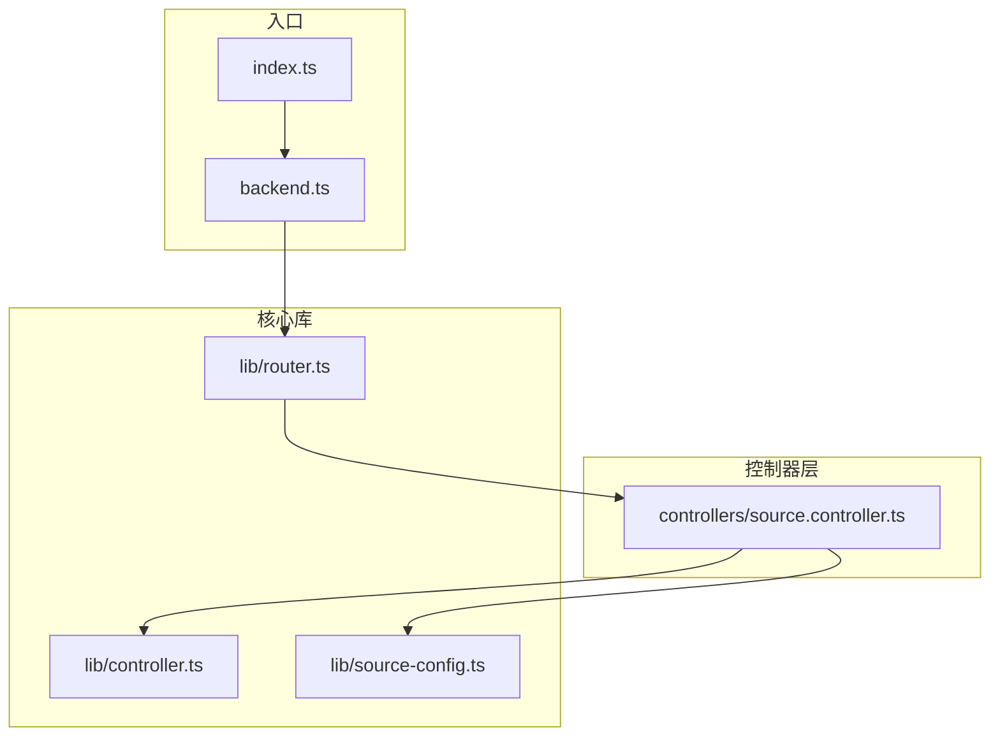
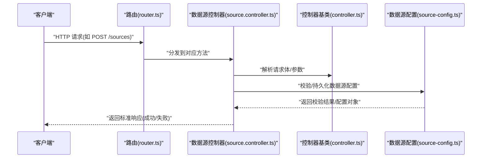
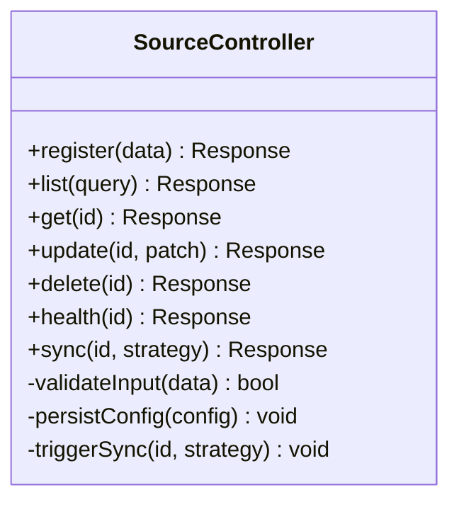
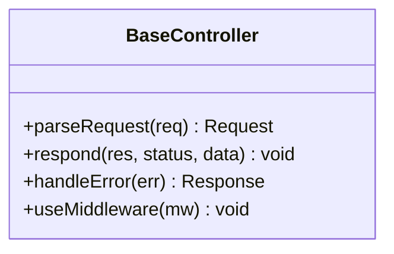
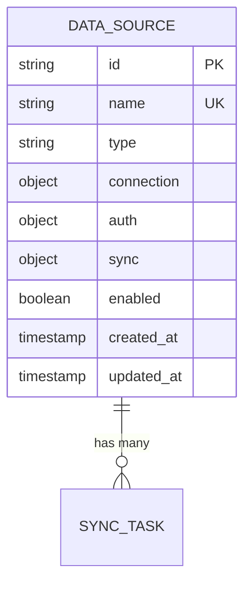
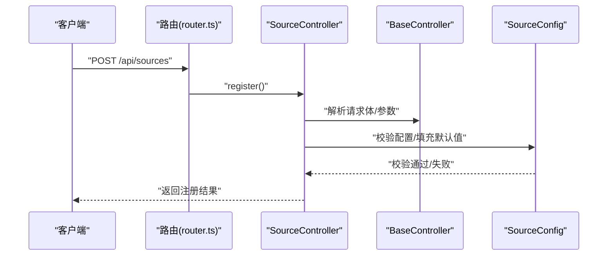
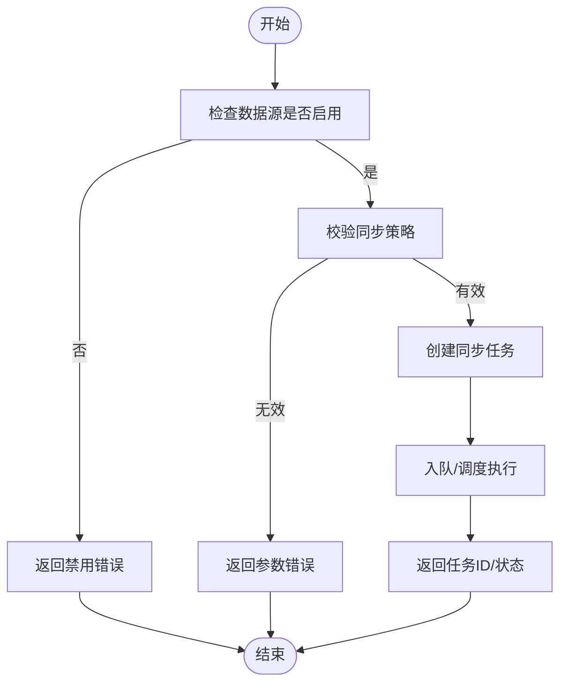
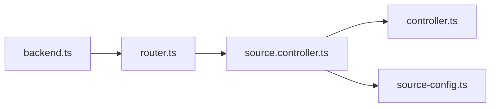

# 数据源控制器

<cite>
**本文引用的文件**   
- [source.controller.ts](file://controllers/source.controller.ts)
- [source-config.ts](file://lib/source-config.ts)
- [controller.ts](file://lib/controller.ts)
- [router.ts](file://lib/router.ts)
- [backend.ts](file://backend.ts)
- [index.ts](file://index.ts)
</cite>

## 目录
1. [简介](#简介)
2. [项目结构](#项目结构)
3. [核心组件](#核心组件)
4. [架构总览](#架构总览)
5. [详细组件分析](#详细组件分析)
6. [依赖关系分析](#依赖关系分析)
7. [性能考虑](#性能考虑)
8. [故障排查指南](#故障排查指南)
9. [结论](#结论)
10. [附录](#附录)

## 简介
本文件为“数据源控制器”的权威文档，聚焦外部数据源的配置与管理。内容涵盖：
- 数据源注册、同步机制与配置管理
- 所有数据源操作接口、配置格式与同步策略
- 添加新数据源、配置同步参数与处理连接问题的具体示例（以路径引用代替代码片段）
- 数据源插件架构与扩展机制
- 自定义数据源开发的指导原则与最佳实践

## 项目结构
本项目采用分层组织方式：
- controllers：HTTP 控制器层，暴露 API 端点
- lib：核心库，包含控制器基类、路由、数据源配置等
- routes：前端路由（与本控制器文档关联度较低）
- 根入口：后端服务启动与路由挂载

图表来源
- [index.ts](file://index.ts)
- [backend.ts](file://backend.ts)
- [router.ts](file://lib/router.ts)
- [source.controller.ts](file://controllers/source.controller.ts)
- [controller.ts](file://lib/controller.ts)
- [source-config.ts](file://lib/source-config.ts)

章节来源
- [index.ts](file://index.ts)
- [backend.ts](file://backend.ts)
- [router.ts](file://lib/router.ts)
- [source.controller.ts](file://controllers/source.controller.ts)
- [controller.ts](file://lib/controller.ts)
- [source-config.ts](file://lib/source-config.ts)

## 核心组件
- 数据源控制器：提供数据源注册、查询、更新、删除、健康检查与同步触发等 HTTP 端点
- 控制器基类：统一请求解析、响应封装、错误处理与鉴权中间件接入点
- 数据源配置模块：定义数据源配置模型、校验规则、默认值与序列化/反序列化逻辑
- 路由与后端：负责将 HTTP 请求分发到控制器方法，并启动服务

章节来源
- [source.controller.ts](file://controllers/source.controller.ts)
- [controller.ts](file://lib/controller.ts)
- [source-config.ts](file://lib/source-config.ts)
- [router.ts](file://lib/router.ts)
- [backend.ts](file://backend.ts)

## 架构总览
数据源控制器的整体交互流程如下：客户端通过 HTTP 调用控制器端点；控制器基于路由进行方法分发；控制器调用配置模块完成数据源配置的读写与校验；必要时触发同步任务或返回状态信息。

图表来源
- [router.ts](file://lib/router.ts)
- [source.controller.ts](file://controllers/source.controller.ts)
- [controller.ts](file://lib/controller.ts)
- [source-config.ts](file://lib/source-config.ts)

## 详细组件分析

### 数据源控制器（source.controller.ts）
职责与能力
- 数据源注册：接收数据源元信息与连接参数，完成校验与存储
- 数据源查询：按 ID/名称/类型等维度检索已注册数据源
- 数据源更新：增量更新配置字段，支持幂等更新
- 数据源删除：移除数据源及其关联状态
- 健康检查：探测数据源连通性与可用性
- 同步触发：发起全量/增量同步任务，返回任务 ID 或执行状态

关键设计要点
- 输入校验：对必填字段、URL 格式、认证凭据等进行严格校验
- 错误分类：区分网络错误、认证失败、权限不足、资源不存在等
- 幂等性：注册与更新接口需保证重复调用不产生副作用
- 异步任务：同步任务应非阻塞，返回任务标识供后续查询

章节来源
- [source.controller.ts](file://controllers/source.controller.ts)

#### 类图（数据源控制器）

图表来源
- [source.controller.ts](file://controllers/source.controller.ts)

### 控制器基类（controller.ts）
职责与能力
- 统一请求解析：JSON 体、查询参数、路径参数、头部信息
- 统一响应封装：成功/失败结构、状态码、错误码与消息
- 错误处理：捕获异常并转换为标准错误响应
- 中间件集成：鉴权、限流、日志记录等横切关注点

章节来源
- [controller.ts](file://lib/controller.ts)

#### 类图（控制器基类）

图表来源
- [controller.ts](file://lib/controller.ts)

### 数据源配置（source-config.ts）
职责与能力
- 配置模型：定义数据源类型、连接参数、认证方式、同步策略等字段
- 校验规则：必填项、格式约束、取值范围、依赖关系校验
- 默认值：未提供的字段使用合理默认值
- 序列化/反序列化：配置在内存与持久化之间的转换

章节来源
- [source-config.ts](file://lib/source-config.ts)

#### 数据模型图（数据源配置）

图表来源
- [source-config.ts](file://lib/source-config.ts)

### 路由与后端（router.ts、backend.ts）
职责与能力
- 路由注册：将 URL 模式映射到控制器方法
- 服务启动：监听端口、加载中间件、打印启动信息
- 健康探针：服务级健康检查

章节来源
- [router.ts](file://lib/router.ts)
- [backend.ts](file://backend.ts)

#### 序列图（数据源注册流程）

图表来源
- [router.ts](file://lib/router.ts)
- [source.controller.ts](file://controllers/source.controller.ts)
- [controller.ts](file://lib/controller.ts)
- [source-config.ts](file://lib/source-config.ts)

#### 流程图（同步策略决策）

图表来源
- [source.controller.ts](file://controllers/source.controller.ts)
- [source-config.ts](file://lib/source-config.ts)

## 依赖关系分析
- 控制器依赖基类进行通用请求/响应处理
- 控制器依赖配置模块进行数据源配置的校验与持久化
- 路由将 HTTP 请求分发到控制器方法
- 后端负责启动服务与挂载路由

图表来源
- [router.ts](file://lib/router.ts)
- [source.controller.ts](file://controllers/source.controller.ts)
- [controller.ts](file://lib/controller.ts)
- [source-config.ts](file://lib/source-config.ts)
- [backend.ts](file://backend.ts)

章节来源
- [router.ts](file://lib/router.ts)
- [source.controller.ts](file://controllers/source.controller.ts)
- [controller.ts](file://lib/controller.ts)
- [source-config.ts](file://lib/source-config.ts)
- [backend.ts](file://backend.ts)

## 性能考虑
- 连接池与复用：对外部数据源的连接应复用，避免频繁握手
- 超时与重试：设置合理的超时时间与退避重试策略
- 并发控制：限制并发同步任务数量，防止过载
- 缓存热点：对元数据与索引进行短期缓存，降低远端压力
- 分页与增量：优先使用增量同步与分页拉取，减少带宽占用
- 监控与指标：暴露关键指标（延迟、成功率、队列长度）以便观测

[本节为通用指导，无需特定文件来源]

## 故障排查指南
常见问题与定位步骤
- 连接失败：检查网络可达性、代理设置、证书有效性、端口与防火墙
- 认证失败：核对凭据格式、令牌有效期、权限范围
- 配置错误：逐项校验必填字段、格式约束、依赖关系
- 同步失败：查看任务日志、错误码、重试次数与死信队列
- 性能问题：观察慢查询、连接池耗尽、GC 与 CPU 峰值

建议的诊断手段
- 开启调试日志，记录请求/响应摘要与错误堆栈
- 使用健康检查端点快速判断数据源可用性
- 通过任务状态查询接口追踪同步进度
- 引入链路追踪，串联跨服务调用

章节来源
- [source.controller.ts](file://controllers/source.controller.ts)
- [controller.ts](file://lib/controller.ts)
- [source-config.ts](file://lib/source-config.ts)

## 结论
数据源控制器通过清晰的职责划分与模块化设计，提供了稳定可靠的外部数据源管理能力。借助统一的配置模型与校验机制，结合健壮的错误处理与可观测性，能够支撑多样化的数据源接入与同步场景。遵循本文档中的扩展与开发规范，可高效地新增数据源类型与同步策略。

[本节为总结，无需特定文件来源]

## 附录

### API 端点参考（概念性说明）
- 注册数据源：POST /api/sources
- 查询数据源列表：GET /api/sources?query=...
- 获取数据源详情：GET /api/sources/:id
- 更新数据源：PATCH /api/sources/:id
- 删除数据源：DELETE /api/sources/:id
- 健康检查：GET /api/sources/:id/health
- 触发同步：POST /api/sources/:id/sync?strategy=full|incremental

[本节为概念性说明，无需特定文件来源]

### 配置格式与同步策略（概念性说明）
- 连接参数：协议、主机、端口、路径、TLS、代理
- 认证方式：Basic、Bearer、OAuth2、API Key
- 同步策略：全量、增量、时间窗口、事件驱动
- 重试与回退：最大重试次数、退避策略、失败告警

[本节为概念性说明，无需特定文件来源]

### 添加新数据源的操作步骤（示例路径）
- 在控制器中新增注册与同步方法：[source.controller.ts](file://controllers/source.controller.ts)
- 在配置模块中扩展数据源类型与校验规则：[source-config.ts](file://lib/source-config.ts)
- 在路由中注册新的端点映射：[router.ts](file://lib/router.ts)
- 在后端启动时确保路由被加载：[backend.ts](file://backend.ts)

章节来源
- [source.controller.ts](file://controllers/source.controller.ts)
- [source-config.ts](file://lib/source-config.ts)
- [router.ts](file://lib/router.ts)
- [backend.ts](file://backend.ts)

### 自定义数据源开发指导原则与最佳实践
- 明确契约：定义清晰的输入输出与错误码
- 幂等设计：注册与更新接口具备幂等性
- 安全优先：敏感信息加密存储，最小权限原则
- 可观测性：记录关键指标与结构化日志
- 容错与降级：网络抖动与上游不可用时的优雅降级
- 测试覆盖：单元测试与集成测试覆盖正常与异常路径

[本节为通用指导，无需特定文件来源]