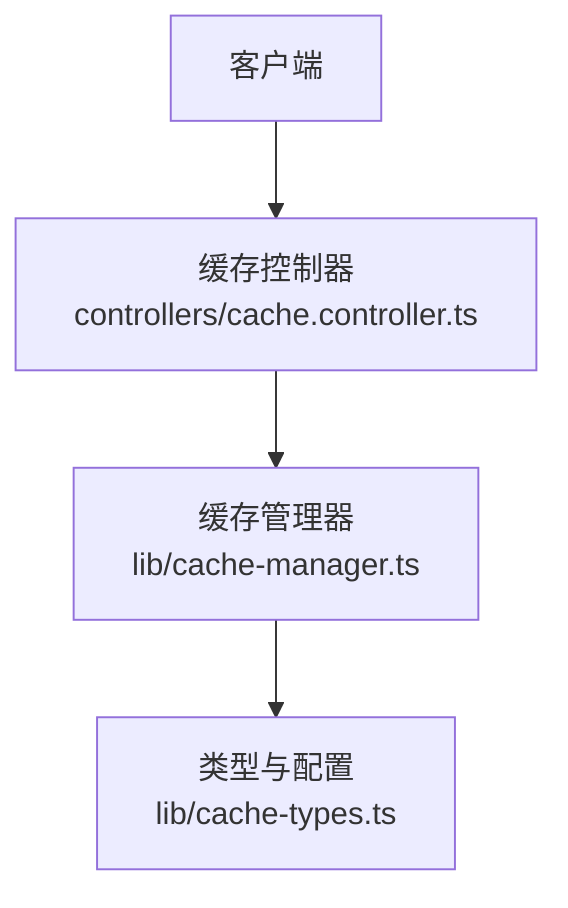
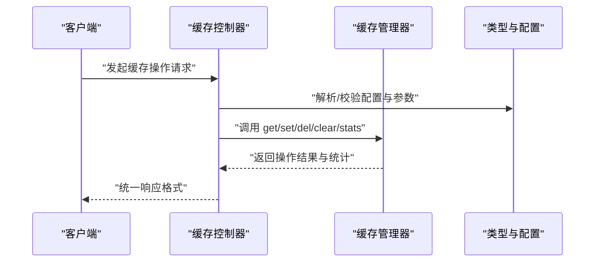
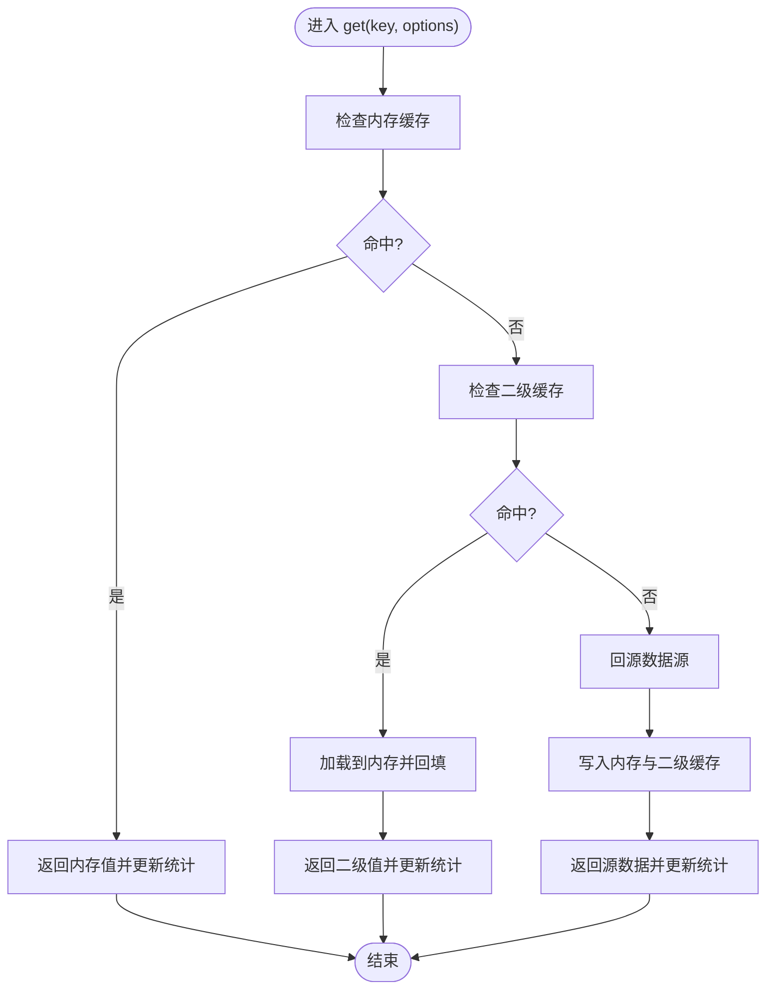

# 缓存控制器

<cite>
**本文引用的文件**   
- [cache.controller.ts](file://controllers/cache.controller.ts)
- [cache-manager.ts](file://lib/cache-manager.ts)
- [cache-types.ts](file://lib/cache-types.ts)
</cite>

## 目录
1. [简介](#简介)
2. [项目结构](#项目结构)
3. [核心组件](#核心组件)
4. [架构总览](#架构总览)
5. [详细组件分析](#详细组件分析)
6. [依赖分析](#依赖分析)
7. [性能考虑](#性能考虑)
8. [故障排除指南](#故障排除指南)
9. [结论](#结论)
10. [附录](#附录)

## 简介
本文件为“缓存控制器”提供系统化、可操作的技术文档，覆盖以下方面：
- 缓存管理相关的 API 端点（读写、清理、监控）
- 所有缓存操作接口的请求/响应约定与状态返回
- 配置参数说明与多级缓存策略原理
- 使用示例路径（以源码位置代替代码片段）
- 优化建议与常见问题排查

## 项目结构
与缓存控制器直接相关的文件位于 controllers 与 lib 目录：
- controllers/cache.controller.ts：对外暴露的 HTTP 接口实现
- lib/cache-manager.ts：缓存管理器核心逻辑（读/写/清理/统计等）
- lib/cache-types.ts：类型定义与配置项

图表来源
- [cache.controller.ts](file://controllers/cache.controller.ts)
- [cache-manager.ts](file://lib/cache-manager.ts)
- [cache-types.ts](file://lib/cache-types.ts)

章节来源
- [cache.controller.ts](file://controllers/cache.controller.ts)
- [cache-manager.ts](file://lib/cache-manager.ts)
- [cache-types.ts](file://lib/cache-types.ts)

## 核心组件
- 缓存控制器（HTTP 层）
  - 职责：接收并校验请求参数，调用缓存管理器执行具体操作，封装统一响应格式。
  - 典型能力：读取缓存、写入缓存、删除键、批量清理、获取统计信息。
- 缓存管理器（业务层）
  - 职责：维护缓存实例、实现多级缓存策略（如内存+磁盘）、处理过期与淘汰、聚合统计指标。
  - 典型能力：get/set/del/clear/stats、按命名空间或标签清理、TTL 控制、命中率统计。
- 类型与配置（契约层）
  - 职责：定义缓存键、值、选项、统计结果、错误码等类型；提供默认配置与校验。
  - 典型内容：TTL、最大容量、命名空间、存储后端选择、监控开关等。

章节来源
- [cache.controller.ts](file://controllers/cache.controller.ts)
- [cache-manager.ts](file://lib/cache-manager.ts)
- [cache-types.ts](file://lib/cache-types.ts)

## 架构总览
整体采用分层设计：控制器负责协议与参数校验，管理器负责数据与策略，类型层保证契约一致性。

图表来源
- [cache.controller.ts](file://controllers/cache.controller.ts)
- [cache-manager.ts](file://lib/cache-manager.ts)
- [cache-types.ts](file://lib/cache-types.ts)

## 详细组件分析

### 缓存控制器（API 层）
- 功能要点
  - 统一入口：集中处理缓存相关 HTTP 请求
  - 参数校验：对 key、value、options 进行必要校验
  - 响应规范：包含状态码、消息、数据体与可选的错误详情
- 常见端点（概念性描述）
  - 读取缓存：根据键获取值，支持命名空间与版本后缀
  - 写入缓存：设置键值对，支持 TTL、是否覆盖、是否持久化
  - 删除缓存：单键删除或按前缀/命名空间批量删除
  - 清理策略：按时间窗口、容量阈值、标签维度清理
  - 性能监控：返回命中率、延迟分布、容量使用率等指标
- 使用示例路径
  - 读取缓存示例：[读取缓存示例](file://controllers/cache.controller.ts)
  - 写入缓存示例：[写入缓存示例](file://controllers/cache.controller.ts)
  - 清理策略示例：[清理策略示例](file://controllers/cache.controller.ts)
  - 监控查询示例：[监控查询示例](file://controllers/cache.controller.ts)

章节来源
- [cache.controller.ts](file://controllers/cache.controller.ts)

### 缓存管理器（核心逻辑）
- 功能要点
  - 多级缓存：内存层优先，未命中回源至二级存储（如磁盘），并回填内存
  - 过期与淘汰：TTL 控制、LRU/LFU 淘汰策略、容量上限保护
  - 统计与观测：记录命中/未命中、读写延迟、容量占用、清理次数
  - 事务与一致性：在并发场景下保证原子性与幂等性
- 关键流程（概念性流程图）

图表来源
- [cache-manager.ts](file://lib/cache-manager.ts)
- [cache-types.ts](file://lib/cache-types.ts)

章节来源
- [cache-manager.ts](file://lib/cache-manager.ts)
- [cache-types.ts](file://lib/cache-types.ts)

### 类型与配置（契约层）
- 作用
  - 定义缓存键、值、选项、统计对象、错误码等类型
  - 提供默认配置与校验规则，确保上层调用一致
- 常用字段（概念性说明）
  - 键与命名空间：key、namespace、version
  - 过期与容量：ttl、maxSize、evictionPolicy
  - 存储后端：backend、persist、compress
  - 监控：metricsEnabled、sampleRate
- 使用示例路径
  - 配置示例：[配置示例](file://lib/cache-types.ts)
  - 类型定义示例：[类型定义示例](file://lib/cache-types.ts)

章节来源
- [cache-types.ts](file://lib/cache-types.ts)

## 依赖分析
- 模块耦合
  - 控制器依赖管理器与类型层，保持薄协议层
  - 管理器依赖类型层，不直接感知 HTTP 细节
- 外部依赖
  - 可能引入 I/O 库用于二级存储、序列化/压缩库、指标采集库等（由具体实现决定）

图表来源
- [cache.controller.ts](file://controllers/cache.controller.ts)
- [cache-manager.ts](file://lib/cache-manager.ts)
- [cache-types.ts](file://lib/cache-types.ts)

章节来源
- [cache.controller.ts](file://controllers/cache.controller.ts)
- [cache-manager.ts](file://lib/cache-manager.ts)
- [cache-types.ts](file://lib/cache-types.ts)

## 性能考虑
- 多级缓存
  - 内存层作为热路径，减少跨进程/跨设备访问
  - 二级存储用于持久化与扩容，注意序列化与压缩开销
- 过期与淘汰
  - 合理设置 TTL，避免热点键长期驻留导致内存膨胀
  - 选择合适的淘汰策略（LRU/LFU）匹配访问模式
- 监控与观测
  - 开启命中率、P95/P99 延迟、容量使用率等指标
  - 采样率与指标粒度需权衡精度与开销
- 并发与一致性
  - 使用锁或原子操作避免竞态条件
  - 幂等写入与重试策略提升鲁棒性

[本节为通用指导，无需特定文件引用]

## 故障排除指南
- 常见问题
  - 未命中率高：检查 TTL 与淘汰策略是否合理；确认热点键是否被正确预热
  - 内存增长异常：检查是否有大对象未压缩或未设置上限；评估 LRU/LFU 策略
  - 二级存储慢：检查 I/O 瓶颈、序列化/压缩开销；考虑异步落盘与批处理
  - 指标缺失：确认监控开关与采样率配置；检查上报通道可用性
- 定位步骤
  - 查看统计接口返回的命中率、延迟、容量等指标
  - 核对配置项（TTL、maxSize、evictionPolicy、backend）
  - 复现最小用例，逐步关闭特性（如压缩、持久化）定位根因
- 参考位置
  - 控制器错误处理与响应封装：[控制器错误处理](file://controllers/cache.controller.ts)
  - 管理器异常与边界情况处理：[管理器异常处理](file://lib/cache-manager.ts)
  - 配置校验与默认值：[配置校验](file://lib/cache-types.ts)

章节来源
- [cache.controller.ts](file://controllers/cache.controller.ts)
- [cache-manager.ts](file://lib/cache-manager.ts)
- [cache-types.ts](file://lib/cache-types.ts)

## 结论
通过控制器—管理器—类型三层解耦，系统实现了可扩展的多级缓存策略与统一的监控观测。合理的 TTL、淘汰策略与指标体系是保障性能与稳定性的关键。建议在上线前完成容量规划与压测，结合监控持续调优。

[本节为总结性内容，无需特定文件引用]

## 附录
- 快速上手
  - 初始化缓存管理器：参考 [初始化示例](file://lib/cache-manager.ts)
  - 配置多级缓存：参考 [配置示例](file://lib/cache-types.ts)
  - 调用缓存接口：参考 [控制器示例](file://controllers/cache.controller.ts)
- 术语表
  - 命中率：成功从缓存返回的请求比例
  - TTL：生存时间，超过后键失效
  - 淘汰策略：当容量达到上限时移除旧数据的策略
  - 命名空间：用于隔离不同业务域的数据

[本节为补充信息，无需特定文件引用]