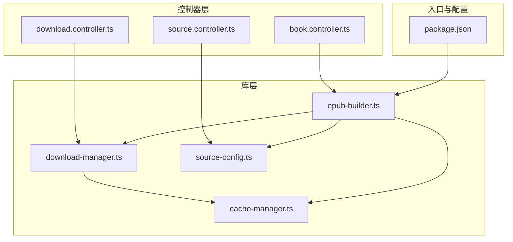
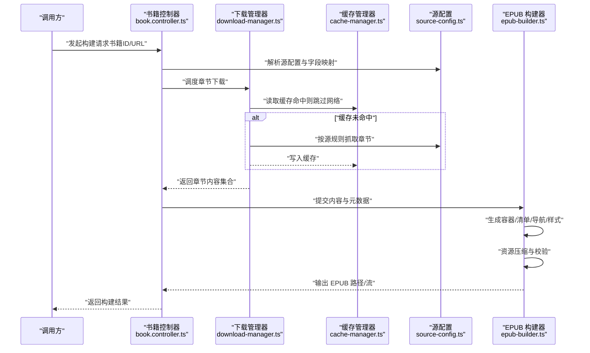
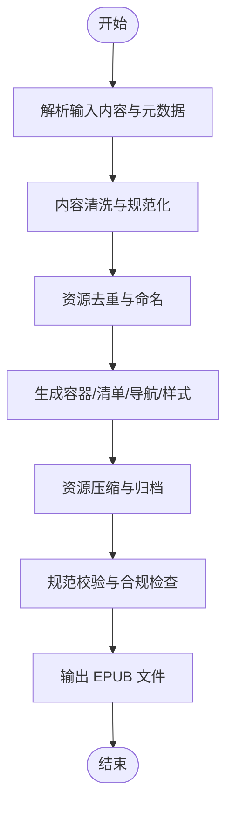
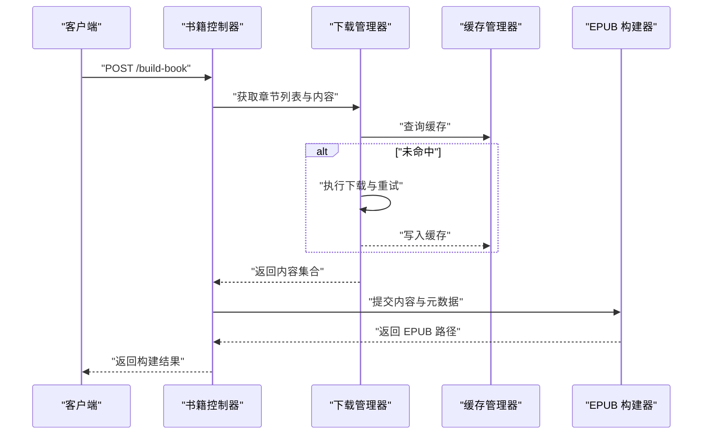
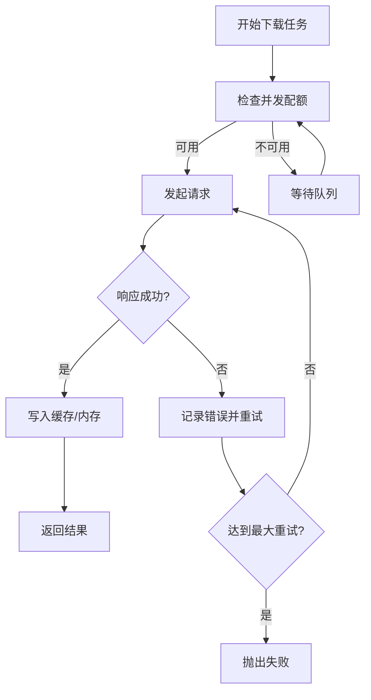
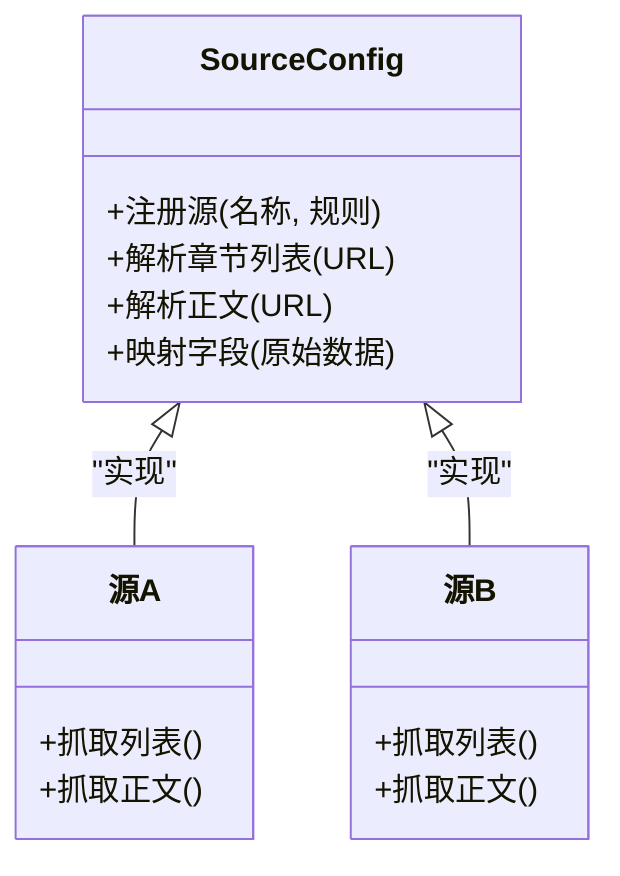
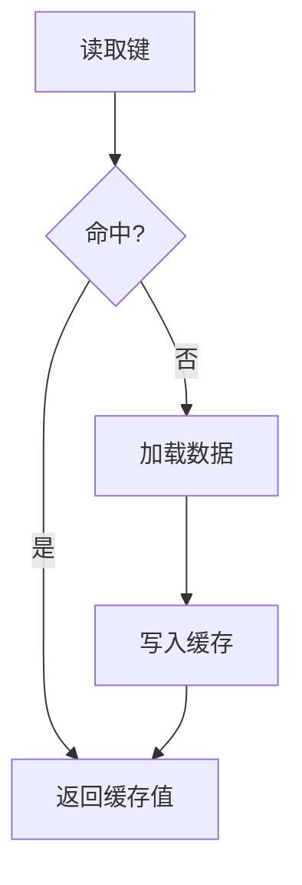
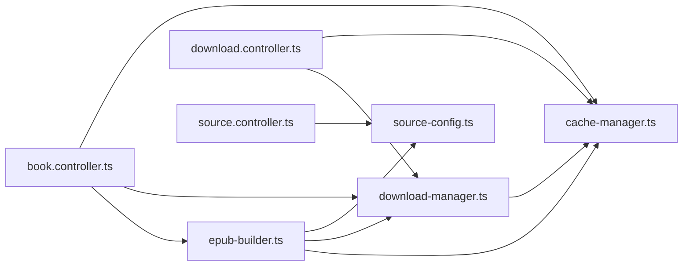
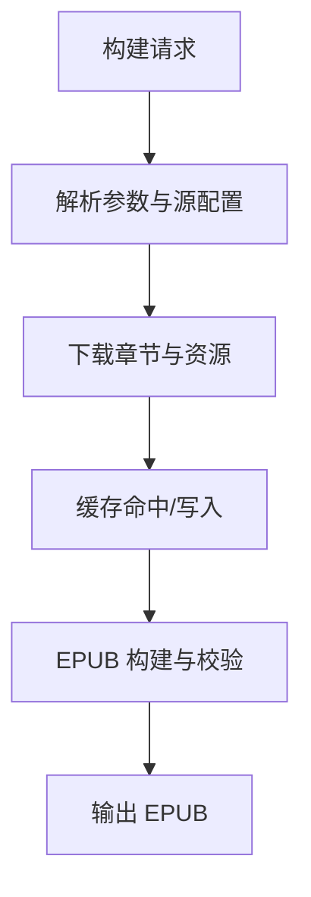

# EPUB构建数据流

<cite>
**本文档引用的文件**   
- [epub-builder.ts](file://lib/epub-builder.ts)
- [book.controller.ts](file://controllers/book.controller.ts)
- [download.controller.ts](file://controllers/download.controller.ts)
- [source.controller.ts](file://controllers/source.controller.ts)
- [cache-manager.ts](file://lib/cache-manager.ts)
- [download-manager.ts](file://lib/download-manager.ts)
- [source-config.ts](file://lib/source-config.ts)
- [package.json](file://package.json)
</cite>

## 目录
1. [简介](#简介)
2. [项目结构](#项目结构)
3. [核心组件](#核心组件)
4. [架构总览](#架构总览)
5. [详细组件分析](#详细组件分析)
6. [依赖关系分析](#依赖关系分析)
7. [性能考虑](#性能考虑)
8. [故障排查指南](#故障排查指南)
9. [结论](#结论)
10. [附录](#附录)

## 简介
本文件面向 Bun-zlib 项目的 EPUB 构建数据流，系统化描述从原始内容到标准 EPUB 的完整转换流程。文档覆盖：
- 文件结构与组织方式
- 元数据处理与资源打包机制
- 内容提取、格式转换与质量优化步骤
- EPUB 规范兼容性与验证流程
- 构建过程流程图与文件格式转换示例

目标是帮助读者快速理解并正确使用或扩展该项目的 EPUB 构建能力。

## 项目结构
本项目采用分层组织：控制器层负责请求路由与编排，库层提供下载、缓存、源配置与 EPUB 构建等核心能力，前端页面用于交互展示。与 EPUB 构建直接相关的核心文件位于 lib 与 controllers 目录中。

图表来源
- [epub-builder.ts](file://lib/epub-builder.ts)
- [book.controller.ts](file://controllers/book.controller.ts)
- [download.controller.ts](file://controllers/download.controller.ts)
- [source.controller.ts](file://controllers/source.controller.ts)
- [cache-manager.ts](file://lib/cache-manager.ts)
- [download-manager.ts](file://lib/download-manager.ts)
- [source-config.ts](file://lib/source-config.ts)
- [package.json](file://package.json)

章节来源
- [epub-builder.ts](file://lib/epub-builder.ts)
- [book.controller.ts](file://controllers/book.controller.ts)
- [download.controller.ts](file://controllers/download.controller.ts)
- [source.controller.ts](file://controllers/source.controller.ts)
- [cache-manager.ts](file://lib/cache-manager.ts)
- [download-manager.ts](file://lib/download-manager.ts)
- [source-config.ts](file://lib/source-config.ts)
- [package.json](file://package.json)

## 核心组件
- EPUB 构建器（epub-builder.ts）
  - 职责：将已下载的章节内容与元数据组装为符合规范的 EPUB 包；生成容器、清单、导航与样式；进行必要的资源压缩与校验。
  - 关键流程：解析输入 -> 生成中间产物 -> 打包归档 -> 输出 EPUB。
- 书籍控制器（book.controller.ts）
  - 职责：对外暴露书籍相关接口，协调下载与构建任务，返回构建结果或进度。
- 下载控制器（download.controller.ts）
  - 职责：管理章节资源的并发下载、重试与失败处理，写入缓存或直接供构建使用。
- 源配置（source-config.ts）
  - 职责：定义不同内容源的抓取规则、字段映射与适配策略，统一上游差异。
- 缓存管理器（cache-manager.ts）
  - 职责：提供本地缓存读写、过期策略与一致性保障，减少重复网络开销。
- 下载管理器（download-manager.ts）
  - 职责：封装并发下载、限速、断点续传与错误恢复，向上游控制器提供稳定数据源。

章节来源
- [epub-builder.ts](file://lib/epub-builder.ts)
- [book.controller.ts](file://controllers/book.controller.ts)
- [download.controller.ts](file://controllers/download.controller.ts)
- [source-config.ts](file://lib/source-config.ts)
- [cache-manager.ts](file://lib/cache-manager.ts)
- [download-manager.ts](file://lib/download-manager.ts)

## 架构总览
下图展示了从用户请求到最终 EPUB 输出的端到端数据流，包括源适配、下载、缓存、构建与输出环节。

图表来源
- [book.controller.ts](file://controllers/book.controller.ts)
- [download-manager.ts](file://lib/download-manager.ts)
- [cache-manager.ts](file://lib/cache-manager.ts)
- [source-config.ts](file://lib/source-config.ts)
- [epub-builder.ts](file://lib/epub-builder.ts)

## 详细组件分析

### EPUB 构建器（epub-builder.ts）
- 输入
  - 章节内容集合（文本/HTML）、图片等资源
  - 书籍元数据（标题、作者、语言、封面等）
- 处理步骤
  - 内容清洗与规范化：去除冗余标签、统一编码、修复不闭合标签
  - 资源去重与命名：基于哈希生成稳定文件名，避免重复
  - 生成 EPUB 内部结构：container.xml、mimetype、META-INF、OEBPS/Content
  - 生成清单与导航：OPF 清单、NCX/NavDoc 导航
  - 样式与排版：注入基础 CSS，确保跨阅读器兼容性
  - 压缩与归档：按 EPUB 规范对资源进行压缩并打包为 .epub
  - 校验与合规检查：验证清单完整性、资源引用正确性、MIME 类型与编码
- 输出
  - 标准 EPUB 文件（.epub），包含必要元数据与导航

图表来源
- [epub-builder.ts](file://lib/epub-builder.ts)

章节来源
- [epub-builder.ts](file://lib/epub-builder.ts)

### 书籍控制器（book.controller.ts）
- 职责
  - 接收外部构建请求，解析参数与上下文
  - 协调源配置与下载流程，聚合章节数据
  - 调用构建器完成 EPUB 生成，返回结果或错误
- 关键流程
  - 参数校验与权限检查
  - 触发下载与缓存命中判断
  - 构建任务编排与进度反馈
  - 异常捕获与降级策略

图表来源
- [book.controller.ts](file://controllers/book.controller.ts)
- [download-manager.ts](file://lib/download-manager.ts)
- [cache-manager.ts](file://lib/cache-manager.ts)
- [epub-builder.ts](file://lib/epub-builder.ts)

章节来源
- [book.controller.ts](file://controllers/book.controller.ts)

### 下载管理器（download-manager.ts）
- 职责
  - 并发控制与速率限制
  - 重试与退避策略
  - 错误分类与恢复
  - 与缓存管理器协作，提升整体吞吐
- 关键特性
  - 可配置的并发度与超时
  - 断点续传（如适用）
  - 统计与日志上报

图表来源
- [download-manager.ts](file://lib/download-manager.ts)
- [cache-manager.ts](file://lib/cache-manager.ts)

章节来源
- [download-manager.ts](file://lib/download-manager.ts)
- [cache-manager.ts](file://lib/cache-manager.ts)

### 源配置（source-config.ts）
- 职责
  - 定义各内容源的抓取规则、选择器与字段映射
  - 提供统一的章节列表与正文解析接口
  - 支持多源切换与动态加载
- 关键设计
  - 插件化源适配器
  - 字段映射表与默认值
  - 容错与回退策略

图表来源
- [source-config.ts](file://lib/source-config.ts)

章节来源
- [source-config.ts](file://lib/source-config.ts)

### 缓存管理器（cache-manager.ts）
- 职责
  - 提供键值存储与过期策略
  - 保证并发读写安全
  - 支持持久化与清理策略
- 关键特性
  - 多级缓存（内存+磁盘）
  - 原子写入与一致性
  - 容量上限与淘汰策略

图表来源
- [cache-manager.ts](file://lib/cache-manager.ts)

章节来源
- [cache-manager.ts](file://lib/cache-manager.ts)

### 源控制器（source.controller.ts）
- 职责
  - 暴露源管理与测试接口
  - 提供源健康检查与调试信息
  - 辅助定位抓取失败原因

章节来源
- [source.controller.ts](file://controllers/source.controller.ts)

## 依赖关系分析
- 控制器层依赖库层：
  - book.controller.ts 依赖 epub-builder.ts、download-manager.ts、cache-manager.ts
  - download.controller.ts 依赖 download-manager.ts、cache-manager.ts
  - source.controller.ts 依赖 source-config.ts
- 库层内聚：
  - epub-builder.ts 依赖 cache-manager.ts、download-manager.ts、source-config.ts
  - download-manager.ts 依赖 cache-manager.ts
  - source-config.ts 相对独立，作为规则与映射中心

图表来源
- [book.controller.ts](file://controllers/book.controller.ts)
- [download.controller.ts](file://controllers/download.controller.ts)
- [source.controller.ts](file://controllers/source.controller.ts)
- [epub-builder.ts](file://lib/epub-builder.ts)
- [download-manager.ts](file://lib/download-manager.ts)
- [cache-manager.ts](file://lib/cache-manager.ts)
- [source-config.ts](file://lib/source-config.ts)

章节来源
- [book.controller.ts](file://controllers/book.controller.ts)
- [download.controller.ts](file://controllers/download.controller.ts)
- [source.controller.ts](file://controllers/source.controller.ts)
- [epub-builder.ts](file://lib/epub-builder.ts)
- [download-manager.ts](file://lib/download-manager.ts)
- [cache-manager.ts](file://lib/cache-manager.ts)
- [source-config.ts](file://lib/source-config.ts)

## 性能考虑
- 并发与限流
  - 合理设置下载并发度，避免目标站点限流
  - 对大体积资源启用分块下载与断点续传
- 缓存命中率
  - 提高缓存粒度与 TTL 策略，减少重复抓取
  - 使用稳定的键名与版本前缀，便于失效与迁移
- 构建阶段优化
  - 资源去重与增量更新，避免重复压缩
  - 并行生成清单与导航，减少串行瓶颈
- 内存与磁盘
  - 流式处理大文件，降低峰值内存占用
  - 定期清理过期缓存与临时文件

[本节为通用指导，无需特定文件来源]

## 故障排查指南
- 常见错误与定位
  - 源抓取失败：检查源配置规则与选择器是否正确，查看源控制器提供的调试信息
  - 下载超时或中断：调整超时与重试策略，确认网络与目标站点可用性
  - 构建失败：核对 EPUB 清单完整性、资源引用与 MIME 类型，关注构建器的校验日志
- 建议的排障步骤
  - 启用详细日志与指标上报
  - 使用最小复现集（单章节）验证源与下载链路
  - 在构建器阶段开启严格模式，提前发现不规范内容
  - 对缓存进行一致性校验与重建

章节来源
- [source.controller.ts](file://controllers/source.controller.ts)
- [epub-builder.ts](file://lib/epub-builder.ts)
- [download-manager.ts](file://lib/download-manager.ts)

## 结论
通过控制器编排、源适配、下载与缓存、以及严格的 EPUB 构建与校验流程，Bun-zlib 实现了从原始内容到标准 EPUB 的稳定转换。建议在后续迭代中持续完善源适配覆盖率、构建校验规则与性能监控，以提升整体可靠性与用户体验。

[本节为总结，无需特定文件来源]

## 附录

### 构建过程流程图（端到端）

[此图为概念性流程示意，无需图表来源]

### 文件格式转换示例（路径参考）
- 输入
  - 章节 HTML/Markdown 片段
  - 图片资源（JPG/PNG/SVG）
- 中间产物
  - 清洗后的 HTML 片段
  - 标准化资源命名与目录结构
- 输出
  - EPUB 内部结构（container.xml、manifest、nav、styles）
  - 最终 .epub 归档文件

[本节为概念性说明，无需特定文件来源]