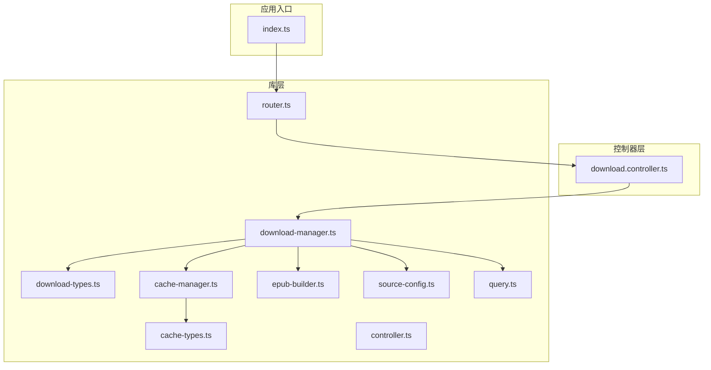
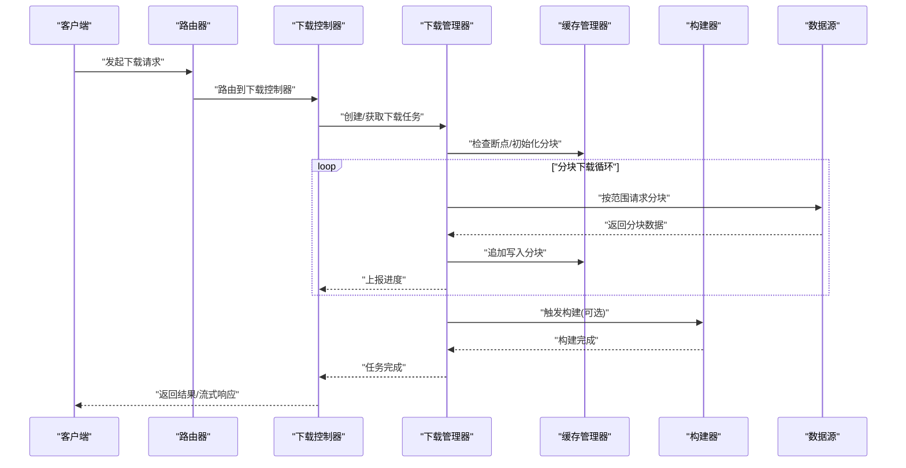
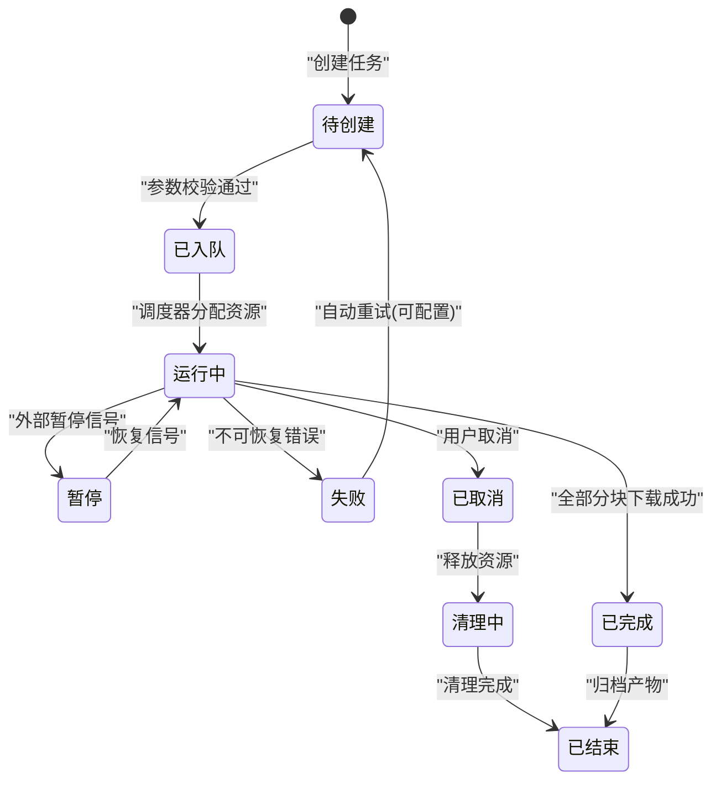
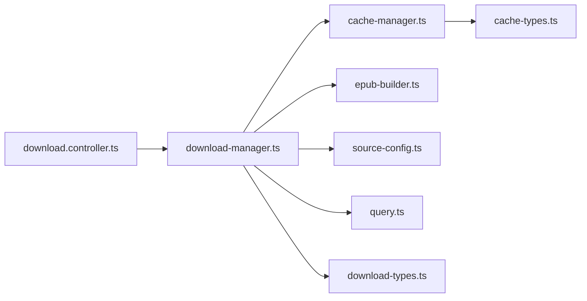

# 下载数据流

<cite>
**本文档引用的文件**   
- [download.controller.ts](file://controllers/download.controller.ts)
- [download-manager.ts](file://lib/download-manager.ts)
- [download-types.ts](file://lib/download-types.ts)
- [cache-manager.ts](file://lib/cache-manager.ts)
- [cache-types.ts](file://lib/cache-types.ts)
- [epub-builder.ts](file://lib/epub-builder.ts)
- [source-config.ts](file://lib/source-config.ts)
- [query.ts](file://lib/query.ts)
- [router.ts](file://lib/router.ts)
- [controller.ts](file://lib/controller.ts)
- [index.ts](file://index.ts)
- [package.json](file://package.json)
</cite>

## 目录
1. [简介](#简介)
2. [项目结构](#项目结构)
3. [核心组件](#核心组件)
4. [架构总览](#架构总览)
5. [详细组件分析](#详细组件分析)
6. [依赖关系分析](#依赖关系分析)
7. [性能考虑](#性能考虑)
8. [故障排查指南](#故障排查指南)
9. [结论](#结论)
10. [附录](#附录)

## 简介
本文件面向 Bun-zlib 项目的“下载数据流”，聚焦下载任务的生命周期管理、并发控制、队列调度与资源分配策略，并详细说明进度跟踪、断点续传与错误恢复机制。同时涵盖网络请求重试与超时处理策略，提供流程图与异常处理方案，帮助开发者快速理解与扩展下载子系统。

## 项目结构
下载相关代码主要分布在控制器层与库层：
- 控制器层：HTTP 接口入口，负责接收请求、参数校验、路由到下载管理器。
- 库层：下载管理器、类型定义、缓存管理、构建器（如 EPUB）、源配置与查询等。

图表来源
- [download.controller.ts](file://controllers/download.controller.ts)
- [download-manager.ts](file://lib/download-manager.ts)
- [cache-manager.ts](file://lib/cache-manager.ts)
- [epub-builder.ts](file://lib/epub-builder.ts)
- [source-config.ts](file://lib/source-config.ts)
- [query.ts](file://lib/query.ts)
- [router.ts](file://lib/router.ts)
- [controller.ts](file://lib/controller.ts)
- [index.ts](file://index.ts)

章节来源
- [index.ts](file://index.ts)
- [router.ts](file://lib/router.ts)
- [controller.ts](file://lib/controller.ts)
- [download.controller.ts](file://controllers/download.controller.ts)
- [download-manager.ts](file://lib/download-manager.ts)
- [download-types.ts](file://lib/download-types.ts)
- [cache-manager.ts](file://lib/cache-manager.ts)
- [cache-types.ts](file://lib/cache-types.ts)
- [epub-builder.ts](file://lib/epub-builder.ts)
- [source-config.ts](file://lib/source-config.ts)
- [query.ts](file://lib/query.ts)

## 核心组件
- 下载控制器：暴露 HTTP 接口，解析请求参数，调用下载管理器执行任务。
- 下载管理器：维护任务生命周期、并发控制、队列调度、进度与状态同步、断点续传、重试与超时。
- 缓存管理器：持久化分块数据、元数据与索引，支持断点续读与增量写入。
- 类型定义：统一任务、进度、错误、缓存等数据结构。
- 构建器：将下载的原始内容组装为最终产物（如 EPUB）。
- 源配置与查询：抽象不同数据源的访问方式与查询能力。

章节来源
- [download.controller.ts](file://controllers/download.controller.ts)
- [download-manager.ts](file://lib/download-manager.ts)
- [download-types.ts](file://lib/download-types.ts)
- [cache-manager.ts](file://lib/cache-manager.ts)
- [cache-types.ts](file://lib/cache-types.ts)
- [epub-builder.ts](file://lib/epub-builder.ts)
- [source-config.ts](file://lib/source-config.ts)
- [query.ts](file://lib/query.ts)

## 架构总览
下载数据流从 HTTP 请求进入，经控制器路由至下载管理器；下载管理器协调缓存管理器进行分块读写，必要时调用构建器生成最终产物；所有网络请求通过统一的客户端封装，具备重试与超时能力。

图表来源
- [download.controller.ts](file://controllers/download.controller.ts)
- [download-manager.ts](file://lib/download-manager.ts)
- [cache-manager.ts](file://lib/cache-manager.ts)
- [epub-builder.ts](file://lib/epub-builder.ts)

## 详细组件分析

### 下载控制器
职责：
- 解析请求参数（URL、目标路径、并发度、是否断点续传等）
- 校验输入合法性
- 调用下载管理器创建或复用任务
- 返回流式或聚合响应

关键点：
- 参数校验失败时立即返回错误
- 根据请求模式选择流式输出或等待构建完成

章节来源
- [download.controller.ts](file://controllers/download.controller.ts)
- [controller.ts](file://lib/controller.ts)

### 下载管理器
职责：
- 任务生命周期管理：创建、排队、运行、暂停、恢复、取消、完成、失败
- 并发控制：基于令牌桶或信号量限制同时运行的任务数
- 队列调度：优先级队列或 FIFO，支持抢占与重入
- 进度跟踪：累计字节数、百分比、速率统计
- 断点续传：读取已存在分块，计算缺失区间，仅拉取未下载部分
- 重试与超时：指数退避、最大重试次数、请求级与任务级超时
- 错误恢复：捕获可恢复错误，回滚部分写入，清理临时文件

关键流程（任务生命周期）：

图表来源
- [download-manager.ts](file://lib/download-manager.ts)
- [download-types.ts](file://lib/download-types.ts)

并发控制与队列调度：
- 使用全局并发上限，避免内存与带宽拥塞
- 任务优先级影响调度顺序，高优先级优先获得令牌
- 支持任务抢占（谨慎使用），确保关键任务及时完成

断点续传实现要点：
- 以分块为单位记录偏移与长度
- 下载前检查本地是否存在部分分块，跳过已存在部分
- 失败后保留有效分块，仅重试失败分块

重试与超时策略：
- 请求级超时：单个分块请求的超时时间
- 任务级超时：整个任务的超时阈值
- 指数退避：失败后等待时间递增，避免雪崩
- 最大重试次数：超过阈值标记为失败

章节来源
- [download-manager.ts](file://lib/download-manager.ts)
- [download-types.ts](file://lib/download-types.ts)

### 缓存管理器
职责：
- 分块文件的原子写入与合并
- 元数据持久化（任务ID、分块索引、哈希校验）
- 断点续传的索引重建与一致性校验
- 清理临时文件与回收空间

关键点：
- 写入采用幂等操作，避免重复写入导致损坏
- 校验和用于验证分块完整性
- 支持并发安全写入（锁或写缓冲）

章节来源
- [cache-manager.ts](file://lib/cache-manager.ts)
- [cache-types.ts](file://lib/cache-types.ts)

### 构建器（EPUB）
职责：
- 将下载的分块内容组装为结构化文档（如 EPUB）
- 生成元数据、目录与内容文件
- 在构建阶段进行格式校验与修复

关键点：
- 构建过程可中断，支持增量构建
- 中间产物落盘，便于恢复

章节来源
- [epub-builder.ts](file://lib/epub-builder.ts)

### 源配置与查询
职责：
- 抽象数据源访问协议（HTTP/HTTPS、API、本地文件等）
- 提供分页、范围请求、鉴权等通用能力
- 配置项包括超时、重试、代理、UA 等

章节来源
- [source-config.ts](file://lib/source-config.ts)
- [query.ts](file://lib/query.ts)

### 类型定义
职责：
- 统一定义任务状态、进度、错误码、缓存条目、构建结果等
- 保证模块间数据结构一致

章节来源
- [download-types.ts](file://lib/download-types.ts)
- [cache-types.ts](file://lib/cache-types.ts)

## 依赖关系分析
下载子系统内部依赖清晰，控制器依赖管理器，管理器依赖缓存、构建器、源配置与查询，类型定义贯穿各模块。

图表来源
- [download.controller.ts](file://controllers/download.controller.ts)
- [download-manager.ts](file://lib/download-manager.ts)
- [cache-manager.ts](file://lib/cache-manager.ts)
- [epub-builder.ts](file://lib/epub-builder.ts)
- [source-config.ts](file://lib/source-config.ts)
- [query.ts](file://lib/query.ts)
- [download-types.ts](file://lib/download-types.ts)
- [cache-types.ts](file://lib/cache-types.ts)

章节来源
- [download.controller.ts](file://controllers/download.controller.ts)
- [download-manager.ts](file://lib/download-manager.ts)
- [cache-manager.ts](file://lib/cache-manager.ts)
- [epub-builder.ts](file://lib/epub-builder.ts)
- [source-config.ts](file://lib/source-config.ts)
- [query.ts](file://lib/query.ts)
- [download-types.ts](file://lib/download-types.ts)
- [cache-types.ts](file://lib/cache-types.ts)

## 性能考虑
- 并发度调优：根据系统内存与带宽设置合适的并发上限，避免过多任务导致抖动
- 分块大小：合理设置分块大小，平衡 I/O 开销与内存占用
- 缓存策略：启用增量写入与去重，减少重复下载
- 构建优化：延迟构建，仅在必要时触发；支持增量构建
- 监控指标：记录吞吐、延迟、失败率、重试次数、缓存命中率

[本节为通用指导，不直接分析具体文件]

## 故障排查指南
常见问题与定位方法：
- 任务卡在“已入队”：检查调度器令牌池与资源配额
- 进度不更新：确认进度回调是否注册，缓存写入是否成功
- 断点续传无效：检查分块索引与校验和，确认分块未被覆盖
- 频繁重试：查看网络错误类型，调整超时与退避策略
- 构建失败：检查中间产物完整性，查看构建日志

建议的调试步骤：
- 开启详细日志，记录任务状态转换与关键事件
- 检查缓存目录结构与元数据文件
- 使用网络抓包工具验证范围请求与响应头
- 逐步缩小并发度，观察稳定性变化

章节来源
- [download-manager.ts](file://lib/download-manager.ts)
- [cache-manager.ts](file://lib/cache-manager.ts)
- [epub-builder.ts](file://lib/epub-builder.ts)

## 结论
Bun-zlib 的下载数据流以“下载管理器”为核心，结合“缓存管理器”与“构建器”，实现了完整的任务生命周期、并发控制、断点续传与错误恢复。通过清晰的类型定义与模块化设计，系统具备良好的可扩展性与可维护性。建议在部署时根据实际负载调优并发与分块大小，并完善监控与告警机制。

[本节为总结，不直接分析具体文件]

## 附录
- 环境变量与配置项：可在源配置中集中管理超时、重试、代理等参数
- API 参考：控制器暴露的接口方法与参数说明
- 最佳实践：推荐的分块大小、并发度与缓存策略

[本节为补充信息，不直接分析具体文件]