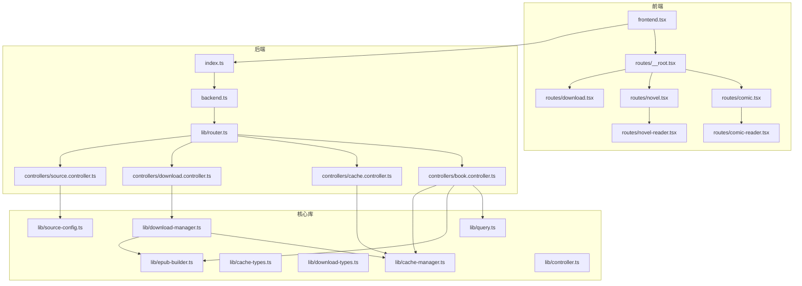
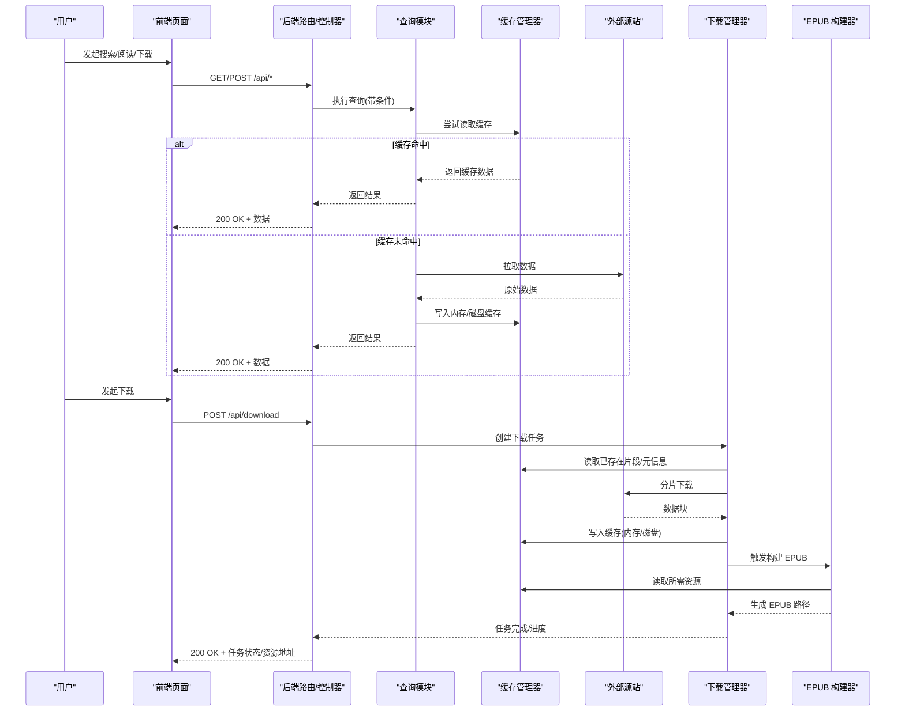
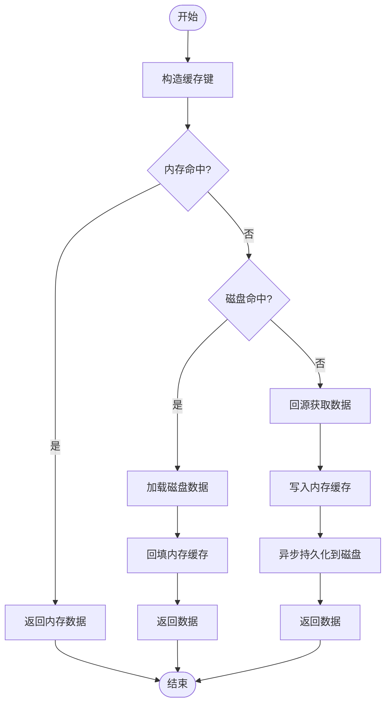
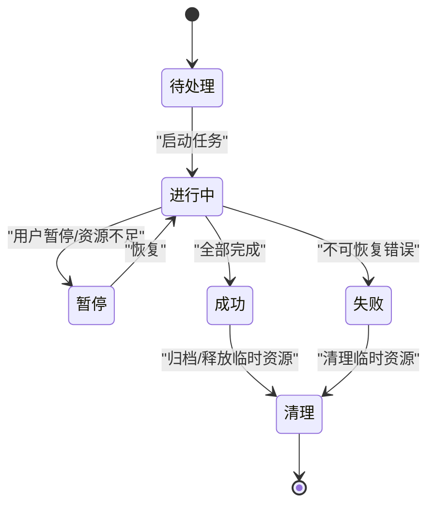
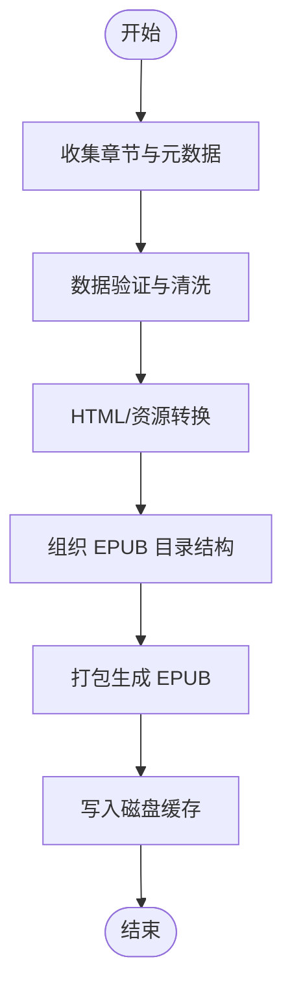
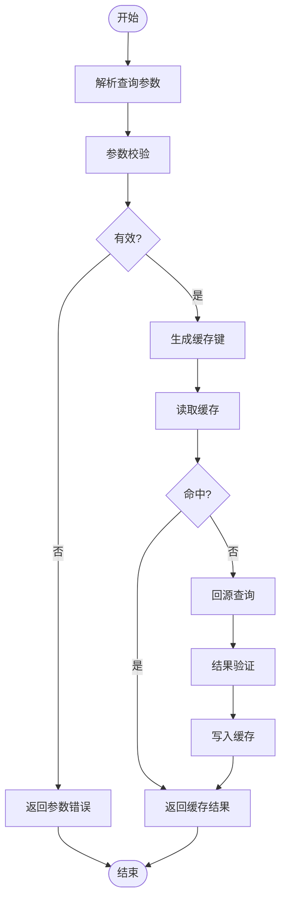
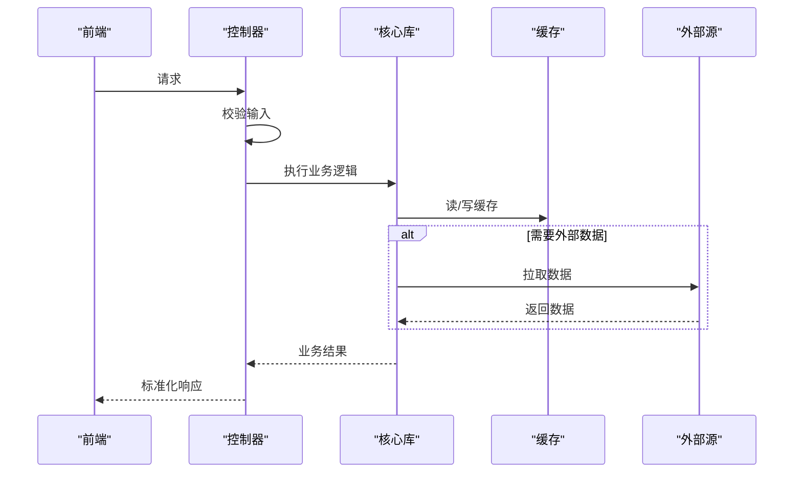
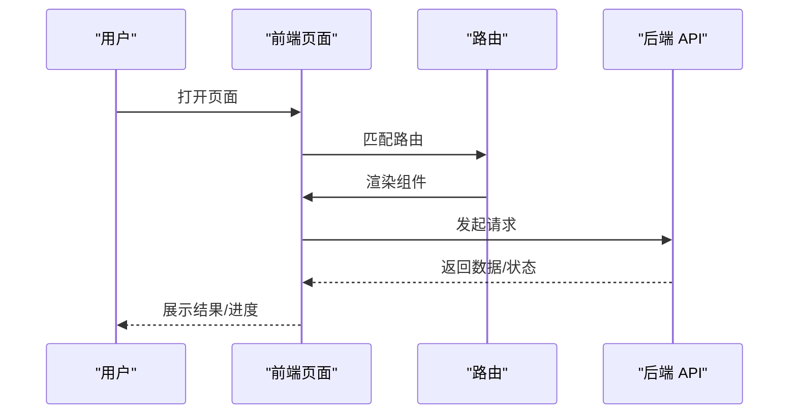
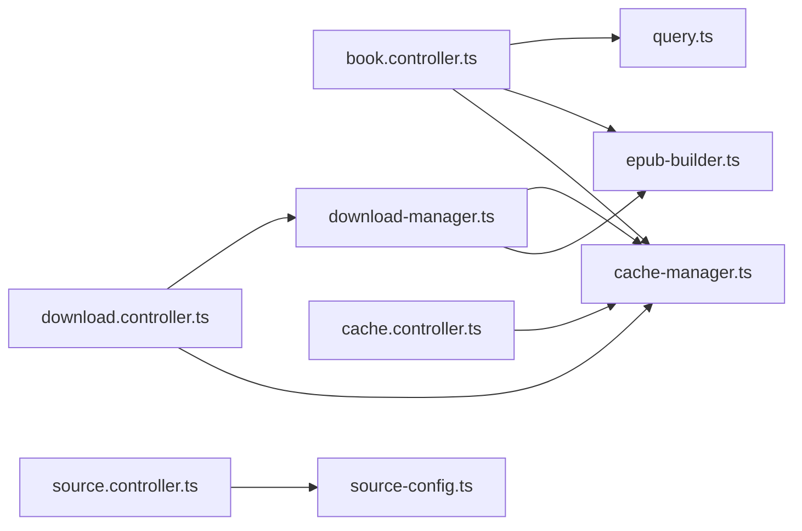

# 数据流设计

<cite>
**本文引用的文件**   
- [backend.ts](file://backend.ts)
- [index.ts](file://index.ts)
- [frontend.tsx](file://frontend.tsx)
- [book.controller.ts](file://controllers/book.controller.ts)
- [cache.controller.ts](file://controllers/cache.controller.ts)
- [download.controller.ts](file://controllers/download.controller.ts)
- [source.controller.ts](file://controllers/source.controller.ts)
- [cache-manager.ts](file://lib/cache-manager.ts)
- [cache-types.ts](file://lib/cache-types.ts)
- [controller.ts](file://lib/controller.ts)
- [download-manager.ts](file://lib/download-manager.ts)
- [download-types.ts](file://lib/download-types.ts)
- [epub-builder.ts](file://lib/epub-builder.ts)
- [query.ts](file://lib/query.ts)
- [router.ts](file://lib/router.ts)
- [source-config.ts](file://lib/source-config.ts)
- [__root.tsx](file://routes/__root.tsx)
- [comic-reader.tsx](file://routes/comic-reader.tsx)
- [comic.tsx](file://routes/comic.tsx)
- [download.tsx](file://routes/download.tsx)
- [novel-reader.tsx](file://routes/novel-reader.tsx)
- [novel.tsx](file://routes/novel.tsx)
</cite>

## 目录
1. [简介](#简介)
2. [项目结构](#项目结构)
3. [核心组件](#核心组件)
4. [架构总览](#架构总览)
5. [详细组件分析](#详细组件分析)
6. [依赖分析](#依赖分析)
7. [性能考虑](#性能考虑)
8. [故障排查指南](#故障排查指南)
9. [结论](#结论)
10. [附录](#附录)

## 简介
本文件聚焦于 Bun-zlib 项目的数据流设计，覆盖从用户请求到响应返回的完整路径、缓存策略（内存与磁盘）的数据流向、下载任务的状态管理与进度更新机制、EPUB 构建过程中的数据转换与文件组织，并配套提供数据流图与状态转换图。文档旨在帮助读者快速理解系统内部的数据流转与控制逻辑，同时为优化与排障提供参考。

## 项目结构
项目采用前后端同构的 Bun 应用结构：
- 后端入口与路由注册位于 index.ts 与 backend.ts
- 控制器层按功能域划分在 controllers 下
- 业务逻辑与基础设施封装在 lib 下（缓存、下载、EPUB 构建、查询、路由等）
- 前端页面与路由在 routes 下，通过前端入口 frontend.tsx 挂载

图表来源
- [index.ts](file://index.ts)
- [backend.ts](file://backend.ts)
- [router.ts](file://lib/router.ts)
- [book.controller.ts](file://controllers/book.controller.ts)
- [cache.controller.ts](file://controllers/cache.controller.ts)
- [download.controller.ts](file://controllers/download.controller.ts)
- [source.controller.ts](file://controllers/source.controller.ts)
- [cache-manager.ts](file://lib/cache-manager.ts)
- [download-manager.ts](file://lib/download-manager.ts)
- [epub-builder.ts](file://lib/epub-builder.ts)
- [query.ts](file://lib/query.ts)
- [source-config.ts](file://lib/source-config.ts)
- [controller.ts](file://lib/controller.ts)
- [frontend.tsx](file://frontend.tsx)
- [__root.tsx](file://routes/__root.tsx)
- [comic.tsx](file://routes/comic.tsx)
- [novel.tsx](file://routes/novel.tsx)
- [download.tsx](file://routes/download.tsx)
- [comic-reader.tsx](file://routes/comic-reader.tsx)
- [novel-reader.tsx](file://routes/novel-reader.tsx)

章节来源
- [index.ts](file://index.ts)
- [backend.ts](file://backend.ts)
- [frontend.tsx](file://frontend.tsx)
- [router.ts](file://lib/router.ts)

## 核心组件
- 缓存管理器（内存与磁盘）：负责统一读写缓存、键空间管理、过期与淘汰策略、持久化落盘。
- 下载管理器：维护下载任务生命周期、并发控制、断点续传、进度事件上报、失败重试与恢复。
- EPUB 构建器：将源内容转换为标准 EPUB 包结构，生成元数据、章节内容与打包归档。
- 查询模块：对源站或本地索引进行检索、过滤与分页。
- 控制器层：暴露 HTTP API，编排调用各核心库，处理输入校验与错误映射。
- 路由与前端：定义页面与交互流程，发起网络请求并渲染结果。

章节来源
- [cache-manager.ts](file://lib/cache-manager.ts)
- [cache-types.ts](file://lib/cache-types.ts)
- [download-manager.ts](file://lib/download-manager.ts)
- [download-types.ts](file://lib/download-types.ts)
- [epub-builder.ts](file://lib/epub-builder.ts)
- [query.ts](file://lib/query.ts)
- [controller.ts](file://lib/controller.ts)

## 架构总览
整体数据流遵循“前端请求 -> 路由分发 -> 控制器编排 -> 核心库处理 -> 缓存/外部源 -> 响应返回”的模式。关键路径包括：
- 搜索与读取：前端触发查询 -> 控制器调用查询模块 -> 命中缓存则直接返回；未命中则访问源站 -> 写入缓存 -> 返回结果。
- 下载与构建：前端发起下载 -> 控制器委托下载管理器 -> 分片下载与进度上报 -> 构建 EPUB -> 写入磁盘缓存 -> 返回可访问资源。
- 缓存策略：读优先走内存缓存，未命中再查磁盘缓存；写先入内存，异步落盘，支持失效与清理。

图表来源
- [book.controller.ts](file://controllers/book.controller.ts)
- [cache.controller.ts](file://controllers/cache.controller.ts)
- [download.controller.ts](file://controllers/download.controller.ts)
- [source.controller.ts](file://controllers/source.controller.ts)
- [cache-manager.ts](file://lib/cache-manager.ts)
- [download-manager.ts](file://lib/download-manager.ts)
- [epub-builder.ts](file://lib/epub-builder.ts)
- [query.ts](file://lib/query.ts)

## 详细组件分析

### 缓存子系统数据流（内存与磁盘）
- 读路径：请求进入控制器 -> 构造缓存键 -> 查询内存缓存 -> 未命中则查询磁盘缓存 -> 命中则回填内存并返回 -> 未命中则回源获取 -> 写入内存与磁盘 -> 返回。
- 写路径：控制器或业务模块写入 -> 先入内存 -> 异步持久化到磁盘 -> 支持批量合并与压缩。
- 失效与清理：基于键前缀或时间戳失效；后台定时清理过期条目；内存上限触发 LRU 淘汰。

图表来源
- [cache-manager.ts](file://lib/cache-manager.ts)
- [cache-types.ts](file://lib/cache-types.ts)
- [cache.controller.ts](file://controllers/cache.controller.ts)

章节来源
- [cache-manager.ts](file://lib/cache-manager.ts)
- [cache-types.ts](file://lib/cache-types.ts)
- [cache.controller.ts](file://controllers/cache.controller.ts)

### 下载任务状态管理与进度更新
- 状态机：待处理 -> 进行中 -> 暂停/恢复 -> 成功/失败 -> 清理。
- 进度上报：分片下载完成后累计字节数与百分比，通过事件或轮询接口推送给前端。
- 断点续传：记录已下载片段与偏移量，失败后从上次位置继续。
- 并发控制：限制同时进行的下载任务数量，避免资源争用。

图表来源
- [download-manager.ts](file://lib/download-manager.ts)
- [download-types.ts](file://lib/download-types.ts)
- [download.controller.ts](file://controllers/download.controller.ts)

章节来源
- [download-manager.ts](file://lib/download-manager.ts)
- [download-types.ts](file://lib/download-types.ts)
- [download.controller.ts](file://controllers/download.controller.ts)

### EPUB 构建过程的数据转换与文件组织
- 输入：章节文本、图片、元数据（标题、作者、描述等）。
- 转换：规范化编码、HTML 片段生成、封面与样式注入、目录结构组装。
- 输出：标准 EPUB 包（包含 mimetype、META-INF、OEBPS 等目录），写入磁盘缓存供后续访问。

图表来源
- [epub-builder.ts](file://lib/epub-builder.ts)
- [cache-manager.ts](file://lib/cache-manager.ts)

章节来源
- [epub-builder.ts](file://lib/epub-builder.ts)
- [cache-manager.ts](file://lib/cache-manager.ts)

### 查询与数据验证
- 查询：根据关键词、分类、排序等条件检索，支持分页与过滤。
- 验证：对输入参数进行类型与范围校验，对返回数据进行基本完整性检查。
- 缓存键：由查询条件派生，确保相同语义的请求命中同一缓存项。

图表来源
- [query.ts](file://lib/query.ts)
- [cache-manager.ts](file://lib/cache-manager.ts)
- [book.controller.ts](file://controllers/book.controller.ts)

章节来源
- [query.ts](file://lib/query.ts)
- [cache-manager.ts](file://lib/cache-manager.ts)
- [book.controller.ts](file://controllers/book.controller.ts)

### 控制器编排与错误映射
- 控制器职责：接收请求、校验输入、调用核心库、处理异常、返回标准化响应。
- 错误映射：将底层异常转换为统一的 HTTP 状态码与消息体，便于前端处理。
- 中间件：日志、限流、鉴权等横切关注点可在控制器之前或之后执行。

图表来源
- [book.controller.ts](file://controllers/book.controller.ts)
- [cache.controller.ts](file://controllers/cache.controller.ts)
- [download.controller.ts](file://controllers/download.controller.ts)
- [source.controller.ts](file://controllers/source.controller.ts)
- [cache-manager.ts](file://lib/cache-manager.ts)
- [download-manager.ts](file://lib/download-manager.ts)
- [epub-builder.ts](file://lib/epub-builder.ts)
- [query.ts](file://lib/query.ts)

章节来源
- [book.controller.ts](file://controllers/book.controller.ts)
- [cache.controller.ts](file://controllers/cache.controller.ts)
- [download.controller.ts](file://controllers/download.controller.ts)
- [source.controller.ts](file://controllers/source.controller.ts)
- [controller.ts](file://lib/controller.ts)

### 前端路由与交互
- 页面路由：首页根路由与子路由分别承载漫画、小说、下载等功能。
- 交互流程：页面发起 API 请求，展示进度与结果，支持刷新与重试。
- 状态同步：下载进度通过轮询或事件通道与后端保持一致。

图表来源
- [frontend.tsx](file://frontend.tsx)
- [__root.tsx](file://routes/__root.tsx)
- [comic.tsx](file://routes/comic.tsx)
- [novel.tsx](file://routes/novel.tsx)
- [download.tsx](file://routes/download.tsx)
- [comic-reader.tsx](file://routes/comic-reader.tsx)
- [novel-reader.tsx](file://routes/novel-reader.tsx)

章节来源
- [frontend.tsx](file://frontend.tsx)
- [__root.tsx](file://routes/__root.tsx)
- [comic.tsx](file://routes/comic.tsx)
- [novel.tsx](file://routes/novel.tsx)
- [download.tsx](file://routes/download.tsx)
- [comic-reader.tsx](file://routes/comic-reader.tsx)
- [novel-reader.tsx](file://routes/novel-reader.tsx)

## 依赖分析
- 控制器依赖核心库：book.controller 依赖 query 与 epub-builder；download.controller 依赖 download-manager；cache.controller 依赖 cache-manager；source.controller 依赖 source-config。
- 核心库间耦合：download-manager 与 cache-manager 紧密协作；epub-builder 依赖缓存以读取资源；query 使用缓存减少回源压力。
- 路由与入口：index.ts 与 backend.ts 负责服务启动与路由注册，router.ts 集中管理路由表。

图表来源
- [book.controller.ts](file://controllers/book.controller.ts)
- [download.controller.ts](file://controllers/download.controller.ts)
- [cache.controller.ts](file://controllers/cache.controller.ts)
- [source.controller.ts](file://controllers/source.controller.ts)
- [query.ts](file://lib/query.ts)
- [epub-builder.ts](file://lib/epub-builder.ts)
- [cache-manager.ts](file://lib/cache-manager.ts)
- [download-manager.ts](file://lib/download-manager.ts)
- [source-config.ts](file://lib/source-config.ts)

章节来源
- [book.controller.ts](file://controllers/book.controller.ts)
- [download.controller.ts](file://controllers/download.controller.ts)
- [cache.controller.ts](file://controllers/cache.controller.ts)
- [source.controller.ts](file://controllers/source.controller.ts)
- [query.ts](file://lib/query.ts)
- [epub-builder.ts](file://lib/epub-builder.ts)
- [cache-manager.ts](file://lib/cache-manager.ts)
- [download-manager.ts](file://lib/download-manager.ts)
- [source-config.ts](file://lib/source-config.ts)

## 性能考虑
- 缓存命中率：合理设计缓存键与过期策略，提升内存命中率，降低磁盘 I/O。
- 并发控制：限制下载并发度，避免 CPU/IO 瓶颈；对大文件采用流式处理。
- 增量构建：EPUB 构建时仅更新变更章节，减少重复计算与打包开销。
- 批处理与合并：缓存写入采用批量合并，减少频繁落盘。
- 监控与指标：记录缓存命中率、下载吞吐、构建耗时等指标用于调优。

## 故障排查指南
- 常见问题
  - 缓存不一致：检查键生成规则与失效时机，确认内存与磁盘同步逻辑。
  - 下载中断：查看断点续传记录是否完整，确认网络重试与超时配置。
  - EPUB 构建失败：核对输入数据完整性与编码，检查资源路径与权限。
- 定位方法
  - 启用详细日志：在控制器与核心库关键路径打印请求 ID、缓存键、任务 ID。
  - 回放与复现：保存失败时的输入与中间状态，便于本地复现。
  - 资源检查：确认磁盘空间、文件句柄与外部源可用性。
- 恢复策略
  - 自动重试：对瞬时错误实施指数退避重试。
  - 降级模式：缓存不可用时回源直连；构建失败时返回半成品或提示重试。
  - 清理与修复：定期扫描损坏缓存与未完成任务，提供手动清理接口。

章节来源
- [cache-manager.ts](file://lib/cache-manager.ts)
- [download-manager.ts](file://lib/download-manager.ts)
- [epub-builder.ts](file://lib/epub-builder.ts)
- [controller.ts](file://lib/controller.ts)

## 结论
Bun-zlib 的数据流设计围绕“缓存优先、任务驱动、构建解耦”的原则展开。通过清晰的层次划分与模块化设计，系统在可读性、可扩展性与性能之间取得平衡。建议持续完善监控与自动化测试，进一步巩固稳定性与可观测性。

## 附录
- 术语说明
  - 缓存键：用于唯一标识缓存项的字符串，通常由请求参数派生。
  - 断点续传：在下载中断后从上次位置继续下载的机制。
  - EPUB：一种标准的电子书格式，包含结构化内容与资源。
- 参考实现路径
  - 缓存读写：[cache-manager.ts](file://lib/cache-manager.ts)
  - 下载任务：[download-manager.ts](file://lib/download-manager.ts)
  - EPUB 构建：[epub-builder.ts](file://lib/epub-builder.ts)
  - 查询与验证：[query.ts](file://lib/query.ts)
  - 控制器编排：[book.controller.ts](file://controllers/book.controller.ts)、[download.controller.ts](file://controllers/download.controller.ts)、[cache.controller.ts](file://controllers/cache.controller.ts)、[source.controller.ts](file://controllers/source.controller.ts)