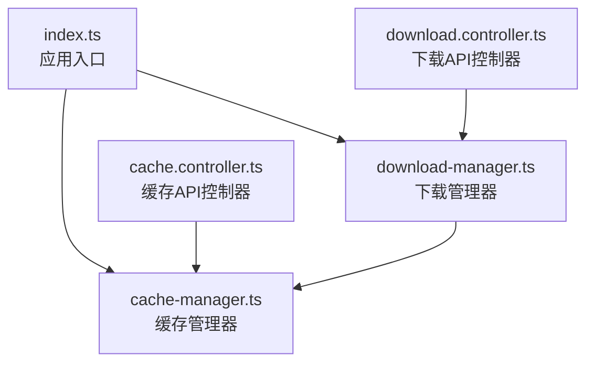
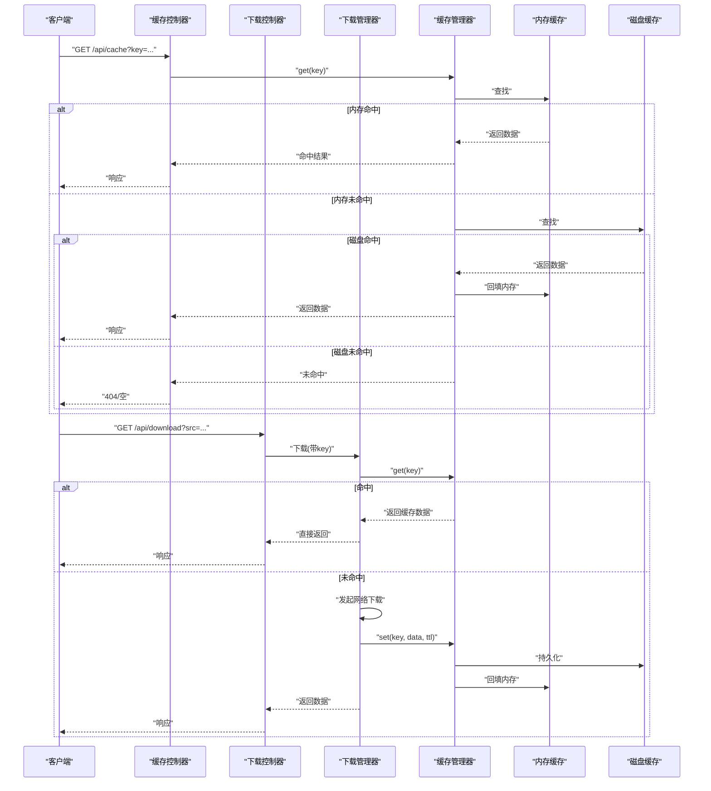
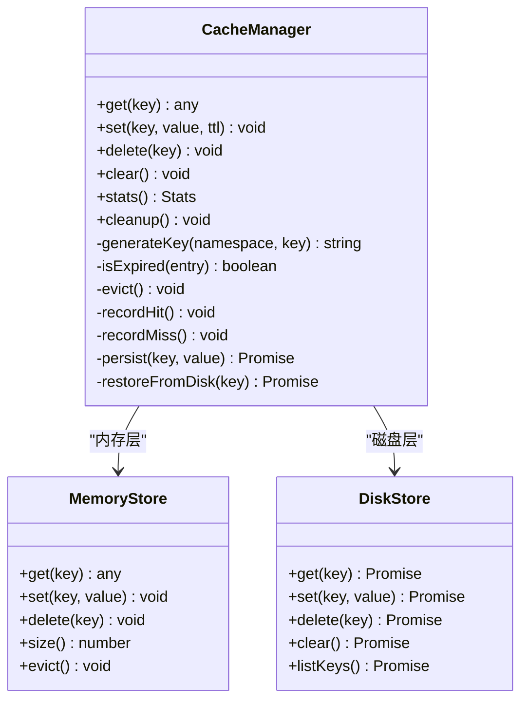
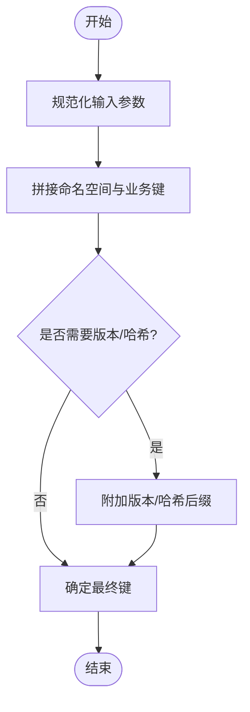
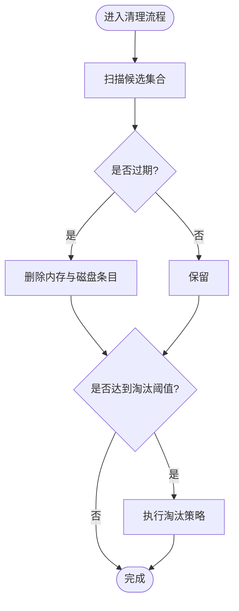
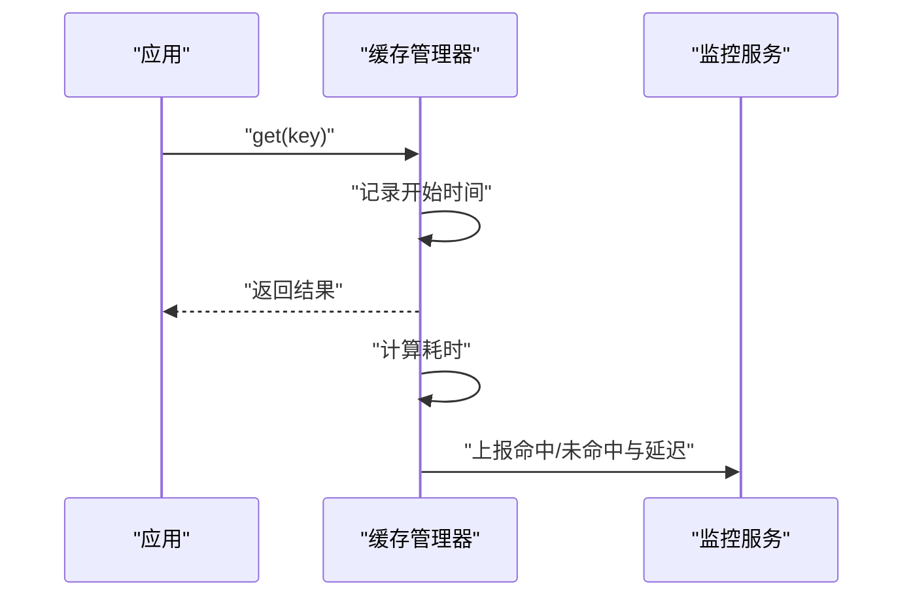
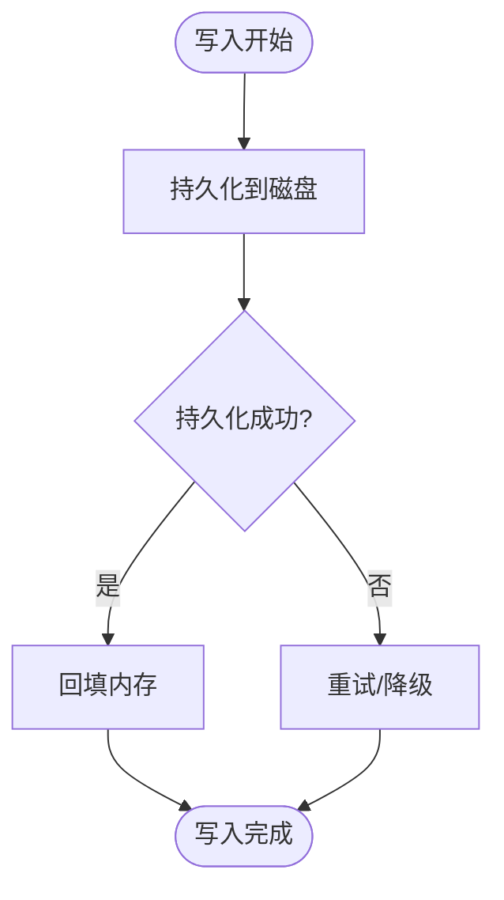
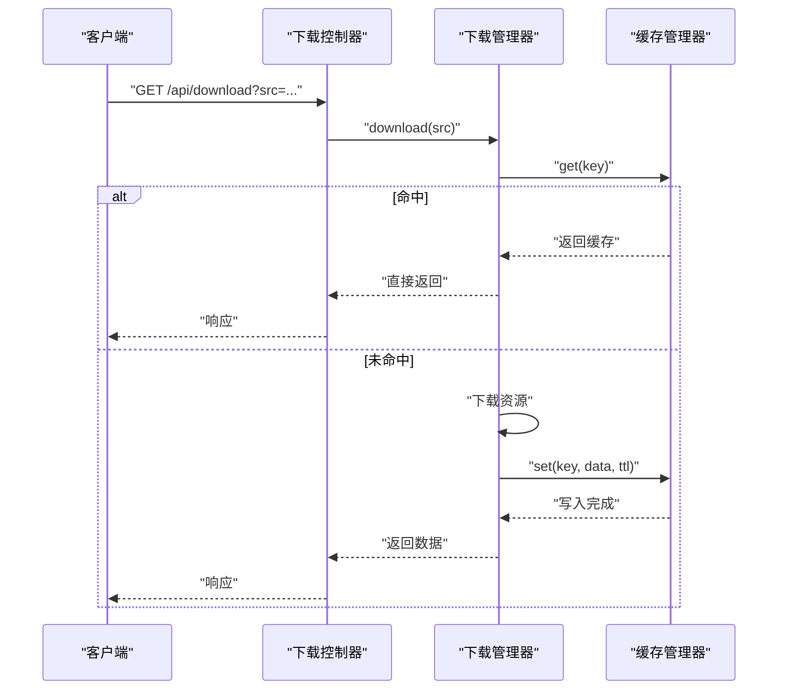
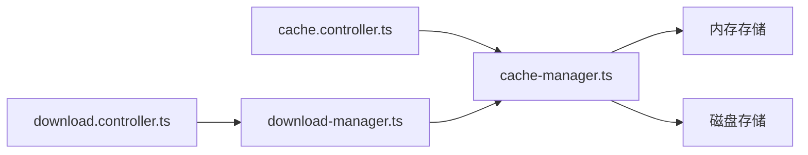

# 缓存数据流

<cite>
**本文引用的文件**   
- [cache-manager.ts](file://lib/cache-manager.ts)
- [cache-types.ts](file://lib/cache-types.ts)
- [cache.controller.ts](file://controllers/cache.controller.ts)
- [download-manager.ts](file://lib/download-manager.ts)
- [download.controller.ts](file://controllers/download.controller.ts)
- [index.ts](file://index.ts)
</cite>

## 目录
1. [简介](#简介)
2. [项目结构](#项目结构)
3. [核心组件](#核心组件)
4. [架构总览](#架构总览)
5. [详细组件分析](#详细组件分析)
6. [依赖关系分析](#依赖关系分析)
7. [性能考量](#性能考量)
8. [故障排查指南](#故障排查指南)
9. [结论](#结论)
10. [附录](#附录)

## 简介
本文件面向 Bun-zlib 项目的多级缓存子系统，聚焦于内存与磁盘两级缓存的数据流转、读写优先级、键生成规则、过期时间与自动清理、命中率与监控指标采集、缓存同步策略与一致性保证，并提供关键流程的图示与优化建议。文档旨在帮助开发者快速理解并高效扩展缓存能力。

## 项目结构
与缓存相关的关键位置如下：
- lib/cache-manager.ts：缓存管理器实现（内存/磁盘、键管理、过期与清理、统计）
- lib/cache-types.ts：缓存类型定义（接口、配置、统计模型等）
- controllers/cache.controller.ts：缓存操作 API（查询、写入、删除、统计）
- lib/download-manager.ts：下载器（可能使用缓存作为中间层）
- controllers/download.controller.ts：下载控制器（调用下载器，间接访问缓存）
- index.ts：应用入口（初始化缓存、挂载路由）

图表来源
- [index.ts](file://index.ts)
- [cache-manager.ts](file://lib/cache-manager.ts)
- [cache.controller.ts](file://controllers/cache.controller.ts)
- [download-manager.ts](file://lib/download-manager.ts)
- [download.controller.ts](file://controllers/download.controller.ts)

章节来源
- [index.ts](file://index.ts)
- [cache-manager.ts](file://lib/cache-manager.ts)
- [cache-types.ts](file://lib/cache-types.ts)
- [cache.controller.ts](file://controllers/cache.controller.ts)
- [download-manager.ts](file://lib/download-manager.ts)
- [download.controller.ts](file://controllers/download.controller.ts)

## 核心组件
- 缓存管理器（CacheManager）
  - 职责：维护内存缓存与磁盘缓存；提供 get/set/delete/clear 等操作；负责键生成、过期判断、自动清理、统计与监控上报。
  - 关键能力：
    - 多级读取：优先命中内存，未命中则回源磁盘，再未命中则回源业务数据（如网络或本地构建）。
    - 多级写入：写盘后回填内存，确保后续读路径快速命中。
    - 过期与清理：基于 TTL 与 LRU/LFU 策略淘汰；支持定时任务触发清理。
    - 统计与监控：记录命中/未命中、读写延迟、大小、条目数等指标。
- 缓存类型（Types）
  - 定义缓存项结构、配置参数、统计对象、错误码等。
- 控制器（Controllers）
  - 暴露 HTTP API：查询缓存、写入缓存、删除缓存、清空缓存、获取统计信息。
- 下载管理器（DownloadManager）
  - 在拉取远端资源时，先查缓存，未命中则下载并落盘+回填内存。

章节来源
- [cache-manager.ts](file://lib/cache-manager.ts)
- [cache-types.ts](file://lib/cache-types.ts)
- [cache.controller.ts](file://controllers/cache.controller.ts)
- [download-manager.ts](file://lib/download-manager.ts)

## 架构总览
下图展示请求从控制器到缓存管理器的调用链，以及内存/磁盘两级缓存的交互顺序。

图表来源
- [cache.controller.ts](file://controllers/cache.controller.ts)
- [cache-manager.ts](file://lib/cache-manager.ts)
- [download.controller.ts](file://controllers/download.controller.ts)
- [download-manager.ts](file://lib/download-manager.ts)

## 详细组件分析

### 缓存管理器（CacheManager）
- 设计要点
  - 内存层：低延迟、容量受限、支持淘汰策略（LRU/LFU）。
  - 磁盘层：高容量、持久化、I/O 成本较高。
  - 读写优先级：读路径“内存→磁盘→回源”；写路径“落盘→回填内存”。
  - 键空间：全局唯一键，支持命名空间与版本前缀，避免冲突。
  - 过期与清理：TTL 校验 + 定时清理任务 + 写入时的惰性清理。
  - 统计与监控：命中/未命中计数、延迟分布、容量使用率、淘汰次数。
- 关键方法（概念性说明）
  - get(key): 按优先级读取，更新命中统计。
  - set(key, value, ttl): 落盘并回填内存，更新统计。
  - delete(key)/clear(): 删除单条或清空全部，保持两层一致。
  - stats(): 返回命中率、延迟、容量等指标。
  - cleanup(): 触发过期清理与淘汰。
- 复杂度与性能
  - 内存操作 O(1)~O(logN)，取决于数据结构。
  - 磁盘 I/O 为瓶颈，应批量写入、压缩存储、异步落盘。
  - 淘汰策略影响命中率与内存占用平衡。

图表来源
- [cache-manager.ts](file://lib/cache-manager.ts)
- [cache-types.ts](file://lib/cache-types.ts)

章节来源
- [cache-manager.ts](file://lib/cache-manager.ts)
- [cache-types.ts](file://lib/cache-types.ts)

### 缓存键生成规则
- 组成要素
  - 命名空间：区分不同业务域（如 download、reader）。
  - 业务键：资源标识（如 URL、ID、版本号）。
  - 版本/哈希：内容变更感知（可选）。
- 生成流程
  - 规范化输入（去空格、统一大小写、排序参数）。
  - 拼接命名空间与业务键。
  - 可选追加版本/哈希后缀。
  - 输出稳定、可逆解析的字符串键。
- 注意事项
  - 避免过长键（影响索引与日志可读性）。
  - 键变更需配合失效策略（如版本前缀）。

图表来源
- [cache-manager.ts](file://lib/cache-manager.ts)
- [cache-types.ts](file://lib/cache-types.ts)

章节来源
- [cache-manager.ts](file://lib/cache-manager.ts)
- [cache-types.ts](file://lib/cache-types.ts)

### 过期时间管理与自动清理机制
- TTL 策略
  - 每个缓存项携带过期时间戳；读取时检查是否过期。
  - 支持默认 TTL 与按业务覆盖。
- 清理策略
  - 惰性清理：在 get/set 时扫描少量过期项。
  - 定时清理：周期性任务扫描并删除过期项。
  - 容量淘汰：达到阈值时按 LRU/LFU 淘汰。
- 一致性保障
  - 删除/清空操作需同时作用于内存与磁盘。
  - 失败重试与幂等写入，避免脏数据。

图表来源
- [cache-manager.ts](file://lib/cache-manager.ts)
- [cache-types.ts](file://lib/cache-types.ts)

章节来源
- [cache-manager.ts](file://lib/cache-manager.ts)
- [cache-types.ts](file://lib/cache-types.ts)

### 命中率与性能监控数据采集
- 指标定义
  - 命中率 = 命中次数 / (命中次数 + 未命中次数)。
  - P50/P95/P99 延迟、吞吐、错误率。
  - 内存/磁盘占用、条目数量、淘汰次数。
- 采集点
  - 每次 get/set/delete 操作前后打点。
  - 定时汇总上报至监控系统。
- 可视化与告警
  - 仪表盘展示命中率趋势、热点键、慢查询。
  - 命中率低于阈值或延迟突增时告警。

图表来源
- [cache-manager.ts](file://lib/cache-manager.ts)
- [cache-types.ts](file://lib/cache-types.ts)

章节来源
- [cache-manager.ts](file://lib/cache-manager.ts)
- [cache-types.ts](file://lib/cache-types.ts)

### 缓存同步策略与数据一致性保证
- 写扩散 vs 读扩散
  - 写扩散：写盘后立即回填内存，保证后续读快速命中。
  - 读扩散：仅在需要时从磁盘恢复至内存，节省内存。
- 一致性措施
  - 原子写入：先写临时文件，成功后重命名，避免半写状态。
  - 幂等删除：删除操作对两端分别执行，失败重试。
  - 版本前缀：键包含版本/哈希，避免旧数据污染。
- 容错与恢复
  - 启动时重建内存索引（可选），从磁盘元数据恢复。
  - 异常隔离：磁盘 I/O 失败降级为纯内存模式。

图表来源
- [cache-manager.ts](file://lib/cache-manager.ts)
- [cache-types.ts](file://lib/cache-types.ts)

章节来源
- [cache-manager.ts](file://lib/cache-manager.ts)
- [cache-types.ts](file://lib/cache-types.ts)

### 控制器与外部集成
- 缓存控制器
  - 提供查询、写入、删除、清空、统计等 REST 接口。
  - 参数校验、权限控制、限流与审计。
- 下载控制器与下载管理器
  - 下载前先查缓存；未命中则拉取远端资源，写入缓存后再返回。
  - 支持断点续传、并发控制、重试与熔断。

图表来源
- [download.controller.ts](file://controllers/download.controller.ts)
- [download-manager.ts](file://lib/download-manager.ts)
- [cache-manager.ts](file://lib/cache-manager.ts)

章节来源
- [cache.controller.ts](file://controllers/cache.controller.ts)
- [download.controller.ts](file://controllers/download.controller.ts)
- [download-manager.ts](file://lib/download-manager.ts)
- [cache-manager.ts](file://lib/cache-manager.ts)

## 依赖关系分析
- 模块耦合
  - 控制器依赖缓存管理器与下载管理器。
  - 下载管理器依赖缓存管理器进行读写。
  - 缓存管理器内部组合内存与磁盘存储。
- 外部依赖
  - 文件系统/对象存储（磁盘层）。
  - 监控系统（指标上报）。
  - 调度器（定时清理任务）。

图表来源
- [cache.controller.ts](file://controllers/cache.controller.ts)
- [download.controller.ts](file://controllers/download.controller.ts)
- [download-manager.ts](file://lib/download-manager.ts)
- [cache-manager.ts](file://lib/cache-manager.ts)

章节来源
- [cache.controller.ts](file://controllers/cache.controller.ts)
- [download.controller.ts](file://controllers/download.controller.ts)
- [download-manager.ts](file://lib/download-manager.ts)
- [cache-manager.ts](file://lib/cache-manager.ts)

## 性能考量
- 读路径优化
  - 提高内存命中率，减少磁盘 I/O。
  - 预取热点键，降低冷启动延迟。
- 写路径优化
  - 批量落盘、压缩序列化、异步写入。
  - 合并相近时间的写入，减少抖动。
- 淘汰策略调优
  - 根据访问分布选择 LRU/LFU，动态调整阈值。
- 监控与观测
  - 采集延迟分位、命中率、容量使用率，建立基线与告警。
- 容量规划
  - 估算峰值 QPS、平均对象大小，合理设置内存上限与磁盘配额。

[本节为通用指导，不直接分析具体文件]

## 故障排查指南
- 常见问题
  - 命中率偏低：检查键生成是否稳定、TTL 是否过短、热点是否预热。
  - 延迟升高：关注磁盘 I/O 与锁竞争，评估异步化与批量化。
  - 数据不一致：确认删除/清空操作的幂等性与重试逻辑。
- 定位步骤
  - 查看统计接口与监控面板，定位异常时段与热点键。
  - 开启调试日志，追踪 get/set 调用链与错误码。
  - 验证磁盘文件完整性与元数据一致性。
- 恢复策略
  - 重启重建内存索引（必要时）。
  - 清理损坏键，重新拉取并回填缓存。

章节来源
- [cache-manager.ts](file://lib/cache-manager.ts)
- [cache-types.ts](file://lib/cache-types.ts)

## 结论
通过内存与磁盘两级缓存协同，Bun-zlib 实现了高命中、低延迟的缓存体系。合理的键生成、过期与清理策略，结合完善的监控与一致性保障，使系统在复杂场景下仍保持稳定与高性能。建议持续观测命中率与延迟指标，动态调优淘汰策略与容量阈值，以获得更优体验。

[本节为总结，不直接分析具体文件]

## 附录
- 术语
  - 命中率：缓存命中请求占总请求的比例。
  - TTL：生存时间，超过后视为过期。
  - LRU/LFU：最近最少使用/最不经常使用的淘汰策略。
- 参考实现位置
  - 缓存管理器与类型定义：见缓存相关文件。
  - 控制器与下载链路：见控制器与下载相关文件。

[本节为补充说明，不直接分析具体文件]