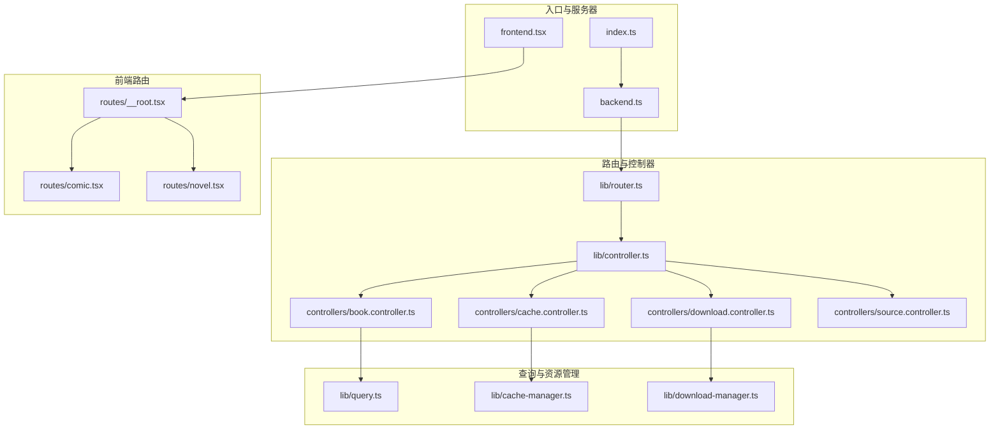
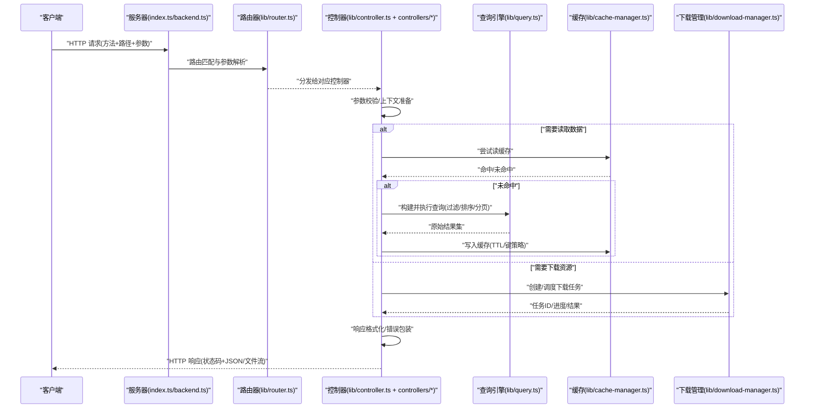
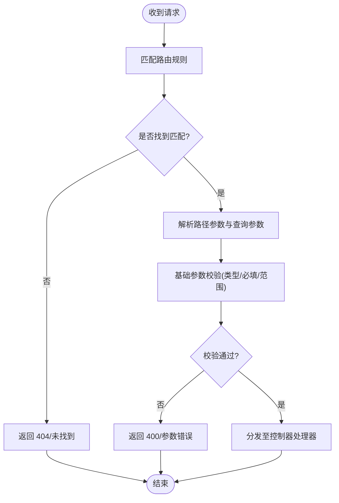
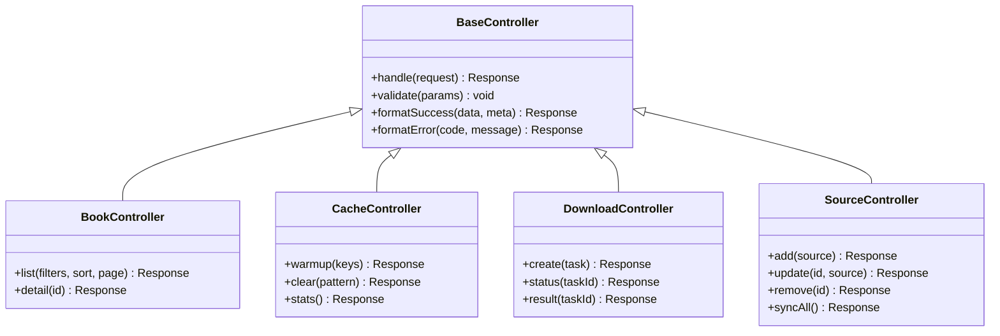
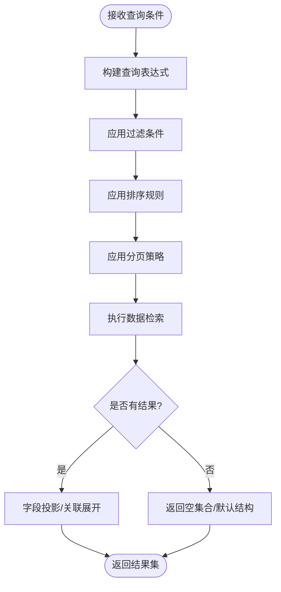
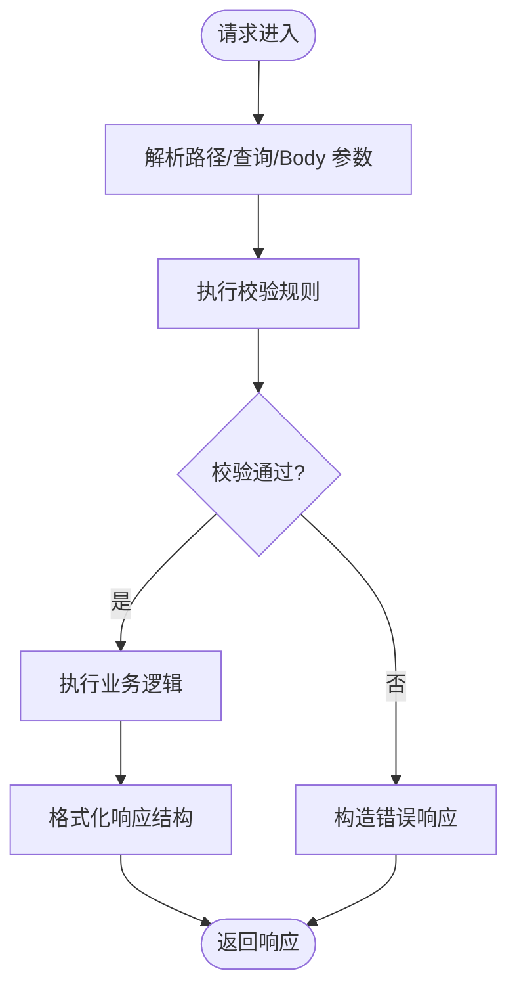
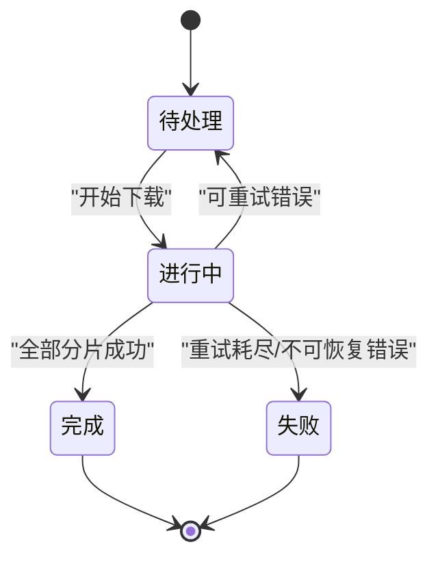
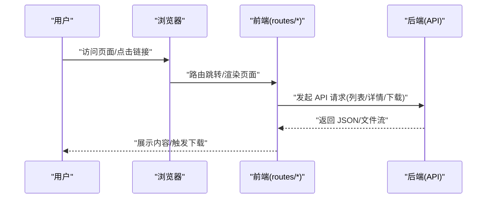
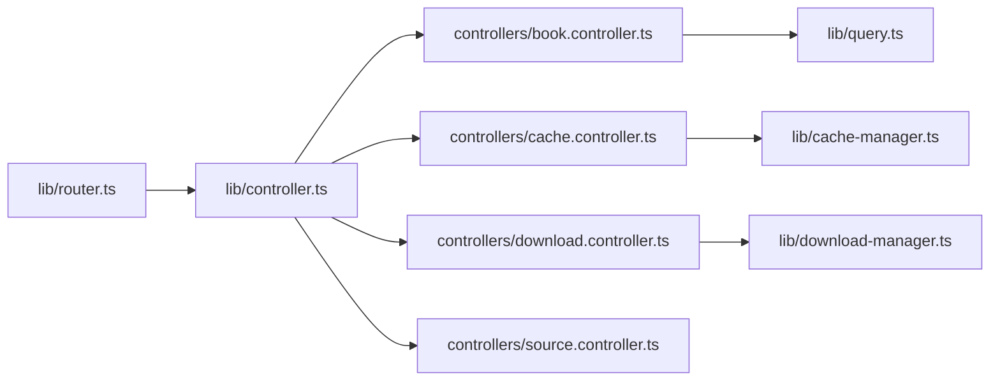

# 请求数据流

<cite>
**本文引用的文件**   
- [index.ts](file://index.ts)
- [backend.ts](file://backend.ts)
- [frontend.tsx](file://frontend.tsx)
- [lib/router.ts](file://lib/router.ts)
- [lib/controller.ts](file://lib/controller.ts)
- [controllers/book.controller.ts](file://controllers/book.controller.ts)
- [controllers/cache.controller.ts](file://controllers/cache.controller.ts)
- [controllers/download.controller.ts](file://controllers/download.controller.ts)
- [controllers/source.controller.ts](file://controllers/source.controller.ts)
- [lib/query.ts](file://lib/query.ts)
- [lib/cache-manager.ts](file://lib/cache-manager.ts)
- [lib/download-manager.ts](file://lib/download-manager.ts)
- [routes/__root.tsx](file://routes/__root.tsx)
- [routes/comic.tsx](file://routes/comic.tsx)
- [routes/novel.tsx](file://routes/novel.tsx)
</cite>

## 目录
1. [简介](#简介)
2. [项目结构](#项目结构)
3. [核心组件](#核心组件)
4. [架构总览](#架构总览)
5. [详细组件分析](#详细组件分析)
6. [依赖关系分析](#依赖关系分析)
7. [性能考虑](#性能考虑)
8. [故障排查指南](#故障排查指南)
9. [结论](#结论)
10. [附录](#附录)

## 简介
本文件聚焦于 Bun-zlib 项目的“请求数据流”，从 HTTP 请求进入系统到返回响应的完整链路进行说明，覆盖路由分发、控制器层的数据处理与业务逻辑调用、查询引擎的检索与过滤排序、请求验证与参数解析、以及响应格式化。文档同时提供时序图与状态转换图，帮助读者快速理解关键流程与边界情况。

## 项目结构
本项目采用前后端同构/混合模式：后端通过入口脚本启动服务并注册路由与控制器；前端页面位于 routes 目录，部分页面可能直接消费后端接口或与服务端渲染协同工作。核心请求处理路径集中在 index.ts、backend.ts、lib/router.ts、lib/controller.ts 与各控制器中。

图表来源
- [index.ts:1-200](file://index.ts#L1-L200)
- [backend.ts:1-200](file://backend.ts#L1-L200)
- [lib/router.ts:1-200](file://lib/router.ts#L1-L200)
- [lib/controller.ts:1-200](file://lib/controller.ts#L1-L200)
- [controllers/book.controller.ts:1-200](file://controllers/book.controller.ts#L1-L200)
- [controllers/cache.controller.ts:1-200](file://controllers/cache.controller.ts#L1-L200)
- [controllers/download.controller.ts:1-200](file://controllers/download.controller.ts#L1-L200)
- [controllers/source.controller.ts:1-200](file://controllers/source.controller.ts#L1-L200)
- [lib/query.ts:1-200](file://lib/query.ts#L1-L200)
- [lib/cache-manager.ts:1-200](file://lib/cache-manager.ts#L1-L200)
- [lib/download-manager.ts:1-200](file://lib/download-manager.ts#L1-L200)
- [routes/__root.tsx:1-200](file://routes/__root.tsx#L1-L200)
- [routes/comic.tsx:1-200](file://routes/comic.tsx#L1-L200)
- [routes/novel.tsx:1-200](file://routes/novel.tsx#L1-L200)

章节来源
- [index.ts:1-200](file://index.ts#L1-L200)
- [backend.ts:1-200](file://backend.ts#L1-L200)
- [lib/router.ts:1-200](file://lib/router.ts#L1-L200)
- [lib/controller.ts:1-200](file://lib/controller.ts#L1-L200)

## 核心组件
- 入口与服务器
  - index.ts：负责初始化应用、挂载中间件、启动服务监听端口等。
  - backend.ts：封装服务端能力（如静态资源、API 前缀、错误处理等）。
  - frontend.tsx：前端入口，可能与 SSR 或客户端路由协同。
- 路由与控制器
  - lib/router.ts：定义路由表、匹配策略、参数提取与转发。
  - lib/controller.ts：控制器基类，统一参数校验、上下文注入、响应包装与错误处理。
  - controllers/*：具体业务控制器，实现领域逻辑与数据访问。
- 查询与资源管理
  - lib/query.ts：查询构建器/执行器，支持过滤、排序、分页等。
  - lib/cache-manager.ts：缓存读写、失效策略、TTL 控制。
  - lib/download-manager.ts：下载任务编排、并发控制、进度与结果聚合。
- 前端路由
  - routes/*：页面级路由与视图渲染，可能发起 API 请求或直接使用服务端渲染。

章节来源
- [index.ts:1-200](file://index.ts#L1-L200)
- [backend.ts:1-200](file://backend.ts#L1-L200)
- [frontend.tsx:1-200](file://frontend.tsx#L1-L200)
- [lib/router.ts:1-200](file://lib/router.ts#L1-L200)
- [lib/controller.ts:1-200](file://lib/controller.ts#L1-L200)
- [lib/query.ts:1-200](file://lib/query.ts#L1-L200)
- [lib/cache-manager.ts:1-200](file://lib/cache-manager.ts#L1-L200)
- [lib/download-manager.ts:1-200](file://lib/download-manager.ts#L1-L200)
- [routes/__root.tsx:1-200](file://routes/__root.tsx#L1-L200)
- [routes/comic.tsx:1-200](file://routes/comic.tsx#L1-L200)
- [routes/novel.tsx:1-200](file://routes/novel.tsx#L1-L200)

## 架构总览
下图展示一次典型 API 请求从进入服务器到返回响应的端到端流程，包括路由分发、控制器处理、查询引擎与缓存/下载管理的协作。

图表来源
- [index.ts:1-200](file://index.ts#L1-L200)
- [backend.ts:1-200](file://backend.ts#L1-L200)
- [lib/router.ts:1-200](file://lib/router.ts#L1-L200)
- [lib/controller.ts:1-200](file://lib/controller.ts#L1-L200)
- [lib/query.ts:1-200](file://lib/query.ts#L1-L200)
- [lib/cache-manager.ts:1-200](file://lib/cache-manager.ts#L1-L200)
- [lib/download-manager.ts:1-200](file://lib/download-manager.ts#L1-L200)

## 详细组件分析

### 路由分发机制
- 路由表注册：在路由模块中集中声明路径模板、HTTP 方法与处理器映射。
- 匹配策略：按精确优先、动态段捕获、通配符兜底等规则匹配请求路径。
- 参数提取：从 URL 路径段与查询字符串中提取参数，并进行类型转换与基础校验。
- 转发机制：将解析后的上下文（含请求体、头信息、已解析参数）传递给控制器。

图表来源
- [lib/router.ts:1-200](file://lib/router.ts#L1-L200)

章节来源
- [lib/router.ts:1-200](file://lib/router.ts#L1-L200)

### 控制器层数据处理与业务逻辑
- 控制器基类职责：
  - 统一的参数校验与错误包装。
  - 上下文对象注入（请求、响应、日志、配置等）。
  - 响应格式标准化（成功/失败结构、分页元数据、错误码）。
- 具体控制器职责：
  - book.controller.ts：图书相关查询、详情获取、列表筛选。
  - cache.controller.ts：缓存操作（预热、清理、统计）。
  - download.controller.ts：下载任务创建、状态查询、结果获取。
  - source.controller.ts：源管理（添加、更新、删除、同步）。

图表来源
- [lib/controller.ts:1-200](file://lib/controller.ts#L1-L200)
- [controllers/book.controller.ts:1-200](file://controllers/book.controller.ts#L1-L200)
- [controllers/cache.controller.ts:1-200](file://controllers/cache.controller.ts#L1-L200)
- [controllers/download.controller.ts:1-200](file://controllers/download.controller.ts#L1-L200)
- [controllers/source.controller.ts:1-200](file://controllers/source.controller.ts#L1-L200)

章节来源
- [lib/controller.ts:1-200](file://lib/controller.ts#L1-L200)
- [controllers/book.controller.ts:1-200](file://controllers/book.controller.ts#L1-L200)
- [controllers/cache.controller.ts:1-200](file://controllers/cache.controller.ts#L1-L200)
- [controllers/download.controller.ts:1-200](file://controllers/download.controller.ts#L1-L200)
- [controllers/source.controller.ts:1-200](file://controllers/source.controller.ts#L1-L200)

### 查询引擎的数据检索与过滤排序
- 查询构建：根据控制器传入的 filters、sort、page 等条件生成查询表达式。
- 过滤逻辑：支持字段存在性、范围、包含/排除、模糊匹配等组合条件。
- 排序逻辑：多字段排序、方向控制、默认排序回退。
- 分页逻辑：偏移量/游标分页、总数统计、页大小限制。
- 结果组装：按需投影字段、关联展开、空值处理。

图表来源
- [lib/query.ts:1-200](file://lib/query.ts#L1-L200)

章节来源
- [lib/query.ts:1-200](file://lib/query.ts#L1-L200)

### 请求验证、参数解析与响应格式化
- 参数解析：
  - 路径参数：从 URL 片段提取并按类型转换。
  - 查询参数：字符串转数字/布尔/枚举，支持数组与嵌套结构。
  - 请求体：JSON 反序列化与结构校验。
- 验证策略：
  - 必填校验、类型校验、范围/长度/正则校验。
  - 自定义校验钩子（如业务唯一性检查）。
- 响应格式化：
  - 成功响应：统一数据结构，包含 data、meta（分页/时间戳）、traceId。
  - 错误响应：统一错误码、消息、堆栈（开发环境）、建议修复提示。
  - 文件流：设置正确的 Content-Type、Content-Disposition、断点续传头。

图表来源
- [lib/controller.ts:1-200](file://lib/controller.ts#L1-L200)

章节来源
- [lib/controller.ts:1-200](file://lib/controller.ts#L1-L200)

### 缓存与下载管理集成
- 缓存管理器：
  - 键策略：基于资源标识与查询条件生成稳定键。
  - TTL 与失效：按资源变更事件主动失效或被动过期。
  - 命中率优化：合并相似查询、预取热点数据。
- 下载管理器：
  - 任务模型：任务 ID、状态机（排队/进行中/完成/失败）、重试策略。
  - 并发控制：限流、队列、超时与取消。
  - 结果聚合：分片合并、完整性校验、回调通知。

图表来源
- [lib/cache-manager.ts:1-200](file://lib/cache-manager.ts#L1-L200)
- [lib/download-manager.ts:1-200](file://lib/download-manager.ts#L1-L200)

章节来源
- [lib/cache-manager.ts:1-200](file://lib/cache-manager.ts#L1-L200)
- [lib/download-manager.ts:1-200](file://lib/download-manager.ts#L1-L200)

### 前端路由与页面交互
- __root.tsx：根布局与全局错误边界、加载态、导航守卫。
- comic.tsx / novel.tsx：内容阅读器页面，可能通过 API 拉取数据或与服务端渲染配合。
- 与后端协作：前端发起 API 请求时遵循统一的参数结构与错误处理约定。

图表来源
- [routes/__root.tsx:1-200](file://routes/__root.tsx#L1-L200)
- [routes/comic.tsx:1-200](file://routes/comic.tsx#L1-L200)
- [routes/novel.tsx:1-200](file://routes/novel.tsx#L1-L200)

章节来源
- [routes/__root.tsx:1-200](file://routes/__root.tsx#L1-L200)
- [routes/comic.tsx:1-200](file://routes/comic.tsx#L1-L200)
- [routes/novel.tsx:1-200](file://routes/novel.tsx#L1-L200)

## 依赖关系分析
- 低耦合高内聚：控制器仅依赖查询、缓存与下载管理器提供的抽象接口，便于替换实现与单元测试。
- 路由与控制器解耦：路由只负责匹配与分发，不承载业务逻辑。
- 外部依赖：
  - 网络 I/O：HTTP 服务器、下载目标站点。
  - 存储：本地文件系统或对象存储用于缓存与下载产物。
  - 数据库/索引：由查询引擎对接底层数据源。

图表来源
- [lib/router.ts:1-200](file://lib/router.ts#L1-L200)
- [lib/controller.ts:1-200](file://lib/controller.ts#L1-L200)
- [controllers/book.controller.ts:1-200](file://controllers/book.controller.ts#L1-L200)
- [controllers/cache.controller.ts:1-200](file://controllers/cache.controller.ts#L1-L200)
- [controllers/download.controller.ts:1-200](file://controllers/download.controller.ts#L1-L200)
- [controllers/source.controller.ts:1-200](file://controllers/source.controller.ts#L1-L200)
- [lib/query.ts:1-200](file://lib/query.ts#L1-L200)
- [lib/cache-manager.ts:1-200](file://lib/cache-manager.ts#L1-L200)
- [lib/download-manager.ts:1-200](file://lib/download-manager.ts#L1-L200)

章节来源
- [lib/router.ts:1-200](file://lib/router.ts#L1-L200)
- [lib/controller.ts:1-200](file://lib/controller.ts#L1-L200)
- [controllers/book.controller.ts:1-200](file://controllers/book.controller.ts#L1-L200)
- [controllers/cache.controller.ts:1-200](file://controllers/cache.controller.ts#L1-L200)
- [controllers/download.controller.ts:1-200](file://controllers/download.controller.ts#L1-L200)
- [controllers/source.controller.ts:1-200](file://controllers/source.controller.ts#L1-L200)
- [lib/query.ts:1-200](file://lib/query.ts#L1-L200)
- [lib/cache-manager.ts:1-200](file://lib/cache-manager.ts#L1-L200)
- [lib/download-manager.ts:1-200](file://lib/download-manager.ts#L1-L200)

## 性能考虑
- 查询优化
  - 合理使用索引字段，避免全表扫描。
  - 分页采用游标分页减少深翻页开销。
  - 对高频查询启用缓存，合理设置 TTL 与失效策略。
- 并发与限流
  - 下载任务并发度受限于目标站点与本地带宽，需配置上限与退避策略。
  - 对热点接口增加令牌桶/漏桶限流，防止雪崩。
- 内存与 I/O
  - 大文件下载采用流式处理，避免一次性加载到内存。
  - 缓存键设计避免过长与重复，降低序列化与查找成本。
- 监控与可观测性
  - 记录关键指标：QPS、延迟分布、缓存命中率、下载成功率。
  - 结构化日志与 traceId 贯穿请求链路，便于定位问题。

[本节为通用指导，无需特定文件引用]

## 故障排查指南
- 常见问题
  - 404 未找到：检查路由表是否注册、路径模板是否正确、是否存在大小写差异。
  - 400 参数错误：核对参数类型转换与校验规则，确认必填项是否缺失。
  - 500 内部错误：查看控制器与查询引擎的错误日志，关注异常堆栈与输入快照。
  - 下载失败：检查网络连通性、目标站点可用性、重试次数与超时配置。
- 诊断步骤
  - 开启调试日志，记录请求入参、路由匹配结果、控制器处理耗时。
  - 使用 traceId 追踪跨组件调用链，定位瓶颈与异常点。
  - 针对缓存问题，检查键冲突、TTL 过期与一致性策略。
  - 针对下载问题，观察任务状态机流转与失败原因分类。

章节来源
- [lib/controller.ts:1-200](file://lib/controller.ts#L1-L200)
- [lib/query.ts:1-200](file://lib/query.ts#L1-L200)
- [lib/cache-manager.ts:1-200](file://lib/cache-manager.ts#L1-L200)
- [lib/download-manager.ts:1-200](file://lib/download-manager.ts#L1-L200)

## 结论
本文件梳理了 Bun-zlib 项目中从 HTTP 请求进入到响应返回的完整数据流，明确了路由分发、控制器处理、查询引擎与缓存/下载管理的职责边界与协作方式。通过时序图与状态图直观展示了关键流程与状态变化，并结合性能与排障建议，帮助读者在实际开发与运维中高效定位与优化问题。

## 附录
- 术语
  - 路由分发：根据请求路径与方法选择对应处理器的过程。
  - 控制器：承载业务逻辑、协调数据访问与响应格式化的组件。
  - 查询引擎：负责构建与执行数据检索、过滤、排序与分页的工具。
  - 缓存管理器：提供缓存读写、失效与统计能力的组件。
  - 下载管理器：编排下载任务、控制并发与处理结果的组件。

[本节为概念性补充，无需特定文件引用]