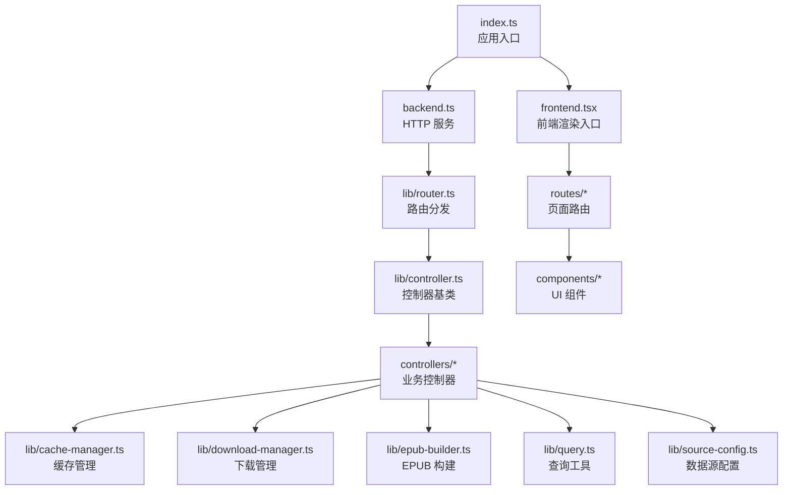
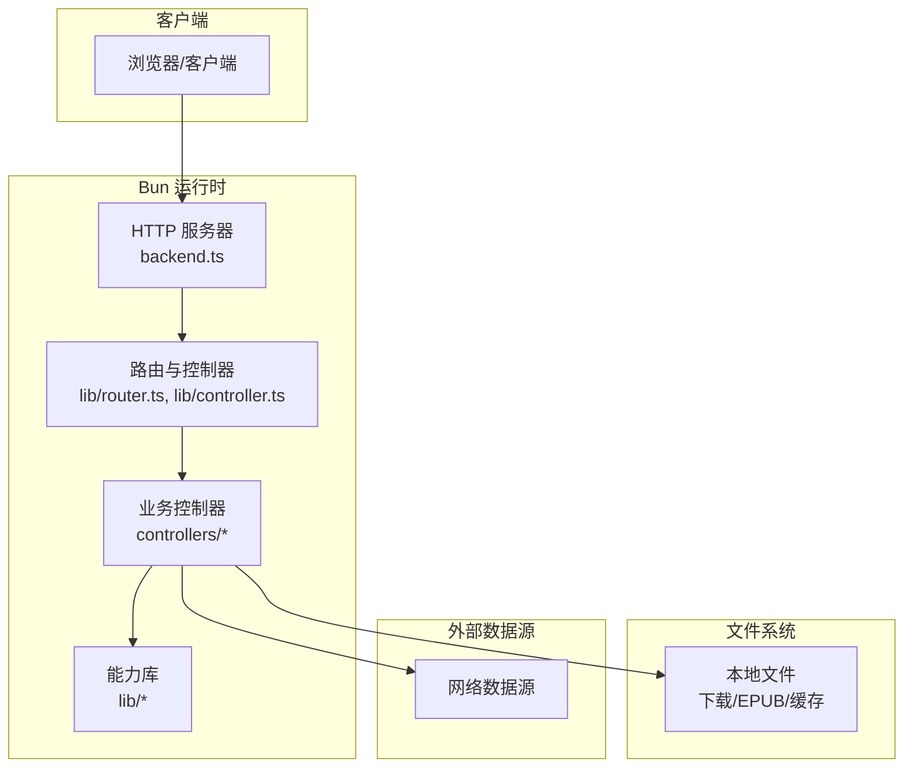
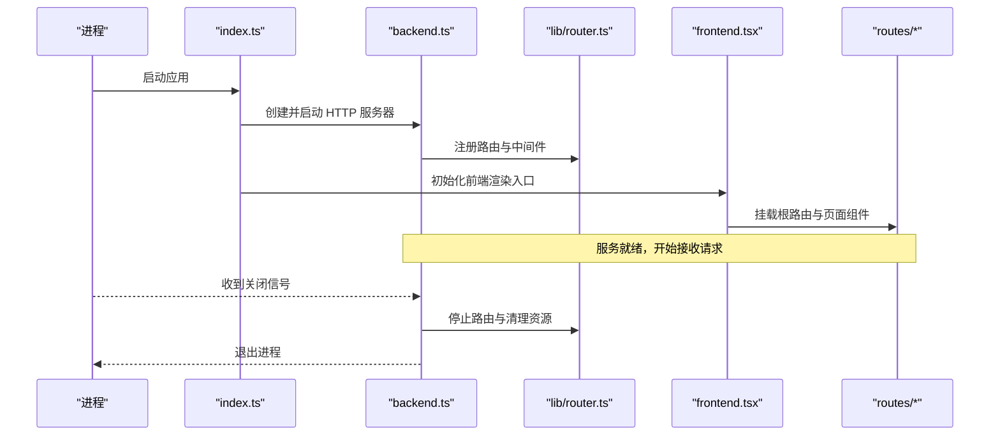
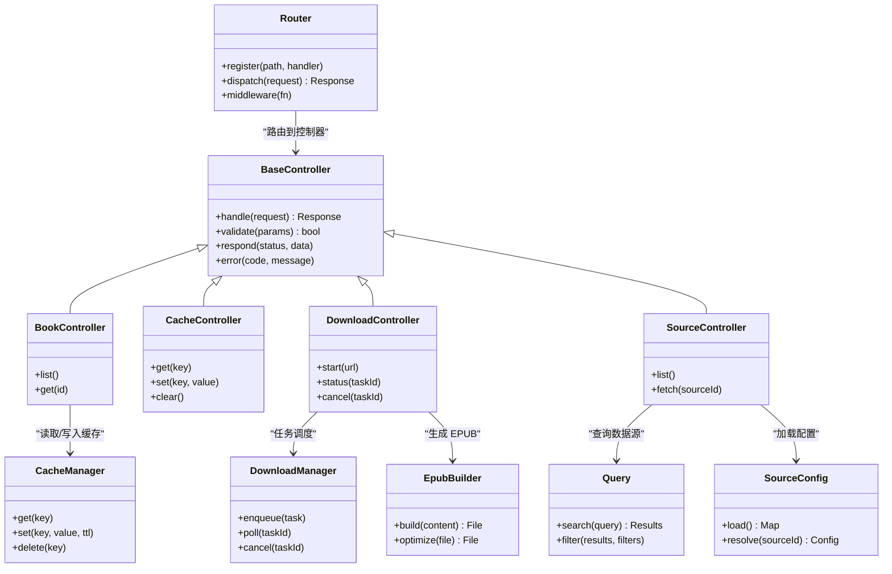
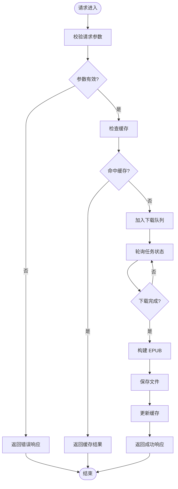
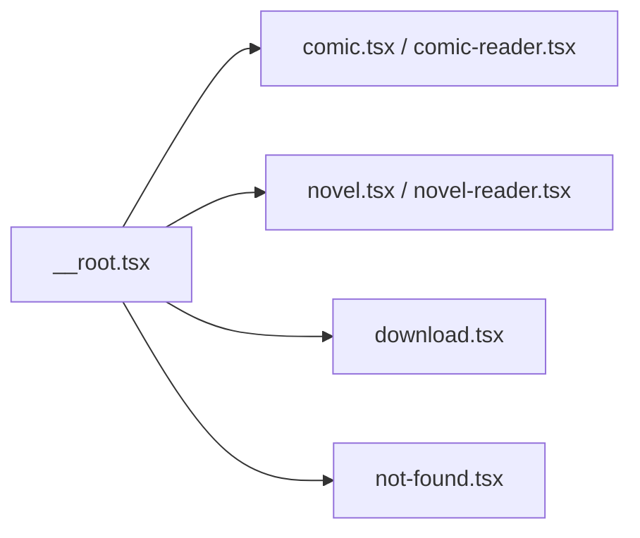
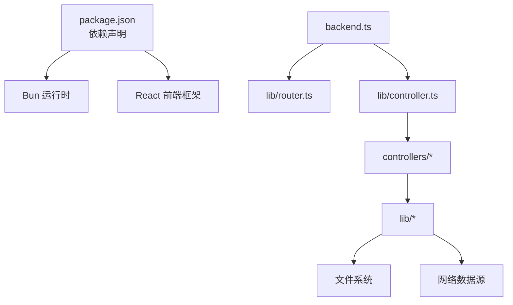
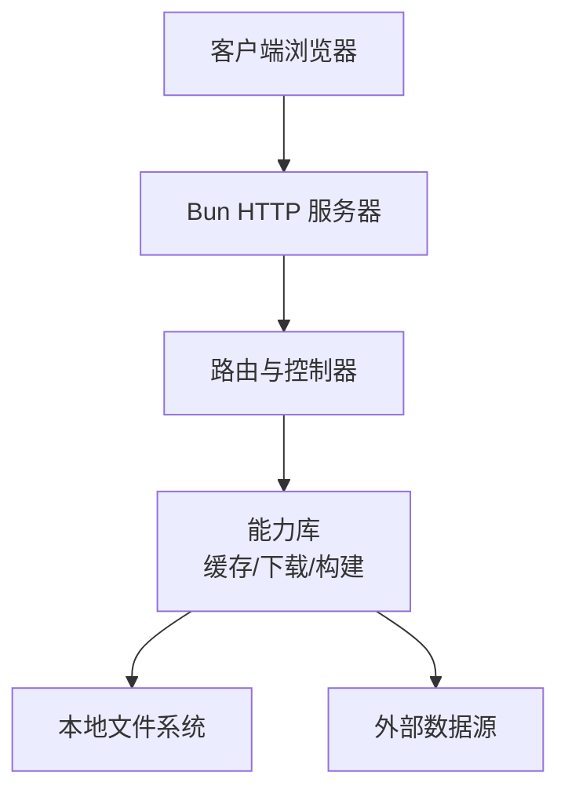

# 整体架构

<cite>
**本文引用的文件**   
- [package.json](file://package.json)
- [index.ts](file://index.ts)
- [backend.ts](file://backend.ts)
- [frontend.tsx](file://frontend.tsx)
- [routes/__root.tsx](file://routes/__root.tsx)
- [lib/router.ts](file://lib/router.ts)
- [lib/controller.ts](file://lib/controller.ts)
- [controllers/book.controller.ts](file://controllers/book.controller.ts)
- [controllers/cache.controller.ts](file://controllers/cache.controller.ts)
- [controllers/download.controller.ts](file://controllers/download.controller.ts)
- [controllers/source.controller.ts](file://controllers/source.controller.ts)
- [lib/cache-manager.ts](file://lib/cache-manager.ts)
- [lib/download-manager.ts](file://lib/download-manager.ts)
- [lib/epub-builder.ts](file://lib/epub-builder.ts)
- [lib/query.ts](file://lib/query.ts)
- [lib/source-config.ts](file://lib/source-config.ts)
- [routes/comic-reader.tsx](file://routes/comic-reader.tsx)
- [routes/comic.tsx](file://routes/comic.tsx)
- [routes/download.tsx](file://routes/download.tsx)
- [routes/novel-reader.tsx](file://routes/novel-reader.tsx)
- [routes/novel.tsx](file://routes/novel.tsx)
- [components/not-found.tsx](file://components/not-found.tsx)
- [index.html](file://index.html)
- [index.css](file://index.css)
</cite>

## 目录
1. [简介](#简介)
2. [项目结构](#项目结构)
3. [核心组件](#核心组件)
4. [架构总览](#架构总览)
5. [详细组件分析](#详细组件分析)
6. [依赖关系分析](#依赖关系分析)
7. [性能考量](#性能考量)
8. [故障排查指南](#故障排查指南)
9. [结论](#结论)
10. [附录](#附录)

## 简介
本文件为 Bun-zlib 项目的整体架构文档，面向技术与非技术读者，系统阐述前后端分离架构、Bun 运行时环境的使用、应用启动流程、模块加载机制与生命周期管理。同时解释技术栈选择的原因（为何选择 Bun 而非 Node.js，React 在前端的角色），并提供系统上下文图、部署拓扑与基础设施需求说明。

## 项目结构
项目采用“前端路由 + 后端控制器”的分层组织方式：
- 入口与运行时配置：index.ts、package.json、index.html、index.css
- 后端服务：backend.ts、lib/*（路由器、控制器基类、缓存与下载管理器、构建器、查询与源配置）
- 控制器：controllers/*（按业务域划分）
- 前端页面与路由：routes/*（根路由与各功能页）、components/*（通用组件）

图表来源
- [index.ts:1-200](file://index.ts#L1-L200)
- [backend.ts:1-200](file://backend.ts#L1-L200)
- [frontend.tsx:1-200](file://frontend.tsx#L1-L200)
- [lib/router.ts:1-200](file://lib/router.ts#L1-L200)
- [lib/controller.ts:1-200](file://lib/controller.ts#L1-L200)
- [controllers/book.controller.ts:1-200](file://controllers/book.controller.ts#L1-L200)
- [controllers/cache.controller.ts:1-200](file://controllers/cache.controller.ts#L1-L200)
- [controllers/download.controller.ts:1-200](file://controllers/download.controller.ts#L1-L200)
- [controllers/source.controller.ts:1-200](file://controllers/source.controller.ts#L1-L200)
- [lib/cache-manager.ts:1-200](file://lib/cache-manager.ts#L1-L200)
- [lib/download-manager.ts:1-200](file://lib/download-manager.ts#L1-L200)
- [lib/epub-builder.ts:1-200](file://lib/epub-builder.ts#L1-L200)
- [lib/query.ts:1-200](file://lib/query.ts#L1-L200)
- [lib/source-config.ts:1-200](file://lib/source-config.ts#L1-L200)
- [routes/__root.tsx:1-200](file://routes/__root.tsx#L1-L200)
- [routes/comic-reader.tsx:1-200](file://routes/comic-reader.tsx#L1-L200)
- [routes/comic.tsx:1-200](file://routes/comic.tsx#L1-L200)
- [routes/download.tsx:1-200](file://routes/download.tsx#L1-L200)
- [routes/novel-reader.tsx:1-200](file://routes/novel-reader.tsx#L1-L200)
- [routes/novel.tsx:1-200](file://routes/novel.tsx#L1-L200)
- [components/not-found.tsx:1-200](file://components/not-found.tsx#L1-L200)

章节来源
- [package.json:1-200](file://package.json#L1-L200)
- [index.ts:1-200](file://index.ts#L1-L200)
- [backend.ts:1-200](file://backend.ts#L1-L200)
- [frontend.tsx:1-200](file://frontend.tsx#L1-L200)

## 核心组件
- 应用入口 index.ts：负责初始化 Bun HTTP 服务器、挂载后端路由、提供静态资源与前端页面入口，并处理进程生命周期事件。
- 后端服务 backend.ts：封装 HTTP 服务启动、请求解析、错误处理与中间件扩展点。
- 路由与控制器 lib/router.ts、lib/controller.ts：统一路由注册与控制器基类，实现参数校验、响应封装与错误传播。
- 业务控制器 controllers/*：按领域拆分（书籍、缓存、下载、数据源），对外暴露 RESTful 接口。
- 能力库 lib/*：缓存管理、下载管理、EPUB 构建、查询工具、数据源配置等可复用能力。
- 前端 routes/* 与 components/*：基于 React 的页面与组件，负责用户交互与数据展示。

章节来源
- [index.ts:1-200](file://index.ts#L1-L200)
- [backend.ts:1-200](file://backend.ts#L1-L200)
- [lib/router.ts:1-200](file://lib/router.ts#L1-L200)
- [lib/controller.ts:1-200](file://lib/controller.ts#L1-L200)
- [controllers/book.controller.ts:1-200](file://controllers/book.controller.ts#L1-L200)
- [controllers/cache.controller.ts:1-200](file://controllers/cache.controller.ts#L1-L200)
- [controllers/download.controller.ts:1-200](file://controllers/download.controller.ts#L1-L200)
- [controllers/source.controller.ts:1-200](file://controllers/source.controller.ts#L1-L200)
- [lib/cache-manager.ts:1-200](file://lib/cache-manager.ts#L1-L200)
- [lib/download-manager.ts:1-200](file://lib/download-manager.ts#L1-L200)
- [lib/epub-builder.ts:1-200](file://lib/epub-builder.ts#L1-L200)
- [lib/query.ts:1-200](file://lib/query.ts#L1-L200)
- [lib/source-config.ts:1-200](file://lib/source-config.ts#L1-L200)
- [routes/__root.tsx:1-200](file://routes/__root.tsx#L1-L200)
- [routes/comic-reader.tsx:1-200](file://routes/comic-reader.tsx#L1-L200)
- [routes/comic.tsx:1-200](file://routes/comic.tsx#L1-L200)
- [routes/download.tsx:1-200](file://routes/download.tsx#L1-L200)
- [routes/novel-reader.tsx:1-200](file://routes/novel-reader.tsx#L1-L200)
- [routes/novel.tsx:1-200](file://routes/novel.tsx#L1-L200)
- [components/not-found.tsx:1-200](file://components/not-found.tsx#L1-L200)

## 架构总览
系统采用前后端分离架构：
- 前端：React 页面与组件通过浏览器访问，调用后端 API 获取数据与执行任务。
- 后端：Bun 提供的 HTTP 服务器承载 REST 接口，内部通过路由与控制器分派到具体业务逻辑。
- 文件系统：下载与 EPUB 构建过程读写本地文件；缓存层可能使用内存或持久化存储。
- 外部数据源：通过数据源配置与查询工具访问远程内容。

图表来源
- [backend.ts:1-200](file://backend.ts#L1-L200)
- [lib/router.ts:1-200](file://lib/router.ts#L1-L200)
- [lib/controller.ts:1-200](file://lib/controller.ts#L1-L200)
- [controllers/book.controller.ts:1-200](file://controllers/book.controller.ts#L1-L200)
- [controllers/cache.controller.ts:1-200](file://controllers/cache.controller.ts#L1-L200)
- [controllers/download.controller.ts:1-200](file://controllers/download.controller.ts#L1-L200)
- [controllers/source.controller.ts:1-200](file://controllers/source.controller.ts#L1-L200)
- [lib/cache-manager.ts:1-200](file://lib/cache-manager.ts#L1-L200)
- [lib/download-manager.ts:1-200](file://lib/download-manager.ts#L1-L200)
- [lib/epub-builder.ts:1-200](file://lib/epub-builder.ts#L1-L200)
- [lib/query.ts:1-200](file://lib/query.ts#L1-L200)
- [lib/source-config.ts:1-200](file://lib/source-config.ts#L1-L200)

## 详细组件分析

### 应用启动流程与生命周期
- 入口 index.ts 启动 Bun HTTP 服务器，注册路由与静态资源，监听端口。
- backend.ts 初始化服务实例，注入全局配置与中间件，处理未捕获异常与优雅关闭。
- 前端 frontend.tsx 作为 React 渲染入口，挂载根路由 __root.tsx，按需加载页面组件。
- 生命周期：进程启动 -> 服务就绪 -> 请求处理 -> 信号处理（SIGTERM/SIGINT）-> 资源释放。

图表来源
- [index.ts:1-200](file://index.ts#L1-L200)
- [backend.ts:1-200](file://backend.ts#L1-L200)
- [lib/router.ts:1-200](file://lib/router.ts#L1-L200)
- [frontend.tsx:1-200](file://frontend.tsx#L1-L200)
- [routes/__root.tsx:1-200](file://routes/__root.tsx#L1-L200)

章节来源
- [index.ts:1-200](file://index.ts#L1-L200)
- [backend.ts:1-200](file://backend.ts#L1-L200)
- [frontend.tsx:1-200](file://frontend.tsx#L1-L200)
- [routes/__root.tsx:1-200](file://routes/__root.tsx#L1-L200)

### 模块加载机制与分层职责
- 路由层 lib/router.ts：集中定义 URL 模式与处理器映射，支持路径参数与查询参数。
- 控制器基类 lib/controller.ts：统一请求解析、响应格式、错误码与日志记录。
- 业务控制器 controllers/*：实现具体领域逻辑，调用能力库完成下载、缓存、构建等操作。
- 能力库 lib/*：解耦业务与底层实现，便于测试与复用。

图表来源
- [lib/router.ts:1-200](file://lib/router.ts#L1-L200)
- [lib/controller.ts:1-200](file://lib/controller.ts#L1-L200)
- [controllers/book.controller.ts:1-200](file://controllers/book.controller.ts#L1-L200)
- [controllers/cache.controller.ts:1-200](file://controllers/cache.controller.ts#L1-L200)
- [controllers/download.controller.ts:1-200](file://controllers/download.controller.ts#L1-L200)
- [controllers/source.controller.ts:1-200](file://controllers/source.controller.ts#L1-L200)
- [lib/cache-manager.ts:1-200](file://lib/cache-manager.ts#L1-L200)
- [lib/download-manager.ts:1-200](file://lib/download-manager.ts#L1-L200)
- [lib/epub-builder.ts:1-200](file://lib/epub-builder.ts#L1-L200)
- [lib/query.ts:1-200](file://lib/query.ts#L1-L200)
- [lib/source-config.ts:1-200](file://lib/source-config.ts#L1-L200)

章节来源
- [lib/router.ts:1-200](file://lib/router.ts#L1-L200)
- [lib/controller.ts:1-200](file://lib/controller.ts#L1-L200)
- [controllers/book.controller.ts:1-200](file://controllers/book.controller.ts#L1-L200)
- [controllers/cache.controller.ts:1-200](file://controllers/cache.controller.ts#L1-L200)
- [controllers/download.controller.ts:1-200](file://controllers/download.controller.ts#L1-L200)
- [controllers/source.controller.ts:1-200](file://controllers/source.controller.ts#L1-L200)
- [lib/cache-manager.ts:1-200](file://lib/cache-manager.ts#L1-L200)
- [lib/download-manager.ts:1-200](file://lib/download-manager.ts#L1-L200)
- [lib/epub-builder.ts:1-200](file://lib/epub-builder.ts#L1-L200)
- [lib/query.ts:1-200](file://lib/query.ts#L1-L200)
- [lib/source-config.ts:1-200](file://lib/source-config.ts#L1-L200)

### 关键业务流程：下载与 EPUB 构建

图表来源
- [controllers/download.controller.ts:1-200](file://controllers/download.controller.ts#L1-L200)
- [lib/download-manager.ts:1-200](file://lib/download-manager.ts#L1-L200)
- [lib/epub-builder.ts:1-200](file://lib/epub-builder.ts#L1-L200)
- [lib/cache-manager.ts:1-200](file://lib/cache-manager.ts#L1-L200)

章节来源
- [controllers/download.controller.ts:1-200](file://controllers/download.controller.ts#L1-L200)
- [lib/download-manager.ts:1-200](file://lib/download-manager.ts#L1-L200)
- [lib/epub-builder.ts:1-200](file://lib/epub-builder.ts#L1-L200)
- [lib/cache-manager.ts:1-200](file://lib/cache-manager.ts#L1-L200)

### 前端路由与页面
- 根路由 routes/__root.tsx 定义布局与全局状态。
- 各功能页 routes/* 对应不同业务场景（漫画、小说、下载）。
- 组件 components/* 提供通用 UI 元素（如 404 页面）。

图表来源
- [routes/__root.tsx:1-200](file://routes/__root.tsx#L1-L200)
- [routes/comic.tsx:1-200](file://routes/comic.tsx#L1-L200)
- [routes/comic-reader.tsx:1-200](file://routes/comic-reader.tsx#L1-L200)
- [routes/novel.tsx:1-200](file://routes/novel.tsx#L1-L200)
- [routes/novel-reader.tsx:1-200](file://routes/novel-reader.tsx#L1-L200)
- [routes/download.tsx:1-200](file://routes/download.tsx#L1-L200)
- [components/not-found.tsx:1-200](file://components/not-found.tsx#L1-L200)

章节来源
- [routes/__root.tsx:1-200](file://routes/__root.tsx#L1-L200)
- [routes/comic.tsx:1-200](file://routes/comic.tsx#L1-L200)
- [routes/comic-reader.tsx:1-200](file://routes/comic-reader.tsx#L1-L200)
- [routes/novel.tsx:1-200](file://routes/novel.tsx#L1-L200)
- [routes/novel-reader.tsx:1-200](file://routes/novel-reader.tsx#L1-L200)
- [routes/download.tsx:1-200](file://routes/download.tsx#L1-L200)
- [components/not-found.tsx:1-200](file://components/not-found.tsx#L1-L200)

## 依赖关系分析
- 运行时依赖：Bun 提供高性能 HTTP 服务器、原生模块与打包能力。
- 前端依赖：React 用于构建用户界面，配合路由与组件体系实现单页应用。
- 内部依赖：控制器依赖能力库，能力库之间低耦合，通过接口契约协作。
- 外部依赖：数据源与文件系统，需考虑网络稳定性与磁盘空间。

图表来源
- [package.json:1-200](file://package.json#L1-L200)
- [backend.ts:1-200](file://backend.ts#L1-L200)
- [lib/router.ts:1-200](file://lib/router.ts#L1-L200)
- [lib/controller.ts:1-200](file://lib/controller.ts#L1-L200)
- [controllers/book.controller.ts:1-200](file://controllers/book.controller.ts#L1-L200)
- [controllers/cache.controller.ts:1-200](file://controllers/cache.controller.ts#L1-L200)
- [controllers/download.controller.ts:1-200](file://controllers/download.controller.ts#L1-L200)
- [controllers/source.controller.ts:1-200](file://controllers/source.controller.ts#L1-L200)
- [lib/cache-manager.ts:1-200](file://lib/cache-manager.ts#L1-L200)
- [lib/download-manager.ts:1-200](file://lib/download-manager.ts#L1-L200)
- [lib/epub-builder.ts:1-200](file://lib/epub-builder.ts#L1-L200)
- [lib/query.ts:1-200](file://lib/query.ts#L1-L200)
- [lib/source-config.ts:1-200](file://lib/source-config.ts#L1-L200)

章节来源
- [package.json:1-200](file://package.json#L1-L200)
- [backend.ts:1-200](file://backend.ts#L1-L200)
- [lib/router.ts:1-200](file://lib/router.ts#L1-L200)
- [lib/controller.ts:1-200](file://lib/controller.ts#L1-L200)

## 性能考量
- 选择 Bun 的原因：
  - 更快的启动时间与更低的内存占用，适合轻量级服务与高并发场景。
  - 原生支持的 TypeScript/JSX 编译与打包，减少构建链路复杂度。
  - 内置 HTTP 服务器与 I/O 优化，提升网络请求吞吐。
- 对比 Node.js：
  - Node.js 生态成熟但启动较慢、V8 默认配置偏保守；Bun 在冷启动与内存方面更具优势。
  - 对于本项目以 I/O 密集为主（下载、文件读写、网络请求），Bun 的原生优化能带来明显收益。
- 前端 React：
  - 组件化与虚拟 DOM 提升交互体验，适合动态内容展示（漫画/小说阅读器）。
  - 与 Bun 的前端渲染入口结合，可实现同构或快速原型开发。

[本节为通用指导，不直接分析具体文件]

## 故障排查指南
- 常见错误分类：
  - 路由未匹配：检查 lib/router.ts 的路由注册与路径参数。
  - 控制器异常：查看 lib/controller.ts 的错误封装与日志输出。
  - 下载失败：确认 lib/download-manager.ts 的任务状态与重试策略。
  - EPUB 构建失败：检查 lib/epub-builder.ts 的输入内容与模板。
  - 缓存问题：验证 lib/cache-manager.ts 的键空间与 TTL 设置。
  - 数据源不可用：核对 lib/source-config.ts 的配置与 lib/query.ts 的查询逻辑。
- 调试建议：
  - 启用详细日志与请求追踪。
  - 对关键路径添加断点与指标收集。
  - 使用健康检查端点监控服务状态。

章节来源
- [lib/router.ts:1-200](file://lib/router.ts#L1-L200)
- [lib/controller.ts:1-200](file://lib/controller.ts#L1-L200)
- [controllers/download.controller.ts:1-200](file://controllers/download.controller.ts#L1-L200)
- [lib/download-manager.ts:1-200](file://lib/download-manager.ts#L1-L200)
- [lib/epub-builder.ts:1-200](file://lib/epub-builder.ts#L1-L200)
- [lib/cache-manager.ts:1-200](file://lib/cache-manager.ts#L1-L200)
- [lib/source-config.ts:1-200](file://lib/source-config.ts#L1-L200)
- [lib/query.ts:1-200](file://lib/query.ts#L1-L200)

## 结论
Bun-zlib 采用前后端分离架构，依托 Bun 的高性能运行时与 React 的前端能力，构建了可扩展、易维护的内容处理与服务系统。通过清晰的分层与模块化设计，系统在启动流程、模块加载与生命周期管理方面具备良好可控性。部署时需注意文件系统权限、缓存容量与外部数据源的可用性。

[本节为总结性内容，不直接分析具体文件]

## 附录

### 技术栈选择原因
- Bun vs Node.js：
  - 启动速度、内存占用与 I/O 性能优势明显。
  - 原生支持 TS/JSX，简化构建与部署。
- React 的角色：
  - 提供组件化 UI 与状态管理能力，适配阅读与下载等多场景交互。

[本节为概念性说明，不直接分析具体文件]

### 系统上下文图（客户端、服务器、文件系统交互）

图表来源
- [backend.ts:1-200](file://backend.ts#L1-L200)
- [lib/router.ts:1-200](file://lib/router.ts#L1-L200)
- [lib/cache-manager.ts:1-200](file://lib/cache-manager.ts#L1-L200)
- [lib/download-manager.ts:1-200](file://lib/download-manager.ts#L1-L200)
- [lib/epub-builder.ts:1-200](file://lib/epub-builder.ts#L1-L200)

### 部署拓扑与基础设施需求
- 运行环境：
  - 操作系统：Linux/Windows/macOS（推荐 Linux 生产环境）
  - 运行时：Bun（最新稳定版）
  - 依赖：Node 包管理器兼容（bun.lock）
- 硬件建议：
  - CPU：多核以提升并发处理能力
  - 内存：根据并发与缓存策略配置（建议 2GB+）
  - 磁盘：足够空间用于下载与 EPUB 构建（SSD 更佳）
- 网络与安全：
  - 开放必要端口（HTTP/HTTPS）
  - 配置反向代理（Nginx/Caddy）与 TLS 终止
  - 限制外部数据源访问白名单
- 运维：
  - 进程守护（systemd/pm2）
  - 日志采集与监控告警
  - 定期备份与清理策略

[本节为通用指导，不直接分析具体文件]