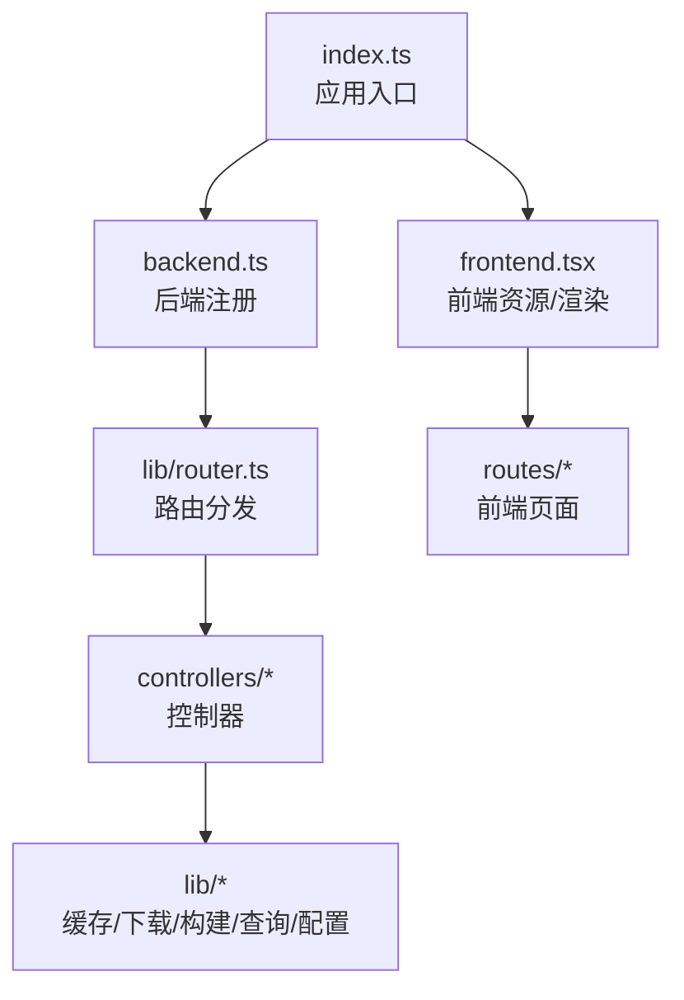
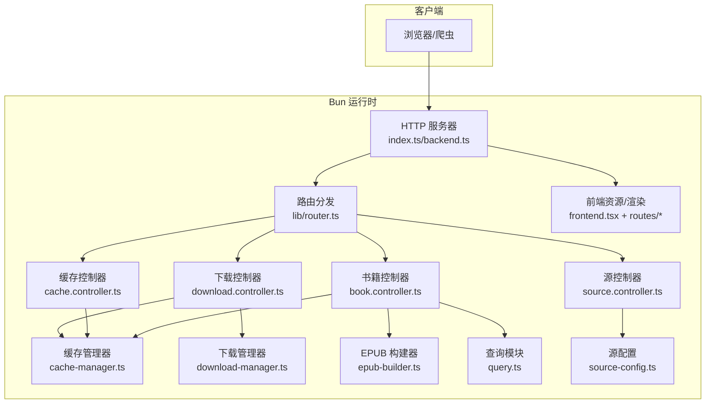
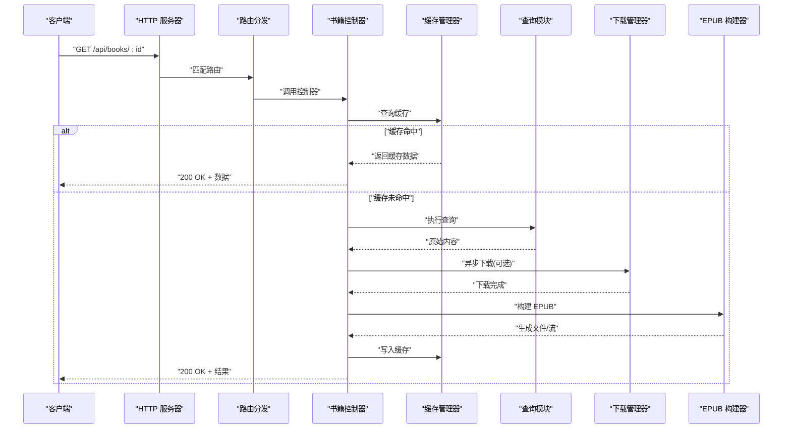
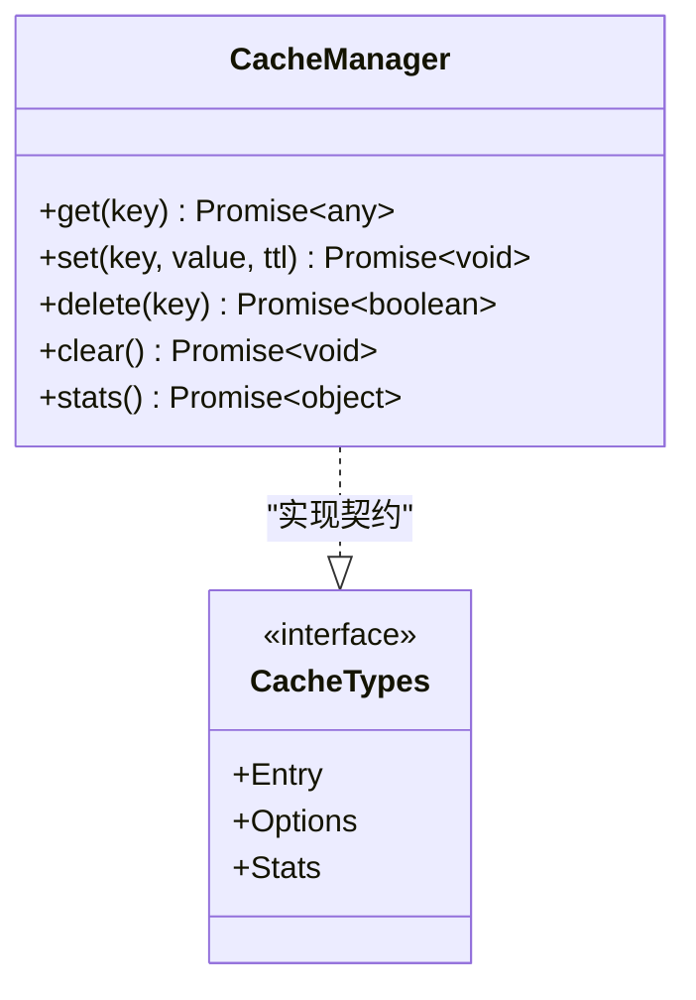
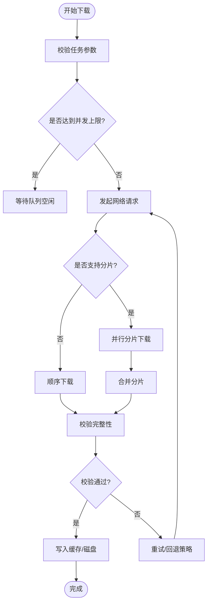
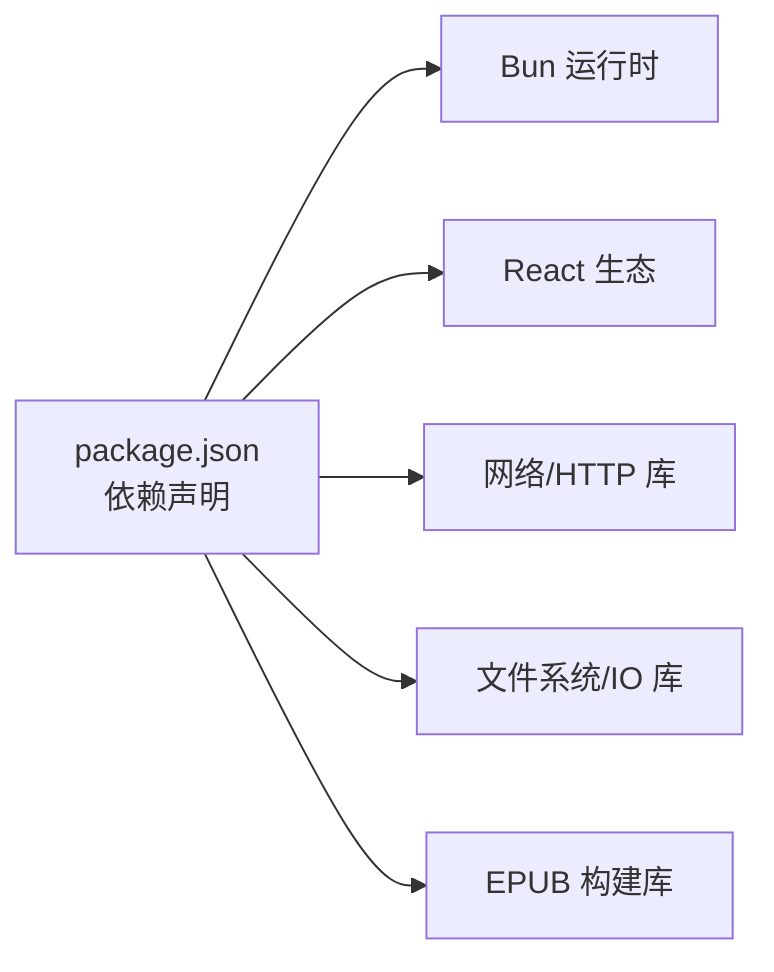
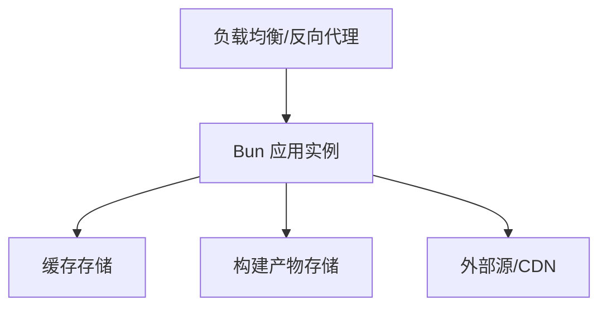

# 架构设计

<cite>
**本文引用的文件**   
- [package.json](file://package.json)
- [index.ts](file://index.ts)
- [backend.ts](file://backend.ts)
- [frontend.tsx](file://frontend.tsx)
- [lib/router.ts](file://lib/router.ts)
- [lib/controller.ts](file://lib/controller.ts)
- [controllers/book.controller.ts](file://controllers/book.controller.ts)
- [controllers/cache.controller.ts](file://controllers/cache.controller.ts)
- [controllers/download.controller.ts](file://controllers/download.controller.ts)
- [controllers/source.controller.ts](file://controllers/source.controller.ts)
- [lib/cache-manager.ts](file://lib/cache-manager.ts)
- [lib/cache-types.ts](file://lib/cache-types.ts)
- [lib/download-manager.ts](file://lib/download-manager.ts)
- [lib/download-types.ts](file://lib/download-types.ts)
- [lib/epub-builder.ts](file://lib/epub-builder.ts)
- [lib/query.ts](file://lib/query.ts)
- [lib/source-config.ts](file://lib/source-config.ts)
- [routes/__root.tsx](file://routes/__root.tsx)
- [routes/comic-reader.tsx](file://routes/comic-reader.tsx)
- [routes/comic.tsx](file://routes/comic.tsx)
- [routes/download.tsx](file://routes/download.tsx)
- [routes/novel-reader.tsx](file://routes/novel-reader.tsx)
- [routes/novel.tsx](file://routes/novel.tsx)
</cite>

## 目录
1. [简介](#简介)
2. [项目结构](#项目结构)
3. [核心组件](#核心组件)
4. [架构总览](#架构总览)
5. [详细组件分析](#详细组件分析)
6. [依赖关系分析](#依赖关系分析)
7. [性能考虑](#性能考虑)
8. [故障排查指南](#故障排查指南)
9. [结论](#结论)
10. [附录](#附录)

## 简介
本架构设计文档面向 Bun-zlib 项目，目标是描述系统的高层设计、架构模式与系统边界，阐明组件交互、数据流与集成方式，解释关键技术决策、权衡与约束，并给出基础设施需求、可扩展性考虑与部署拓扑。同时覆盖横切关注点（安全性、监控、灾难恢复），记录技术栈、第三方依赖与版本兼容性。

## 项目结构
Bun-zlib 采用前后端同构的轻量架构：前端基于 React 路由渲染页面，后端基于 Bun 提供 HTTP API；业务逻辑集中在 controllers 与 lib 目录中，通过统一的 router 进行请求分发。整体分层清晰：
- 入口层：index.ts 启动服务，backend.ts 注册后端路由，frontend.tsx 提供前端资源与渲染。
- 路由层：lib/router.ts 统一路由表与中间件挂载，routes/* 为前端页面路由。
- 控制器层：controllers/* 处理具体业务请求，调用 lib 中的管理器与构建器。
- 领域能力层：lib/* 包含缓存、下载、EPUB 构建、查询与源配置等通用能力。
- 类型定义：lib/*-types.ts 集中管理数据结构契约。

图表来源
- [index.ts](file://index.ts)
- [backend.ts](file://backend.ts)
- [frontend.tsx](file://frontend.tsx)
- [lib/router.ts](file://lib/router.ts)

章节来源
- [index.ts](file://index.ts)
- [backend.ts](file://backend.ts)
- [frontend.tsx](file://frontend.tsx)
- [lib/router.ts](file://lib/router.ts)

## 核心组件
- 应用入口与运行时
  - index.ts：负责初始化运行时、加载配置、启动 HTTP 服务与静态资源。
  - backend.ts：注册后端路由、挂载中间件、暴露 API。
  - frontend.tsx：提供前端页面与静态资源访问。
- 路由与控制器
  - lib/router.ts：集中式路由表与中间件装配，统一错误处理与日志。
  - controllers/*：按领域划分控制器，如书籍、缓存、下载、源管理等。
- 领域能力库
  - lib/cache-manager.ts / cache-types.ts：缓存策略、存储后端抽象与类型契约。
  - lib/download-manager.ts / download-types.ts：并发下载、断点续传、重试与队列。
  - lib/epub-builder.ts：将内容打包为 EPUB 格式。
  - lib/query.ts：查询编排与过滤。
  - lib/source-config.ts：外部源配置管理与校验。
- 前端路由
  - routes/*：漫画/小说阅读与下载页面，消费后端 API。

章节来源
- [index.ts](file://index.ts)
- [backend.ts](file://backend.ts)
- [frontend.tsx](file://frontend.tsx)
- [lib/router.ts](file://lib/router.ts)
- [controllers/book.controller.ts](file://controllers/book.controller.ts)
- [controllers/cache.controller.ts](file://controllers/cache.controller.ts)
- [controllers/download.controller.ts](file://controllers/download.controller.ts)
- [controllers/source.controller.ts](file://controllers/source.controller.ts)
- [lib/cache-manager.ts](file://lib/cache-manager.ts)
- [lib/cache-types.ts](file://lib/cache-types.ts)
- [lib/download-manager.ts](file://lib/download-manager.ts)
- [lib/download-types.ts](file://lib/download-types.ts)
- [lib/epub-builder.ts](file://lib/epub-builder.ts)
- [lib/query.ts](file://lib/query.ts)
- [lib/source-config.ts](file://lib/source-config.ts)
- [routes/__root.tsx](file://routes/__root.tsx)
- [routes/comic-reader.tsx](file://routes/comic-reader.tsx)
- [routes/comic.tsx](file://routes/comic.tsx)
- [routes/download.tsx](file://routes/download.tsx)
- [routes/novel-reader.tsx](file://routes/novel-reader.tsx)
- [routes/novel.tsx](file://routes/novel.tsx)

## 架构总览
系统采用“单进程多路复用”的轻量架构，由 Bun 驱动，前后端共享同一运行环境。HTTP 请求进入后，经路由分发到对应控制器，控制器协调缓存、下载、构建等能力完成业务处理，最终返回结构化响应或触发前端页面渲染。

图表来源
- [index.ts](file://index.ts)
- [backend.ts](file://backend.ts)
- [lib/router.ts](file://lib/router.ts)
- [controllers/book.controller.ts](file://controllers/book.controller.ts)
- [controllers/cache.controller.ts](file://controllers/cache.controller.ts)
- [controllers/download.controller.ts](file://controllers/download.controller.ts)
- [controllers/source.controller.ts](file://controllers/source.controller.ts)
- [lib/cache-manager.ts](file://lib/cache-manager.ts)
- [lib/download-manager.ts](file://lib/download-manager.ts)
- [lib/epub-builder.ts](file://lib/epub-builder.ts)
- [lib/query.ts](file://lib/query.ts)
- [lib/source-config.ts](file://lib/source-config.ts)
- [frontend.tsx](file://frontend.tsx)
- [routes/__root.tsx](file://routes/__root.tsx)

## 详细组件分析

### 控制器与领域能力协作
控制器作为请求处理的门面，遵循单一职责原则，仅编排领域能力。典型流程如下：
- 书籍相关：读取源配置 -> 查询 -> 命中缓存则直接返回 -> 未命中则发起下载 -> 构建 EPUB -> 写入缓存 -> 返回结果。
- 缓存相关：提供增删改查与统计接口，供其他控制器复用。
- 下载相关：维护任务队列、并发控制、失败重试与进度上报。
- 源相关：管理外部源的元数据、鉴权与限流策略。

图表来源
- [controllers/book.controller.ts](file://controllers/book.controller.ts)
- [lib/cache-manager.ts](file://lib/cache-manager.ts)
- [lib/query.ts](file://lib/query.ts)
- [lib/download-manager.ts](file://lib/download-manager.ts)
- [lib/epub-builder.ts](file://lib/epub-builder.ts)

章节来源
- [controllers/book.controller.ts](file://controllers/book.controller.ts)
- [controllers/cache.controller.ts](file://controllers/cache.controller.ts)
- [controllers/download.controller.ts](file://controllers/download.controller.ts)
- [controllers/source.controller.ts](file://controllers/source.controller.ts)
- [lib/cache-manager.ts](file://lib/cache-manager.ts)
- [lib/download-manager.ts](file://lib/download-manager.ts)
- [lib/epub-builder.ts](file://lib/epub-builder.ts)
- [lib/query.ts](file://lib/query.ts)

### 缓存子系统
缓存子系统提供统一的键值存取、过期策略与容量控制，支持内存与持久化后端切换。类型契约在 cache-types.ts 中定义，确保跨模块一致性。

图表来源
- [lib/cache-manager.ts](file://lib/cache-manager.ts)
- [lib/cache-types.ts](file://lib/cache-types.ts)

章节来源
- [lib/cache-manager.ts](file://lib/cache-manager.ts)
- [lib/cache-types.ts](file://lib/cache-types.ts)

### 下载子系统
下载子系统负责网络 I/O 的可靠性与吞吐优化，包括并发限制、超时重试、断点续传与进度回调。download-types.ts 定义了任务状态与事件模型。

图表来源
- [lib/download-manager.ts](file://lib/download-manager.ts)
- [lib/download-types.ts](file://lib/download-types.ts)

章节来源
- [lib/download-manager.ts](file://lib/download-manager.ts)
- [lib/download-types.ts](file://lib/download-types.ts)

### EPUB 构建器
EPUB 构建器将文本、图片与元数据组装为标准电子书格式，支持封面、目录与样式注入。该模块对输入数据进行规范化与去重，保证输出一致性与可复现性。

章节来源
- [lib/epub-builder.ts](file://lib/epub-builder.ts)

### 查询与源配置
- 查询模块：提供过滤、排序与分页能力，屏蔽底层数据源差异。
- 源配置：集中管理外部源的连接信息、鉴权令牌与速率限制，支持热更新与校验。

章节来源
- [lib/query.ts](file://lib/query.ts)
- [lib/source-config.ts](file://lib/source-config.ts)

### 前端路由与页面
前端使用 React 路由组织页面，包括漫画/小说阅读器与下载页。页面通过 API 与后端交互，展示阅读内容与下载进度。

章节来源
- [routes/__root.tsx](file://routes/__root.tsx)
- [routes/comic-reader.tsx](file://routes/comic-reader.tsx)
- [routes/comic.tsx](file://routes/comic.tsx)
- [routes/novel-reader.tsx](file://routes/novel-reader.tsx)
- [routes/novel.tsx](file://routes/novel.tsx)
- [routes/download.tsx](file://routes/download.tsx)

## 依赖关系分析
- 运行时与框架
  - 基于 Bun 运行时，利用其高性能 HTTP 与原生模块优势。
  - 前端使用 React 与路由库，配合 Vite/Bun 工具链进行开发体验优化。
- 内部模块耦合
  - 控制器依赖 lib 中的管理器与构建器，形成“薄控制器+厚领域”的结构。
  - 缓存与下载模块被多个控制器复用，体现高内聚低耦合。
- 外部依赖
  - 网络请求、文件系统与压缩库用于下载与构建。
  - 类型系统与测试框架提升质量与可维护性。

图表来源
- [package.json](file://package.json)

章节来源
- [package.json](file://package.json)

## 性能考虑
- 并发与背压
  - 下载管理器应设置合理的并发度与队列长度，避免内存峰值过高。
  - 大文件下载建议启用分片与断点续传，降低失败成本。
- 缓存策略
  - 热点数据优先驻留内存，冷数据落盘；合理设置 TTL 与淘汰策略。
  - 针对重复请求进行去抖与合并，减少冗余计算。
- I/O 优化
  - 使用流式处理与零拷贝路径，减少序列化开销。
  - 批量写入与缓冲合并，降低磁盘抖动。
- 构建阶段
  - EPUB 构建时按需生成资源，避免全量重建。
  - 增量构建与缓存指纹，提高二次构建速度。

[本节为通用指导，不直接分析具体文件]

## 故障排查指南
- 常见问题定位
  - 网络异常：检查下载管理器的重试与超时配置，确认目标源可达性与限速策略。
  - 缓存不一致：核对键空间与 TTL，验证写入与读取路径的一致性。
  - 构建失败：检查输入数据的完整性与编码，确认依赖库版本兼容。
- 日志与指标
  - 关键路径埋点：请求耗时、缓存命中率、下载成功率与构建时长。
  - 告警阈值：错误率、延迟 P95/P99、内存与 CPU 使用率。
- 恢复策略
  - 自动重试与降级：在网络抖动时回退到本地缓存或只读模式。
  - 数据一致性：构建前进行校验和比对，失败时清理半成品。

章节来源
- [lib/download-manager.ts](file://lib/download-manager.ts)
- [lib/cache-manager.ts](file://lib/cache-manager.ts)
- [lib/epub-builder.ts](file://lib/epub-builder.ts)

## 结论
Bun-zlib 以轻量、高性能为目标，采用清晰的层次化设计与模块化拆分，控制器聚焦编排，领域能力集中于 lib 层，便于扩展与维护。通过缓存与下载子系统的协同，系统在稳定性与吞吐之间取得平衡。后续可在监控、安全与弹性方面进一步增强，以满足更复杂的部署场景。

[本节为总结性内容，不直接分析具体文件]

## 附录

### 技术栈与版本兼容性
- 运行时：Bun（HTTP、文件系统、原生模块）
- 前端：React、路由库、构建工具
- 网络与 IO：HTTP 客户端、文件系统、压缩库
- 构建：EPUB 生成库
- 类型与测试：TypeScript、测试框架

章节来源
- [package.json](file://package.json)

### 基础设施需求
- 容器化：推荐 Docker 镜像，固定 Bun 与 Node 版本。
- 存储：本地磁盘或对象存储用于缓存与构建产物。
- 网络：出站访问外部源，必要时配置代理与白名单。
- 监控：接入日志与指标采集，配置告警规则。

[本节为通用指导，不直接分析具体文件]

### 部署拓扑

[本节为概念图，不映射具体源码文件]