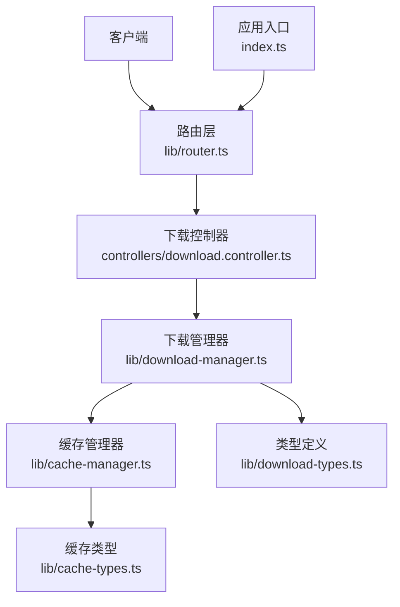
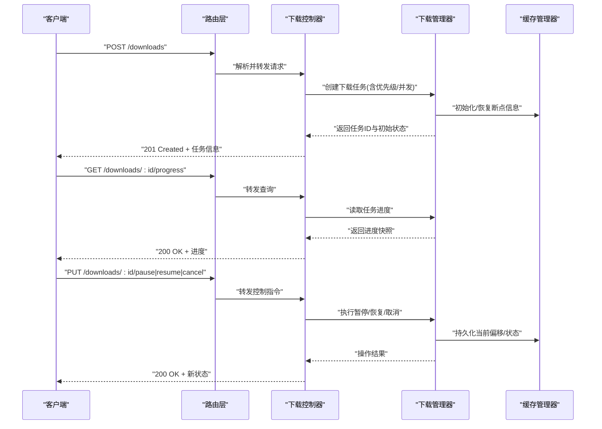
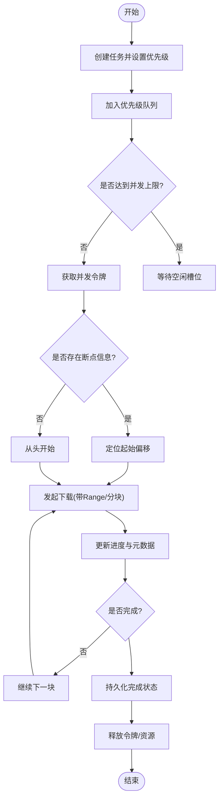
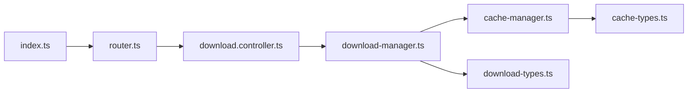

# 下载控制器

<cite>
**本文引用的文件**   
- [download.controller.ts](file://controllers/download.controller.ts)
- [download-manager.ts](file://lib/download-manager.ts)
- [download-types.ts](file://lib/download-types.ts)
- [cache-manager.ts](file://lib/cache-manager.ts)
- [cache-types.ts](file://lib/cache-types.ts)
- [router.ts](file://lib/router.ts)
- [controller.ts](file://lib/controller.ts)
- [index.ts](file://index.ts)
</cite>

## 目录
1. [简介](#简介)
2. [项目结构](#项目结构)
3. [核心组件](#核心组件)
4. [架构总览](#架构总览)
5. [详细组件分析](#详细组件分析)
6. [依赖关系分析](#依赖关系分析)
7. [性能考虑](#性能考虑)
8. [故障排查指南](#故障排查指南)
9. [结论](#结论)
10. [附录](#附录)

## 简介
本文件面向 Bun-zlib 项目的“下载控制器”，聚焦于下载任务管理的 API 端点与实现机制，覆盖以下主题：
- 任务创建、进度查询、暂停/恢复、取消等接口
- 批量下载、并发控制与断点续传的实现思路
- 下载队列管理、优先级调度与资源限制策略
- 状态监控、错误重试与异常处理
- 大文件处理与内存优化最佳实践

## 项目结构
围绕下载功能的关键代码位于 controllers 与 lib 两个目录中：
- controllers/download.controller.ts：对外暴露的 HTTP 路由处理器（下载相关）
- lib/download-manager.ts：下载任务编排、并发控制、队列与状态管理
- lib/download-types.ts：下载相关的类型定义
- lib/cache-manager.ts / cache-types.ts：缓存与断点续传支持
- lib/router.ts：路由注册与中间件装配
- lib/controller.ts：通用控制器基类或工具
- index.ts：应用启动入口（可能包含路由挂载）

图表来源
- [router.ts](file://lib/router.ts)
- [download.controller.ts](file://controllers/download.controller.ts)
- [download-manager.ts](file://lib/download-manager.ts)
- [cache-manager.ts](file://lib/cache-manager.ts)
- [cache-types.ts](file://lib/cache-types.ts)
- [download-types.ts](file://lib/download-types.ts)
- [index.ts](file://index.ts)

章节来源
- [download.controller.ts](file://controllers/download.controller.ts)
- [download-manager.ts](file://lib/download-manager.ts)
- [download-types.ts](file://lib/download-types.ts)
- [cache-manager.ts](file://lib/cache-manager.ts)
- [cache-types.ts](file://lib/cache-types.ts)
- [router.ts](file://lib/router.ts)
- [controller.ts](file://lib/controller.ts)
- [index.ts](file://index.ts)

## 核心组件
- 下载控制器（HTTP 层）
  - 职责：接收请求、参数校验、调用下载管理器、返回统一响应格式。
  - 典型能力：创建任务、查询进度、暂停/恢复、取消、批量提交。
- 下载管理器（业务层）
  - 职责：维护任务集合、并发池、队列与优先级、断点续传、重试策略、状态广播。
- 缓存管理器（持久化层）
  - 职责：分片/块级写入、元数据持久化、断点信息存储与恢复。
- 类型系统
  - 职责：统一定义任务、进度、配置、错误码等数据结构，保证前后端一致。

章节来源
- [download.controller.ts](file://controllers/download.controller.ts)
- [download-manager.ts](file://lib/download-manager.ts)
- [cache-manager.ts](file://lib/cache-manager.ts)
- [download-types.ts](file://lib/download-types.ts)
- [cache-types.ts](file://lib/cache-types.ts)

## 架构总览
整体采用分层架构：HTTP 控制器负责协议适配，下载管理器负责核心编排，缓存管理器负责 IO 与断点信息。

图表来源
- [download.controller.ts](file://controllers/download.controller.ts)
- [download-manager.ts](file://lib/download-manager.ts)
- [cache-manager.ts](file://lib/cache-manager.ts)

## 详细组件分析

### 下载控制器（HTTP 层）
- 设计要点
  - 将外部请求映射为内部任务操作，保持幂等性与可观测性。
  - 对批量请求进行聚合与去重，避免重复创建相同任务。
  - 使用统一的响应包装，便于前端处理。
- 关键端点（概念说明）
  - 创建任务：支持单条与批量；可携带优先级、并发数、目标路径等。
  - 查询进度：按任务 ID 获取实时或最近一次快照。
  - 控制任务：暂停、恢复、取消；返回最新状态。
  - 列表与过滤：按状态、优先级、时间范围筛选。
- 错误处理
  - 参数校验失败返回明确错误码与字段提示。
  - 任务不存在或状态不合法时返回相应错误。
  - 网络/IO 异常转换为标准错误响应，并记录上下文。

章节来源
- [download.controller.ts](file://controllers/download.controller.ts)
- [controller.ts](file://lib/controller.ts)

### 下载管理器（业务层）
- 设计要点
  - 任务模型：唯一 ID、URL、优先级、状态机、进度、错误信息、重试计数等。
  - 并发控制：基于令牌桶或固定大小池，限制同时下载的并发度。
  - 队列与优先级：高优先级优先调度，同优先级 FIFO。
  - 断点续传：根据已下载字节数与分块策略恢复。
  - 重试策略：指数退避、最大重试次数、可配置抖动。
  - 状态广播：通过事件或轮询接口提供进度更新。
- 关键流程
  - 创建任务：入队、分配资源、触发首次下载。
  - 进度计算：累计成功块、合并元数据、计算百分比。
  - 暂停/恢复：冻结当前块、保存偏移、释放部分资源。
  - 取消：中断 I/O、清理临时文件、标记最终状态。
  - 失败重试：捕获异常、更新重试计数、重新入队。

图表来源
- [download-manager.ts](file://lib/download-manager.ts)
- [cache-manager.ts](file://lib/cache-manager.ts)

章节来源
- [download-manager.ts](file://lib/download-manager.ts)
- [download-types.ts](file://lib/download-types.ts)

### 缓存管理器（断点续传与 IO）
- 设计要点
  - 分块写入：按固定大小切分，降低内存占用。
  - 元数据持久化：保存每个块的偏移、哈希、状态。
  - 原子性：写前校验、写后校验，确保一致性。
  - 清理策略：失败任务清理碎片，避免磁盘膨胀。
- 与下载管理器的协作
  - 下载管理器在每次写入成功后回调缓存管理器更新元数据。
  - 恢复时由缓存管理器提供上次成功偏移，下载管理器据此续传。

章节来源
- [cache-manager.ts](file://lib/cache-manager.ts)
- [cache-types.ts](file://lib/cache-types.ts)

### 类型系统与契约
- 任务对象：包含 ID、URL、优先级、状态、进度、错误信息等。
- 进度对象：包含已完成字节、总量、速率、剩余时间估算等。
- 配置对象：包含并发上限、分块大小、超时、重试策略等。
- 错误对象：包含错误码、消息、可重试标志、上下文。

章节来源
- [download-types.ts](file://lib/download-types.ts)
- [cache-types.ts](file://lib/cache-types.ts)

## 依赖关系分析
- 控制器依赖下载管理器与类型系统。
- 下载管理器依赖缓存管理器与类型系统。
- 路由层将 HTTP 请求分发到控制器。
- 应用入口负责组装各模块并启动服务。

图表来源
- [index.ts](file://index.ts)
- [router.ts](file://lib/router.ts)
- [download.controller.ts](file://controllers/download.controller.ts)
- [download-manager.ts](file://lib/download-manager.ts)
- [cache-manager.ts](file://lib/cache-manager.ts)
- [download-types.ts](file://lib/download-types.ts)
- [cache-types.ts](file://lib/cache-types.ts)

章节来源
- [index.ts](file://index.ts)
- [router.ts](file://lib/router.ts)
- [download.controller.ts](file://controllers/download.controller.ts)
- [download-manager.ts](file://lib/download-manager.ts)
- [cache-manager.ts](file://lib/cache-manager.ts)
- [download-types.ts](file://lib/download-types.ts)
- [cache-types.ts](file://lib/cache-types.ts)

## 性能考虑
- 并发控制
  - 建议基于令牌桶或信号量实现，避免过多连接导致服务端拥塞。
  - 根据 CPU、I/O 与带宽动态调整并发上限。
- 分块与内存
  - 合理设置分块大小，平衡内存占用与网络开销。
  - 流式处理，避免一次性加载大文件到内存。
- 断点续传
  - 利用 Range 头或服务器支持的续传能力，减少重复传输。
  - 持久化元数据，确保进程重启后可恢复。
- 重试与退避
  - 指数退避加随机抖动，避免雪崩效应。
  - 区分可重试与不可重试错误，快速失败。
- 批处理
  - 批量创建任务时进行去重与合并，减少重复工作。
  - 分批提交，避免一次性压垮队列。

[本节为通用指导，无需源码引用]

## 故障排查指南
- 常见问题
  - 任务卡住：检查并发池是否耗尽、是否有死锁或阻塞 I/O。
  - 进度不更新：确认进度回调是否被触发、缓存元数据是否落盘。
  - 断点失效：核对偏移与文件大小是否一致、分块边界是否正确。
  - 频繁重试：观察错误类型是否为瞬时错误，调整退避策略。
- 诊断手段
  - 启用详细日志，记录任务生命周期关键节点。
  - 暴露健康检查与指标接口，监控队列长度、成功率、平均耗时。
  - 针对失败任务导出上下文与堆栈，辅助定位问题。

章节来源
- [download-manager.ts](file://lib/download-manager.ts)
- [cache-manager.ts](file://lib/cache-manager.ts)

## 结论
下载控制器以清晰的 HTTP 接口暴露下载管理能力，配合下载管理器与缓存管理器实现了高可用、可扩展的下载体系。通过并发控制、断点续传、重试与优先级调度，能够稳定支撑大批量与大文件的下载场景。结合完善的监控与排障手段，可在生产环境中获得良好的稳定性与性能表现。

[本节为总结，无需源码引用]

## 附录
- 术语
  - 任务：一次下载操作的抽象，包含源地址、目标位置、优先级与状态。
  - 进度：已完成字节、总量、速率与剩余时间估算。
  - 断点续传：从上次成功位置继续下载的能力。
  - 并发控制：限制同时进行的下载数量，保护系统资源。
- 参考
  - 类型定义与接口契约详见类型文件，便于前后端对齐。

[本节为补充说明，无需源码引用]