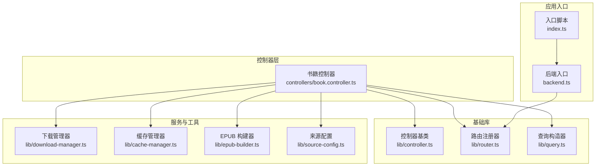
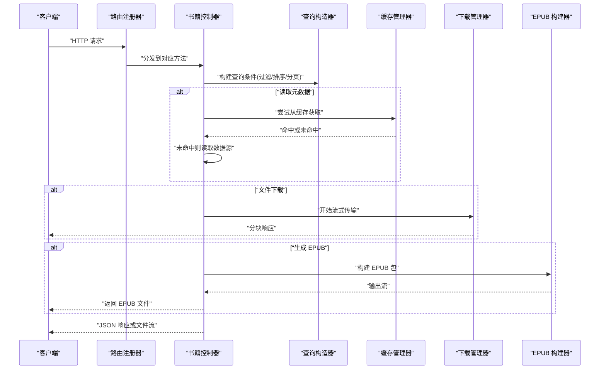
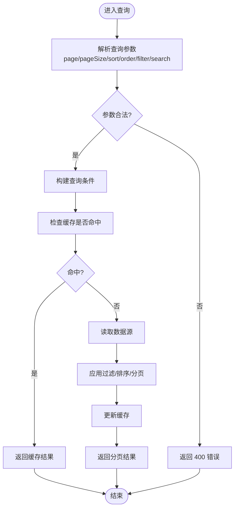
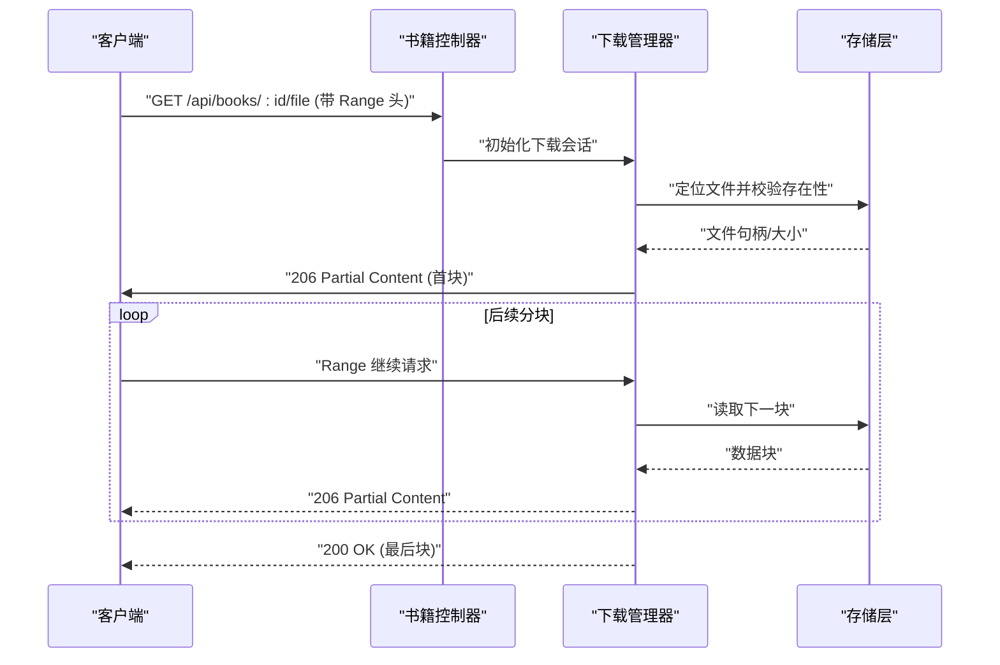
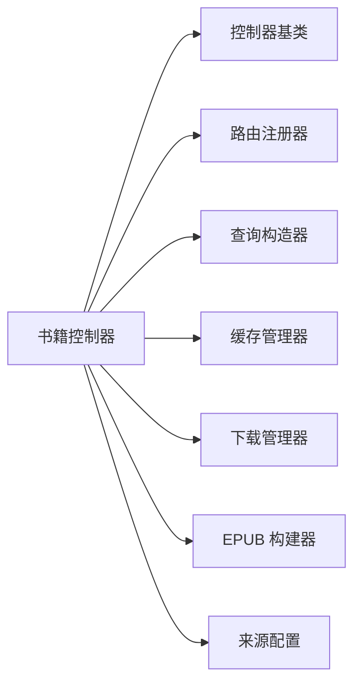

# 书籍控制器

<cite>
**本文引用的文件**   
- [book.controller.ts](file://controllers/book.controller.ts)
- [controller.ts](file://lib/controller.ts)
- [router.ts](file://lib/router.ts)
- [query.ts](file://lib/query.ts)
- [download-manager.ts](file://lib/download-manager.ts)
- [download-types.ts](file://lib/download-types.ts)
- [cache-manager.ts](file://lib/cache-manager.ts)
- [cache-types.ts](file://lib/cache-types.ts)
- [epub-builder.ts](file://lib/epub-builder.ts)
- [source-config.ts](file://lib/source-config.ts)
- [backend.ts](file://backend.ts)
- [index.ts](file://index.ts)
</cite>

## 目录
1. [简介](#简介)
2. [项目结构](#项目结构)
3. [核心组件](#核心组件)
4. [架构总览](#架构总览)
5. [详细组件分析](#详细组件分析)
6. [依赖分析](#依赖分析)
7. [性能考虑](#性能考虑)
8. [故障排查指南](#故障排查指南)
9. [结论](#结论)
10. [附录](#附录)

## 简介
本章节为 Bun-zlib 项目的“书籍控制器”提供系统化文档，聚焦于与书籍相关的 API 端点实现，包括图书的增删改查、元数据处理、文件上传下载、批量操作、搜索过滤与分页处理等。文档将解释 HTTP 方法的 URL 模式、请求参数、响应格式与错误码，并说明与数据源和服务层的交互方式，同时给出完整的请求/响应示例路径与关键流程图。

## 项目结构
本项目采用分层组织：控制器位于 controllers 目录，通用控制器基类与路由注册在 lib 目录中，业务相关工具（如下载管理、缓存、EPUB 构建）也集中在 lib 下。后端入口与前端入口分别由 index.ts 与 backend.ts 启动。

图表来源
- [book.controller.ts](file://controllers/book.controller.ts)
- [controller.ts](file://lib/controller.ts)
- [router.ts](file://lib/router.ts)
- [query.ts](file://lib/query.ts)
- [download-manager.ts](file://lib/download-manager.ts)
- [cache-manager.ts](file://lib/cache-manager.ts)
- [epub-builder.ts](file://lib/epub-builder.ts)
- [source-config.ts](file://lib/source-config.ts)
- [index.ts](file://index.ts)
- [backend.ts](file://backend.ts)

章节来源
- [book.controller.ts](file://controllers/book.controller.ts)
- [controller.ts](file://lib/controller.ts)
- [router.ts](file://lib/router.ts)
- [query.ts](file://lib/query.ts)
- [download-manager.ts](file://lib/download-manager.ts)
- [cache-manager.ts](file://lib/cache-manager.ts)
- [epub-builder.ts](file://lib/epub-builder.ts)
- [source-config.ts](file://lib/source-config.ts)
- [index.ts](file://index.ts)
- [backend.ts](file://backend.ts)

## 核心组件
- 书籍控制器：封装所有与书籍资源相关的 HTTP 接口，负责解析请求、调用服务层、返回统一响应。
- 控制器基类：提供统一的上下文对象、响应包装、错误处理与中间件支持。
- 路由注册器：集中注册控制器方法到具体 URL 模式，支持路径参数与查询参数。
- 查询构造器：用于构建复杂查询条件（过滤、排序、分页）。
- 下载管理器：处理大文件流式传输、断点续传、并发控制与进度回调。
- 缓存管理器：对热点书籍元数据或列表进行缓存，降低存储压力。
- EPUB 构建器：将书籍内容打包为 EPUB 格式供下载。
- 来源配置：定义外部来源（如本地目录、远程仓库）的配置与访问策略。

章节来源
- [book.controller.ts](file://controllers/book.controller.ts)
- [controller.ts](file://lib/controller.ts)
- [router.ts](file://lib/router.ts)
- [query.ts](file://lib/query.ts)
- [download-manager.ts](file://lib/download-manager.ts)
- [cache-manager.ts](file://lib/cache-manager.ts)
- [epub-builder.ts](file://lib/epub-builder.ts)
- [source-config.ts](file://lib/source-config.ts)

## 架构总览
书籍控制器通过路由注册器暴露 RESTful 接口，内部依赖查询构造器完成筛选与分页，使用下载管理器进行文件传输，借助缓存管理器提升读取性能，并通过 EPUB 构建器生成可下载的电子书包。

图表来源
- [router.ts](file://lib/router.ts)
- [book.controller.ts](file://controllers/book.controller.ts)
- [query.ts](file://lib/query.ts)
- [cache-manager.ts](file://lib/cache-manager.ts)
- [download-manager.ts](file://lib/download-manager.ts)
- [epub-builder.ts](file://lib/epub-builder.ts)

## 详细组件分析

### 书籍控制器 API 规范
以下列出书籍控制器提供的典型端点。每个条目包含 URL 模式、HTTP 方法、请求参数、响应格式与常见错误码。为避免泄露实现细节，本节仅描述接口契约与行为。

- 创建书籍
  - 方法/URL: POST /api/books
  - 请求体: JSON，包含书名、作者、描述、封面图片、标签、来源信息等字段；可选 multipart/form-data 上传封面文件。
  - 响应: 成功返回新创建的书籍对象（含 id、时间戳等），状态码 201；失败返回错误对象，状态码 400/422。
  - 错误码: 400 参数校验失败；422 业务校验失败（如重复标题）。

- 批量创建书籍
  - 方法/URL: POST /api/books/batch
  - 请求体: JSON 数组，每项为一个书籍对象；支持部分字段缺失时的默认值填充。
  - 响应: 返回创建结果集合（成功项与失败项明细），状态码 201；若全部失败返回 400。
  - 错误码: 400 批量输入非法；422 单条或多条校验失败。

- 查询书籍列表
  - 方法/URL: GET /api/books
  - 查询参数: page、pageSize、sort、order、filter（按标题、作者、标签、日期范围等）、search（全文检索关键字）。
  - 响应: 分页对象，包含 items 数组、total、page、pageSize；状态码 200。
  - 错误码: 400 参数非法（如 pageSize 越界）。

- 搜索书籍
  - 方法/URL: GET /api/books/search
  - 查询参数: q（关键字）、category、author、tag、dateFrom、dateTo、page、pageSize。
  - 响应: 搜索结果集（同列表分页结构）；状态码 200。
  - 错误码: 400 参数非法。

- 获取书籍详情
  - 方法/URL: GET /api/books/:id
  - 路径参数: id（书籍标识）。
  - 响应: 书籍完整元数据；状态码 200。
  - 错误码: 404 不存在。

- 更新书籍
  - 方法/URL: PUT /api/books/:id
  - 请求体: 需要更新的字段（增量更新）；可选 multipart/form-data 替换封面。
  - 响应: 返回更新后的书籍对象；状态码 200。
  - 错误码: 400 参数非法；404 不存在；422 业务冲突（如唯一性约束）。

- 删除书籍
  - 方法/URL: DELETE /api/books/:id
  - 路径参数: id。
  - 响应: 空体或确认信息；状态码 204 或 200。
  - 错误码: 404 不存在。

- 批量删除书籍
  - 方法/URL: DELETE /api/books/batch
  - 请求体: JSON 数组，包含要删除的书籍 id 列表。
  - 响应: 返回删除结果（成功与失败明细）；状态码 200。
  - 错误码: 400 参数非法；404 部分不存在。

- 上传封面
  - 方法/URL: POST /api/books/:id/cover
  - 路径参数: id。
  - 请求体: multipart/form-data，字段名通常为 cover，类型为图片。
  - 响应: 返回封面 URL 或缩略图信息；状态码 200。
  - 错误码: 400 文件类型不支持；413 文件过大；422 校验失败。

- 下载封面
  - 方法/URL: GET /api/books/:id/cover
  - 路径参数: id。
  - 响应: 图片二进制流；状态码 200。
  - 错误码: 404 无封面。

- 下载书籍文件
  - 方法/URL: GET /api/books/:id/file
  - 路径参数: id。
  - 响应: 书籍文件二进制流（支持 Range 头断点续传）；状态码 200/206。
  - 错误码: 404 文件不存在；416 范围无效。

- 生成并下载 EPUB
  - 方法/URL: GET /api/books/:id/epub
  - 路径参数: id。
  - 响应: EPUB 文件二进制流；状态码 200。
  - 错误码: 404 书籍不存在；500 构建失败。

- 元数据导出
  - 方法/URL: GET /api/books/:id/metadata/export
  - 路径参数: id。
  - 响应: JSON 格式的元数据快照；状态码 200。
  - 错误码: 404 不存在。

- 元数据导入
  - 方法/URL: POST /api/books/:id/metadata/import
  - 路径参数: id。
  - 请求体: JSON 元数据；支持覆盖或合并策略。
  - 响应: 返回更新后的元数据；状态码 200。
  - 错误码: 400 格式错误；422 语义校验失败。

- 批量操作
  - 方法/URL: POST /api/books/batch/update
  - 请求体: { ids, updates }，对多个书籍执行增量更新。
  - 响应: 批量更新结果；状态码 200。
  - 错误码: 400 参数非法；422 部分更新失败。

- 批量操作（移动/复制）
  - 方法/URL: POST /api/books/batch/move
  - 请求体: { ids, targetSource }，将书籍移动到指定来源。
  - 响应: 批量移动结果；状态码 200。
  - 错误码: 400 目标来源无效；404 源不存在。

章节来源
- [book.controller.ts](file://controllers/book.controller.ts)
- [router.ts](file://lib/router.ts)
- [query.ts](file://lib/query.ts)
- [download-manager.ts](file://lib/download-manager.ts)
- [cache-manager.ts](file://lib/cache-manager.ts)
- [epub-builder.ts](file://lib/epub-builder.ts)

### 请求/响应示例（路径引用）
- 创建书籍请求示例路径: [book.controller.ts](file://controllers/book.controller.ts)
- 批量创建请求示例路径: [book.controller.ts](file://controllers/book.controller.ts)
- 列表查询与分页示例路径: [book.controller.ts](file://controllers/book.controller.ts)
- 搜索过滤示例路径: [book.controller.ts](file://controllers/book.controller.ts)
- 详情/更新/删除示例路径: [book.controller.ts](file://controllers/book.controller.ts)
- 封面上传/下载示例路径: [book.controller.ts](file://controllers/book.controller.ts)
- 文件下载与断点续传示例路径: [book.controller.ts](file://controllers/book.controller.ts)
- EPUB 生成与下载示例路径: [book.controller.ts](file://controllers/book.controller.ts)
- 元数据导入/导出示例路径: [book.controller.ts](file://controllers/book.controller.ts)
- 批量更新/移动示例路径: [book.controller.ts](file://controllers/book.controller.ts)

### 与数据源和服务层的交互模式
- 查询构造器：将查询参数转换为结构化条件，支持多字段过滤、排序与分页偏移计算。
- 缓存管理器：对高频读取的书籍元数据进行缓存，减少底层存储压力；支持失效策略与 TTL。
- 下载管理器：以流式方式传输大文件，支持 Range 头、并发分块与进度回调，避免内存峰值过高。
- EPUB 构建器：按需将书籍内容与元数据打包为 EPUB，支持自定义模板与压缩选项。
- 来源配置：根据书籍来源（本地/远程）选择不同访问策略与权限控制。

章节来源
- [query.ts](file://lib/query.ts)
- [cache-manager.ts](file://lib/cache-manager.ts)
- [download-manager.ts](file://lib/download-manager.ts)
- [epub-builder.ts](file://lib/epub-builder.ts)
- [source-config.ts](file://lib/source-config.ts)

### 分页与搜索过滤流程

图表来源
- [query.ts](file://lib/query.ts)
- [cache-manager.ts](file://lib/cache-manager.ts)
- [book.controller.ts](file://controllers/book.controller.ts)

### 文件下载与断点续传流程

图表来源
- [book.controller.ts](file://controllers/book.controller.ts)
- [download-manager.ts](file://lib/download-manager.ts)

### 错误处理与统一响应
- 控制器基类提供统一的错误包装与响应格式，确保客户端一致解析。
- 常见错误码：
  - 400 参数非法或缺失
  - 404 资源不存在
  - 413 请求体过大
  - 416 范围无效
  - 422 业务校验失败
  - 500 服务器内部错误

章节来源
- [controller.ts](file://lib/controller.ts)
- [book.controller.ts](file://controllers/book.controller.ts)

## 依赖分析
书籍控制器依赖的基础库与服务如下：

图表来源
- [book.controller.ts](file://controllers/book.controller.ts)
- [controller.ts](file://lib/controller.ts)
- [router.ts](file://lib/router.ts)
- [query.ts](file://lib/query.ts)
- [cache-manager.ts](file://lib/cache-manager.ts)
- [download-manager.ts](file://lib/download-manager.ts)
- [epub-builder.ts](file://lib/epub-builder.ts)
- [source-config.ts](file://lib/source-config.ts)

章节来源
- [book.controller.ts](file://controllers/book.controller.ts)
- [controller.ts](file://lib/controller.ts)
- [router.ts](file://lib/router.ts)
- [query.ts](file://lib/query.ts)
- [cache-manager.ts](file://lib/cache-manager.ts)
- [download-manager.ts](file://lib/download-manager.ts)
- [epub-builder.ts](file://lib/epub-builder.ts)
- [source-config.ts](file://lib/source-config.ts)

## 性能考虑
- 使用缓存管理器对热门书籍元数据进行缓存，降低存储层压力。
- 文件下载采用流式传输与分块响应，避免一次性加载大文件导致内存峰值。
- 查询构造器支持索引化过滤与排序，合理设置分页大小以减少单次响应体积。
- EPUB 构建时启用压缩与惰性写入，减少 CPU 与 I/O 开销。
- 批量操作采用事务或批处理提交，提高吞吐并保证一致性。

[本节为通用指导，不直接分析具体文件]

## 故障排查指南
- 参数校验失败（400）：检查查询参数与请求体字段是否符合契约，注意必填字段与类型。
- 资源不存在（404）：确认路径参数 id 是否正确，以及资源是否已被删除。
- 文件下载异常（416/500）：检查 Range 头是否有效，文件是否存在且可读；查看下载管理器日志。
- 缓存未命中或过期：确认缓存键与 TTL 设置，必要时手动失效热点键。
- EPUB 构建失败（500）：检查书籍内容完整性与模板配置，查看构建器错误堆栈。

章节来源
- [controller.ts](file://lib/controller.ts)
- [download-manager.ts](file://lib/download-manager.ts)
- [epub-builder.ts](file://lib/epub-builder.ts)
- [cache-manager.ts](file://lib/cache-manager.ts)

## 结论
书籍控制器通过清晰的分层设计与统一的响应格式，提供了完整的书籍资源管理能力。结合查询构造器、缓存管理器、下载管理器与 EPUB 构建器，系统在功能性与性能之间取得良好平衡。建议在生产环境开启缓存与流式下载，并对批量操作进行限流与监控。

[本节为总结，不直接分析具体文件]

## 附录
- 应用入口与路由注册参考路径:
  - [index.ts](file://index.ts)
  - [backend.ts](file://backend.ts)
  - [router.ts](file://lib/router.ts)

章节来源
- [index.ts](file://index.ts)
- [backend.ts](file://backend.ts)
- [router.ts](file://lib/router.ts)