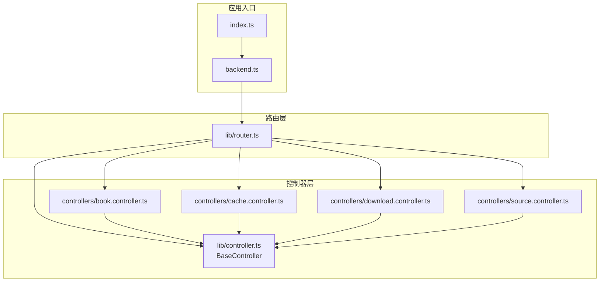
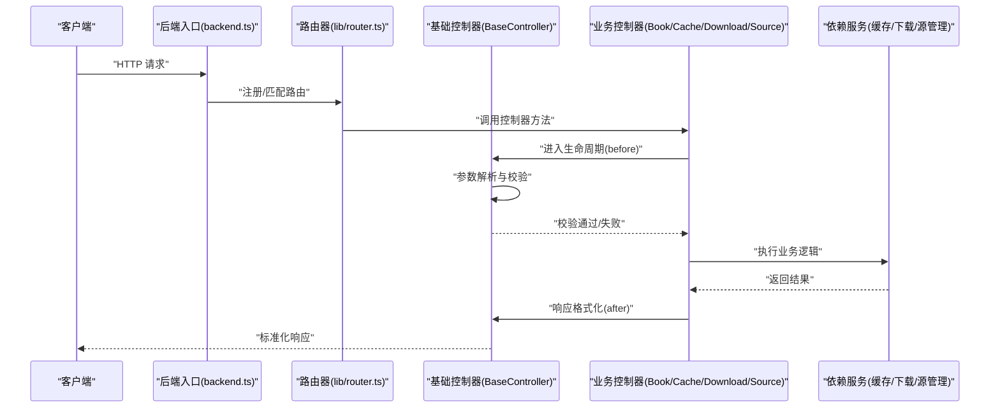
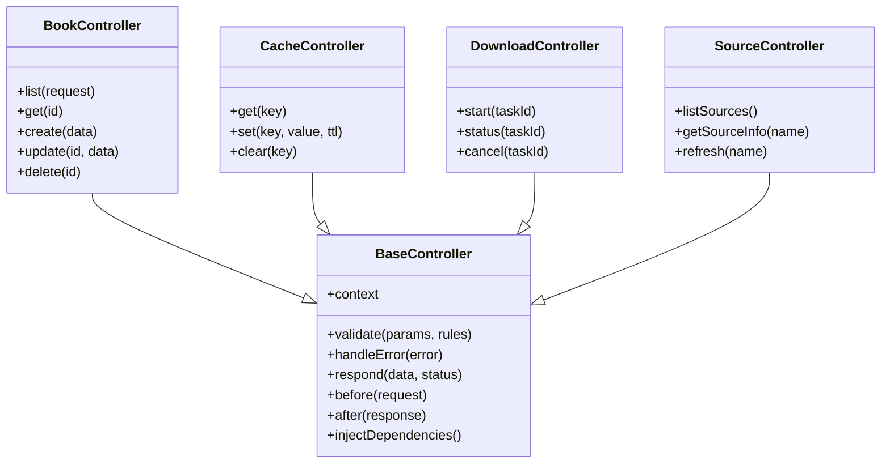
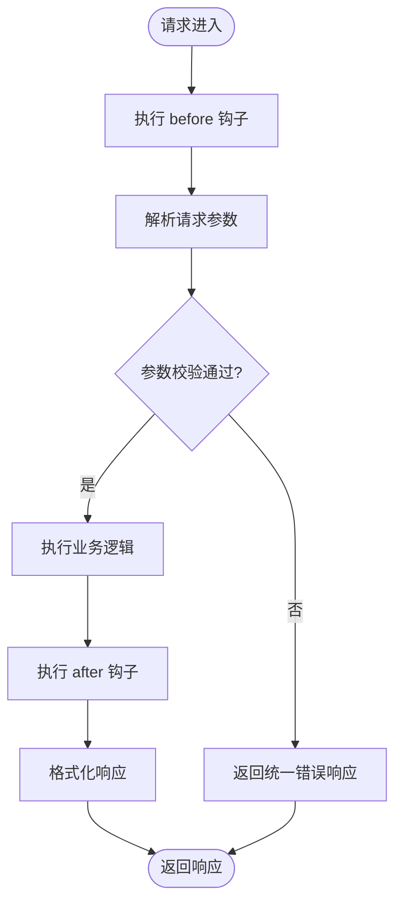
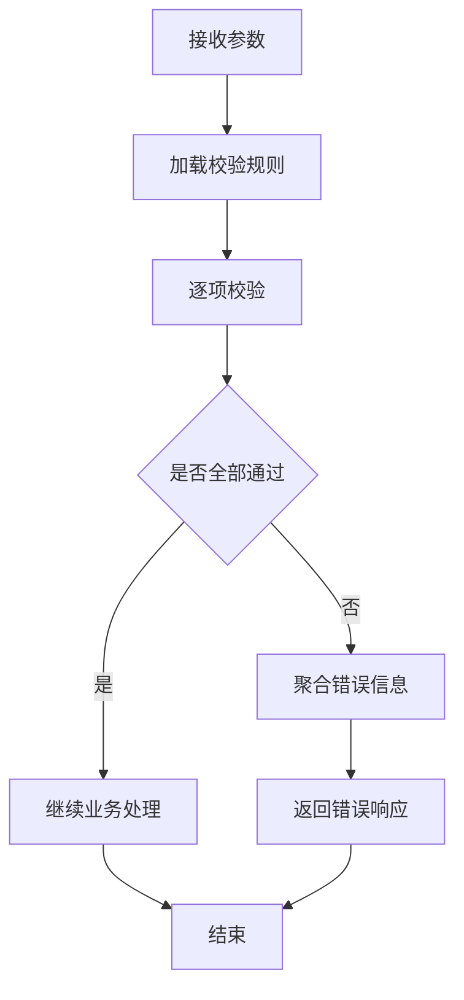
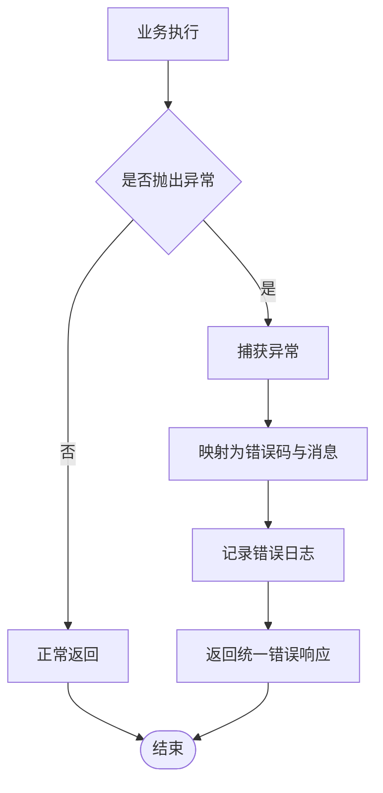
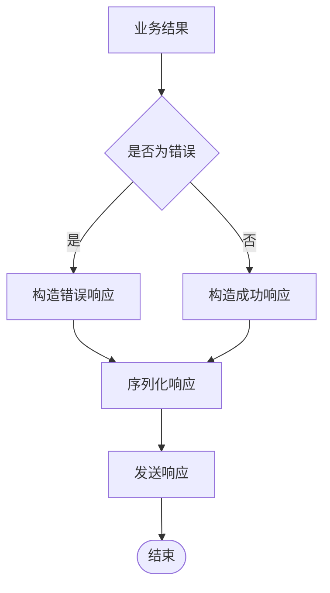
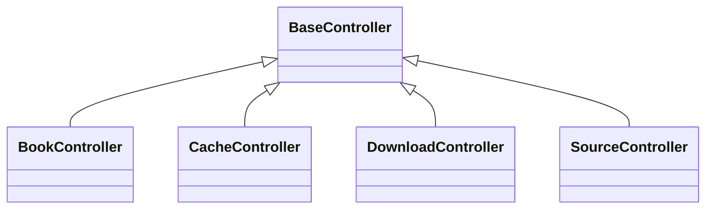
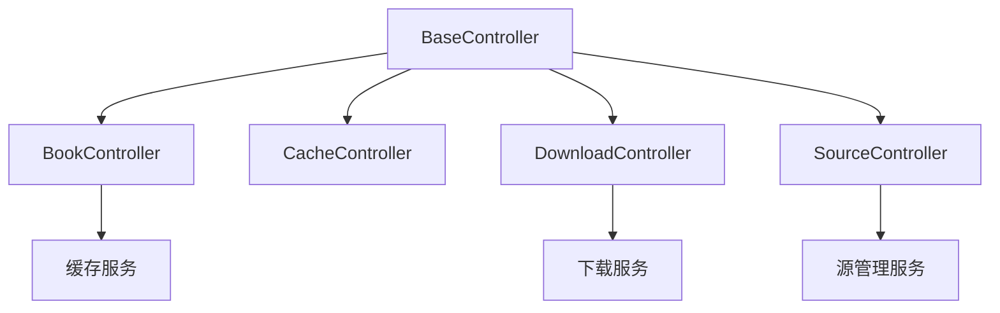

# 基础控制器类

<cite>
**本文档引用的文件**
- [lib/controller.ts](file://lib/controller.ts)
- [controllers/book.controller.ts](file://controllers/book.controller.ts)
- [controllers/cache.controller.ts](file://controllers/cache.controller.ts)
- [controllers/download.controller.ts](file://controllers/download.controller.ts)
- [controllers/source.controller.ts](file://controllers/source.controller.ts)
- [lib/router.ts](file://lib/router.ts)
- [backend.ts](file://backend.ts)
- [index.ts](file://index.ts)
</cite>

## 目录
1. [简介](#简介)
2. [项目结构](#项目结构)
3. [核心组件](#核心组件)
4. [架构总览](#架构总览)
5. [详细组件分析](#详细组件分析)
6. [依赖关系分析](#依赖关系分析)
7. [性能考量](#性能考量)
8. [故障排查指南](#故障排查指南)
9. [结论](#结论)
10. [附录](#附录)

## 简介
本文件面向 Bun-zlib 项目中的“基础控制器类”主题，聚焦 BaseController 的设计模式与核心能力。文档将系统阐述请求处理生命周期、参数验证机制、错误处理策略与响应格式化流程；说明继承结构与重写模式；给出扩展新控制器的实践示例；并记录中间件集成方式、路由绑定机制与依赖注入实现。同时提供最佳实践与常见陷阱规避建议，帮助开发者快速上手并稳定扩展控制器功能。

## 项目结构
Bun-zlib 采用分层组织：控制器位于 controllers 目录，基础控制器与通用工具位于 lib 目录，路由与后端入口在根目录。基础控制器由 lib/controller.ts 定义，具体业务控制器（如 book、cache、download、source）通过继承该基础类实现统一的生命周期、校验、错误与响应行为。路由注册与后端启动分别在 lib/router.ts 与 backend.ts/index.ts 中完成。

图表来源
- [index.ts](file://index.ts)
- [backend.ts](file://backend.ts)
- [lib/router.ts](file://lib/router.ts)
- [lib/controller.ts](file://lib/controller.ts)
- [controllers/book.controller.ts](file://controllers/book.controller.ts)
- [controllers/cache.controller.ts](file://controllers/cache.controller.ts)
- [controllers/download.controller.ts](file://controllers/download.controller.ts)
- [controllers/source.controller.ts](file://controllers/source.controller.ts)

章节来源
- [index.ts](file://index.ts)
- [backend.ts](file://backend.ts)
- [lib/router.ts](file://lib/router.ts)
- [lib/controller.ts](file://lib/controller.ts)
- [controllers/book.controller.ts](file://controllers/book.controller.ts)
- [controllers/cache.controller.ts](file://controllers/cache.controller.ts)
- [controllers/download.controller.ts](file://controllers/download.controller.ts)
- [controllers/source.controller.ts](file://controllers/source.controller.ts)

## 核心组件
- BaseController（基础控制器）
  - 职责：统一封装请求上下文、参数解析与校验、错误捕获与标准化、响应构建与序列化、生命周期钩子（如 before/after）、以及可选的中间件执行点。
  - 关键能力：
    - 请求上下文：从 HTTP 请求对象中提取路径、查询、头部、体等。
    - 参数验证：集中式校验规则与错误聚合，支持自定义校验器。
    - 错误处理：异常捕获、错误码映射、日志记录与统一错误响应。
    - 响应格式化：成功/失败/分页/流式响应的统一包装与序列化。
    - 生命周期：before/after 钩子用于横切关注点（鉴权、限流、审计）。
    - 依赖注入：通过构造函数或属性注入服务实例（缓存、下载、源管理等）。
- 业务控制器（book、cache、download、source）
  - 职责：继承 BaseController，实现具体资源的路由处理器方法（如 list、get、create、update、delete），复用基础控制器的校验、错误与响应能力。
  - 典型模式：
    - 方法级路由绑定：每个控制器方法对应一个或多个路由。
    - 参数校验：使用基础控制器提供的校验 API 对输入进行约束。
    - 错误处理：抛出结构化错误或返回错误响应。
    - 响应格式：调用基础控制器的响应构建方法返回统一结构。

章节来源
- [lib/controller.ts](file://lib/controller.ts)
- [controllers/book.controller.ts](file://controllers/book.controller.ts)
- [controllers/cache.controller.ts](file://controllers/cache.controller.ts)
- [controllers/download.controller.ts](file://controllers/download.controller.ts)
- [controllers/source.controller.ts](file://controllers/source.controller.ts)

## 架构总览
下图展示了从请求进入后端到控制器处理的完整链路，包括路由分发、基础控制器生命周期、业务控制器方法与依赖服务的交互。

图表来源
- [backend.ts](file://backend.ts)
- [lib/router.ts](file://lib/router.ts)
- [lib/controller.ts](file://lib/controller.ts)
- [controllers/book.controller.ts](file://controllers/book.controller.ts)
- [controllers/cache.controller.ts](file://controllers/cache.controller.ts)
- [controllers/download.controller.ts](file://controllers/download.controller.ts)
- [controllers/source.controller.ts](file://controllers/source.controller.ts)

## 详细组件分析

### BaseController 设计模式与核心功能
- 设计模式
  - 模板方法：定义请求处理的标准流程（解析→校验→执行业务→格式化→返回），子类可覆盖特定步骤。
  - 依赖注入：通过构造函数或属性注入服务，便于测试与解耦。
  - 中间件链：在 before/after 钩子中插入横切逻辑（鉴权、限流、审计、缓存）。
- 核心功能
  - 请求上下文：统一获取 path、query、headers、body 等。
  - 参数验证：集中式校验规则，支持字段类型、必填、范围、正则等，错误聚合为统一结构。
  - 错误处理：捕获异常，映射为错误码与消息，记录日志，返回标准错误响应。
  - 响应格式化：统一成功/失败/分页/流式响应结构，确保前端一致消费。
  - 生命周期钩子：before/after 钩子用于扩展横切关注点。
  - 依赖注入：注入缓存、下载、源管理等服务，避免硬编码。

图表来源
- [lib/controller.ts](file://lib/controller.ts)
- [controllers/book.controller.ts](file://controllers/book.controller.ts)
- [controllers/cache.controller.ts](file://controllers/cache.controller.ts)
- [controllers/download.controller.ts](file://controllers/download.controller.ts)
- [controllers/source.controller.ts](file://controllers/source.controller.ts)

章节来源
- [lib/controller.ts](file://lib/controller.ts)
- [controllers/book.controller.ts](file://controllers/book.controller.ts)
- [controllers/cache.controller.ts](file://controllers/cache.controller.ts)
- [controllers/download.controller.ts](file://controllers/download.controller.ts)
- [controllers/source.controller.ts](file://controllers/source.controller.ts)

### 请求处理生命周期
- 阶段划分
  - 前置处理（before）：鉴权、限流、审计、缓存命中检查。
  - 参数解析与校验：提取并校验输入，失败则返回统一错误。
  - 业务执行：调用依赖服务完成具体逻辑。
  - 后置处理（after）：响应格式化、统计、日志、缓存写入。
- 钩子扩展
  - 在 BaseController 中定义 before/after 钩子，业务控制器可选择性覆盖以注入横切逻辑。
- 错误传播
  - 任何阶段抛出的异常被统一捕获，转换为标准错误响应。

图表来源
- [lib/controller.ts](file://lib/controller.ts)

章节来源
- [lib/controller.ts](file://lib/controller.ts)

### 参数验证机制
- 校验规则
  - 字段类型、必填、范围、枚举、正则表达式等。
  - 支持嵌套对象与数组的递归校验。
- 错误聚合
  - 将所有校验错误聚合为统一结构，包含字段名、错误码、提示信息。
- 自定义校验器
  - 允许注册自定义校验函数，增强灵活性。

图表来源
- [lib/controller.ts](file://lib/controller.ts)

章节来源
- [lib/controller.ts](file://lib/controller.ts)

### 错误处理策略
- 异常捕获
  - 全局捕获控制器方法中的异常，避免进程崩溃。
- 错误映射
  - 将内部异常映射为标准错误码与消息，便于前端处理。
- 日志记录
  - 记录错误上下文（请求 ID、用户、参数摘要），便于排查。
- 统一响应
  - 所有错误均返回统一结构，包含 code、message、details 等。

图表来源
- [lib/controller.ts](file://lib/controller.ts)

章节来源
- [lib/controller.ts](file://lib/controller.ts)

### 响应格式化流程
- 统一结构
  - 成功响应包含数据、分页信息（可选）、时间戳。
  - 错误响应包含错误码、消息、详情。
- 序列化
  - 根据内容类型选择 JSON、流式或其他格式。
- 状态码
  - 自动映射业务状态到 HTTP 状态码。

图表来源
- [lib/controller.ts](file://lib/controller.ts)

章节来源
- [lib/controller.ts](file://lib/controller.ts)

### 继承结构与重写模式
- 继承关系
  - 所有业务控制器继承 BaseController，复用公共能力。
- 重写模式
  - 覆盖 before/after 钩子实现横切逻辑。
  - 覆盖 validate/respond 等方法定制校验与响应。
- 示例控制器
  - BookController：图书资源的 CRUD。
  - CacheController：缓存操作的封装。
  - DownloadController：下载任务的管理。
  - SourceController：源管理与刷新。

图表来源
- [lib/controller.ts](file://lib/controller.ts)
- [controllers/book.controller.ts](file://controllers/book.controller.ts)
- [controllers/cache.controller.ts](file://controllers/cache.controller.ts)
- [controllers/download.controller.ts](file://controllers/download.controller.ts)
- [controllers/source.controller.ts](file://controllers/source.controller.ts)

章节来源
- [lib/controller.ts](file://lib/controller.ts)
- [controllers/book.controller.ts](file://controllers/book.controller.ts)
- [controllers/cache.controller.ts](file://controllers/cache.controller.ts)
- [controllers/download.controller.ts](file://controllers/download.controller.ts)
- [controllers/source.controller.ts](file://controllers/source.controller.ts)

### 中间件集成方式
- 钩子集成
  - 在 BaseController 的 before/after 钩子中执行中间件逻辑（鉴权、限流、审计）。
- 组合式中间件
  - 支持中间件链的组合与顺序控制。
- 示例场景
  - 鉴权中间件：检查用户身份与权限。
  - 限流中间件：限制请求频率。
  - 审计中间件：记录访问日志。

章节来源
- [lib/controller.ts](file://lib/controller.ts)

### 路由绑定机制
- 路由注册
  - 在 router.ts 中定义路由与控制器方法的映射。
- 动态绑定
  - 支持基于装饰器或约定的自动绑定。
- 示例
  - GET /books → BookController.list
  - POST /books → BookController.create

章节来源
- [lib/router.ts](file://lib/router.ts)
- [controllers/book.controller.ts](file://controllers/book.controller.ts)

### 依赖注入实现
- 构造函数注入
  - 在控制器构造函数中注入服务实例（缓存、下载、源管理）。
- 属性注入
  - 通过属性赋值注入，便于测试时替换。
- 示例
  - BookController 注入缓存服务以提升性能。
  - DownloadController 注入下载管理器。

章节来源
- [lib/controller.ts](file://lib/controller.ts)
- [controllers/book.controller.ts](file://controllers/book.controller.ts)
- [controllers/download.controller.ts](file://controllers/download.controller.ts)

### 扩展新控制器的最佳实践
- 步骤
  - 创建新的控制器文件，继承 BaseController。
  - 实现路由所需的方法（list、get、create、update、delete）。
  - 在 router.ts 中注册路由映射。
  - 在构造函数中注入依赖服务。
- 注意事项
  - 始终使用 BaseController 的参数校验与错误处理。
  - 避免在控制器中直接操作数据库或外部服务，应通过依赖服务。
  - 合理使用 before/after 钩子实现横切逻辑。

章节来源
- [lib/controller.ts](file://lib/controller.ts)
- [lib/router.ts](file://lib/router.ts)
- [controllers/book.controller.ts](file://controllers/book.controller.ts)

## 依赖关系分析
- 组件耦合
  - 业务控制器依赖 BaseController，降低重复代码。
  - 控制器通过依赖注入与服务解耦。
- 外部依赖
  - 缓存、下载、源管理等服务作为外部依赖注入。
- 潜在循环依赖
  - 避免控制器之间直接相互调用，应通过服务层协调。

图表来源
- [lib/controller.ts](file://lib/controller.ts)
- [controllers/book.controller.ts](file://controllers/book.controller.ts)
- [controllers/cache.controller.ts](file://controllers/cache.controller.ts)
- [controllers/download.controller.ts](file://controllers/download.controller.ts)
- [controllers/source.controller.ts](file://controllers/source.controller.ts)

章节来源
- [lib/controller.ts](file://lib/controller.ts)
- [controllers/book.controller.ts](file://controllers/book.controller.ts)
- [controllers/cache.controller.ts](file://controllers/cache.controller.ts)
- [controllers/download.controller.ts](file://controllers/download.controller.ts)
- [controllers/source.controller.ts](file://controllers/source.controller.ts)

## 性能考量
- 参数校验优化
  - 使用高效的校验库，避免不必要的字符串转换。
- 缓存策略
  - 在 before 钩子中检查缓存，减少重复计算。
- 异步处理
  - 对于耗时操作（下载、网络请求）使用异步处理，避免阻塞。
- 内存管理
  - 及时释放大对象引用，避免内存泄漏。

[本节为通用指导，不直接分析具体文件]

## 故障排查指南
- 常见问题
  - 参数校验失败：检查校验规则与输入格式。
  - 依赖注入失败：确认服务实例是否正确注入。
  - 路由未匹配：检查 router.ts 中的路由定义。
- 调试技巧
  - 启用详细日志，记录请求上下文与错误堆栈。
  - 使用单元测试验证控制器方法。
- 恢复策略
  - 实现重试机制与降级逻辑。

章节来源
- [lib/controller.ts](file://lib/controller.ts)
- [lib/router.ts](file://lib/router.ts)

## 结论
BaseController 为 Bun-zlib 项目提供了统一的控制器基类，通过模板方法、依赖注入与中间件钩子，实现了请求处理生命周期的标准化。业务控制器通过继承与重写，复用校验、错误与响应能力，提升开发效率与代码一致性。遵循最佳实践与避免常见陷阱，可构建稳定、可扩展的控制器层。

[本节为总结，不直接分析具体文件]

## 附录
- 术语表
  - BaseController：基础控制器类，提供通用能力。
  - 依赖注入：通过构造函数或属性注入服务实例。
  - 中间件：横切逻辑的执行单元。
- 参考文件
  - lib/controller.ts：基础控制器实现。
  - controllers/*.controller.ts：业务控制器示例。
  - lib/router.ts：路由注册与绑定。

[本节为附录，不直接分析具体文件]