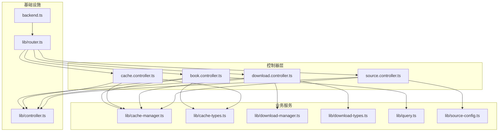
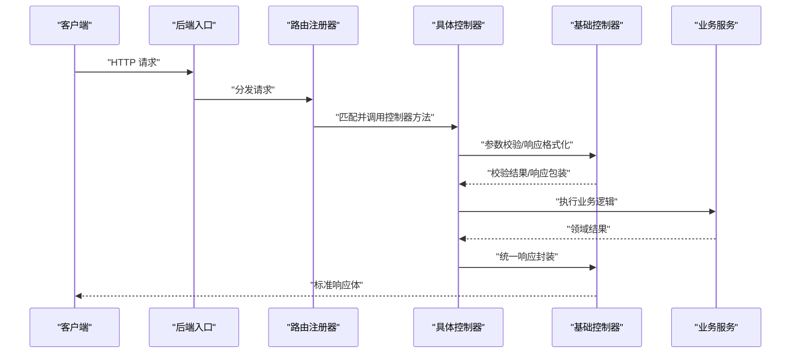
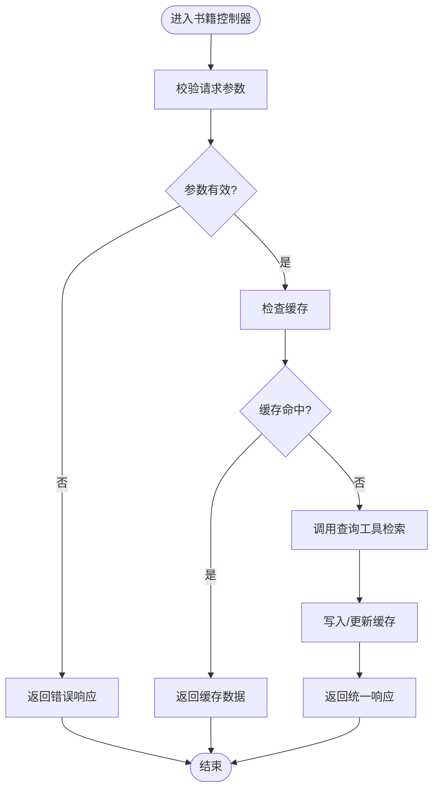
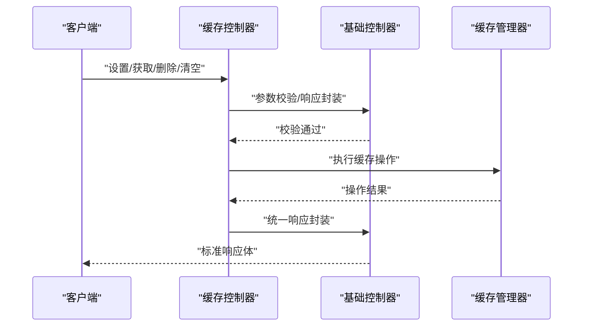
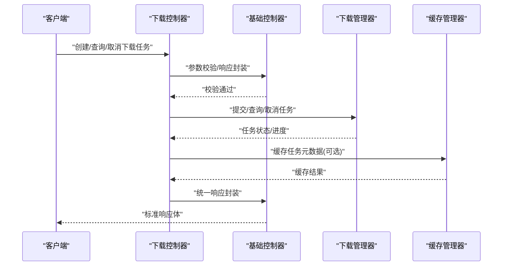
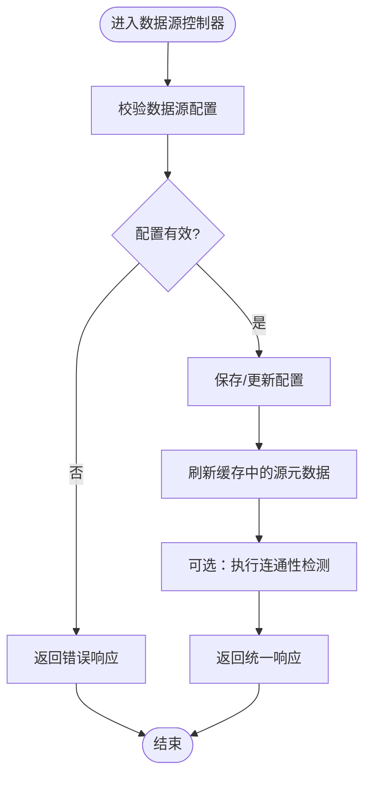
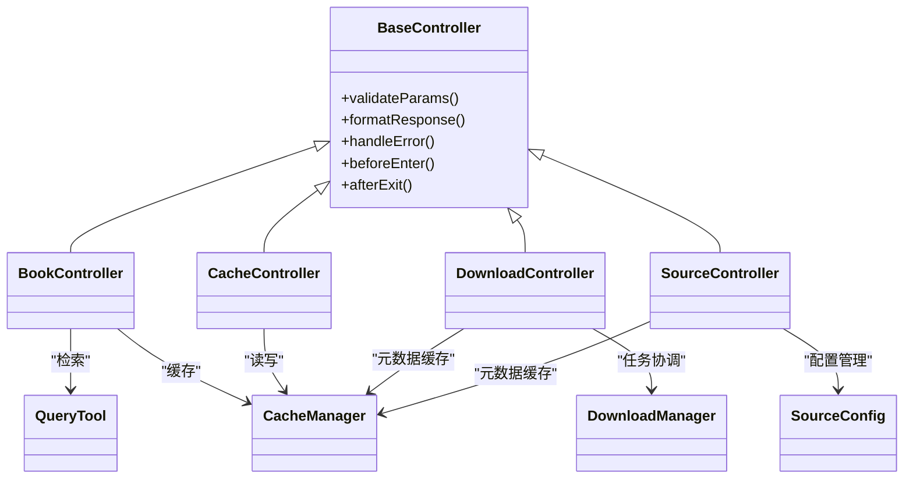

# 控制器层架构

<cite>
**本文引用的文件**   
- [controllers/book.controller.ts](file://controllers/book.controller.ts)
- [controllers/cache.controller.ts](file://controllers/cache.controller.ts)
- [controllers/download.controller.ts](file://controllers/download.controller.ts)
- [controllers/source.controller.ts](file://controllers/source.controller.ts)
- [lib/controller.ts](file://lib/controller.ts)
- [lib/router.ts](file://lib/router.ts)
- [lib/cache-manager.ts](file://lib/cache-manager.ts)
- [lib/cache-types.ts](file://lib/cache-types.ts)
- [lib/download-manager.ts](file://lib/download-manager.ts)
- [lib/download-types.ts](file://lib/download-types.ts)
- [lib/query.ts](file://lib/query.ts)
- [lib/source-config.ts](file://lib/source-config.ts)
- [backend.ts](file://backend.ts)
</cite>

## 目录
1. [简介](#简介)
2. [项目结构](#项目结构)
3. [核心组件](#核心组件)
4. [架构总览](#架构总览)
5. [详细组件分析](#详细组件分析)
6. [依赖关系分析](#依赖关系分析)
7. [性能考虑](#性能考虑)
8. [故障排查指南](#故障排查指南)
9. [结论](#结论)
10. [附录：扩展新控制器的步骤](#附录扩展新控制器的步骤)

## 简介
本文件聚焦于 Bun-zlib 项目的控制器层，系统性阐述其设计模式与实现原理。内容涵盖基础控制器类的继承结构、HTTP 请求处理流程、参数验证与响应格式化机制，以及各具体控制器的职责划分（书籍、缓存、下载、数据源）。同时记录控制器间的依赖关系与数据传递模式，并提供扩展新控制器的实践指引。

## 项目结构
控制器层位于 controllers 目录，基础能力集中于 lib/controller.ts；路由注册在 lib/router.ts；业务服务分别由缓存管理器、下载管理器、查询工具与数据源配置等模块提供。后端入口通过 backend.ts 将路由挂载到 HTTP 服务器。

图表来源
- [backend.ts](file://backend.ts)
- [lib/router.ts](file://lib/router.ts)
- [controllers/book.controller.ts](file://controllers/book.controller.ts)
- [controllers/cache.controller.ts](file://controllers/cache.controller.ts)
- [controllers/download.controller.ts](file://controllers/download.controller.ts)
- [controllers/source.controller.ts](file://controllers/source.controller.ts)
- [lib/controller.ts](file://lib/controller.ts)
- [lib/cache-manager.ts](file://lib/cache-manager.ts)
- [lib/cache-types.ts](file://lib/cache-types.ts)
- [lib/download-manager.ts](file://lib/download-manager.ts)
- [lib/download-types.ts](file://lib/download-types.ts)
- [lib/query.ts](file://lib/query.ts)
- [lib/source-config.ts](file://lib/source-config.ts)

章节来源
- [backend.ts](file://backend.ts)
- [lib/router.ts](file://lib/router.ts)
- [controllers/book.controller.ts](file://controllers/book.controller.ts)
- [controllers/cache.controller.ts](file://controllers/cache.controller.ts)
- [controllers/download.controller.ts](file://controllers/download.controller.ts)
- [controllers/source.controller.ts](file://controllers/source.controller.ts)
- [lib/controller.ts](file://lib/controller.ts)
- [lib/cache-manager.ts](file://lib/cache-manager.ts)
- [lib/cache-types.ts](file://lib/cache-types.ts)
- [lib/download-manager.ts](file://lib/download-manager.ts)
- [lib/download-types.ts](file://lib/download-types.ts)
- [lib/query.ts](file://lib/query.ts)
- [lib/source-config.ts](file://lib/source-config.ts)

## 核心组件
- 基础控制器类
  - 提供统一的请求上下文访问、参数校验、错误封装与响应格式化的通用方法，供所有具体控制器继承复用。
  - 典型职责包括：解析路径/查询参数、统一返回结构、标准化错误码与消息、日志埋点钩子等。
- 路由注册器
  - 集中定义 URL 前缀与方法映射，将控制器方法与 HTTP 动词绑定，便于维护与扩展。
- 业务服务
  - 缓存管理器：提供缓存读写、失效策略、批量操作等能力。
  - 下载管理器：协调批量下载任务、进度跟踪、失败重试与结果聚合。
  - 查询工具：对本地或内存数据结构进行检索与过滤。
  - 数据源配置：管理外部数据源的连接与元信息。

章节来源
- [lib/controller.ts](file://lib/controller.ts)
- [lib/router.ts](file://lib/router.ts)
- [lib/cache-manager.ts](file://lib/cache-manager.ts)
- [lib/cache-types.ts](file://lib/cache-types.ts)
- [lib/download-manager.ts](file://lib/download-manager.ts)
- [lib/download-types.ts](file://lib/download-types.ts)
- [lib/query.ts](file://lib/query.ts)
- [lib/source-config.ts](file://lib/source-config.ts)

## 架构总览
控制器层采用“基础控制器 + 具体控制器”的继承模式，结合路由注册器完成 HTTP 请求的分发。请求进入后端后，由路由匹配到对应控制器方法，控制器调用基础控制器的通用能力完成参数校验与响应格式化，再委托业务服务执行领域逻辑，最终返回统一结构的响应体。

图表来源
- [backend.ts](file://backend.ts)
- [lib/router.ts](file://lib/router.ts)
- [lib/controller.ts](file://lib/controller.ts)
- [controllers/book.controller.ts](file://controllers/book.controller.ts)
- [controllers/cache.controller.ts](file://controllers/cache.controller.ts)
- [controllers/download.controller.ts](file://controllers/download.controller.ts)
- [controllers/source.controller.ts](file://controllers/source.controller.ts)

## 详细组件分析

### 基础控制器类
- 设计要点
  - 提供可复用的参数解析与校验方法，支持路径参数、查询参数与请求体的结构化校验。
  - 统一响应格式：包含状态码、数据体、错误信息与可选的请求追踪标识。
  - 错误处理：捕获异常并转换为标准错误响应，避免未处理异常泄露内部细节。
  - 生命周期钩子：可在进入/退出控制器方法前后注入日志、指标统计等横切关注点。
- 复杂度与性能
  - 参数校验通常基于规则表或类型约束，时间复杂度与字段数量线性相关。
  - 响应封装为浅拷贝与序列化，开销可控。
- 可扩展性
  - 新增校验规则或响应字段时，仅需修改基础控制器，无需改动具体控制器。

章节来源
- [lib/controller.ts](file://lib/controller.ts)

### 书籍控制器（book.controller.ts）
- 职责范围
  - 图书资源的 CRUD 操作：创建、读取、更新、删除。
  - 与查询工具协作，实现按条件检索与分页。
  - 与缓存管理器协作，提升热点数据的读取性能。
- 关键流程
  - 读取列表：校验分页与筛选参数 -> 查询工具检索 -> 缓存命中优先 -> 返回统一响应。
  - 获取详情：校验 ID -> 缓存命中优先 -> 未命中则查询 -> 回填缓存 -> 返回统一响应。
  - 写入变更：校验输入 -> 持久化更新 -> 失效相关缓存键 -> 返回统一响应。
- 数据模型
  - 使用缓存类型定义描述缓存项结构与过期策略。

图表来源
- [controllers/book.controller.ts](file://controllers/book.controller.ts)
- [lib/controller.ts](file://lib/controller.ts)
- [lib/query.ts](file://lib/query.ts)
- [lib/cache-manager.ts](file://lib/cache-manager.ts)
- [lib/cache-types.ts](file://lib/cache-types.ts)

章节来源
- [controllers/book.controller.ts](file://controllers/book.controller.ts)
- [lib/query.ts](file://lib/query.ts)
- [lib/cache-manager.ts](file://lib/cache-manager.ts)
- [lib/cache-types.ts](file://lib/cache-types.ts)

### 缓存控制器（cache.controller.ts）
- 职责范围
  - 管理缓存策略：设置、获取、删除、清空、批量操作。
  - 暴露缓存健康检查与统计接口。
- 关键流程
  - 设置/更新：校验键值与过期策略 -> 调用缓存管理器写入 -> 返回成功响应。
  - 获取：校验键 -> 命中返回 -> 未命中返回空或默认值。
  - 清理：按前缀或通配符批量删除 -> 返回受影响计数。
- 数据模型
  - 使用缓存类型定义键空间、TTL 与版本控制字段。

图表来源
- [controllers/cache.controller.ts](file://controllers/cache.controller.ts)
- [lib/controller.ts](file://lib/controller.ts)
- [lib/cache-manager.ts](file://lib/cache-manager.ts)
- [lib/cache-types.ts](file://lib/cache-types.ts)

章节来源
- [controllers/cache.controller.ts](file://controllers/cache.controller.ts)
- [lib/cache-manager.ts](file://lib/cache-manager.ts)
- [lib/cache-types.ts](file://lib/cache-types.ts)

### 下载控制器（download.controller.ts）
- 职责范围
  - 协调批量下载任务：创建任务、查询进度、取消任务、获取结果。
  - 与下载管理器交互，管理并发、重试与失败聚合。
  - 与缓存管理器协作，缓存任务元数据与中间结果以提升稳定性。
- 关键流程
  - 创建任务：校验资源列表与策略 -> 提交到下载管理器 -> 返回任务 ID。
  - 查询进度：校验任务 ID -> 从下载管理器拉取进度 -> 返回统一响应。
  - 取消任务：校验任务 ID -> 通知下载管理器取消 -> 返回确认响应。
- 数据模型
  - 使用下载类型定义任务状态、进度百分比、错误集合与重试次数。

图表来源
- [controllers/download.controller.ts](file://controllers/download.controller.ts)
- [lib/controller.ts](file://lib/controller.ts)
- [lib/download-manager.ts](file://lib/download-manager.ts)
- [lib/download-types.ts](file://lib/download-types.ts)
- [lib/cache-manager.ts](file://lib/cache-manager.ts)

章节来源
- [controllers/download.controller.ts](file://controllers/download.controller.ts)
- [lib/download-manager.ts](file://lib/download-manager.ts)
- [lib/download-types.ts](file://lib/download-types.ts)
- [lib/cache-manager.ts](file://lib/cache-manager.ts)

### 数据源控制器（source.controller.ts）
- 职责范围
  - 管理外部数据源：注册、更新、启用/禁用、测试连通性。
  - 与数据源配置模块交互，加载与校验源配置。
  - 与缓存管理器协作，缓存源元数据与连通性检测结果。
- 关键流程
  - 注册/更新：校验配置 -> 持久化配置 -> 刷新缓存 -> 返回成功响应。
  - 测试连通性：加载配置 -> 发起探测请求 -> 记录结果并缓存 -> 返回健康状态。
- 数据模型
  - 使用数据源配置定义连接参数、认证方式与超时策略。

图表来源
- [controllers/source.controller.ts](file://controllers/source.controller.ts)
- [lib/controller.ts](file://lib/controller.ts)
- [lib/source-config.ts](file://lib/source-config.ts)
- [lib/cache-manager.ts](file://lib/cache-manager.ts)

章节来源
- [controllers/source.controller.ts](file://controllers/source.controller.ts)
- [lib/source-config.ts](file://lib/source-config.ts)
- [lib/cache-manager.ts](file://lib/cache-manager.ts)

## 依赖关系分析
- 控制器与基础控制器
  - 所有具体控制器均继承自基础控制器，复用参数校验与响应封装能力，降低重复代码与不一致风险。
- 控制器与服务层
  - 书籍控制器依赖查询工具与缓存管理器；下载控制器依赖下载管理器与缓存管理器；数据源控制器依赖数据源配置与缓存管理器。
- 路由与后端
  - 路由注册器集中声明 URL 与控制器方法的映射；后端入口负责启动服务并将路由挂载到 HTTP 服务器。

图表来源
- [lib/controller.ts](file://lib/controller.ts)
- [controllers/book.controller.ts](file://controllers/book.controller.ts)
- [controllers/cache.controller.ts](file://controllers/cache.controller.ts)
- [controllers/download.controller.ts](file://controllers/download.controller.ts)
- [controllers/source.controller.ts](file://controllers/source.controller.ts)
- [lib/cache-manager.ts](file://lib/cache-manager.ts)
- [lib/download-manager.ts](file://lib/download-manager.ts)
- [lib/query.ts](file://lib/query.ts)
- [lib/source-config.ts](file://lib/source-config.ts)

章节来源
- [lib/controller.ts](file://lib/controller.ts)
- [controllers/book.controller.ts](file://controllers/book.controller.ts)
- [controllers/cache.controller.ts](file://controllers/cache.controller.ts)
- [controllers/download.controller.ts](file://controllers/download.controller.ts)
- [controllers/source.controller.ts](file://controllers/source.controller.ts)
- [lib/cache-manager.ts](file://lib/cache-manager.ts)
- [lib/download-manager.ts](file://lib/download-manager.ts)
- [lib/query.ts](file://lib/query.ts)
- [lib/source-config.ts](file://lib/source-config.ts)

## 性能考虑
- 缓存优先策略
  - 读多写少场景下，优先命中缓存，减少底层查询与 I/O 压力。
- 批量与并发
  - 下载任务应限制并发度，避免资源争用；批量操作尽量合并请求以降低往返次数。
- 参数校验成本
  - 校验规则应尽量简单高效，避免复杂正则与深层嵌套校验带来的 CPU 开销。
- 响应体积控制
  - 分页与字段裁剪可减少网络传输与序列化成本。

[本节为通用指导，不直接分析具体文件]

## 故障排查指南
- 常见错误定位
  - 参数校验失败：检查路径/查询/请求体字段是否齐全与类型正确。
  - 缓存异常：核对键空间命名、TTL 设置与缓存管理器状态。
  - 下载任务失败：查看任务状态、重试次数与错误集合，定位失败节点。
  - 数据源不可达：检查配置参数、网络连通性与认证凭据。
- 建议的诊断手段
  - 开启控制器生命周期钩子的日志输出，记录进入/退出时间与关键变量。
  - 为关键路径添加指标埋点（如命中率、延迟分布、错误率）。
  - 使用健康检查接口快速评估缓存与数据源状态。

章节来源
- [lib/controller.ts](file://lib/controller.ts)
- [controllers/cache.controller.ts](file://controllers/cache.controller.ts)
- [controllers/download.controller.ts](file://controllers/download.controller.ts)
- [controllers/source.controller.ts](file://controllers/source.controller.ts)

## 结论
控制器层通过基础控制器抽象出通用的参数校验与响应封装能力，配合路由注册器实现清晰的请求分发。各具体控制器职责明确，依赖清晰，借助缓存与下载管理等服务提升整体性能与稳定性。遵循本文档的设计模式与最佳实践，可高效扩展新的控制器并保持系统一致性。

[本节为总结性内容，不直接分析具体文件]

## 附录：扩展新控制器的步骤
- 新建控制器文件
  - 在 controllers 目录下创建新控制器文件，继承基础控制器类，复用参数校验与响应封装方法。
- 实现业务方法
  - 根据需求实现具体的 HTTP 处理方法，调用相应的业务服务（如缓存、下载、查询、配置等）。
- 注册路由
  - 在路由注册器中为新控制器添加 URL 前缀与方法映射，确保后端能正确分发请求。
- 编写单元测试
  - 针对参数校验、错误处理与响应格式编写用例，覆盖正常与异常分支。
- 集成与回归
  - 启动后端入口，验证新控制器端点的行为是否符合预期，并与现有功能进行回归测试。

章节来源
- [lib/controller.ts](file://lib/controller.ts)
- [lib/router.ts](file://lib/router.ts)
- [backend.ts](file://backend.ts)