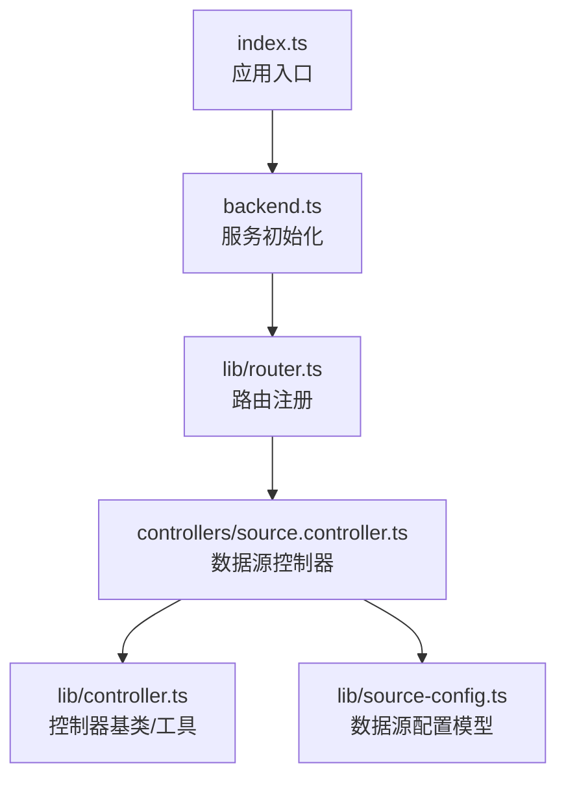
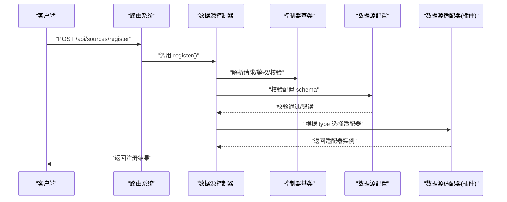
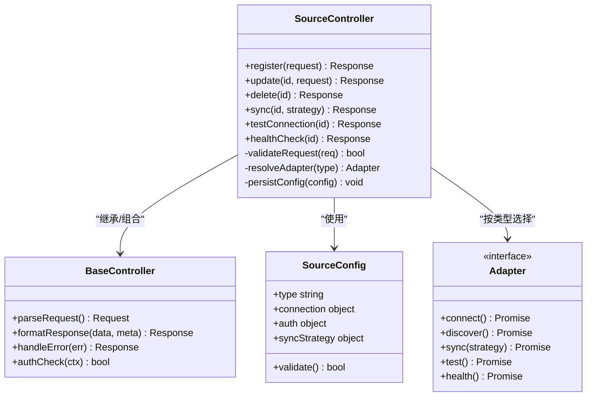
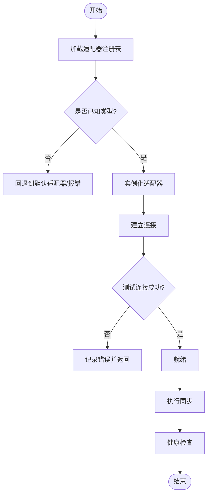
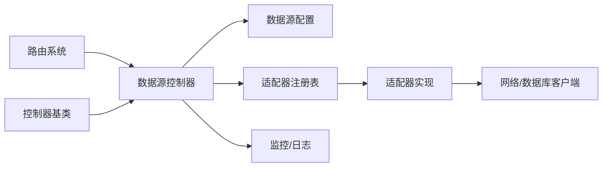

# 数据源控制器

<cite>
**本文档引用的文件**   
- [source.controller.ts](file://controllers/source.controller.ts)
- [controller.ts](file://lib/controller.ts)
- [router.ts](file://lib/router.ts)
- [source-config.ts](file://lib/source-config.ts)
- [backend.ts](file://backend.ts)
- [index.ts](file://index.ts)
</cite>

## 目录
1. [简介](#简介)
2. [项目结构](#项目结构)
3. [核心组件](#核心组件)
4. [架构总览](#架构总览)
5. [详细组件分析](#详细组件分析)
6. [依赖关系分析](#依赖关系分析)
7. [性能考虑](#性能考虑)
8. [故障排查指南](#故障排查指南)
9. [结论](#结论)
10. [附录](#附录)

## 简介
本文件为 Bun-zlib 项目的“数据源控制器”提供系统化、可操作的技术文档。内容聚焦于外部数据源集成的 API 接口（注册、配置、同步、测试连接）、插件化适配机制与扩展点、数据源发现与动态加载原理，以及自定义数据源开发指南与健康检查、错误处理、性能监控的最佳实践。读者无需深入源码即可理解并扩展数据源能力。

## 项目结构
围绕数据源控制器的关键代码分布在控制器层、路由与中间件、以及数据源配置模块中：
- controllers/source.controller.ts：数据源控制器实现，暴露对外 API 的 HTTP 处理逻辑
- lib/controller.ts：通用控制器基类/工具，封装请求解析、响应格式化、鉴权等横切关注点
- lib/router.ts：路由注册与分发，将 URL 映射到控制器方法
- lib/source-config.ts：数据源配置模型与校验、默认值、版本兼容等
- backend.ts / index.ts：后端入口与服务启动，挂载路由与控制器实例

图表来源
- [index.ts](file://index.ts)
- [backend.ts](file://backend.ts)
- [router.ts](file://lib/router.ts)
- [source.controller.ts](file://controllers/source.controller.ts)
- [controller.ts](file://lib/controller.ts)
- [source-config.ts](file://lib/source-config.ts)

章节来源
- [source.controller.ts](file://controllers/source.controller.ts)
- [controller.ts](file://lib/controller.ts)
- [router.ts](file://lib/router.ts)
- [source-config.ts](file://lib/source-config.ts)
- [backend.ts](file://backend.ts)
- [index.ts](file://index.ts)

## 核心组件
- 数据源控制器（SourceController）
  - 职责：统一暴露数据源的注册、配置、同步、测试连接等 RESTful 接口；协调配置校验、权限校验、异步任务调度与结果返回
  - 关键能力：参数校验、错误归一化、分页与过滤、并发控制、健康检查、审计日志
- 控制器基类（BaseController）
  - 职责：提供统一的请求上下文、响应包装、异常捕获、限流与缓存策略
- 路由系统（Router）
  - 职责：URL 模式匹配、HTTP 方法分发、中间件链装配
- 数据源配置（SourceConfig）
  - 职责：定义数据源类型、连接参数、认证方式、同步策略、重试与超时、字段映射规则、版本兼容性

章节来源
- [source.controller.ts](file://controllers/source.controller.ts)
- [controller.ts](file://lib/controller.ts)
- [router.ts](file://lib/router.ts)
- [source-config.ts](file://lib/source-config.ts)

## 架构总览
数据源控制器采用“控制器 + 路由 + 配置模型”的分层设计，结合插件化适配机制，支持多类型外部数据源（如数据库、API、对象存储等）的统一接入。

图表来源
- [router.ts](file://lib/router.ts)
- [source.controller.ts](file://controllers/source.controller.ts)
- [controller.ts](file://lib/controller.ts)
- [source-config.ts](file://lib/source-config.ts)

## 详细组件分析

### 数据源控制器（SourceController）
- 功能要点
  - 注册数据源：接收类型、连接参数、认证信息、同步策略，持久化配置并初始化适配器
  - 更新/删除数据源：支持热更新配置、级联清理资源
  - 同步任务：触发全量/增量同步，支持队列、重试、幂等
  - 测试连接：快速验证连通性、鉴权、网络延迟与协议兼容性
  - 健康检查：周期性探测状态、指标上报、告警阈值
- 错误处理
  - 统一错误码与消息结构，区分参数错误、认证失败、网络异常、适配器错误
  - 对第三方依赖进行降级与熔断保护
- 性能优化
  - 连接池复用、批量写入、分页拉取、缓存热点元数据
  - 异步任务分片与并发度限制

图表来源
- [source.controller.ts](file://controllers/source.controller.ts)
- [controller.ts](file://lib/controller.ts)
- [source-config.ts](file://lib/source-config.ts)

章节来源
- [source.controller.ts](file://controllers/source.controller.ts)
- [controller.ts](file://lib/controller.ts)
- [source-config.ts](file://lib/source-config.ts)

### 路由与控制器绑定（Router）
- 职责
  - 定义 RESTful 路径与 HTTP 方法
  - 注入控制器实例与方法引用
  - 装配中间件（鉴权、限流、日志、CORS）
- 关键点
  - 路径参数与查询参数的解析
  - 错误边界与统一响应格式
  - 路由懒加载与按需注册

章节来源
- [router.ts](file://lib/router.ts)
- [backend.ts](file://backend.ts)
- [index.ts](file://index.ts)

### 数据源配置模型（SourceConfig）
- 字段说明
  - type：数据源类型标识（如 mysql、http、s3）
  - connection：连接参数（host、port、database、timeout、poolSize）
  - auth：认证方式（token、basic、oauth2）
  - syncStrategy：同步策略（full/incremental、schedule、batchSize）
  - validate：运行时校验与默认值填充
- 扩展点
  - 新增类型时仅需扩展 schema 与默认值映射
  - 兼容旧版本的迁移钩子

章节来源
- [source-config.ts](file://lib/source-config.ts)

### 插件化适配机制与扩展点
- 适配器接口
  - connect：建立连接与握手
  - discover：元数据发现（表、集合、端点）
  - sync：执行同步任务（全量/增量）
  - test：连通性与鉴权测试
  - health：健康检查与指标采集
- 插件注册
  - 集中式注册表：按 type 映射到适配器实现
  - 动态加载：支持运行时加载新适配器（文件系统扫描或包管理器）
- 生命周期
  - 初始化 -> 连接 -> 运行 -> 销毁
  - 事件回调：onConnect、onSyncStart、onSyncEnd、onError

图表来源
- [source.controller.ts](file://controllers/source.controller.ts)
- [source-config.ts](file://lib/source-config.ts)

章节来源
- [source.controller.ts](file://controllers/source.controller.ts)
- [source-config.ts](file://lib/source-config.ts)

### API 接口规范（建议）
以下为数据源控制器应提供的标准接口（以 REST 风格描述，具体实现以控制器为准）：
- 注册数据源
  - 方法：POST
  - 路径：/api/sources/register
  - 请求体：包含 type、connection、auth、syncStrategy 等字段
  - 响应：返回 sourceId、status、message
- 更新数据源
  - 方法：PUT
  - 路径：/api/sources/:id
  - 请求体：需要更新的字段
  - 响应：返回更新后的配置摘要
- 删除数据源
  - 方法：DELETE
  - 路径：/api/sources/:id
  - 响应：返回删除结果
- 触发同步
  - 方法：POST
  - 路径：/api/sources/:id/sync
  - 查询参数：strategy=full|incremental
  - 响应：返回任务 id、预计完成时间
- 测试连接
  - 方法：POST
  - 路径：/api/sources/:id/test
  - 响应：返回连通性、鉴权、延迟、错误详情
- 健康检查
  - 方法：GET
  - 路径：/api/sources/:id/health
  - 响应：返回状态、最近一次检查结果、指标

章节来源
- [source.controller.ts](file://controllers/source.controller.ts)

### 自定义数据源开发指南
- 步骤概览
  - 定义适配器实现：实现 connect、discover、sync、test、health 等方法
  - 注册适配器：在注册表中按 type 绑定适配器
  - 扩展配置 schema：为新类型添加连接参数与校验规则
  - 编写单元测试：覆盖连接、同步、错误分支
- 最佳实践
  - 使用连接池与超时控制
  - 实现幂等同步与断点续传
  - 输出结构化日志与指标
  - 对第三方依赖做降级与重试

章节来源
- [source.controller.ts](file://controllers/source.controller.ts)
- [source-config.ts](file://lib/source-config.ts)

### 数据源发现与自动发现
- 静态发现：配置文件或环境变量声明可用类型与适配器
- 动态发现：运行时扫描插件目录或包管理器列表，按需加载
- 自动发现：基于协议探测（如 HTTP 头、数据库握手）识别数据源类型

章节来源
- [source.controller.ts](file://controllers/source.controller.ts)
- [source-config.ts](file://lib/source-config.ts)

### 健康检查、错误处理与性能监控
- 健康检查
  - 定期探测连接可用性、鉴权有效性、延迟阈值
  - 聚合指标：成功率、平均延迟、错误率、连接池利用率
- 错误处理
  - 分类错误码：参数错误、认证失败、网络异常、适配器错误、超时
  - 统一错误响应结构与审计日志
- 性能监控
  - 关键路径埋点：注册、连接、同步、测试
  - 指标上报：Prometheus/Grafana 或内置仪表盘
  - 容量规划：连接池大小、批大小、并发度调优

章节来源
- [source.controller.ts](file://controllers/source.controller.ts)
- [controller.ts](file://lib/controller.ts)

## 依赖关系分析
- 控制器依赖
  - 路由系统：用于请求分发与中间件链
  - 控制器基类：统一请求/响应处理与异常管理
  - 配置模型：数据源配置的校验与默认值
  - 适配器注册表：按类型解析并实例化适配器
- 外部依赖
  - 网络库：HTTP/数据库客户端
  - 任务队列：异步同步任务调度
  - 监控系统：指标与日志收集

图表来源
- [router.ts](file://lib/router.ts)
- [source.controller.ts](file://controllers/source.controller.ts)
- [controller.ts](file://lib/controller.ts)
- [source-config.ts](file://lib/source-config.ts)

章节来源
- [router.ts](file://lib/router.ts)
- [source.controller.ts](file://controllers/source.controller.ts)
- [controller.ts](file://lib/controller.ts)
- [source-config.ts](file://lib/source-config.ts)

## 性能考虑
- 连接与并发
  - 合理设置连接池大小与最大并发数
  - 使用长连接与连接复用
- 同步策略
  - 增量同步优先，减少数据传输量
  - 分批拉取与写入，避免内存峰值
- 缓存与去重
  - 缓存元数据与热点数据
  - 使用唯一键与幂等写入
- 监控与告警
  - 关键指标阈值告警
  - 慢查询与超时追踪

[本节为通用指导，不直接分析具体文件]

## 故障排查指南
- 常见问题
  - 连接失败：检查网络、端口、防火墙、证书
  - 鉴权失败：核对 token、密钥、权限范围
  - 同步失败：查看批次大小、字段映射、目标端约束
  - 性能问题：连接池不足、锁竞争、GC 压力
- 诊断步骤
  - 启用调试日志与请求追踪
  - 使用测试连接接口定位问题阶段
  - 检查健康检查指标与错误码
  - 逐步缩小范围（网络、认证、协议、数据）

章节来源
- [source.controller.ts](file://controllers/source.controller.ts)
- [controller.ts](file://lib/controller.ts)

## 结论
数据源控制器通过清晰的接口与插件化架构，实现了多类型外部数据源的统一接入与管理。借助配置模型、适配器注册与生命周期管理，开发者可以快速扩展新的数据源类型，并在生产环境中获得稳定的健康检查、错误处理与性能监控能力。遵循本文档的实践建议，可显著提升系统的可扩展性与可维护性。

[本节为总结性内容，不直接分析具体文件]

## 附录
- 术语
  - 数据源：外部数据提供方（数据库、API、对象存储等）
  - 适配器：针对特定数据源类型的实现，封装连接、同步、测试与健康检查
  - 注册表：按类型映射适配器的集中式字典
- 参考
  - 控制器基类与路由系统的使用示例
  - 配置模型的扩展与迁移策略

[本节为补充信息，不直接分析具体文件]