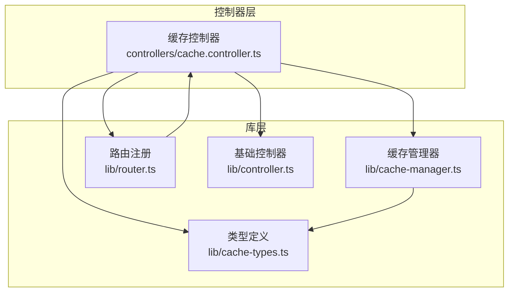
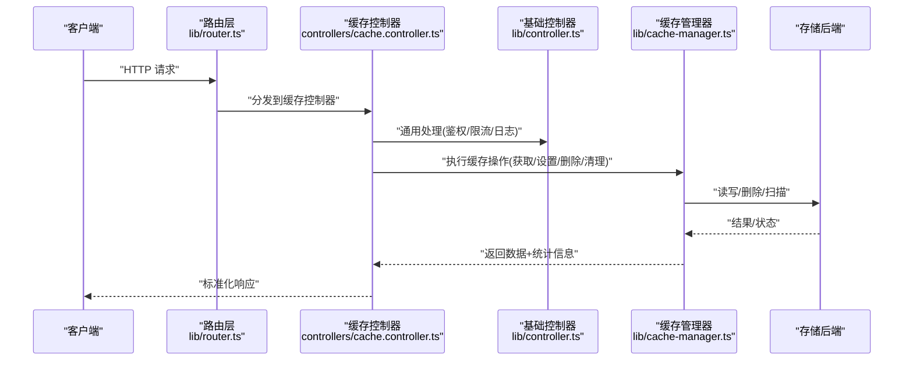
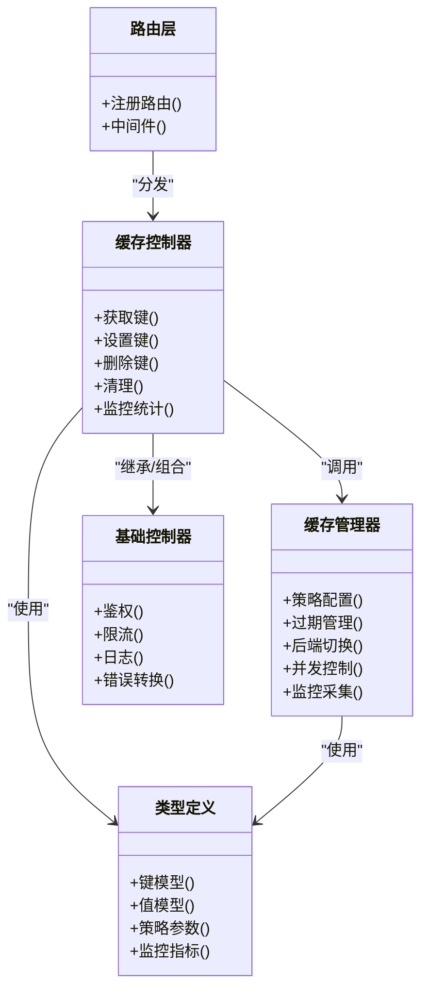

# 缓存控制器

<cite>
**本文引用的文件**   
- [cache.controller.ts](file://controllers/cache.controller.ts)
- [cache-manager.ts](file://lib/cache-manager.ts)
- [cache-types.ts](file://lib/cache-types.ts)
- [controller.ts](file://lib/controller.ts)
- [router.ts](file://lib/router.ts)
</cite>

## 目录
1. [简介](#简介)
2. [项目结构](#项目结构)
3. [核心组件](#核心组件)
4. [架构总览](#架构总览)
5. [详细组件分析](#详细组件分析)
6. [依赖关系分析](#依赖关系分析)
7. [性能考量](#性能考量)
8. [故障排查指南](#故障排查指南)
9. [结论](#结论)
10. [附录](#附录)

## 简介
本文件为 Bun-zlib 项目的“缓存控制器”提供系统化、可操作的文档。内容覆盖：
- 缓存管理 API：获取、设置、删除与清理
- 缓存策略配置：过期时间、TTL、存储后端切换
- 监控与统计：命中率、容量、延迟等指标
- 高级用法：预热、批量操作、条件查询
- 一致性与并发：一致性保证与并发访问控制方案

## 项目结构
围绕缓存功能，本项目采用分层组织：
- 控制器层：对外暴露 HTTP/路由接口，负责请求解析与响应封装
- 库层：实现缓存核心逻辑（策略、过期、后端抽象、监控）
- 类型定义：统一缓存键、值、策略与监控指标的类型约束

图表来源
- [cache.controller.ts](file://controllers/cache.controller.ts)
- [cache-manager.ts](file://lib/cache-manager.ts)
- [cache-types.ts](file://lib/cache-types.ts)
- [router.ts](file://lib/router.ts)
- [controller.ts](file://lib/controller.ts)

章节来源
- [cache.controller.ts](file://controllers/cache.controller.ts)
- [cache-manager.ts](file://lib/cache-manager.ts)
- [cache-types.ts](file://lib/cache-types.ts)
- [router.ts](file://lib/router.ts)
- [controller.ts](file://lib/controller.ts)

## 核心组件
- 缓存控制器：面向外部调用，提供统一的缓存操作入口，包括获取、写入、删除、清理、监控与统计。
- 缓存管理器：实现具体缓存策略（如 TTL、LRU）、过期处理、存储后端抽象与切换、并发控制与监控采集。
- 类型定义：集中描述缓存键、值、策略参数、监控指标等数据结构，确保跨模块一致性。
- 路由与基础控制器：将控制器方法挂载到路由，并提供通用能力（如鉴权、限流、日志）。

章节来源
- [cache.controller.ts](file://controllers/cache.controller.ts)
- [cache-manager.ts](file://lib/cache-manager.ts)
- [cache-types.ts](file://lib/cache-types.ts)
- [router.ts](file://lib/router.ts)
- [controller.ts](file://lib/controller.ts)

## 架构总览
下图展示了从客户端请求到缓存落盘/读出的整体流程，以及监控与统计的接入点。

图表来源
- [router.ts](file://lib/router.ts)
- [cache.controller.ts](file://controllers/cache.controller.ts)
- [controller.ts](file://lib/controller.ts)
- [cache-manager.ts](file://lib/cache-manager.ts)

## 详细组件分析

### 缓存控制器（API 层）
职责
- 接收并校验请求参数
- 调用缓存管理器完成具体操作
- 封装统一响应格式与错误码
- 暴露监控与统计接口

关键接口（按功能分组）
- 获取类
  - 根据键获取缓存项
  - 批量获取多个键
  - 条件获取（存在性检查、版本/标签过滤）
- 设置类
  - 设置单个键值对（支持 TTL/策略）
  - 批量设置
  - 条件设置（仅当不存在或满足条件时写入）
- 删除类
  - 删除单个键
  - 批量删除
  - 按前缀/模式清理
- 清理与维护
  - 主动清理过期项
  - 压缩/合并（若后端支持）
  - 重置指定命名空间
- 监控与统计
  - 获取命中率、容量、使用率、延迟分布
  - 导出统计快照
  - 健康检查与后端状态

并发与一致性
- 写放大保护：通过分布式锁或原子更新避免重复计算
- 幂等写入：基于版本号或条件写入保障一致性
- 读路径优化：本地副本/只读视图减少竞争

示例（以路径引用代替代码）
- 获取单个键：[缓存控制器-获取单个键](file://controllers/cache.controller.ts)
- 批量设置：[缓存控制器-批量设置](file://controllers/cache.controller.ts)
- 条件设置：[缓存控制器-条件设置](file://controllers/cache.controller.ts)
- 按前缀清理：[缓存控制器-按前缀清理](file://controllers/cache.controller.ts)
- 监控统计：[缓存控制器-监控统计](file://controllers/cache.controller.ts)

章节来源
- [cache.controller.ts](file://controllers/cache.controller.ts)

### 缓存管理器（策略与存储）
职责
- 实现缓存策略：TTL、LRU、LFU、命名空间隔离
- 管理过期时间与惰性/主动清理
- 抽象存储后端：内存、文件系统、对象存储、KV 数据库等
- 提供并发控制与监控埋点

核心能力
- 策略配置
  - TTL 默认值与键级覆盖
  - 最大容量与淘汰策略
  - 命名空间与键前缀规则
- 过期管理
  - 惰性过期：读取时检测并剔除
  - 主动过期：定时任务扫描与清理
  - 软过期：允许旧值在后台刷新
- 存储后端切换
  - 运行时切换后端（热插拔）
  - 多后端组合（主存+持久化）
  - 降级与回退策略
- 监控与统计
  - 命中/未命中计数
  - 写入/删除计数
  - 容量与使用率
  - 延迟分位（P50/P95/P99）
  - 后端健康状态

并发与一致性
- 读写锁/细粒度锁：按键或命名空间加锁
- 防击穿：热点键互斥加载
- 防雪崩：随机抖动 TTL、分段过期
- 幂等更新：CAS/版本号

示例（以路径引用代替代码）
- 设置带 TTL 的键：[缓存管理器-设置](file://lib/cache-manager.ts)
- 批量写入：[缓存管理器-批量写入](file://lib/cache-manager.ts)
- 惰性过期与主动清理：[缓存管理器-过期管理](file://lib/cache-manager.ts)
- 后端切换与降级：[缓存管理器-后端管理](file://lib/cache-manager.ts)
- 监控指标采集：[缓存管理器-监控](file://lib/cache-manager.ts)

章节来源
- [cache-manager.ts](file://lib/cache-manager.ts)

### 类型定义（缓存契约）
职责
- 统一定义缓存键、值、策略参数、监控指标等类型
- 作为控制器与管理器之间的契约，降低耦合

重点类型
- 缓存键：命名空间、业务键、扩展元数据
- 缓存值：原始值、序列化形式、版本/标签
- 策略参数：TTL、最大容量、淘汰策略、是否持久化
- 监控指标：命中/未命中、容量、延迟、后端状态

示例（以路径引用代替代码）
- 键与值模型：[类型定义-键值模型](file://lib/cache-types.ts)
- 策略与配置：[类型定义-策略配置](file://lib/cache-types.ts)
- 监控指标：[类型定义-监控指标](file://lib/cache-types.ts)

章节来源
- [cache-types.ts](file://lib/cache-types.ts)

### 路由与基础控制器
职责
- 路由层：将控制器方法映射到 URL 路径，统一处理中间件
- 基础控制器：提供鉴权、限流、日志、错误转换等通用能力

示例（以路径引用代替代码）
- 路由注册：[路由注册](file://lib/router.ts)
- 基础控制器能力：[基础控制器](file://lib/controller.ts)

章节来源
- [router.ts](file://lib/router.ts)
- [controller.ts](file://lib/controller.ts)

## 依赖关系分析
- 控制器依赖管理器与类型定义，遵循“薄控制器、厚服务”的分层原则
- 管理器依赖类型定义，屏蔽存储后端差异
- 路由层解耦控制器与 HTTP 细节，便于测试与替换

图表来源
- [cache.controller.ts](file://controllers/cache.controller.ts)
- [cache-manager.ts](file://lib/cache-manager.ts)
- [cache-types.ts](file://lib/cache-types.ts)
- [router.ts](file://lib/router.ts)
- [controller.ts](file://lib/controller.ts)

章节来源
- [cache.controller.ts](file://controllers/cache.controller.ts)
- [cache-manager.ts](file://lib/cache-manager.ts)
- [cache-types.ts](file://lib/cache-types.ts)
- [router.ts](file://lib/router.ts)
- [controller.ts](file://lib/controller.ts)

## 性能考量
- 读路径优先：尽量命中缓存，减少下游压力
- 批量操作：合并多次 I/O，降低网络与序列化开销
- 惰性过期：读取时清理，避免频繁扫描
- 主动清理：低峰期批量回收，避免阻塞热点路径
- 并发控制：细粒度锁与互斥加载，防止热点键击穿
- 监控驱动：基于命中率与延迟分位持续调优

## 故障排查指南
常见问题与定位步骤
- 命中率异常下降
  - 检查 TTL 配置与键生成策略
  - 查看监控指标的未命中原因分类
  - 确认是否存在大规模失效或雪崩
- 写入失败或超时
  - 检查后端健康状态与容量水位
  - 观察延迟分位与错误码分布
  - 验证并发锁是否导致死锁或长等待
- 数据不一致
  - 核对版本号/CAS 字段
  - 检查条件写入与幂等逻辑
  - 确认多后端同步与回退策略

建议的排查入口
- 监控统计接口：[缓存控制器-监控统计](file://controllers/cache.controller.ts)
- 后端健康与切换：[缓存管理器-后端管理](file://lib/cache-manager.ts)
- 过期与清理任务：[缓存管理器-过期管理](file://lib/cache-manager.ts)

章节来源
- [cache.controller.ts](file://controllers/cache.controller.ts)
- [cache-manager.ts](file://lib/cache-manager.ts)

## 结论
缓存控制器通过清晰的 API 分层与可扩展的存储后端抽象，提供了高可用、高性能且可观测的缓存管理能力。结合策略配置、过期管理与并发控制，可在复杂业务场景下保持数据一致性与系统稳定性。建议在生产环境开启完善的监控与告警，持续优化命中率与延迟指标。

## 附录

### 缓存策略配置清单
- TTL 策略：全局默认与键级覆盖
- 容量与淘汰：最大容量、LRU/LFU 策略
- 命名空间：键前缀与隔离范围
- 持久化：是否落盘与落盘策略
- 降级与回退：后端不可用时的行为

参考位置
- [类型定义-策略配置](file://lib/cache-types.ts)
- [缓存管理器-策略配置](file://lib/cache-manager.ts)

### 监控与统计指标清单
- 命中/未命中计数与比率
- 写入/删除计数
- 容量与使用率
- 延迟分位（P50/P95/P99）
- 后端健康状态与切换次数

参考位置
- [类型定义-监控指标](file://lib/cache-types.ts)
- [缓存管理器-监控](file://lib/cache-manager.ts)
- [缓存控制器-监控统计](file://controllers/cache.controller.ts)

### 高级用法示例（路径指引）
- 缓存预热：启动后批量预置热点键
  - [缓存控制器-批量设置](file://controllers/cache.controller.ts)
  - [缓存管理器-批量写入](file://lib/cache-manager.ts)
- 批量操作：批量获取/设置/删除
  - [缓存控制器-批量获取](file://controllers/cache.controller.ts)
  - [缓存控制器-批量删除](file://controllers/cache.controller.ts)
- 条件查询：存在性检查、版本/标签过滤
  - [缓存控制器-条件获取](file://controllers/cache.controller.ts)
  - [缓存控制器-条件设置](file://controllers/cache.controller.ts)