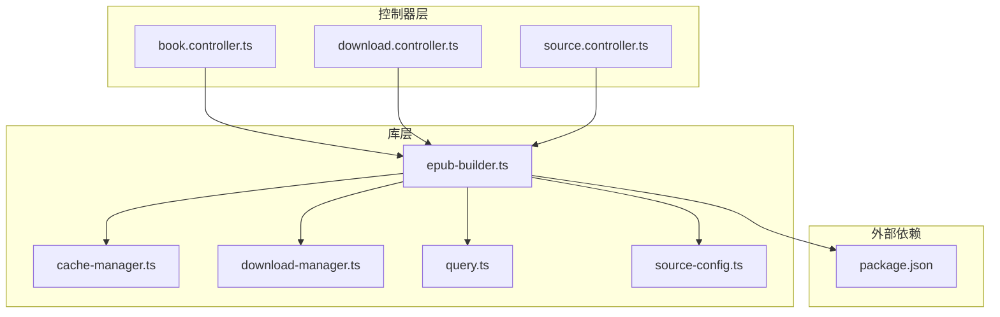
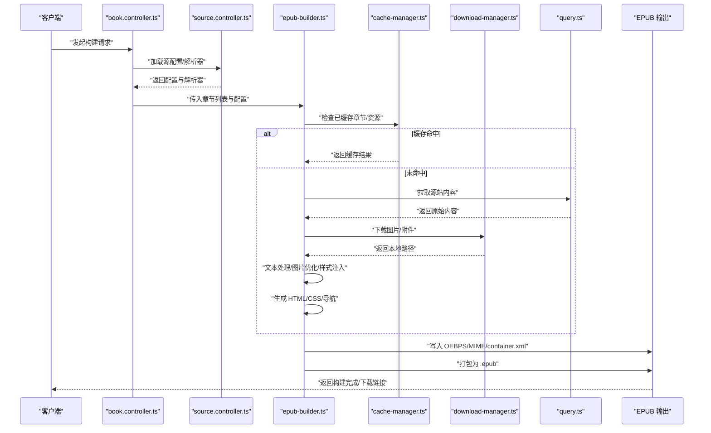
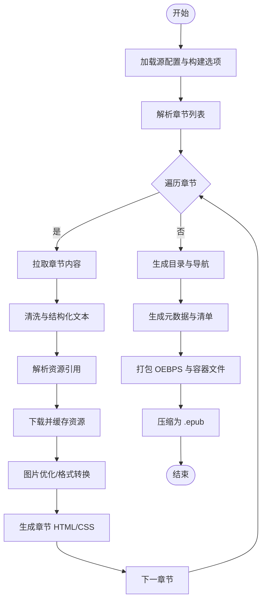
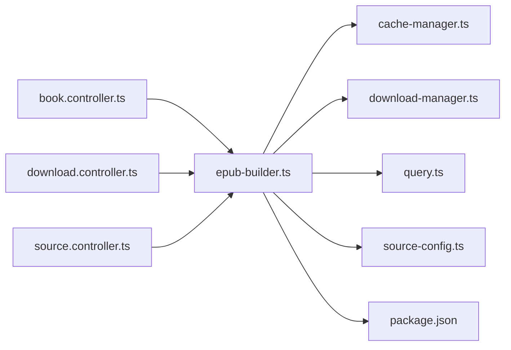

# EPUB 构建器

<cite>
**本文引用的文件**   
- [epub-builder.ts](file://lib/epub-builder.ts)
- [book.controller.ts](file://controllers/book.controller.ts)
- [download.controller.ts](file://controllers/download.controller.ts)
- [source.controller.ts](file://controllers/source.controller.ts)
- [cache-manager.ts](file://lib/cache-manager.ts)
- [download-manager.ts](file://lib/download-manager.ts)
- [query.ts](file://lib/query.ts)
- [source-config.ts](file://lib/source-config.ts)
- [package.json](file://package.json)
</cite>

## 目录
1. [简介](#简介)
2. [项目结构](#项目结构)
3. [核心组件](#核心组件)
4. [架构总览](#架构总览)
5. [详细组件分析](#详细组件分析)
6. [依赖关系分析](#依赖关系分析)
7. [性能与优化](#性能与优化)
8. [故障排查指南](#故障排查指南)
9. [结论](#结论)
10. [附录](#附录)

## 简介
本模块聚焦于 EPUB 构建能力，围绕内容解析、资源打包、元数据生成与目录构建等关键环节，提供从源站抓取到最终可分发 EPUB 的完整流水线。文档将系统阐述：
- EPUB 规范与标准包结构（MIME、容器、清单、导航、样式、媒体）
- 文本处理、图片优化、样式应用与章节分割策略
- 构建配置项、模板机制与批量处理流程
- 压缩策略、质量权衡与错误处理

## 项目结构
本项目采用分层组织方式：控制器负责 HTTP 路由与请求编排；lib 层包含构建器、下载管理、缓存、查询与源配置等核心逻辑；routes 为前端页面路由。EPUB 构建的核心实现位于 lib/epub-builder.ts，并通过控制器暴露 API。

图表来源
- [epub-builder.ts](file://lib/epub-builder.ts)
- [book.controller.ts](file://controllers/book.controller.ts)
- [download.controller.ts](file://controllers/download.controller.ts)
- [source.controller.ts](file://controllers/source.controller.ts)
- [cache-manager.ts](file://lib/cache-manager.ts)
- [download-manager.ts](file://lib/download-manager.ts)
- [query.ts](file://lib/query.ts)
- [source-config.ts](file://lib/source-config.ts)
- [package.json](file://package.json)

章节来源
- [epub-builder.ts](file://lib/epub-builder.ts)
- [book.controller.ts](file://controllers/book.controller.ts)
- [download.controller.ts](file://controllers/download.controller.ts)
- [source.controller.ts](file://controllers/source.controller.ts)
- [cache-manager.ts](file://lib/cache-manager.ts)
- [download-manager.ts](file://lib/download-manager.ts)
- [query.ts](file://lib/query.ts)
- [source-config.ts](file://lib/source-config.ts)
- [package.json](file://package.json)

## 核心组件
- EPUB 构建器（lib/epub-builder.ts）
  - 职责：编排内容解析、资源下载与优化、元数据与目录生成、打包与压缩输出。
  - 关键流程：输入源配置 → 解析章节与正文 → 下载并优化图片 → 生成 HTML/CSS/导航 → 组装 OEBPS 包 → 生成 mimetype 与 container.xml → 打包为 .epub。
- 控制器（controllers/*）
  - book.controller.ts：书籍维度构建入口，协调多章节与批量任务。
  - download.controller.ts：下载相关接口，触发或查询下载/构建任务。
  - source.controller.ts：源站配置与校验，驱动解析器选择。
- 辅助库（lib/*）
  - cache-manager.ts：缓存命中与失效策略，降低重复解析与下载成本。
  - download-manager.ts：并发下载、重试、限速与断点续传。
  - query.ts：通用查询封装，统一错误与超时控制。
  - source-config.ts：源站规则、解析器映射与默认值。

章节来源
- [epub-builder.ts](file://lib/epub-builder.ts)
- [book.controller.ts](file://controllers/book.controller.ts)
- [download.controller.ts](file://controllers/download.controller.ts)
- [source.controller.ts](file://controllers/source.controller.ts)
- [cache-manager.ts](file://lib/cache-manager.ts)
- [download-manager.ts](file://lib/download-manager.ts)
- [query.ts](file://lib/query.ts)
- [source-config.ts](file://lib/source-config.ts)

## 架构总览
下图展示了从请求到 EPUB 产物的端到端流程，涵盖控制器编排、构建器执行、资源管理与缓存交互。

图表来源
- [book.controller.ts](file://controllers/book.controller.ts)
- [source.controller.ts](file://controllers/source.controller.ts)
- [epub-builder.ts](file://lib/epub-builder.ts)
- [cache-manager.ts](file://lib/cache-manager.ts)
- [download-manager.ts](file://lib/download-manager.ts)
- [query.ts](file://lib/query.ts)

## 详细组件分析

### EPUB 构建器（lib/epub-builder.ts）
- 功能要点
  - 章节解析：依据源配置提取标题、正文、分页/分节信息。
  - 资源处理：下载图片与附件，进行尺寸缩放、格式转换与去重。
  - 文本处理：清洗标签、规范化段落、插入锚点与页码标记。
  - 样式应用：注入主题 CSS、字体与响应式布局。
  - 目录构建：生成 NCX/Navigation Document，支持 TOC 与书签。
  - 包结构：创建 OEBPS、mimetype、META-INF/container.xml、manifest/spine/nav。
  - 压缩策略：按类型选择压缩级别，优先对文本类使用高压缩比。
- 关键数据结构
  - 章节模型：标题、正文片段、资源引用、顺序索引。
  - 资源模型：URL、本地路径、类型、哈希、尺寸/质量参数。
  - 元数据模型：书名、作者、语言、版本、描述、封面图。
- 复杂度与优化
  - 文本处理：线性扫描 + 正则替换，注意避免回溯爆炸。
  - 图片优化：先统计再批量处理，减少 I/O 次数；按需生成缩略图。
  - 并发控制：限制下载与转码并发度，避免内存峰值过高。
- 错误处理
  - 网络异常：重试与退避策略，记录失败 URL 与原因。
  - 解析失败：回退到默认解析器或跳过坏章节，保证整体构建不中断。
  - 磁盘空间不足：提前检测并提示，支持增量构建。

章节来源
- [epub-builder.ts](file://lib/epub-builder.ts)

#### 构建流程图（代码级）

图表来源
- [epub-builder.ts](file://lib/epub-builder.ts)

### 控制器层（controllers/*）
- book.controller.ts
  - 作为书籍维度的构建入口，聚合章节、调度构建器、返回进度与结果。
- download.controller.ts
  - 提供下载任务管理接口，支持队列、状态查询与取消。
- source.controller.ts
  - 管理源站配置、解析器注册与校验，确保输入合法性。

章节来源
- [book.controller.ts](file://controllers/book.controller.ts)
- [download.controller.ts](file://controllers/download.controller.ts)
- [source.controller.ts](file://controllers/source.controller.ts)

### 辅助库（lib/*）
- cache-manager.ts
  - 基于键值存储的缓存策略，支持 TTL、LRU 与按资源哈希失效。
- download-manager.ts
  - 并发下载、限速、重试、断点续传与错误隔离。
- query.ts
  - 统一请求封装，含超时、重试与错误归一化。
- source-config.ts
  - 源站规则定义、解析器映射、默认值与扩展点。

章节来源
- [cache-manager.ts](file://lib/cache-manager.ts)
- [download-manager.ts](file://lib/download-manager.ts)
- [query.ts](file://lib/query.ts)
- [source-config.ts](file://lib/source-config.ts)

## 依赖关系分析
- 内部依赖
  - epub-builder.ts 依赖 cache-manager.ts、download-manager.ts、query.ts、source-config.ts。
  - controllers 通过调用 epub-builder.ts 暴露对外 API。
- 外部依赖
  - package.json 声明运行时依赖（如压缩、图像处理、HTTP 客户端等）。

图表来源
- [book.controller.ts](file://controllers/book.controller.ts)
- [download.controller.ts](file://controllers/download.controller.ts)
- [source.controller.ts](file://controllers/source.controller.ts)
- [epub-builder.ts](file://lib/epub-builder.ts)
- [cache-manager.ts](file://lib/cache-manager.ts)
- [download-manager.ts](file://lib/download-manager.ts)
- [query.ts](file://lib/query.ts)
- [source-config.ts](file://lib/source-config.ts)
- [package.json](file://package.json)

章节来源
- [epub-builder.ts](file://lib/epub-builder.ts)
- [package.json](file://package.json)

## 性能与优化
- 文本处理
  - 使用流式读取与分块处理，避免一次性加载大文档导致内存峰值。
  - 正则表达式预编译与白名单过滤，降低回溯风险。
- 图片优化
  - 批量预处理：先收集所有资源，再统一缩放/裁剪/格式转换。
  - 自适应质量：根据目标设备与显示尺寸动态调整 JPEG/WebP 质量。
  - 去重策略：基于内容哈希去重，减少冗余资源。
- 压缩策略
  - mimetype 不压缩，其他文件按类型设置压缩级别。
  - 对 HTML/CSS/JSON 等高可压缩文本使用更高压缩比。
- 并发与缓存
  - 合理设置下载与转码并发度，结合内存上限监控。
  - 利用缓存命中减少重复解析与下载，提升批量构建速度。

[本节为通用指导，无需列出具体文件来源]

## 故障排查指南
- 常见错误
  - 网络超时/连接失败：检查代理与域名解析，启用重试与退避。
  - 图片转码失败：确认图像库可用性与输入格式，降级到原图。
  - 磁盘空间不足：构建前检测可用空间，清理临时目录。
  - 解析器不匹配：核对源配置与解析器规则，必要时添加调试日志。
- 定位方法
  - 开启构建器详细日志，记录每个步骤的输入输出摘要。
  - 使用缓存键追踪资源是否命中，快速定位重复下载问题。
  - 对失败章节单独复现，缩小问题范围。

章节来源
- [epub-builder.ts](file://lib/epub-builder.ts)
- [download-manager.ts](file://lib/download-manager.ts)
- [cache-manager.ts](file://lib/cache-manager.ts)

## 结论
EPUB 构建器以模块化设计实现了从源站到成品的全链路自动化。通过合理的文本与图片处理、严格的包结构与压缩策略，以及完善的缓存与并发控制，能够在保证兼容性的同时显著提升构建效率与输出质量。建议在生产环境结合业务需求调优并发与压缩参数，并完善监控与告警以提升稳定性。

[本节为总结性内容，无需列出具体文件来源]

## 附录

### EPUB 包结构与 MIME 类型
- 根目录
  - mimetype：固定字符串，不被压缩，用于标识 EPUB 包。
  - META-INF/container.xml：指向 OPF 清单文件位置。
- OEBPS（或 content）
  - manifest：资源清单与 ID 映射。
  - spine：阅读顺序与页面序列。
  - nav：导航文档（NCX 或 Navigation Document）。
  - styles：CSS 样式表。
  - images：图片资源（优化后）。
  - text：章节 HTML 文件。
- 打包与压缩
  - 除 mimetype 外，其余文件均参与 ZIP 压缩。
  - 文本类文件建议使用较高压缩比，图片使用有损/无损平衡策略。

[本节为概念性说明，无需列出具体文件来源]

### 构建配置选项（示例字段）
- 源站与解析器
  - sourceId：源站标识
  - parser：解析器名称或自定义函数
  - rules：解析规则（标题、正文、分页、资源）
- 内容与样式
  - theme：主题名或自定义 CSS 路径
  - fontSize：基础字号
  - lineSpacing：行间距
- 资源与优化
  - imageQuality：图片质量（0-100）
  - imageMaxWidth：最大宽度
  - imageFormat：输出格式（auto/jpg/webp/png）
  - deduplicate：是否去重
- 打包与输出
  - compressLevel：压缩级别（1-9）
  - outputDir：输出目录
  - filenameTemplate：文件名模板
- 并发与缓存
  - downloadConcurrency：下载并发数
  - cacheTTL：缓存过期时间
  - retryTimes：重试次数

[本节为配置说明，无需列出具体文件来源]

### 自定义模板使用
- 模板位置
  - 在配置中指定模板目录或模板字符串。
- 模板变量
  - 书名、作者、章节标题、正文片段、资源路径、样式引用等。
- 渲染流程
  - 加载模板 → 注入变量 → 生成 HTML → 加入清单与导航。

[本节为概念性说明，无需列出具体文件来源]

### 批量处理示例（流程）
- 输入：书籍列表或章节清单
- 步骤：
  - 并行加载源配置
  - 逐个章节解析与缓存
  - 批量下载与优化资源
  - 生成目录与元数据
  - 打包输出
- 输出：单个 EPUB 或按章节拆分的多文件包

[本节为概念性说明，无需列出具体文件来源]