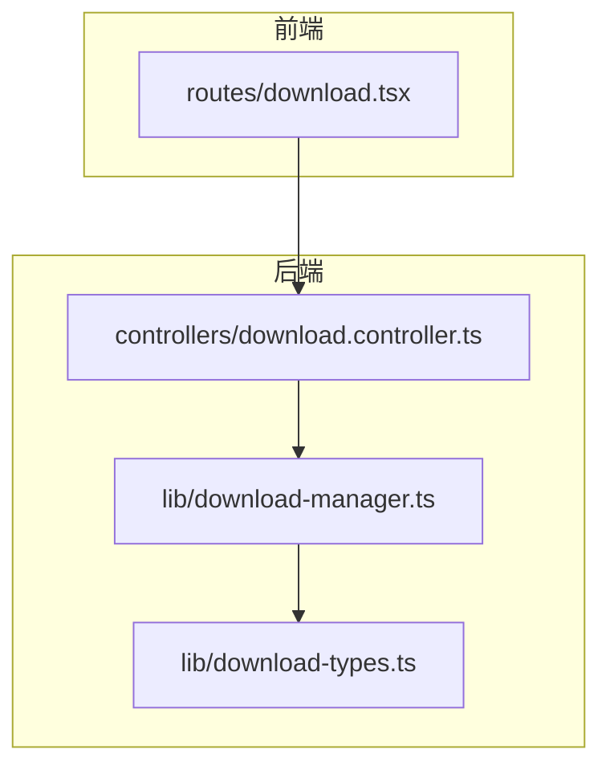
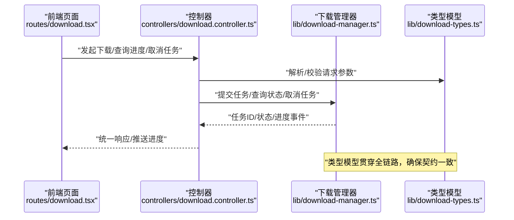
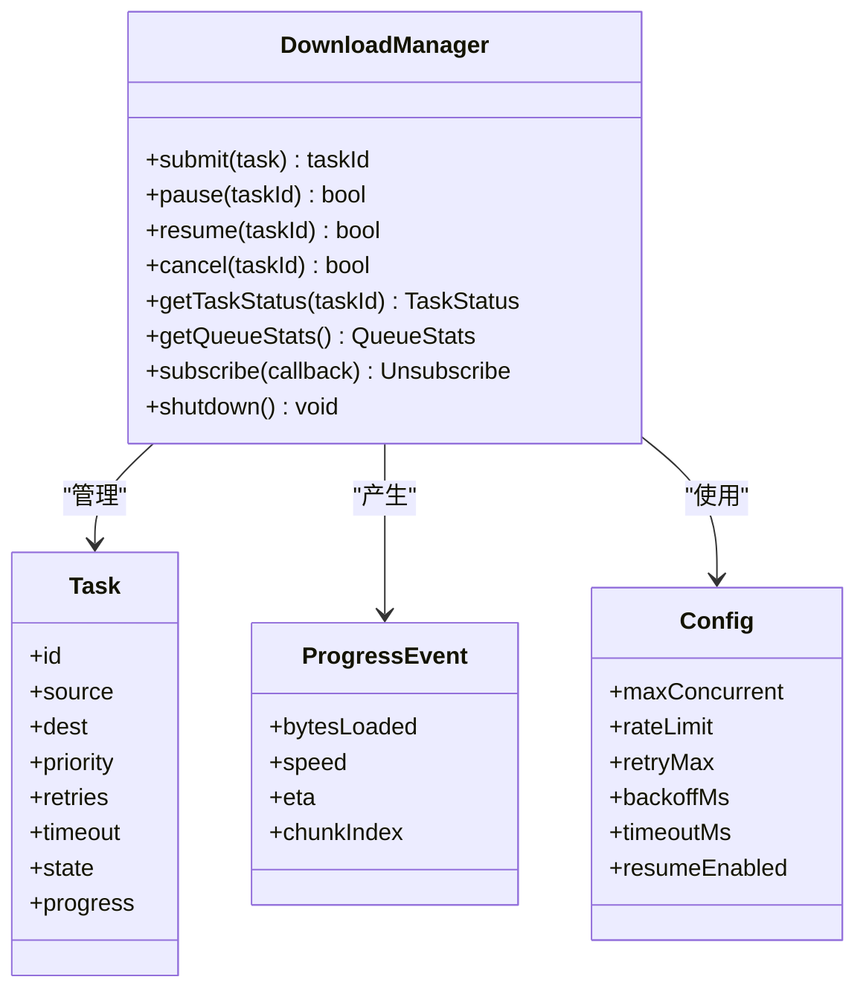
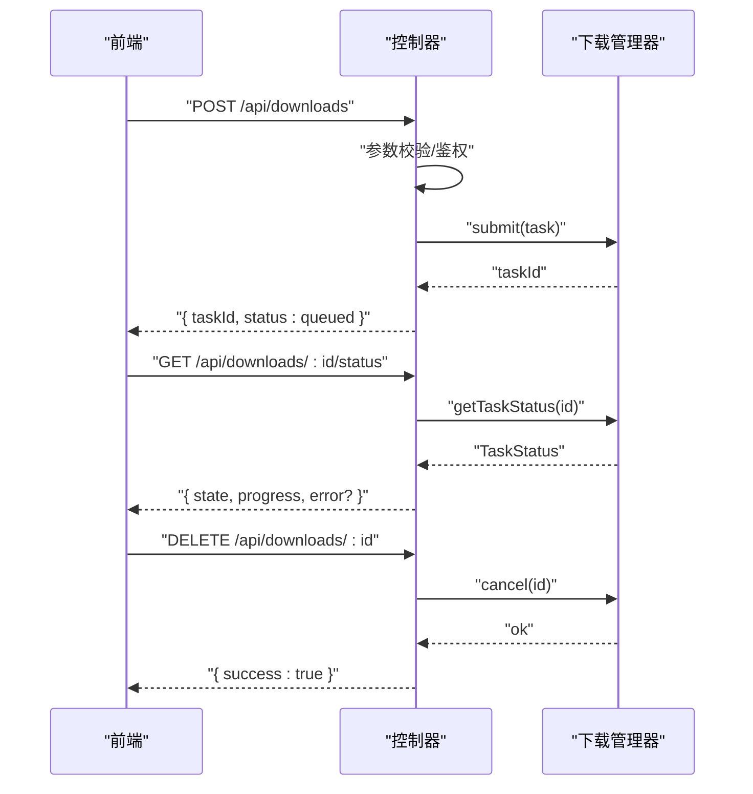
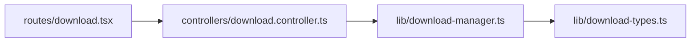

# 下载管理器

<cite>
**本文引用的文件**   
- [download-manager.ts](file://lib/download-manager.ts)
- [download-types.ts](file://lib/download-types.ts)
- [download.controller.ts](file://controllers/download.controller.ts)
- [download.tsx](file://routes/download.tsx)
</cite>

## 目录
1. [简介](#简介)
2. [项目结构](#项目结构)
3. [核心组件](#核心组件)
4. [架构总览](#架构总览)
5. [详细组件分析](#详细组件分析)
6. [依赖关系分析](#依赖关系分析)
7. [性能考量](#性能考量)
8. [故障排查指南](#故障排查指南)
9. [结论](#结论)
10. [附录](#附录)

## 简介
本文件面向“下载管理器”模块，系统性说明并发控制、任务队列、进度跟踪与错误恢复策略；阐述下载任务生命周期、网络请求处理、文件写入优化与断点续传实现；定义下载类型、任务状态模型与回调接口；并提供配置参数、速率限制、重试机制与监控接口的使用示例。文档以代码级事实为依据，辅以可视化图示帮助理解。

## 项目结构
下载相关能力集中在以下位置：
- 类型与模型：lib/download-types.ts
- 核心逻辑：lib/download-manager.ts
- 控制器（HTTP/路由层）：controllers/download.controller.ts
- 前端页面（展示与交互）：routes/download.tsx

图表来源
- [download.tsx](file://routes/download.tsx)
- [download.controller.ts](file://controllers/download.controller.ts)
- [download-manager.ts](file://lib/download-manager.ts)
- [download-types.ts](file://lib/download-types.ts)

章节来源
- [download-manager.ts](file://lib/download-manager.ts)
- [download-types.ts](file://lib/download-types.ts)
- [download.controller.ts](file://controllers/download.controller.ts)
- [download.tsx](file://routes/download.tsx)

## 核心组件
- 类型与模型（download-types.ts）
  - 定义下载任务、任务状态、进度事件、错误类型、回调接口与配置项等基础数据结构。
- 下载管理器（download-manager.ts）
  - 提供任务入队/出队、并发控制、进度上报、错误重试、断点续传、取消与清理等核心能力。
- 控制器（download.controller.ts）
  - 暴露 HTTP 接口，将外部请求转换为内部任务调度指令，并返回统一响应格式。
- 前端页面（download.tsx）
  - 渲染下载列表、发起下载请求、订阅进度与完成事件、展示失败与重试入口。

章节来源
- [download-types.ts](file://lib/download-types.ts)
- [download-manager.ts](file://lib/download-manager.ts)
- [download.controller.ts](file://controllers/download.controller.ts)
- [download.tsx](file://routes/download.tsx)

## 架构总览
整体采用“前端页面 -> 控制器 -> 下载管理器 -> 类型模型”的分层结构。控制器负责协议适配与鉴权校验，下载管理器负责业务编排与资源管理，类型模型贯穿各层保证契约一致。

图表来源
- [download.tsx](file://routes/download.tsx)
- [download.controller.ts](file://controllers/download.controller.ts)
- [download-manager.ts](file://lib/download-manager.ts)
- [download-types.ts](file://lib/download-types.ts)

## 详细组件分析

### 类型与模型（download-types.ts）
- 下载任务
  - 唯一标识、源地址、目标路径、元数据、优先级、超时、重试策略等字段。
- 任务状态
  - 待执行、排队中、进行中、暂停、成功、失败、已取消等状态枚举。
- 进度事件
  - 累计字节、瞬时速率、分片进度、剩余时间估算等。
- 错误类型
  - 网络错误、权限错误、磁盘错误、超时、取消等分类。
- 回调接口
  - onProgress、onSuccess、onFailure、onCancel 等回调签名。
- 配置项
  - 最大并发、速率限制、超时、重试次数/退避策略、缓存/断点策略等。

章节来源
- [download-types.ts](file://lib/download-types.ts)

### 下载管理器（download-manager.ts）
- 并发控制
  - 基于令牌桶或信号量实现全局并发上限，按任务优先级抢占空闲槽位。
- 任务队列
  - 支持 FIFO 与优先级队列混合；支持暂停/恢复、批量操作与持久化快照。
- 进度跟踪
  - 通过流式读取与分块写入，周期性聚合进度并触发回调；支持增量上报与去抖。
- 错误恢复
  - 指数退避重试、可配置的最大重试次数；对可恢复错误进行细粒度分类与告警。
- 断点续传
  - 记录已下载偏移与分片校验和；支持 Range 请求与本地临时文件合并。
- 文件写入优化
  - 使用流式写入、零拷贝优化（如适用）、顺序 I/O 与缓冲池减少系统调用。
- 生命周期管理
  - 创建 -> 入队 -> 调度 -> 执行 -> 完成/失败 -> 清理；支持中途取消与优雅退出。
- 监控接口
  - 暴露当前队列长度、活跃任务数、吞吐统计、错误率、平均耗时等指标。

图表来源
- [download-manager.ts](file://lib/download-manager.ts)
- [download-types.ts](file://lib/download-types.ts)

章节来源
- [download-manager.ts](file://lib/download-manager.ts)
- [download-types.ts](file://lib/download-types.ts)

### 控制器（download.controller.ts）
- 职责
  - 接收前端请求，校验参数，调用下载管理器，封装统一响应。
- 关键接口
  - 提交下载、查询任务状态、获取进度、取消任务、批量操作、健康检查。
- 错误处理
  - 将底层异常映射为 HTTP 状态码与结构化错误体，便于前端展示与重试。

图表来源
- [download.controller.ts](file://controllers/download.controller.ts)
- [download-manager.ts](file://lib/download-manager.ts)

章节来源
- [download.controller.ts](file://controllers/download.controller.ts)
- [download-manager.ts](file://lib/download-manager.ts)

### 前端页面（download.tsx）
- 功能
  - 表单输入下载源与目标，发起下载；实时显示进度条与速度；失败时提供重试按钮；支持取消。
- 交互
  - 使用轮询或 SSE/WebSocket 订阅进度；在任务完成后自动刷新列表。

章节来源
- [download.tsx](file://routes/download.tsx)

## 依赖关系分析
- 模块内依赖
  - 控制器依赖下载管理器；下载管理器依赖类型模型；前端依赖控制器暴露的 API。
- 外部依赖
  - 网络库用于 HTTP 请求与流式传输；文件系统用于分片写入与合并；可选存储用于持久化任务状态。

图表来源
- [download.tsx](file://routes/download.tsx)
- [download.controller.ts](file://controllers/download.controller.ts)
- [download-manager.ts](file://lib/download-manager.ts)
- [download-types.ts](file://lib/download-types.ts)

章节来源
- [download.tsx](file://routes/download.tsx)
- [download.controller.ts](file://controllers/download.controller.ts)
- [download-manager.ts](file://lib/download-manager.ts)
- [download-types.ts](file://lib/download-types.ts)

## 性能考量
- 并发与吞吐
  - 合理设置最大并发与速率限制，避免打满 CPU/IO；根据目标介质特性调整缓冲区大小。
- 内存占用
  - 流式读写降低峰值内存；对大文件启用分片与惰性加载。
- 磁盘 I/O
  - 顺序写入优先；必要时使用异步 I/O 与写合并；避免频繁 fsync。
- 网络
  - 复用连接、开启 Keep-Alive；利用 Range 请求实现断点续传；对慢速节点实施限速与退避。
- 监控
  - 采集吞吐、延迟、错误率、队列深度等指标，结合告警阈值进行容量规划。

[本节为通用指导，不直接分析具体文件]

## 故障排查指南
- 常见问题
  - 任务长时间处于排队：检查并发上限与队列积压情况。
  - 下载中断后无法续传：确认断点信息是否持久化且未被清理。
  - 频繁失败重试：查看错误分类与退避策略，定位上游限流或网络抖动。
  - 进度不更新：检查进度上报频率与去抖策略。
- 诊断步骤
  - 通过监控接口获取队列与任务指标；对照日志中的错误类型与堆栈；复现最小用例验证。
- 恢复建议
  - 对可恢复错误启用重试；对不可恢复错误快速失败并提示用户；必要时重置任务状态并重新入队。

章节来源
- [download-manager.ts](file://lib/download-manager.ts)
- [download.controller.ts](file://controllers/download.controller.ts)

## 结论
下载管理器通过清晰的类型契约、分层架构与完善的并发/队列/进度/错误处理机制，提供了稳定高效的下载能力。配合合理的配置与监控，可在复杂网络与高负载场景下保持良好体验与可靠性。

[本节为总结性内容，不直接分析具体文件]

## 附录

### 下载类型与任务状态模型
- 下载类型
  - 单文件、多文件打包、增量同步等。
- 任务状态
  - 待执行、排队中、进行中、暂停、成功、失败、已取消。
- 进度事件
  - 累计字节、瞬时速率、ETA、分片索引。
- 错误类型
  - 网络错误、权限错误、磁盘错误、超时、取消。
- 回调接口
  - onProgress、onSuccess、onFailure、onCancel。

章节来源
- [download-types.ts](file://lib/download-types.ts)

### 下载配置参数
- 并发与队列
  - 最大并发数、队列容量、优先级策略。
- 网络与超时
  - 连接超时、读取超时、重试次数、退避间隔。
- 速率限制
  - 全局速率上限、每任务速率上限。
- 断点续传
  - 是否启用、分片大小、校验算法。
- 存储与路径
  - 目标目录、临时目录、命名规则。

章节来源
- [download-types.ts](file://lib/download-types.ts)
- [download-manager.ts](file://lib/download-manager.ts)

### 使用示例（概念流程）
- 提交下载
  - 前端构造任务对象，调用控制器接口，获得任务 ID。
- 查询状态与进度
  - 定期轮询或通过事件通道订阅进度，更新 UI。
- 取消与重试
  - 用户主动取消；失败后根据错误类型选择立即重试或延后重试。
- 监控与告警
  - 拉取队列与任务指标，达到阈值触发告警。

章节来源
- [download.controller.ts](file://controllers/download.controller.ts)
- [download-manager.ts](file://lib/download-manager.ts)
- [download.tsx](file://routes/download.tsx)