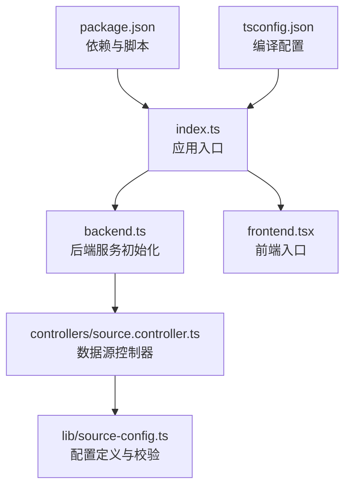
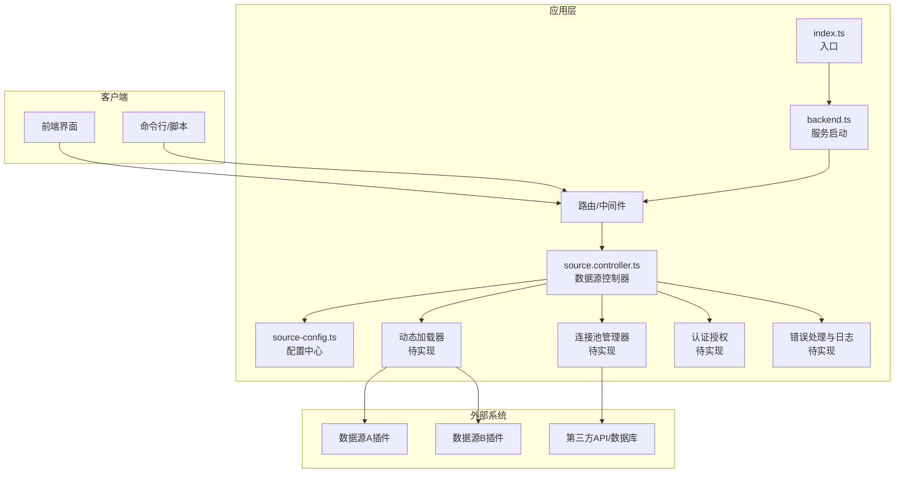
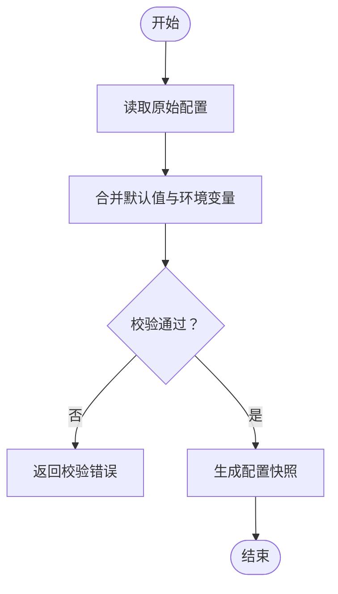
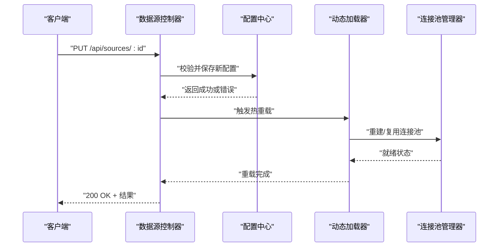
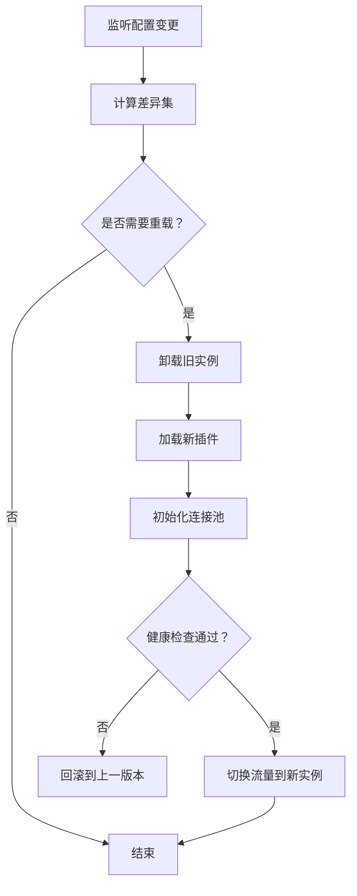
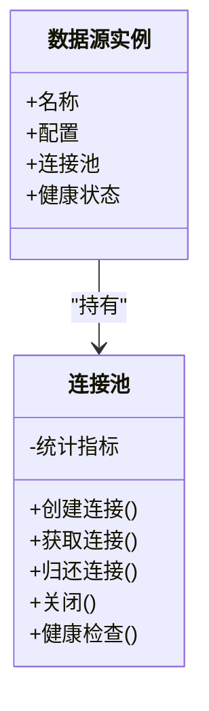
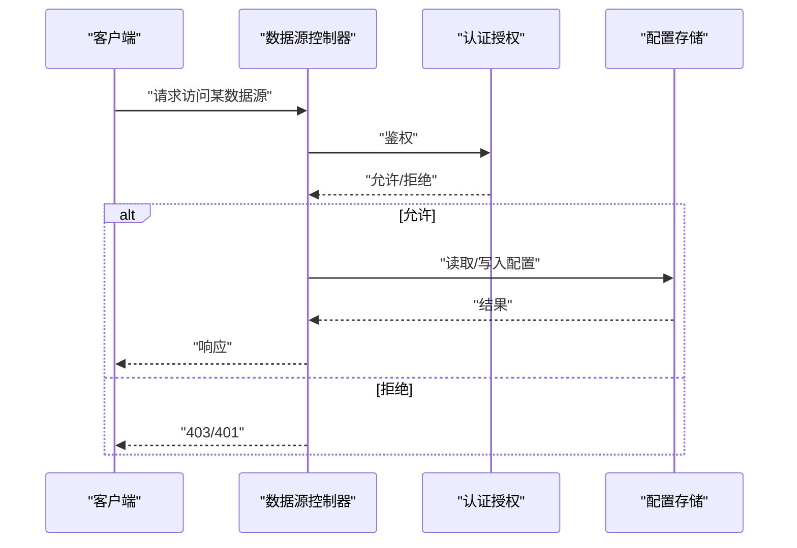
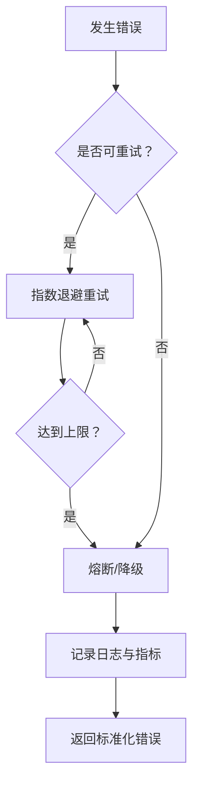
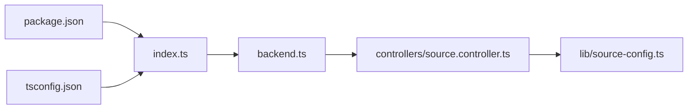

# 数据源配置

<cite>
**本文引用的文件**   
- [backend.ts](file://backend.ts)
- [index.ts](file://index.ts)
- [frontend.tsx](file://frontend.tsx)
- [package.json](file://package.json)
- [tsconfig.json](file://tsconfig.json)
- [CLAUDE.md](file://CLAUDE.md)
- [README.md](file://README.md)
- [lib/source-config.ts](file://lib/source-config.ts)
- [controllers/source.controller.ts](file://controllers/source.controller.ts)
</cite>

## 目录
1. [简介](#简介)
2. [项目结构](#项目结构)
3. [核心组件](#核心组件)
4. [架构总览](#架构总览)
5. [详细组件分析](#详细组件分析)
6. [依赖关系分析](#依赖关系分析)
7. [性能考虑](#性能考虑)
8. [故障排查指南](#故障排查指南)
9. [结论](#结论)
10. [附录](#附录)

## 简介
本文件围绕“数据源配置模块”进行系统化文档化，重点覆盖：
- 数据源插件架构与接口规范
- 配置管理机制（验证、默认值、环境适配）
- 动态加载系统与热重载能力
- 连接池管理策略
- 认证授权模型
- 错误处理与可观测性
- 自定义数据源开发指南、配置模板与集成示例

说明：当前仓库未包含 lib/sources 下的具体实现文件，因此本文在涉及具体实现细节时以“待补充/建议方案”形式给出，并明确标注来源范围。

## 项目结构
从仓库根目录可见，数据源相关代码主要位于以下位置：
- 配置定义与解析：lib/source-config.ts
- 控制器层（HTTP API）：controllers/source.controller.ts
- 应用入口与路由挂载：index.ts、backend.ts、frontend.tsx
- 工程与运行配置：package.json、tsconfig.json、README.md、CLAUDE.md

图表来源
- [index.ts](file://index.ts)
- [backend.ts](file://backend.ts)
- [controllers/source.controller.ts](file://controllers/source.controller.ts)
- [lib/source-config.ts](file://lib/source-config.ts)
- [frontend.tsx](file://frontend.tsx)
- [package.json](file://package.json)
- [tsconfig.json](file://tsconfig.json)

章节来源
- [index.ts](file://index.ts)
- [backend.ts](file://backend.ts)
- [controllers/source.controller.ts](file://controllers/source.controller.ts)
- [lib/source-config.ts](file://lib/source-config.ts)
- [frontend.tsx](file://frontend.tsx)
- [package.json](file://package.json)
- [tsconfig.json](file://tsconfig.json)

## 核心组件
本节聚焦数据源配置模块的核心职责与边界：
- 配置定义与校验：提供统一的数据源配置类型、必填字段、默认值与环境变量注入规则
- 控制器接口：暴露数据源的增删改查、启用/禁用、健康检查等 HTTP 端点
- 动态加载：按配置发现并加载数据源插件，支持运行时更新
- 连接池：为每个数据源实例维护连接资源，控制并发与超时
- 认证授权：对数据源访问进行鉴权与审计
- 错误处理：标准化错误码、重试与降级策略

章节来源
- [lib/source-config.ts](file://lib/source-config.ts)
- [controllers/source.controller.ts](file://controllers/source.controller.ts)

## 架构总览
下图展示数据源配置模块在系统中的位置与交互关系。

图表来源
- [index.ts](file://index.ts)
- [backend.ts](file://backend.ts)
- [controllers/source.controller.ts](file://controllers/source.controller.ts)
- [lib/source-config.ts](file://lib/source-config.ts)

## 详细组件分析

### 配置定义与校验（lib/source-config.ts）
职责
- 定义数据源配置的 Schema（字段、类型、约束、默认值）
- 提供配置合并与校验逻辑（含环境变量注入）
- 输出标准化的配置对象供控制器与加载器使用

关键流程
- 读取原始配置（文件/环境变量/内存）
- 合并默认值与用户覆盖项
- 执行字段级校验与类型转换
- 生成只读的配置快照供运行时使用

图表来源
- [lib/source-config.ts](file://lib/source-config.ts)

章节来源
- [lib/source-config.ts](file://lib/source-config.ts)

### 数据源控制器（controllers/source.controller.ts）
职责
- 暴露数据源管理的 HTTP API（如创建、更新、删除、查询、启用/禁用、健康检查）
- 调用配置中心获取/写入配置
- 触发动态加载器重新加载指定数据源
- 协调连接池的创建与回收
- 统一错误响应格式

典型请求序列（以“更新并热重载数据源”为例）

图表来源
- [controllers/source.controller.ts](file://controllers/source.controller.ts)
- [lib/source-config.ts](file://lib/source-config.ts)

章节来源
- [controllers/source.controller.ts](file://controllers/source.controller.ts)

### 动态加载系统（待实现）
目标
- 基于配置自动发现并加载数据源插件
- 支持运行时热重载（无需重启进程）
- 提供插件生命周期钩子（初始化、销毁、健康检查）

建议设计要点
- 插件注册表：集中管理已加载插件及其版本信息
- 增量加载：仅变更受影响的数据源实例
- 隔离与回滚：失败时回滚到上一稳定版本
- 可观测性：记录加载耗时、错误堆栈与指标

[此图为概念性流程图，不直接映射具体源码文件]

### 连接池管理（待实现）
目标
- 为每个数据源实例维护连接池，控制并发、超时与重试
- 支持按租户/命名空间隔离
- 提供连接泄漏检测与告警

建议指标
- 活跃连接数、等待队列长度、平均/分位延迟
- 错误率、超时率、重试次数
- 连接创建/销毁速率

[此图为概念类图，不直接映射具体源码文件]

### 认证授权（待实现）
目标
- 对数据源访问进行鉴权（RBAC/ABAC）
- 支持多租户隔离与审计日志
- 敏感配置加密存储与最小权限原则

建议流程
- 请求进入控制器前进行身份核验与权限判定
- 根据角色/标签决定可操作的数据源集合
- 记录审计事件（谁、何时、做了什么）

[此图为概念时序图，不直接映射具体源码文件]

### 错误处理策略（待实现）
目标
- 统一错误码与消息结构
- 区分可恢复与不可恢复错误
- 提供重试、熔断与降级机制

建议分类
- 参数校验错误（客户端问题）
- 配置错误（部署/运维问题）
- 网络/IO 错误（临时性，可重试）
- 上游服务异常（需熔断/降级）

[此图为概念流程图，不直接映射具体源码文件]

## 依赖关系分析
- 入口与启动
  - index.ts 负责应用启动与依赖装配
  - backend.ts 负责后端服务初始化与中间件注册
- 控制器与配置
  - controllers/source.controller.ts 依赖 lib/source-config.ts 提供的配置能力
- 工程配置
  - package.json 声明依赖与脚本
  - tsconfig.json 控制 TypeScript 编译行为

图表来源
- [index.ts](file://index.ts)
- [backend.ts](file://backend.ts)
- [controllers/source.controller.ts](file://controllers/source.controller.ts)
- [lib/source-config.ts](file://lib/source-config.ts)
- [package.json](file://package.json)
- [tsconfig.json](file://tsconfig.json)

章节来源
- [index.ts](file://index.ts)
- [backend.ts](file://backend.ts)
- [controllers/source.controller.ts](file://controllers/source.controller.ts)
- [lib/source-config.ts](file://lib/source-config.ts)
- [package.json](file://package.json)
- [tsconfig.json](file://tsconfig.json)

## 性能考虑
- 配置校验缓存：避免重复解析与校验，采用只读快照提升读取性能
- 连接池调优：根据 QPS 与延迟目标设置最大连接数、空闲回收时间与超时阈值
- 热重载粒度：按数据源维度增量重载，减少全局抖动
- 指标与采样：采集关键路径耗时与错误率，结合采样降低开销
- 序列化优化：大配置对象采用懒加载与按需展开

[本节为通用指导，不直接分析具体文件]

## 故障排查指南
常见问题与建议定位步骤
- 配置校验失败
  - 检查字段类型、必填项与枚举值
  - 确认环境变量注入是否正确
  - 参考配置 Schema 的定义位置
- 热重载无效
  - 确认控制器是否触发了重载流程
  - 检查插件加载器是否捕获到变更事件
  - 查看健康检查是否通过
- 连接池耗尽
  - 观察活跃连接与等待队列指标
  - 调整最大连接数与超时时间
  - 排查上游服务慢查询或阻塞
- 认证失败
  - 核对令牌/凭据与权限策略
  - 检查审计日志中的拒绝原因

章节来源
- [lib/source-config.ts](file://lib/source-config.ts)
- [controllers/source.controller.ts](file://controllers/source.controller.ts)

## 结论
数据源配置模块以“配置即契约”为核心，通过统一的配置 Schema、控制器编排与可扩展的动态加载体系，支撑多数据源接入、运行时热重载与稳定的连接池管理。后续应优先补齐动态加载器、连接池与认证授权的具体实现，并完善错误处理与可观测性，以提升系统的可靠性与可维护性。

[本节为总结性内容，不直接分析具体文件]

## 附录

### 自定义数据源开发指南
- 插件接口约定
  - 必须实现：初始化、查询/读写、健康检查、销毁
  - 可选实现：批量操作、事务、分页游标、流式传输
- 配置要求
  - 提供唯一标识、类型、连接参数、认证凭据、超时与重试策略
  - 遵循配置 Schema 的字段约束与默认值
- 生命周期
  - 启动阶段：注册到插件注册表，建立连接池
  - 运行阶段：响应控制器请求，上报健康与指标
  - 停止阶段：优雅关闭连接，释放资源
- 测试建议
  - 单元测试：覆盖配置校验、错误分支
  - 集成测试：对接真实或 Mock 的上游服务
  - 压力测试：验证连接池与热重载稳定性

[本节为通用指导，不直接分析具体文件]

### 配置模板（示例结构）
以下为推荐的数据源配置键名与含义（用于快速上手），实际字段以 lib/source-config.ts 中定义的 Schema 为准：
- id: 数据源唯一标识
- type: 数据源类型（如 http、db、grpc 等）
- name: 显示名称
- enabled: 是否启用
- connection: 连接参数（host、port、database、timeout 等）
- auth: 认证信息（token、secret、证书等）
- retry: 重试策略（maxAttempts、backoff）
- pool: 连接池参数（maxConnections、idleTimeout）
- tags: 标签（用于分组与权限）

[本节为通用模板，不直接分析具体文件]

### 集成示例（端到端流程）
- 新增数据源
  - 调用控制器端点提交配置
  - 配置中心校验并持久化
  - 触发动态加载器加载插件并建立连接池
- 修改配置并热重载
  - 更新配置后，控制器触发增量重载
  - 新实例健康检查通过后切换流量
- 下线数据源
  - 禁用后逐步回收连接，最终卸载插件

[本节为通用流程，不直接分析具体文件]