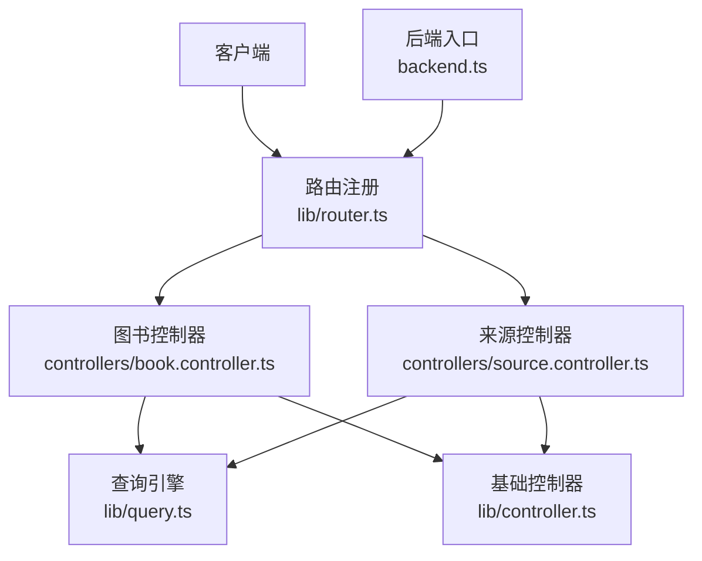
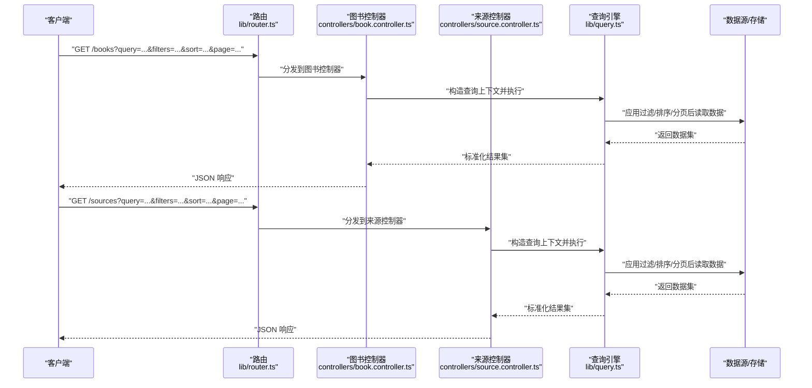
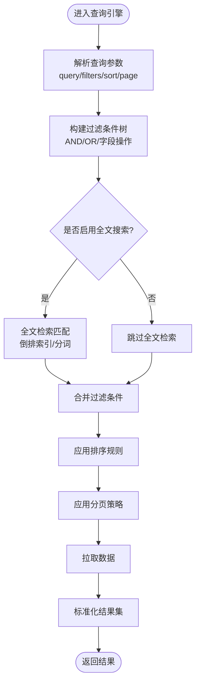
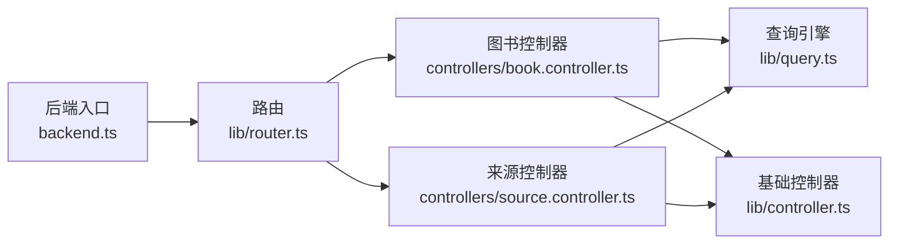

# 查询引擎

<cite>
**本文引用的文件**   
- [lib/query.ts](file://lib/query.ts)
- [controllers/book.controller.ts](file://controllers/book.controller.ts)
- [controllers/source.controller.ts](file://controllers/source.controller.ts)
- [lib/controller.ts](file://lib/controller.ts)
- [lib/router.ts](file://lib/router.ts)
- [backend.ts](file://backend.ts)
</cite>

## 目录
1. [简介](#简介)
2. [项目结构](#项目结构)
3. [核心组件](#核心组件)
4. [架构总览](#架构总览)
5. [详细组件分析](#详细组件分析)
6. [依赖分析](#依赖分析)
7. [性能考虑](#性能考虑)
8. [故障排查指南](#故障排查指南)
9. [结论](#结论)
10. [附录](#附录)

## 简介
本章节面向“查询引擎模块”，围绕搜索算法实现、过滤条件组合、排序逻辑与分页处理机制展开，同时覆盖查询语法支持、索引优化策略、全文搜索与模糊匹配能力。文档还包含查询构建器 API、结果集处理流程、性能调优技巧、复杂查询示例、自定义过滤器实现方法与查询性能分析方法，帮助读者快速掌握并高效使用查询引擎。

## 项目结构
查询相关代码主要位于 lib/query.ts，控制器层通过 controllers/*.controller.ts 暴露 HTTP 接口，路由由 lib/router.ts 注册，后端入口在 backend.ts。整体采用分层设计：HTTP 控制器负责参数校验与响应封装；查询引擎负责解析查询、组合过滤、排序与分页；数据源抽象由控制器或上层服务提供。

图表来源
- [lib/router.ts](file://lib/router.ts)
- [controllers/book.controller.ts](file://controllers/book.controller.ts)
- [controllers/source.controller.ts](file://controllers/source.controller.ts)
- [lib/query.ts](file://lib/query.ts)
- [lib/controller.ts](file://lib/controller.ts)
- [backend.ts](file://backend.ts)

章节来源
- [lib/query.ts](file://lib/query.ts)
- [controllers/book.controller.ts](file://controllers/book.controller.ts)
- [controllers/source.controller.ts](file://controllers/source.controller.ts)
- [lib/controller.ts](file://lib/controller.ts)
- [lib/router.ts](file://lib/router.ts)
- [backend.ts](file://backend.ts)

## 核心组件
- 查询引擎（lib/query.ts）
  - 职责：解析查询字符串/对象、构建过滤条件、执行排序与分页、返回标准化结果集。
  - 关键能力：多条件组合（AND/OR）、字段级过滤、范围查询、模糊匹配、全文检索、排序键与方向、分页偏移与限制。
- 控制器（controllers/*.controller.ts）
  - 职责：接收 HTTP 请求、参数校验、调用查询引擎、封装响应。
- 基础控制器（lib/controller.ts）
  - 职责：通用错误处理、日志、统一响应格式等。
- 路由（lib/router.ts）
  - 职责：将 URL 路径映射到控制器方法。
- 后端入口（backend.ts）
  - 职责：启动服务、挂载路由、配置中间件。

章节来源
- [lib/query.ts](file://lib/query.ts)
- [controllers/book.controller.ts](file://controllers/book.controller.ts)
- [controllers/source.controller.ts](file://controllers/source.controller.ts)
- [lib/controller.ts](file://lib/controller.ts)
- [lib/router.ts](file://lib/router.ts)
- [backend.ts](file://backend.ts)

## 架构总览
下图展示了从 HTTP 请求到查询引擎处理的端到端流程，包括参数解析、过滤组合、排序与分页、结果返回。

图表来源
- [lib/router.ts](file://lib/router.ts)
- [controllers/book.controller.ts](file://controllers/book.controller.ts)
- [controllers/source.controller.ts](file://controllers/source.controller.ts)
- [lib/query.ts](file://lib/query.ts)

## 详细组件分析

### 查询引擎（lib/query.ts）
- 功能要点
  - 查询解析：支持 query 文本、filters 对象、sort 数组、page/pageSize 分页参数。
  - 过滤组合：支持 AND/OR 组合、字段精确匹配、范围比较、前缀/后缀/子串匹配、布尔标记。
  - 全文搜索：对指定字段进行分词与倒排索引式匹配（若底层数据源支持）。
  - 模糊匹配：基于编辑距离或近似匹配策略，控制阈值与候选集大小。
  - 排序：多字段排序，支持升序/降序与复合排序优先级。
  - 分页：offset/limit 或 cursor 模式，保证稳定排序以避免重复或缺失。
  - 结果集：标准化返回结构，包含数据列表、总数、页码、每页数量、是否有下一页等元信息。
- 复杂度与性能
  - 过滤阶段尽量下推到数据源侧以减少内存占用。
  - 全文检索优先命中索引字段，避免全表扫描。
  - 模糊匹配限定候选集规模，必要时结合前缀过滤缩小范围。
  - 排序与分页在数据源层完成，减少网络传输与序列化开销。
- 扩展点
  - 自定义过滤器：以插件形式注册，按字段名或表达式匹配。
  - 自定义排序器：针对特定字段类型实现比较函数。
  - 自定义分页器：支持游标分页或时间窗口分页。

图表来源
- [lib/query.ts](file://lib/query.ts)

章节来源
- [lib/query.ts](file://lib/query.ts)

### 图书控制器（controllers/book.controller.ts）
- 职责
  - 接收图书查询请求，校验参数，调用查询引擎，返回统一 JSON。
  - 提供常用快捷查询（如热门、最新、分类聚合）。
- 安全与健壮性
  - 参数白名单校验，防止注入与越权访问。
  - 分页边界保护，限制最大 page/pageSize。
- 集成点
  - 通过基础控制器复用错误处理与响应封装。

章节来源
- [controllers/book.controller.ts](file://controllers/book.controller.ts)
- [lib/controller.ts](file://lib/controller.ts)

### 来源控制器（controllers/source.controller.ts）
- 职责
  - 接收来源查询请求，复用查询引擎，返回来源列表与元信息。
  - 支持按状态、类型、可用性等多维度筛选。
- 性能
  - 缓存热点查询结果，降低数据库压力。
  - 批量聚合统计，减少多次往返。

章节来源
- [controllers/source.controller.ts](file://controllers/source.controller.ts)
- [lib/controller.ts](file://lib/controller.ts)

### 路由与后端入口（lib/router.ts, backend.ts）
- 路由
  - 将 /books 与 /sources 路径映射到对应控制器方法。
  - 支持查询参数透传到控制器与查询引擎。
- 后端入口
  - 初始化服务、加载路由、启动监听端口。
  - 全局中间件用于日志、跨域、限流等。

章节来源
- [lib/router.ts](file://lib/router.ts)
- [backend.ts](file://backend.ts)

## 依赖分析
- 组件耦合
  - 控制器依赖查询引擎与基础控制器，低耦合高内聚。
  - 路由仅负责分发，不承载业务逻辑。
- 外部依赖
  - 数据源抽象（未在本仓库中展示具体实现），查询引擎通过接口与其交互。
- 潜在循环依赖
  - 当前结构无直接循环引用风险。

图表来源
- [lib/router.ts](file://lib/router.ts)
- [controllers/book.controller.ts](file://controllers/book.controller.ts)
- [controllers/source.controller.ts](file://controllers/source.controller.ts)
- [lib/query.ts](file://lib/query.ts)
- [lib/controller.ts](file://lib/controller.ts)
- [backend.ts](file://backend.ts)

章节来源
- [lib/router.ts](file://lib/router.ts)
- [controllers/book.controller.ts](file://controllers/book.controller.ts)
- [controllers/source.controller.ts](file://controllers/source.controller.ts)
- [lib/query.ts](file://lib/query.ts)
- [lib/controller.ts](file://lib/controller.ts)
- [backend.ts](file://backend.ts)

## 性能考虑
- 查询优化
  - 优先使用索引字段进行过滤与排序，避免全表扫描。
  - 全文检索时限定字段集合，减少分词与倒排索引构建成本。
  - 模糊匹配设置阈值上限与候选集上限，避免 O(n^2) 计算。
- 分页优化
  - 使用稳定排序键（如主键+更新时间）避免翻页抖动。
  - 大数据量场景建议采用游标分页替代 offset/limit。
- 缓存策略
  - 对热点查询结果进行短期缓存，设置合理 TTL。
  - 聚合类查询可预计算并异步更新。
- 监控与诊断
  - 记录慢查询日志，统计各过滤条件的命中率。
  - 对排序与分页的耗时进行采样，定位瓶颈。

[本节为通用性能指导，无需列出具体文件来源]

## 故障排查指南
- 常见问题
  - 查询超时：检查是否存在全表扫描或未命中索引的过滤条件。
  - 结果不一致：确认排序键是否稳定，分页是否使用游标或稳定排序。
  - 模糊匹配过慢：降低阈值或缩小候选集，增加前缀过滤。
- 调试步骤
  - 打印查询计划与执行时间，定位慢环节。
  - 逐步放宽过滤条件，观察性能变化。
  - 开启详细日志，追踪参数解析与结果集大小。
- 恢复措施
  - 临时降级：关闭全文检索或模糊匹配，退回精确匹配。
  - 限流与熔断：对异常流量进行保护，避免雪崩。

章节来源
- [lib/query.ts](file://lib/query.ts)
- [controllers/book.controller.ts](file://controllers/book.controller.ts)
- [controllers/source.controller.ts](file://controllers/source.controller.ts)

## 结论
查询引擎通过清晰的参数解析、灵活的过滤组合、稳定的排序与分页机制，提供了高性能且可扩展的搜索能力。配合控制器层的参数校验与响应封装，以及路由与后端入口的统一管理，形成了稳健的分层架构。通过索引优化、缓存策略与监控诊断，可在大规模数据场景下保持良好性能与稳定性。

[本节为总结性内容，无需列出具体文件来源]

## 附录

### 查询语法与 API 参考
- 查询参数
  - query：全文检索关键词
  - filters：对象或数组，支持字段精确、范围、前缀/后缀/子串匹配，支持 AND/OR 组合
  - sort：数组，元素为 {field, direction}，支持多字段排序
  - page/pageSize：分页参数，或 cursor 模式
- 结果集结构
  - data：数据列表
  - total：总数
  - page/pageSize：当前页与每页数量
  - hasMore：是否有下一页
- 示例用法（概念性）
  - 精确匹配与范围组合：filters={status:"active", price:{min:10,max:100}}
  - 全文检索：query="科幻 小说"
  - 多字段排序：sort=[{field:"createdAt",direction:"desc"},{field:"score",direction:"asc"}]
  - 分页：page=2&pageSize=20 或 cursor="abc123"

[本节为概念性说明，无需列出具体文件来源]

### 自定义过滤器实现
- 步骤
  - 定义过滤器接口：字段名、操作符、值类型。
  - 注册过滤器：在查询引擎中按字段名或表达式匹配。
  - 实现匹配逻辑：确保幂等与可缓存。
  - 单元测试：覆盖边界条件与异常输入。
- 注意事项
  - 避免在过滤器中进行昂贵计算。
  - 对敏感字段进行权限校验。
  - 记录过滤器命中率以便优化。

[本节为概念性说明，无需列出具体文件来源]

### 复杂查询示例
- 多条件组合：AND 多个精确匹配 + OR 范围匹配 + 全文检索
- 动态排序：根据用户偏好切换排序键
- 深度分页：使用游标分页避免大偏移性能问题
- 聚合统计：按分类/标签分组计数，结合缓存提升性能

[本节为概念性说明，无需列出具体文件来源]