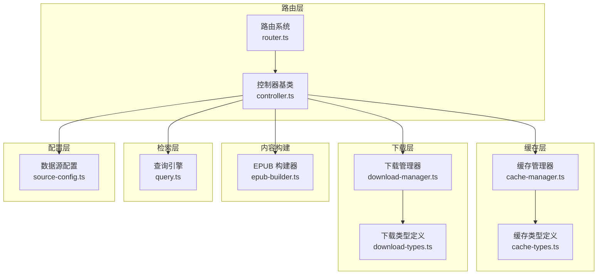
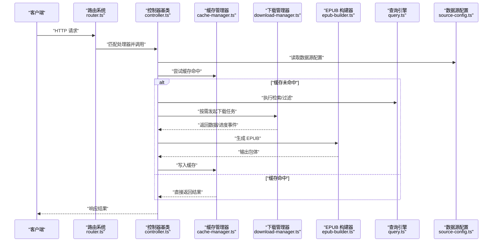
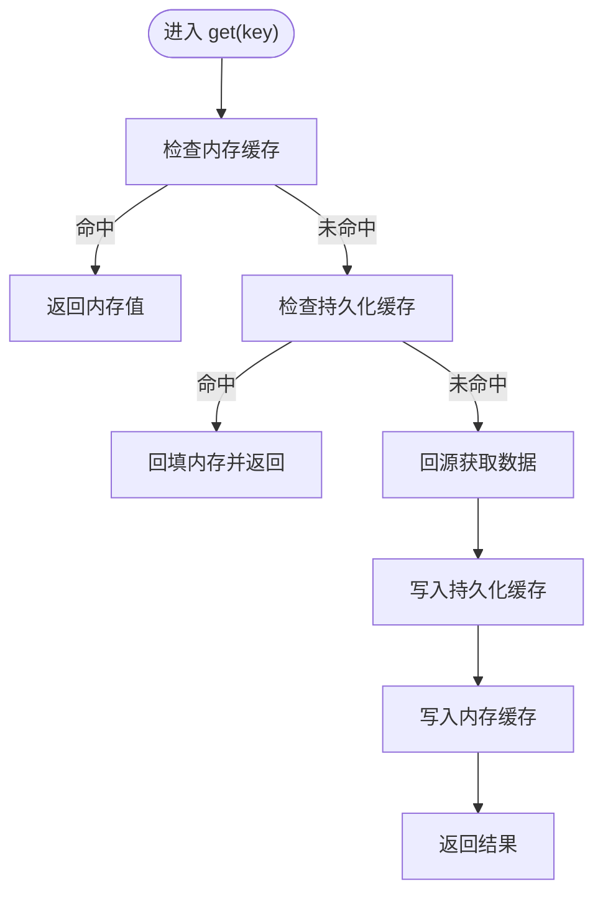
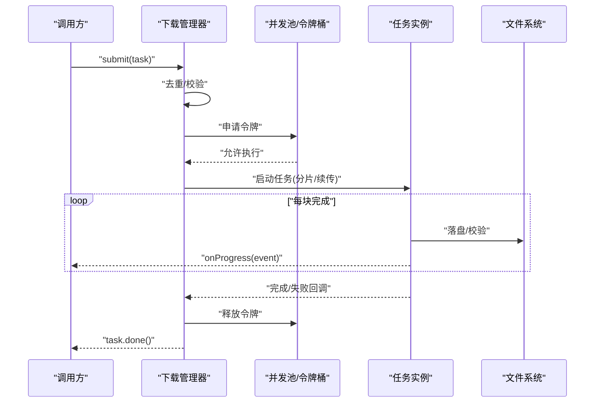
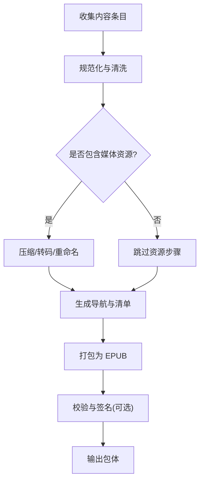
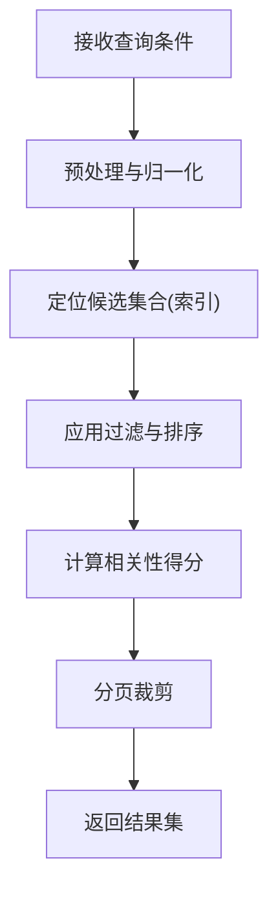
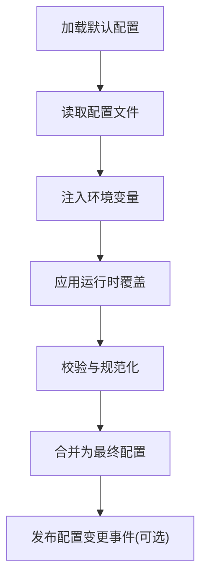
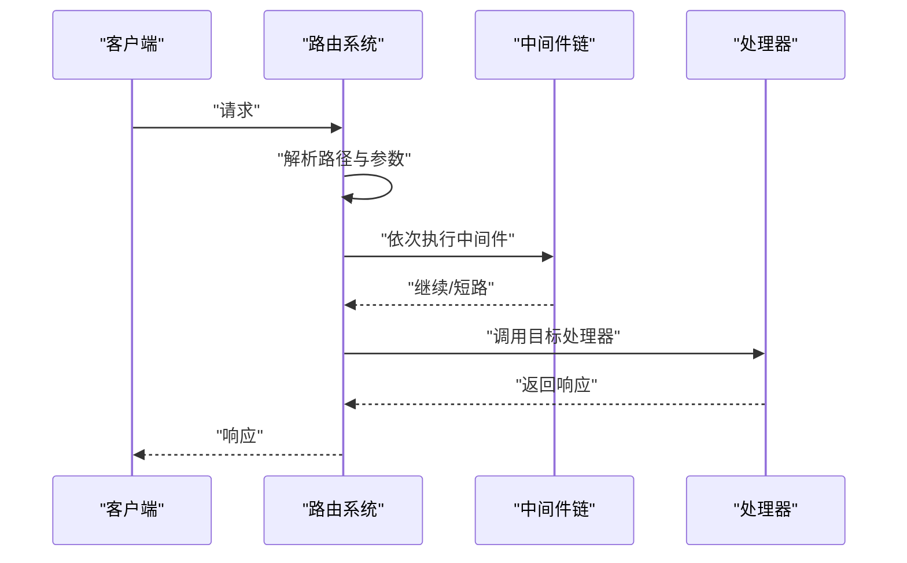
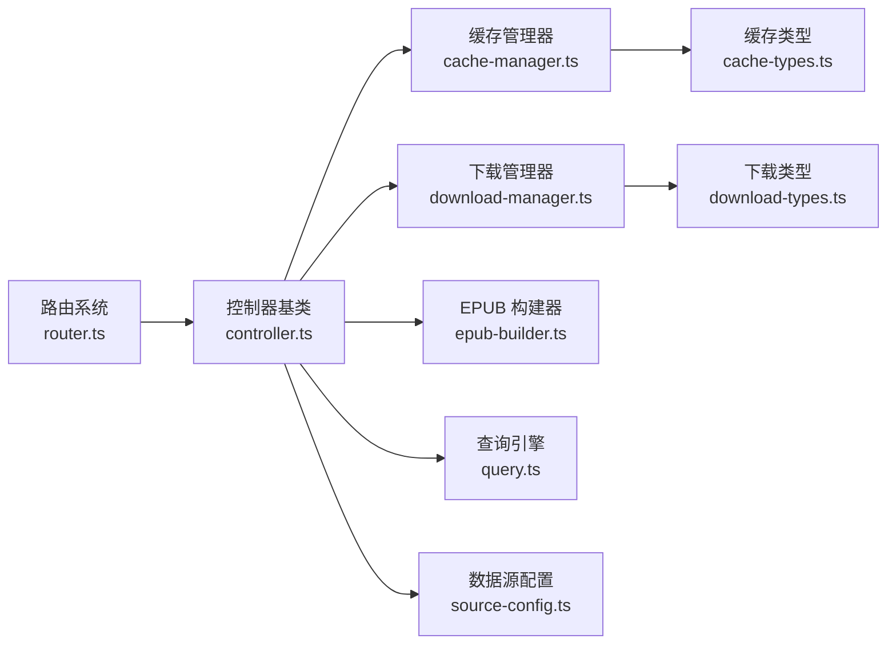

# 核心库模块

<cite>
**本文引用的文件**   
- [cache-manager.ts](file://lib/cache-manager.ts)
- [cache-types.ts](file://lib/cache-types.ts)
- [download-manager.ts](file://lib/download-manager.ts)
- [download-types.ts](file://lib/download-types.ts)
- [epub-builder.ts](file://lib/epub-builder.ts)
- [query.ts](file://lib/query.ts)
- [source-config.ts](file://lib/source-config.ts)
- [router.ts](file://lib/router.ts)
- [controller.ts](file://lib/controller.ts)
</cite>

## 目录
1. [简介](#简介)
2. [项目结构](#项目结构)
3. [核心组件](#核心组件)
4. [架构总览](#架构总览)
5. [详细组件分析](#详细组件分析)
6. [依赖关系分析](#依赖关系分析)
7. [性能考虑](#性能考虑)
8. [故障排查指南](#故障排查指南)
9. [结论](#结论)
10. [附录：接口与最佳实践](#附录接口与最佳实践)

## 简介
本文件聚焦于 lib 目录下的核心库模块，系统性阐述各模块的职责、实现要点、协作关系与数据流向。重点覆盖以下方面：
- 缓存管理器的多级缓存策略
- 下载管理器的并发控制与进度跟踪
- EPUB 构建器的格式转换逻辑
- 查询引擎的搜索算法
- 数据源配置的管理机制
- 路由系统的分发逻辑

文档同时提供模块间协作图、关键流程时序图与流程图，并给出使用示例与最佳实践建议，帮助读者快速理解与集成这些核心能力。

## 项目结构
lib 目录采用按职责划分的模块化组织方式，每个文件对应一个清晰的内聚能力：
- 缓存层：cache-manager.ts、cache-types.ts
- 下载层：download-manager.ts、download-types.ts
- 内容构建：epub-builder.ts
- 检索层：query.ts
- 配置层：source-config.ts
- 路由层：router.ts
- 控制器基类：controller.ts

图表来源
- [cache-manager.ts](file://lib/cache-manager.ts)
- [cache-types.ts](file://lib/cache-types.ts)
- [download-manager.ts](file://lib/download-manager.ts)
- [download-types.ts](file://lib/download-types.ts)
- [epub-builder.ts](file://lib/epub-builder.ts)
- [query.ts](file://lib/query.ts)
- [source-config.ts](file://lib/source-config.ts)
- [router.ts](file://lib/router.ts)
- [controller.ts](file://lib/controller.ts)

章节来源
- [cache-manager.ts](file://lib/cache-manager.ts)
- [cache-types.ts](file://lib/cache-types.ts)
- [download-manager.ts](file://lib/download-manager.ts)
- [download-types.ts](file://lib/download-types.ts)
- [epub-builder.ts](file://lib/epub-builder.ts)
- [query.ts](file://lib/query.ts)
- [source-config.ts](file://lib/source-config.ts)
- [router.ts](file://lib/router.ts)
- [controller.ts](file://lib/controller.ts)

## 核心组件
本节概述各核心模块的职责边界与对外能力，为后续深入分析奠定基础。

- 缓存管理器（cache-manager.ts）
  - 职责：提供统一的多级缓存访问接口，协调内存、磁盘等存储后端，负责命中判定、回源与失效策略。
  - 关键点：键空间隔离、TTL 管理、写穿透/回源降级、统计指标暴露。

- 缓存类型（cache-types.ts）
  - 职责：定义缓存项、元数据、策略枚举与错误码等共享类型。
  - 关键点：可扩展的元数据结构、序列化兼容、版本化字段。

- 下载管理器（download-manager.ts）
  - 职责：管理并发下载任务、断点续传、分片与重试、进度事件上报。
  - 关键点：令牌桶/信号量限流、任务状态机、去重与幂等、资源清理。

- 下载类型（download-types.ts）
  - 职责：定义任务描述、进度事件、错误分类等共享类型。
  - 关键点：进度粒度、可观测性字段、失败原因枚举。

- EPUB 构建器（epub-builder.ts）
  - 职责：将结构化内容转换为标准 EPUB 包，处理章节、图片、样式与元数据。
  - 关键点：内容规范化、资源引用修复、打包顺序与校验。

- 查询引擎（query.ts）
  - 职责：提供文本/结构化检索能力，支持关键词匹配、过滤与排序。
  - 关键点：索引策略、倒排/前缀树、相关性评分、分页与高亮。

- 数据源配置（source-config.ts）
  - 职责：加载、校验与合并多数据源配置，提供运行时访问。
  - 关键点：默认值与覆盖、热更新、敏感信息脱敏。

- 路由系统（router.ts）
  - 职责：解析请求路径、匹配处理器、执行中间件链与参数注入。
  - 关键点：前缀路由、动态段、错误传播、鉴权钩子。

- 控制器基类（controller.ts）
  - 职责：封装通用响应构造、日志、异常捕获与上下文注入。
  - 关键点：统一错误码、审计日志、可插拔中间件。

章节来源
- [cache-manager.ts](file://lib/cache-manager.ts)
- [cache-types.ts](file://lib/cache-types.ts)
- [download-manager.ts](file://lib/download-manager.ts)
- [download-types.ts](file://lib/download-types.ts)
- [epub-builder.ts](file://lib/epub-builder.ts)
- [query.ts](file://lib/query.ts)
- [source-config.ts](file://lib/source-config.ts)
- [router.ts](file://lib/router.ts)
- [controller.ts](file://lib/controller.ts)

## 架构总览
下图展示从路由到具体业务模块的典型调用链路，体现“路由分发 → 控制器 → 领域服务”的分层协作。

图表来源
- [router.ts](file://lib/router.ts)
- [controller.ts](file://lib/controller.ts)
- [cache-manager.ts](file://lib/cache-manager.ts)
- [download-manager.ts](file://lib/download-manager.ts)
- [epub-builder.ts](file://lib/epub-builder.ts)
- [query.ts](file://lib/query.ts)
- [source-config.ts](file://lib/source-config.ts)

## 详细组件分析

### 缓存管理器（多级缓存策略）
- 设计要点
  - 多级层次：内存缓存优先，未命中时回源至持久化存储；支持扩展更多层级。
  - 键空间：基于命名空间与复合键避免冲突。
  - TTL 与失效：支持全局与局部过期策略，支持主动失效与被动淘汰。
  - 一致性：写穿透保证强一致场景，或写后无效保证最终一致。
  - 可观测性：命中率、延迟、容量等指标。

- 典型流程（读路径）

图表来源
- [cache-manager.ts](file://lib/cache-manager.ts)
- [cache-types.ts](file://lib/cache-types.ts)

章节来源
- [cache-manager.ts](file://lib/cache-manager.ts)
- [cache-types.ts](file://lib/cache-types.ts)

### 下载管理器（并发控制与进度跟踪）
- 设计要点
  - 并发控制：通过令牌桶/信号量限制最大并发，避免压垮网络与磁盘。
  - 任务模型：支持分片、断点续传、重试与退避。
  - 进度上报：以事件形式推送字节数、速率、剩余时间等。
  - 幂等与去重：相同任务标识复用已有任务，避免重复下载。
  - 资源清理：取消、失败与完成后的资源回收。

- 典型流程（任务提交与执行）

图表来源
- [download-manager.ts](file://lib/download-manager.ts)
- [download-types.ts](file://lib/download-types.ts)

章节来源
- [download-manager.ts](file://lib/download-manager.ts)
- [download-types.ts](file://lib/download-types.ts)

### EPUB 构建器（格式转换逻辑）
- 设计要点
  - 输入规范：章节、图片、样式、元数据的标准化结构。
  - 资源处理：图片压缩、尺寸适配、引用路径修正。
  - 包结构：遵循 EPUB 规范的组织与清单生成。
  - 校验：完整性与兼容性检查。

- 构建流程

图表来源
- [epub-builder.ts](file://lib/epub-builder.ts)

章节来源
- [epub-builder.ts](file://lib/epub-builder.ts)

### 查询引擎（搜索算法）
- 设计要点
  - 索引策略：倒排索引/前缀树结合，兼顾全文与前缀匹配。
  - 过滤与排序：多维条件组合、权重打分与分页。
  - 性能优化：缓存热点查询、惰性加载、增量更新。
  - 可观测性：耗时、命中率、TopK 分布。

- 查询流程

图表来源
- [query.ts](file://lib/query.ts)

章节来源
- [query.ts](file://lib/query.ts)

### 数据源配置（管理机制）
- 设计要点
  - 加载顺序：内置默认 → 配置文件 → 环境变量 → 运行时覆盖。
  - 校验与容错：必填字段校验、默认值填充、异常降级。
  - 安全：敏感字段脱敏、只读视图。
  - 热更新：监听变更并平滑生效。

- 配置合并流程

图表来源
- [source-config.ts](file://lib/source-config.ts)

章节来源
- [source-config.ts](file://lib/source-config.ts)

### 路由系统（分发逻辑）
- 设计要点
  - 匹配规则：静态前缀、动态段、通配符。
  - 中间件链：鉴权、限流、日志、参数校验。
  - 错误传播：统一错误处理与恢复。
  - 性能：路由表预编译、哈希查找。

- 请求分发时序

图表来源
- [router.ts](file://lib/router.ts)
- [controller.ts](file://lib/controller.ts)

章节来源
- [router.ts](file://lib/router.ts)
- [controller.ts](file://lib/controller.ts)

## 依赖关系分析
- 内聚与耦合
  - 控制器作为编排者，依赖缓存、下载、构建、查询与配置模块，保持低耦合。
  - 类型定义集中管理，减少跨模块重复声明。
- 外部依赖
  - 文件系统、网络 I/O、序列化/反序列化、加密/签名等由底层库提供。
- 潜在循环依赖
  - 当前分层清晰，未见循环导入风险；新增模块应遵循单向依赖原则。

图表来源
- [router.ts](file://lib/router.ts)
- [controller.ts](file://lib/controller.ts)
- [cache-manager.ts](file://lib/cache-manager.ts)
- [download-manager.ts](file://lib/download-manager.ts)
- [epub-builder.ts](file://lib/epub-builder.ts)
- [query.ts](file://lib/query.ts)
- [source-config.ts](file://lib/source-config.ts)
- [cache-types.ts](file://lib/cache-types.ts)
- [download-types.ts](file://lib/download-types.ts)

章节来源
- [router.ts](file://lib/router.ts)
- [controller.ts](file://lib/controller.ts)
- [cache-manager.ts](file://lib/cache-manager.ts)
- [download-manager.ts](file://lib/download-manager.ts)
- [epub-builder.ts](file://lib/epub-builder.ts)
- [query.ts](file://lib/query.ts)
- [source-config.ts](file://lib/source-config.ts)
- [cache-types.ts](file://lib/cache-types.ts)
- [download-types.ts](file://lib/download-types.ts)

## 性能考虑
- 缓存
  - 合理设置 TTL 与容量上限，避免内存膨胀；对热点键启用本地缓存。
  - 批量读写与写合并降低 I/O 压力。
- 下载
  - 根据网络与磁盘特性调整并发度；对大文件启用分片与断点续传。
  - 失败指数退避与熔断，避免雪崩。
- 构建
  - 并行处理独立资源；对图片进行有损/无损压缩权衡。
  - 增量构建，仅重建变更部分。
- 查询
  - 建立合适索引；对高频查询做结果缓存；分页与投影减少传输。
- 路由
  - 预编译路由表；中间件尽量轻量，避免阻塞。

[本节为通用指导，不直接分析具体文件]

## 故障排查指南
- 缓存相关问题
  - 现象：命中率低、频繁回源、数据不一致。
  - 排查：核对键空间与命名空间；检查 TTL 与失效策略；确认写穿透/回源路径。
- 下载相关问题
  - 现象：任务卡住、进度不更新、重复下载。
  - 排查：检查令牌桶配额与任务状态机；确认去重键；查看失败重试与退避。
- 构建问题
  - 现象：生成的 EPUB 无法打开、资源缺失。
  - 排查：验证资源引用路径；检查打包顺序与清单；运行完整性校验。
- 查询问题
  - 现象：结果不准确、超时。
  - 排查：审查索引更新；检查过滤条件与排序权重；评估分页大小。
- 配置问题
  - 现象：配置未生效、敏感信息泄露。
  - 排查：确认加载顺序与覆盖优先级；开启脱敏；监听热更新事件。

章节来源
- [cache-manager.ts](file://lib/cache-manager.ts)
- [download-manager.ts](file://lib/download-manager.ts)
- [epub-builder.ts](file://lib/epub-builder.ts)
- [query.ts](file://lib/query.ts)
- [source-config.ts](file://lib/source-config.ts)

## 结论
lib 目录下的核心模块围绕“配置驱动、路由分发、缓存加速、下载编排、内容构建与检索”形成完整闭环。通过清晰的职责划分与类型抽象，模块间协作顺畅、扩展性强。建议在接入新能力时遵循现有分层与类型约定，充分利用缓存与并发控制，确保性能与稳定性。

[本节为总结性内容，不直接分析具体文件]

## 附录：接口与最佳实践
- 缓存管理器
  - 使用要点：为不同业务域划分命名空间；为热点数据设置较短 TTL；在写路径选择写穿透或写后失效策略。
  - 参考路径：[cache-manager.ts](file://lib/cache-manager.ts)、[cache-types.ts](file://lib/cache-types.ts)
- 下载管理器
  - 使用要点：为任务分配唯一 ID 以实现幂等；合理设置并发度；订阅进度事件用于 UI 反馈。
  - 参考路径：[download-manager.ts](file://lib/download-manager.ts)、[download-types.ts](file://lib/download-types.ts)
- EPUB 构建器
  - 使用要点：提前规范化内容与资源；对图片进行压缩；构建完成后执行校验。
  - 参考路径：[epub-builder.ts](file://lib/epub-builder.ts)
- 查询引擎
  - 使用要点：维护合适的索引；对复杂查询拆分阶段；对 TopK 结果做缓存。
  - 参考路径：[query.ts](file://lib/query.ts)
- 数据源配置
  - 使用要点：明确覆盖优先级；对敏感字段脱敏；监听配置变更事件。
  - 参考路径：[source-config.ts](file://lib/source-config.ts)
- 路由系统与控制器
  - 使用要点：中间件尽量无副作用；统一错误码与日志；利用控制器基类减少样板代码。
  - 参考路径：[router.ts](file://lib/router.ts)、[controller.ts](file://lib/controller.ts)

章节来源
- [cache-manager.ts](file://lib/cache-manager.ts)
- [cache-types.ts](file://lib/cache-types.ts)
- [download-manager.ts](file://lib/download-manager.ts)
- [download-types.ts](file://lib/download-types.ts)
- [epub-builder.ts](file://lib/epub-builder.ts)
- [query.ts](file://lib/query.ts)
- [source-config.ts](file://lib/source-config.ts)
- [router.ts](file://lib/router.ts)
- [controller.ts](file://lib/controller.ts)