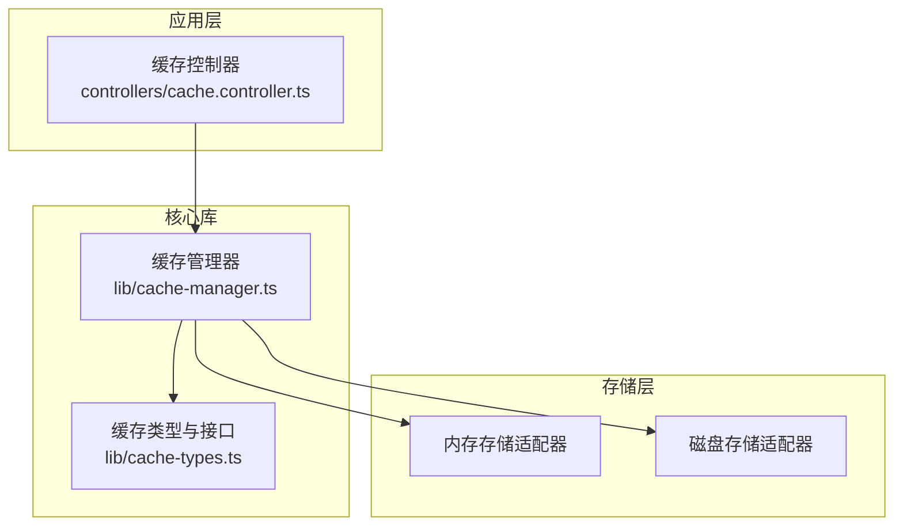
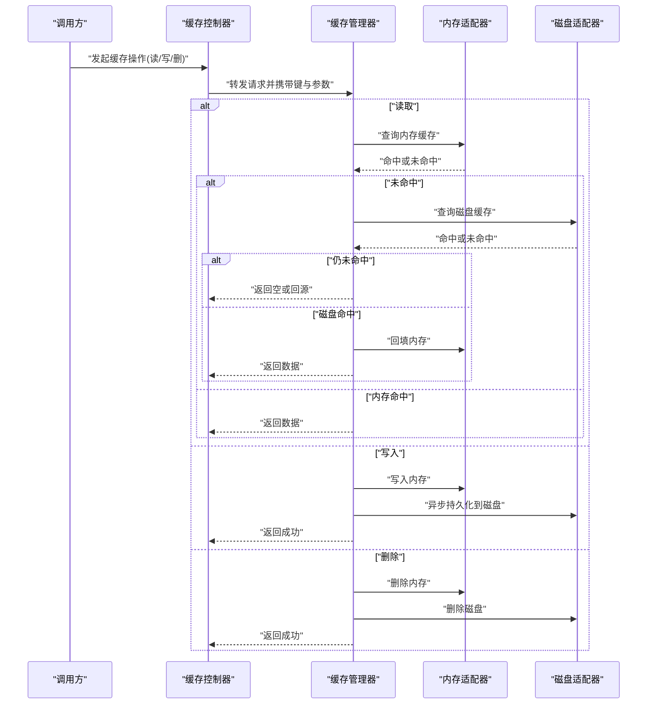
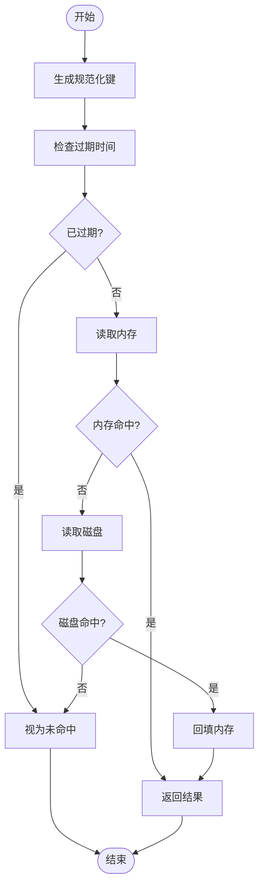
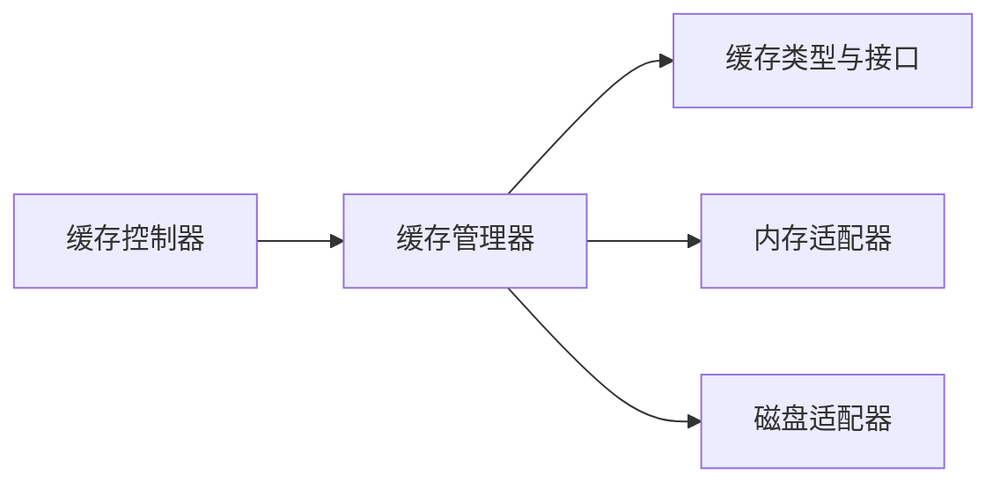

# 缓存管理器

<cite>
**本文引用的文件**   
- [lib/cache-manager.ts](file://lib/cache-manager.ts)
- [lib/cache-types.ts](file://lib/cache-types.ts)
- [controllers/cache.controller.ts](file://controllers/cache.controller.ts)
</cite>

## 目录
1. [简介](#简介)
2. [项目结构](#项目结构)
3. [核心组件](#核心组件)
4. [架构总览](#架构总览)
5. [详细组件分析](#详细组件分析)
6. [依赖分析](#依赖分析)
7. [性能考虑](#性能考虑)
8. [故障排查指南](#故障排查指南)
9. [结论](#结论)
10. [附录](#附录)

## 简介
本文件围绕“缓存管理器”模块，系统化阐述多级缓存策略（内存与磁盘）的实现思路、协调机制、键生成算法、过期时间管理与自动清理策略。文档同时覆盖缓存类型定义、缓存条目结构、存储适配器接口、配置选项、性能优化技巧与常见使用模式，并提供初始化、设置策略、执行操作与处理失效场景的示例路径，帮助读者快速上手并深入理解该模块的设计与实现。

## 项目结构
缓存相关代码主要位于 lib 与 controllers 两个目录：
- lib/cache-manager.ts：缓存管理器核心实现，包含多级缓存策略、键生成、过期管理、清理调度等逻辑。
- lib/cache-types.ts：缓存类型定义、缓存条目结构与存储适配器接口。
- controllers/cache.controller.ts：面向外部调用（如 HTTP 控制器）的缓存操作入口，负责参数校验、路由分发与错误处理。

图表来源
- [lib/cache-manager.ts](file://lib/cache-manager.ts)
- [lib/cache-types.ts](file://lib/cache-types.ts)
- [controllers/cache.controller.ts](file://controllers/cache.controller.ts)

章节来源
- [lib/cache-manager.ts](file://lib/cache-manager.ts)
- [lib/cache-types.ts](file://lib/cache-types.ts)
- [controllers/cache.controller.ts](file://controllers/cache.controller.ts)

## 核心组件
- 缓存管理器：提供统一的 get/set/delete/clear/keys/stats 等 API；内部维护多级缓存（内存优先、磁盘兜底），负责键生成、过期判断与自动清理。
- 存储适配器接口：定义统一读写契约，供内存与磁盘两种具体实现接入。
- 缓存类型与条目结构：定义缓存项元数据（如过期时间、版本、标签）、缓存值类型以及配置对象字段。
- 缓存控制器：对外暴露缓存操作的便捷入口，封装请求解析、权限校验、结果序列化与错误响应。

章节来源
- [lib/cache-manager.ts](file://lib/cache-manager.ts)
- [lib/cache-types.ts](file://lib/cache-types.ts)
- [controllers/cache.controller.ts](file://controllers/cache.controller.ts)

## 架构总览
下图展示了缓存管理器在多级缓存中的职责边界与交互关系：控制器接收请求后委托给缓存管理器；缓存管理器按命中顺序访问内存与磁盘适配器；键生成与过期检查贯穿整个流程；后台任务根据策略触发清理。

图表来源
- [lib/cache-manager.ts](file://lib/cache-manager.ts)
- [controllers/cache.controller.ts](file://controllers/cache.controller.ts)

## 详细组件分析

### 缓存类型与条目结构
- 缓存类型定义：用于区分不同业务域或用途的缓存命名空间，便于隔离与统计。
- 缓存条目结构：包含键、值、元数据（如过期时间、创建时间、版本号、标签等）。
- 存储适配器接口：定义统一的 set/get/delete/clear/keys/stats 等方法签名，屏蔽底层差异。
- 配置对象：包含内存容量上限、磁盘路径、默认过期时间、是否启用压缩、清理周期等。

章节来源
- [lib/cache-types.ts](file://lib/cache-types.ts)

### 缓存管理器核心实现
- 多级缓存策略：读路径先查内存，未命中再查磁盘并回填内存；写路径双写（内存立即生效，磁盘异步落盘）。
- 键生成算法：基于命名空间、业务键与可选上下文（如版本、标签）组合，并进行规范化与哈希，确保唯一性与稳定性。
- 过期时间管理：支持绝对过期时间与相对过期时间；读取时进行 TTL 校验，过期即视为未命中。
- 自动清理策略：定时扫描内存与磁盘，依据过期时间、LRU/LFU 淘汰策略与容量阈值回收条目。
- 统计与监控：提供命中率、大小、条目数、最近访问时间等指标，便于观测与调优。

图表来源
- [lib/cache-manager.ts](file://lib/cache-manager.ts)

章节来源
- [lib/cache-manager.ts](file://lib/cache-manager.ts)

### 缓存控制器
- 职责：解析请求参数、校验输入、调用缓存管理器、格式化响应与错误码。
- 安全与限流：可结合鉴权与速率限制，防止滥用。
- 批量操作：提供批量获取/写入/删除的端点，减少往返开销。

章节来源
- [controllers/cache.controller.ts](file://controllers/cache.controller.ts)

### 存储适配器（内存与磁盘）
- 内存适配器：基于进程内数据结构，具备高吞吐与低延迟特性，需关注容量与淘汰策略。
- 磁盘适配器：基于文件系统或嵌入式存储，具备持久化能力，需关注 I/O 成本与并发控制。
- 一致性：通过键与版本控制保证多副本一致；必要时引入写扩散或懒加载策略。

章节来源
- [lib/cache-types.ts](file://lib/cache-types.ts)
- [lib/cache-manager.ts](file://lib/cache-manager.ts)

## 依赖分析
- 模块内依赖：缓存控制器依赖缓存管理器；缓存管理器依赖缓存类型与存储适配器。
- 外部依赖：可能依赖文件系统、压缩库、定时器/调度器等。
- 耦合度：通过适配器接口降低耦合，便于替换存储后端。

图表来源
- [controllers/cache.controller.ts](file://controllers/cache.controller.ts)
- [lib/cache-manager.ts](file://lib/cache-manager.ts)
- [lib/cache-types.ts](file://lib/cache-types.ts)

章节来源
- [controllers/cache.controller.ts](file://controllers/cache.controller.ts)
- [lib/cache-manager.ts](file://lib/cache-manager.ts)
- [lib/cache-types.ts](file://lib/cache-types.ts)

## 性能考虑
- 读路径优化：优先命中内存，避免不必要的磁盘 I/O；对热点键做预取与预热。
- 写路径优化：采用异步持久化与批量化写入，降低同步阻塞。
- 淘汰策略：结合 LRU/LFU 与容量阈值，平衡命中率与内存占用。
- 键设计：尽量短小稳定，避免频繁变更导致缓存抖动。
- 序列化与压缩：对大对象启用压缩，权衡 CPU 与 I/O。
- 监控与告警：跟踪命中率、P99 延迟、淘汰率与磁盘使用量。

[本节为通用指导，不直接分析具体文件]

## 故障排查指南
- 症状：命中率偏低
  - 排查：检查键生成是否稳定、TTL 是否过短、是否存在大量冷数据。
- 症状：内存持续增长
  - 排查：确认淘汰策略是否生效、容量上限是否合理、是否存在泄漏。
- 症状：磁盘空间耗尽
  - 排查：检查清理任务是否运行、磁盘配额与保留策略是否合理。
- 症状：读写不一致
  - 排查：核对版本字段与并发写入保护，确认异步落盘失败重试机制。

章节来源
- [lib/cache-manager.ts](file://lib/cache-manager.ts)
- [controllers/cache.controller.ts](file://controllers/cache.controller.ts)

## 结论
本缓存管理器以清晰的适配器抽象与多级缓存策略为核心，兼顾高性能与可观测性。通过合理的键设计、过期与清理策略，可在复杂业务场景中提供稳定可靠的缓存服务。建议在生产环境开启监控与压测，持续调优容量与淘汰策略，以获得最佳性价比。

[本节为总结性内容，不直接分析具体文件]

## 附录

### 配置选项清单
- 命名空间：用于隔离不同业务域的缓存。
- 内存容量上限：最大条目数或字节数。
- 磁盘路径：持久化根目录。
- 默认过期时间：秒或毫秒单位。
- 压缩开关：是否对值进行压缩。
- 清理周期：定时任务间隔。
- 淘汰策略：LRU/LFU/TTL 等。

章节来源
- [lib/cache-types.ts](file://lib/cache-types.ts)

### 初始化与基本用法示例路径
- 初始化缓存管理器：参考初始化流程与配置注入位置。
- 设置缓存策略：参考策略配置与优先级说明。
- 执行缓存操作：参考 get/set/delete/clear/keys/stats 调用路径。
- 处理缓存失效：参考过期判定与回源流程。

章节来源
- [lib/cache-manager.ts](file://lib/cache-manager.ts)
- [controllers/cache.controller.ts](file://controllers/cache.controller.ts)