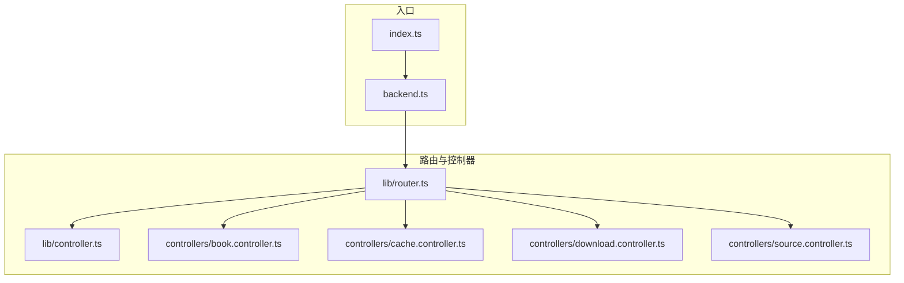
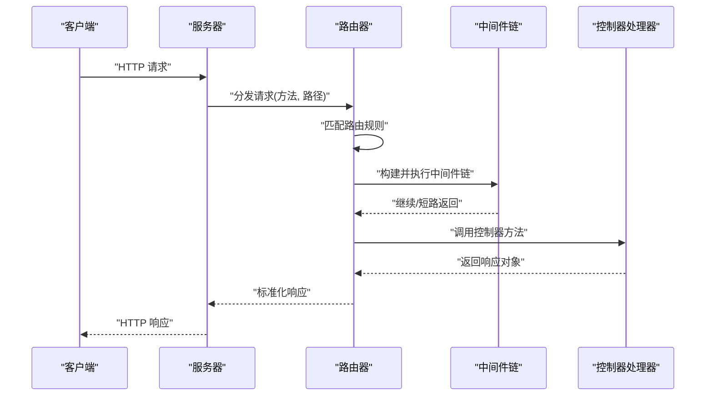
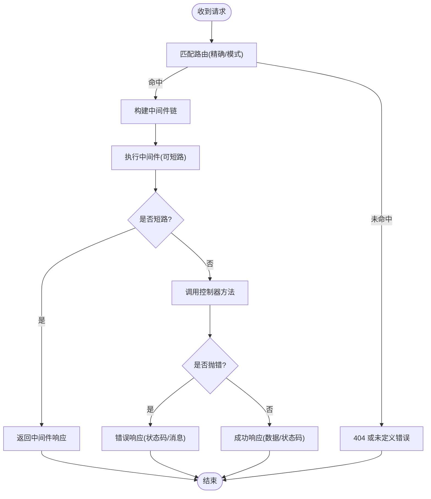
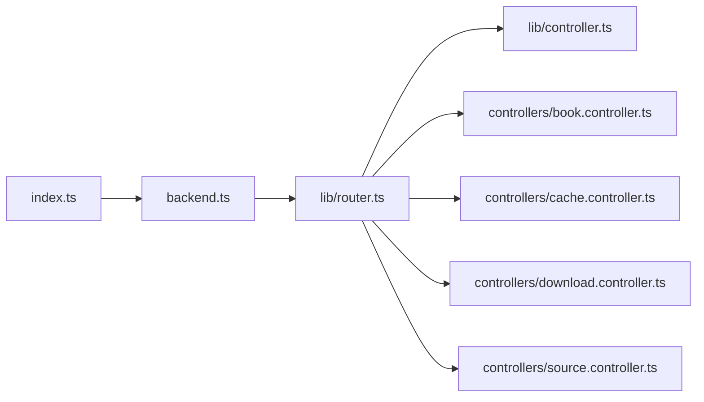

# 路由系统

<cite>
**本文引用的文件**   
- [lib/router.ts](file://lib/router.ts)
- [lib/controller.ts](file://lib/controller.ts)
- [backend.ts](file://backend.ts)
- [index.ts](file://index.ts)
- [controllers/book.controller.ts](file://controllers/book.controller.ts)
- [controllers/cache.controller.ts](file://controllers/cache.controller.ts)
- [controllers/download.controller.ts](file://controllers/download.controller.ts)
- [controllers/source.controller.ts](file://controllers/source.controller.ts)
</cite>

## 目录
1. [简介](#简介)
2. [项目结构](#项目结构)
3. [核心组件](#核心组件)
4. [架构总览](#架构总览)
5. [详细组件分析](#详细组件分析)
6. [依赖关系分析](#依赖关系分析)
7. [性能考虑](#性能考虑)
8. [故障排查指南](#故障排查指南)
9. [结论](#结论)
10. [附录](#附录)

## 简介
本文件面向“路由系统”模块，系统性说明 HTTP 请求分发机制、路由匹配算法、中间件管道与控制器映射逻辑；并覆盖路由参数提取、请求预处理、响应处理与错误传播。文档同时给出路由装饰器、权限验证、日志记录与性能监控的集成方式，提供配置示例、自定义中间件开发与调试技巧，帮助读者快速上手与扩展。

## 项目结构
本项目采用分层组织：入口层负责启动与注册路由；路由层负责路径解析与分发；控制器层实现业务逻辑；通用库提供路由与控制器基类能力。

图表来源
- [index.ts](file://index.ts)
- [backend.ts](file://backend.ts)
- [lib/router.ts](file://lib/router.ts)
- [lib/controller.ts](file://lib/controller.ts)
- [controllers/book.controller.ts](file://controllers/book.controller.ts)
- [controllers/cache.controller.ts](file://controllers/cache.controller.ts)
- [controllers/download.controller.ts](file://controllers/download.controller.ts)
- [controllers/source.controller.ts](file://controllers/source.controller.ts)

章节来源
- [index.ts](file://index.ts)
- [backend.ts](file://backend.ts)
- [lib/router.ts](file://lib/router.ts)
- [lib/controller.ts](file://lib/controller.ts)
- [controllers/book.controller.ts](file://controllers/book.controller.ts)
- [controllers/cache.controller.ts](file://controllers/cache.controller.ts)
- [controllers/download.controller.ts](file://controllers/download.controller.ts)
- [controllers/source.controller.ts](file://controllers/source.controller.ts)

## 核心组件
- 路由器（Router）：维护路由表、执行路径匹配、组装中间件链、调用控制器方法并返回响应。
- 控制器基类（ControllerBase）：为控制器提供统一的上下文访问、响应构造、错误抛出与生命周期钩子。
- 控制器实现：按功能域拆分，如图书、缓存、下载、源管理等。
- 应用入口：创建服务器实例、挂载路由、启动监听。

章节来源
- [lib/router.ts](file://lib/router.ts)
- [lib/controller.ts](file://lib/controller.ts)
- [controllers/book.controller.ts](file://controllers/book.controller.ts)
- [controllers/cache.controller.ts](file://controllers/cache.controller.ts)
- [controllers/download.controller.ts](file://controllers/download.controller.ts)
- [controllers/source.controller.ts](file://controllers/source.controller.ts)

## 架构总览
HTTP 请求进入后，由服务器转发至路由器；路由器根据方法与路径进行匹配，构建中间件管道，依次执行预处理（鉴权、日志、限流等），最终委派到具体控制器的处理方法，生成响应并回写。

图表来源
- [backend.ts](file://backend.ts)
- [lib/router.ts](file://lib/router.ts)
- [lib/controller.ts](file://lib/controller.ts)

## 详细组件分析

### 路由器（lib/router.ts）
职责
- 注册路由：支持 GET/POST/PUT/DELETE 等方法与路径模板。
- 路由匹配：基于路径段分割与通配符/动态段解析，提取参数。
- 中间件管道：按注册顺序串联，支持同步/异步中间件，允许短路返回。
- 控制器映射：将匹配到的路由委托给对应控制器方法。
- 响应标准化：统一包装成功/失败响应，设置状态码与头部。

关键流程
- 请求到达时，先尝试精确匹配，再尝试模式匹配（含动态段）。
- 若未命中，进入默认 404 处理或全局兜底。
- 命中后，按顺序执行中间件，任一中间件返回响应则终止后续处理。
- 无短路时，调用控制器方法，捕获异常并转换为错误响应。

图表来源
- [lib/router.ts](file://lib/router.ts)

章节来源
- [lib/router.ts](file://lib/router.ts)

### 控制器基类（lib/controller.ts）
职责
- 提供上下文访问：请求体、查询参数、路径参数、头信息、会话/认证信息等。
- 响应构造：便捷方法用于返回 JSON、重定向、文件流等。
- 错误封装：统一错误类型与消息格式，便于上层捕获与转换。
- 生命周期钩子：可选的初始化/销毁钩子，便于资源管理。

使用建议
- 所有控制器继承该基类，确保行为一致。
- 在控制器中优先抛出标准错误，交由路由器统一处理。

章节来源
- [lib/controller.ts](file://lib/controller.ts)

### 控制器实现
- 图书控制器：提供图书列表、详情、搜索等接口。
- 缓存控制器：提供缓存清理、统计、预热等接口。
- 下载控制器：提供任务创建、进度查询、取消等接口。
- 源控制器：提供源配置、健康检查、更新等接口。

章节来源
- [controllers/book.controller.ts](file://controllers/book.controller.ts)
- [controllers/cache.controller.ts](file://controllers/cache.controller.ts)
- [controllers/download.controller.ts](file://controllers/download.controller.ts)
- [controllers/source.controller.ts](file://controllers/source.controller.ts)

### 应用入口（backend.ts / index.ts）
职责
- 创建并配置服务器实例。
- 挂载根路由与控制器。
- 启动监听端口，输出运行信息。

章节来源
- [backend.ts](file://backend.ts)
- [index.ts](file://index.ts)

## 依赖关系分析
- 入口依赖后端服务与路由器。
- 路由器依赖控制器基类与各控制器实现。
- 控制器之间尽量保持低耦合，通过共享服务或外部依赖交互。

图表来源
- [index.ts](file://index.ts)
- [backend.ts](file://backend.ts)
- [lib/router.ts](file://lib/router.ts)
- [lib/controller.ts](file://lib/controller.ts)
- [controllers/book.controller.ts](file://controllers/book.controller.ts)
- [controllers/cache.controller.ts](file://controllers/cache.controller.ts)
- [controllers/download.controller.ts](file://controllers/download.controller.ts)
- [controllers/source.controller.ts](file://controllers/source.controller.ts)

章节来源
- [index.ts](file://index.ts)
- [backend.ts](file://backend.ts)
- [lib/router.ts](file://lib/router.ts)
- [lib/controller.ts](file://lib/controller.ts)
- [controllers/book.controller.ts](file://controllers/book.controller.ts)
- [controllers/cache.controller.ts](file://controllers/cache.controller.ts)
- [controllers/download.controller.ts](file://controllers/download.controller.ts)
- [controllers/source.controller.ts](file://controllers/source.controller.ts)

## 性能考虑
- 路由匹配策略：优先精确匹配，其次模式匹配；避免过深的嵌套与过多正则。
- 中间件数量：按需裁剪，将昂贵操作下沉到异步队列或缓存。
- 响应体积：合理分页、压缩与字段裁剪，减少网络传输。
- 连接复用与并发：利用框架默认优化，必要时调整并发限制。
- 监控埋点：在关键路径添加耗时统计与指标上报。

[本节为通用指导，不直接分析具体文件]

## 故障排查指南
常见问题与定位思路
- 404 未找到：检查路由注册顺序与路径模板是否正确；确认是否存在同名但不同方法的冲突。
- 401/403 鉴权失败：检查鉴权中间件是否前置且正确放行白名单路径。
- 500 内部错误：查看控制器抛出的标准错误类型与堆栈；确认数据库/外部服务可用性。
- 超时：检查慢查询与外部调用，增加重试与熔断策略。
- 内存泄漏：关注中间件中的闭包引用与长生命周期对象释放。

建议的调试手段
- 开启详细日志：记录请求 ID、方法、路径、耗时与状态码。
- 结构化错误：统一错误码与消息，便于前端展示与告警。
- 压测与采样：对热点接口进行压测，结合 APM 定位瓶颈。

章节来源
- [lib/router.ts](file://lib/router.ts)
- [lib/controller.ts](file://lib/controller.ts)

## 结论
本路由系统以清晰的分层与可扩展的中间件管道为核心，提供稳定的请求分发与响应处理能力。通过控制器基类与统一错误模型，保证业务代码的一致性与可维护性。建议在新增功能时遵循现有约定，逐步完善鉴权、日志与监控能力，持续提升系统的稳定性与可观测性。

[本节为总结性内容，不直接分析具体文件]

## 附录

### 路由配置示例
- 基础路由：GET /books、GET /books/:id、POST /books
- 鉴权路由：GET /admin/stats（需登录）
- 文件下载：GET /downloads/:taskId/stream
- 健康检查：GET /health

章节来源
- [controllers/book.controller.ts](file://controllers/book.controller.ts)
- [controllers/cache.controller.ts](file://controllers/cache.controller.ts)
- [controllers/download.controller.ts](file://controllers/download.controller.ts)
- [controllers/source.controller.ts](file://controllers/source.controller.ts)

### 自定义中间件开发
步骤
- 定义中间件函数：接收上下文与下一步回调，可选择短路返回。
- 注册中间件：在路由或全局级别注册，注意执行顺序。
- 错误处理：在中间件中捕获异常并返回错误响应。
- 性能考量：避免阻塞主线程，I/O 操作异步化。

章节来源
- [lib/router.ts](file://lib/router.ts)

### 路由装饰器与权限验证
- 装饰器：可通过装饰器声明路由与方法元数据，简化注册过程。
- 权限验证：在鉴权中间件中校验令牌与角色，未通过则返回 401/403。
- 组合策略：将多个权限规则组合为复合守卫，提高复用性。

章节来源
- [lib/router.ts](file://lib/router.ts)
- [lib/controller.ts](file://lib/controller.ts)

### 日志记录与性能监控集成
- 请求日志：记录入参、出参、耗时与状态码。
- 指标上报：暴露 QPS、P95/P99 延迟、错误率等指标。
- 链路追踪：注入 TraceID，跨服务关联日志。

章节来源
- [lib/router.ts](file://lib/router.ts)

### 调试技巧
- 本地启用详细日志与慢请求阈值告警。
- 使用断点与变量监视定位问题。
- 构造最小复现用例，隔离第三方依赖影响。

[本节为通用指导，不直接分析具体文件]