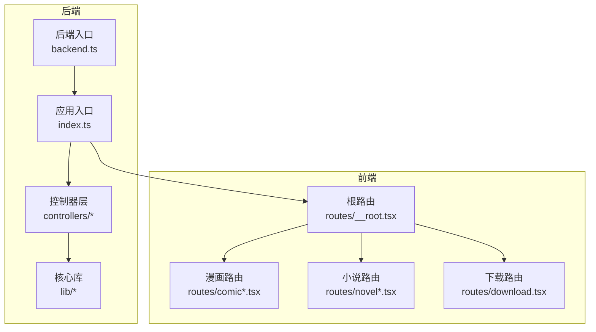
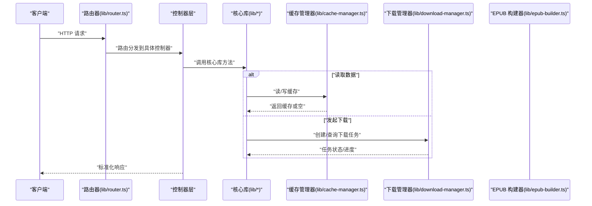
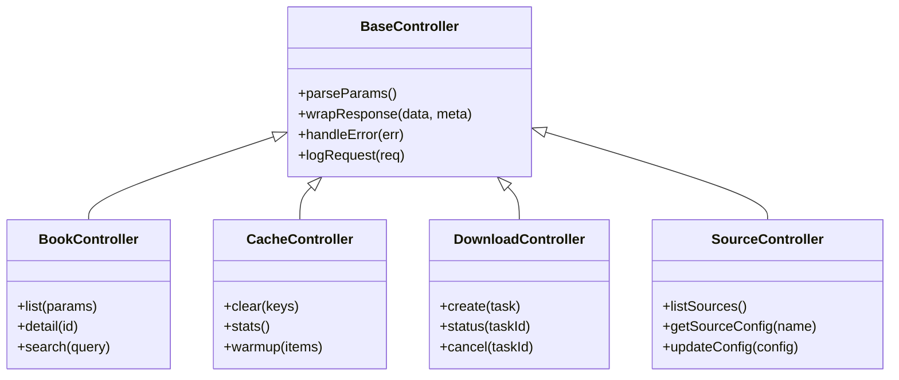
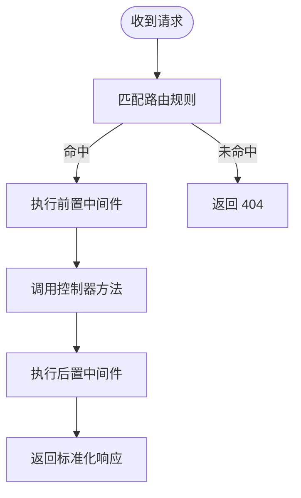
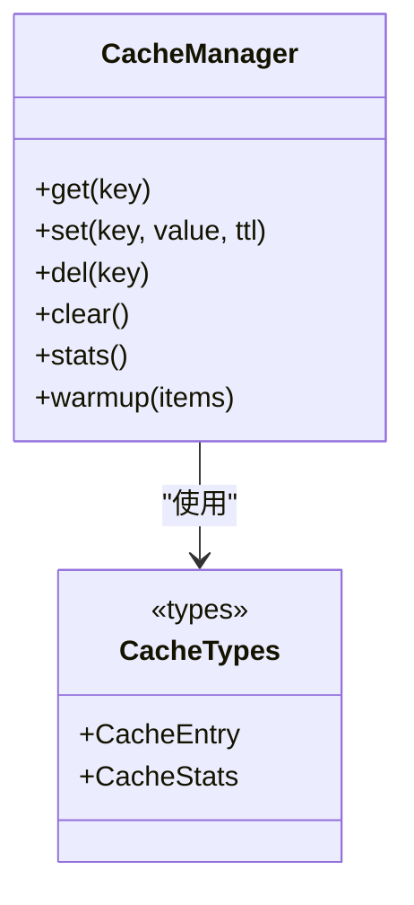
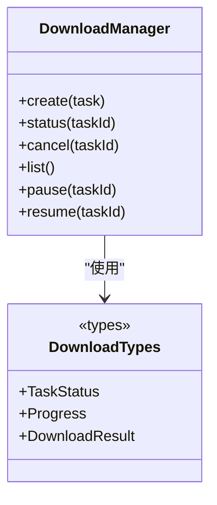
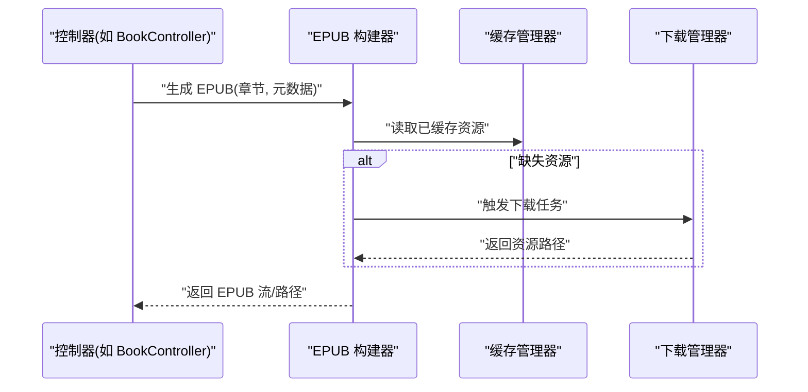
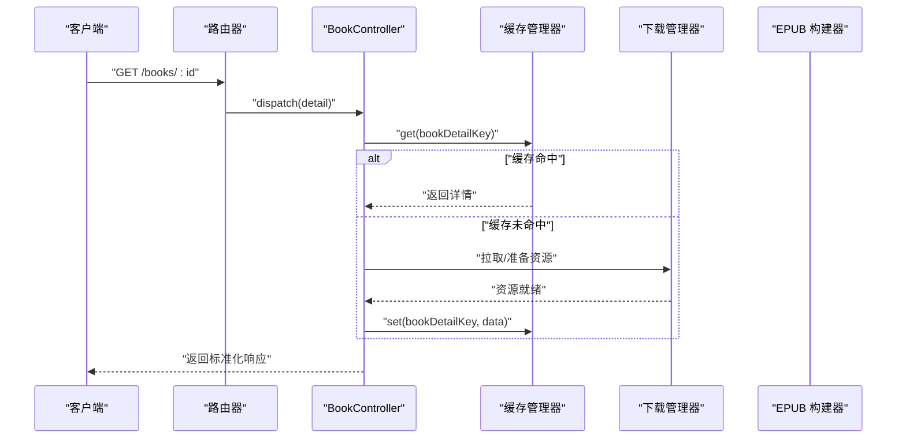
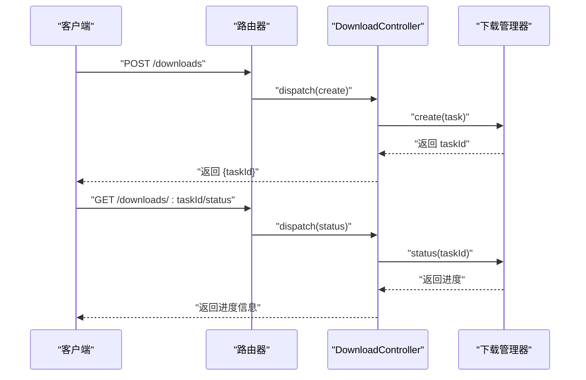
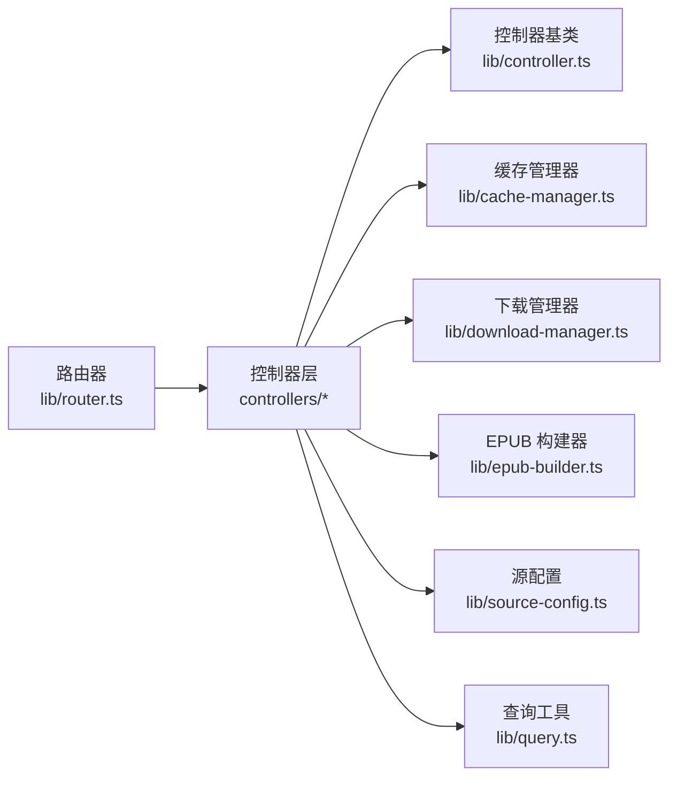

# 模块关系

<cite>
**本文引用的文件**   
- [backend.ts](file://backend.ts)
- [index.ts](file://index.ts)
- [frontend.tsx](file://frontend.tsx)
- [package.json](file://package.json)
- [controllers/book.controller.ts](file://controllers/book.controller.ts)
- [controllers/cache.controller.ts](file://controllers/cache.controller.ts)
- [controllers/download.controller.ts](file://controllers/download.controller.ts)
- [controllers/source.controller.ts](file://controllers/source.controller.ts)
- [lib/controller.ts](file://lib/controller.ts)
- [lib/router.ts](file://lib/router.ts)
- [lib/query.ts](file://lib/query.ts)
- [lib/cache-manager.ts](file://lib/cache-manager.ts)
- [lib/cache-types.ts](file://lib/cache-types.ts)
- [lib/download-manager.ts](file://lib/download-manager.ts)
- [lib/download-types.ts](file://lib/download-types.ts)
- [lib/epub-builder.ts](file://lib/epub-builder.ts)
- [lib/source-config.ts](file://lib/source-config.ts)
- [routes/__root.tsx](file://routes/__root.tsx)
- [routes/comic-reader.tsx](file://routes/comic-reader.tsx)
- [routes/comic.tsx](file://routes/comic.tsx)
- [routes/download.tsx](file://routes/download.tsx)
- [routes/novel-reader.tsx](file://routes/novel-reader.tsx)
- [routes/novel.tsx](file://routes/novel.tsx)
</cite>

## 目录
1. [简介](#简介)
2. [项目结构](#项目结构)
3. [核心组件](#核心组件)
4. [架构总览](#架构总览)
5. [详细组件分析](#详细组件分析)
6. [依赖分析](#依赖分析)
7. [性能考虑](#性能考虑)
8. [故障排查指南](#故障排查指南)
9. [结论](#结论)
10. [附录](#附录)

## 简介
本文件聚焦于 Bun-zlib 项目的模块关系与交互模式，重点说明：
- 控制器层的设计模式、路由分发机制、中间件处理流程与错误处理策略
- lib 目录中核心库的职责划分与协作方式（缓存管理器、下载管理器、EPUB 构建器等）
- 模块依赖图与调用序列图
- 模块间接口定义与数据传递格式约定

## 项目结构
整体采用前后端同仓的轻量架构：后端入口负责启动服务与注册路由；控制器层暴露业务 API；lib 提供可复用的核心能力；routes 为前端页面路由。

图表来源
- [backend.ts:1-200](file://backend.ts#L1-L200)
- [index.ts:1-200](file://index.ts#L1-L200)
- [routes/__root.tsx:1-200](file://routes/__root.tsx#L1-L200)

章节来源
- [backend.ts:1-200](file://backend.ts#L1-L200)
- [index.ts:1-200](file://index.ts#L1-L200)
- [package.json:1-200](file://package.json#L1-L200)

## 核心组件
- 控制器层
  - book.controller.ts：书籍相关 API（如列表、详情、搜索等）
  - cache.controller.ts：缓存管理 API（清理、统计、预热等）
  - download.controller.ts：下载任务与进度查询
  - source.controller.ts：源配置与元数据管理
- 核心库（lib）
  - controller.ts：控制器基类与通用能力（参数校验、响应封装、错误统一处理等）
  - router.ts：HTTP 路由注册与匹配
  - query.ts：查询构造与解析工具
  - cache-manager.ts：缓存读写、过期、淘汰策略
  - cache-types.ts：缓存数据结构与类型定义
  - download-manager.ts：下载任务编排、并发控制、断点续传等
  - download-types.ts：下载任务状态与结果类型
  - epub-builder.ts：将内容组装为 EPUB 电子书
  - source-config.ts：源配置加载、合并与校验

章节来源
- [controllers/book.controller.ts:1-200](file://controllers/book.controller.ts#L1-L200)
- [controllers/cache.controller.ts:1-200](file://controllers/cache.controller.ts#L1-L200)
- [controllers/download.controller.ts:1-200](file://controllers/download.controller.ts#L1-L200)
- [controllers/source.controller.ts:1-200](file://controllers/source.controller.ts#L1-L200)
- [lib/controller.ts:1-200](file://lib/controller.ts#L1-L200)
- [lib/router.ts:1-200](file://lib/router.ts#L1-L200)
- [lib/query.ts:1-200](file://lib/query.ts#L1-L200)
- [lib/cache-manager.ts:1-200](file://lib/cache-manager.ts#L1-L200)
- [lib/cache-types.ts:1-200](file://lib/cache-types.ts#L1-L200)
- [lib/download-manager.ts:1-200](file://lib/download-manager.ts#L1-L200)
- [lib/download-types.ts:1-200](file://lib/download-types.ts#L1-L200)
- [lib/epub-builder.ts:1-200](file://lib/epub-builder.ts#L1-L200)
- [lib/source-config.ts:1-200](file://lib/source-config.ts#L1-L200)

## 架构总览
后端以“入口 -> 路由 -> 控制器 -> 核心库”的分层组织请求处理链路；前端通过 routes 渲染页面并调用后端 API。

图表来源
- [lib/router.ts:1-200](file://lib/router.ts#L1-L200)
- [lib/controller.ts:1-200](file://lib/controller.ts#L1-L200)
- [lib/cache-manager.ts:1-200](file://lib/cache-manager.ts#L1-L200)
- [lib/download-manager.ts:1-200](file://lib/download-manager.ts#L1-L200)
- [lib/epub-builder.ts:1-200](file://lib/epub-builder.ts#L1-L200)

## 详细组件分析

### 控制器层设计模式
- 基类抽象
  - 控制器基类提供统一的参数解析、响应包装、异常捕获与日志埋点能力，各业务控制器继承该基类以减少重复代码。
- 路由分发
  - 路由器集中注册所有 HTTP 路径与方法映射，按前缀或命名空间分组，支持动态段与查询串解析。
- 中间件处理
  - 在控制器基类或路由器层面注入通用中间件（鉴权、限流、CORS、请求体解析、错误兜底），形成横切关注点。
- 错误处理策略
  - 控制器捕获业务异常并转换为标准错误响应；未捕获异常由全局错误处理器统一输出，避免泄露内部堆栈。

图表来源
- [lib/controller.ts:1-200](file://lib/controller.ts#L1-L200)
- [controllers/book.controller.ts:1-200](file://controllers/book.controller.ts#L1-L200)
- [controllers/cache.controller.ts:1-200](file://controllers/cache.controller.ts#L1-L200)
- [controllers/download.controller.ts:1-200](file://controllers/download.controller.ts#L1-L200)
- [controllers/source.controller.ts:1-200](file://controllers/source.controller.ts#L1-L200)

章节来源
- [lib/controller.ts:1-200](file://lib/controller.ts#L1-L200)
- [controllers/book.controller.ts:1-200](file://controllers/book.controller.ts#L1-L200)
- [controllers/cache.controller.ts:1-200](file://controllers/cache.controller.ts#L1-L200)
- [controllers/download.controller.ts:1-200](file://controllers/download.controller.ts#L1-L200)
- [controllers/source.controller.ts:1-200](file://controllers/source.controller.ts#L1-L200)

### 路由分发机制
- 路由注册
  - 路由器维护路径到控制器的映射表，支持 GET/POST/PUT/DELETE 等方法绑定。
- 参数解析
  - 路径参数、查询参数与请求体分别解析并注入到控制器方法入参。
- 中间件链
  - 每个路由可挂载前置中间件（如鉴权、限流）与后置中间件（如响应格式化）。

图表来源
- [lib/router.ts:1-200](file://lib/router.ts#L1-L200)
- [lib/controller.ts:1-200](file://lib/controller.ts#L1-L200)

章节来源
- [lib/router.ts:1-200](file://lib/router.ts#L1-L200)

### 缓存管理器（cache-manager.ts）
- 职责
  - 提供统一的缓存读写接口，支持键空间、过期时间、容量限制与淘汰策略。
- 关键操作
  - get/set/del/clear/stats/warmup
- 数据结构
  - 使用内存对象或外部存储作为底层实现，对外暴露一致的类型契约（见 cache-types.ts）。

图表来源
- [lib/cache-manager.ts:1-200](file://lib/cache-manager.ts#L1-L200)
- [lib/cache-types.ts:1-200](file://lib/cache-types.ts#L1-L200)

章节来源
- [lib/cache-manager.ts:1-200](file://lib/cache-manager.ts#L1-L200)
- [lib/cache-types.ts:1-200](file://lib/cache-types.ts#L1-L200)

### 下载管理器（download-manager.ts）
- 职责
  - 管理下载任务的创建、调度、进度跟踪与取消；支持并发上限与重试策略。
- 关键操作
  - create/status/cancel/list/pause/resume
- 类型契约
  - 任务状态、进度、错误码等定义在 download-types.ts。

图表来源
- [lib/download-manager.ts:1-200](file://lib/download-manager.ts#L1-L200)
- [lib/download-types.ts:1-200](file://lib/download-types.ts#L1-L200)

章节来源
- [lib/download-manager.ts:1-200](file://lib/download-manager.ts#L1-L200)
- [lib/download-types.ts:1-200](file://lib/download-types.ts#L1-L200)

### EPUB 构建器（epub-builder.ts）
- 职责
  - 将结构化内容（章节、图片、元数据）打包为符合规范的 EPUB 文件。
- 输入/输出
  - 输入：章节数组、封面、元数据；输出：EPUB 二进制流或文件路径。
- 与其他模块协作
  - 从缓存或下载管理器获取资源，再写入最终产物。

图表来源
- [lib/epub-builder.ts:1-200](file://lib/epub-builder.ts#L1-L200)
- [lib/cache-manager.ts:1-200](file://lib/cache-manager.ts#L1-L200)
- [lib/download-manager.ts:1-200](file://lib/download-manager.ts#L1-L200)

章节来源
- [lib/epub-builder.ts:1-200](file://lib/epub-builder.ts#L1-L200)

### 源配置（source-config.ts）
- 职责
  - 加载、合并与校验源配置，提供默认值与版本兼容处理。
- 典型用法
  - 控制器在初始化时加载配置，运行时按需更新并持久化。

章节来源
- [lib/source-config.ts:1-200](file://lib/source-config.ts#L1-L200)

### 查询工具（query.ts）
- 职责
  - 解析复杂查询条件、分页、排序与过滤，生成统一查询对象供上层使用。

章节来源
- [lib/query.ts:1-200](file://lib/query.ts#L1-L200)

### 控制器与核心库的协作示例

#### 书籍详情（含缓存与下载）

图表来源
- [controllers/book.controller.ts:1-200](file://controllers/book.controller.ts#L1-L200)
- [lib/cache-manager.ts:1-200](file://lib/cache-manager.ts#L1-L200)
- [lib/download-manager.ts:1-200](file://lib/download-manager.ts#L1-L200)

章节来源
- [controllers/book.controller.ts:1-200](file://controllers/book.controller.ts#L1-L200)

#### 下载任务创建与进度查询

图表来源
- [controllers/download.controller.ts:1-200](file://controllers/download.controller.ts#L1-L200)
- [lib/download-manager.ts:1-200](file://lib/download-manager.ts#L1-L200)

章节来源
- [controllers/download.controller.ts:1-200](file://controllers/download.controller.ts#L1-L200)

### 前端路由与页面
- __root.tsx：应用根布局与全局上下文
- comic*.tsx / novel*.tsx：漫画与小说阅读页
- download.tsx：下载任务管理与展示

章节来源
- [routes/__root.tsx:1-200](file://routes/__root.tsx#L1-L200)
- [routes/comic-reader.tsx:1-200](file://routes/comic-reader.tsx#L1-L200)
- [routes/comic.tsx:1-200](file://routes/comic.tsx#L1-L200)
- [routes/novel-reader.tsx:1-200](file://routes/novel-reader.tsx#L1-L200)
- [routes/novel.tsx:1-200](file://routes/novel.tsx#L1-L200)
- [routes/download.tsx:1-200](file://routes/download.tsx#L1-L200)

## 依赖分析
- 控制器对核心库的依赖
  - 控制器仅依赖 lib 中的稳定接口，不直接耦合网络、文件系统或第三方 SDK。
- 核心库内聚性
  - cache-manager 与 cache-types 高内聚；download-manager 与 download-types 高内聚；epub-builder 组合其他库完成打包。
- 可能的循环依赖
  - 控制器不应反向依赖 lib 的路由器；确保单向依赖：router -> controller -> lib。

图表来源
- [lib/router.ts:1-200](file://lib/router.ts#L1-L200)
- [lib/controller.ts:1-200](file://lib/controller.ts#L1-L200)
- [lib/cache-manager.ts:1-200](file://lib/cache-manager.ts#L1-L200)
- [lib/download-manager.ts:1-200](file://lib/download-manager.ts#L1-L200)
- [lib/epub-builder.ts:1-200](file://lib/epub-builder.ts#L1-L200)
- [lib/source-config.ts:1-200](file://lib/source-config.ts#L1-L200)
- [lib/query.ts:1-200](file://lib/query.ts#L1-L200)

章节来源
- [lib/router.ts:1-200](file://lib/router.ts#L1-L200)
- [lib/controller.ts:1-200](file://lib/controller.ts#L1-L200)
- [lib/cache-manager.ts:1-200](file://lib/cache-manager.ts#L1-L200)
- [lib/download-manager.ts:1-200](file://lib/download-manager.ts#L1-L200)
- [lib/epub-builder.ts:1-200](file://lib/epub-builder.ts#L1-L200)
- [lib/source-config.ts:1-200](file://lib/source-config.ts#L1-L200)
- [lib/query.ts:1-200](file://lib/query.ts#L1-L200)

## 性能考虑
- 缓存命中率优化
  - 合理设置 TTL 与预热策略，减少重复下载与计算。
- 下载并发控制
  - 限制并发数与重试退避，避免带宽与磁盘 I/O 抖动。
- 响应体积控制
  - 对大文件采用流式传输与分块下载，降低内存占用。
- 查询优化
  - 利用 query.ts 提供的分页与字段裁剪，减少不必要的数据传输。

## 故障排查指南
- 常见问题定位
  - 路由未命中：检查路由注册与路径参数是否一致。
  - 控制器报错：查看基类的错误包装与日志输出。
  - 缓存异常：核对 key 命名空间与 TTL 设置。
  - 下载失败：确认任务状态机转换与重试策略。
- 建议的调试手段
  - 开启请求级日志与耗时统计
  - 对关键路径增加断点与指标上报
  - 使用单元测试覆盖控制器与核心库边界

章节来源
- [lib/controller.ts:1-200](file://lib/controller.ts#L1-L200)
- [lib/router.ts:1-200](file://lib/router.ts#L1-L200)
- [lib/cache-manager.ts:1-200](file://lib/cache-manager.ts#L1-L200)
- [lib/download-manager.ts:1-200](file://lib/download-manager.ts#L1-L200)

## 结论
本项目通过清晰的分层与稳定的核心库接口，实现了可扩展的控制器层与可复用的业务能力。控制器专注于请求处理与编排，核心库专注领域逻辑与资源管理，配合统一的路由与错误处理，使系统具备良好的可维护性与可观测性。

## 附录

### 接口与数据格式约定（摘要）
- 控制器响应
  - 成功：包含数据与元信息的标准结构
  - 失败：包含错误码、消息与可选上下文的统一结构
- 缓存条目
  - 键、值、过期时间、扩展元数据
- 下载任务
  - 任务 ID、状态、进度百分比、错误信息、资源路径
- 查询对象
  - 分页、排序、过滤条件、字段选择

章节来源
- [lib/controller.ts:1-200](file://lib/controller.ts#L1-L200)
- [lib/cache-types.ts:1-200](file://lib/cache-types.ts#L1-L200)
- [lib/download-types.ts:1-200](file://lib/download-types.ts#L1-L200)
- [lib/query.ts:1-200](file://lib/query.ts#L1-L200)