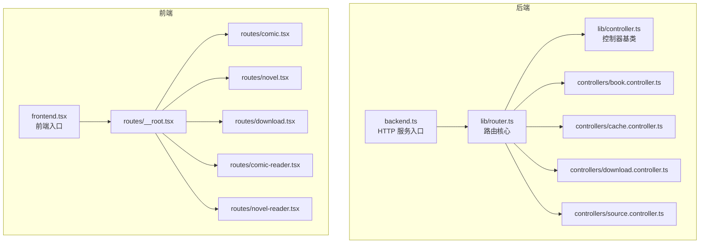
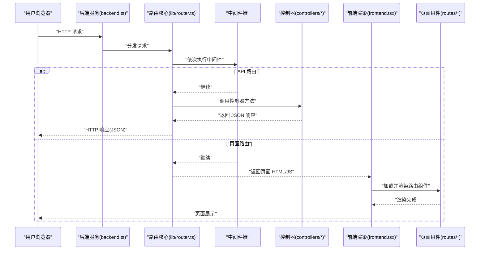
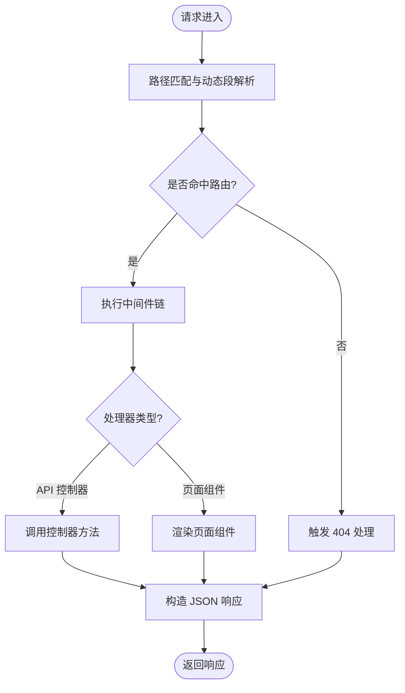
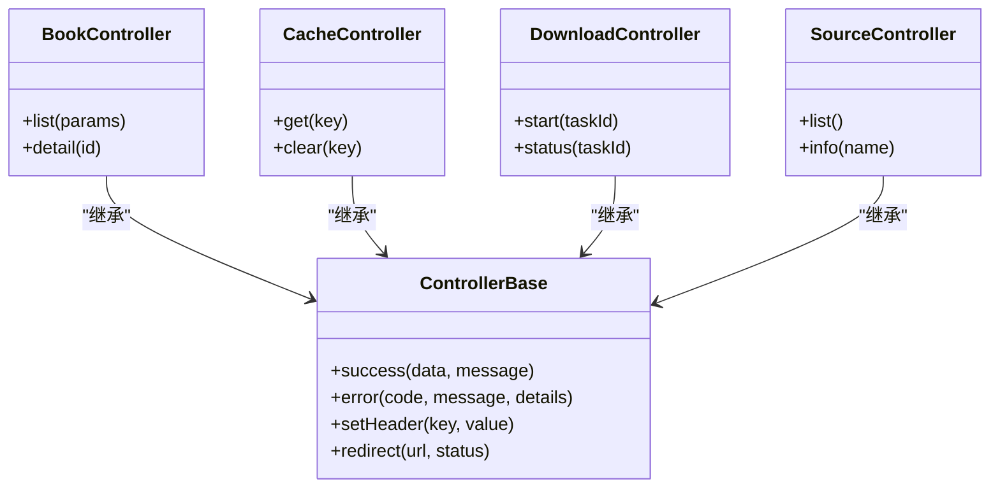
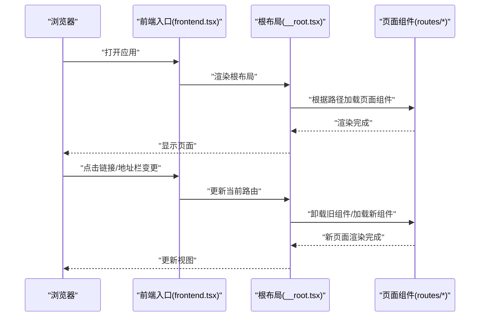
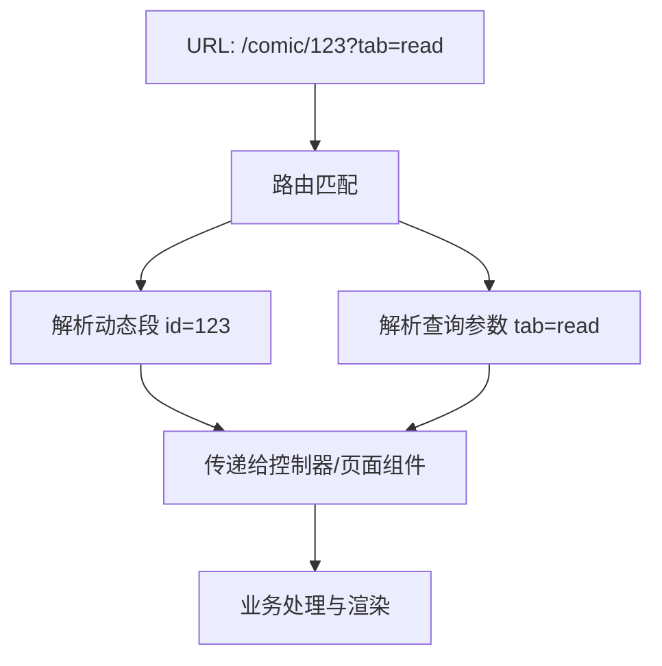
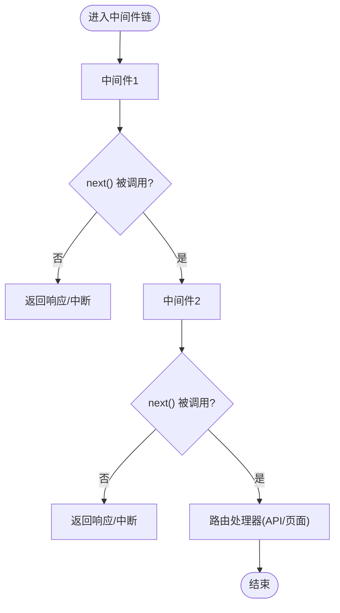
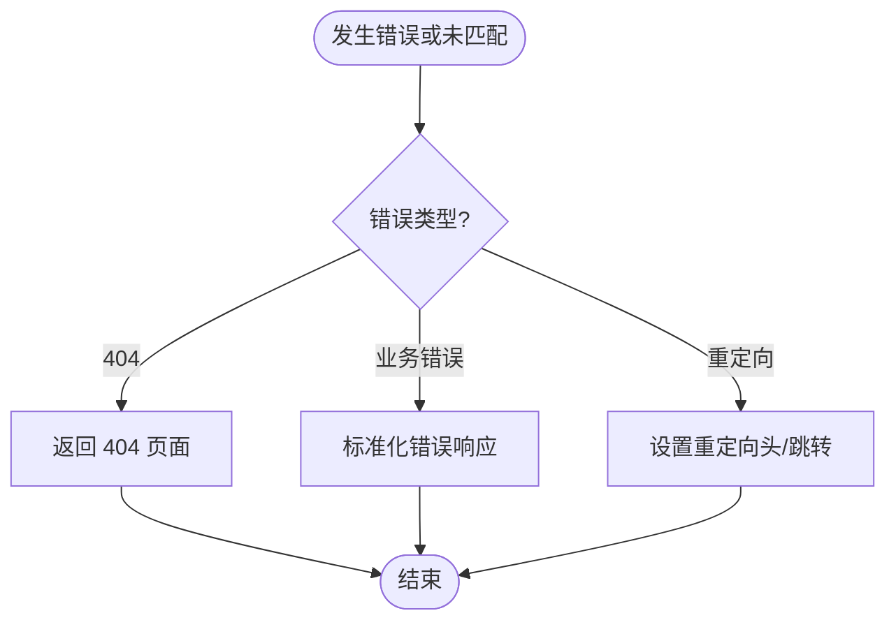
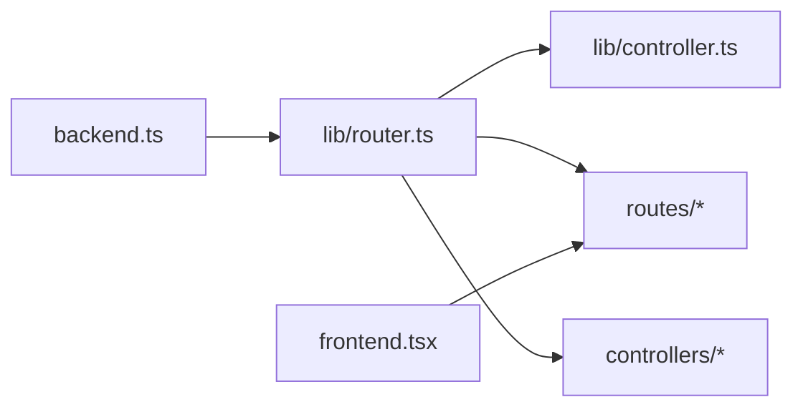

# 路由系统

<cite>
**本文引用的文件**   
- [lib/router.ts](file://lib/router.ts)
- [lib/controller.ts](file://lib/controller.ts)
- [backend.ts](file://backend.ts)
- [frontend.tsx](file://frontend.tsx)
- [routes/__root.tsx](file://routes/__root.tsx)
- [routes/comic.tsx](file://routes/comic.tsx)
- [routes/novel.tsx](file://routes/novel.tsx)
- [routes/download.tsx](file://routes/download.tsx)
- [routes/comic-reader.tsx](file://routes/comic-reader.tsx)
- [routes/novel-reader.tsx](file://routes/novel-reader.tsx)
- [controllers/book.controller.ts](file://controllers/book.controller.ts)
- [controllers/cache.controller.ts](file://controllers/cache.controller.ts)
- [controllers/download.controller.ts](file://controllers/download.controller.ts)
- [controllers/source.controller.ts](file://controllers/source.controller.ts)
</cite>

## 目录
1. [简介](#简介)
2. [项目结构](#项目结构)
3. [核心组件](#核心组件)
4. [架构总览](#架构总览)
5. [详细组件分析](#详细组件分析)
6. [依赖关系分析](#依赖关系分析)
7. [性能考量](#性能考量)
8. [故障排查指南](#故障排查指南)
9. [结论](#结论)
10. [附录](#附录)

## 简介
本文件面向 Bun-zlib 项目的“基于文件的路由系统”，系统性说明以下主题：
- 路由注册流程与前后端协作方式
- 中间件管道处理机制
- 动态路由匹配与参数解析
- 页面级路由组件生命周期管理
- 错误处理与重定向机制
- 路由配置示例与自定义中间件实现方法

目标是帮助开发者快速理解并扩展该路由体系，同时提供可操作的排障建议。

## 项目结构
本项目采用“前后端一体化”的目录组织方式：
- lib/router.ts：后端路由核心（请求分发、中间件链、控制器映射）
- lib/controller.ts：控制器基类/约定（统一响应封装、错误处理约定）
- backend.ts：服务端入口（HTTP 服务启动、静态资源与 API 挂载）
- frontend.tsx：前端入口（渲染根节点、加载路由树）
- routes/*：页面级路由组件（按文件即路由）
- controllers/*：API 控制器（业务逻辑与数据访问）

图表来源
- [backend.ts](file://backend.ts)
- [lib/router.ts](file://lib/router.ts)
- [lib/controller.ts](file://lib/controller.ts)
- [controllers/book.controller.ts](file://controllers/book.controller.ts)
- [controllers/cache.controller.ts](file://controllers/cache.controller.ts)
- [controllers/download.controller.ts](file://controllers/download.controller.ts)
- [controllers/source.controller.ts](file://controllers/source.controller.ts)
- [frontend.tsx](file://frontend.tsx)
- [routes/__root.tsx](file://routes/__root.tsx)
- [routes/comic.tsx](file://routes/comic.tsx)
- [routes/novel.tsx](file://routes/novel.tsx)
- [routes/download.tsx](file://routes/download.tsx)
- [routes/comic-reader.tsx](file://routes/comic-reader.tsx)
- [routes/novel-reader.tsx](file://routes/novel-reader.tsx)

章节来源
- [backend.ts](file://backend.ts)
- [lib/router.ts](file://lib/router.ts)
- [lib/controller.ts](file://lib/controller.ts)
- [frontend.tsx](file://frontend.tsx)
- [routes/__root.tsx](file://routes/__root.tsx)
- [routes/comic.tsx](file://routes/comic.tsx)
- [routes/novel.tsx](file://routes/novel.tsx)
- [routes/download.tsx](file://routes/download.tsx)
- [routes/comic-reader.tsx](file://routes/comic-reader.tsx)
- [routes/novel-reader.tsx](file://routes/novel-reader.tsx)

## 核心组件
- 路由核心（lib/router.ts）
  - 负责将 URL 路径映射到控制器或页面组件
  - 维护中间件链，支持前置校验、鉴权、日志等
  - 提供动态段解析与查询参数提取
- 控制器基类（lib/controller.ts）
  - 定义统一的响应结构与错误返回约定
  - 提供常用工具方法（如状态码设置、JSON 包装）
- 后端入口（backend.ts）
  - 创建 HTTP 服务器
  - 挂载静态资源与 API 路由前缀
  - 初始化路由与中间件
- 前端入口（frontend.tsx）
  - 渲染根组件
  - 根据当前路径选择并加载对应路由组件
- 页面级路由组件（routes/*）
  - 每个文件代表一个页面路由
  - 通过约定式命名与嵌套结构表达层级关系
- API 控制器（controllers/*）
  - 实现具体业务接口（书籍、缓存、下载、源管理等）

章节来源
- [lib/router.ts](file://lib/router.ts)
- [lib/controller.ts](file://lib/controller.ts)
- [backend.ts](file://backend.ts)
- [frontend.tsx](file://frontend.tsx)
- [routes/__root.tsx](file://routes/__root.tsx)
- [routes/comic.tsx](file://routes/comic.tsx)
- [routes/novel.tsx](file://routes/novel.tsx)
- [routes/download.tsx](file://routes/download.tsx)
- [routes/comic-reader.tsx](file://routes/comic-reader.tsx)
- [routes/novel-reader.tsx](file://routes/novel-reader.tsx)
- [controllers/book.controller.ts](file://controllers/book.controller.ts)
- [controllers/cache.controller.ts](file://controllers/cache.controller.ts)
- [controllers/download.controller.ts](file://controllers/download.controller.ts)
- [controllers/source.controller.ts](file://controllers/source.controller.ts)

## 架构总览
下图展示了从浏览器发起请求到最终响应的完整链路，包括前后端协作、中间件管道、控制器执行与页面渲染。

图表来源
- [backend.ts](file://backend.ts)
- [lib/router.ts](file://lib/router.ts)
- [frontend.tsx](file://frontend.tsx)
- [routes/__root.tsx](file://routes/__root.tsx)
- [routes/comic.tsx](file://routes/comic.tsx)
- [routes/novel.tsx](file://routes/novel.tsx)
- [routes/download.tsx](file://routes/download.tsx)
- [routes/comic-reader.tsx](file://routes/comic-reader.tsx)
- [routes/novel-reader.tsx](file://routes/novel-reader.tsx)

## 详细组件分析

### 路由核心（lib/router.ts）
- 功能要点
  - 基于文件的路由注册：扫描 routes 目录，将文件名映射为路径
  - 中间件管道：支持全局与局部中间件，按顺序执行
  - 动态路由：支持路径段占位符与查询参数解析
  - 错误边界：捕获未处理异常并返回统一错误格式
- 关键流程
  - 注册阶段：收集所有路由文件，生成路径模板与处理器映射
  - 匹配阶段：对入站请求进行前缀匹配与动态段解析
  - 执行阶段：进入中间件链，命中后调用控制器或页面组件
  - 响应阶段：统一包装响应体，设置必要头信息

图表来源
- [lib/router.ts](file://lib/router.ts)

章节来源
- [lib/router.ts](file://lib/router.ts)

### 控制器基类（lib/controller.ts）
- 设计目标
  - 统一响应结构：成功/失败字段、消息、数据体
  - 便捷状态码设置：避免重复代码
  - 错误规范化：将异常转换为标准错误响应
- 使用约定
  - 控制器方法接收上下文对象（包含请求、响应、参数）
  - 通过基类方法返回结果，确保一致的前端消费体验

图表来源
- [lib/controller.ts](file://lib/controller.ts)
- [controllers/book.controller.ts](file://controllers/book.controller.ts)
- [controllers/cache.controller.ts](file://controllers/cache.controller.ts)
- [controllers/download.controller.ts](file://controllers/download.controller.ts)
- [controllers/source.controller.ts](file://controllers/source.controller.ts)

章节来源
- [lib/controller.ts](file://lib/controller.ts)
- [controllers/book.controller.ts](file://controllers/book.controller.ts)
- [controllers/cache.controller.ts](file://controllers/cache.controller.ts)
- [controllers/download.controller.ts](file://controllers/download.controller.ts)
- [controllers/source.controller.ts](file://controllers/source.controller.ts)

### 后端入口（backend.ts）
- 职责
  - 初始化 HTTP 服务
  - 挂载静态资源目录
  - 注册 API 路由前缀（例如 /api）
  - 注入全局中间件（如日志、CORS、速率限制）
- 与路由核心的集成
  - 在启动时加载路由表
  - 将未匹配请求交由前端入口处理（SSR/SPA 回退）

章节来源
- [backend.ts](file://backend.ts)

### 前端入口与页面级路由（frontend.tsx 与 routes/*）
- 前端入口（frontend.tsx）
  - 渲染根节点
  - 监听浏览器地址变化
  - 根据当前路径选择并加载对应路由组件
- 页面级路由组件（routes/*）
  - 约定式文件即路由：文件名映射为路径片段
  - 支持嵌套：__root.tsx 作为根布局，子路由在其内部渲染
  - 生命周期：挂载、更新、卸载；可在组件内发起数据请求与副作用清理
- 前后端协作
  - 首次访问：后端返回页面 HTML/JS，前端接管后续导航
  - 后续导航：前端直接切换路由组件，必要时通过 API 获取数据

图表来源
- [frontend.tsx](file://frontend.tsx)
- [routes/__root.tsx](file://routes/__root.tsx)
- [routes/comic.tsx](file://routes/comic.tsx)
- [routes/novel.tsx](file://routes/novel.tsx)
- [routes/download.tsx](file://routes/download.tsx)
- [routes/comic-reader.tsx](file://routes/comic-reader.tsx)
- [routes/novel-reader.tsx](file://routes/novel-reader.tsx)

章节来源
- [frontend.tsx](file://frontend.tsx)
- [routes/__root.tsx](file://routes/__root.tsx)
- [routes/comic.tsx](file://routes/comic.tsx)
- [routes/novel.tsx](file://routes/novel.tsx)
- [routes/download.tsx](file://routes/download.tsx)
- [routes/comic-reader.tsx](file://routes/comic-reader.tsx)
- [routes/novel-reader.tsx](file://routes/novel-reader.tsx)

### 动态路由匹配与参数解析
- 匹配策略
  - 静态段优先：精确路径优先于动态段
  - 动态段：以占位符表示可变部分，解析为键值对
  - 查询参数：从 URL 查询串中提取，供控制器与页面组件使用
- 典型场景
  - 详情页：/comic/:id、/novel/:id
  - 列表页：/comic?category=...、/download?page=...
- 注意事项
  - 参数类型转换（字符串转数字/布尔）
  - 非法参数时的降级处理与错误提示

图表来源
- [lib/router.ts](file://lib/router.ts)

章节来源
- [lib/router.ts](file://lib/router.ts)

### 中间件管道处理
- 执行顺序
  - 全局中间件先执行，随后是路由级中间件
  - 短路机制：任一中间件提前返回则终止后续处理
- 常见用途
  - 日志记录、请求计时
  - 鉴权与权限校验
  - CORS 与跨域预检处理
  - 请求体解析与参数校验
- 自定义中间件
  - 遵循统一签名：接收上下文与下一个函数
  - 可通过上下文注入共享数据（如用户信息、请求 ID）

图表来源
- [lib/router.ts](file://lib/router.ts)

章节来源
- [lib/router.ts](file://lib/router.ts)

### 错误处理与重定向机制
- 错误处理
  - 控制器抛出异常或返回错误结构时，路由核心统一捕获并格式化
  - 未匹配路由返回 404，并可结合前端组件展示友好页面
- 重定向
  - 控制器或中间件可返回重定向指令（含目标 URL 与状态码）
  - 前端路由切换时支持历史模式与哈希模式的兼容处理

图表来源
- [lib/router.ts](file://lib/router.ts)
- [lib/controller.ts](file://lib/controller.ts)

章节来源
- [lib/router.ts](file://lib/router.ts)
- [lib/controller.ts](file://lib/controller.ts)

## 依赖关系分析
- 模块耦合
  - backend.ts 依赖 router.ts 与 controller 层
  - router.ts 依赖 controller 基类与页面组件集合
  - frontend.tsx 依赖 routes/* 组件集合
- 外部依赖
  - HTTP 框架（Bun 内置）
  - 文件系统（用于扫描 routes 目录）
- 潜在循环依赖
  - 应避免在路由核心中反向依赖具体控制器实现，保持松耦合

图表来源
- [backend.ts](file://backend.ts)
- [lib/router.ts](file://lib/router.ts)
- [lib/controller.ts](file://lib/controller.ts)
- [frontend.tsx](file://frontend.tsx)
- [routes/__root.tsx](file://routes/__root.tsx)
- [routes/comic.tsx](file://routes/comic.tsx)
- [routes/novel.tsx](file://routes/novel.tsx)
- [routes/download.tsx](file://routes/download.tsx)
- [routes/comic-reader.tsx](file://routes/comic-reader.tsx)
- [routes/novel-reader.tsx](file://routes/novel-reader.tsx)
- [controllers/book.controller.ts](file://controllers/book.controller.ts)
- [controllers/cache.controller.ts](file://controllers/cache.controller.ts)
- [controllers/download.controller.ts](file://controllers/download.controller.ts)
- [controllers/source.controller.ts](file://controllers/source.controller.ts)

章节来源
- [backend.ts](file://backend.ts)
- [lib/router.ts](file://lib/router.ts)
- [lib/controller.ts](file://lib/controller.ts)
- [frontend.tsx](file://frontend.tsx)
- [routes/__root.tsx](file://routes/__root.tsx)
- [routes/comic.tsx](file://routes/comic.tsx)
- [routes/novel.tsx](file://routes/novel.tsx)
- [routes/download.tsx](file://routes/download.tsx)
- [routes/comic-reader.tsx](file://routes/comic-reader.tsx)
- [routes/novel-reader.tsx](file://routes/novel-reader.tsx)
- [controllers/book.controller.ts](file://controllers/book.controller.ts)
- [controllers/cache.controller.ts](file://controllers/cache.controller.ts)
- [controllers/download.controller.ts](file://controllers/download.controller.ts)
- [controllers/source.controller.ts](file://controllers/source.controller.ts)

## 性能考量
- 路由匹配优化
  - 静态段索引化：将高频静态路径建立索引，减少正则匹配开销
  - 动态段数量控制：避免过深嵌套与过多动态段
- 中间件精简
  - 仅保留必要中间件，避免在热路径上执行昂贵操作
  - 将耗时任务异步化（如日志落盘、指标上报）
- 前端渲染
  - 懒加载页面组件，按需引入
  - 合理使用缓存（浏览器缓存与服务端缓存）
- 并发与连接
  - 合理设置连接池与超时时间
  - 监控慢请求与错误率，定位瓶颈

[本节为通用指导，不直接分析具体文件]

## 故障排查指南
- 常见问题
  - 404 未找到：检查路由文件命名与路径前缀是否正确
  - 动态参数为空：确认 URL 结构与占位符一致，注意大小写
  - 中间件短路：检查 next() 调用位置与返回值
  - 跨域问题：确认 CORS 中间件配置与预检请求处理
- 调试技巧
  - 在关键中间件打印请求 ID 与耗时
  - 使用浏览器网络面板观察请求与响应头
  - 在后端开启详细日志，定位异常堆栈
- 错误定位
  - 控制器抛出的异常应被路由核心捕获并记录
  - 前端组件渲染失败时，查看控制台与网络面板

章节来源
- [lib/router.ts](file://lib/router.ts)
- [lib/controller.ts](file://lib/controller.ts)
- [backend.ts](file://backend.ts)
- [frontend.tsx](file://frontend.tsx)

## 结论
本路由系统通过“文件即路由”的约定简化了前后端路由的组织与维护，配合中间件管道与控制器基类，提供了可扩展且一致的请求处理体验。建议在新增功能时遵循现有约定，谨慎扩展中间件与动态段，以保持系统的可维护性与高性能。

[本节为总结性内容，不直接分析具体文件]

## 附录

### 路由配置示例（概念性）
- 页面路由
  - /comic → routes/comic.tsx
  - /comic/:id → routes/comic-reader.tsx
  - /novel → routes/novel.tsx
  - /novel/:id → routes/novel-reader.tsx
  - /download → routes/download.tsx
- API 路由
  - /api/books → controllers/book.controller.ts
  - /api/cache → controllers/cache.controller.ts
  - /api/downloads → controllers/download.controller.ts
  - /api/sources → controllers/source.controller.ts

[本节为概念性说明，不直接分析具体文件]

### 自定义路由中间件实现方法（概念性）
- 步骤
  - 定义中间件函数：接收上下文与下一个函数
  - 在上下文中注入共享数据（如用户信息、请求 ID）
  - 在需要时提前返回响应或调用 next() 继续处理
  - 在路由核心中注册中间件（全局或局部）
- 最佳实践
  - 保持单一职责，避免在一个中间件中做过多事情
  - 对异常进行捕获与记录，防止污染后续中间件
  - 对敏感信息进行脱敏后再输出日志

[本节为概念性说明，不直接分析具体文件]