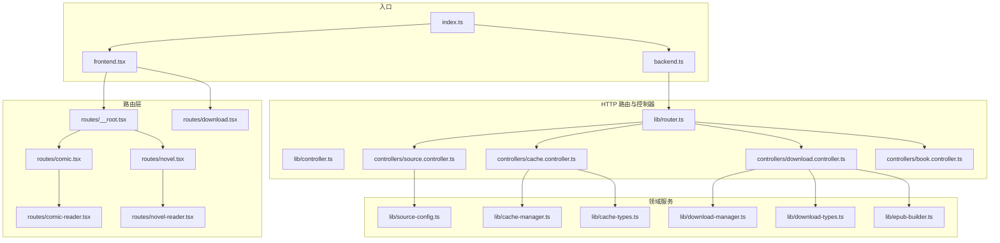
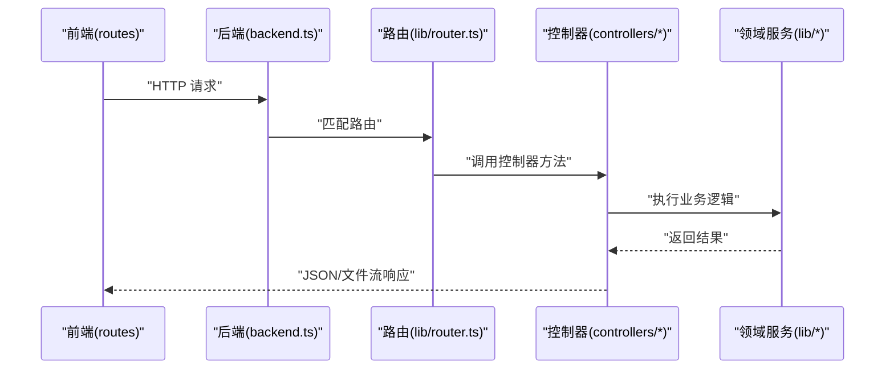
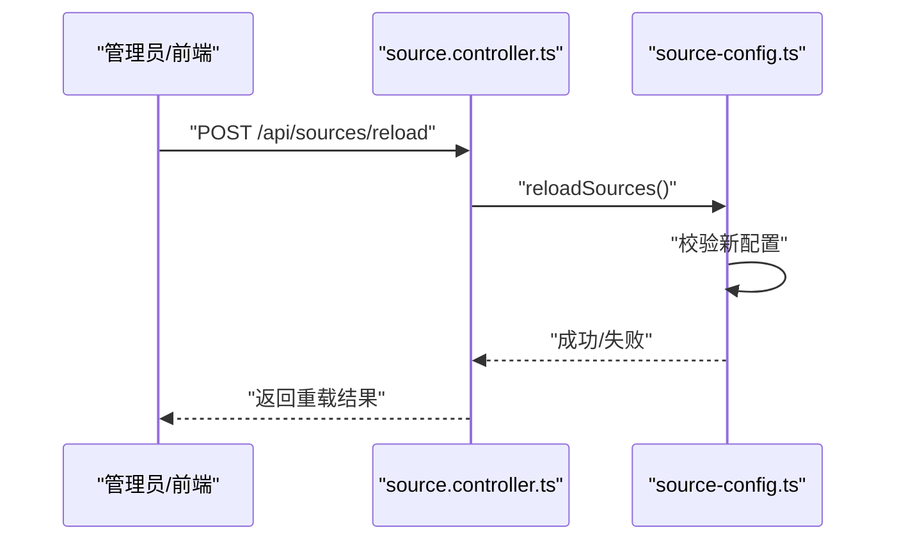
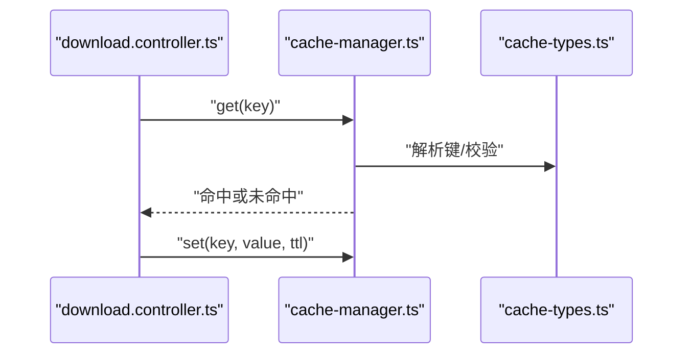
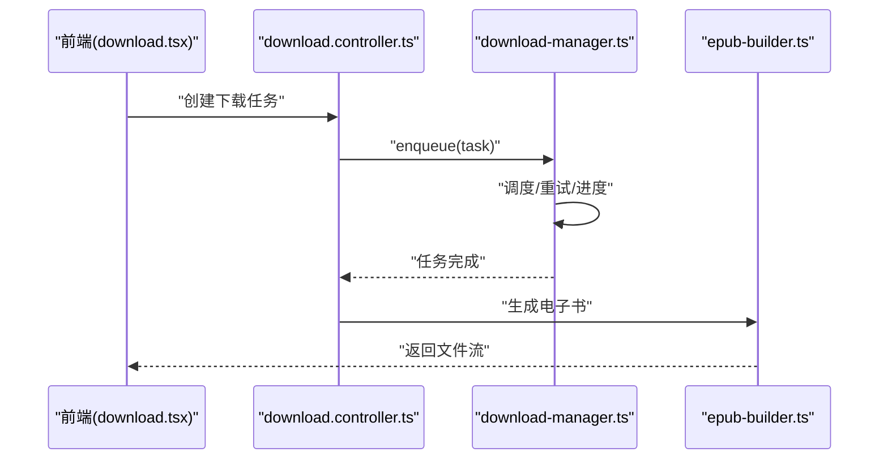
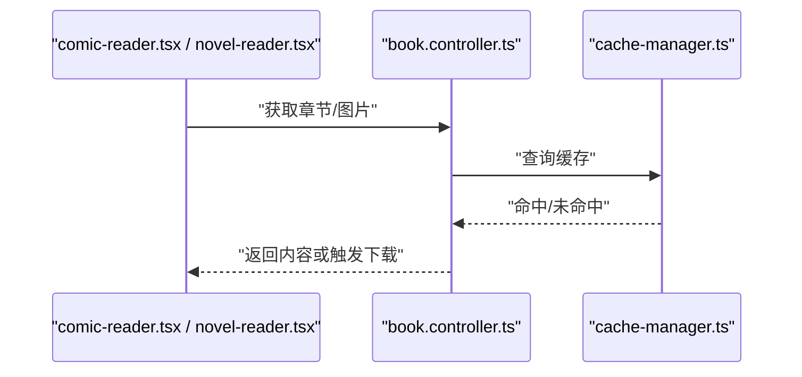
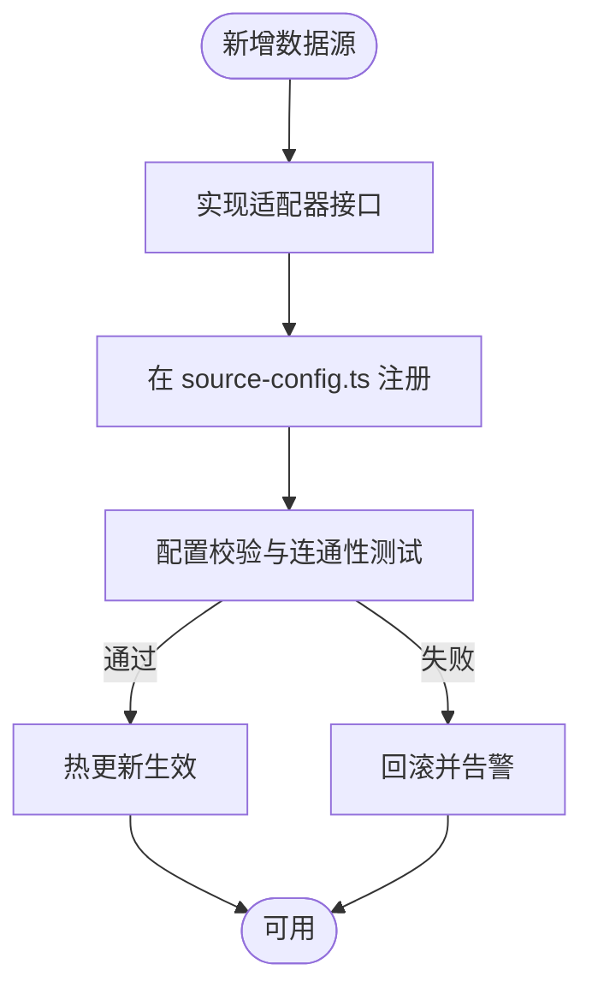
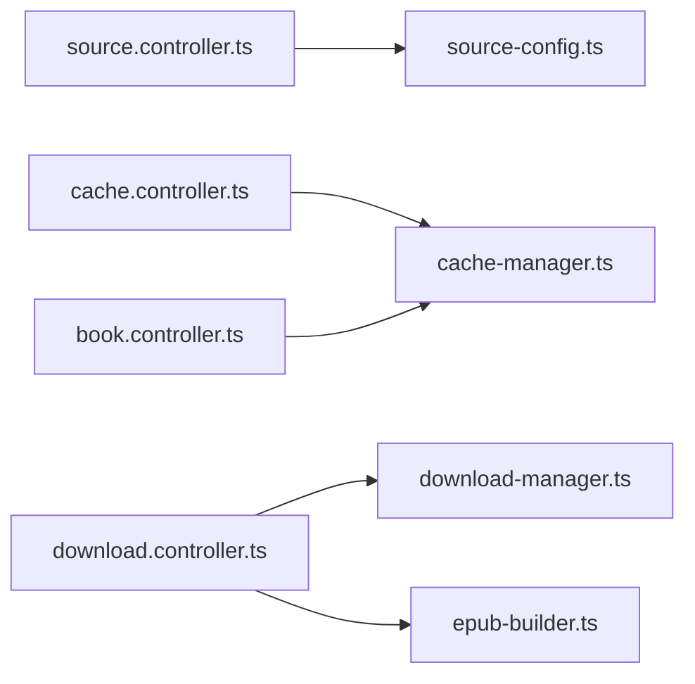

# 集成模式

<cite>
**本文引用的文件**   
- [index.ts](file://index.ts)
- [backend.ts](file://backend.ts)
- [frontend.tsx](file://frontend.tsx)
- [lib/router.ts](file://lib/router.ts)
- [lib/controller.ts](file://lib/controller.ts)
- [controllers/source.controller.ts](file://controllers/source.controller.ts)
- [controllers/cache.controller.ts](file://controllers/cache.controller.ts)
- [controllers/download.controller.ts](file://controllers/download.controller.ts)
- [controllers/book.controller.ts](file://controllers/book.controller.ts)
- [lib/source-config.ts](file://lib/source-config.ts)
- [lib/cache-manager.ts](file://lib/cache-manager.ts)
- [lib/cache-types.ts](file://lib/cache-types.ts)
- [lib/download-manager.ts](file://lib/download-manager.ts)
- [lib/download-types.ts](file://lib/download-types.ts)
- [lib/epub-builder.ts](file://lib/epub-builder.ts)
- [routes/__root.tsx](file://routes/__root.tsx)
- [routes/comic.tsx](file://routes/comic.tsx)
- [routes/novel.tsx](file://routes/novel.tsx)
- [routes/comic-reader.tsx](file://routes/comic-reader.tsx)
- [routes/novel-reader.tsx](file://routes/novel-reader.tsx)
- [routes/download.tsx](file://routes/download.tsx)
</cite>

## 目录
1. [简介](#简介)
2. [项目结构](#项目结构)
3. [核心组件](#核心组件)
4. [架构总览](#架构总览)
5. [详细组件分析](#详细组件分析)
6. [依赖关系分析](#依赖关系分析)
7. [性能考虑](#性能考虑)
8. [故障排查指南](#故障排查指南)
9. [结论](#结论)
10. [附录](#附录)

## 简介
本文件面向 Bun-zlib 项目的“集成模式”，聚焦系统与外部系统的集成方式与协议，覆盖以下主题：
- 数据源配置管理机制（动态加载、热更新）
- 文件系统集成的最佳实践（权限控制、路径安全）
- 网络请求封装模式与重试策略
- 插件化数据源扩展设计
- 安全考虑与访问控制机制

文档以代码级事实为依据，结合可视化图示帮助读者快速理解整体集成方案。

## 项目结构
Bun-zlib 采用前后端同仓的轻量架构：后端基于 Bun 运行时提供 HTTP API，前端通过路由渲染页面；业务逻辑集中在 lib 与 controllers 目录中，数据源相关能力由 source-config 与对应控制器协调。

图表来源
- [index.ts](file://index.ts)
- [backend.ts](file://backend.ts)
- [frontend.tsx](file://frontend.tsx)
- [lib/router.ts](file://lib/router.ts)
- [lib/controller.ts](file://lib/controller.ts)
- [controllers/source.controller.ts](file://controllers/source.controller.ts)
- [controllers/cache.controller.ts](file://controllers/cache.controller.ts)
- [controllers/download.controller.ts](file://controllers/download.controller.ts)
- [controllers/book.controller.ts](file://controllers/book.controller.ts)
- [lib/source-config.ts](file://lib/source-config.ts)
- [lib/cache-manager.ts](file://lib/cache-manager.ts)
- [lib/cache-types.ts](file://lib/cache-types.ts)
- [lib/download-manager.ts](file://lib/download-manager.ts)
- [lib/download-types.ts](file://lib/download-types.ts)
- [lib/epub-builder.ts](file://lib/epub-builder.ts)
- [routes/__root.tsx](file://routes/__root.tsx)
- [routes/comic.tsx](file://routes/comic.tsx)
- [routes/novel.tsx](file://routes/novel.tsx)
- [routes/comic-reader.tsx](file://routes/comic-reader.tsx)
- [routes/novel-reader.tsx](file://routes/novel-reader.tsx)
- [routes/download.tsx](file://routes/download.tsx)

章节来源
- [index.ts](file://index.ts)
- [backend.ts](file://backend.ts)
- [frontend.tsx](file://frontend.tsx)
- [lib/router.ts](file://lib/router.ts)
- [lib/controller.ts](file://lib/controller.ts)
- [controllers/source.controller.ts](file://controllers/source.controller.ts)
- [controllers/cache.controller.ts](file://controllers/cache.controller.ts)
- [controllers/download.controller.ts](file://controllers/download.controller.ts)
- [controllers/book.controller.ts](file://controllers/book.controller.ts)
- [lib/source-config.ts](file://lib/source-config.ts)
- [lib/cache-manager.ts](file://lib/cache-manager.ts)
- [lib/cache-types.ts](file://lib/cache-types.ts)
- [lib/download-manager.ts](file://lib/download-manager.ts)
- [lib/download-types.ts](file://lib/download-types.ts)
- [lib/epub-builder.ts](file://lib/epub-builder.ts)
- [routes/__root.tsx](file://routes/__root.tsx)
- [routes/comic.tsx](file://routes/comic.tsx)
- [routes/novel.tsx](file://routes/novel.tsx)
- [routes/comic-reader.tsx](file://routes/comic-reader.tsx)
- [routes/novel-reader.tsx](file://routes/novel-reader.tsx)
- [routes/download.tsx](file://routes/download.tsx)

## 核心组件
- 路由与控制器
  - lib/router.ts：集中注册 HTTP 路由，将 URL 映射到控制器方法。
  - lib/controller.ts：定义控制器基类或通用处理流程，统一参数解析、响应格式与错误包装。
  - controllers/*：按功能域划分控制器，如数据源管理、缓存、下载、书籍等。
- 数据源配置
  - lib/source-config.ts：维护数据源元信息、加载策略与热更新钩子。
- 缓存与下载
  - lib/cache-manager.ts / lib/cache-types.ts：缓存读写、失效策略与类型契约。
  - lib/download-manager.ts / lib/download-types.ts：任务编排、并发控制、进度与状态持久化。
  - lib/epub-builder.ts：将内容打包为电子书产物。
- 前端路由
  - routes/*：页面级路由与交互入口，调用后端 API 完成数据获取与操作。

章节来源
- [lib/router.ts](file://lib/router.ts)
- [lib/controller.ts](file://lib/controller.ts)
- [controllers/source.controller.ts](file://controllers/source.controller.ts)
- [controllers/cache.controller.ts](file://controllers/cache.controller.ts)
- [controllers/download.controller.ts](file://controllers/download.controller.ts)
- [controllers/book.controller.ts](file://controllers/book.controller.ts)
- [lib/source-config.ts](file://lib/source-config.ts)
- [lib/cache-manager.ts](file://lib/cache-manager.ts)
- [lib/cache-types.ts](file://lib/cache-types.ts)
- [lib/download-manager.ts](file://lib/download-manager.ts)
- [lib/download-types.ts](file://lib/download-types.ts)
- [lib/epub-builder.ts](file://lib/epub-builder.ts)

## 架构总览
系统采用“前端路由 + 后端 HTTP API”的分层架构。前端通过 routes 发起请求，后端由 router 分发至控制器，控制器再调用领域服务（source-config、cache-manager、download-manager、epub-builder）。

图表来源
- [backend.ts](file://backend.ts)
- [lib/router.ts](file://lib/router.ts)
- [controllers/source.controller.ts](file://controllers/source.controller.ts)
- [controllers/cache.controller.ts](file://controllers/cache.controller.ts)
- [controllers/download.controller.ts](file://controllers/download.controller.ts)
- [controllers/book.controller.ts](file://controllers/book.controller.ts)
- [lib/source-config.ts](file://lib/source-config.ts)
- [lib/cache-manager.ts](file://lib/cache-manager.ts)
- [lib/download-manager.ts](file://lib/download-manager.ts)
- [lib/epub-builder.ts](file://lib/epub-builder.ts)

## 详细组件分析

### 数据源配置管理与热更新
- 职责边界
  - source-config.ts：负责数据源的注册、发现、校验与生命周期管理，暴露热更新接口。
  - source.controller.ts：对外暴露数据源配置的增删改查与重载接口。
- 关键流程
  - 动态加载：启动时扫描配置或从存储加载，构建内存中的源清单。
  - 热更新：通过控制器触发 reload/reconfigure，实现不重启服务的增量生效。
  - 校验与回滚：对新增/变更配置进行合法性校验，失败时保持旧版本稳定。
- 典型序列图

图表来源
- [controllers/source.controller.ts](file://controllers/source.controller.ts)
- [lib/source-config.ts](file://lib/source-config.ts)

章节来源
- [controllers/source.controller.ts](file://controllers/source.controller.ts)
- [lib/source-config.ts](file://lib/source-config.ts)

### 缓存子系统
- 职责边界
  - cache-manager.ts：提供统一的缓存读写、过期与批量操作。
  - cache-types.ts：定义缓存键、条目结构与序列化约定。
- 使用场景
  - 数据源列表缓存、热门资源预取、跨请求共享中间结果。
- 典型序列图

图表来源
- [controllers/download.controller.ts](file://controllers/download.controller.ts)
- [lib/cache-manager.ts](file://lib/cache-manager.ts)
- [lib/cache-types.ts](file://lib/cache-types.ts)

章节来源
- [controllers/download.controller.ts](file://controllers/download.controller.ts)
- [lib/cache-manager.ts](file://lib/cache-manager.ts)
- [lib/cache-types.ts](file://lib/cache-types.ts)

### 下载与打包
- 职责边界
  - download-manager.ts：编排下载任务、并发控制、断点续传与进度上报。
  - download-types.ts：定义任务模型、状态机与回调事件。
  - epub-builder.ts：将下载到的内容组装为电子书。
- 典型序列图

图表来源
- [routes/download.tsx](file://routes/download.tsx)
- [controllers/download.controller.ts](file://controllers/download.controller.ts)
- [lib/download-manager.ts](file://lib/download-manager.ts)
- [lib/download-types.ts](file://lib/download-types.ts)
- [lib/epub-builder.ts](file://lib/epub-builder.ts)

章节来源
- [routes/download.tsx](file://routes/download.tsx)
- [controllers/download.controller.ts](file://controllers/download.controller.ts)
- [lib/download-manager.ts](file://lib/download-manager.ts)
- [lib/download-types.ts](file://lib/download-types.ts)
- [lib/epub-builder.ts](file://lib/epub-builder.ts)

### 书籍与阅读器
- 职责边界
  - book.controller.ts：书籍元数据、目录与内容读取。
  - routes/comic*.tsx、routes/novel*.tsx：漫画/小说阅读页，调用书籍与下载接口。
- 典型序列图

图表来源
- [routes/comic-reader.tsx](file://routes/comic-reader.tsx)
- [routes/novel-reader.tsx](file://routes/novel-reader.tsx)
- [controllers/book.controller.ts](file://controllers/book.controller.ts)
- [lib/cache-manager.ts](file://lib/cache-manager.ts)

章节来源
- [routes/comic-reader.tsx](file://routes/comic-reader.tsx)
- [routes/novel-reader.tsx](file://routes/novel-reader.tsx)
- [controllers/book.controller.ts](file://controllers/book.controller.ts)
- [lib/cache-manager.ts](file://lib/cache-manager.ts)

### 插件化数据源扩展设计
- 扩展点
  - 在 source-config.ts 中注册新的数据源适配器（名称、版本、能力描述、初始化函数）。
  - 在 source.controller.ts 暴露对应的管理接口（启用/禁用/更新）。
- 扩展步骤
  - 实现适配器：遵循统一接口（列出资源、拉取内容、分页、鉴权等）。
  - 声明配置：在配置中心登记元信息与连接参数。
  - 注册与验证：启动时自动发现或通过热更新注入，并进行连通性测试。
- 流程图

图表来源
- [lib/source-config.ts](file://lib/source-config.ts)
- [controllers/source.controller.ts](file://controllers/source.controller.ts)

章节来源
- [lib/source-config.ts](file://lib/source-config.ts)
- [controllers/source.controller.ts](file://controllers/source.controller.ts)

### 文件系统集成最佳实践
- 路径安全
  - 对所有用户输入的路径进行规范化与白名单校验，禁止越权访问。
  - 限制可访问根目录，避免相对路径穿越。
- 权限控制
  - 最小权限原则：仅授予必要读/写权限。
  - 临时文件隔离：下载与打包产物写入受控目录，定期清理。
- 一致性
  - 原子写入：先写临时文件，成功后再重命名，避免半写文件。
  - 锁机制：并发写入加锁，防止竞争条件。

[本节为通用指导，不直接分析具体文件]

### 网络请求封装与重试策略
- 封装模式
  - 统一请求拦截器：注入超时、重试、日志与指标。
  - 幂等与去抖：对重复请求合并，避免风暴。
  - 错误分类：区分网络错误、服务端错误与业务错误，分别处理。
- 重试策略
  - 指数退避：根据错误类型与次数动态调整等待时间。
  - 熔断保护：连续失败达到阈值后快速失败，降低雪崩风险。
  - 限流与背压：控制并发度，避免下游过载。

[本节为通用指导，不直接分析具体文件]

### 安全考虑与访问控制
- 认证与授权
  - 敏感接口需鉴权（如数据源重载、删除），建议引入令牌校验与角色权限。
- 输入校验
  - 严格校验所有入参，拒绝非法字符与异常长度。
- 输出安全
  - 对文件下载进行类型与大小限制，防止恶意文件执行。
- 审计与监控
  - 记录关键操作日志，便于追踪与回溯。

[本节为通用指导，不直接分析具体文件]

## 依赖关系分析
- 模块耦合
  - 控制器依赖领域服务，领域服务之间通过类型契约解耦。
  - 前端通过路由与后端 API 松耦合，便于替换实现。
- 外部依赖
  - 文件系统：用于缓存与产物落盘。
  - 网络：数据源拉取与远程资源访问。
- 潜在循环依赖
  - 确保控制器不反向依赖领域服务之外的上层模块。

图表来源
- [controllers/source.controller.ts](file://controllers/source.controller.ts)
- [controllers/cache.controller.ts](file://controllers/cache.controller.ts)
- [controllers/download.controller.ts](file://controllers/download.controller.ts)
- [controllers/book.controller.ts](file://controllers/book.controller.ts)
- [lib/source-config.ts](file://lib/source-config.ts)
- [lib/cache-manager.ts](file://lib/cache-manager.ts)
- [lib/download-manager.ts](file://lib/download-manager.ts)
- [lib/epub-builder.ts](file://lib/epub-builder.ts)

章节来源
- [controllers/source.controller.ts](file://controllers/source.controller.ts)
- [controllers/cache.controller.ts](file://controllers/cache.controller.ts)
- [controllers/download.controller.ts](file://controllers/download.controller.ts)
- [controllers/book.controller.ts](file://controllers/book.controller.ts)
- [lib/source-config.ts](file://lib/source-config.ts)
- [lib/cache-manager.ts](file://lib/cache-manager.ts)
- [lib/download-manager.ts](file://lib/download-manager.ts)
- [lib/epub-builder.ts](file://lib/epub-builder.ts)

## 性能考虑
- 缓存命中率：合理设置 TTL 与键空间，减少重复 IO 与网络开销。
- 并发控制：下载任务分片并行，但限制全局并发度，避免打满 I/O 与带宽。
- 流式处理：大文件下载与打包尽量使用流式传输，降低内存峰值。
- 预热与预取：热点资源提前加载，缩短首屏与首次打开延迟。

[本节为通用指导，不直接分析具体文件]

## 故障排查指南
- 常见问题定位
  - 数据源热更新失败：检查 source-config.ts 的校验逻辑与回滚路径。
  - 下载中断：查看 download-manager.ts 的重试与断点续传状态。
  - 缓存不一致：核对 cache-manager.ts 的键生成与失效策略。
- 日志与指标
  - 在控制器与服务层增加结构化日志，记录关键步骤与耗时。
  - 暴露健康检查与统计接口，便于监控平台采集。

章节来源
- [lib/source-config.ts](file://lib/source-config.ts)
- [controllers/source.controller.ts](file://controllers/source.controller.ts)
- [lib/download-manager.ts](file://lib/download-manager.ts)
- [lib/cache-manager.ts](file://lib/cache-manager.ts)

## 结论
Bun-zlib 通过清晰的分层与模块化设计，实现了数据源配置的热更新、缓存与下载的可靠编排，以及电子书产物的生成。围绕插件化数据源、路径安全、网络重试与安全访问控制的最佳实践，可在保证稳定性的同时提升可扩展性与可运维性。

[本节为总结性内容，不直接分析具体文件]

## 附录
- 术语
  - 数据源：指外部内容提供者（站点、仓库等）的统一抽象。
  - 热更新：在不重启进程的情况下动态刷新配置或组件。
  - 熔断：当连续失败超过阈值时快速失败，避免雪崩。

[本节为补充说明，不直接分析具体文件]