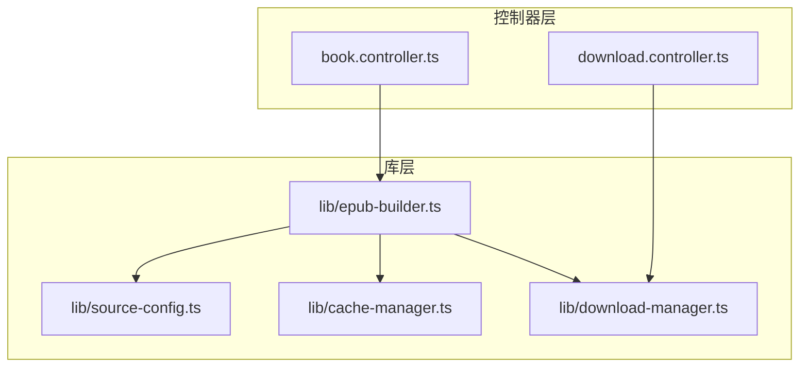
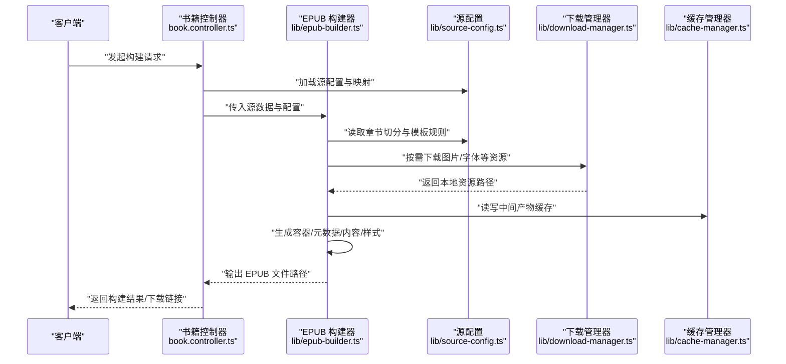
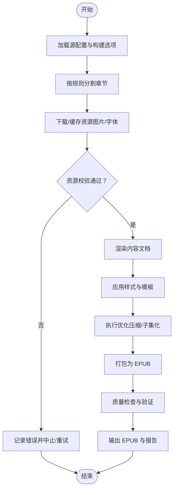
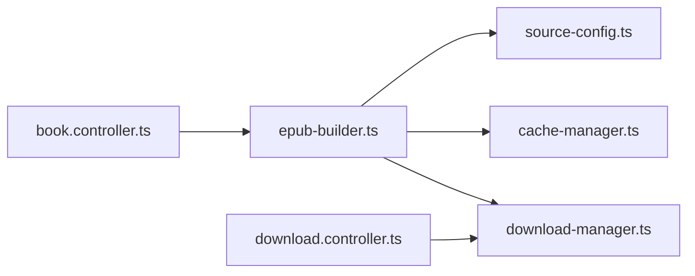

# EPUB 构建器

<cite>
**本文引用的文件**   
- [epub-builder.ts](file://lib/epub-builder.ts)
- [book.controller.ts](file://controllers/book.controller.ts)
- [download.controller.ts](file://controllers/download.controller.ts)
- [source-config.ts](file://lib/source-config.ts)
- [cache-manager.ts](file://lib/cache-manager.ts)
- [download-manager.ts](file://lib/download-manager.ts)
- [package.json](file://package.json)
</cite>

## 目录
1. [简介](#简介)
2. [项目结构](#项目结构)
3. [核心组件](#核心组件)
4. [架构总览](#架构总览)
5. [详细组件分析](#详细组件分析)
6. [依赖关系分析](#依赖关系分析)
7. [性能考虑](#性能考虑)
8. [故障排查指南](#故障排查指南)
9. [结论](#结论)
10. [附录](#附录)

## 简介
本模块围绕 EPUB 构建能力，提供从内容解析、章节分割、资源处理（图片、字体）、样式与模板配置到最终打包输出的完整流程。文档面向技术与非技术读者，既解释 EPUB 规范在工程中的落地方式，也给出可操作的集成示例与问题排障建议。

## 项目结构
本项目采用分层组织：控制器负责请求路由与编排；库层封装 EPUB 构建、下载与缓存等通用能力；前端页面通过控制器调用后端能力。EPUB 构建的核心实现位于库层的构建器中，并与下载管理器、缓存管理器协作完成资源获取与复用。

图表来源
- [book.controller.ts](file://controllers/book.controller.ts)
- [download.controller.ts](file://controllers/download.controller.ts)
- [epub-builder.ts](file://lib/epub-builder.ts)
- [source-config.ts](file://lib/source-config.ts)
- [cache-manager.ts](file://lib/cache-manager.ts)
- [download-manager.ts](file://lib/download-manager.ts)

章节来源
- [epub-builder.ts](file://lib/epub-builder.ts)
- [book.controller.ts](file://controllers/book.controller.ts)
- [download.controller.ts](file://controllers/download.controller.ts)
- [source-config.ts](file://lib/source-config.ts)
- [cache-manager.ts](file://lib/cache-manager.ts)
- [download-manager.ts](file://lib/download-manager.ts)

## 核心组件
- EPUB 构建器：负责将源数据转换为符合规范的 EPUB 包，包括容器文件、元数据、内容结构与样式文件的组织与打包。
- 源配置：定义不同来源的数据映射、章节切分策略、资源路径规则与模板选择。
- 下载管理器：统一资源下载、重试与并发控制，为构建器提供稳定的资源输入。
- 缓存管理器：对已下载或已处理的中间产物进行缓存，减少重复工作并提升构建速度。

章节来源
- [epub-builder.ts](file://lib/epub-builder.ts)
- [source-config.ts](file://lib/source-config.ts)
- [download-manager.ts](file://lib/download-manager.ts)
- [cache-manager.ts](file://lib/cache-manager.ts)

## 架构总览
下图展示了从控制器到构建器的整体调用链与数据流，涵盖章节分割、资源处理、样式注入与打包输出。

图表来源
- [book.controller.ts](file://controllers/book.controller.ts)
- [epub-builder.ts](file://lib/epub-builder.ts)
- [source-config.ts](file://lib/source-config.ts)
- [download-manager.ts](file://lib/download-manager.ts)
- [cache-manager.ts](file://lib/cache-manager.ts)

## 详细组件分析

### EPUB 构建器（lib/epub-builder.ts）
- 职责
  - 解析源数据并按配置进行章节分割。
  - 管理资源（图片、字体）的下载、校验与嵌入。
  - 生成并组装 EPUB 标准结构：容器文件、元数据、内容文档与样式文件。
  - 执行必要的优化（如图片压缩、字体子集化）与体积控制。
  - 输出最终的 EPUB 包并提供质量检查入口。
- 关键流程
  - 输入：源数据、源配置、构建选项（模板、样式、优化开关）。
  - 处理：章节切分 → 资源拉取与缓存 → 内容渲染与样式注入 → 打包。
  - 输出：EPUB 文件路径、构建日志与可选的质量报告。
- 错误处理
  - 网络异常、资源缺失、编码不一致、模板渲染失败等情况均会抛出明确错误并记录上下文。
- 性能要点
  - 并行下载与缓存命中优先；大资源按需处理；增量构建支持。

章节来源
- [epub-builder.ts](file://lib/epub-builder.ts)

#### 构建流程（算法流程图）

图表来源
- [epub-builder.ts](file://lib/epub-builder.ts)

### 源配置（lib/source-config.ts）
- 职责
  - 定义数据来源、字段映射、章节切分策略、资源路径规则与默认模板。
  - 提供多来源适配，使同一构建器可复用。
- 关键点
  - 字段映射：标题、作者、描述、封面、正文片段等。
  - 切分策略：按段落、标签或固定长度切分，保证可读性与导航结构。
  - 资源规则：相对路径、命名规范、占位符替换。
  - 模板选择：内置模板与自定义模板切换。

章节来源
- [source-config.ts](file://lib/source-config.ts)

### 下载管理器（lib/download-manager.ts）
- 职责
  - 统一管理外部资源的下载、重试、超时与并发控制。
  - 提供一致性接口供构建器与缓存管理器使用。
- 关键点
  - 并发度限制与退避策略。
  - 断点续传与失败重试。
  - 资源指纹与去重。

章节来源
- [download-manager.ts](file://lib/download-manager.ts)

### 缓存管理器（lib/cache-manager.ts）
- 职责
  - 缓存已下载的资源与中间产物，避免重复计算。
  - 提供键值存储、过期策略与清理机制。
- 关键点
  - 缓存键设计（基于内容哈希）。
  - 增量构建时的失效与更新策略。
  - 磁盘占用监控与自动清理。

章节来源
- [cache-manager.ts](file://lib/cache-manager.ts)

### 控制器集成（controllers/book.controller.ts, controllers/download.controller.ts）
- 书籍控制器
  - 接收构建请求，解析参数，调用构建器并返回结果。
  - 协调源配置与构建选项，确保输入合法性。
- 下载控制器
  - 暴露资源下载相关接口，供构建器或其他服务调用。
  - 提供进度、状态查询与批量下载能力。

章节来源
- [book.controller.ts](file://controllers/book.controller.ts)
- [download.controller.ts](file://controllers/download.controller.ts)

## 依赖关系分析
- 内部依赖
  - 构建器依赖源配置、下载管理器与缓存管理器。
  - 控制器依赖构建器与下载控制器提供的能力。
- 外部依赖
  - 通过 package.json 声明的第三方库（例如用于 ZIP 打包、XML 处理、图像处理等），由构建器在运行时引入。

图表来源
- [book.controller.ts](file://controllers/book.controller.ts)
- [download.controller.ts](file://controllers/download.controller.ts)
- [epub-builder.ts](file://lib/epub-builder.ts)
- [source-config.ts](file://lib/source-config.ts)
- [cache-manager.ts](file://lib/cache-manager.ts)
- [download-manager.ts](file://lib/download-manager.ts)
- [package.json](file://package.json)

章节来源
- [package.json](file://package.json)

## 性能考虑
- 并行与限流：合理设置下载并发度，避免阻塞 I/O。
- 缓存命中：利用缓存减少重复下载与渲染成本。
- 资源优化：图片压缩、字体子集化、冗余资源剔除。
- 增量构建：仅重建变更部分，缩短构建时间。
- 内存管理：大文件流式处理，避免一次性加载导致内存峰值过高。

[本节为通用指导，不直接分析具体文件]

## 故障排查指南
- 常见错误
  - 网络超时与重试失败：检查代理、域名解析与目标可用性。
  - 资源缺失或路径错误：核对源配置中的资源规则与相对路径。
  - 编码问题：确认文本与资源编码一致，必要时进行转码。
  - 模板渲染失败：检查模板语法与变量映射是否匹配。
  - 打包失败：检查 EPUB 结构完整性与文件命名规范。
- 定位方法
  - 查看构建日志与错误堆栈，关注最近一次失败的步骤。
  - 启用调试模式，输出详细的中间产物与资源清单。
  - 使用质量检查工具对生成的 EPUB 进行验证。

章节来源
- [epub-builder.ts](file://lib/epub-builder.ts)
- [source-config.ts](file://lib/source-config.ts)
- [download-manager.ts](file://lib/download-manager.ts)
- [cache-manager.ts](file://lib/cache-manager.ts)

## 结论
本模块以清晰的职责划分与良好的扩展性实现了 EPUB 构建的全链路能力。通过源配置驱动、资源管理与缓存优化，能够在保证兼容性的同时提升构建效率与稳定性。结合质量控制与排障手段，可为书籍管理系统提供可靠的 EPUB 输出能力。

[本节为总结性内容，不直接分析具体文件]

## 附录

### EPUB 规范理解与实现要点
- 容器文件
  - 根目录包含容器描述文件，用于定位主文档位置。
- 元数据
  - 包含书名、作者、语言、版本、标识符等核心信息。
- 内容结构
  - 章节文档按顺序组织，提供导航与目录信息。
- 样式文件
  - 全局样式与章节局部样式分离，便于维护与复用。
- 资源嵌入
  - 图片与字体按规范引用，注意命名与路径一致性。

[本节为概念性说明，不直接分析具体文件]

### 章节分割策略
- 基于段落或标签切分，保持语义完整。
- 控制每章大小，平衡阅读体验与渲染性能。
- 生成导航条目，确保阅读器友好。

[本节为概念性说明，不直接分析具体文件]

### 图片处理与字体嵌入
- 图片
  - 格式选择（JPEG/PNG/WebP）、尺寸缩放与压缩。
  - 懒加载与按需渲染以提升性能。
- 字体
  - 子集化以减少体积，保留必要字形。
  - 跨平台兼容性测试与回退策略。

[本节为概念性说明，不直接分析具体文件]

### 自定义模板与样式配置
- 模板
  - 支持内置与自定义模板，通过配置切换。
  - 变量映射与占位符替换。
- 样式
  - 主题与排版参数集中管理。
  - 章节级覆盖与优先级控制。

[本节为概念性说明，不直接分析具体文件]

### 内容转换与数据映射
- 字段映射
  - 标题、作者、描述、封面、正文片段等标准化。
- 转换规则
  - HTML 清洗、富文本转结构化内容。
  - 资源路径规范化与引用修复。

[本节为概念性说明，不直接分析具体文件]

### 与书籍管理系统的集成
- 接口契约
  - 构建请求参数、响应结构与错误码约定。
- 数据同步
  - 增量同步与冲突解决策略。
- 任务队列
  - 异步构建与进度回调。

[本节为概念性说明，不直接分析具体文件]

### 兼容性、编码与体积优化
- 兼容性
  - 阅读器差异与特性检测。
  - 降级方案与回退策略。
- 编码
  - 统一 UTF-8，必要时进行转码。
- 体积优化
  - 资源压缩、冗余清理与按需加载。

[本节为概念性说明，不直接分析具体文件]

### EPUB 验证与质量检查
- 验证工具
  - 使用标准验证器检查结构、元数据与引用。
- 质量指标
  - 文件大小、图片质量、字体覆盖率与导航完整性。
- 自动化
  - 在构建流水线中加入验证步骤，阻断不合格产物。

[本节为概念性说明，不直接分析具体文件]