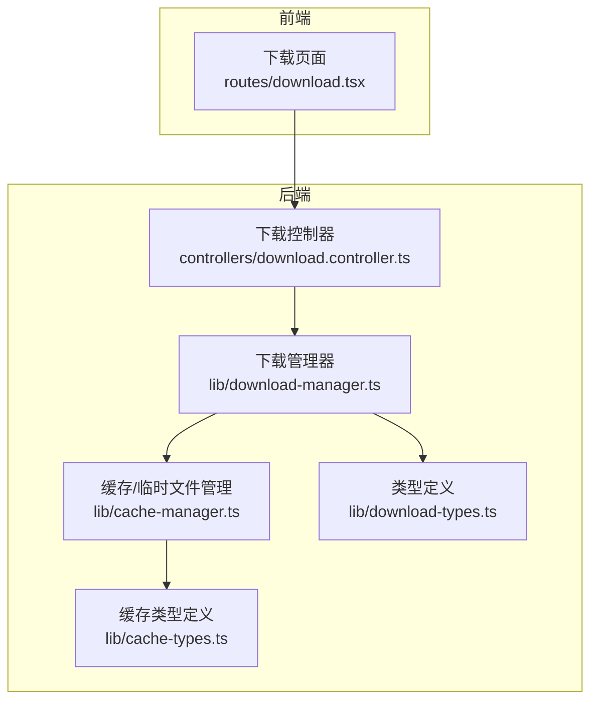
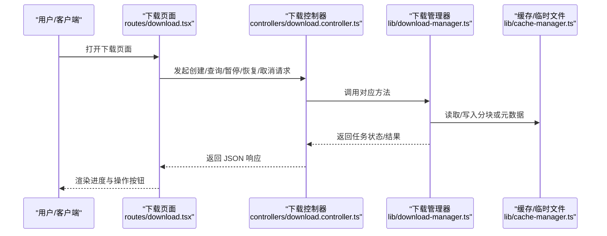
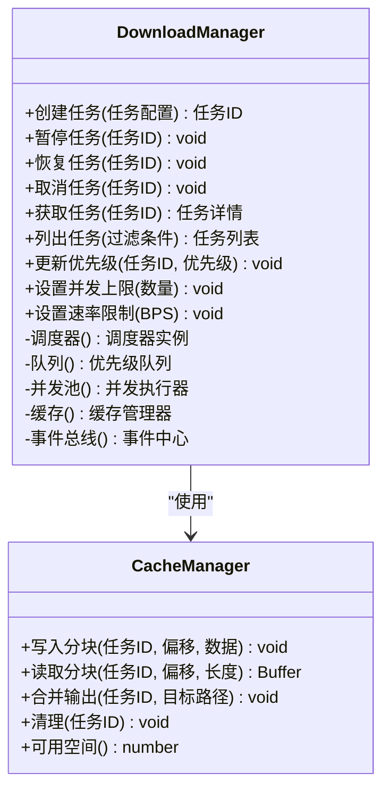
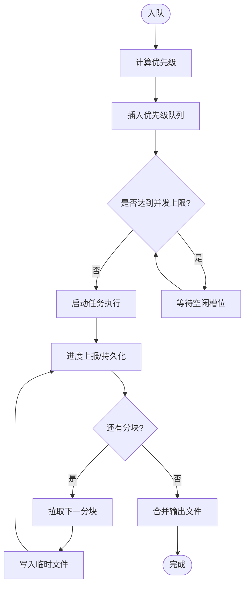
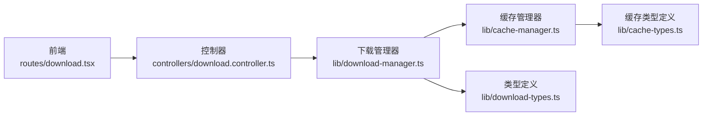

# 下载管理器

<cite>
**本文引用的文件**   
- [download-manager.ts](file://lib/download-manager.ts)
- [download-types.ts](file://lib/download-types.ts)
- [download.controller.ts](file://controllers/download.controller.ts)
- [download.tsx](file://routes/download.tsx)
- [cache-manager.ts](file://lib/cache-manager.ts)
- [cache-types.ts](file://lib/cache-types.ts)
</cite>

## 目录
1. [简介](#简介)
2. [项目结构](#项目结构)
3. [核心组件](#核心组件)
4. [架构总览](#架构总览)
5. [详细组件分析](#详细组件分析)
6. [依赖关系分析](#依赖关系分析)
7. [性能考虑](#性能考虑)
8. [故障排查指南](#故障排查指南)
9. [结论](#结论)
10. [附录](#附录)

## 简介
本文件为“下载管理器”模块的权威技术文档，聚焦以下目标：
- 深入解释下载任务调度算法、并发控制机制与任务队列实现
- 记录下载任务的创建、监控、暂停、恢复与取消操作的接口定义
- 覆盖进度跟踪、断点续传、错误重试与网络异常处理
- 提供批量下载、优先级调度与资源限制的配置示例
- 说明与网络请求库的集成方式与文件写入策略
- 给出下载失败、存储空间不足、网络中断等问题的解决方案
- 提供性能监控与调试工具的使用指南

## 项目结构
围绕下载管理器的关键代码分布在以下位置：
- lib/download-manager.ts：下载任务调度、并发控制、队列与状态机实现
- lib/download-types.ts：下载任务类型、事件与配置模型
- controllers/download.controller.ts：HTTP 控制器，暴露下载相关 API
- routes/download.tsx：前端路由页面，用于展示与管理下载任务
- lib/cache-manager.ts / cache-types.ts：缓存与临时文件管理（断点续传、分块存储）

图表来源
- [download.tsx](file://routes/download.tsx)
- [download.controller.ts](file://controllers/download.controller.ts)
- [download-manager.ts](file://lib/download-manager.ts)
- [download-types.ts](file://lib/download-types.ts)
- [cache-manager.ts](file://lib/cache-manager.ts)
- [cache-types.ts](file://lib/cache-types.ts)

章节来源
- [download-manager.ts](file://lib/download-manager.ts)
- [download-types.ts](file://lib/download-types.ts)
- [download.controller.ts](file://controllers/download.controller.ts)
- [download.tsx](file://routes/download.tsx)
- [cache-manager.ts](file://lib/cache-manager.ts)
- [cache-types.ts](file://lib/cache-types.ts)

## 核心组件
- 下载管理器（DownloadManager）
  - 职责：任务生命周期管理、调度与并发控制、事件广播、持久化与恢复
  - 关键能力：创建/暂停/恢复/取消任务；优先级队列；速率限制；断点续传；重试策略
- 类型系统（Download Types）
  - 职责：统一任务状态、事件、配置项与响应结构的类型契约
- 控制器（Download Controller）
  - 职责：将 HTTP 请求映射到下载管理器的方法，返回标准化响应
- 缓存/临时文件管理（Cache Manager）
  - 职责：分块写入、合并、清理、空间检查与路径规划，支撑断点续传

章节来源
- [download-manager.ts](file://lib/download-manager.ts)
- [download-types.ts](file://lib/download-types.ts)
- [download.controller.ts](file://controllers/download.controller.ts)
- [cache-manager.ts](file://lib/cache-manager.ts)
- [cache-types.ts](file://lib/cache-types.ts)

## 架构总览
下载管理器采用“控制器 + 服务 + 存储”的分层架构。控制器负责协议适配，下载管理器负责业务编排与并发控制，缓存管理器负责磁盘 I/O 与断点数据持久化。

图表来源
- [download.tsx](file://routes/download.tsx)
- [download.controller.ts](file://controllers/download.controller.ts)
- [download-manager.ts](file://lib/download-manager.ts)
- [cache-manager.ts](file://lib/cache-manager.ts)

## 详细组件分析

### 下载管理器（DownloadManager）
- 任务模型与状态机
  - 状态包括：待处理、排队中、进行中、暂停、完成、失败、已取消
  - 状态转换遵循严格的约束，避免非法迁移
- 调度与并发控制
  - 基于优先级的任务队列，支持动态调整优先级
  - 全局并发上限与每任务限速，防止资源争用
  - 背压与退避：当队列积压时降低新任务入队速率
- 断点续传
  - 以分块为单位写入临时文件，记录偏移量与校验信息
  - 恢复时按偏移量继续下载，避免重复传输
- 错误处理与重试
  - 区分可重试与不可重试错误
  - 指数退避与最大重试次数限制
  - 网络异常自动降级与熔断保护
- 事件与监控
  - 任务级事件：开始、进度、完成、失败、取消
  - 系统级事件：队列长度变化、并发度变化、磁盘空间告警

图表来源
- [download-manager.ts](file://lib/download-manager.ts)
- [cache-manager.ts](file://lib/cache-manager.ts)

章节来源
- [download-manager.ts](file://lib/download-manager.ts)

#### 调度与队列流程

图表来源
- [download-manager.ts](file://lib/download-manager.ts)

### 类型系统（Download Types）
- 任务配置
  - 包含 URL、目标路径、分块大小、超时、重试策略、优先级等
- 任务状态
  - 明确各状态的语义与允许的状态迁移
- 事件结构
  - 统一的进度、错误与完成事件格式，便于前端订阅与展示

章节来源
- [download-types.ts](file://lib/download-types.ts)

### 控制器（Download Controller）
- 暴露的 API 能力
  - 创建下载任务：接收任务配置，返回任务 ID 与初始状态
  - 查询任务：根据 ID 或过滤条件返回任务详情与进度
  - 暂停/恢复/取消：对指定任务进行状态切换
  - 批量操作：批量创建、批量暂停/取消
  - 资源设置：并发上限、速率限制、优先级默认值
- 错误与响应
  - 统一错误码与消息结构
  - 参数校验失败返回明确的字段级错误

章节来源
- [download.controller.ts](file://controllers/download.controller.ts)

### 缓存/临时文件管理（Cache Manager）
- 分块写入与合并
  - 按偏移量顺序写入，保证最终文件的完整性
  - 合并阶段校验分块校验和，失败则回滚并标记任务失败
- 断点续传
  - 持久化任务元数据与分块索引，重启后可恢复
- 空间管理
  - 写入前检查可用空间，不足时拒绝任务或触发清理策略
- 清理策略
  - 完成任务及时清理临时文件
  - 失败任务保留一定时间以便诊断

章节来源
- [cache-manager.ts](file://lib/cache-manager.ts)
- [cache-types.ts](file://lib/cache-types.ts)

### 前端集成（下载页面）
- 功能
  - 展示任务列表与进度条
  - 提供暂停/恢复/取消等操作按钮
  - 实时订阅任务事件，刷新 UI
- 交互
  - 通过控制器 API 与后端同步状态
  - 支持批量选择与批量操作

章节来源
- [download.tsx](file://routes/download.tsx)

## 依赖关系分析
- 模块耦合
  - 控制器仅依赖下载管理器与类型定义，保持薄封装
  - 下载管理器依赖缓存管理器与类型定义，屏蔽底层 I/O 细节
  - 前端仅依赖控制器 API，不直接访问内部实现
- 外部依赖
  - 网络请求库：由下载管理器内部封装，对外暴露统一接口
  - 文件系统：由缓存管理器抽象，支持不同平台的路径与权限处理

图表来源
- [download.tsx](file://routes/download.tsx)
- [download.controller.ts](file://controllers/download.controller.ts)
- [download-manager.ts](file://lib/download-manager.ts)
- [download-types.ts](file://lib/download-types.ts)
- [cache-manager.ts](file://lib/cache-manager.ts)
- [cache-types.ts](file://lib/cache-types.ts)

章节来源
- [download-manager.ts](file://lib/download-manager.ts)
- [download.controller.ts](file://controllers/download.controller.ts)
- [download.tsx](file://routes/download.tsx)
- [cache-manager.ts](file://lib/cache-manager.ts)
- [download-types.ts](file://lib/download-types.ts)
- [cache-types.ts](file://lib/cache-types.ts)

## 性能考虑
- 并发与吞吐
  - 合理设置全局并发上限，避免过多连接导致拥塞
  - 针对大文件启用分块并行下载，提升吞吐
- 内存占用
  - 流式写入，避免一次性加载整个文件到内存
  - 控制分块大小，平衡 I/O 效率与内存占用
- 磁盘 I/O
  - 顺序写入减少碎片，合并阶段尽量一次性落盘
  - 定期清理已完成与失败过期的临时文件
- 网络优化
  - 启用连接复用与 Keep-Alive
  - 自适应退避与重试，避免雪崩效应
- 监控指标
  - 队列长度、活跃任务数、平均吞吐、错误率、重试次数、磁盘使用率

[本节为通用指导，无需具体文件引用]

## 故障排查指南
- 常见问题定位
  - 下载失败：查看任务错误码与堆栈，确认是否为网络错误或服务端拒绝
  - 进度停滞：检查队列是否阻塞、并发是否受限、是否存在死锁
  - 磁盘空间不足：检查可用空间阈值与清理策略是否生效
  - 网络中断：观察重试次数与退避策略，必要时手动恢复任务
- 日志与调试
  - 开启详细日志，记录任务生命周期关键节点
  - 导出任务快照与分块索引，辅助离线分析
- 恢复建议
  - 对于可重试错误，自动恢复或手动触发恢复
  - 对于不可重试错误，提示用户修正配置后重新创建任务

章节来源
- [download-manager.ts](file://lib/download-manager.ts)
- [download.controller.ts](file://controllers/download.controller.ts)
- [cache-manager.ts](file://lib/cache-manager.ts)

## 结论
下载管理器通过清晰的职责划分、严格的并发控制与完善的错误处理，提供了稳定高效的下载能力。配合缓存管理器的断点续传与空间管理，能够满足复杂场景下的批量下载需求。建议在部署时结合监控与日志，持续优化并发与重试策略，以获得最佳性能与稳定性。

[本节为总结性内容，无需具体文件引用]

## 附录

### 接口定义（摘要）
- 创建任务
  - 输入：任务配置（URL、目标路径、分块大小、超时、重试策略、优先级等）
  - 输出：任务 ID、初始状态
- 查询任务
  - 输入：任务 ID 或过滤条件
  - 输出：任务详情（状态、进度、错误信息等）
- 暂停/恢复/取消
  - 输入：任务 ID
  - 输出：操作结果与新状态
- 批量操作
  - 输入：任务 ID 列表与操作类型
  - 输出：批量结果
- 资源设置
  - 输入：并发上限、速率限制、默认优先级
  - 输出：当前配置

章节来源
- [download.controller.ts](file://controllers/download.controller.ts)
- [download-types.ts](file://lib/download-types.ts)

### 配置示例（要点）
- 批量下载
  - 设置合理的并发上限与分块大小
  - 为不同任务分配差异化优先级
- 优先级调度
  - 高优先级任务优先入队与执行
  - 支持运行时动态调整优先级
- 资源限制
  - 全局并发上限与每任务速率限制
  - 磁盘空间阈值与自动清理策略

章节来源
- [download-manager.ts](file://lib/download-manager.ts)
- [download-types.ts](file://lib/download-types.ts)

### 与网络请求库的集成与文件写入策略
- 网络请求
  - 使用流式下载，按分块拉取并立即写入
  - 支持 Range 头以实现断点续传
- 文件写入
  - 临时文件按偏移量顺序写入，完成后合并为目标文件
  - 写入失败时保留分块索引，便于恢复

章节来源
- [download-manager.ts](file://lib/download-manager.ts)
- [cache-manager.ts](file://lib/cache-manager.ts)

### 问题解决方案（摘要）
- 下载失败
  - 区分可重试与不可重试错误，应用相应策略
- 存储空间不足
  - 写入前检查空间，不足时拒绝或触发清理
- 网络中断
  - 自动重试与退避，必要时提示用户恢复

章节来源
- [download-manager.ts](file://lib/download-manager.ts)
- [cache-manager.ts](file://lib/cache-manager.ts)

### 性能监控与调试工具
- 监控指标
  - 队列长度、活跃任务数、吞吐、错误率、重试次数、磁盘使用率
- 调试工具
  - 任务快照导出、分块索引查看、详细日志开关
- 使用建议
  - 在测试环境开启详细日志，生产环境按需开启
  - 定期导出监控数据，分析瓶颈与优化点

章节来源
- [download-manager.ts](file://lib/download-manager.ts)
- [download.controller.ts](file://controllers/download.controller.ts)