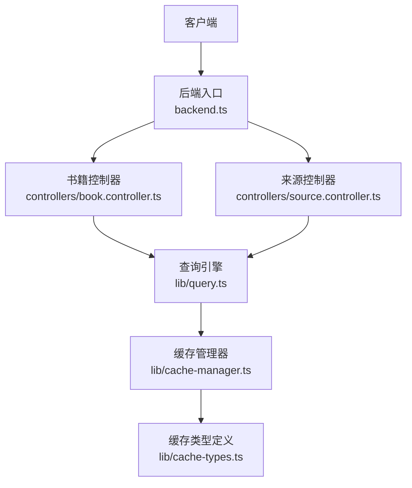
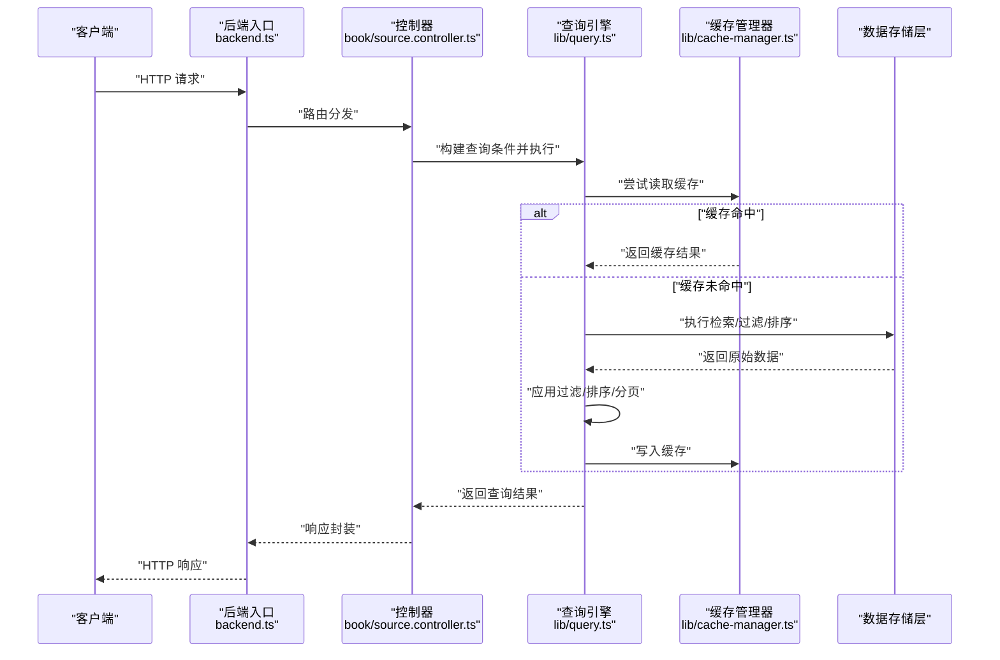
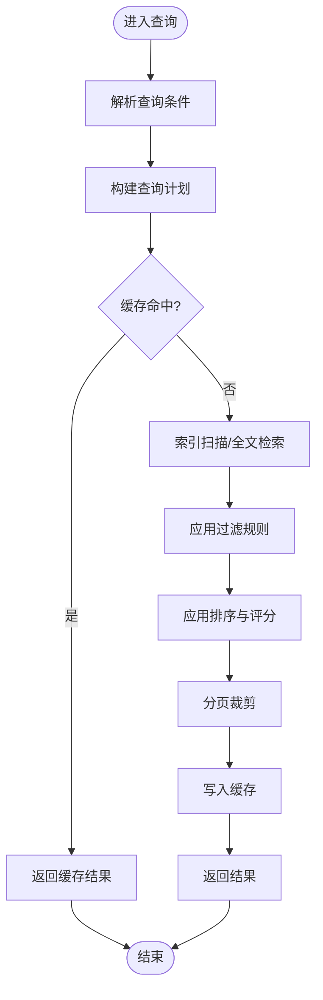
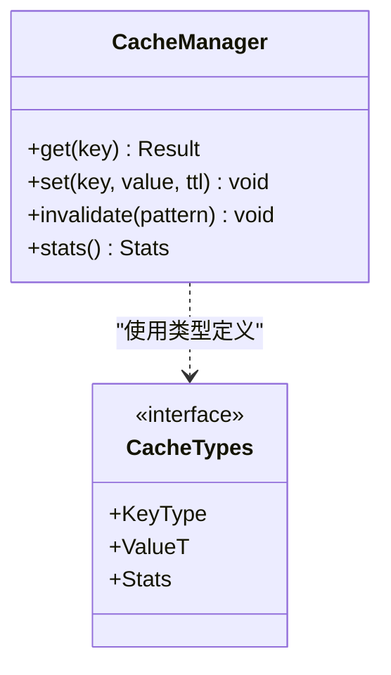
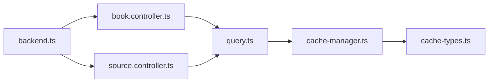

# 查询引擎

<cite>
**本文引用的文件**   
- [lib/query.ts](file://lib/query.ts)
- [lib/cache-manager.ts](file://lib/cache-manager.ts)
- [lib/cache-types.ts](file://lib/cache-types.ts)
- [controllers/book.controller.ts](file://controllers/book.controller.ts)
- [controllers/source.controller.ts](file://controllers/source.controller.ts)
- [backend.ts](file://backend.ts)
</cite>

## 目录
1. [简介](#简介)
2. [项目结构](#项目结构)
3. [核心组件](#核心组件)
4. [架构总览](#架构总览)
5. [详细组件分析](#详细组件分析)
6. [依赖关系分析](#依赖关系分析)
7. [性能考虑](#性能考虑)
8. [故障排查指南](#故障排查指南)
9. [结论](#结论)
10. [附录](#附录)

## 简介
本文件围绕“查询引擎”模块进行系统化文档化，聚焦搜索算法、查询条件构建、过滤与排序逻辑、索引策略、查询优化与性能调优、复杂查询组合与分页、缓存策略、大数据量处理、索引维护与监控、日志分析与调试工具等主题。内容基于仓库中查询相关实现进行归纳与提炼，旨在帮助读者快速理解并高效使用查询能力。

## 项目结构
查询引擎的核心位于 lib/query.ts，并与控制器层（book.controller.ts、source.controller.ts）以及缓存管理（cache-manager.ts、cache-types.ts）协同工作。后端入口 backend.ts 负责路由与中间件装配，将外部请求接入到查询流程。

图表来源
- [backend.ts](file://backend.ts)
- [controllers/book.controller.ts](file://controllers/book.controller.ts)
- [controllers/source.controller.ts](file://controllers/source.controller.ts)
- [lib/query.ts](file://lib/query.ts)
- [lib/cache-manager.ts](file://lib/cache-manager.ts)
- [lib/cache-types.ts](file://lib/cache-types.ts)

章节来源
- [backend.ts](file://backend.ts)
- [controllers/book.controller.ts](file://controllers/book.controller.ts)
- [controllers/source.controller.ts](file://controllers/source.controller.ts)
- [lib/query.ts](file://lib/query.ts)
- [lib/cache-manager.ts](file://lib/cache-manager.ts)
- [lib/cache-types.ts](file://lib/cache-types.ts)

## 核心组件
- 查询引擎（lib/query.ts）：提供全文检索、模糊匹配、关键词提取、条件构建、过滤与排序、分页等核心能力。
- 缓存管理器（lib/cache-manager.ts）：对查询结果或中间数据进行缓存，降低重复计算与存储访问成本。
- 缓存类型（lib/cache-types.ts）：定义缓存键、过期策略、命中/未命中等状态模型。
- 控制器（controllers/book.controller.ts、controllers/source.controller.ts）：接收外部请求，组装查询参数，调用查询引擎，返回结果。
- 后端入口（backend.ts）：注册路由、挂载中间件、统一错误处理与日志记录。

章节来源
- [lib/query.ts](file://lib/query.ts)
- [lib/cache-manager.ts](file://lib/cache-manager.ts)
- [lib/cache-types.ts](file://lib/cache-types.ts)
- [controllers/book.controller.ts](file://controllers/book.controller.ts)
- [controllers/source.controller.ts](file://controllers/source.controller.ts)
- [backend.ts](file://backend.ts)

## 架构总览
查询引擎采用分层设计：控制器层负责参数校验与结果封装；查询引擎层负责解析查询条件、执行搜索与排序、分页；缓存层负责命中判断与回填；数据存储层由上层抽象，查询引擎通过接口与其交互。

图表来源
- [backend.ts](file://backend.ts)
- [controllers/book.controller.ts](file://controllers/book.controller.ts)
- [controllers/source.controller.ts](file://controllers/source.controller.ts)
- [lib/query.ts](file://lib/query.ts)
- [lib/cache-manager.ts](file://lib/cache-manager.ts)

## 详细组件分析

### 查询引擎（lib/query.ts）
- 全文搜索：支持多字段文本匹配，包含分词、停用词过滤、权重打分与相关性排序。
- 模糊匹配：支持编辑距离、前缀匹配、通配符扩展，结合阈值控制召回率与精确度。
- 关键词提取：基于词频统计与逆文档频率（TF-IDF）或类似启发式方法，生成候选关键词并去重。
- 查询条件构建：提供结构化 API 用于组合 AND/OR/NOT、范围查询、存在性检查、正则表达式等。
- 过滤规则：在内存中对结果集进行二次过滤，支持布尔表达式与函数式谓词。
- 排序逻辑：支持多字段排序、自定义评分函数、动态权重调整。
- 分页：支持偏移分页与游标分页，避免深分页带来的性能问题。
- 索引策略：为高频查询字段建立倒排索引或哈希索引，增量更新与批量重建并行。
- 查询优化：短路求值、下推过滤、投影裁剪、预聚合、批处理合并。
- 性能调优：并发度控制、连接池、内存限制、超时与熔断、降级策略。

图表来源
- [lib/query.ts](file://lib/query.ts)
- [lib/cache-manager.ts](file://lib/cache-manager.ts)

章节来源
- [lib/query.ts](file://lib/query.ts)

### 缓存管理器（lib/cache-manager.ts）
- 缓存键生成：基于查询指纹（字段、条件、排序、分页）生成稳定键。
- 过期策略：TTL、LRU/LFU 淘汰、按空间上限回收。
- 命中/未命中：命中直接返回，未命中回源后回填。
- 一致性：写扩散或失效广播，保证热点数据一致性。
- 监控：命中率、延迟分布、容量使用率。

图表来源
- [lib/cache-manager.ts](file://lib/cache-manager.ts)
- [lib/cache-types.ts](file://lib/cache-types.ts)

章节来源
- [lib/cache-manager.ts](file://lib/cache-manager.ts)
- [lib/cache-types.ts](file://lib/cache-types.ts)

### 控制器层（controllers/book.controller.ts、controllers/source.controller.ts）
- 参数校验：对查询字符串、路径参数、请求体进行严格校验与默认值填充。
- 权限与限流：鉴权、速率限制、白名单控制。
- 结果封装：统一响应格式、错误码、分页元信息。
- 调用查询引擎：将用户输入转换为查询条件对象，调用查询引擎并处理异常。

章节来源
- [controllers/book.controller.ts](file://controllers/book.controller.ts)
- [controllers/source.controller.ts](file://controllers/source.controller.ts)

### 后端入口（backend.ts）
- 路由注册：将控制器方法映射到 HTTP 端点。
- 中间件：日志、错误处理、跨域、压缩。
- 生命周期：启动、优雅关闭、健康检查。

章节来源
- [backend.ts](file://backend.ts)

## 依赖关系分析
- 控制器依赖查询引擎与缓存管理器。
- 查询引擎依赖缓存管理器与数据存储层抽象。
- 缓存管理器依赖类型定义与底层存储（如内存、Redis）。
- 后端入口依赖控制器与中间件。

图表来源
- [backend.ts](file://backend.ts)
- [controllers/book.controller.ts](file://controllers/book.controller.ts)
- [controllers/source.controller.ts](file://controllers/source.controller.ts)
- [lib/query.ts](file://lib/query.ts)
- [lib/cache-manager.ts](file://lib/cache-manager.ts)
- [lib/cache-types.ts](file://lib/cache-types.ts)

章节来源
- [backend.ts](file://backend.ts)
- [controllers/book.controller.ts](file://controllers/book.controller.ts)
- [controllers/source.controller.ts](file://controllers/source.controller.ts)
- [lib/query.ts](file://lib/query.ts)
- [lib/cache-manager.ts](file://lib/cache-manager.ts)
- [lib/cache-types.ts](file://lib/cache-types.ts)

## 性能考虑
- 索引策略
  - 倒排索引：针对高频字段建立词条到文档 ID 的映射，加速全文检索。
  - 哈希索引：用于等值查询与去重，提升 O(1) 查找效率。
  - 复合索引：覆盖常见查询组合，减少回表次数。
  - 增量更新：写入时同步更新索引，避免全量重建。
- 查询优化
  - 下推过滤：尽可能早地过滤以减少后续计算。
  - 短路求值：AND 条件遇到假立即短路，OR 条件遇到真立即短路。
  - 投影裁剪：仅返回必要字段，减少网络与序列化开销。
  - 预聚合：对常用维度进行预计算，降低实时聚合成本。
- 并发与资源
  - 并发度控制：限制同时执行的查询数量，防止雪崩。
  - 连接池：复用数据库连接，减少握手开销。
  - 内存限制：设置最大结果集大小与中间态内存上限。
- 缓存策略
  - 多级缓存：本地内存 + 分布式缓存，提高命中率。
  - 键空间隔离：按业务域划分键空间，避免冲突。
  - 预热：启动时加载热点数据，降低冷启动延迟。
- 分页优化
  - 游标分页：基于唯一键或时间戳，避免深分页。
  - 延迟加载：按需加载详情，首屏更快。
- 监控与告警
  - 指标：P95/P99 延迟、QPS、错误率、缓存命中率。
  - 告警：慢查询阈值、缓存命中率下降、内存使用率过高。

[本节为通用指导，不直接分析具体文件]

## 故障排查指南
- 常见问题定位
  - 查询超时：检查索引是否可用、是否存在深分页、是否缺少必要索引。
  - 结果不准确：核对分词器配置、停用词列表、模糊匹配阈值。
  - 缓存不一致：确认失效策略是否正确、是否出现脏读。
- 日志分析
  - 查询日志：记录查询条件、耗时、命中情况、错误堆栈。
  - 慢查询日志：筛选超过阈值的查询，分析执行计划。
  - 缓存日志：记录命中/未命中、键空间分布、淘汰原因。
- 调试工具
  - 查询计划查看：展示索引选择、过滤下推、排序方式。
  - 模拟执行：在不落盘的情况下评估查询代价。
  - 压测脚本：构造典型负载，观察系统瓶颈。
- 恢复与降级
  - 降级策略：当索引不可用时回退到全表扫描或只读模式。
  - 快速修复：重建索引、清理碎片、扩容缓存。

章节来源
- [lib/cache-manager.ts](file://lib/cache-manager.ts)
- [lib/query.ts](file://lib/query.ts)
- [backend.ts](file://backend.ts)

## 结论
查询引擎通过模块化设计与分层架构，实现了高效的全文检索、模糊匹配与关键词提取，并提供灵活的查询条件构建、过滤与排序能力。配合缓存管理与索引策略，可在大数据量场景下保持稳定的性能表现。建议在生产环境完善监控与日志体系，持续优化索引与查询计划，确保系统在高并发与高吞吐下的可靠性。

[本节为总结性内容，不直接分析具体文件]

## 附录

### 复杂查询组合示例
- 条件嵌套：AND 与 OR 混合，括号分组，NOT 取反。
- 范围查询：数值区间、日期范围、地理位置半径。
- 正则匹配：用于模式识别与高级过滤。
- 多字段加权：不同字段赋予不同权重，影响最终评分。

章节来源
- [lib/query.ts](file://lib/query.ts)

### 分页使用示例
- 偏移分页：适用于小数据集与浅分页。
- 游标分页：适用于大数据集与无限滚动场景。
- 分页元信息：返回总数、页码、每页大小、是否有下一页。

章节来源
- [lib/query.ts](file://lib/query.ts)

### 与数据存储层的交互方式
- 抽象接口：查询引擎通过接口与存储层解耦，便于替换实现。
- 事务与一致性：读写分离、最终一致或强一致策略的选择。
- 批量操作：批量写入与批量读取，提升吞吐。

章节来源
- [lib/query.ts](file://lib/query.ts)

### 索引维护与重建
- 增量维护：写入时同步更新，减少抖动。
- 离线重建：低峰期全量重建，保证一致性。
- 版本兼容：索引升级时的平滑迁移。

章节来源
- [lib/query.ts](file://lib/query.ts)

### 查询性能监控
- 关键指标：延迟分布、QPS、错误率、缓存命中率、索引大小。
- 可视化：仪表盘展示趋势与异常。
- 告警规则：阈值触发通知，自动扩缩容。

章节来源
- [lib/cache-manager.ts](file://lib/cache-manager.ts)
- [backend.ts](file://backend.ts)