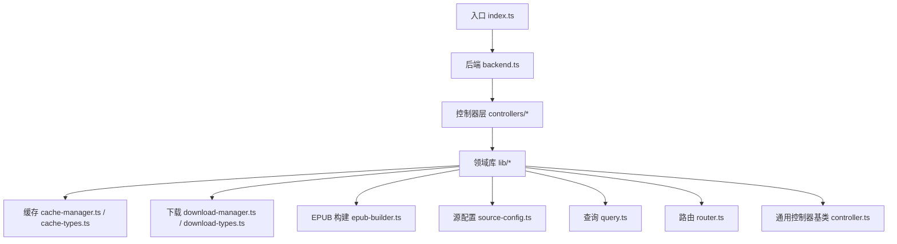
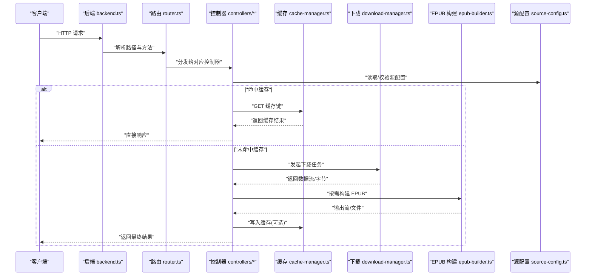
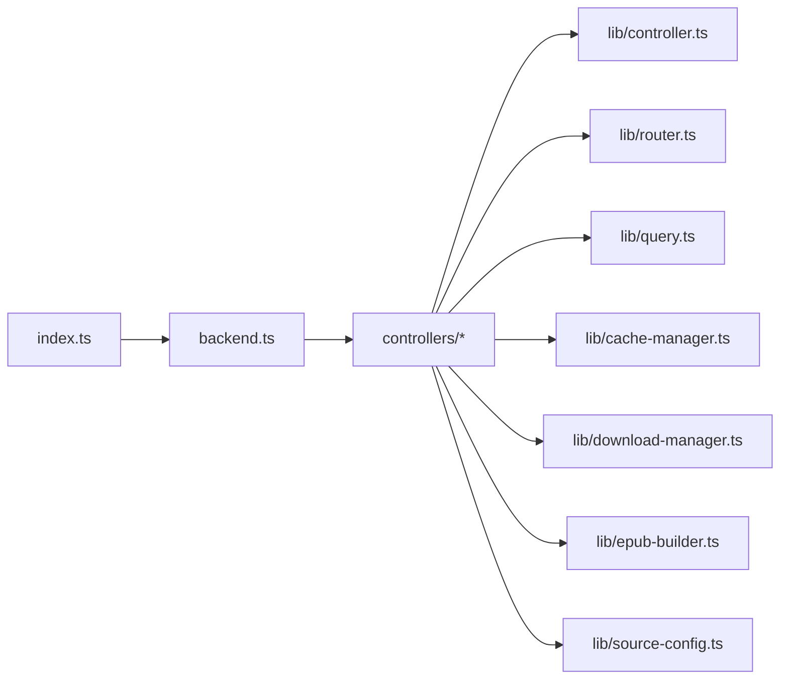

# 核心模块

<cite>
**本文引用的文件**   
- [index.ts](file://index.ts)
- [backend.ts](file://backend.ts)
- [frontend.tsx](file://frontend.tsx)
- [package.json](file://package.json)
- [lib/controller.ts](file://lib/controller.ts)
- [lib/router.ts](file://lib/router.ts)
- [lib/query.ts](file://lib/query.ts)
- [lib/cache-manager.ts](file://lib/cache-manager.ts)
- [lib/cache-types.ts](file://lib/cache-types.ts)
- [lib/download-manager.ts](file://lib/download-manager.ts)
- [lib/download-types.ts](file://lib/download-types.ts)
- [lib/epub-builder.ts](file://lib/epub-builder.ts)
- [lib/source-config.ts](file://lib/source-config.ts)
- [controllers/book.controller.ts](file://controllers/book.controller.ts)
- [controllers/cache.controller.ts](file://controllers/cache.controller.ts)
- [controllers/download.controller.ts](file://controllers/download.controller.ts)
- [controllers/source.controller.ts](file://controllers/source.controller.ts)
</cite>

## 目录
1. [简介](#简介)
2. [项目结构](#项目结构)
3. [核心组件](#核心组件)
4. [架构总览](#架构总览)
5. [详细组件分析](#详细组件分析)
6. [依赖关系分析](#依赖关系分析)
7. [性能考量](#性能考量)
8. [故障排查指南](#故障排查指南)
9. [结论](#结论)
10. [附录](#附录)

## 简介
本文件聚焦于 Bun-zlib 的核心模块，围绕后端服务、控制器层与领域库（缓存、下载、EPUB 构建、源配置等）进行系统化说明。文档旨在帮助初学者快速上手，同时为有经验的开发者提供足够的实现细节、调用关系与接口约定。内容涵盖：
- 系统架构与数据流
- 关键模块的职责边界与协作方式
- 配置项、参数与返回值约定
- 常见问题与解决方案
- 面向初学者的渐进式理解路径

## 项目结构
Bun-zlib 采用分层组织：入口与路由在根目录，业务逻辑集中在 lib 与 controllers 目录，前端页面位于 routes 目录。核心模块主要分布在 lib 与 controllers 中，负责请求处理、缓存策略、下载编排与资源打包等能力。

图表来源
- [index.ts](file://index.ts)
- [backend.ts](file://backend.ts)
- [lib/controller.ts](file://lib/controller.ts)
- [lib/router.ts](file://lib/router.ts)
- [lib/query.ts](file://lib/query.ts)
- [lib/cache-manager.ts](file://lib/cache-manager.ts)
- [lib/cache-types.ts](file://lib/cache-types.ts)
- [lib/download-manager.ts](file://lib/download-manager.ts)
- [lib/download-types.ts](file://lib/download-types.ts)
- [lib/epub-builder.ts](file://lib/epub-builder.ts)
- [lib/source-config.ts](file://lib/source-config.ts)
- [controllers/book.controller.ts](file://controllers/book.controller.ts)
- [controllers/cache.controller.ts](file://controllers/cache.controller.ts)
- [controllers/download.controller.ts](file://controllers/download.controller.ts)
- [controllers/source.controller.ts](file://controllers/source.controller.ts)

章节来源
- [index.ts](file://index.ts)
- [backend.ts](file://backend.ts)
- [package.json](file://package.json)

## 核心组件
本节概述各核心模块的职责与交互要点，便于读者建立整体认知后再深入细节。

- 入口与后端
  - 入口负责启动应用、注册路由与中间件、暴露对外 API。
  - 后端封装 HTTP 服务器、生命周期钩子、错误处理与日志。

- 控制器层
  - 将 HTTP 请求映射到具体业务方法，负责参数校验、权限检查、响应格式化。
  - 典型控制器包括书籍、缓存、下载、源管理等。

- 领域库
  - 缓存管理：统一缓存读写、过期策略、存储后端抽象。
  - 下载管理：并发控制、断点续传、重试与进度回调。
  - EPUB 构建：章节聚合、元数据组装、输出流生成。
  - 源配置：外部源的声明式配置、校验与合并。
  - 查询：结构化查询构建与执行。
  - 路由：URL 模式匹配与处理器分发。
  - 控制器基类：公共校验、上下文注入、错误包装。

章节来源
- [lib/controller.ts](file://lib/controller.ts)
- [lib/router.ts](file://lib/router.ts)
- [lib/query.ts](file://lib/query.ts)
- [lib/cache-manager.ts](file://lib/cache-manager.ts)
- [lib/cache-types.ts](file://lib/cache-types.ts)
- [lib/download-manager.ts](file://lib/download-manager.ts)
- [lib/download-types.ts](file://lib/download-types.ts)
- [lib/epub-builder.ts](file://lib/epub-builder.ts)
- [lib/source-config.ts](file://lib/source-config.ts)
- [controllers/book.controller.ts](file://controllers/book.controller.ts)
- [controllers/cache.controller.ts](file://controllers/cache.controller.ts)
- [controllers/download.controller.ts](file://controllers/download.controller.ts)
- [controllers/source.controller.ts](file://controllers/source.controller.ts)

## 架构总览
下图展示了从请求进入、路由分发、控制器处理到领域库调用的完整链路，以及缓存与下载的参与位置。

图表来源
- [backend.ts](file://backend.ts)
- [lib/router.ts](file://lib/router.ts)
- [controllers/book.controller.ts](file://controllers/book.controller.ts)
- [controllers/cache.controller.ts](file://controllers/cache.controller.ts)
- [controllers/download.controller.ts](file://controllers/download.controller.ts)
- [controllers/source.controller.ts](file://controllers/source.controller.ts)
- [lib/cache-manager.ts](file://lib/cache-manager.ts)
- [lib/download-manager.ts](file://lib/download-manager.ts)
- [lib/epub-builder.ts](file://lib/epub-builder.ts)
- [lib/source-config.ts](file://lib/source-config.ts)

## 详细组件分析

### 控制器基类与通用能力
- 职责
  - 提供统一的上下文对象、参数解析、错误包装与响应格式。
  - 支持鉴权、限流、日志埋点等横切关注点。
- 关键约定
  - 控制器方法通常接收标准化上下文，返回 Promise 或可序列化对象。
  - 错误类型与状态码映射由基类统一管理。
- 使用建议
  - 所有业务控制器继承该基类以复用通用逻辑。
  - 自定义错误时尽量携带可诊断信息（如请求 ID、阶段）。

章节来源
- [lib/controller.ts](file://lib/controller.ts)

### 路由与请求分发
- 职责
  - 维护 URL 模式与处理器映射，支持动态段与查询参数提取。
  - 提供中间件挂载点（如认证、日志、压缩）。
- 关键约定
  - 路由定义需显式声明方法与路径；重复注册会覆盖或报错（取决于实现）。
  - 查询参数通过统一解析器获取，避免手动字符串拼接。
- 扩展点
  - 可在路由层增加全局异常捕获与降级策略。

章节来源
- [lib/router.ts](file://lib/router.ts)

### 查询构建与执行
- 职责
  - 将高层查询条件转换为底层可执行语句或过滤管道。
  - 支持分页、排序、字段投影与条件组合。
- 关键约定
  - 输入为结构化查询对象，输出为可执行计划或过滤函数。
  - 对非法条件应返回明确错误而非静默失败。
- 优化建议
  - 对高频查询引入索引提示或预编译。

章节来源
- [lib/query.ts](file://lib/query.ts)

### 缓存管理
- 职责
  - 提供统一的缓存读写接口，支持多种存储后端（内存、磁盘、分布式）。
  - 管理键空间、过期策略、命中率统计与清理任务。
- 配置选项（示例）
  - 最大条目数、默认过期时间、命名空间前缀、是否启用压缩。
- 行为约定
  - 读操作优先命中缓存，未命中则回源并回填。
  - 写操作支持幂等键与版本控制，避免脏写。
- 错误处理
  - 区分“不存在”、“已过期”、“写入失败”等场景，上层据此决定重试或降级。

章节来源
- [lib/cache-manager.ts](file://lib/cache-manager.ts)
- [lib/cache-types.ts](file://lib/cache-types.ts)

### 下载管理
- 职责
  - 封装网络请求、并发控制、重试与断点续传。
  - 提供进度回调、取消令牌与超时控制。
- 配置选项（示例）
  - 最大并发、单次大小、重试次数、退避策略、超时时间。
- 数据流
  - 输入：目标 URL、范围、头信息、校验和。
  - 输出：分段流、合并后的流、完整性校验结果。
- 错误处理
  - 网络抖动自动重试；不可恢复错误立即抛出并附带诊断信息。

章节来源
- [lib/download-manager.ts](file://lib/download-manager.ts)
- [lib/download-types.ts](file://lib/download-types.ts)

### EPUB 构建
- 职责
  - 将章节内容、图片与元数据组装为标准 EPUB 包。
  - 支持增量更新与去重，减少重复 IO。
- 输入/输出
  - 输入：章节列表、封面、作者、标题、描述等元数据。
  - 输出：EPUB 流或文件句柄，供下载或持久化。
- 质量保障
  - 校验章节顺序与资源引用完整性；失败时回滚部分写入。

章节来源
- [lib/epub-builder.ts](file://lib/epub-builder.ts)

### 源配置
- 职责
  - 集中管理外部源的访问规则、鉴权、限速与代理设置。
  - 提供配置合并、校验与热更新能力。
- 配置项（示例）
  - 基础地址、UA、Cookie、代理、超时、重试策略、白名单域名。
- 安全建议
  - 敏感信息通过环境变量注入；禁止硬编码密钥。

章节来源
- [lib/source-config.ts](file://lib/source-config.ts)

### 控制器：书籍
- 职责
  - 提供书籍列表、详情、搜索与批量导出等接口。
  - 协调缓存、下载与 EPUB 构建流程。
- 典型流程
  - 列表/详情：先查缓存，未命中则拉取源数据并回填。
  - 导出 EPUB：按章节下载、构建、写入缓存或直接流式返回。
- 错误处理
  - 对源不可用、内容缺失等情况返回友好错误码与提示。

章节来源
- [controllers/book.controller.ts](file://controllers/book.controller.ts)

### 控制器：缓存
- 职责
  - 提供缓存统计、清理、预热与失效接口。
  - 暴露健康检查与指标上报端点。
- 注意事项
  - 清理操作应避免阻塞主线程，必要时异步执行。

章节来源
- [controllers/cache.controller.ts](file://controllers/cache.controller.ts)

### 控制器：下载
- 职责
  - 提供任务创建、进度查询、暂停/恢复与取消接口。
  - 与下载管理器对接，保证任务状态一致性与幂等性。
- 并发与限流
  - 根据系统负载动态调整并发度，避免 OOM。

章节来源
- [controllers/download.controller.ts](file://controllers/download.controller.ts)

### 控制器：源管理
- 职责
  - 提供源的增删改查、健康探测与开关控制。
  - 与源配置模块联动，确保运行时配置生效。
- 变更影响
  - 修改源后应触发相关缓存的失效或重建。

章节来源
- [controllers/source.controller.ts](file://controllers/source.controller.ts)

## 依赖关系分析
下图展示核心模块之间的依赖方向，有助于识别耦合点与潜在循环依赖。

图表来源
- [index.ts](file://index.ts)
- [backend.ts](file://backend.ts)
- [lib/controller.ts](file://lib/controller.ts)
- [lib/router.ts](file://lib/router.ts)
- [lib/query.ts](file://lib/query.ts)
- [lib/cache-manager.ts](file://lib/cache-manager.ts)
- [lib/download-manager.ts](file://lib/download-manager.ts)
- [lib/epub-builder.ts](file://lib/epub-builder.ts)
- [lib/source-config.ts](file://lib/source-config.ts)
- [controllers/book.controller.ts](file://controllers/book.controller.ts)
- [controllers/cache.controller.ts](file://controllers/cache.controller.ts)
- [controllers/download.controller.ts](file://controllers/download.controller.ts)
- [controllers/source.controller.ts](file://controllers/source.controller.ts)

章节来源
- [package.json](file://package.json)

## 性能考量
- 缓存命中率
  - 合理设置过期时间与命名空间，避免热点键冲突。
  - 对大对象考虑压缩与分块存储。
- 下载并发
  - 依据 CPU 与带宽动态调整并发度，避免拥塞。
  - 使用连接池与 Keep-Alive 提升吞吐。
- EPUB 构建
  - 增量构建与去重可减少 IO 与 CPU 开销。
  - 流式写入降低峰值内存占用。
- 查询优化
  - 对高频查询建立索引或物化视图。
  - 限制返回字段，避免过度传输。

[本节为通用指导，不直接分析具体文件]

## 故障排查指南
- 常见症状
  - 缓存未命中导致回源频繁：检查键空间与过期策略。
  - 下载中断或慢：查看并发、超时与重试配置。
  - EPUB 构建失败：确认章节顺序与资源引用完整性。
  - 源不可用：核对源配置与健康探测结果。
- 定位步骤
  - 开启详细日志，记录请求 ID、阶段与耗时。
  - 使用缓存统计与下载进度接口辅助定位瓶颈。
  - 对关键路径添加健康检查与告警。
- 恢复策略
  - 对瞬时错误启用指数退避重试。
  - 对不可恢复错误快速失败并降级到只读模式。

章节来源
- [lib/cache-manager.ts](file://lib/cache-manager.ts)
- [lib/download-manager.ts](file://lib/download-manager.ts)
- [lib/epub-builder.ts](file://lib/epub-builder.ts)
- [lib/source-config.ts](file://lib/source-config.ts)

## 结论
Bun-zlib 的核心模块以清晰的层次划分与明确的职责边界为基础，通过控制器层协调缓存、下载与构建等能力，形成高内聚、低耦合的系统。遵循本文的接口约定与最佳实践，可在保证稳定性的前提下持续提升性能与可维护性。

[本节为总结性内容，不直接分析具体文件]

## 附录
- 术语
  - 源：外部数据提供方，包含访问规则与元数据。
  - 键空间：缓存键的前缀命名空间，用于隔离不同业务域。
  - 断点续传：支持从上次中断处继续下载的能力。
- 参考入口
  - 入口与后端：[index.ts](file://index.ts)、[backend.ts](file://backend.ts)
  - 控制器：[controllers/*](file://controllers/)
  - 领域库：[lib/*](file://lib/)