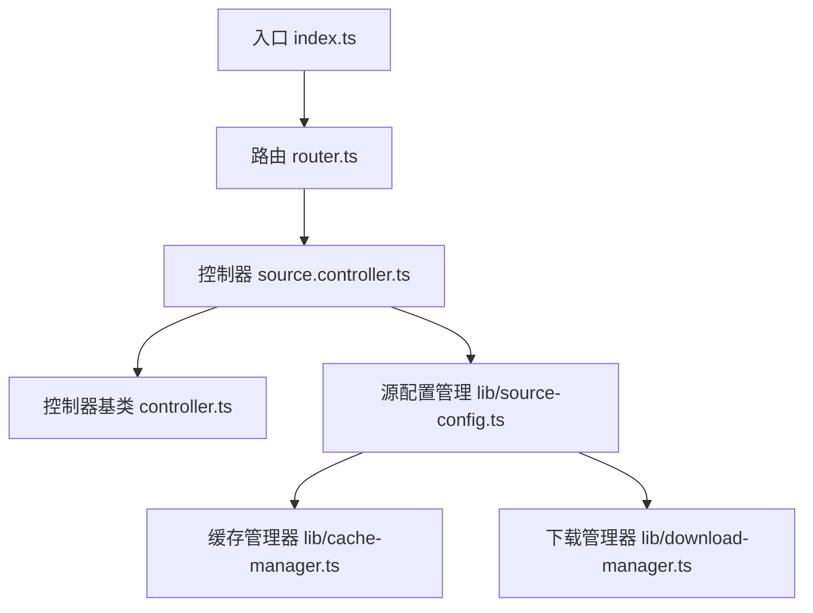
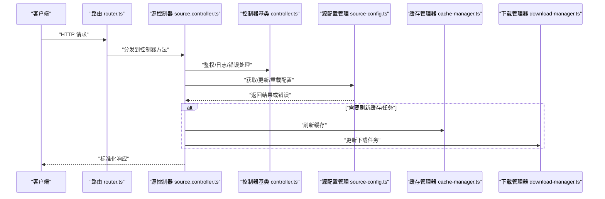
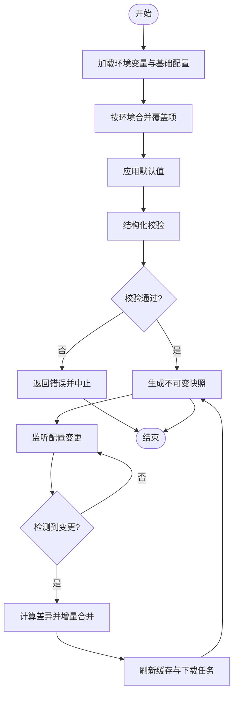
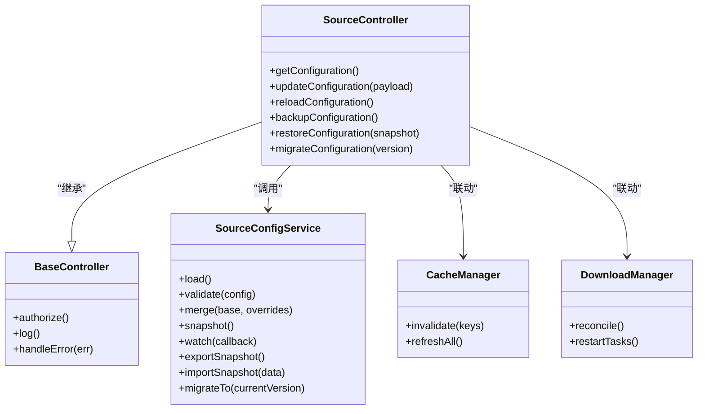
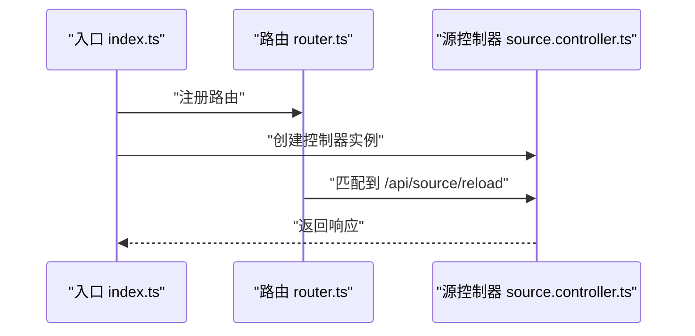
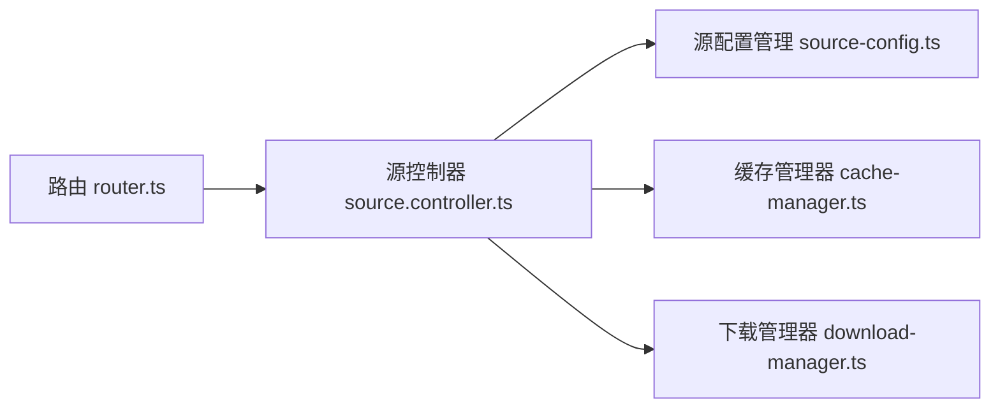

# 源配置管理

<cite>
**本文引用的文件**   
- [source-config.ts](file://lib/source-config.ts)
- [source.controller.ts](file://controllers/source.controller.ts)
- [controller.ts](file://lib/controller.ts)
- [router.ts](file://lib/router.ts)
- [cache-manager.ts](file://lib/cache-manager.ts)
- [download-manager.ts](file://lib/download-manager.ts)
- [index.ts](file://index.ts)
</cite>

## 目录
1. [简介](#简介)
2. [项目结构](#项目结构)
3. [核心组件](#核心组件)
4. [架构总览](#架构总览)
5. [详细组件分析](#详细组件分析)
6. [依赖关系分析](#依赖关系分析)
7. [性能考虑](#性能考虑)
8. [故障排查指南](#故障排查指南)
9. [结论](#结论)
10. [附录](#附录)

## 简介
本文件围绕“源配置管理”模块，系统化阐述数据源配置的加载、校验与动态更新机制；定义配置文件结构与默认值策略；说明多环境配置、热重载与版本兼容的实现要点；提供自定义数据源插件的开发指南与配置示例；解释与控制器的集成方式与配置同步机制；并给出配置冲突处理、权限控制与安全验证的解决方案，以及配置备份、恢复与迁移工具的使用建议。

## 项目结构
本项目采用分层组织：控制器层负责对外暴露接口，库层封装通用能力（包括源配置管理），路由层将请求分发到控制器，应用入口统一装配。

图示来源
- [index.ts](file://index.ts)
- [router.ts](file://lib/router.ts)
- [source.controller.ts](file://controllers/source.controller.ts)
- [controller.ts](file://lib/controller.ts)
- [source-config.ts](file://lib/source-config.ts)
- [cache-manager.ts](file://lib/cache-manager.ts)
- [download-manager.ts](file://lib/download-manager.ts)

章节来源
- [index.ts](file://index.ts)
- [router.ts](file://lib/router.ts)
- [source.controller.ts](file://controllers/source.controller.ts)
- [controller.ts](file://lib/controller.ts)
- [source-config.ts](file://lib/source-config.ts)
- [cache-manager.ts](file://lib/cache-manager.ts)
- [download-manager.ts](file://lib/download-manager.ts)

## 核心组件
- 源配置管理（lib/source-config.ts）
  - 职责：集中管理数据源的配置加载、校验、合并、热重载、版本兼容、备份/恢复/迁移等。
  - 关键能力：
    - 多环境配置：按环境变量选择不同配置集或覆盖项。
    - 默认值处理：为可选字段提供安全默认值。
    - 校验与容错：对必填字段、类型、范围进行校验，失败时回退或拒绝启动。
    - 动态更新：监听配置变更事件，触发增量更新与缓存刷新。
    - 版本兼容：通过 schema 版本字段实现向前/向后兼容。
    - 安全校验：过滤危险键、限制大小、白名单域名/IP 等。
- 源控制器（controllers/source.controller.ts）
  - 职责：暴露配置查询、更新、重载、备份/恢复/迁移等 API。
  - 集成点：调用源配置管理提供的服务方法，返回标准化响应。
- 控制器基类（lib/controller.ts）
  - 职责：提供统一的错误处理、鉴权中间件、日志记录等横切关注点。
- 路由（lib/router.ts）
  - 职责：将 HTTP 路径映射到控制器方法。
- 缓存与下载（lib/cache-manager.ts, lib/download-manager.ts）
  - 职责：在配置变更后刷新相关缓存与下载任务状态，保证一致性。

章节来源
- [source-config.ts](file://lib/source-config.ts)
- [source.controller.ts](file://controllers/source.controller.ts)
- [controller.ts](file://lib/controller.ts)
- [router.ts](file://lib/router.ts)
- [cache-manager.ts](file://lib/cache-manager.ts)
- [download-manager.ts](file://lib/download-manager.ts)

## 架构总览
源配置管理的整体交互如下：外部请求经路由进入控制器，控制器委托源配置管理服务完成配置的读取、校验与更新；必要时联动缓存与下载管理器保持一致性；支持热重载与版本兼容。

图示来源
- [router.ts](file://lib/router.ts)
- [source.controller.ts](file://controllers/source.controller.ts)
- [controller.ts](file://lib/controller.ts)
- [source-config.ts](file://lib/source-config.ts)
- [cache-manager.ts](file://lib/cache-manager.ts)
- [download-manager.ts](file://lib/download-manager.ts)

## 详细组件分析

### 源配置管理（lib/source-config.ts）
- 配置加载流程
  - 从持久化存储与环境变量中加载基础配置。
  - 根据当前环境（如 dev/test/prod）合并覆盖项。
  - 应用默认值并对缺失字段进行补全。
  - 执行结构化校验（类型、必填、范围、白名单）。
  - 生成不可变快照供运行时使用。
- 动态更新与热重载
  - 监听配置变更事件（文件系统、API、消息总线）。
  - 增量合并新配置，仅替换受影响的数据源条目。
  - 触发缓存与下载任务的状态刷新。
- 版本兼容
  - 通过配置中的版本字段判断兼容性。
  - 提供迁移函数，将旧格式转换为当前 schema。
  - 在不兼容时给出明确错误提示与降级策略。
- 安全与权限
  - 校验配置大小上限、键名白名单、URL/域名/IP 白名单。
  - 敏感信息（如密钥）仅允许通过环境变量注入，禁止写入持久化配置。
  - 结合控制器基类的鉴权中间件，确保只有授权角色可修改配置。
- 备份、恢复与迁移
  - 导出当前配置为快照文件（含元数据与时间戳）。
  - 导入快照前进行校验与预览，确认后再提交。
  - 迁移工具用于批量转换历史配置至新 schema。

图示来源
- [source-config.ts](file://lib/source-config.ts)
- [cache-manager.ts](file://lib/cache-manager.ts)
- [download-manager.ts](file://lib/download-manager.ts)

章节来源
- [source-config.ts](file://lib/source-config.ts)
- [cache-manager.ts](file://lib/cache-manager.ts)
- [download-manager.ts](file://lib/download-manager.ts)

### 源控制器（controllers/source.controller.ts）
- 对外接口
  - 查询配置：返回当前生效的配置快照。
  - 更新配置：接收增量或全量配置，执行校验后持久化并触发热重载。
  - 重载配置：强制重新加载最新配置。
  - 备份/恢复/迁移：导出快照、导入快照、执行迁移。
- 集成方式
  - 继承控制器基类以复用鉴权、日志与错误处理。
  - 调用源配置管理服务完成具体逻辑。
  - 在必要时联动缓存与下载管理器保持系统一致性。

图示来源
- [source.controller.ts](file://controllers/source.controller.ts)
- [controller.ts](file://lib/controller.ts)
- [source-config.ts](file://lib/source-config.ts)
- [cache-manager.ts](file://lib/cache-manager.ts)
- [download-manager.ts](file://lib/download-manager.ts)

章节来源
- [source.controller.ts](file://controllers/source.controller.ts)
- [controller.ts](file://lib/controller.ts)
- [source-config.ts](file://lib/source-config.ts)
- [cache-manager.ts](file://lib/cache-manager.ts)
- [download-manager.ts](file://lib/download-manager.ts)

### 路由与入口（lib/router.ts, index.ts）
- 路由层将 /api/source/* 等路径映射到源控制器的对应方法。
- 入口文件负责初始化路由、控制器与服务实例，并启动服务器。

图示来源
- [index.ts](file://index.ts)
- [router.ts](file://lib/router.ts)
- [source.controller.ts](file://controllers/source.controller.ts)

章节来源
- [index.ts](file://index.ts)
- [router.ts](file://lib/router.ts)
- [source.controller.ts](file://controllers/source.controller.ts)

### 自定义数据源插件开发指南
- 插件契约
  - 提供标准化的配置结构（名称、类型、连接参数、超时、重试策略等）。
  - 实现健康检查与能力探测接口，便于系统自动发现与可用性评估。
  - 遵循命名规范与版本字段约定，确保兼容性与可升级性。
- 配置示例（概念性说明）
  - 在数据源列表中新增一项，指定插件标识与连接参数。
  - 通过环境变量注入敏感信息（如认证令牌）。
  - 设置环境与覆盖项，实现多环境差异化配置。
- 开发与测试
  - 本地启用调试模式，输出详细的加载与校验日志。
  - 使用备份/恢复工具验证配置变更的可逆性。
  - 通过热重载接口验证增量更新的正确性。

[本节为概念性内容，不直接分析具体文件]

## 依赖关系分析
- 耦合与内聚
  - 源配置管理与控制器之间通过清晰的服务接口解耦，利于独立演进与测试。
  - 控制器与缓存/下载管理器弱耦合，仅在必要时触发刷新。
- 外部依赖
  - 文件系统、环境变量、网络访问等外部资源由配置管理或服务层统一封装。
- 潜在循环依赖
  - 通过路由与控制器间接引用服务，避免直接循环导入。

图示来源
- [router.ts](file://lib/router.ts)
- [source.controller.ts](file://controllers/source.controller.ts)
- [source-config.ts](file://lib/source-config.ts)
- [cache-manager.ts](file://lib/cache-manager.ts)
- [download-manager.ts](file://lib/download-manager.ts)

章节来源
- [router.ts](file://lib/router.ts)
- [source.controller.ts](file://controllers/source.controller.ts)
- [source-config.ts](file://lib/source-config.ts)
- [cache-manager.ts](file://lib/cache-manager.ts)
- [download-manager.ts](file://lib/download-manager.ts)

## 性能考虑
- 配置快照不可变：减少并发读写竞争，提升读取性能。
- 增量合并：仅替换变更的数据源条目，降低全局重算成本。
- 懒加载与按需刷新：仅在需要时刷新缓存与下载任务。
- 限流与去抖：对频繁的热重载请求进行节流，避免抖动。
- 大配置分片：超大配置可分片加载与校验，避免阻塞主线程。

[本节提供一般性指导，无需特定文件来源]

## 故障排查指南
- 常见错误
  - 校验失败：检查必填字段、类型与范围，定位具体字段。
  - 版本不兼容：查看配置版本字段，执行迁移或回滚。
  - 权限不足：确认调用者具备修改配置的权限。
  - 热重载无效：检查监听器是否注册成功，确认增量合并逻辑。
- 诊断步骤
  - 启用详细日志，观察加载、合并、校验与刷新过程。
  - 使用备份/恢复工具对比前后配置差异。
  - 隔离环境变量与持久化配置，逐步缩小问题范围。
- 恢复策略
  - 优先恢复到最近一次已知良好的快照。
  - 若涉及迁移失败，先回滚到旧版本再重试迁移。

章节来源
- [source-config.ts](file://lib/source-config.ts)
- [source.controller.ts](file://controllers/source.controller.ts)
- [controller.ts](file://lib/controller.ts)

## 结论
源配置管理模块通过清晰的加载、校验、合并与热重载机制，配合版本兼容与安全保障，提供了稳定可靠的数据源配置管理能力。控制器层将其封装为易用的 API，并与缓存、下载子系统协同工作，确保系统一致性与高性能。借助备份、恢复与迁移工具，运维与开发者可以安全地进行配置治理与演进。

[本节为总结性内容，无需特定文件来源]

## 附录
- 术语
  - 数据源：指代一个具体的外部数据提供方，包含连接参数与行为策略。
  - 快照：某一时刻的配置不可变副本，用于快速读取与回滚。
  - 热重载：在不重启进程的情况下动态更新配置并生效。
- 最佳实践
  - 始终为可选字段提供默认值，避免空指针与未定义行为。
  - 使用环境变量注入敏感信息，避免明文写入持久化配置。
  - 变更前先备份，变更后立即验证健康度与功能。
  - 对热重载进行幂等设计，确保多次触发不影响稳定性。

[本节为补充性内容，无需特定文件来源]