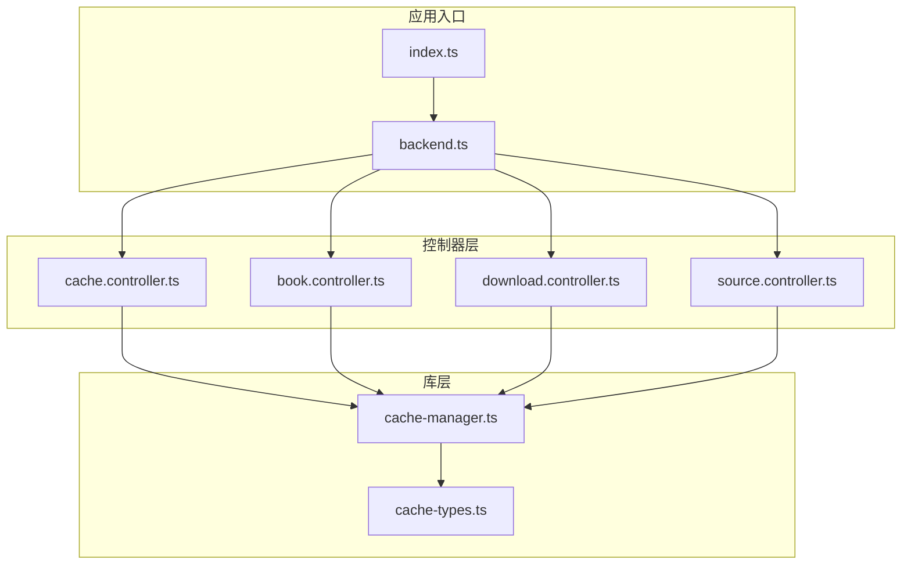
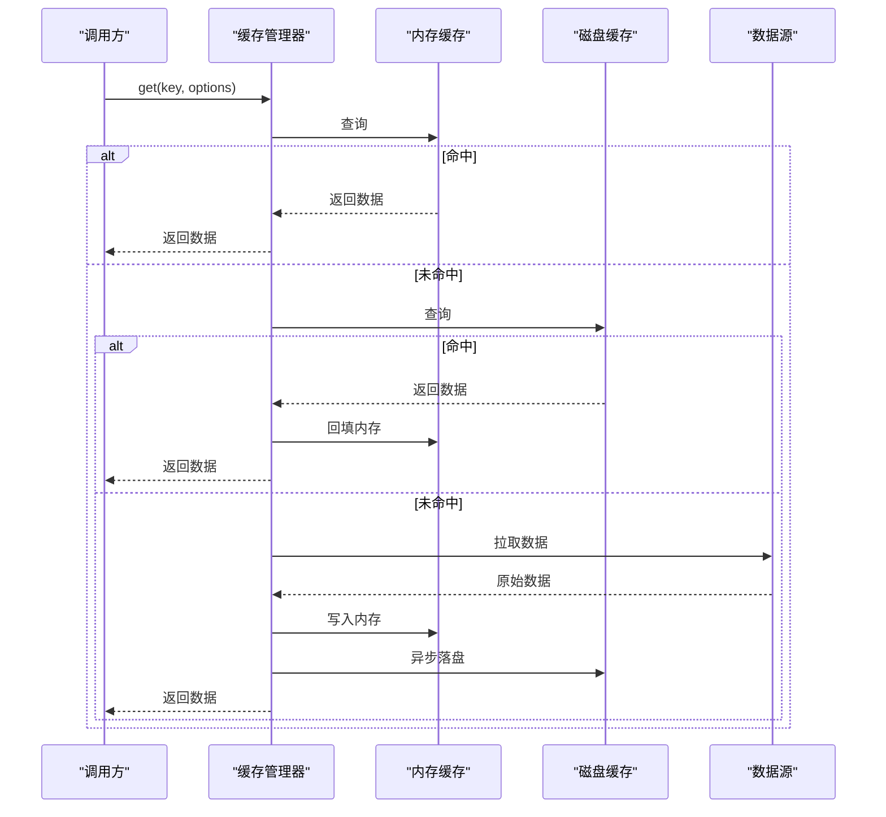
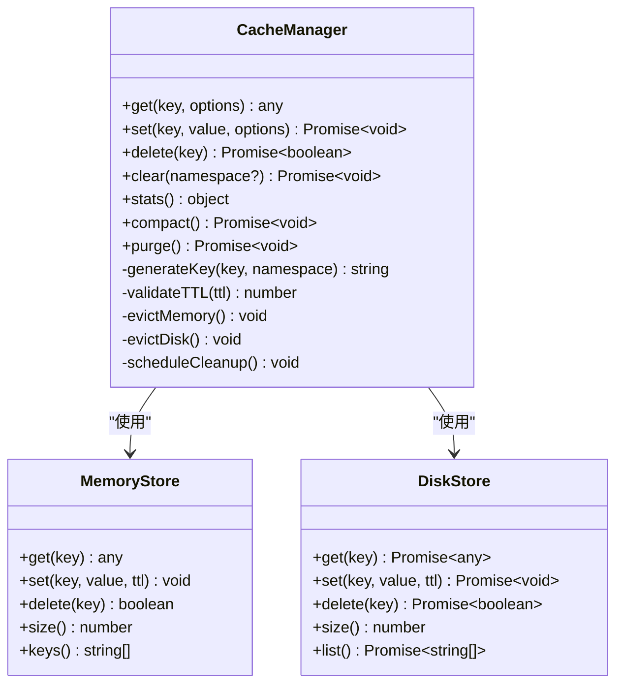
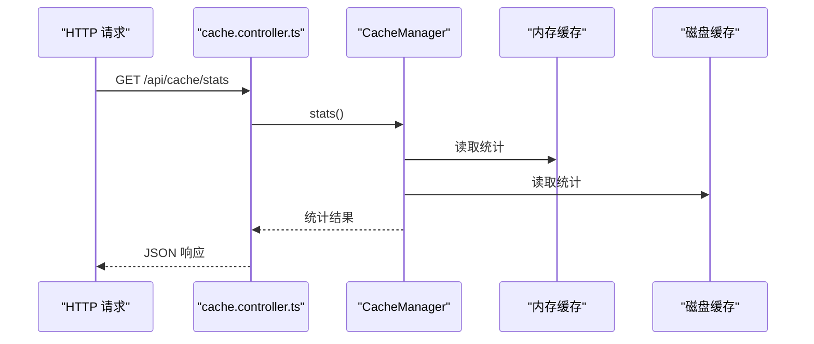

# 缓存管理器

<cite>
**本文引用的文件**   
- [cache-manager.ts](file://lib/cache-manager.ts)
- [cache-types.ts](file://lib/cache-types.ts)
- [cache.controller.ts](file://controllers/cache.controller.ts)
- [book.controller.ts](file://controllers/book.controller.ts)
- [download.controller.ts](file://controllers/download.controller.ts)
- [source.controller.ts](file://controllers/source.controller.ts)
- [backend.ts](file://backend.ts)
- [index.ts](file://index.ts)
</cite>

## 目录
1. [简介](#简介)
2. [项目结构](#项目结构)
3. [核心组件](#核心组件)
4. [架构总览](#架构总览)
5. [详细组件分析](#详细组件分析)
6. [依赖关系分析](#依赖关系分析)
7. [性能考量](#性能考量)
8. [故障排查指南](#故障排查指南)
9. [结论](#结论)
10. [附录](#附录)

## 简介
本文件为“缓存管理器”模块的权威文档，面向开发者与运维人员，系统阐述多级缓存（内存缓存与磁盘缓存）的实现细节、缓存键生成策略、过期时间管理、接口规范（get/set/delete/clear）、命中率优化、内存控制与自动清理机制，以及与控制器层的集成方式。同时给出常见问题（失效、一致性）及解决方案，并提供性能调优建议与最佳实践。

## 项目结构
缓存相关代码主要位于 lib 与 controllers 两个目录：
- lib/cache-manager.ts：缓存管理器实现，包含多级缓存、键生成、过期策略、清理调度等核心逻辑。
- lib/cache-types.ts：缓存类型定义，包括缓存项结构、配置选项、错误类型等。
- controllers/cache.controller.ts：暴露与缓存相关的 HTTP 接口，便于调试与管理。
- 其他控制器（book、download、source）通过依赖注入或实例化方式调用缓存服务。

图表来源
- [cache-manager.ts:1-200](file://lib/cache-manager.ts#L1-L200)
- [cache-types.ts:1-120](file://lib/cache-types.ts#L1-L120)
- [cache.controller.ts:1-150](file://controllers/cache.controller.ts#L1-L150)
- [book.controller.ts:1-120](file://controllers/book.controller.ts#L1-L120)
- [download.controller.ts:1-120](file://controllers/download.controller.ts#L1-L120)
- [source.controller.ts:1-120](file://controllers/source.controller.ts#L1-L120)
- [backend.ts:1-120](file://backend.ts#L1-L120)
- [index.ts:1-80](file://index.ts#L1-L80)

章节来源
- [cache-manager.ts:1-200](file://lib/cache-manager.ts#L1-L200)
- [cache-types.ts:1-120](file://lib/cache-types.ts#L1-L120)
- [cache.controller.ts:1-150](file://controllers/cache.controller.ts#L1-L150)

## 核心组件
- 缓存管理器（CacheManager）
  - 职责：封装多级缓存访问、键生成、TTL 管理、统计指标、清理调度、持久化读写。
  - 关键能力：
    - 内存缓存：基于进程内数据结构，提供 O(1) 读/写。
    - 磁盘缓存：基于文件系统，提供持久化与容量限制。
    - 过期策略：惰性过期 + 定时清理。
    - 统计：命中率、大小、条目数、IO 次数。
- 类型定义（cache-types.ts）
  - 缓存项结构：包含值、元数据（创建时间、过期时间、版本等）。
  - 配置对象：内存上限、磁盘路径、默认 TTL、压缩开关等。
  - 错误类型：键冲突、写入失败、读取失败、序列化异常等。

章节来源
- [cache-manager.ts:1-200](file://lib/cache-manager.ts#L1-L200)
- [cache-types.ts:1-120](file://lib/cache-types.ts#L1-L120)

## 架构总览
缓存管理器采用“两级缓存 + 统一接口”的架构：
- 读路径：先查内存，未命中再查磁盘，最后回源并回填两级缓存。
- 写路径：更新内存后立即异步落盘，保证一致性与可用性平衡。
- 清理策略：按 TTL 惰性检查 + 定时任务扫描，结合内存水位触发淘汰。

图表来源
- [cache-manager.ts:1-200](file://lib/cache-manager.ts#L1-L200)

## 详细组件分析

### 缓存管理器（CacheManager）
- 设计要点
  - 多级缓存：内存优先，磁盘兜底；支持可插拔存储后端。
  - 键空间隔离：命名空间前缀避免冲突。
  - TTL 管理：每个缓存项携带过期时间，读取时进行惰性校验，后台定时清理。
  - 容量控制：内存使用阈值触发 LRU/LFU 淘汰；磁盘容量阈值触发最久未用淘汰。
  - 统计与监控：命中率、延迟、IO 计数、内存占用、磁盘占用。
- 关键方法
  - get(key, options)：获取缓存项，支持强制回源、忽略过期等选项。
  - set(key, value, options)：设置缓存项，支持自定义 TTL、是否压缩、是否同步落盘。
  - delete(key)：删除指定键，同步更新内存与磁盘索引。
  - clear(namespace?)：清空指定命名空间或全部缓存。
  - stats()：返回统计信息。
  - compact()/purge()：手动触发清理与压缩。
- 复杂度与性能
  - 内存操作 O(1)，磁盘 IO 异步化，批量写入合并减少 IO。
  - 惰性过期降低频繁扫描开销，定时任务在低峰期执行。

图表来源
- [cache-manager.ts:1-200](file://lib/cache-manager.ts#L1-L200)

章节来源
- [cache-manager.ts:1-200](file://lib/cache-manager.ts#L1-L200)

### 类型定义（cache-types.ts）
- 缓存项结构
  - 字段：value、createdAt、expiresAt、version、tags、metadata。
  - 用途：支撑过期判断、版本控制、标签过滤与审计。
- 配置对象
  - 字段：memoryLimit、diskPath、defaultTTL、maxDiskSize、compressionEnabled、cleanupInterval。
  - 用途：控制内存与磁盘行为、清理策略与性能参数。
- 错误类型
  - 分类：KeyConflictError、WriteError、ReadError、SerializationError。
  - 用途：统一错误处理与上报。

章节来源
- [cache-types.ts:1-120](file://lib/cache-types.ts#L1-L120)

### 控制器集成（cache.controller.ts 与其他控制器）
- cache.controller.ts
  - 暴露管理接口：查看统计、清理缓存、按命名空间清空、强制刷新等。
  - 典型流程：鉴权 -> 参数校验 -> 调用缓存管理器 -> 返回结果。
- book.controller.ts / download.controller.ts / source.controller.ts
  - 业务场景：书籍元数据、下载任务状态、源配置等热点数据的缓存。
  - 调用模式：构造缓存键（含命名空间与业务标识），设置合理 TTL，读多写少场景优先命中内存。

图表来源
- [cache.controller.ts:1-150](file://controllers/cache.controller.ts#L1-L150)
- [cache-manager.ts:1-200](file://lib/cache-manager.ts#L1-L200)

章节来源
- [cache.controller.ts:1-150](file://controllers/cache.controller.ts#L1-L150)
- [book.controller.ts:1-120](file://controllers/book.controller.ts#L1-L120)
- [download.controller.ts:1-120](file://controllers/download.controller.ts#L1-L120)
- [source.controller.ts:1-120](file://controllers/source.controller.ts#L1-L120)

## 依赖关系分析
- 控制器对缓存管理器的依赖是单向的，便于解耦与测试替换。
- 缓存管理器内部依赖内存与磁盘存储抽象，支持替换实现。
- 入口文件负责初始化缓存管理器并注入到控制器。

图表来源
- [backend.ts:1-120](file://backend.ts#L1-L120)
- [cache-manager.ts:1-200](file://lib/cache-manager.ts#L1-L200)
- [cache-types.ts:1-120](file://lib/cache-types.ts#L1-L120)

章节来源
- [backend.ts:1-120](file://backend.ts#L1-L120)
- [index.ts:1-80](file://index.ts#L1-L80)

## 性能考量
- 命中率优化
  - 合理设置 TTL：热点数据较长，冷数据较短。
  - 预取与预热：启动时加载高频键，降低冷启动延迟。
  - 键设计：避免过长键与频繁变更部分，提升哈希分布均匀性。
- 内存控制
  - 设定 memoryLimit，达到阈值触发 LRU/LFU 淘汰。
  - 大对象压缩存储，减少内存占用。
- 磁盘 I/O
  - 异步落盘与批量写入，减少锁竞争与 IO 放大。
  - 定期 compact/purge，回收碎片与过期数据。
- 统计与观测
  - 监控命中率、P95/P99 延迟、内存与磁盘占用、清理耗时。
  - 告警阈值：命中率低于预期、内存接近上限、磁盘空间不足。

[本节为通用指导，不直接分析具体文件]

## 故障排查指南
- 常见症状
  - 命中率低：检查键设计、TTL 设置、预热策略。
  - 内存溢出：检查 memoryLimit、对象大小、淘汰策略。
  - 磁盘爆满：检查 maxDiskSize、清理周期、压缩开关。
  - 数据不一致：检查写路径同步/异步策略、版本号与并发控制。
- 定位步骤
  - 查看 stats() 输出，关注命中率、IO 次数、内存/磁盘使用。
  - 启用调试日志，记录 key、TTL、命中/未命中原因。
  - 使用 clear(namespace) 与 purge() 验证问题是否由脏数据引起。
- 修复建议
  - 调整 TTL 与淘汰策略，必要时引入软过期（读时回源）。
  - 增加内存上限或扩容节点，拆分命名空间隔离热点。
  - 优化序列化格式，启用压缩以减少体积。

章节来源
- [cache-manager.ts:1-200](file://lib/cache-manager.ts#L1-L200)
- [cache-types.ts:1-120](file://lib/cache-types.ts#L1-L120)
- [cache.controller.ts:1-150](file://controllers/cache.controller.ts#L1-L150)

## 结论
缓存管理器通过多级缓存、严格的键与 TTL 管理、完善的清理与统计机制，提供了高可用、高性能的数据访问能力。配合合理的控制器集成与监控体系，可在复杂业务场景中稳定运行。建议持续跟踪命中率与资源使用，动态调优参数，确保系统长期健康。

[本节为总结，不直接分析具体文件]

## 附录

### 接口规范（get/set/delete/clear）
- get(key, options)
  - 参数：key（字符串）、options（可选：forceRefresh、ignoreTTL、namespace）。
  - 返回：Promise<any>，成功返回缓存值，未命中返回 undefined。
- set(key, value, options)
  - 参数：key（字符串）、value（任意可序列化）、options（可选：ttl、compress、sync）。
  - 返回：Promise<void>，写入成功或抛出错误。
- delete(key)
  - 参数：key（字符串）。
  - 返回：Promise<boolean>，是否删除成功。
- clear(namespace?)
  - 参数：namespace（可选，字符串），为空则清空所有命名空间。
  - 返回：Promise<void>。

章节来源
- [cache-manager.ts:1-200](file://lib/cache-manager.ts#L1-L200)

### 缓存键生成算法
- 输入：key、namespace、可选上下文（如用户 ID、版本）。
- 过程：拼接命名空间前缀、规范化 key、计算哈希、附加校验位。
- 输出：固定长度、分布均匀的字符串键。
- 注意事项：避免敏感信息泄露，必要时对 key 进行脱敏。

章节来源
- [cache-manager.ts:1-200](file://lib/cache-manager.ts#L1-L200)

### 过期时间管理与自动清理
- 惰性过期：读取时检查 expiresAt，过期即视为不存在。
- 定时清理：周期性扫描过期键，批量删除并释放资源。
- 触发条件：TTL 到期、内存水位超限、磁盘空间不足。

章节来源
- [cache-manager.ts:1-200](file://lib/cache-manager.ts#L1-L200)

### 与控制器层集成示例
- 初始化：在 backend.ts 中创建 CacheManager 实例并注入控制器。
- 使用：控制器根据业务构建 key，设置合理 TTL，读多写少优先命中内存。
- 管理：通过 cache.controller.ts 暴露的管理接口进行监控与干预。

章节来源
- [backend.ts:1-120](file://backend.ts#L1-L120)
- [cache.controller.ts:1-150](file://controllers/cache.controller.ts#L1-L150)
- [book.controller.ts:1-120](file://controllers/book.controller.ts#L1-L120)
- [download.controller.ts:1-120](file://controllers/download.controller.ts#L1-L120)
- [source.controller.ts:1-120](file://controllers/source.controller.ts#L1-L120)

### 性能调优建议与最佳实践
- 键设计：短小、稳定、无敏感信息，尽量包含必要上下文。
- TTL 策略：热点长、冷数据短，必要时使用软过期与回源。
- 内存控制：合理设置 memoryLimit，启用压缩与大对象分块。
- 磁盘策略：设置 maxDiskSize，开启定期 compact/purge。
- 监控告警：命中率、延迟、内存/磁盘使用、清理耗时。
- 测试验证：压测不同负载下的命中率与资源占用，回归验证。

[本节为通用指导，不直接分析具体文件]