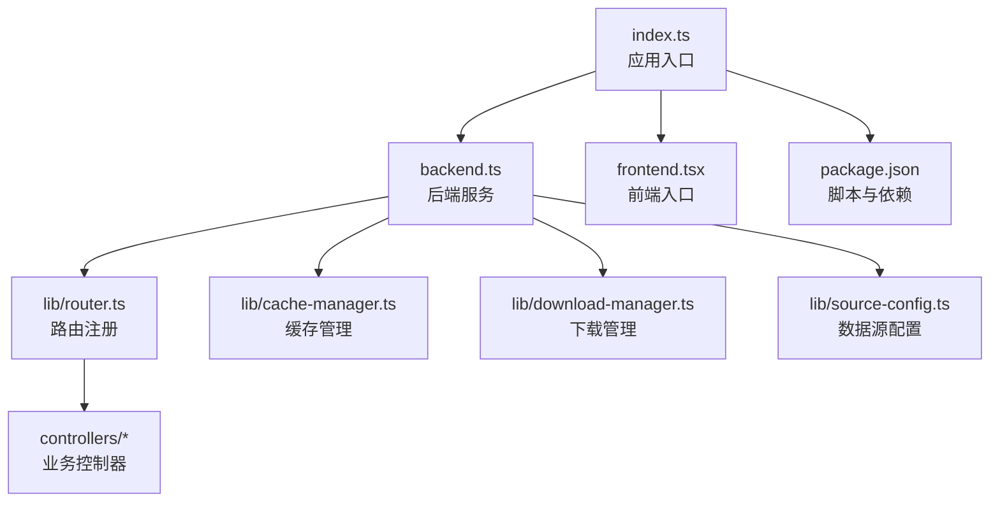
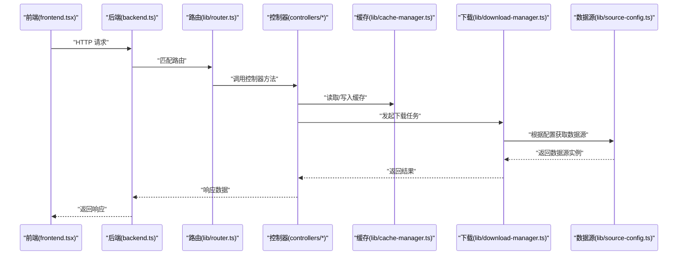
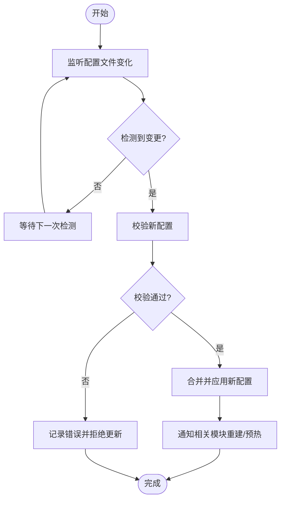
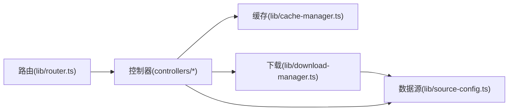

# 配置指南

<cite>
**本文引用的文件**
- [README.md](file://README.md)
- [package.json](file://package.json)
- [index.ts](file://index.ts)
- [backend.ts](file://backend.ts)
- [frontend.tsx](file://frontend.tsx)
- [lib/router.ts](file://lib/router.ts)
- [lib/controller.ts](file://lib/controller.ts)
- [lib/cache-manager.ts](file://lib/cache-manager.ts)
- [lib/download-manager.ts](file://lib/download-manager.ts)
- [lib/source-config.ts](file://lib/source-config.ts)
- [controllers/book.controller.ts](file://controllers/book.controller.ts)
- [controllers/cache.controller.ts](file://controllers/cache.controller.ts)
- [controllers/download.controller.ts](file://controllers/download.controller.ts)
- [controllers/source.controller.ts](file://controllers/source.controller.ts)
</cite>

## 目录
1. [简介](#简介)
2. [项目结构](#项目结构)
3. [核心组件](#核心组件)
4. [架构总览](#架构总览)
5. [详细组件分析](#详细组件分析)
6. [依赖关系分析](#依赖关系分析)
7. [性能考虑](#性能考虑)
8. [故障排查指南](#故障排查指南)
9. [结论](#结论)
10. [附录](#附录)

## 简介
本指南面向 Bun-zlib 项目的配置与部署，覆盖环境变量、运行时配置与部署选项。内容包含配置文件结构、默认值与自定义项、不同环境（开发/测试/生产）的配置示例、配置验证规则与最佳实践，以及配置热重载与动态更新机制的设计建议。同时给出安全与敏感信息管理策略，帮助你在多环境中稳定运行并快速排障。

## 项目结构
Bun-zlib 采用前后端同仓的模块化组织：后端入口、路由与控制器位于根目录与 controllers/lib 下；前端入口在 frontend.tsx；构建与脚本由 package.json 管理。配置相关的关键位置包括：
- 应用启动与端口绑定：index.ts、backend.ts
- 路由与控制器：lib/router.ts、controllers/*
- 缓存与下载管理器：lib/cache-manager.ts、lib/download-manager.ts
- 数据源配置：lib/source-config.ts
- 包管理与脚本：package.json

图表来源
- [index.ts](file://index.ts)
- [backend.ts](file://backend.ts)
- [lib/router.ts](file://lib/router.ts)
- [controllers/book.controller.ts](file://controllers/book.controller.ts)
- [controllers/cache.controller.ts](file://controllers/cache.controller.ts)
- [controllers/download.controller.ts](file://controllers/download.controller.ts)
- [controllers/source.controller.ts](file://controllers/source.controller.ts)
- [lib/cache-manager.ts](file://lib/cache-manager.ts)
- [lib/download-manager.ts](file://lib/download-manager.ts)
- [lib/source-config.ts](file://lib/source-config.ts)
- [frontend.tsx](file://frontend.tsx)
- [package.json](file://package.json)

章节来源
- [README.md](file://README.md)
- [package.json](file://package.json)
- [index.ts](file://index.ts)
- [backend.ts](file://backend.ts)

## 核心组件
- 应用入口与服务器：index.ts 负责初始化并启动后端服务；backend.ts 提供 HTTP 服务与基础中间件能力。
- 路由与控制器：lib/router.ts 集中注册路由；controllers/* 实现具体业务逻辑（书籍、缓存、下载、数据源）。
- 缓存与下载：lib/cache-manager.ts 管理缓存策略与存储；lib/download-manager.ts 处理并发下载、重试与限速。
- 数据源配置：lib/source-config.ts 定义数据源的加载、校验与合并策略。
- 前端入口：frontend.tsx 提供 UI 与交互，通常通过 API 与后端通信。
- 脚本与依赖：package.json 定义开发、构建与运行脚本，便于在不同环境切换配置。

章节来源
- [lib/router.ts](file://lib/router.ts)
- [lib/controller.ts](file://lib/controller.ts)
- [lib/cache-manager.ts](file://lib/cache-manager.ts)
- [lib/download-manager.ts](file://lib/download-manager.ts)
- [lib/source-config.ts](file://lib/source-config.ts)
- [controllers/book.controller.ts](file://controllers/book.controller.ts)
- [controllers/cache.controller.ts](file://controllers/cache.controller.ts)
- [controllers/download.controller.ts](file://controllers/download.controller.ts)
- [controllers/source.controller.ts](file://controllers/source.controller.ts)
- [frontend.tsx](file://frontend.tsx)
- [package.json](file://package.json)

## 架构总览
下图展示请求从前端到后端控制器、再到缓存与数据源的典型流程，以及配置读取与校验的位置。

图表来源
- [backend.ts](file://backend.ts)
- [lib/router.ts](file://lib/router.ts)
- [controllers/book.controller.ts](file://controllers/book.controller.ts)
- [controllers/cache.controller.ts](file://controllers/cache.controller.ts)
- [controllers/download.controller.ts](file://controllers/download.controller.ts)
- [controllers/source.controller.ts](file://controllers/source.controller.ts)
- [lib/cache-manager.ts](file://lib/cache-manager.ts)
- [lib/download-manager.ts](file://lib/download-manager.ts)
- [lib/source-config.ts](file://lib/source-config.ts)

## 详细组件分析

### 环境变量与运行时配置
- 常见环境变量
  - 端口与服务地址：用于控制监听端口与主机名，便于本地与容器化部署。
  - 日志级别：控制输出详细程度，开发环境更详细，生产环境更精简。
  - 缓存路径与大小：指定缓存目录、最大条目数或过期时间。
  - 下载并发与超时：限制并发数、重试次数与超时阈值。
  - 数据源开关与优先级：启用/禁用特定数据源，设置优先级与回退策略。
  - 安全密钥与令牌：用于签名、加密或鉴权，避免硬编码。
- 读取与合并策略
  - 优先使用环境变量，其次读取配置文件（如 .env、config.*），最后使用代码内默认值。
  - 支持按环境前缀区分（如 DEV_、TEST_、PROD_），便于统一管理与注入。
- 验证与错误处理
  - 启动时进行必填字段校验、类型检查与范围校验，失败则中止启动并输出明确错误。
  - 对可选字段提供默认值与降级策略，确保系统可用性。

章节来源
- [backend.ts](file://backend.ts)
- [lib/source-config.ts](file://lib/source-config.ts)
- [lib/cache-manager.ts](file://lib/cache-manager.ts)
- [lib/download-manager.ts](file://lib/download-manager.ts)

### 配置文件结构与默认值
- 推荐结构
  - 全局配置：服务端口、日志级别、跨域、静态资源路径等。
  - 模块配置：缓存、下载、数据源、认证等独立模块的配置对象。
  - 环境覆盖：针对 dev/test/prod 的差异化配置片段。
- 默认值设计
  - 为每个关键参数提供合理默认值，保证开箱即用。
  - 将易变参数（如端口、路径、开关）置于外部配置，减少代码变更。
- 示例（概念性）
  - 开发环境：开启详细日志、放宽限流、启用调试接口。
  - 测试环境：固定种子数据、缩短超时、关闭外部依赖。
  - 生产环境：最小化日志、严格限流、启用缓存与压缩。

章节来源
- [lib/source-config.ts](file://lib/source-config.ts)
- [package.json](file://package.json)

### 不同环境的配置示例
- 开发环境
  - 启用热重载与详细日志
  - 允许本地跨域与调试工具
  - 缓存与下载使用内存或临时目录
- 测试环境
  - 固定随机种子与模拟数据
  - 缩短超时与重试次数
  - 禁用对外部服务的真实访问
- 生产环境
  - 启用 HTTPS、压缩与缓存
  - 限制并发与速率限制
  - 使用持久化存储与监控告警

章节来源
- [package.json](file://package.json)
- [backend.ts](file://backend.ts)

### 配置验证规则与最佳实践
- 验证规则
  - 必填字段：端口、密钥、路径等不可为空。
  - 类型与格式：布尔、数字、字符串、枚举等严格校验。
  - 范围与约束：端口范围、超时阈值、并发上限等。
- 最佳实践
  - 使用环境变量注入敏感信息，避免提交到版本库。
  - 将配置分层（全局/模块/环境），提高可维护性。
  - 启动时输出已生效的配置摘要，便于审计与排障。
  - 对第三方依赖配置提供兼容层与降级策略。

章节来源
- [lib/source-config.ts](file://lib/source-config.ts)
- [lib/cache-manager.ts](file://lib/cache-manager.ts)
- [lib/download-manager.ts](file://lib/download-manager.ts)

### 配置热重载与动态更新机制
- 设计目标
  - 在不重启进程的情况下更新部分非敏感配置（如日志级别、缓存策略、开关）。
  - 对敏感配置（如密钥、令牌）要求重启以确保安全性。
- 实现要点
  - 监听配置文件变化事件，增量合并新配置。
  - 提供运行时 API 查询与更新配置，记录变更历史。
  - 对关键操作加锁，避免并发冲突。
  - 变更后触发必要的重建（如连接池、缓存预热）。
- 流程图

章节来源
- [lib/source-config.ts](file://lib/source-config.ts)
- [backend.ts](file://backend.ts)

### 安全与敏感信息管理
- 敏感信息
  - 密钥、令牌、密码等必须通过环境变量或密钥管理服务注入。
  - 禁止在代码或配置文件中明文出现敏感值。
- 传输与存储
  - 生产环境启用 HTTPS，强制安全头。
  - 敏感数据落盘需加密，定期轮换与清理。
- 访问控制
  - 对配置更新接口实施鉴权与审计。
  - 限制可动态更新的配置范围，防止越权修改。

章节来源
- [backend.ts](file://backend.ts)
- [lib/source-config.ts](file://lib/source-config.ts)

## 依赖关系分析
- 模块耦合
  - 控制器依赖缓存与下载管理器，后者依赖数据源配置。
  - 路由集中分发请求，降低控制器与路由的耦合度。
- 外部依赖
  - 网络请求、文件系统、缓存存储等外部资源通过抽象接口隔离，便于替换与测试。
- 潜在循环依赖
  - 避免控制器与配置模块互相引用，保持单向依赖。

图表来源
- [lib/router.ts](file://lib/router.ts)
- [controllers/book.controller.ts](file://controllers/book.controller.ts)
- [controllers/cache.controller.ts](file://controllers/cache.controller.ts)
- [controllers/download.controller.ts](file://controllers/download.controller.ts)
- [controllers/source.controller.ts](file://controllers/source.controller.ts)
- [lib/cache-manager.ts](file://lib/cache-manager.ts)
- [lib/download-manager.ts](file://lib/download-manager.ts)
- [lib/source-config.ts](file://lib/source-config.ts)

章节来源
- [lib/router.ts](file://lib/router.ts)
- [lib/controller.ts](file://lib/controller.ts)
- [lib/source-config.ts](file://lib/source-config.ts)

## 性能考虑
- 缓存策略
  - 合理设置 TTL 与容量，避免频繁 IO。
  - 使用多级缓存（内存+磁盘）提升命中率。
- 下载优化
  - 控制并发与限速，避免拥塞与封禁。
  - 断点续传与重试策略，提高稳定性。
- 日志与监控
  - 生产环境降低日志级别，减少 IO 开销。
  - 关键指标上报（QPS、延迟、错误率）。

[本节为通用指导，不直接分析具体文件]

## 故障排查指南
- 常见问题
  - 端口占用：检查端口是否被其他进程占用，调整端口或释放占用。
  - 权限不足：确认缓存目录与文件读写权限。
  - 网络异常：检查代理、防火墙与域名解析。
  - 配置错误：核对必填字段、类型与范围，查看启动日志。
- 定位步骤
  - 启用详细日志，复现问题并收集上下文。
  - 逐步禁用功能模块，缩小问题范围。
  - 使用健康检查接口验证服务状态。
- 恢复策略
  - 回滚到上一稳定配置版本。
  - 重启服务以重建连接与缓存。

章节来源
- [backend.ts](file://backend.ts)
- [lib/cache-manager.ts](file://lib/cache-manager.ts)
- [lib/download-manager.ts](file://lib/download-manager.ts)

## 结论
通过规范的环境变量与配置文件管理、严格的验证与安全的敏感信息管理，配合热重载与动态更新机制，Bun-zlib 可在多环境下稳定运行并快速迭代。建议在开发与生产之间建立一致的配置基线，并通过自动化脚本与 CI/CD 保障配置一致性。

[本节为总结性内容，不直接分析具体文件]

## 附录
- 常用命令
  - 安装依赖、启动服务、构建前端与后端。
- 参考文档
  - README 中的使用说明与贡献指南。

章节来源
- [README.md](file://README.md)
- [package.json](file://package.json)