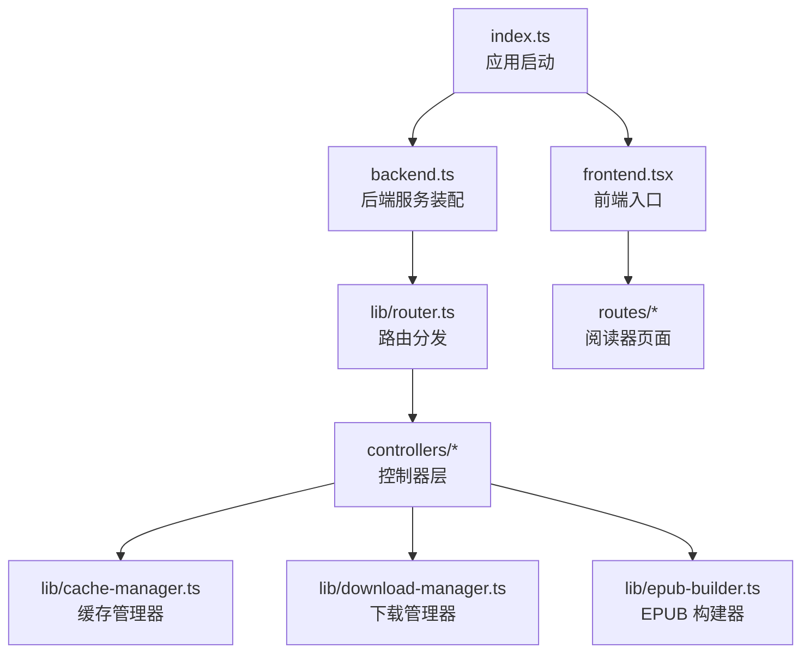
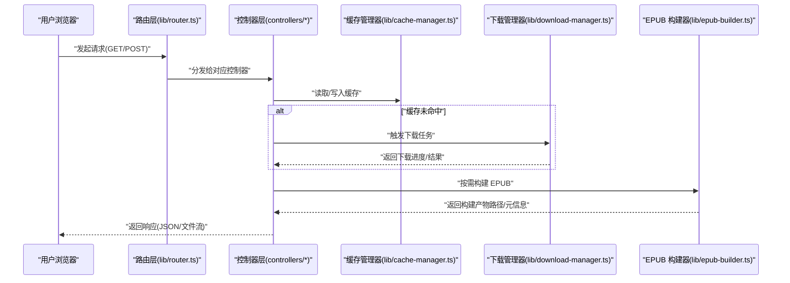
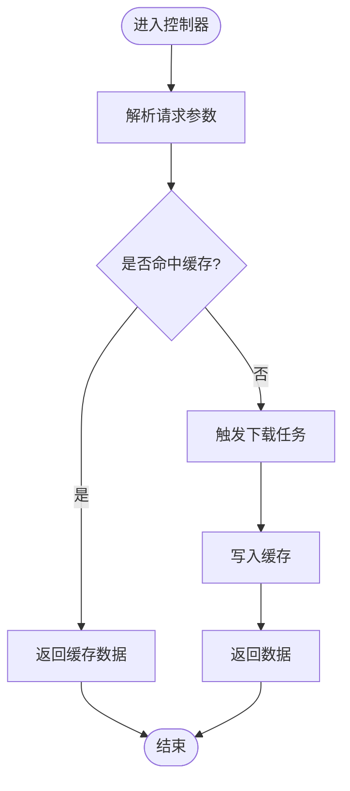
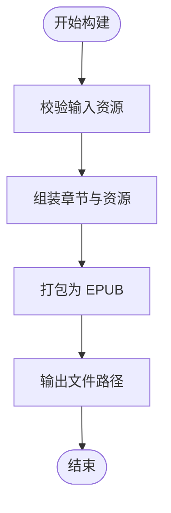
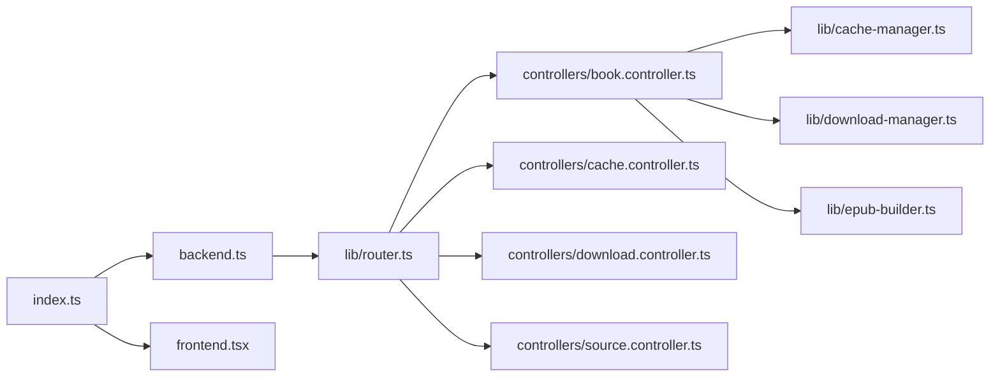

# 项目概述

<cite>
**本文引用的文件**   
- [README.md](file://README.md)
- [package.json](file://package.json)
- [index.ts](file://index.ts)
- [backend.ts](file://backend.ts)
- [frontend.tsx](file://frontend.tsx)
- [lib/router.ts](file://lib/router.ts)
- [lib/controller.ts](file://lib/controller.ts)
- [controllers/book.controller.ts](file://controllers/book.controller.ts)
- [controllers/cache.controller.ts](file://controllers/cache.controller.ts)
- [controllers/download.controller.ts](file://controllers/download.controller.ts)
- [controllers/source.controller.ts](file://controllers/source.controller.ts)
- [lib/cache-manager.ts](file://lib/cache-manager.ts)
- [lib/download-manager.ts](file://lib/download-manager.ts)
- [lib/epub-builder.ts](file://lib/epub-builder.ts)
- [routes/comic-reader.tsx](file://routes/comic-reader.tsx)
- [routes/novel-reader.tsx](file://routes/novel-reader.tsx)
</cite>

## 目录
1. [简介](#简介)
2. [项目结构](#项目结构)
3. [核心组件](#核心组件)
4. [架构总览](#架构总览)
5. [详细组件分析](#详细组件分析)
6. [依赖关系分析](#依赖关系分析)
7. [性能考量](#性能考量)
8. [故障排查指南](#故障排查指南)
9. [结论](#结论)
10. [附录：快速开始](#附录快速开始)

## 简介
Bun-zlib 是一个基于 Bun 运行时构建的数字内容管理与阅读工具，聚焦于漫画与小说内容的获取、缓存、下载与本地打包（EPUB），并提供简洁的阅读器界面。项目采用前后端同构思路，使用 TypeScript 保证类型安全，React 提供用户界面，并通过模块化与控制器分层实现清晰的职责边界。

主要目标
- 数字内容管理：统一抽象“来源”与“资源”，对漫画与小说进行一致化管理。
- 下载管理：支持并发控制、断点续传与任务状态跟踪。
- 缓存系统：多级缓存策略，减少重复请求与磁盘 I/O。
- EPUB 构建：将已下载内容打包为可阅读的 EPUB 文档。
- 阅读器界面：提供漫画与小说两种阅读体验。

技术栈选择
- 运行时：Bun（高性能 JS/TS 运行时）
- 前端：React + TypeScript
- 后端：Bun HTTP 服务 + 自定义路由与控制器
- 构建产物：EPUB（通过专用构建器）

整体架构模式
- MVC 风格：路由层 -> 控制器层 -> 业务库（缓存/下载/构建）-> 数据源
- 模块化设计：按功能域拆分 lib、controllers、routes 等目录，降低耦合度

与其他组件的关系
- 来源适配器：通过统一的来源接口对接不同站点或协议
- 文件系统：用于持久化缓存与下载的媒体资源
- EPUB 输出：由构建器生成标准电子书格式

章节来源
- [README.md](file://README.md)
- [package.json](file://package.json)

## 项目结构
项目采用“领域+层次”混合组织方式：
- controllers：HTTP 控制器，处理请求解析、参数校验与响应封装
- lib：核心业务库，包含缓存、下载、构建、查询、路由等能力
- routes：前端路由与页面组件（漫画/小说阅读器）
- components：通用 UI 组件
- index.ts / backend.ts / frontend.tsx：应用入口与前后端装配

图表来源
- [index.ts](file://index.ts)
- [backend.ts](file://backend.ts)
- [frontend.tsx](file://frontend.tsx)
- [lib/router.ts](file://lib/router.ts)
- [controllers/book.controller.ts](file://controllers/book.controller.ts)
- [controllers/cache.controller.ts](file://controllers/cache.controller.ts)
- [controllers/download.controller.ts](file://controllers/download.controller.ts)
- [controllers/source.controller.ts](file://controllers/source.controller.ts)
- [lib/cache-manager.ts](file://lib/cache-manager.ts)
- [lib/download-manager.ts](file://lib/download-manager.ts)
- [lib/epub-builder.ts](file://lib/epub-builder.ts)
- [routes/comic-reader.tsx](file://routes/comic-reader.tsx)
- [routes/novel-reader.tsx](file://routes/novel-reader.tsx)

章节来源
- [index.ts](file://index.ts)
- [backend.ts](file://backend.ts)
- [frontend.tsx](file://frontend.tsx)
- [lib/router.ts](file://lib/router.ts)

## 核心组件
- 路由与控制器
  - 路由负责将 URL 映射到具体控制器方法
  - 控制器负责解析请求、调用业务库并返回响应
- 缓存管理器
  - 提供缓存读写、失效与清理能力
  - 支持键空间隔离与过期策略
- 下载管理器
  - 维护下载任务队列、并发限制与进度回调
  - 支持任务状态机（待执行、进行中、完成、失败）
- EPUB 构建器
  - 读取已下载资源，组装元数据与章节结构
  - 输出符合规范的 EPUB 包
- 阅读器界面
  - 漫画阅读器：分页加载、缩放与导航
  - 小说阅读器：目录跳转、阅读进度保存

章节来源
- [lib/router.ts](file://lib/router.ts)
- [lib/controller.ts](file://lib/controller.ts)
- [controllers/book.controller.ts](file://controllers/book.controller.ts)
- [controllers/cache.controller.ts](file://controllers/cache.controller.ts)
- [controllers/download.controller.ts](file://controllers/download.controller.ts)
- [controllers/source.controller.ts](file://controllers/source.controller.ts)
- [lib/cache-manager.ts](file://lib/cache-manager.ts)
- [lib/download-manager.ts](file://lib/download-manager.ts)
- [lib/epub-builder.ts](file://lib/epub-builder.ts)
- [routes/comic-reader.tsx](file://routes/comic-reader.tsx)
- [routes/novel-reader.tsx](file://routes/novel-reader.tsx)

## 架构总览
下图展示了从浏览器到后端的完整请求链路，以及关键模块间的协作关系。

图表来源
- [lib/router.ts](file://lib/router.ts)
- [controllers/book.controller.ts](file://controllers/book.controller.ts)
- [controllers/cache.controller.ts](file://controllers/cache.controller.ts)
- [controllers/download.controller.ts](file://controllers/download.controller.ts)
- [controllers/source.controller.ts](file://controllers/source.controller.ts)
- [lib/cache-manager.ts](file://lib/cache-manager.ts)
- [lib/download-manager.ts](file://lib/download-manager.ts)
- [lib/epub-builder.ts](file://lib/epub-builder.ts)

## 详细组件分析

### 控制器层（MVC 中的 Controller）
职责
- 解析请求参数与头部
- 调用缓存/下载/构建等库
- 统一错误处理与响应格式

典型流程
- 列表/详情：优先查缓存，未命中则触发下载并回填缓存
- 构建：校验输入、收集资源、调用构建器、返回产物信息

图表来源
- [controllers/book.controller.ts](file://controllers/book.controller.ts)
- [controllers/cache.controller.ts](file://controllers/cache.controller.ts)
- [controllers/download.controller.ts](file://controllers/download.controller.ts)
- [controllers/source.controller.ts](file://controllers/source.controller.ts)

章节来源
- [lib/controller.ts](file://lib/controller.ts)
- [controllers/book.controller.ts](file://controllers/book.controller.ts)
- [controllers/cache.controller.ts](file://controllers/cache.controller.ts)
- [controllers/download.controller.ts](file://controllers/download.controller.ts)
- [controllers/source.controller.ts](file://controllers/source.controller.ts)

### 缓存管理器（Cache Manager）
能力
- 键值存取、命名空间隔离
- 过期时间与容量上限
- 同步/异步访问封装

复杂度与优化
- 内存缓存 O(1) 读写；磁盘落盘需考虑序列化开销
- 建议热点数据常驻内存，冷数据落盘

章节来源
- [lib/cache-manager.ts](file://lib/cache-manager.ts)

### 下载管理器（Download Manager）
能力
- 任务队列与并发限制
- 进度回调与重试机制
- 任务状态机（待执行/进行中/完成/失败）

并发模型
- 基于事件循环的任务调度，避免阻塞主线程
- 大文件分块下载与断点续传（如适用）

章节来源
- [lib/download-manager.ts](file://lib/download-manager.ts)

### EPUB 构建器（EPUB Builder）
能力
- 读取已下载资源与元数据
- 生成目录结构与样式
- 输出标准 EPUB 包

构建流程

图表来源
- [lib/epub-builder.ts](file://lib/epub-builder.ts)

章节来源
- [lib/epub-builder.ts](file://lib/epub-builder.ts)

### 阅读器界面（Reader UI）
- 漫画阅读器：图片分页、缩放、翻页动画
- 小说阅读器：目录树、阅读进度持久化、主题切换

章节来源
- [routes/comic-reader.tsx](file://routes/comic-reader.tsx)
- [routes/novel-reader.tsx](file://routes/novel-reader.tsx)

## 依赖关系分析
- 入口装配
  - index.ts 负责初始化后端与前端
  - backend.ts 注册路由与中间件
  - frontend.tsx 挂载 React 根组件
- 路由与控制器
  - lib/router.ts 提供路由分发
  - controllers/* 分别处理书籍、缓存、下载、来源相关逻辑
- 业务库
  - lib/cache-manager.ts、lib/download-manager.ts、lib/epub-builder.ts 被控制器组合调用

图表来源
- [index.ts](file://index.ts)
- [backend.ts](file://backend.ts)
- [frontend.tsx](file://frontend.tsx)
- [lib/router.ts](file://lib/router.ts)
- [controllers/book.controller.ts](file://controllers/book.controller.ts)
- [controllers/cache.controller.ts](file://controllers/cache.controller.ts)
- [controllers/download.controller.ts](file://controllers/download.controller.ts)
- [controllers/source.controller.ts](file://controllers/source.controller.ts)
- [lib/cache-manager.ts](file://lib/cache-manager.ts)
- [lib/download-manager.ts](file://lib/download-manager.ts)
- [lib/epub-builder.ts](file://lib/epub-builder.ts)

章节来源
- [index.ts](file://index.ts)
- [backend.ts](file://backend.ts)
- [frontend.tsx](file://frontend.tsx)
- [lib/router.ts](file://lib/router.ts)

## 性能考量
- 缓存命中率：合理设置 TTL 与容量上限，避免频繁网络请求
- 下载并发：根据目标站点限流策略调整并发度，避免被封禁
- 构建批处理：批量合并小资源，减少 I/O 次数
- 前端渲染：懒加载图片与虚拟滚动，降低首屏压力
- 内存占用：及时释放不再使用的对象引用，避免内存泄漏

[本节为通用指导，不直接分析具体文件]

## 故障排查指南
常见问题
- 缓存异常：检查键空间冲突与过期策略
- 下载失败：确认网络连通性与目标站点可用性，查看重试策略
- EPUB 构建失败：校验资源完整性与目录结构是否符合规范
- 路由 404：核对路由注册与请求路径大小写

定位步骤
- 在控制器层增加结构化日志，记录入参、缓存命中情况与下载任务 ID
- 观察下载管理器任务状态变化，定位卡住的任务
- 验证 EPUB 构建器的输入清单与输出路径权限

章节来源
- [controllers/book.controller.ts](file://controllers/book.controller.ts)
- [controllers/cache.controller.ts](file://controllers/cache.controller.ts)
- [controllers/download.controller.ts](file://controllers/download.controller.ts)
- [controllers/source.controller.ts](file://controllers/source.controller.ts)
- [lib/cache-manager.ts](file://lib/cache-manager.ts)
- [lib/download-manager.ts](file://lib/download-manager.ts)
- [lib/epub-builder.ts](file://lib/epub-builder.ts)

## 结论
Bun-zlib 以清晰的分层与模块化设计，将数字内容管理、下载、缓存与 EPUB 构建整合在一起，配合 React 阅读器形成端到端的解决方案。借助 Bun 的高性能运行时与 TypeScript 的类型保障，项目在易用性与可扩展性之间取得良好平衡。后续可在来源适配、缓存策略与构建质量方面持续优化。

[本节为总结性内容，不直接分析具体文件]

## 附录：快速开始
前置条件
- 安装 Bun 运行时
- 确保 Node 生态工具链可用（可选）

安装与运行
- 克隆仓库并进入项目目录
- 安装依赖
- 启动开发服务器
- 打开浏览器访问默认地址

基本使用示例
- 添加来源：通过来源控制器配置站点或协议
- 搜索与浏览：通过书籍控制器获取列表与详情
- 下载任务：提交下载任务并监控进度
- 构建 EPUB：选择已下载内容并生成电子书
- 在线阅读：在漫画/小说阅读器中查看内容

章节来源
- [README.md](file://README.md)
- [package.json](file://package.json)
- [index.ts](file://index.ts)
- [backend.ts](file://backend.ts)
- [frontend.tsx](file://frontend.tsx)
- [controllers/book.controller.ts](file://controllers/book.controller.ts)
- [controllers/cache.controller.ts](file://controllers/cache.controller.ts)
- [controllers/download.controller.ts](file://controllers/download.controller.ts)
- [controllers/source.controller.ts](file://controllers/source.controller.ts)
- [routes/comic-reader.tsx](file://routes/comic-reader.tsx)
- [routes/novel-reader.tsx](file://routes/novel-reader.tsx)